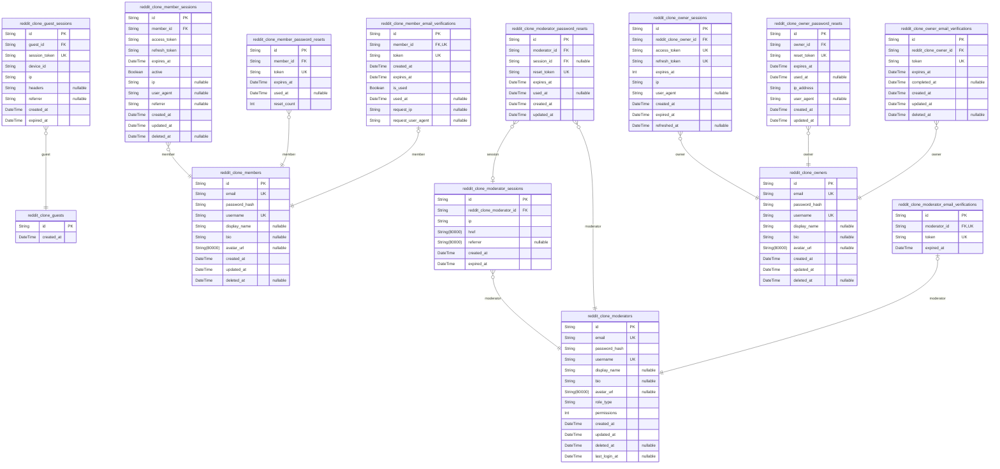
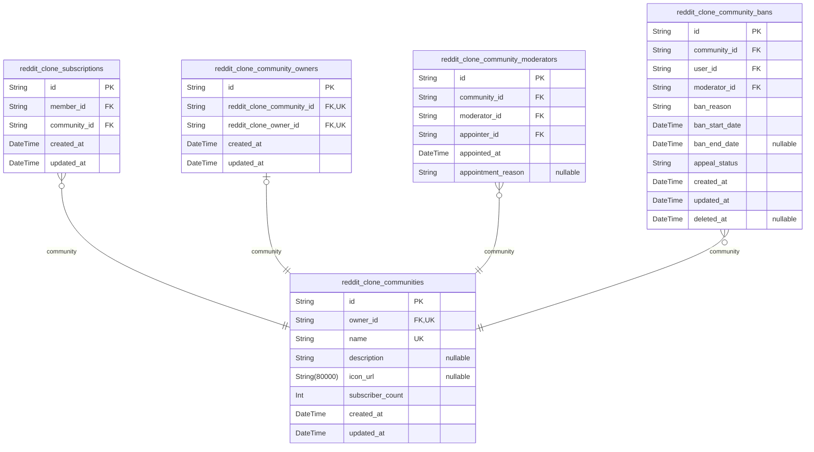
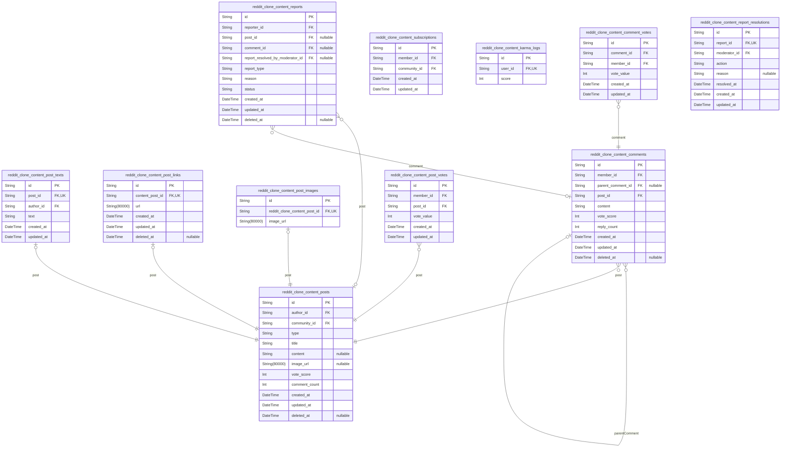
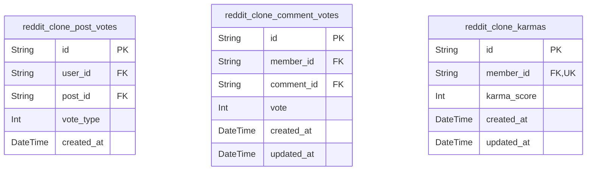
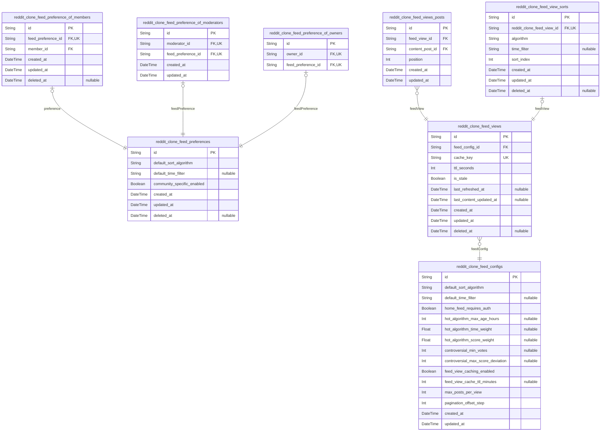
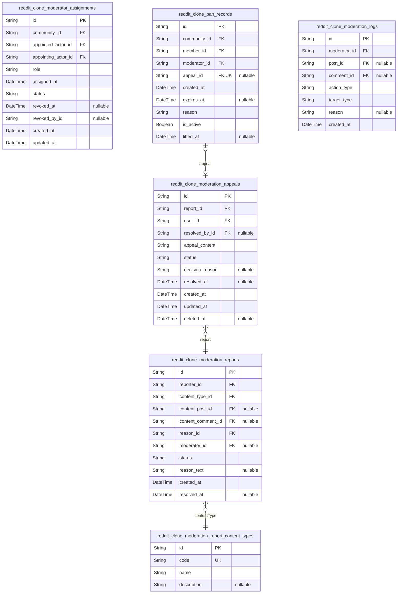
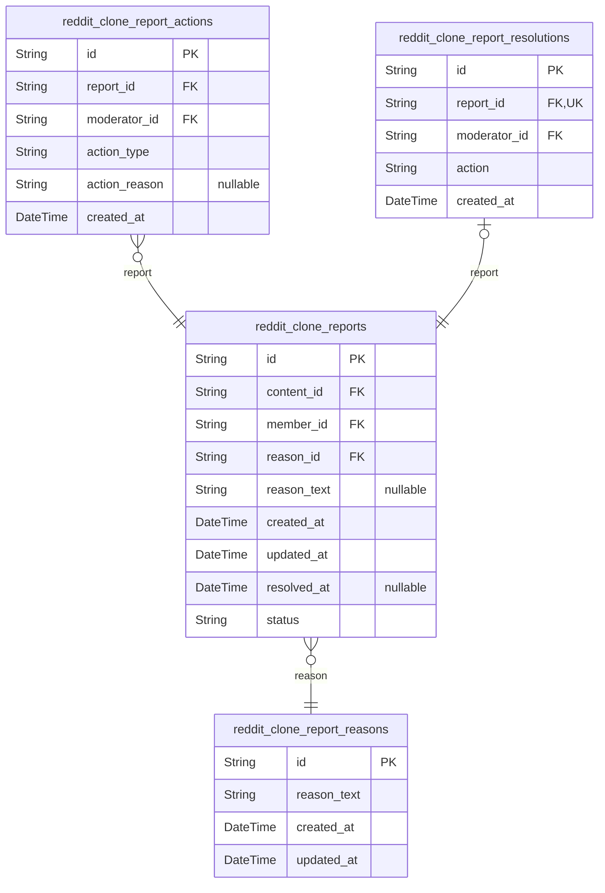

# Prisma Markdown

> Generated by [`prisma-markdown`](https://github.com/samchon/prisma-markdown)

- [Actors](#actors)
- [Community](#community)
- [Content](#content)
- [Voting](#voting)
- [Feeds](#feeds)
- [Moderation](#moderation)
- [Reporting](#reporting)

## Actors

### `reddit_clone_guests`

Guest actor table with minimal identification fields for anonymous
access. This table serves as a placeholder for foreign key relationships
where guest activity needs to be tracked in the system. Since guests
don't have authenticated accounts, this table contains minimal
identifying information and works in conjunction with the guest_sessions
table to track anonymous user activity patterns.

Properties as follows:

- `id`: Primary Key.
- `created_at`: When this guest record was created.

### `reddit_clone_guest_sessions`

Session tokens for guest access with device identification. Each guest
can have multiple sessions tracked by session token, device ID, and
connection metadata. Used for authentication and security auditing.

Properties as follows:

- `id`: Primary Key.
- `guest_id`
  > Guest user's [reddit_clone_guests.id](#reddit_clone_guests). Guest actor session belongs
  > to.
- `session_token`: Unique session token for authentication.
- `device_id`: Guest's device identifier for security tracking.
- `ip`: Connection IP address for security auditing.
- `headers`: HTTP headers for security analysis.
- `referrer`: HTTP referrer header for traffic tracking.
- `created_at`: Session start timestamp.
- `expired_at`: Session expiration timestamp.

### `reddit_clone_members`

Member actor table with email/password authentication and profile fields.
Members are authenticated users who can create posts, comments, vote on
content, subscribe to communities, and manage their profile. This table
serves as the canonical identity record for member actors and is
referenced by other tables via foreign keys.

Properties as follows:

- `id`: Primary Key.
- `email`: Unique email address for authentication and communication.
- `password_hash`
  > Hashed password for authentication. Stored securely using bcrypt or
  > similar algorithm.
- `username`: Unique username for display and identification across the platform.
- `display_name`: Display name shown in the UI, can be different from username.
- `bio`: User's biography or about section.
- `avatar_url`: URL to user's avatar image.
- `created_at`: Timestamp when the member account was created.
- `updated_at`: Timestamp when the member account was last updated.
- `deleted_at`
  > Timestamp when the member account was soft-deleted (nullable means active
  > account).

### `reddit_clone_member_sessions`

JWT session tokens with access and refresh support for member
authentication. Stores active sessions with token metadata, IP tracking,
and expiration management. Enables session revocation through soft
deletion.

Properties as follows:

- `id`: Primary Key.
- `member_id`: Belonged member's [reddit_clone_members.id](#reddit_clone_members).
- `access_token`: JWT access token for authentication. Short-lived token for API requests.
- `refresh_token`
  > JWT refresh token for token renewal. Long-lived token used to obtain new
  > access tokens.
- `expires_at`: Token expiration timestamp. After this time, access token is invalid.
- `active`
  > Session validity flag. true when both tokens are valid, false when
  > revoked or expired.
- `ip`: Client IP address at session creation.
- `user_agent`: HTTP User-Agent header from client device.
- `referrer`: HTTP Referer header indicating source of session initiation.
- `created_at`: Session creation timestamp.
- `updated_at`: Last update timestamp for token refresh or metadata changes.
- `deleted_at`
  > Soft deletion timestamp for session revocation. When set, session is
  > considered invalid.

### `reddit_clone_member_password_resets`

Password reset token records for member authentication. Stores temporary
tokens generated when members request password recovery. Each token is
valid for a specific time period and can only be used once. This table
serves as an audit trail for all password reset attempts.

Properties as follows:

- `id`: Primary Key.
- `member_id`: Member who requested password reset. [reddit_clone_members.id](#reddit_clone_members).
- `token`
  > Unique password reset token string. Generated cryptographically secure
  > random value.
- `expires_at`
  > Token expiration timestamp. Password reset requests become invalid after
  > this time.
- `used_at`
  > Timestamp when token was successfully used for password reset. NULL until
  > first use.
- `reset_count`
  > Number of times this token has been used. Value increases with each
  > successful password change using this token.

### `reddit_clone_member_email_verifications`

Email verification tokens for member account verification. Stores
temporary tokens sent to members to verify their email addresses during
registration or email change processes. Each token is unique and has a
limited validity period.

Properties as follows:

- `id`: Primary Key.
- `member_id`
  > Belongs to member [reddit_clone_members.id](#reddit_clone_members) requiring email
  > verification.
- `token`: Email verification token string that is sent to the user's email address.
- `created_at`: Timestamp when the email verification token was created.
- `expires_at`
  > Timestamp when the email verification token expires. Tokens are typically
  > valid for 24-48 hours.
- `is_used`: Whether the email verification token has been used (verified).
- `used_at`
  > Timestamp when the token was marked as used (verified). Set to null if
  > not yet used.
- `request_ip`: IP address of the user when they requested the email verification.
- `request_user_agent`: User agent string of the browser that requested the email verification.

### `reddit_clone_moderators`

Moderator actor table with elevated permissions and audit fields. Each
moderator is a distinct actor type with its own authentication flow,
profile data, and permission set. Moderators have authority to manage
content and users within communities they are assigned to through the
moderator_assignments table. Sessions for moderators are tracked
separately in reddit_clone_moderator_sessions table.

Properties as follows:

- `id`: Primary Key.
- `email`: Unique email address for authentication.
- `password_hash`: Securely hashed password for authentication.
- `username`: Unique display name for the moderator.
- `display_name`: Optional display name shown in UI.
- `bio`: Optional biographical text.
- `avatar_url`: URL to moderator's avatar image.
- `role_type`: Moderator role classification (e.g., 'moderator', 'owner').
- `permissions`: Bitmask or numeric representation of moderator permissions.
- `created_at`: Timestamp when moderator account was created.
- `updated_at`: Timestamp when moderator account was last updated.
- `deleted_at`: Timestamp when moderator account was deleted (soft delete).
- `last_login_at`: Timestamp of moderator's last login.

### `reddit_clone_moderator_sessions`

JWT session tokens with access and refresh support for moderator
authentication.

This table tracks all active and expired login sessions for moderator
users, capturing connection metadata and temporal information for
security auditing. Each session belongs to exactly one moderator and
maintains an audit trail of authentication events.

Key purposes:
- Track active and expired moderator sessions
- Store connection context for security auditing
- Support access and refresh token validation
- Enable session-based security analysis

@link reddit_clone_moderators.id - Each session belongs to exactly one
moderator

Properties as follows:

- `id`: Primary Key.
- `reddit_clone_moderator_id`: Moderator's [reddit_clone_moderators.id](#reddit_clone_moderators).
- `ip`: IP address of the client at session creation.
- `href`: Current URL path when session was created.
- `referrer`: HTTP referrer header value when session was created.
- `created_at`: Timestamp when the session was created.
- `expired_at`: Timestamp when the session expires and becomes invalid.

### `reddit_clone_moderator_password_resets`

Password reset tokens with expiration for moderator password recovery.
Stores one-time use tokens that are invalidated after successful password
change or expiration.

Properties as follows:

- `id`: Primary Key.
- `moderator_id`: Moderator requesting password reset. [reddit_clone_moderators.id](#reddit_clone_moderators).
- `session_id`
  > Target session to invalidate after password change. {@link
  > reddit_clone_moderator_sessions.id}.
- `reset_token`: Unique password reset token. Hashed before storage for security.
- `expires_at`: Token expiration timestamp. Tokens expire after 24 hours.
- `used_at`
  > Timestamp when token was successfully used for password reset. NULL if
  > not used yet.
- `created_at`
  > Record creation timestamp. Automatically set when reset request is
  > created.
- `updated_at`: Record last update timestamp. Automatically updated on any change.

### `reddit_clone_moderator_email_verifications`

Email verification tokens for moderator account verification. Stores
tokens sent to moderators to verify their email addresses during
registration. Each moderator has one active verification token at a time.

Properties as follows:

- `id`: Primary Key.
- `moderator_id`
  > The moderator account that needs email verification. {@link
  > reddit_clone_moderators.id}.
- `token`: Unique verification token sent to the moderator's email address.
- `expired_at`: Timestamp when the email verification expires.

### `reddit_clone_owners`

Owner actor table with highest authority permissions in the community.
Owners have full moderation capabilities including appointing/removing
moderators, managing community settings, and maintaining complete control
over their communities. This table stores authentication credentials and
profile information for owners.

Properties as follows:

- `id`: Primary Key.
- `email`: Unique email address for authentication.
- `password_hash`: BCrypt hashed password for authentication security.
- `username`: Unique username for display and identification.
- `display_name`: Display name shown on the platform.
- `bio`: User biography text.
- `avatar_url`: URL to user's avatar image.
- `created_at`: Account creation timestamp.
- `updated_at`: Last update timestamp.
- `deleted_at`: Account deletion timestamp (soft delete).

### `reddit_clone_owner_sessions`

JWT session tokens for owner authentication with access/refresh tokens
and session metadata.

Properties as follows:

- `id`: Primary Key.
- `reddit_clone_owner_id`: Owner who owns this session. [reddit_clone_owners.id](#reddit_clone_owners).
- `access_token`
  > Access token for JWT authentication. Used for API requests to prove
  > ownership of the session.
- `refresh_token`
  > Refresh token for obtaining new access tokens. Stored securely and used
  > when access tokens expire.
- `expires_at`: Token expiration time in seconds from Unix epoch.
- `ip`: IP address of the client that initiated this session.
- `user_agent`: User agent string of the client's browser or application.
- `created_at`: Timestamp when the session was created.
- `expired_at`
  > Timestamp when the session expires. Used for automatic logout and token
  > refresh management.
- `refreshed_at`
  > Timestamp when the session was last refreshed. Used for tracking session
  > activity and implementing idle timeouts.

### `reddit_clone_owner_password_resets`

Password reset tokens for owner actor accounts. Stores secure reset
tokens with expiration timestamps and reset request metadata for audit
trail.

Each owner can have multiple reset tokens (e.g., from different devices
or failed reset attempts), but only unexpired tokens are valid for
password recovery. Tokens are single-use and marked as used immediately
after successful password reset.

**Security Features:**
- Time-limited expiration (typically 24 hours)
- Single-use tokens marked with used_at field
- Audit logging of reset request IP and user agent
- Link to specific owner account for validation

Properties as follows:

- `id`: Primary Key.
- `owner_id`: Owner account requesting password reset. [reddit_clone_owners.id](#reddit_clone_owners).
- `reset_token`
  > Unique secure reset token (UUID-based hash). Used to identify password
  > reset requests without exposing internal IDs.
- `expires_at`: Token expiration timestamp. Password reset is invalid after this time.
- `used_at`
  > Timestamp when token was successfully used for password reset. NULL
  > indicates token not yet used or expired.
- `ip_address`
  > IP address from which reset was requested. For security audit and fraud
  > detection.
- `user_agent`
  > Browser user agent string from reset request. For device fingerprinting
  > and security monitoring.
- `created_at`: Token creation timestamp. Records when password reset was requested.
- `updated_at`: Last update timestamp. Automatically refreshed on any token modification.

### `reddit_clone_owner_email_verifications`

Email verification tokens for owner account verification with unique
token constraint and expiration tracking

Properties as follows:

- `id`: Primary Key.
- `reddit_clone_owner_id`: Belonged owner's [reddit_clone_owners.id](#reddit_clone_owners)
- `token`: Unique verification token sent to owner's email address
- `expires_at`: Expiration timestamp for the verification token
- `completed_at`: Timestamp when the verification was completed (null if pending)
- `created_at`: Creation timestamp for audit trail
- `updated_at`: Last update timestamp for tracking changes
- `deleted_at`: Optional deletion timestamp for soft delete support

## Community

### `reddit_clone_communities`

Community entities that serve as content organization units. Each
community has a unique name, description, and optional icon. Communities
enable topic-based content grouping and user subscription management.

Properties as follows:

- `id`: Primary Key.
- `owner_id`: Community owner reference [reddit_clone_owners.id](#reddit_clone_owners).
- `name`: Unique community identifier.
- `description`: Community description text.
- `icon_url`: Community icon image URL.
- `subscriber_count`: Current subscriber count.
- `created_at`: Creation timestamp.
- `updated_at`: Last update timestamp.

### `reddit_clone_subscriptions`

User subscription relationships to communities. Enforces the business
rule that members must be subscribed to a community before creating posts
in that community. Each subscription record links a member to a community
with tracking timestamps.

Properties as follows:

- `id`: Primary Key.
- `member_id`: Referenced member's [reddit_clone_members.id](#reddit_clone_members).
- `community_id`: Referenced community's [reddit_clone_communities.id](#reddit_clone_communities).
- `created_at`: When the subscription was created.
- `updated_at`: When the subscription was last modified.

### `reddit_clone_community_owners`

Community ownership records mapping communities to owners

Properties as follows:

- `id`: Primary Key.
- `reddit_clone_community_id`: The community being owned. [reddit_clone_communities.id](#reddit_clone_communities).
- `reddit_clone_owner_id`: The owner of the community. [reddit_clone_owners.id](#reddit_clone_owners).
- `created_at`: Timestamp when the ownership relationship was established.
- `updated_at`: Timestamp of the last update to the ownership record.

### `reddit_clone_community_moderators`

Community moderator assignments linking moderators to communities with
role hierarchy. Each record establishes a moderator relationship between
a user and a community, with the owner relationship having higher
authority than moderator relationships.

Properties as follows:

- `id`: Primary Key.
- `community_id`: The community being moderated. [reddit_clone_communities.id](#reddit_clone_communities).
- `moderator_id`
  > The user acting as moderator. [reddit_clone_members.id](#reddit_clone_members), {@link
  > reddit_clone_owners.id}, or [reddit_clone_moderators.id](#reddit_clone_moderators).
- `appointer_id`: The user who appointed this moderator. [reddit_clone_owners.id](#reddit_clone_owners).
- `appointed_at`: Timestamp when this moderator relationship was established.
- `appointment_reason`: Optional reason or note for the moderator appointment.

### `reddit_clone_community_bans`

Community ban records that track user bans with duration, reason, and
appeal status. Stores temporary and permanent bans per community with
full audit trail for moderation workflows.

Properties as follows:

- `id`: Primary Key.
- `community_id`: Target community's [reddit_clone_communities.id](#reddit_clone_communities).
- `user_id`: Banned user's [reddit_clone_members.id](#reddit_clone_members).
- `moderator_id`: Moderator who executed the ban's [reddit_clone_moderators.id](#reddit_clone_moderators).
- `ban_reason`: Moderator-provided reason for the ban.
- `ban_start_date`: Timestamp when the ban takes effect.
- `ban_end_date`: Timestamp when temporary ban expires (null for permanent bans).
- `appeal_status`: Current appeal status (pending, approved, denied).
- `created_at`: Record creation timestamp.
- `updated_at`: Record last update timestamp.
- `deleted_at`: Soft delete timestamp.

## Content

### `reddit_clone_content_posts`

Main post entity supporting text, link, and image post types with mutual
exclusivity through type discriminator. Each post belongs to exactly one
community and one author. Contains denormalized vote_score and
comment_count counters for performance optimization. Text posts store
content directly, link posts store URL, and image posts store image URL.
All post types share the same base table with type discrimination.

Properties as follows:

- `id`: Primary Key.
- `author_id`
  > Author user's [reddit_clone_members.id](#reddit_clone_members). Required - every post must
  > have an author.
- `community_id`
  > Target community's [reddit_clone_communities.id](#reddit_clone_communities). Required - posts
  > must belong to a community.
- `type`
  > Post type discriminator: 'text', 'link', or 'image'. Enforces mutual
  > exclusivity of post types.
- `title`: Post title (required). Used for display and search.
- `content`
  > Post content - text content for text posts, URL for link posts, null for
  > image posts.
- `image_url`: Image URL for image posts. Only populated for image post type.
- `vote_score`
  > Calculated vote score (upvotes - downvotes). Denormalized counter for
  > performance.
- `comment_count`
  > Total number of comments on this post. Denormalized counter for
  > performance.
- `created_at`: When this post was created. Used for sorting and feed generation.
- `updated_at`: When this post was last updated. Used for tracking edits.
- `deleted_at`
  > Soft delete timestamp. Null if active, populated when post is deleted by
  > user or moderator.

### `reddit_clone_content_post_texts`

Text content for text posts

Properties as follows:

- `id`: Primary Key.
- `post_id`: Belongs to the parent post. [reddit_clone_content_posts.id](#reddit_clone_content_posts)
- `author_id`: Author who created this text content. [reddit_clone_members.id](#reddit_clone_members)
- `text`: The actual text content of the post
- `created_at`: When this text content was created
- `updated_at`: When this text content was last updated

### `reddit_clone_content_post_links`

URL links for link posts. Each record links a specific URL to a post,
storing the destination URL and metadata about the link.

Properties as follows:

- `id`: Primary Key.
- `content_post_id`: The associated post's [reddit_clone_content_posts.id](#reddit_clone_content_posts).
- `url`: The URL destination for this link post.
- `created_at`: Timestamp when this link was created.
- `updated_at`: Timestamp when this link was last updated.
- `deleted_at`: Soft delete timestamp. Null if not deleted.

### `reddit_clone_content_post_images`

Image URLs for image posts

Properties as follows:

- `id`: Primary Key.
- `reddit_clone_content_post_id`: Belonged post's [reddit_clone_content_posts.id](#reddit_clone_content_posts)
- `image_url`: Image file URL stored in cloud storage

### `reddit_clone_content_comments`

Comment entity with multi-level reply support and vote tracking.

Properties as follows:

- `id`: Primary Key.
- `member_id`: Author of the comment. [reddit_clone_members.id](#reddit_clone_members).
- `parent_comment_id`
  > Parent comment for nested replies. {@link
  > reddit_clone_content_comments.id}. Nullable for top-level comments.
- `post_id`: Post this comment belongs to. [reddit_clone_content_posts.id](#reddit_clone_content_posts).
- `content`: Comment content text.
- `vote_score`: Vote score (upvotes - downvotes).
- `reply_count`: Number of nested replies.
- `created_at`: Timestamp when comment was created.
- `updated_at`: Timestamp when comment was last updated.
- `deleted_at`: Optional timestamp when comment was soft-deleted.

### `reddit_clone_content_post_votes`

Post voting records with upvote/downvote tracking. Stores user votes on
posts with upvote (+1), downvote (-1), or no vote (0) states. Enforces
one-vote-per-user-per-post rule via composite unique constraint on
user_id and post_id.

Properties as follows:

- `id`: Primary Key.
- `member_id`: The user who cast the vote. [reddit_clone_members.id](#reddit_clone_members)
- `post_id`: The post being voted on. [reddit_clone_content_posts.id](#reddit_clone_content_posts)
- `vote_value`: Vote value: +1 for upvote, -1 for downvote, 0 for no vote (removed).
- `created_at`: Timestamp when the vote was created.
- `updated_at`: Timestamp when the vote was last updated.

### `reddit_clone_content_comment_votes`

User votes on comments with upvote (+1), downvote (-1), or no vote (0)
states. Enforces one-vote-per-user-per-comment rule via composite unique
constraint on user_id and comment_id.

Properties as follows:

- `id`: Primary Key.
- `comment_id`
  > Reference to the comment being voted on. {@link
  > reddit_clone_content_comments.id}.
- `member_id`: Reference to the user who cast the vote. [reddit_clone_members.id](#reddit_clone_members).
- `vote_value`: Vote value: +1 for upvote, -1 for downvote, 0 for no vote (removed).
- `created_at`: Timestamp when the vote was created.
- `updated_at`: Timestamp when the vote was last updated.

### `reddit_clone_content_subscriptions`

User subscriptions to communities for home feed functionality. Each user
can subscribe to multiple communities and each community can have
multiple subscribers. This table tracks the subscription relationships
and prevents duplicate subscriptions through unique constraints.

Properties as follows:

- `id`: Primary Key.
- `member_id`: Belonged member's [reddit_clone_members.id](#reddit_clone_members).
- `community_id`: Belonged community's [reddit_clone_communities.id](#reddit_clone_communities).
- `created_at`: Subscription creation timestamp.
- `updated_at`: Subscription last update timestamp.

### `reddit_clone_content_karma_logs`

Tracks user karma scores based on post/comment votes. Each user has
exactly one karma record that is updated when votes are cast, changed, or
removed. Karma can be negative and reflects the user's contribution
quality across the platform.

Properties as follows:

- `id`: Primary Key.
- `user_id`
  > User who owns this karma score. [reddit_clone_members.id](#reddit_clone_members) or {@link
  > reddit_clone_owners.id} or [reddit_clone_moderators.id](#reddit_clone_moderators).
- `score`
  > Current karma score. Positive for upvote-heavy content, negative for
  > downvote-heavy content.

### `reddit_clone_content_reports`

User-submitted reports of inappropriate content. Reports are created by
authenticated users who flag posts or comments for moderator review. Each
report includes the reporter information, reported content reference,
reason text provided by the reporter, and status tracking
(pending/approved/dismissed). Reports form the foundation of the
community-driven content moderation system, allowing moderators to review
flagged content and take appropriate action.

The report system supports two types of content: posts and comments. The
table distinguishes between these using the report_type field. When a
moderator approves a report, the content is deleted and the report status
is updated to approved. When a moderator dismisses a report, the report
status is updated to dismissed without deleting the content.

Reports are linked to the content they reference, the user who created
them, and the moderator who resolved them. The system maintains a
complete audit trail of all report lifecycle events.

Properties as follows:

- `id`: Primary Key.
- `reporter_id`: The member who created this report. [reddit_clone_members.id](#reddit_clone_members).
- `post_id`
  > The reported post (if report is for a post). {@link
  > reddit_clone_content_posts.id}.
- `comment_id`
  > The reported comment (if report is for a comment). {@link
  > reddit_clone_content_comments.id}.
- `report_resolved_by_moderator_id`
  > The moderator who resolved this report (approved/dismissed). {@link
  > reddit_clone_moderator_assignments.id}.
- `report_type`
  > Type of content being reported: 'post' or 'comment'. Determines whether
  > post_id or comment_id is referenced.
- `reason`
  > Reason text provided by the reporter when creating the report. Explains
  > why the content was flagged.
- `status`
  > Current status of the report: 'pending' (awaiting review), 'approved'
  > (content deleted by moderator), or 'dismissed' (no action taken by
  > moderator).
- `created_at`: When the report was created.
- `updated_at`: When the report was last updated (including status changes).
- `deleted_at`: Soft delete timestamp. NULL if not deleted, timestamp if deleted.

### `reddit_clone_content_report_resolutions`

Report resolution records tracking moderator decisions (approve/dismiss)
on content reports. Each report has exactly one resolution that
determines whether the reported content is deleted (approved) or
preserved (dismissed).

Properties as follows:

- `id`: Primary Key.
- `report_id`: Report that was resolved. [reddit_clone_reports.id](#reddit_clone_reports).
- `moderator_id`: Moderator who resolved the report. [reddit_clone_moderators.id](#reddit_clone_moderators).
- `action`
  > Resolution action taken: 'approve' (delete content) or 'dismiss' (keep
  > content).
- `reason`: Explanation provided by moderator for the resolution decision.
- `resolved_at`: Timestamp when moderator made the resolution decision.
- `created_at`: Timestamp when the resolution record was created.
- `updated_at`: Timestamp when the resolution record was last updated.

## Voting

### `reddit_clone_post_votes`

Stores user votes on posts with upvote (+1), downvote (-1), or no vote
(0) states. Enforces one-vote-per-user-per-post rule via composite unique
constraint on user_id and post_id.

Properties as follows:

- `id`: Primary Key.
- `user_id`: User who created the vote. [reddit_clone_members.id](#reddit_clone_members)
- `post_id`: Post that was voted on. [reddit_clone_content_posts.id](#reddit_clone_content_posts)
- `vote_type`: Vote type: +1 for upvote, -1 for downvote, 0 for no vote
- `created_at`: Timestamp when the vote was cast

### `reddit_clone_comment_votes`

Stores user votes on comments with upvote (+1), downvote (-1), or no vote
(0) states. Enforces one-vote-per-user-per-comment rule via composite
unique constraint on member_id and comment_id.

Properties as follows:

- `id`: Primary Key.
- `member_id`: Member who cast the vote. [reddit_clone_members.id](#reddit_clone_members).
- `comment_id`: Comment being voted on. [reddit_clone_content_comments.id](#reddit_clone_content_comments).
- `vote`: Vote value: +1 for upvote, -1 for downvote, 0 for no vote.
- `created_at`: Timestamp when the vote was cast.
- `updated_at`: Timestamp when the vote was last updated.

### `reddit_clone_karmas`

Tracks user karma scores that are automatically updated when votes are
cast, changed, or removed on the user's posts and comments. Each user has
exactly one karma record established upon account creation.

Properties as follows:

- `id`: Primary Key.
- `member_id`: The user whose karma is being tracked. [reddit_clone_members.id](#reddit_clone_members).
- `karma_score`
  > Current karma score calculated as sum of all upvotes minus downvotes
  > received on user's posts and comments. Can be negative.
- `created_at`: When this karma record was created (account creation time).
- `updated_at`: When this karma score was last updated.

## Feeds

### `reddit_clone_feed_configs`

Global feed configuration settings including default sort algorithm, time
filters for top sorting, and feed-specific settings.

Properties as follows:

- `id`: Primary Key.
- `default_sort_algorithm`: Default sort algorithm for feeds (hot, new, top, controversial)
- `default_time_filter`: Default time filter for top sorting (today, week, month, year, all)
- `home_feed_requires_auth`: Flag indicating if home feed requires authentication
- `hot_algorithm_max_age_hours`: Maximum post age in hours for hot algorithm calculation
- `hot_algorithm_time_weight`: Weight factor for time decay in hot algorithm (0.0-1.0)
- `hot_algorithm_score_weight`: Weight factor for score in hot algorithm (0.0-1.0)
- `controversial_min_votes`: Minimum votes required for controversial algorithm
- `controversial_max_score_deviation`: Maximum score deviation from zero for controversial algorithm
- `feed_view_caching_enabled`: Flag indicating if feed views are cached
- `feed_view_cache_ttl_minutes`: Default cache TTL in minutes for feed views
- `max_posts_per_view`: Maximum number of posts per feed view
- `pagination_offset_step`: Number of posts to skip for pagination offset
- `created_at`: Timestamp when this configuration was created
- `updated_at`: Timestamp when this configuration was last updated

### `reddit_clone_feed_preferences`

Main entity for user feed configuration that supports polymorphic
ownership through subtype tables. Stores core feed preference settings
including default sorting algorithm, time filters for top sorting, and
community-specific feed settings. References to specific actor types
(member, moderator, owner) are handled through separate subtype tables to
ensure exactly one actor reference per preference record.

Properties as follows:

- `id`: Primary Key.
- `default_sort_algorithm`: Default sorting algorithm for feeds (hot/new/top/controversial).
- `default_time_filter`
  > Default time filter for top sorting (today, this_week, this_month,
  > this_year, all_time).
- `community_specific_enabled`: Whether community-specific feed settings are enabled for this user.
- `created_at`: Record creation timestamp.
- `updated_at`: Record last update timestamp.
- `deleted_at`: Soft delete timestamp for user preferences deletion.

### `reddit_clone_feed_views`

Cached feed views representing pre-computed result sets for efficient
feed delivery with specific sorting applied. Stores feed configuration
templates, sorting algorithm parameters, and post caching metadata for
home, popular, and community feeds.

Properties as follows:

- `id`: Primary Key.
- `feed_config_id`: Feed configuration template's [reddit_clone_feed_configs.id](#reddit_clone_feed_configs).
- `cache_key`
  > Unique cache identifier for this feed view configuration (e.g.,
  > 'home_hot_today').
- `ttl_seconds`: Time-to-live in seconds for cache expiration.
- `is_stale`
  > Whether this cached view needs refresh (true = needs refresh, false =
  > fresh).
- `last_refreshed_at`: Timestamp when this feed view was last refreshed with fresh data.
- `last_content_updated_at`
  > Timestamp of the most recent content update that affects this feed view's
  > content.
- `created_at`: Creation timestamp.
- `updated_at`: Last update timestamp.
- `deleted_at`: Soft delete timestamp (nullable = not deleted).

### `reddit_clone_feed_views_posts`

Junction table mapping posts to feed views with position ordering for
efficient pagination and content display. Stores the relationship between
cached feed views and the posts they contain, maintaining the specific
ordering required for each feed view's sort algorithm.

Properties as follows:

- `id`: Primary Key.
- `feed_view_id`
  > Reference to the feed view this post belongs to. {@link
  > reddit_clone_feed_views.id}
- `content_post_id`
  > Reference to the post content in this feed view. {@link
  > reddit_clone_content_posts.id}
- `position`
  > Position of this post within the feed view for ordering purposes. Lower
  > values appear first in the feed.
- `created_at`
  > When this post was added to the feed view. Used for timestamp-based
  > sorting algorithms.
- `updated_at`: Last update timestamp for this feed view post mapping.

### `reddit_clone_feed_view_sorts`

Tracks feed view sorting configurations including algorithm type
(hot/new/top/controversial) and time filter parameters for efficient feed
retrieval.

Properties as follows:

- `id`: Primary Key.
- `reddit_clone_feed_view_id`: Belonged feed view's [reddit_clone_feed_views.id](#reddit_clone_feed_views).
- `algorithm`: Algorithm type for feed sorting (hot, new, top, controversial).
- `time_filter`
  > Time filter parameter for top sorting (today, this_week, this_month,
  > this_year, all_time).
- `sort_index`: Sort order index for pagination.
- `created_at`: Timestamp when this sort configuration was created.
- `updated_at`: Timestamp when this sort configuration was last updated.
- `deleted_at`: Timestamp when this sort configuration was deleted (soft delete).

### `reddit_clone_feed_preference_of_members`

Member-specific feed preference with unique constraint on
feed_preference_id to ensure exactly one preference per member.

Properties as follows:

- `id`: Primary Key.
- `feed_preference_id`
  > Belongs to the feed_preference record. {@link
  > reddit_clone_feed_preferences.id}.
- `member_id`
  > References the member actor who owns this preference. {@link
  > reddit_clone_members.id}.
- `created_at`: Timestamp when this preference was created.
- `updated_at`: Timestamp when this preference was last updated.
- `deleted_at`: Optional timestamp when this preference was soft-deleted.

### `reddit_clone_feed_preference_of_moderators`

Moderator-specific feed preference with unique constraint on
feed_preference_id to ensure exactly one preference per moderator.

Properties as follows:

- `id`: Primary Key.
- `moderator_id`: Belonged moderator's [reddit_clone_moderators.id](#reddit_clone_moderators).
- `feed_preference_id`: Belonged feed preference's [reddit_clone_feed_preferences.id](#reddit_clone_feed_preferences).
- `created_at`: Record creation timestamp.
- `updated_at`: Record update timestamp.

### `reddit_clone_feed_preference_of_owners`

Owner-specific feed preference with unique constraint on
feed_preference_id to ensure exactly one preference per owner.

Properties as follows:

- `id`: Primary Key.
- `owner_id`: Owner who owns this feed preference. [reddit_clone_owners.id](#reddit_clone_owners).
- `feed_preference_id`
  > Feed preference template for owners. {@link
  > reddit_clone_feed_preferences.id}.

## Moderation

### `reddit_clone_moderator_assignments`

Records of moderator appointments with role hierarchy (owner has all
permissions, moderator can only appoint other moderators). This table
tracks which actor appointed which moderator to which community,
establishing the authority chain for community governance.

Properties as follows:

- `id`: Primary Key.
- `community_id`: Community being moderated. [reddit_clone_communities.id](#reddit_clone_communities).
- `appointed_actor_id`
  > The actor who is being appointed as moderator/owner. {@link
  > reddit_clone_members.id}.
- `appointing_actor_id`
  > The actor who is making the appointment (must have authority over the
  > community). [reddit_clone_members.id](#reddit_clone_members).
- `role`
  > Role type: 'owner' (highest authority) or 'moderator' (content management
  > authority). Required to distinguish permission levels.
- `assigned_at`
  > Timestamp when the appointment was made. Used for audit trail and
  > appointment history.
- `status`: Current status of the appointment: 'active', 'revoked', or 'expired'.
- `revoked_at`
  > When the appointment was revoked (if applicable). Nullable for active
  > appointments.
- `revoked_by_id`: Actor who revoked this appointment (if applicable).
- `created_at`: When the record was created.
- `updated_at`: When the record was last updated.

### `reddit_clone_ban_records`

Records community-specific user bans with duration, reason, and appeal
tracking. Each ban applies to a specific community and user pair, with
optional appeal records for moderation review.

Properties as follows:

- `id`: Primary Key.
- `community_id`
  > The community from which the user is banned. {@link
  > reddit_clone_communities.id}.
- `member_id`: The user who is banned. [reddit_clone_members.id](#reddit_clone_members).
- `moderator_id`: The moderator who issued the ban. [reddit_clone_moderators.id](#reddit_clone_moderators).
- `appeal_id`
  > The appeal record for this ban if the user challenges it. {@link
  > reddit_clone_moderation_appeals.id}.
- `created_at`: Timestamp when the ban was created.
- `expires_at`: Timestamp when the ban expires. Null for permanent bans.
- `reason`: Reason provided by the moderator for the ban.
- `is_active`
  > Whether the ban is currently active. Inactive bans may be expired or
  > lifted early.
- `lifted_at`: Timestamp when the ban was lifted or expired. Null while active.

### `reddit_clone_moderation_logs`

Audit log for all moderation actions performed by moderators. Records who
performed the action, what content was affected, what action was taken,
and when it occurred. This table serves as an immutable historical record
of moderation activities for accountability and review purposes.

Properties as follows:

- `id`: Primary Key.
- `moderator_id`: Moderator who performed the action. [reddit_clone_moderators.id](#reddit_clone_moderators).
- `post_id`
  > Post being moderated, if applicable. {@link
  > reddit_clone_content_posts.id}. Nullable when action is on comments or
  > users.
- `comment_id`
  > Comment being moderated, if applicable. {@link
  > reddit_clone_content_comments.id}. Nullable when action is on posts or
  > users.
- `action_type`
  > Type of moderation action performed. Values: delete_post, delete_comment,
  > ban_user, approve_report, dismiss_report, unban_user.
- `target_type`: Type of content being moderated. Values: post, comment.
- `reason`: Reason or context for the moderation action provided by the moderator.
- `created_at`: Timestamp when the moderation action was performed.

### `reddit_clone_moderation_appeals`

User appeals against moderation decisions with status tracking
(pending/approved/denied) and resolution workflow.

This table represents user appeals against moderation decisions. Each
appeal contains the appeal content, current status, resolution details,
and links to the original moderation report.

Key relationships:
- References reddit_clone_moderation_reports.id - The moderation report
being appealed
- References reddit_clone_members.id - The user who filed the appeal
(submitter)
- References reddit_clone_members.id - The moderator who resolved the
appeal (if any)

Status workflow: pending → approved/denied

Properties as follows:

- `id`: Primary Key.
- `report_id`
  > The moderation report being appealed. {@link
  > reddit_clone_moderation_reports.id}.
- `user_id`: The user who filed this appeal. [reddit_clone_members.id](#reddit_clone_members).
- `resolved_by_id`
  > The moderator who resolved this appeal (null if pending). {@link
  > reddit_clone_members.id}.
- `appeal_content`
  > The content of the user's appeal explaining why they believe the
  > moderation decision should be reversed.
- `status`: Current status of the appeal (pending, approved, denied).
- `decision_reason`
  > Reason provided by the moderator for approving or denying the appeal
  > (only when status is approved/denied).
- `resolved_at`: When the appeal was resolved (null if pending).
- `created_at`: When the appeal was created.
- `updated_at`: When the appeal was last updated.
- `deleted_at`: When the appeal was soft-deleted (if ever).

### `reddit_clone_moderation_reports`

User-submitted reports on posts or comments with reason text and
moderation status tracking. Records content flagging initiated by
community members for moderator review.

Key features:
- Supports reporting of both posts and comments through separate foreign
keys to maintain referential integrity
- Tracks reporter identity (member who submitted the report)
- Tracks content author identity for notification purposes
- Enables status workflow from pending to resolved with moderator
approval/dismissal
- Maintains audit trail with timestamps for creation and resolution

Foreign key relationships:
- References reddit_clone_members.id for reporter (members can report
content)
- References reddit_clone_content_posts.id for post reports (when
content_type='post')
- References reddit_clone_content_comments.id for comment reports (when
content_type='comment')
- References reddit_clone_moderation_report_content_types.id for content
type classification
- References reddit_clone_report_reasons.id for report reason selection
- References reddit_clone_moderators.id for resolution (when moderator
acts on report)

Status values:
- 'pending': New report awaiting moderator review
- 'resolved_approved': Moderator approved report and deleted content
- 'resolved_dismissed': Moderator dismissed report and kept content

Properties as follows:

- `id`: Primary Key.
- `reporter_id`: Member who submitted the report. [reddit_clone_members.id](#reddit_clone_members).
- `content_type_id`
  > Type of content being reported (post or comment). {@link
  > reddit_clone_moderation_report_content_types.id}.
- `content_post_id`
  > Post being reported (when content_type is post). {@link
  > reddit_clone_content_posts.id}.
- `content_comment_id`
  > Comment being reported (when content_type is comment). {@link
  > reddit_clone_content_comments.id}.
- `reason_id`
  > Reason code selected by reporter for the report. {@link
  > reddit_clone_report_reasons.id}.
- `moderator_id`
  > Moderator who resolved the report. Nullable until resolved. {@link
  > reddit_clone_moderators.id}.
- `status`
  > Current status of the report workflow. Values: pending,
  > resolved_approved, resolved_dismissed.
- `reason_text`
  > Additional reason text provided by reporter explaining why content was
  > reported.
- `created_at`: Timestamp when the report was created.
- `resolved_at`: Timestamp when moderator resolved the report. Nullable until resolved.

### `reddit_clone_moderation_report_content_types`

Content type classification for reports to support polymorphic content
references. This reference table defines the available content types
(post, comment) that can be reported through the moderation system,
enabling reports to reference content by type and ID.

Properties as follows:

- `id`: Primary Key.
- `code`: Unique code identifier for the content type (e.g., 'post', 'comment').
- `name`: Display name of the content type for user interfaces.
- `description`: Detailed description of the content type.

## Reporting

### `reddit_clone_reports`

User-submitted reports on posts or comments with reason text.

Each report captures a user's flagging of inappropriate content with a
selected reason.
Reports are tracked through moderator review workflows and resolution
history.

Properties as follows:

- `id`: Primary Key.
- `content_id`
  > The post or comment that was reported. {@link
  > reddit_clone_content_posts.id} or {@link
  > reddit_clone_content_comments.id}.
- `member_id`: The user who submitted this report. [reddit_clone_members.id](#reddit_clone_members).
- `reason_id`
  > The reason selected by the reporter for this report. {@link
  > reddit_clone_report_reasons.id}.
- `reason_text`
  > Text description provided by the reporter explaining why they reported
  > this content
- `created_at`: Timestamp when this report was created
- `updated_at`: Timestamp when this report was last updated
- `resolved_at`: Timestamp when this report was resolved (approved or dismissed)
- `status`: Status of this report - pending, approved, or dismissed

### `reddit_clone_report_actions`

History of all report actions (approve/dismiss) by moderators. This table
captures the complete audit trail of moderator decisions on content
reports, including who made the decision, when it was made, and the
reason for the action. It serves as an immutable historical record for
compliance and review purposes.

Properties as follows:

- `id`: Primary Key.
- `report_id`: Reference to the reported content. [reddit_clone_reports.id](#reddit_clone_reports).
- `moderator_id`
  > The moderator who processed the report action. {@link
  > reddit_clone_members.id}.
- `action_type`: The type of action taken by the moderator (approve or dismiss).
- `action_reason`: The reason text provided by the moderator for taking this action.
- `created_at`: When this action was recorded.

### `reddit_clone_report_reasons`

Report reasons selected by reporters during report creation

Properties as follows:

- `id`: Primary Key.
- `reason_text`: The reason text provided by the reporter when submitting the report.
- `created_at`: Timestamp when the report reason was created.
- `updated_at`: Timestamp when the report reason was last updated.

### `reddit_clone_report_resolutions`

Report resolution records tracking moderator actions on content reports.
Stores approve or dismiss decisions with timestamps for audit trail.

Properties as follows:

- `id`: Primary Key.
- `report_id`: Report being resolved. [reddit_clone_reports.id](#reddit_clone_reports).
- `moderator_id`: Moderator who resolved the report. [reddit_clone_moderators.id](#reddit_clone_moderators).
- `action`
  > Resolution action taken by moderator (approve = delete content, dismiss =
  > keep content).
- `created_at`: Timestamp when moderator resolved the report.
