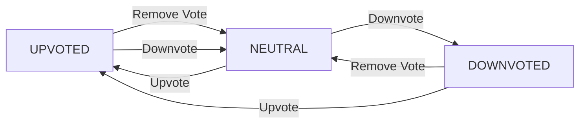
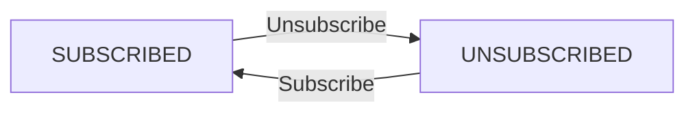
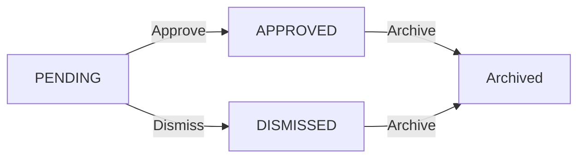
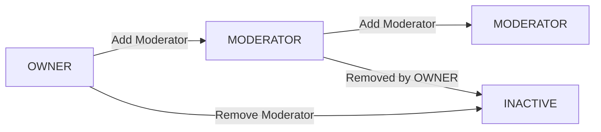

**redditLike — Business concepts, relationships, and states from user perspective**

Business concepts, relationships, and states from user perspective

# Domain Concepts

Describe what each concept means to users and why it exists.

## User Concept

A User represents an individual participant in the community platform. Users sign up with a unique username, email, and password, then log in to access personalized features. Users can edit their profile information including display name, bio, and avatar image. They create posts and comments, vote on content, subscribe to communities, and report inappropriate material. Users earn karma through community interactions that reflect their standing. They can delete their entire account, which removes all associated posts and comments from the system.

### User Registration

WHEN a user registers, THE system SHALL:
1. Require a unique username
2. Require a valid email address
3. Require a password
4. Create the user account with default karma score of 0
5. Automatically subscribe the new user to the default community

IF the username is already taken, THE system SHALL reject the registration.
IF the email is already registered, THE system SHALL reject the registration.
IF the email format is invalid, THE system SHALL reject the registration.
IF the password does not meet complexity requirements, THE system SHALL reject the registration.

### Profile Management

WHEN a user edits their profile, THE system SHALL:
1. Allow updating display name
2. Allow updating bio text
3. Allow updating avatar image
4. Update the profile version timestamp
5. Maintain historical display name for existing posts

WHERE a user updates their display name, THE system SHALL:
- Continue displaying previous display name on posts made before the change
- Display the current display name on their profile page

IF the avatar upload exceeds size limits, THE system SHALL reject the request.

### Username Uniqueness

WHEN a user registers with a username, THE system SHALL:
1. Check if the username is already in use
2. Reject registration if the username exists
3. Normalize the username to lowercase for comparison

WHEN a user attempts to change their username, THE system SHALL:
1. Validate the new username format
2. Check if the new username is available
3. Update the username only if available

IF a user attempts to register with a username that is already taken, THE system SHALL reject the request.
IF a user attempts to update to a username that is already taken, THE system SHALL reject the request.

### Account Deletion

WHEN a user deletes their account, THE system SHALL:
1. Remove all posts created by the user
2. Remove all comments written by the user
3. Remove all votes cast by the user
4. Remove all subscriptions created by the user
5. Remove the user account and associated credentials
6. Update karma scores for all affected users

WHERE a post or comment is deleted, THE system SHALL:
- Maintain no trace of the content in the system
- Update subscriber counts and karma scores accordingly
- Remove associated reports

WHILE account deletion is processing, THE system SHALL prevent any further actions by the user.

### Karma Calculation

WHEN a user receives an upvote on a post or comment, THE system SHALL:
1. Increase the user's karma score by 1
2. Update the vote count on the post or comment
3. Record the vote in the system

WHEN a user receives a downvote on a post or comment, THE system SHALL:
1. Decrease the user's karma score by 1
2. Update the vote count on the post or comment
3. Record the vote in the system

WHEN a user removes their vote, THE system SHALL:
1. Adjust the user's karma score in the opposite direction of the original vote
2. Update the vote count on the post or comment
3. Remove the vote record

WHERE a user's karma score becomes negative, THE system SHALL allow the negative value.

IF multiple votes are removed simultaneously, THE system SHALL apply adjustments sequentially.

### User Identity

WHEN displaying user identity, THE system SHALL:
1. Show the current display name on the user's profile page
2. Show the username in post/comment author fields
3. Show the avatar image on profile pages and content
4. Maintain consistent identity across all platform interactions

WHERE a user changes their display name, THE system SHALL:
- Continue showing the previous display name on posts and comments created before the change
- Display the current display name on the user's profile page

WHEN a user logs in, THE system SHALL:
1. Authenticate using email and password
2. Establish a session
3. Retrieve the user's current karma score
4. Load the user's subscription list

WHERE authentication fails, THE system SHALL reject the login attempt.

### Profile Visibility

WHEN a user views another user's profile, THE system SHALL:
1. Display the display name
2. Display the bio text
3. Display the avatar image
4. Display the total karma score
5. Display all posts created by the user
6. Display all comments written by the user

WHERE a user views their own profile, THE system SHALL:
- Show the same information as for other users
- Include options to edit profile information

WHERE a guest user views a profile, THE system SHALL:
- Display the same public information as for registered users
- Require login for any interactive features

WHILE a user profile is being displayed, THE system SHALL:
- Load all associated content in paginated format
- Sort posts by creation date (most recent first)
- Sort comments by creation date (most recent first)

## Community Concept

A Community represents a topic-focused group within the platform where users gather around shared interests. Any user can create a community with a unique name, description, and optional icon image. The creator becomes the community owner with highest authority. Users browse communities through listing and search functionality, viewing each community's subscriber count. Communities serve as containers for posts and coordinate moderation efforts. Each community has its own subscription system and moderation structure that governs participant behavior.

### Community Creation

WHEN a user creates a community, THE system SHALL:
1. Require a unique community name
2. Require a description text
3. Allow an optional icon image
4. Automatically set the creating user as the community owner
5. Initialize the subscriber count to zero

THE system SHALL reject the request when the community name is already in use.
THE system SHALL reject the request when the community name contains invalid characters.

WHEN a community is created, THE system SHALL:
- Store the creation timestamp
- Associate the community with its owner
- Create an initial moderator role with the owner's user ID and role type 'owner'

### Community Listing

WHEN a user browses the list of all communities, THE system SHALL:
1. Display each community's name, description, and icon
2. Display each community's subscriber count
3. Present communities in a paginated format

WHEN the list of communities is displayed, THE system SHALL:
- Sort communities alphabetically by name by default
- Allow filtering by visibility status (public communities only)

IF a user is not logged in, THE system SHALL still display the community list.

WHEN a user clicks on a community in the list, THE system SHALL navigate to that community's detail page.

### Community Search

WHEN a user searches for communities, THE system SHALL:
1. Accept search input matching part or all of a community name
2. Return communities whose names contain the search term
3. Show the subscriber count for each matching community

THE system SHALL search case-insensitively.

WHEN the search returns no results, THE system SHALL display an appropriate message.

WHEN a user clears the search term, THE system SHALL show the full community list again.

### Subscriber Count Display

THE system SHALL display the subscriber count for every community viewable by users.

THE system SHALL update the subscriber count when:
1. A user subscribes to a community (increment by 1)
2. A user unsubscribes from a community (decrement by 1)

THE system SHALL NOT include banned users in the subscriber count for their banned community.

WHEN viewing a community's detail page, THE system SHALL show the current subscriber count.

### Community Ownership

WHEN a user creates a community, THE system SHALL automatically assign them as the owner.

THE owner of a community has elevated permissions including:
- Adding or removing moderators
- Banning users from the community
- Deleting any post or comment in the community
- Dismissing reports for community content

WHEN a user attempts to perform an owner-only action, THE system SHALL verify their ownership status.

WHEN ownership of a community changes, THE system SHALL update the moderator role record accordingly.

### Community Discovery

WHEN a user browses communities, THE system SHALL support discovery through:
1. Alphabetical listing of all communities
2. Search functionality by community name
3. Featured or popular communities (if implemented in future)

WHEN a user is not subscribed to any communities, THE system SHALL recommend communities based on trending topics or similar user interests (if available).

THE system SHALL display a 'Browse Communities' link in the navigation for users to explore available communities.

### Community Branding

WHEN a user views a community, THE system SHALL display:
1. The community's unique name
2. The community's description text
3. The community's icon image (if provided)

THE system SHALL enforce uniqueness of community names across the platform.

WHEN a community's branding information is updated by the owner, THE system SHALL reflect the changes immediately across all community views.

## Post Concept

A Post represents content shared within a community for discussion and engagement. Users create posts only in communities they subscribe to, choosing from text, link, or image formats. Each post requires a title and may include text content, a URL, or an uploaded image. Users can edit or delete their own posts at any time. Posts appear in multiple feed views including home, popular, and community feeds with various sorting options. Each post accumulates a vote score based on community feedback and tracks comment count for engagement metrics.

### Post Creation

WHEN a user creates a post, THE system SHALL:
1. Require a title
2. Require the user to be subscribed to the target community
3. Require exactly one of: text content, URL, or uploaded image
4. Associate the post with the creating user and target community
5. Initialize vote score to 0 and comment count to 0

IF the user is not subscribed to the community, THE system SHALL reject the request.
IF none of the content types (text, URL, image) are provided, THE system SHALL reject the request.
IF multiple content types are provided simultaneously, THE system SHALL reject the request.

### Post Formats

WHEN a user creates a post, THE system SHALL support three formats:
1. Text post: Contains text content only, with no URL or image
2. Link post: Contains a URL only, with no text content or image
3. Image post: Contains an uploaded image only, with no text content or URL

WHILE a post exists, THE system SHALL maintain exactly one format type and SHALL NOT change format after creation.

### Post Editing

WHEN a user edits their own post, THE system SHALL:
1. Allow updating the title
2. Allow updating the content fields based on the original post format (e.g., text content for text posts, URL for link posts, image for image posts)
3. Preserve the original post format (text, link, or image)
4. Update the last edited timestamp

IF a user attempts to edit another user's post, THE system SHALL reject the request.
IF a user attempts to change the post format (e.g., from text to link), THE system SHALL reject the request.

### Post Deletion

WHEN a user deletes their own post, THE system SHALL:
1. Permanently remove the post
2. Remove all associated comments
3. Remove all associated votes
4. Update the community's subscriber count display only if necessary

IF a user attempts to delete another user's post, THE system SHALL reject the request.
WHEN a moderator deletes a post, THE system SHALL:
1. Permanently remove the post
2. Remove all associated comments
3. Remove all associated votes

### Post Types

WHEN a post is created, THE system SHALL assign one of three types:
1. Text: Contains text content only
2. Link: Contains a URL only
3. Image: Contains an uploaded image only

THE system SHALL display the post type based on which content field is populated at creation time.

IF a user views a post and the type is text, THE system SHALL display the text content.
IF a user views a post and the type is link, THE system SHALL display the domain name of the URL.
IF a user views a post and the type is image, THE system SHALL display a thumbnail of the image.

### Post Visibility

WHEN a user views a post in any feed, THE system SHALL:
1. Display the title, author username, community name, vote score, comment count, time since posted, and format-specific content
2. Show text content truncated to 200 characters in list views
3. Show thumbnail for image posts in list views
4. Show domain name for link posts in list views

WHEN a post is deleted by its author or a moderator, THE system SHALL:
1. Remove the post from all feeds
2. Return appropriate error when direct access is attempted

WHILE a post is archived (if implemented in future), THE system SHALL hide it from feeds but preserve it for authorized users.

### Post Feeds

WHEN a user accesses the home feed, THE system SHALL:
1. Show posts only from communities the user is subscribed to
2. Support sorting by: hot, new, top, controversial
3. Apply pagination

WHEN any user accesses the popular feed, THE system SHALL:
1. Show posts from all communities across the platform
2. Support sorting by: hot, new, top, controversial
3. Apply pagination

WHEN any user accesses a community feed, THE system SHALL:
1. Show posts from one specific community
2. Support sorting by: hot, new, top, controversial
3. Apply pagination

WHILE sorting by 'top', THE system SHALL support time filters: today, this week, this month, this year, all time.

## Comment Concept

A Comment represents a response to a post or another comment, enabling threaded discussions. Users write comments on any post they can view, and can reply to any existing comment regardless of depth. Comments support nested conversations with unlimited reply hierarchy. Users can edit or delete their own comments after posting. Each comment receives vote scores that reflect community sentiment and displays timestamps showing when responses were made. Comment sorting options allow users to prioritize discussions based on relevance or recency.

### Comment Writing

WHEN a user writes a comment on a post, THE system SHALL:
1. Require the comment to have content
2. Associate the comment with the creating user
3. Link the comment to the target post
4. Record the creation timestamp

WHEN a user replies to an existing comment, THE system SHALL:
1. Allow the reply to reference the parent comment
2. Maintain the thread relationship between comments
3. Associate the reply with the creating user
4. Link the reply to the same post as the parent comment

IF the comment content is empty, THE system SHALL reject the request.
IF the user attempts to comment on a post they cannot view, THE system SHALL reject the request.

### Comment Editing

WHEN a user edits their own comment, THE system SHALL:
1. Allow modification of the comment content
2. Update the last modified timestamp
3. Preserve the comment's thread relationships

WHILE a comment has been edited, THE system SHALL:
1. Display an indicator that the comment was modified
2. Show the last modified timestamp
3. Maintain the original creation timestamp

IF a user attempts to edit a comment they do not own, THE system SHALL reject the request.
IF the comment content becomes empty after editing, THE system SHALL reject the request.

### Comment Deletion

WHEN a user deletes their own comment, THE system SHALL:
1. Remove the comment from display
2. Set the comment status to deleted
3. Preserve the comment record for database integrity
4. Update the post's comment count by decrementing by one

WHEN a user deletes a comment that has replies, THE system SHALL:
1. Soft-delete the parent comment
2. Maintain the reply hierarchy for existing replies
3. Display the deleted parent comment with a placeholder message

IF a user attempts to delete a comment they do not own, THE system SHALL reject the request.

### Comment Threading

A comment can be a top-level comment on a post or a reply to another comment.
Top-level comments have no parent reference, while reply comments reference their parent comment.
Thread depth is unlimited, allowing conversations to branch indefinitely.

The thread structure maintains the relationship between:
- Comments and their parent post
- Comments and their parent comment (for replies)
- Comments and their creator
- Comments and their vote score

WHEN viewing a comment thread, THE system SHALL:
1. Display comments in their hierarchical order
2. Indent reply comments to show their relationship to parents
3. Show the comment author, content, vote score, and timestamp for each comment
4. Display nested replies with appropriate indentation levels

## Vote Concept

A Vote represents a user's rating of content quality or relevance. Users can upvote or downvote posts and comments to express approval or disapproval. Each user can cast only one vote per content item, preventing manipulation. Users can change their vote from up to down, or remove it entirely to reset their rating. The cumulative vote score for each item appears publicly and influences its prominence in feeds. Vote adjustments directly impact both the item's score and the author's karma value.

### Upvoting

WHEN a user upvotes a post or comment, THE system SHALL:
1. Record the upvote as a value of +1
2. Update the content's vote score by adding 1
3. Increase the author's karma by 1
4. Prevent the user from casting another vote on the same content

WHERE an upvote already exists, THE system SHALL NOT create a duplicate.

WHEN a user attempts to upvote content they previously downvoted, THE system SHALL:
1. Remove the previous downvote
2. Record the new upvote
3. Update the content's vote score by adding 2 (removing -1 and adding +1)
4. Adjust the author's karma by +2

### Downvoting

WHEN a user downvotes a post or comment, THE system SHALL:
1. Record the downvote as a value of -1
2. Update the content's vote score by subtracting 1
3. Decrease the author's karma by 1
4. Prevent the user from casting another vote on the same content

WHERE a downvote already exists, THE system SHALL NOT create a duplicate.

WHEN a user attempts to downvote content they previously upvoted, THE system SHALL:
1. Remove the previous upvote
2. Record the new downvote
3. Update the content's vote score by subtracting 2 (removing +1 and adding -1)
4. Adjust the author's karma by -2

### Vote Changes

WHEN a user changes their vote from upvote to downvote (or vice versa), THE system SHALL:
1. Remove the original vote
2. Record the new vote with opposite value
3. Update the content's vote score by 2 times the vote value change (+2 if upvote→downvote, -2 if downvote→upvote)
4. Adjust the author's karma by the same score change

WHERE a user attempts to change their vote to the same value (e.g., upvote to upvote), THE system SHALL ignore the request and retain the existing vote.

WHEN a user changes their vote, THE system SHALL record the timestamp of the new vote as the effective voting time.

### Vote Removal

WHEN a user removes their vote entirely, THE system SHALL:
1. Delete the user's vote record
2. Update the content's vote score by removing the vote value (+1 or -1)
3. Adjust the author's karma by the same amount (reversing the original impact)

WHERE the user had no prior vote, THE system SHALL leave the content's score and author's karma unchanged.

WHEN a vote is removed, THE system SHALL:
1. Permit the user to cast a new vote on the same content
2. Not retain any record of the previous vote for that user

### Vote Scarcity

THE system SHALL enforce that each user can cast only one active vote per content item (post or comment).

WHEN a user attempts to vote on content they have already voted on, THE system SHALL:
1. Reject the request as a duplicate vote
2. Return an error indicating the vote already exists

THE system SHALL store only the user's most recent vote value (+1, -1, or no vote) per content item, not a history of all votes.

WHERE a user's account is deleted, THE system SHALL remove all votes associated with that user.

### Score Calculation

THE vote score for any post or comment SHALL equal the sum of all upvotes minus all downvotes.

THE system SHALL calculate and display vote scores in real-time as votes are added, removed, or changed.

WHEN a post or comment has no votes, THE system SHALL display a vote score of 0.

THE system SHALL include removed votes in score calculation until the vote is fully deleted (e.g., when a user votes and then removes their vote, the score is adjusted accordingly).

WHEN a user removes their account, THE system SHALL recalculate all affected vote scores and author karma values.

### Karma Impact

WHEN a user's post or comment receives an upvote, THE system SHALL increase the author's karma score by 1.

WHEN a user's post or comment receives a downvote, THE system SHALL decrease the author's karma score by 1.

WHEN a user's vote is removed or changed, THE system SHALL adjust the author's karma by the net change in vote value (e.g., changing from upvote to downvote reduces author karma by 2).

WHERE a user casts multiple votes, THE system SHALL aggregate all vote impacts to calculate the author's total karma.

THE system SHALL allow karma scores to be negative and SHALL NOT prevent users from having negative karma.

## Subscription Concept

A Subscription represents a user's connection to a community they want to follow and participate in. Users subscribe to communities to gain posting privileges and see content in their personalized home feed. They can unsubscribe at any time to stop receiving updates from that community. Subscriptions are required before users can create posts within a community, ensuring community membership. Each user maintains a personal list of all communities they are subscribed to, providing easy management of their community relationships.

### Subscribing to a Community

WHEN a user subscribes to a community, THE system SHALL:
1. Record the subscription with status "subscribed"
2. Increase the community's subscriber count by 1
3. Allow the user to create posts in that community
4. Make posts from that community appear in the user's home feed

IF the user is already subscribed to the community, THE system SHALL NOT create a duplicate subscription.

WHERE the user is not logged in, THE system SHALL reject the subscription request.

ERROR CONDITION: THE system SHALL reject the request when the user attempts to subscribe to a non-existent community.

ERROR CONDITION: THE system SHALL reject the request when the user has been banned from the community.

### Unsubscribing from a Community

WHEN a user unsubscribes from a community, THE system SHALL:
1. Update the subscription status to "unsubscribed"
2. Decrease the community's subscriber count by 1
3. Remove posts from that community from the user's home feed
4. Prevent the user from creating new posts in that community

IF the user attempts to unsubscribe when already unsubscribed, THE system SHALL ignore the request.

ERROR CONDITION: THE system SHALL reject the request when the user attempts to unsubscribe from a non-existent community.

### Subscription Status Management

THE system SHALL store subscription status as either "subscribed" or "unsubscribed".

WHEN a user is banned from a community, THE system SHALL set their subscription status to "unsubscribed".

WHERE a banned user attempts to resubscribe, THE system SHALL reject the request until they are unbanned.

WHEN a user is unbanned from a community, THE system SHALL preserve their previous subscription status.

ERROR CONDITION: THE system SHALL reject the request when an existing subscription does not exist for the user-community pair.

### Posting Requirements

WHEN a user attempts to create a post in a community, THE system SHALL verify they are subscribed to that community.

IF the user is not subscribed to the community, THE system SHALL reject the post creation request.

WHERE a user has previously subscribed but is now unsubscribed, THE system SHALL prevent new post creation in that community.

ERROR CONDITION: THE system SHALL reject the request when attempting to create a post in a non-existent community.

### Community Membership Visualization

WHEN a user views their own profile page, THE system SHALL display:
1. Their total karma score
2. A list of all communities they are subscribed to

WHEN viewing any user's profile page, THE system SHALL display:
1. Their display name, bio, and avatar
2. Their total karma score
3. A list of all posts they have created
4. A list of all comments they have written

ERROR CONDITION: THE system SHALL reject the request when retrieving community membership for a non-existent user.

### Subscription List Management

WHEN a user requests their list of subscribed communities, THE system SHALL return:
1. All communities where their subscription status is "subscribed"
2. The subscriber count for each community
3. The community name, description, and icon URL

WHEN a user unsubscribes from a community, THE system SHALL immediately remove it from their subscription list.

WHERE a user views their subscription list, THE system SHALL exclude communities where their status is "unsubscribed".

ERROR CONDITION: THE system SHALL return an empty list when the user has no active subscriptions.

### Feed Personalization Based on Subscriptions

WHEN a logged-in user accesses the home feed, THE system SHALL show:
1. Only posts from communities they are subscribed to
2. Posts sorted according to the selected sorting option (hot/new/top/controversial)
3. Posts paginated according to feed pagination rules

WHERE a user is not logged in, THE system SHALL NOT provide access to the home feed.

WHERE a user changes their subscription status, THE system SHALL update the home feed content accordingly on next refresh.

WHEN sorting the home feed by "top", THE system SHALL apply the selected time filter (today/this week/this month/this year/all time) to determine relevance.

ERROR CONDITION: THE system SHALL return an empty feed when the user is not subscribed to any communities.

## ModeratorRole Concept

A ModeratorRole represents the authority level granted to users for maintaining community standards. The community owner automatically receives the highest authority and can grant moderator roles to other users. Moderators can add additional moderators but cannot remove owners or each other. Owners retain sole power to remove moderator privileges. Moderators gain special abilities to delete posts and comments, ban users from the community, and review reported content. Banned users lose posting rights but maintain ability to view community content.

### Owner Role

### Owner Role Assignment

WHEN a user creates a community, THE system SHALL automatically assign them the 'owner' moderator role.

WHEN the owner role is assigned, THE system SHALL grant the user full administrative authority over that community.

WHERE a user has the owner role, THE system SHALL allow them to modify all community settings, including name, description, and icon.

### Owner Role Authority

WHERE a user has the owner role, THE system SHALL allow them to add moderators to the community.

WHERE a user has the owner role, THE system SHALL allow them to remove moderators from the community.

WHERE a user has the owner role, THE system SHALL allow them to modify community subscription settings.

### Owner Role Limitations

THE system SHALL NOT allow the owner to revoke their own owner role.

WHEN a user attempts to delete their own account while holding the owner role, THE system SHALL delete their moderator role along with their account and associated content.

### Owner Role Transfer

WHEN a community is deleted, THE system SHALL remove all moderator roles associated with that community.

### Moderator Assignment

### Moderator Addition

WHEN the community owner adds a moderator, THE system SHALL create a new moderator role with the 'moderator' role type.

WHEN a moderator role is created, THE system SHALL set its creation timestamp to the moment of assignment.

WHERE a user is added as a moderator, THE system SHALL require the action to be initiated by the community owner.

### Moderator Removal

WHEN the community owner removes a moderator, THE system SHALL deactivate the corresponding moderator role.

WHEN a moderator role is deactivated, THE system SHALL immediately remove all permissions granted through that role.

### Moderator Restrictions

THE system SHALL NOT allow non-owners to add moderators to a community.

THE system SHALL NOT allow moderators to add other moderators unless explicitly granted by the owner.

### Role Verification

WHEN a user attempts to access moderator features, THE system SHALL verify they have an active moderator role for that community.

IF a user's moderator role has been deactivated, THE system SHALL reject their moderator action requests.

### Moderator Permissions

### Content Management Permissions

WHERE a user has the 'moderator' or 'owner' role for a community, THE system SHALL allow them to delete any post in that community.

WHERE a user has the 'moderator' or 'owner' role for a community, THE system SHALL allow them to delete any comment in that community.

WHERE a user has the 'moderator' or 'owner' role for a community, THE system SHALL allow them to view all reports for posts and comments in that community.

### Moderation Actions

WHERE a user has the 'moderator' or 'owner' role for a community, THE system SHALL allow them to approve a report, which SHALL delete the reported content.

WHERE a user has the 'moderator' or 'owner' role for a community, THE system SHALL allow them to dismiss a report, which SHALL remove the report from the active reports list.

### Permission Verification

THE system SHALL verify moderator role status before executing any moderation action.

IF a user attempts a moderation action without appropriate role for the community, THE system SHALL reject the request.

### User Banning

### Ban Creation

WHERE a user has the 'moderator' or 'owner' role for a community, THE system SHALL allow them to ban another user from that community.

WHEN a user is banned from a community, THE system SHALL record the ban timestamp and the moderator who initiated the ban.

WHERE a user is banned, THE system SHALL prevent them from creating new posts in that community.

### Ban Enforcement

WHERE a user is banned from a community, THE system SHALL prevent them from creating new comments in that community.

THE system SHALL NOT prevent banned users from viewing community content.

### Ban Management

WHERE a user has the 'moderator' or 'owner' role for a community, THE system SHALL allow them to unban a previously banned user.

WHERE a user is unbanned, THE system SHALL restore their ability to create posts and comments in that community.

### Ban Viewing

WHERE a user has the 'moderator' or 'owner' role for a community, THE system SHALL allow them to view the list of banned users.

THE system SHALL display the reason for each ban, if provided.

### Content Moderation

### Report Management

WHERE a user has the 'moderator' or 'owner' role for a community, THE system SHALL allow them to view all pending reports for posts and comments in that community.

WHERE a user views a report, THE system SHALL display the reported content, the reporting user, and the report reason.

### Approval Actions

WHEN a moderator approves a report, THE system SHALL immediately delete the reported content.

WHEN content is deleted via report approval, THE system SHALL mark the report as 'approved'.

### Dismissal Actions

WHEN a moderator dismisses a report, THE system SHALL mark the report as 'dismissed'.

WHEN a report is dismissed, THE system SHALL remove it from the active reports list.

### Audit Trail

THE system SHALL retain all reports regardless of their final status (pending, approved, dismissed).

THE system SHALL record which moderator approved or dismissed each report.

### Role Hierarchy

### Role Types

THE system SHALL recognize two role types: 'owner' and 'moderator'.

WHERE a community exists, THE system SHALL ensure at least one user holds the 'owner' role.

### Permission Levels

WHERE a user has the 'owner' role, THE system SHALL grant them all permissions available to 'moderator' role holders.

WHERE a user has the 'moderator' role, THE system SHALL grant them only moderator-level permissions, excluding owner-only capabilities.

### Role Removal Restrictions

THE system SHALL NOT allow 'moderator' users to remove 'owner' users from their role.

THE system SHALL NOT allow 'moderator' users to remove other 'moderator' users from their role.

### Role Persistence

WHEN a user's account is deleted, THE system SHALL remove their associated moderator roles.

WHEN a community is deleted, THE system SHALL remove all associated moderator roles.

### Moderation Authority

### Authority Definition

WHERE a user has a valid 'moderator' or 'owner' role for a community, THE system SHALL recognize them as having moderation authority for that community.

THE system SHALL verify moderation authority before executing any moderation-related operations.

### Authority Verification

WHEN a user attempts to perform a moderation action, THE system SHALL check their active role status for the specific community.

THE system SHALL reject moderation actions from users without valid role authority for the community.

### Authority Scope

WHERE a user has moderation authority for a community, THE system SHALL limit their authority to actions within that specific community only.

THE system SHALL NOT grant moderation authority across communities unless explicitly assigned separate roles for each community.

### Authority Refresh

WHEN a moderator role is updated or deactivated, THE system SHALL immediately update the user's current authority status.

WHERE authority is revoked, THE system SHALL invalidate any pending actions requested under the previous authority level.

## Report Concept

A Report represents a user's notification of inappropriate content requiring moderator attention. Users can report any post or comment and must provide a reason explaining the issue. Reports enter a pending state visible to community moderators who can take action. Moderators either approve reports to delete the content or dismiss them to retain it. Once dismissed, reports are removed from the active report list. The report system enables community self-governance while giving moderators final authority over content removal decisions.

### Content Reporting

WHEN a user reports a post or comment, THE system SHALL:
1. Require the user to select the type of content being reported (post or comment)
2. Require the user to provide a reason explaining the report
3. Create a report with status set to 'pending'
4. Associate the report with the reporting user
5. Associate the report with the specific content being reported

A user can only report each piece of content once.

WHEN a user attempts to report content they have already reported, THE system SHALL reject the request.

### Report Reasons

WHEN a user reports content, THE system SHALL require the reason to be provided as text.

THE reason SHALL support reasonable lengths to allow users to describe violations clearly.

WHEN the reason is missing or empty, THE system SHALL reject the request.

### Moderator Review

WHEN a moderator views the reports for their community, THE system SHALL:
1. Show all pending reports for posts in that community
2. Show all pending reports for comments in that community
3. Display the reported content, reporter information, and reason for each report

WHEN a moderator views a specific report, THE system SHALL allow them to review the full content being reported.

A moderator can only review reports for communities they moderate.

### Report Approval

WHEN a moderator approves a report, THE system SHALL:
1. Change the report status to 'approved'
2. Delete the reported content (post or comment)
3. Remove all votes and comments associated with the deleted content
4. Log the approval action with moderator and timestamp information

WHEN a report is approved, THE system SHALL update any affected metrics (e.g., post count, comment count).

### Report Dismissal

WHEN a moderator dismisses a report, THE system SHALL:
1. Change the report status to 'dismissed'
2. Remove the report from the active reports list
3. Keep the reported content intact
4. Log the dismissal action with moderator and timestamp information

WHEN a report is dismissed, THE system SHALL no longer display it in the pending reports list.

### Report Tracking

WHEN a user views a post or comment they reported, THE system SHALL indicate that a report was filed for that content.

THE system SHALL NOT reveal which user filed the report or the specific reason to the content author or other users.

WHEN a report status changes to 'approved' or 'dismissed', THE system SHALL update the indicator for the reported content.

### Content Moderation

WHEN a banned user attempts to create a post in a community, THE system SHALL reject the request.

WHEN a banned user attempts to create a comment in a community, THE system SHALL reject the request.

A banned user MAY still view posts and comments in the community.

A user can be banned from a community by a moderator with proper authority.

A banned user can be unbanned by a moderator with proper authority.

A user's ban status in a community is tracked separately for each community.

# Domain Relationships

Describe how concepts relate to each other from a business perspective.

## Conceptual Relationships

Describe how concepts relate to each other in business terms.

### User-Community Ownership

### Community Ownership

WHEN a user creates a community, THE system SHALL:
1. Assign the creating user as the owner of that community
2. Grant the owner full moderation permissions for the community
3. Create a ModeratorRole with role="owner" linking the user to the community

A user can own multiple communities simultaneously.

### Community Ownership Transfer

WHEN an owner wants to transfer ownership, THE system SHALL:
1. Allow the current owner to assign another moderator as the new owner
2. Update the existing ModeratorRole to have role="owner" for the new owner
3. Change the previous owner's ModeratorRole to role="moderator"

WHILE a user is the owner of a community, THE system SHALL:
1. Allow them to add or remove moderators
2. Allow them to ban or unban users
3. Prevent them from removing their own owner status (ownership must be transferred)

### User-Post Creation Association

WHEN a user creates a post, THE system SHALL:
1. Associate the post with the creating user as its author
2. Store the user's ID as the post's creator reference
3. Increment the user's karma score based on the post's initial vote

A user can create multiple posts across different communities.

WHEN a user deletes their account, THE system SHALL:
1. Delete all posts they created
2. Delete all comments they wrote
3. Remove all votes they cast
4. Remove all subscriptions they hold
5. Remove all ModeratorRole records they hold
6. Delete any reports they created

### User-Comment Creation Association

WHEN a user writes a comment, THE system SHALL:
1. Associate the comment with the creating user as its author
2. Store the user's ID as the comment's creator reference
3. Store the comment on the targeted post
4. Allow replies to other comments (creating parent-child relationships)

A user can write multiple comments on a single post.

WHEN a user deletes their account, THE system SHALL:
1. Remove all their comments
2. Update vote scores for affected posts and comments accordingly

### User-Vote Association (One-to-One per Content)

WHEN a user votes on a post, THE system SHALL:
1. Create a single Vote record linking the user to that post
2. Store the vote value (1 for upvote, -1 for downvote)
3. Prevent the user from creating additional votes for that post

WHILE a user has voted on a post, THE system SHALL:
1. Allow them to change their vote (from upvote to downvote or vice versa)
2. Allow them to remove their vote entirely
3. When vote changes, adjust the post's vote score accordingly

WHEN a user changes their vote on a post:
1. The vote value in the Vote record is updated
2. The post's vote score is recalculated (old value removed, new value added)

WHEN a user removes their vote from a post:
1. The Vote record is deleted
2. The post's vote score is adjusted (removing the previous vote value)

WHEN a user votes on a comment, THE system SHALL:
1. Apply the same one-vote-per-user-per-comment rule as posts
2. Store the vote value and update the comment's vote score

### Post-Comment Parent-Child Relationship

WHEN a user creates a comment, THE system SHALL:
1. Link the comment to its parent post
2. Allow the comment to optionally link to another comment as its parent (for replies)

WHILE a comment exists, THE system SHALL:
1. Display it as a reply to its parent comment (if any)
2. Show it under its parent post in the comment hierarchy

WHEN a user deletes a comment, THE system SHALL:
1. Delete all replies to that comment (cascading deletion)
2. Maintain the parent-child relationships for any remaining comments

### Community-Post Belongs-To Relationship

WHEN a user creates a post, THE system SHALL:
1. Associate the post with a specific community
2. Require the user to be subscribed to that community
3. Store the community ID as the post's community reference

A post belongs to exactly one community.

WHEN a user deletes their account, THE system SHALL:
1. Remove their posts
2. Keep the posts in the community (only the author reference is removed)

### Community-Subscription Association

WHEN a user subscribes to a community, THE system SHALL:
1. Create a Subscription record linking the user to the community
2. Set the subscription status to "subscribed"
3. Increment the community's subscriber count

A user can subscribe to multiple communities.

WHEN a user unsubscribes from a community, THE system SHALL:
1. Update the Subscription record status to "unsubscribed"
2. Decrement the community's subscriber count
3. Not delete the Subscription record (preserving subscription history)

WHEN a user creates a post, THE system SHALL:
1. Verify they have an active subscription (status="subscribed") to that community
2. Reject the post creation if they are not subscribed

### Community-ModeratorRole Association

WHEN a user becomes a moderator, THE system SHALL:
1. Create a ModeratorRole record linking the user to the community
2. Set the role to either "owner" or "moderator"
3. Assign appropriate moderation permissions based on the role

A user can hold multiple ModeratorRole records across different communities.

WHEN a user becomes a moderator of a community, THE system SHALL:
1. Allow them to delete posts in that community
2. Allow them to delete comments in that community
3. Allow them to ban users from that community
4. Allow them to unban users from that community
5. Allow them to view the list of banned users

WHILE a user is a moderator, THE system SHALL:
1. Prevent them from removing the community owner
2. Prevent moderators from removing each other (only the owner can remove moderators)

### Community-Report Association

WHEN a user reports content, THE system SHALL:
1. Create a Report record linking the user, the reported content, and the community
2. Store the reporting reason provided by the user
3. Set the report status to "pending"

A Report is associated with exactly one community (determined by the post or comment's community).

WHEN a moderator views reports, THE system SHALL:
1. Show all pending reports for posts and comments in their community
2. Display the reported content, reporter, and reason

WHEN a moderator approves a report, THE system SHALL:
1. Delete the reported content
2. Change the report status to "approved"

WHEN a moderator dismisses a report, THE system SHALL:
1. Keep the reported content
2. Change the report status to "dismissed"
3. Remove the dismissed report from the active report list

### User-Report Association

WHEN a user reports content, THE system SHALL:
1. Create a Report record with the user as the reporter
2. Allow only one report per user per content item

A user can create multiple reports across different content items.

WHEN a user deletes their account, THE system SHALL:
1. Remove their reports
2. Keep the reported content and report status records

## Lifecycle and Retention

Describe business rules for concept lifecycle and data retention from a user perspective.

### User Account Lifecycle

WHEN a user registers an account, THE system SHALL create an account with required email, username, and display name, and optional bio and avatar.

WHEN a user deletes their account, THE system SHALL:
1. Permanently remove all posts created by the user
2. Permanently remove all comments written by the user
3. Remove all subscriptions, votes, and moderator roles associated with the user
4. Delete the user account completely

WHILE a user account is active, THE system SHALL:
1. Allow the user to update their display name, bio, and avatar
2. Allow the user to change their password
3. Display the user's profile including display name, bio, avatar, total karma score, posts list, and comments list

THE system SHALL NOT allow duplicate usernames across accounts.

THE system SHALL allow users to view any other user's profile.

WHEN a user's vote is removed, THE system SHALL update the voter's karma score by the appropriate amount (+1 for removing an upvote, -1 for removing a downvote).

### Post Lifecycle and Deletion Policy

WHEN a user creates a post, THE system SHALL:
1. Require a title
2. Require the post to be one of three types: text, link, or image
3. Require text content for text posts, URL for link posts, or image URL for image posts
4. Associate the post with the creating user and target community
5. Set initial vote score to 0 and comment count to 0

WHEN a user edits their own post, THE system SHALL allow updating the title and content based on the post type.

WHEN a user deletes their own post, THE system SHALL:
1. Permanently remove the post and all its associated data
2. Remove all votes on the post
3. Remove all comments on the post
4. Decrease the community's post count

WHILE a post exists, THE system SHALL:
1. Display the post title, content, author, community, vote score, comment count, and posting time
2. Allow the author to edit the post (unless moderated)
3. Allow the author to delete the post (unless moderated)

WHEN a post is deleted by its author or a moderator, THE system SHALL:
1. Mark the post as deleted from user-visible lists
2. Preserve the post record for audit purposes
3. Set all votes on the post to null

### Comment Lifecycle and Deletion Policy

WHEN a user writes a comment, THE system SHALL:
1. Require comment content
2. Associate the comment with the creating user and target post
3. Allow optional reply-to a parent comment (for threading)
4. Set initial vote score to 0

WHEN a user edits their own comment, THE system SHALL allow updating the comment content.

WHEN a user deletes their own comment, THE system SHALL:
1. Permanently remove the comment and all its associated data
2. Remove all votes on the comment
3. Set the deleted comment's content to "[deleted]"
4. Preserve the comment structure for thread continuity

WHILE a comment exists, THE system SHALL:
1. Display the comment content, author, vote score, and posting time
2. Allow the author to edit the comment (unless moderated)
3. Allow the author to delete the comment (unless moderated)
4. Display replies to the comment in a nested structure

WHEN a comment is deleted by its author or a moderator, THE system SHALL:
1. Replace the comment content with "[deleted]"
2. Preserve the comment record for audit purposes
3. Set all votes on the comment to null
4. Maintain thread structure for parent comments

### Subscription Lifecycle

WHEN a user subscribes to a community, THE system SHALL:
1. Create a subscription record with status "subscribed"
2. Increment the community's subscriber count
3. Allow the user to create posts in that community
4. Add the community to the user's subscribed communities list

WHEN a user unsubscribes from a community, THE system SHALL:
1. Update the subscription status to "unsubscribed"
2. Decrement the community's subscriber count
3. Prevent the user from creating new posts in that community
4. Remove the community from the user's subscribed communities list

WHEN a user who is banned from a community attempts to create a post or comment, THE system SHALL reject the request.

WHILE a user is subscribed to a community, THE system SHALL:
1. Include posts from that community in the user's home feed
2. Allow the user to view community content
3. Allow the user to view other subscribers

THE system SHALL enforce a unique constraint of one subscription per user per community.

### Report Status Lifecycle and Moderator Actions

WHEN a user reports content (post or comment), THE system SHALL:
1. Create a report with the provided reason
2. Set the report status to "pending"
3. Associate the report with the community containing the content
4. Store the reporter's identity and the reported content reference

WHEN a moderator views reports for their community, THE system SHALL:
1. Display all pending, approved, and dismissed reports
2. Show the reported content, reporter, and reason for each report
3. Allow filtering by report status

WHEN a moderator approves a report, THE system SHALL:
1. Delete the reported content (post or comment)
2. Update the report status to "approved"
3. Remove the report from pending lists
4. Preserve the report record for audit purposes

WHEN a moderator dismisses a report, THE system SHALL:
1. Update the report status to "dismissed"
2. Remove the report from pending lists
3. Preserve the report record for audit purposes

WHILE a report has status "pending", THE system SHALL:
1. Display it in the moderator's report queue
2. Prevent it from appearing in dismissed or approved report lists
3. Allow the report to be updated with additional moderator notes

THE system SHALL preserve report records indefinitely for audit purposes, even after content deletion.

### Archival and Recovery Procedures

WHEN a post or comment is deleted by its author or a moderator, THE system SHALL:
1. Archive the content record rather than physically deleting it
2. Preserve the content along with metadata (author, timestamp, community)
3. Make archived content unrecoverable to regular users
4. Allow administrators to access archived content for legal or compliance purposes

THE system SHALL archive user data upon account deletion, but exclude deleted posts and comments that were already removed.

WHEN archival is triggered, THE system SHALL:
1. Generate an audit trail entry with timestamp and operator
2. Store archived data in a separate storage tier
3. Ensure archived data cannot be modified
4. Preserve referential integrity for related records

THE system SHALL NOT support user-initiated recovery of deleted content.

WHEN an administrator attempts to restore archived data, THE system SHALL:
1. Require explicit administrator privileges
2. Create a new content record with preserved original data
3. Set the restored record's creation timestamp to original creation time
4. Recalculate karma and vote scores from the restored data

THE system SHALL retain archived data for a minimum of 7 years from the deletion date for legal compliance.

# Enums and State Machines

Enum type definitions and state transitions.

## Enum Definitions

Define all enum types with their allowed values and descriptions.

### Post Type Enum

WHEN defining post types, THE system SHALL support three allowed values:
1. "text" - for text-only posts containing content
2. "link" - for posts containing a URL
3. "image" - for posts containing an uploaded image

THE system SHALL ensure every post has exactly one type from these allowed values.

### Subscription Status Enum

WHEN defining subscription status, THE system SHALL support two allowed values:
1. "subscribed" - user is currently subscribed to the community
2. "unsubscribed" - user is not subscribed to the community

WHEN a user creates a subscription, THE system SHALL default the status to "subscribed".

### Moderator Role Enum

WHEN defining moderator roles, THE system SHALL support two allowed values:
1. "owner" - highest authority role, can add/remove moderators and ban users
2. "moderator" - standard moderation role, can delete content and ban users

THE system SHALL ensure each community has exactly one owner role.

THE system SHALL prevent moderators from removing the owner or other moderators.

### Report Status Enum

WHEN defining report status, THE system SHALL support three allowed values:
1. "pending" - initial status when report is created
2. "approved" - moderator has reviewed and approved the report
3. "dismissed" - moderator has reviewed and dismissed the report

WHEN a user creates a report, THE system SHALL default the status to "pending".

THE system SHALL remove dismissed reports from the active report list.

### Comment Sorting Enum

WHEN sorting comments, THE system SHALL support three allowed values:
1. "best" - highest vote score comments appear first
2. "new" - most recently created comments appear first
3. "controversial" - comments with many votes but score close to zero appear first

### Feed Sorting Enum

WHEN sorting feeds, THE system SHALL support four allowed values:
1. "hot" - recent posts with many upvotes appear first
2. "new" - most recently created posts appear first
3. "top" - highest vote score posts appear first
4. "controversial" - posts with many votes but score close to zero appear first

### Top Time Filter Enum

WHEN sorting by "top" feed, THE system SHALL support five time filter allowed values:
1. "today" - only posts from the current day
2. "this_week" - only posts from the current week
3. "this_month" - only posts from the current month
4. "this_year" - only posts from the current year
5. "all_time" - posts from all time periods

## State Transitions

Define valid state transition paths for stateful concepts.

### Vote State Transitions

A vote can exist in three states: UPVOTED, DOWNVOTED, or NEUTRAL.

WHEN a user casts an upvote on a post or comment, THE system SHALL change the vote state to UPVOTED.
WHEN a user casts a downvote on a post or comment, THE system SHALL change the vote state to DOWNVOTED.
WHEN a user removes their vote, THE system SHALL change the vote state to NEUTRAL.

IF a user changes their vote from upvote to downvote, THE system SHALL first change the vote state to NEUTRAL, then to DOWNVOTED.
IF a user changes their vote from downvote to upvote, THE system SHALL first change the vote state to NEUTRAL, then to UPVOTED.

### Subscription State Transitions

A subscription can exist in two states: SUBSCRIBED or UNSUBSCRIBED.

WHEN a user subscribes to a community, THE system SHALL change the subscription status to SUBSCRIBED.
WHEN a user unsubscribes from a community, THE system SHALL change the subscription status to UNSUBSCRIBED.

IF a user attempts to create a post, THE system SHALL require that the subscription status is SUBSCRIBED.
IF a user's subscription status is UNSUBSCRIBED, THE system SHALL prevent them from posting to that community.

### Report Status Workflow

A report can exist in three states: PENDING, APPROVED, or DISMISSED.

WHEN a user reports content, THE system SHALL create the report with status PENDING.
WHEN a moderator approves a report, THE system SHALL change the report status to APPROVED and delete the reported content.
WHEN a moderator dismisses a report, THE system SHALL change the report status to DISMISSED and remove it from the active report list.

WHILE a report is PENDING, THE system SHALL display it to moderators for review.
WHEN a report status changes to APPROVED or DISMISSED, THE system SHALL archive the report.

### ModeratorRole Permission Transitions

A ModeratorRole can have two states: OWNER or MODERATOR.

WHEN a user creates a community, THE system SHALL assign the OWNER role to that user for that community.
WHEN an OWNER adds a moderator, THE system SHALL create a MODERATOR role for that user in the community.
WHEN an OWNER removes a moderator, THE system SHALL change the role status to INACTIVE.
WHEN a MODERATOR adds another moderator, THE system SHALL create a MODERATOR role for that user in the community.
WHEN a moderator attempts to remove the OWNER, THE system SHALL reject the request.
WHEN a moderator attempts to remove another MODERATOR, THE system SHALL reject the request.

IF a user's ModeratorRole status becomes INACTIVE, THE system SHALL remove their moderation capabilities.
WHILE a user has an OWNER or MODERATOR role, THE system SHALL grant them appropriate moderation permissions.

