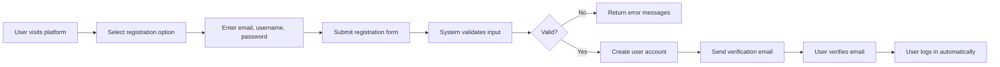
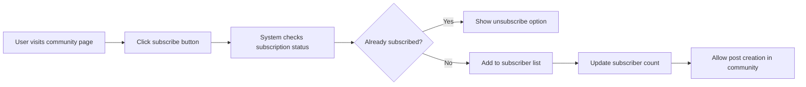
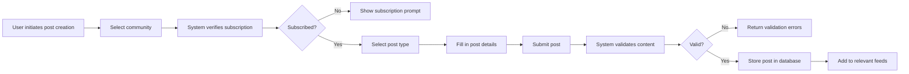
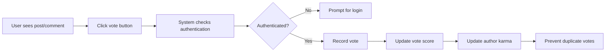
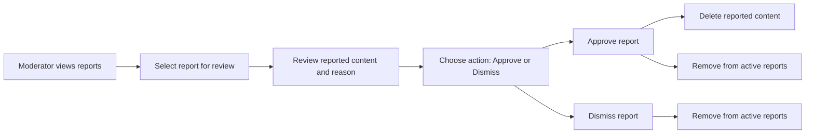

# Functional Requirements Specification

## 1. User Account Management

### 1.1 Registration Process

WHEN a guest provides valid registration information (unique username, email address, and password), THE system SHALL create a new user account and log them in automatically.

WHEN username already exists, THE system SHALL reject registration and return an appropriate error message.

WHEN email already exists, THE system SHALL reject registration and return an appropriate error message.

### 1.2 Login Process

WHEN a guest submits valid credentials (email and password), THE system SHALL authenticate and establish a user session.

WHEN authentication fails due to invalid credentials, THE system SHALL return an appropriate error message.

WHEN authentication fails due to unverified email (if email verification is enabled), THE system SHALL return an appropriate error message.

### 1.3 Password Management

WHEN a member requests to change their password, THE system SHALL verify their current password and update to the new password.

WHEN password change fails validation (weak password, mismatched confirmation), THE system SHALL return appropriate error messages.

### 1.4 Account Deletion

WHEN a member requests to delete their account, THE system SHALL:
- Delete the user's account
- Delete all posts created by the user
- Delete all comments created by the user
- Remove all votes cast by the user
- Reset karma contributions
- Log the user out from all active sessions

IF account deletion fails due to system error, THEN THE system SHALL return an appropriate error message and maintain account integrity.

## 2. User Profile System

### 2.1 Profile Information

THE system SHALL store the following profile information for each user:
- Display name (user-chosen identifier, not necessarily unique)
- Bio text (optional user-provided biography)
- Avatar image (optional user-uploaded profile image)
- Karma score (calculated value)

### 2.2 Profile Editing

WHEN a member requests to update their display name, THE system SHALL update the display name after validation.

WHEN a member requests to update their bio text, THE system SHALL update the bio after validation.

WHEN a member requests to update their avatar image, THE system SHALL update the avatar after image validation.

IF a user attempts to edit another user's profile, THEN THE system SHALL deny the request with appropriate error message.

### 2.3 Profile Viewing

WHEN any user or guest requests to view a profile, THE system SHALL display:
- Display name
- Bio text
- Avatar image
- Total karma score
- List of all posts created by the user
- List of all comments created by the user

### 2.4 Karma Calculation

THE system SHALL calculate karma score as:
- Start at 0 for new users
- Add 1 for each upvote received on posts or comments
- Subtract 1 for each downvote received on posts or comments
- Adjust when votes are removed or changed
- Allow negative karma values

## 3. Community System

### 3.1 Community Creation

WHEN a member requests to create a community, THE system SHALL create a new community with:
- Unique name (validated for uniqueness)
- Description text
- Icon image
- Creator as owner

WHEN community name already exists, THE system SHALL reject creation and return appropriate error.

WHEN community name fails format validation, THE system SHALL reject creation with appropriate error.

### 3.2 Community Browsing

WHEN any user or guest requests to view all communities, THE system SHALL return a paginated list of communities with:
- Community name
- Description
- Icon image
- Subscriber count

### 3.3 Community Search

WHEN a search query is submitted, THE system SHALL return communities matching the query by name.

WHEN no communities match the search, THE system SHALL return an empty list.

### 3.4 Community Listing

WHEN viewing a community's detail page, THE system SHALL display:
- Community name
- Description
- Icon image
- Subscriber count
- Owner information
- Moderator list

## 4. Community Subscription System

### 4.1 Subscription Management

WHEN a member requests to subscribe to a community, THE system SHALL add the user to the community's subscriber list.

WHEN a member requests to unsubscribe from a community, THE system SHALL remove the user from the community's subscriber list.

IF a member attempts to subscribe to a community they're already subscribed to, THEN THE system SHALL return appropriate message.

IF a member attempts to unsubscribe from a community they're not subscribed to, THEN THE system SHALL return appropriate message.

### 4.2 Subscription Listing

WHEN a member requests to view their subscribed communities, THE system SHALL return a list of all communities they are subscribed to.

## 5. Post System

### 5.1 Post Creation

WHEN a member creates a post, THE system SHALL require:
- Community membership (member must be subscribed)
- Post type selection (text, link, or image)
- Title field (required)
- Content specific to post type:
  - Text post: text content
  - Link post: URL
  - Image post: uploaded image

WHEN a member creates a text post, THE system SHALL store the text content.

WHEN a member creates a link post, THE system SHALL validate and store the URL.

WHEN a member creates an image post, THE system SHALL validate and store the uploaded image.

IF a member attempts to create a post in a community they're not subscribed to, THEN THE system SHALL deny the request with appropriate error message.

### 5.2 Post Editing

WHEN a member requests to edit their own post, THE system SHALL allow updates to:
- Title
- Content (text content, URL, or image)

WHEN a member requests to edit a post they do not own, THE system SHALL deny the request with appropriate error message.

### 5.3 Post Deletion

WHEN a member requests to delete their own post, THE system SHALL:
- Mark the post as deleted
- Remove from feed displays
- Update comment counts and vote counts accordingly
- Preserve post data for audit trail

WHEN a member requests to delete a post they do not own, THE system SHALL deny the request with appropriate error message.

### 5.4 Post View Requirements

WHEN viewing a single post, THE system SHALL display:
- Title
- Full content (text content, link URL, or image)
- Author username
- Community name
- Vote score
- Comment count
- Time since posted

## 6. Post Voting System

### 6.1 Vote Casting

WHEN a member upvotes a post, THE system SHALL:
- Record the upvote
- Increase the post's vote score by 1
- Increase the author's karma by 1
- Prevent duplicate votes

WHEN a member downvotes a post, THE system SHALL:
- Record the downvote
- Decrease the post's vote score by 1
- Decrease the author's karma by 1
- Prevent duplicate votes

### 6.2 Vote Changes and Removal

WHEN a member changes their vote from upvote to downvote, THE system SHALL:
- Update the vote type
- Decrease post score by 2 (remove +1, add -1)
- Adjust author karma by -2

WHEN a member changes their vote from downvote to upvote, THE system SHALL:
- Update the vote type
- Increase post score by 2 (remove -1, add +1)
- Adjust author karma by +2

WHEN a member removes their vote entirely, THE system SHALL:
- Remove the vote record
- Revert the post score change
- Revert the author karma change

### 6.3 One-Vote-Per-User Rule

WHEN a member attempts to vote on a post they've already voted on, THE system SHALL:
- Update their existing vote rather than creating a new vote
- Reject duplicate vote attempts

IF a guest attempts to vote on a post, THEN THE system SHALL deny the request and require authentication.

## 7. Post Feeds

### 7.1 Home Feed

WHEN a logged-in member requests the home feed, THE system SHALL:
- Show posts only from communities the user is subscribed to
- Support all sorting options (hot, new, top, controversial)
- Implement pagination

IF a guest requests the home feed, THEN THE system SHALL require authentication.

### 7.2 Popular Feed

WHEN any user (authenticated or guest) requests the popular feed, THE system SHALL:
- Show posts from all communities across the platform
- Support all sorting options (hot, new, top, controversial)
- Implement pagination

### 7.3 Community Feed

WHEN any user (authenticated or guest) requests a community feed, THE system SHALL:
- Show posts from the specific community
- Support all sorting options (hot, new, top, controversial)
- Implement pagination

### 7.4 Sorting Options

WHEN any feed requests "Hot" sorting, THE system SHALL:
- Prioritize recent posts with many upvotes
- Apply time decay algorithm
- Show posts with strong engagement

WHEN any feed requests "New" sorting, THE system SHALL:
- Show most recently created posts first
- Ignore engagement metrics

WHEN any feed requests "Top" sorting, THE system SHALL:
- Sort by vote score (highest first)
- Apply time filter as specified (today, this week, this month, this year, all time)
- Support filtering by time period

WHEN any feed requests "Controversial" sorting, THE system SHALL:
- Prioritize posts with many votes but score close to zero
- Apply algorithm that detects divisive content
- Show posts with high engagement but mixed opinions

### 7.5 Feed Display Requirements

WHEN viewing any feed, THE system SHALL display each post with:
- Title
- Author username
- Community name
- Vote score
- Comment count
- Time since posted
- Post-type-specific information:
  - Text post: first 200 characters of content
  - Image post: thumbnail of the image
  - Link post: domain name of the URL

## 8. Comment System

### 8.1 Comment Creation

WHEN a member creates a comment on a post, THE system SHALL:
- Store the comment content
- Link to the post
- Link to the author
- Set reply parent (null for direct post comment, comment ID for reply)

WHEN a member creates a reply to a comment, THE system SHALL:
- Store the reply content
- Link to the post
- Link to the author
- Link to the parent comment
- Maintain reply hierarchy

### 8.2 Nested Reply Structure

THE system SHALL support unlimited comment depth with parent-child relationships.

WHEN displaying comments, THE system SHALL:
- Show parent comments first
- Indent or otherwise visually distinguish replies
- Maintain thread hierarchy
- Support expanding/collapsing reply threads

### 8.3 Comment Editing

WHEN a member requests to edit their own comment, THE system SHALL allow content updates.

WHEN a member requests to edit a comment they do not own, THE system SHALL deny the request with appropriate error message.

### 8.4 Comment Deletion

WHEN a member requests to delete their own comment, THE system SHALL:
- Mark the comment as deleted
- Update parent comment's reply count
- Preserve comment data for audit trail

IF a comment has replies, THEN THE system SHALL:
- Allow deletion to proceed
- Keep reply hierarchy intact
- Mark the deleted comment as removed

## 9. Comment Voting System

### 9.1 Comment Voting

WHEN a member upvotes a comment, THE system SHALL:
- Record the upvote
- Increase the comment's vote score by 1
- Increase the author's karma by 1

WHEN a member downvotes a comment, THE system SHALL:
- Record the downvote
- Decrease the comment's vote score by 1
- Decrease the author's karma by 1

### 9.2 Vote Management

WHEN a member changes their vote on a comment, THE system SHALL apply the same logic as post voting changes.

WHEN a member removes their vote on a comment, THE system SHALL revert the karma adjustment.

## 10. Comment Sorting

### 10.1 Sort Options

WHEN comments are sorted by "Best", THE system SHALL:
- Sort by highest vote score first
- Consider vote ratio and total votes
- Prioritize well-received comments

WHEN comments are sorted by "New", THE system SHALL:
- Sort by most recent first
- Ignore vote scores

WHEN comments are sorted by "Controversial", THE system SHALL:
- Prioritize comments with many votes but score close to zero
- Apply controversial content algorithm

## 11. Community Moderation System

### 11.1 Moderator Roles and Hierarchy

THE system SHALL define the following community roles:
- Owner: Community creator, highest authority
- Moderator: Appointed by owner or other moderators, elevated privileges

WHEN a community is created, THE system SHALL automatically appoint the creator as owner.

### 11.2 Owner Permissions

WHILE a user is community owner, THE system SHALL:
- Add moderators to the community
- Remove moderators from the community
- Edit community settings
- Transfer ownership to another member
- Maintain all other member permissions

### 11.3 Moderator Permissions

WHILE a user is community moderator, THE system SHALL:
- Add other moderators to the community
- Edit community settings
- Delete any post in the community
- Delete any comment in the community
- Ban users from the community
- View banned user list
- View community reports
- Approve or dismiss reports

IF a user is community moderator, THEN THE system SHALL NOT:
- Remove the community owner
- Remove other moderators (only owner can remove moderators)

### 11.4 Ban System

WHEN a moderator bans a user from a community, THE system SHALL:
- Add user to community's banned user list
- Prevent the banned user from creating posts in that community
- Prevent the banned user from creating comments in that community
- Allow the banned user to view community content

WHEN a moderator unbans a user from a community, THE system SHALL:
- Remove user from community's banned user list
- Restore user's ability to create posts and comments
- Maintain all other user privileges

WHEN a banned user attempts to create a post in a community, THEN THE system SHALL deny the request and show appropriate error message.

WHEN a banned user attempts to create a comment in a community, THEN THE system SHALL deny the request and show appropriate error message.

### 11.5 Moderator Actions Log

THE system SHALL maintain a log of:
- Moderator appointments and removals
- Post deletions by moderators
- Comment deletions by moderators
- User bans and unbans
- Report resolutions

## 12. Reporting System

### 12.1 Content Reporting

WHEN a member reports a post, THE system SHALL:
- Store the report with reason text
- Link to the reported post
- Link to the reporting user
- Link to the post author

WHEN a member reports a comment, THE system SHALL:
- Store the report with reason text
- Link to the reported comment
- Link to the reporting user
- Link to the comment author
- Link to the parent post

IF a member attempts to report content they own, THEN THE system SHALL deny the request with appropriate error message.

### 12.2 Report Viewing

WHILE a user is community moderator, THE system SHALL:
- Show all reports for the community
- Display reported content
- Display reporter information
- Display report reason
- Display timestamp

### 12.3 Report Resolution

WHEN a moderator approves a report, THE system SHALL:
- Delete the reported content (post or comment)
- Remove the report from the active reports list
- Log the moderator action
- Notify the content author

WHEN a moderator dismisses a report, THE system SHALL:
- Keep the reported content
- Remove the report from the active reports list
- Log the moderator action

WHEN a report is dismissed, THEN THE system SHALL NOT:
- Show the dismissed report in active report list
- Allow re-submission of the same report

### 12.4 Report History

THE system SHALL maintain a complete history of:
- All reports (active and resolved)
- Report reasons provided by users
- Moderator actions on reports
- Timestamps for all report-related events

## 13. User Actors and Authentication

### 13.1 User Actor Overview

The platform implements four core user actors that cover all possible user states and permission levels:

- **Guest**: Unauthenticated users who can browse public content without creating accounts
- **Member**: Authenticated users who can create content, vote, comment, and participate in communities
- **Moderator**: Community-appointed users with authority to maintain community standards
- **Owner**: Community founders with ultimate authority over their communities

### 13.2 Guest Actor

GUEST actors can:
- View public posts from all communities including popular feed and community feeds
- Browse the list of all communities on the platform
- Search for communities by name
- View community details including subscriber counts and descriptions
- View user profiles including display names, bios, avatars, karma scores, posts, and comments
- Read comment threads on posts
- View post content, vote scores, and comment counts
- Access public information about the platform

GUEST actors CANNOT:
- Create posts or comments
- Vote on posts or comments
- Subscribe to communities
- Edit or delete content
- Access home feed (requires authentication)
- Create new user accounts
- Access private information about other users

### 13.3 Member Actor

MEMBER actors can:
- Create new user accounts with email, password, and unique username
- Log in to the platform with email and password
- Edit their own profile including display name, bio, and avatar
- Create posts in communities they are subscribed to
- Choose from three post types: text, link, or image
- Comment on any post
- Reply to any comment creating nested discussion threads
- Vote on posts (upvote or downvote)
- Vote on comments (upvote or downvote)
- Change their vote on posts and comments
- Remove their vote from posts and comments
- Subscribe to communities
- Unsubscribe from communities
- View their subscribed communities list
- Edit their own posts and comments
- Delete their own posts and comments
- Report posts and comments with reasons
- View their own profile information
- Access their home feed showing posts from subscribed communities
- View their karma score and understand how it changes

MEMBER actors CANNOT:
- Create posts in communities they are not subscribed to
- Vote on their own posts or comments
- Vote more than once on the same post or comment
- Edit other users' posts or comments
- Delete other users' posts or comments
- Ban other users from communities
- Appoint moderators
- Access other users' private information

### 13.4 Moderator Actor

MODERATOR actors can:
- Perform all MEMBER capabilities
- Delete any post in their assigned community
- Delete any comment in their assigned community
- Ban users from their assigned community
- Unban users from their assigned community
- View the list of banned users in their community
- View all reports for their community
- Approve reports (deleting reported content)
- Dismiss reports (keeping reported content)
- Access community moderation tools and dashboards

MODERATOR actors CANNOT:
- Remove the community owner
- Remove other moderators
- Edit community settings
- View moderation permissions beyond their assigned community

### 13.5 Owner Actor

OWNER actors can:
- Perform all MODERATOR capabilities
- Create new communities
- Appoint moderators to their community
- Remove moderators from their community
- Edit community settings including name, description, and icon
- Transfer community ownership
- View comprehensive community analytics and statistics
- Access all moderation reports for their community
- Handle all aspects of community management

OWNER actors CANNOT:
- Be removed by other moderators or owners
- Transfer ownership to users not already in their community
- Access administrative functions outside their community scope

## 14. Business Processes

### 14.1 User Onboarding Workflow

### 14.2 Community Subscription Workflow

### 14.3 Content Creation Workflow

### 14.4 Voting Workflow

### 14.5 Moderation Workflow

## 15. Error Handling and Validation

### 15.1 Registration Errors

WHEN username already exists, THE system SHALL return error code "USERNAME_TAKEN".

WHEN email already exists, THE system SHALL return error code "EMAIL_TAKEN".

WHEN email format is invalid, THE system SHALL return error code "INVALID_EMAIL_FORMAT".

WHEN password does not meet security requirements, THE system SHALL return error code "WEAK_PASSWORD".

### 15.2 Authentication Errors

WHEN login credentials are invalid, THE system SHALL return error code "INVALID_CREDENTIALS".

WHEN user account is banned, THE system SHALL return error code "ACCOUNT_BANNED".

WHEN user account is deactivated, THE system SHALL return error code "ACCOUNT_DEACTIVATED".

### 15.3 Authorization Errors

WHEN a user attempts to edit another user's content, THE system SHALL return error code "UNAUTHORIZED_EDIT".

WHEN a user attempts to delete another user's content, THE system SHALL return error code "UNAUTHORIZED_DELETE".

WHEN a user attempts to vote on their own content, THE system SHALL return error code "SELF_VOTE_DENIED".

### 15.4 Community Errors

WHEN a user attempts to create a post in an unsubscribed community, THE system SHALL return error code "NOT_SUBSCRIBED".

WHEN a banned user attempts to create content in a community, THE system SHALL return error code "USER_BANNED".

WHEN a user attempts to subscribe to a community they are already subscribed to, THE system SHALL return error code "ALREADY_SUBSCRIBED".

## 16. Performance Requirements

### 16.1 Response Time Requirements

WHILE loading the first page of any feed, THE system SHALL complete within 2 seconds for authenticated users.

WHILE loading the first page of any feed, THE system SHALL complete within 2 seconds for unauthenticated users.

WHILE loading additional feed pages, THE system SHALL complete within 1.5 seconds for paginated navigation.

WHILE loading additional feed pages via infinite scroll, THE system SHALL complete within 1 second.

### 16.2 Concurrency Requirements

THE system SHALL support at least 10,000 concurrent users viewing feeds.

THE system SHALL support at least 100 concurrent requests per user for infinite scroll functionality.

### 16.3 Data Consistency Requirements

WHEN a vote is recorded, THE system SHALL update vote scores within 1 second.

WHEN a post is created, THE system SHALL make it available in relevant feeds within 1 minute.

WHEN a user subscription changes, THE system SHALL update Home Feed content within 1 minute.

## 17. Security Requirements

### 17.1 Authentication Security

THE system SHALL use bcrypt with a cost factor of at least 12 for password hashing.

THE system SHALL enforce HTTPS with TLS 1.3 or higher for all authentication endpoints.

THE system SHALL implement rate limiting on authentication endpoints (5 attempts per minute per IP).

### 17.2 Authorization Security

THE system SHALL validate user permissions for every restricted operation.

THE system SHALL implement proper JWT token management with appropriate expiration times.

THE system SHALL invalidate all active sessions when a user changes their password.

### 17.3 Data Protection

THE system SHALL never store passwords in plain text or reversible encryption.

THE system SHALL implement Content Security Policy headers to prevent XSS attacks.

THE system SHALL sanitize all user input to prevent injection attacks.

## 18. Business Rules

### 18.1 Karma System Business Rules

- New users start with a karma score of 0
- Karma increases by 1 for each upvote received on posts or comments
- Karma decreases by 1 for each downvote received on posts or comments
- Karma is adjusted when votes are changed or removed
- Karma can be negative
- Users cannot vote on their own content

### 18.2 Community Subscription Business Rules

- Users must be subscribed to a community before creating posts in that community
- Users can subscribe to unlimited communities
- Subscribing to a community does not grant additional privileges beyond posting
- Users can unsubscribe from any community at any time
- Unsubscribing from a community prevents future post creation in that community

### 18.3 Post Content Business Rules

- Text posts must have text content between 1 and 10,000 characters
- Link posts must have a valid URL format
- Image posts must be valid image files (JPEG, PNG, GIF, WebP)
- Post titles must be between 1 and 300 characters
- Users can only edit their own posts
- Users can only delete their own posts

### 18.4 Comment Content Business Rules

- Comment content must be between 1 and 5,000 characters
- Users can reply to any post or comment
- Comment threads can have unlimited depth
- Users can only edit their own comments
- Users can only delete their own comments

### 18.5 Voting Business Rules

- Users can only vote on posts and comments after authentication
- Users can only vote once per post or comment
- Users cannot change their vote direction without changing the vote
- Users can remove their vote entirely
- Vote scores are calculated as upvotes minus downvotes

### 18.6 Moderation Business Rules

- Community owners have ultimate authority over their communities
- Moderators can be appointed by owners or other moderators
- Moderators cannot remove owners or other moderators
- Banned users can still view community content but cannot create posts or comments
- Reports are anonymous (reporter identity is hidden from reported user)
- Approved reports result in content deletion and report removal
- Dismissed reports are removed from the active reports list

## 19. Integration Points

### 19.1 External Services

THE system may integrate with the following external services:

- Email service for account verification and password reset emails
- Image storage service for avatar and image post uploads
- Search service for community and post search functionality

### 19.2 Data Export

THE system SHALL provide data export functionality for users to download their content and activity history.

## 20. Future Enhancements

### 20.1 Planned Features

- Real-time feed updates via WebSockets
- Advanced content personalization algorithms
- Multi-factor authentication options
- Community-specific theme customization
- Post scheduling functionality
- Analytics dashboard for community owners
- Premium subscription tier with enhanced features

### 20.2 Scalability Considerations

- Content delivery network integration
- Regional feed server deployment
- Database read replicas for high-traffic periods

## Document Summary

This requirements specification covers the complete functionality of the Reddit-like community platform, including user account management, profile system, community system, post system, comment system, voting system, feed system, moderation system, and reporting system.

The document defines business logic using EARS format for clear, testable requirements that enable developers to implement the system without ambiguity.

All user actor permissions, authentication requirements, security considerations, and performance expectations are specified to provide a complete foundation for system implementation.