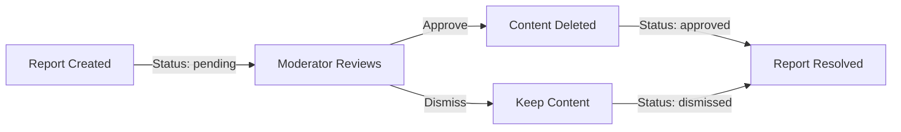

**redditLike — What operations users can perform, use cases, business workflows**

What operations users can perform, use cases, business workflows

# Core Business Operations

What the system must do for each business concept.

## User Operations

Users register by providing a unique email, username, and password. Passwords must meet security requirements and verification email confirmation is required before the account becomes active. Users log in using their email and password credentials. Registered users can change their password at any time while logged in. Users can view any other user's public profile showing display name, bio, avatar, karma score, posts, and comments. Users can edit their own display name, bio, and avatar. Users can delete their own account, which permanently removes all their posts and comments from the platform. Registration attempts are limited to prevent abuse, and duplicate email addresses among active accounts are not allowed.

### Account Registration

WHEN a user registers, THE system SHALL:
1. Require a unique email address
2. Require a unique username
3. Require a password that meets security requirements
4. Store the account in pending verification status until email is confirmed
5. Generate a verification token for email confirmation

IF the email address is already associated with an active account, THE system SHALL reject the registration.
IF the username is already taken, THE system SHALL reject the registration.
IF the password does not meet security requirements, THE system SHALL reject the registration.

### Email Verification

WHEN a user receives a verification email, THE system SHALL:
1. Include a unique verification token in the link
2. Allow the user to verify their email by clicking the link
3. Activate the account upon successful verification
4. Invalidate the verification token after use

WHILE the account is in pending verification status, THE system SHALL:
- Prevent login until email is verified
- Allow resending of verification email

IF a user attempts to verify with an expired or invalid token, THE system SHALL reject the verification request.

### Password Requirements

WHEN a user sets a password during registration, THE system SHALL:
1. Require a minimum length of 8 characters
2. Require at least one uppercase letter
3. Require at least one lowercase letter
4. Require at least one numeric character
5. Require at least one special character

WHEN a user changes their password, THE system SHALL:
- Require the current password for verification
- Apply the same security requirements as registration
- Update the password hash securely

IF the new password does not meet security requirements, THE system SHALL reject the change request.
IF the current password is incorrect during password change, THE system SHALL reject the request.

### Duplicate Email Prevention

WHEN a registration request includes an email address, THE system SHALL:
1. Check if an active account already exists with that email
2. Reject the request if a duplicate is found
3. Return a clear error message about email availability

IF an email is found in a deleted account, THE system SHALL:
- Allow reuse after a cooldown period
- Or permanently reserve the email to prevent impersonation

THE system SHALL NOT allow multiple active accounts to share the same email address.

WHEN a user attempts to reset their password using an email, THE system SHALL:
- Verify the email belongs to an active account
- Send a password reset link if valid
- Reject requests for non-existent or inactive accounts.

### Profile Viewing

WHEN a user views another user's public profile, THE system SHALL:
1. Display the display name
2. Display the bio text
3. Display the avatar image
4. Display the total karma score
5. Display a list of posts created by the user
6. Display a list of comments written by the user

WHEN viewing their own profile, THE system SHALL:
- Show the same information as above
- Indicate that this is the viewer's own profile

IF the requested user account does not exist, THE system SHALL return a 'user not found' response.

THE system SHALL NOT expose sensitive information (password hashes, email) in profile views.

### Profile Editing

WHEN a user edits their own profile, THE system SHALL:
1. Allow updating the display name
2. Allow updating the bio text
3. Allow uploading a new avatar image
4. Validate that the display name is not empty
5. Update the edit timestamp

WHILE editing their profile, THE system SHALL:
- Allow partial updates (editing only some fields)
- Preserve existing values for unmodified fields
- Accept image uploads that meet file size and format requirements

IF a user attempts to edit another user's profile, THE system SHALL reject the request.

IF the display name contains invalid characters or violates naming rules, THE system SHALL reject the update.

### Account Deletion

WHEN a user deletes their account, THE system SHALL:
1. Verify the user's identity through password confirmation
2. Delete all posts created by the user
3. Delete all comments written by the user
4. Remove the user's account record
5. Invalidate all active sessions

WHILE the account deletion process is running, THE system SHALL:
- Prevent login attempts for the account
- Block any new posts or comments from being created
- Show a confirmation message upon completion

IF the account deletion fails for any reason, THE system SHALL:
- Rollback any partial deletions
- Preserve account data integrity
- Return a clear error message

THE system SHALL NOT allow account deletion without explicit user confirmation.

### Rate Limiting for Registration

WHEN multiple registration requests are made in a short time, THE system SHALL:
1. Limit registration attempts per IP address to 3 per hour
2. Limit registration attempts per email domain to 10 per hour
3. Require increased delays between consecutive registration attempts

WHEN rate limits are exceeded, THE system SHALL:
1. Reject additional registration attempts
2. Return an appropriate error message indicating rate limiting
3. Provide the time until rate limiting resets

THE system SHALL log all registration attempts for security monitoring.

WHEN legitimate traffic exceeds rate limits (e.g., batch onboarding), THE system SHALL:
- Allow administrators to temporarily increase limits
- Require administrative authentication for such changes

## Community Operations

Any registered user can create a new community by choosing a unique name, providing a description, and uploading an icon image. The creator of a community automatically becomes its owner with the highest authority. Users can browse a list of all communities on the platform and search for communities by name. When viewing a community, users see its name, description, icon, and current subscriber count. Community names must be unique across the platform, and owners can manage their community through moderation tools. Users cannot create duplicate communities with the same name, and search results show matching communities with their subscriber counts.

### Community Creation

WHEN a user creates a community, THE system SHALL:
1. Require a unique name
2. Accept an optional description
3. Accept an optional icon image upload
4. Automatically assign the creating user as the owner
5. Initialize the subscriber count to 0

IF the name is already in use, THE system SHALL reject the request.
IF the name exceeds the maximum length, THE system SHALL reject the request.

### Unique Community Name

THE system SHALL enforce that each community name is unique across the platform.

WHEN a user attempts to create a community with a name that already exists, THE system SHALL reject the request and indicate that the name is unavailable.

Community names are case-insensitive for uniqueness checks.

A community name must be non-empty and cannot consist solely of whitespace characters.

### Community Ownership Assignment

WHEN a community is created, THE system SHALL automatically assign the creating user as the owner.

The owner has elevated authority within their community, including the ability to:
- Add and remove moderators
- Ban users from the community
- Delete any content in the community
- Transfer ownership to another user

Only one user may hold the owner role for a given community at a time.

### Community Browsing

WHEN a logged-in user accesses the community discovery page, THE system SHALL display a list of all communities.

WHEN a guest user accesses the community discovery page, THE system SHALL display the same list of communities.

Each community in the list shows:
- The community name
- A brief description
- The subscriber count
- The community icon (if set)

The list is paginated and supports sorting by subscriber count (highest first).

### Community Search

WHEN a user searches for communities by name, THE system SHALL return communities whose names match the search query.

Search is case-insensitive and matches any part of the community name.

Each search result shows:
- The community name
- A brief description
- The subscriber count
- The community icon (if set)

IF no communities match the search query, THE system SHALL return an empty list.

### Community Listing

WHEN a user views a community listing page, THE system SHALL display all communities in a paginated list.

Each community in the listing shows:
- The community name
- A brief description
- The subscriber count
- The community icon (if set)

The listing supports filtering by subscription status:
- All communities
- Subscribed communities only
- Unsubscribed communities only

The listing supports sorting by subscriber count (highest first), name (alphabetical), or newest first.

### Subscriber Count Display

WHEN displaying any community information, THE system SHALL show the current subscriber count.

The subscriber count updates in real-time when:
- A user subscribes to the community
- A user unsubscribes from the community
- A user's subscription status changes

The subscriber count is displayed alongside the community name in:
- Community listing pages
- Search results
- Community profile pages
- Feed post headers

The subscriber count cannot be negative.

### Community Icon Upload

WHEN a user uploads an icon image for a community, THE system SHALL:
1. Accept common image formats (JPEG, PNG, GIF)
2. Scale the image to a standard thumbnail size
3. Store the icon URL for use in all community displays

WHEN a user updates the community icon, THE system SHALL replace the previous icon.

WHEN a community is created without an icon, THE system SHALL use a default placeholder icon.

Icons are optional, and communities may exist without a custom icon.

### Community Description Management

WHEN a user edits their community's description, THE system SHALL update the stored description.

The description is optional and can be empty.

The description supports basic text formatting but does not allow HTML or other markup.

Community owners and moderators can edit the community description.

When displaying the community, the full description is shown on the community profile page.

If no description is provided, the system displays a placeholder message indicating no description is available.

## Post Operations

Users can create posts only in communities they are subscribed to. Posts must have a title and be one of three types: text post with content, link post with a URL, or image post with an uploaded image. Users can edit their own posts at any time, updating title, content, URL, or image as appropriate. Users can delete their own posts, which removes the post and all associated comments and votes. When viewing a single post, users see its title, full content or link, author name, community name, vote score, comment count, and posting time. Only the original author can edit or delete their own posts, and posts cannot be created without a valid community subscription.

### Post Creation

WHEN a member creates a post, THE system SHALL:
1. Require the post to have a title
2. Require the member to be subscribed to the target community
3. Require exactly one of: text content, URL, or image URL
4. Associate the post with the creating member as its author
5. Associate the post with the target community
6. Initialize vote score to zero
7. Initialize comment count to zero

IF the member is not subscribed to the target community, THE system SHALL reject the request.
IF the post lacks a title, THE system SHALL reject the request.
IF more than one content type field (text, URL, or image URL) is provided, THE system SHALL reject the request.
IF none of the content type fields (text, URL, or image URL) are provided, THE system SHALL reject the request.

### Post Types (Text/Link/Image)

A post must be exactly one of three types:

**Text Post**
- Contains text content
- URL and image URL must be empty

**Link Post**
- Contains a URL
- Text content and image URL must be empty

**Image Post**
- Contains an uploaded image URL
- Text content and URL must be empty

WHEN a member creates a post, THE system SHALL ensure only the appropriate content field for the selected type is provided.
WHEN a member edits a post, THE system SHALL enforce the same single-type constraint during updates.

### Community Subscription Requirement

WHEN a member attempts to create a post, THE system SHALL verify the member is subscribed to the target community.
WHILE a user is not subscribed to a community, THE system SHALL reject their request to create a post in that community.

A subscription is valid when status equals 'subscribed'.

WHEN a user unsubscribes from a community, THE system SHALL prevent them from creating new posts in that community starting immediately.

### Post Editing

WHEN a member edits their own post, THE system SHALL:
1. Allow updating the title
2. Allow updating the text content, URL, or image URL (ensuring only one content type is set)
3. Preserve the original author, community, vote score, and comment count

IF the user is not the original author of the post, THE system SHALL reject the edit request.
IF the edit attempts to change the post type incorrectly (e.g., providing multiple content fields), THE system SHALL reject the request.

### Post Deletion

WHEN a member deletes their own post, THE system SHALL:
1. Remove the post record
2. Delete all associated comments
3. Delete all associated votes
4. Decrement the community's subscriber count if the user was subscribed
5. Update the post author's karma score based on removed votes

IF the user attempting deletion is not the original author, THE system SHALL reject the request.
IF the post has already been deleted, THE system SHALL reject the request.

### Post Viewing

WHEN any user views a single post, THE system SHALL display:
1. The post title
2. Full content (text post), URL (link post), or image (image post)
3. Author's display name
4. Community name
5. Current vote score
6. Comment count
7. Time since posting

WHILE viewing a post, THE system SHALL ensure deleted posts are not displayed to unauthorized users.

### Vote Score Calculation

THE system SHALL calculate vote score for each post as:
- Total upvotes (value = 1) minus total downvotes (value = -1)
- Sum of all valid votes associated with the post

WHEN a user changes their vote, THE system SHALL adjust the post's vote score accordingly.
WHEN a user removes their vote, THE system SHALL adjust the post's vote score by removing that vote's contribution.

### Comment Count Display

THE system SHALL maintain a live comment count for each post.
WHEN a user creates a comment on a post, THE system SHALL increment the post's comment count.
WHEN a user deletes a comment on a post, THE system SHALL decrement the post's comment count.
WHEN viewing any feed or single post, THE system SHALL display the current comment count.

### Author Ownership

Each post has exactly one author (the member who created it).
WHEN a member attempts to edit or delete a post, THE system SHALL verify they are the original author.
WHEN a post is created, THE system SHALL record the creating member as its author.

Non-authors MAY view posts but MUST NOT edit or delete them.
Post editing and deletion operations SHALL restrict action to the original author only.

## Comment Operations

Users can write comments on any post, and can reply to any existing comment creating threaded conversations with no depth limit. Each comment must include content text and displays the author, vote score, time since posting, and nested replies. Users can edit their own comments to correct content or update information. Users can delete their own comments, which removes the comment and affects the karma scores of all voters. Comments on a post can be sorted by best (highest score), new (most recent), or controversial (many votes with score near zero). Users can view all comments on any post regardless of subscription status.

### Comment Creation

### Comment Creation

WHEN a logged-in user creates a comment, THE system SHALL:
1. Require comment content text
2. Require the comment to be associated with a specific post
3. Optionally associate the comment with a parent comment for replying
4. Ensure the target post exists and has not been deleted
5. Associate the comment with the creating user as author

IF comment content is empty, THE system SHALL reject the request.
IF the target post does not exist, THE system SHALL reject the request.
IF the target post has been deleted, THE system SHALL reject the request.
IF the user is banned from the community where the post belongs, THE system SHALL reject the request.

### Comment Replying

### Comment Replying

WHEN a user replies to an existing comment, THE system SHALL:
1. Treat the reply as a child of the original comment
2. Maintain the nesting relationship between parent and child comments
3. Preserve the thread structure when displaying nested replies
4. Allow replying to any existing comment, regardless of its parent relationship

WHILE replying, THE system SHALL ensure:
- The reply is associated with the same post as the parent comment
- The reply is linked to its immediate parent comment
- The reply inherits the thread context from the parent

IF the parent comment has been deleted, THE system SHALL display the reply as orphaned (shown without the parent content but retained in the thread).

### Threaded Conversation Structure

### Threaded Conversation Structure

WHEN viewing a post, THE system SHALL display comments as a threaded hierarchy with:
1. Top-level comments directly associated with the post
2. Replies nested under their immediate parent comment
3. No depth limit for nested reply chains
4. Visual indentation to represent nesting level

WHILE building the thread, THE system SHALL:
- Maintain comment relationships through parent-child references
- Allow any comment to have zero or more child comments
- Support recursive retrieval of all descendants in a comment tree

USING a depth-first traversal, THE system SHALL build the comment tree for display.

### Comment Editing

### Comment Editing

WHEN a user edits their own comment, THE system SHALL:
1. Allow modification of comment content text
2. Preserve the original creation timestamp
3. Update the edit timestamp for the comment
4. Display an 'edited' indicator alongside the comment

IF the user does not own the comment, THE system SHALL reject the edit request.
IF the comment has been deleted, THE system SHALL reject the edit request.
IF the comment is owned by a banned user from the community, THE system SHALL allow the edit but maintain ban restrictions on future actions.

### Comment Deletion

### Comment Deletion

WHEN a user deletes their own comment, THE system SHALL:
1. Mark the comment as deleted in the database
2. Remove the comment content from display (shown as '[deleted]')
3. Update the author's karma score based on vote adjustments
4. Preserve the comment record for maintaining thread integrity

WHILE deleting a comment, THE system SHALL:
- Preserve the comment record ID to maintain reply structure
- Show deleted comments as placeholders in the thread
- Allow moderators to view deleted comment content for moderation purposes

IF a comment with replies is deleted, THE system SHALL:
- Keep all child comments in the thread as orphans
- Maintain the parent-child relationships among the orphaned replies
- Display orphaned replies indented below the deleted comment placeholder

### Comment Sorting

### Comment Sorting

WHEN viewing comments on a post, users can select from three sorting options:

**Best Sort**
- Sort by vote score (highest first)
- Show new comments only after high-scoring comments
- Use a weighted algorithm favoring score and recency

**New Sort**
- Sort by creation timestamp (most recent first)
- Display comments in chronological order
- Show newest comments at the top of the list

**Controversial Sort**
- Sort by number of votes (total upvotes + downvotes)
- Then by score proximity to zero (closest first)
- Show posts with many votes but neutral scores first

WHILE switching sort orders, THE system SHALL:
- Reorder the comment list according to the selected algorithm
- Preserve the thread structure during sorting
- Maintain pagination continuity across sort order changes

FOR the Best sort option, THE system SHALL apply a time-weighted scoring algorithm that favors recent high-quality comments while maintaining older high-value comments in visibility.

### Vote Score Calculation

### Vote Score Calculation

WHEN a user votes on a comment, THE system SHALL:
1. Calculate the vote score as the difference between upvotes and downvotes
2. Update the comment's vote score immediately
3. Adjust the author's karma score by +1 for upvotes, -1 for downvotes
4. Remove the voter's previous vote if changing or removing their vote

WHILE calculating vote scores, THE system SHALL:
- Count only active votes (not deleted or removed votes)
- Allow negative vote scores (downvotes can exceed upvotes)
- Update the score in real-time with each vote action

WHEN a user removes their vote, THE system SHALL:
- Decrement the vote score by the vote value (+1 for upvote, -1 for downvote)
- Decrement the author's karma score by the same amount
- Remove the vote record from the user's active votes

WHEN a user changes their vote, THE system SHALL:
- Apply the new vote value to the comment score
- Adjust the author's karma score by twice the vote value difference
- Update the voter's active vote record

### Author Attribution

### Author Attribution

WHEN displaying a comment, THE system SHALL show:
1. The author's username for attribution
2. A link to the author's profile page
3. The author's display name (if different from username)
4. The author's avatar image if available

WHILE displaying comment author information, THE system SHALL:
- Preserve author attribution even after comment content is deleted
- Show author username for deleted comments
- Display author information consistently across all comment views

WHEN a user deletes their account, THE system SHALL:
- Remove the author's username and profile information
- Replace author attribution with '[deleted]'
- Preserve comment content in the thread for context

FOR moderation purposes, THE system SHALL allow moderators to:
- View author information for all comments in their community
- Access author account status for moderation decisions

### Time Display

### Time Display

WHEN displaying a comment, THE system SHALL show:
1. The time since posting (e.g., "3 hours ago", "2 days ago")
2. The original creation timestamp for accurate record-keeping
3. An edit indicator if the comment has been modified

FOR time calculations, THE system SHALL:
- Use the user's timezone for display purposes
- Calculate relative time in user-friendly formats (seconds, minutes, hours, days, weeks, months)
- Show precise timestamps on hover or in detailed view

WHEN displaying edit history, THE system SHALL:
- Show 'edited' indicator alongside the original time
- Display the last edit timestamp in user-friendly format
- Maintain the original creation time for historical accuracy

FOR time-based sorting, THE system SHALL:
- Use UTC timestamps for consistent chronological ordering
- Convert to local timezone only for display purposes
- Handle edge cases around time zone boundaries correctly

## Vote Operations

Users can upvote or downvote both posts and comments, with each vote adding or subtracting one point from the score respectively. Each user can cast only one vote per post or comment, and can change their vote from up to down or vice versa. Users can also remove their vote entirely, which adjusts the score accordingly. Vote scores can be negative, and only the current vote value is stored to ensure proper score adjustments. When a user removes their vote, the score reverts to its previous value before their vote. All votes are tracked to prevent multiple votes per user per item, and vote history is not publicly visible.

### Vote Creation

### Upvoting a Post

WHEN a user upvotes a post, THE system SHALL:
1. Record the vote with a value of +1
2. Increase the post's vote score by 1
3. Increase the post author's karma by 1
4. Prevent duplicate votes from the same user on the same post
5. Replace any existing downvote with the upvote

### Downvoting a Post

WHEN a user downvotes a post, THE system SHALL:
1. Record the vote with a value of -1
2. Decrease the post's vote score by 1
3. Decrease the post author's karma by 1
4. Prevent duplicate votes from the same user on the same post
5. Replace any existing upvote with the downvote

### Upvoting a Comment

WHEN a user upvotes a comment, THE system SHALL:
1. Record the vote with a value of +1
2. Increase the comment's vote score by 1
3. Increase the comment author's karma by 1
4. Prevent duplicate votes from the same user on the same comment
5. Replace any existing downvote with the upvote

### Downvoting a Comment

WHEN a user downvotes a comment, THE system SHALL:
1. Record the vote with a value of -1
2. Decrease the comment's vote score by 1
3. Decrease the comment author's karma by 1
4. Prevent duplicate votes from the same user on the same comment
5. Replace any existing upvote with the downvote

## Subscription Operations

Users can subscribe to any community on the platform, which is required to create posts in that community. Subscribing grants access to the community's feed and allows participation through posting and commenting. Users can unsubscribe from any community they are currently subscribed to, which revokes their posting privileges in that community. Users can view a list of all communities they are subscribed to at any time. The subscription relationship tracks whether a user is currently subscribed or unsubscribed to each community. Subscribing and unsubscribing are immediate actions with no approval process required.

### Community Subscription

WHEN a user subscribes to a community, THE system SHALL:
1. Create a subscription record linking the user to the community
2. Set the subscription status to subscribed
3. Increment the community's subscriber count by 1
4. Allow the user to view posts from that community
5. Allow the user to create posts and comments in that community

IF the user attempts to subscribe to a community they are already subscribed to, THE system SHALL reject the request.
IF the user is banned from the community, THE system SHALL reject the subscription request.
IF the community does not exist, THE system SHALL reject the subscription request.

### Subscription Requirement for Posting

Users MUST be subscribed to a community before they can create posts in that community.

WHEN a user attempts to create a post in a community, THE system SHALL:
1. Verify the user is currently subscribed to that community
2. Reject the post creation if the user is not subscribed

THE system SHALL allow users to create posts immediately after subscribing.
THE system SHALL reject post creation requests when the user's subscription status is unsubscribed.

### Unsubscribing

WHEN a user unsubscribes from a community, THE system SHALL:
1. Update the subscription status to unsubscribed
2. Decrement the community's subscriber count by 1
3. Immediately revoke the user's ability to create posts in that community
4. Immediately revoke the user's ability to comment in that community

THE system SHALL preserve the subscription record for historical reference.
IF a user attempts to unsubscribe from a community they are not subscribed to, THE system SHALL reject the request.
IF a user attempts to unsubscribe from a community they are banned from, THE system SHALL reject the request.

### Subscription Management

Users can view their subscription status for any community.

WHEN a user views subscription details, THE system SHALL:
1. Display the current subscription status (subscribed/unsubscribed)
2. Display the date they subscribed or last updated their subscription
3. Display the community name and description

Users can manage their subscriptions at any time.
THE system SHALL allow users to toggle between subscribe and unsubscribe actions.

### Subscribed Communities List

WHEN a user views their list of subscribed communities, THE system SHALL:
1. Display all communities where the user has active (subscribed) status
2. Show the community name, icon, and description
3. Show the subscriber count for each community
4. Allow navigation to each community's feed

THE system SHALL display the list in alphabetical order by community name.
WHEN a user unsubscribes from a community, THE system SHALL remove it from the subscribed communities list.
WHEN a user subscribes to a community, THE system SHALL add it to the subscribed communities list.

### Subscription Status

Each subscription has a status that indicates whether the user is currently subscribed or unsubscribed.

THE system SHALL maintain exactly one of two subscription states: subscribed or unsubscribed.
WHEN a user subscribes to a community, THE system SHALL set the status to subscribed.
WHEN a user unsubscribes from a community, THE system SHALL set the status to unsubscribed.

Users can check their subscription status at any time.
THE system SHALL display subscription status when viewing community details or the user's subscription list.

### Immediate Subscription Effect

Subscription changes take effect immediately with no delay.

WHEN a user subscribes to a community, THE system SHALL:
1. Allow the user to view community posts within 1 second
2. Allow the user to create posts within 1 second
3. Allow the user to create comments within 1 second

WHEN a user unsubscribes from a community, THE system SHALL:
1. Revoke the user's ability to create posts within 1 second
2. Revoke the user's ability to create comments within 1 second
3. Continue to allow the user to view existing content

THE system SHALL NOT require any approval or confirmation process for subscription changes.

### Access Control

Subscription status determines a user's access permissions to community content.

Guests can view all community feeds but cannot subscribe to communities.

Members can:
- Subscribe to and unsubscribe from communities
- View posts from communities they are subscribed to
- Create posts only in communities where they are subscribed
- Create comments only in communities where they are subscribed

Moderators can view all community subscriptions within their community, regardless of their own subscription status.

WHEN a banned user attempts to subscribe to a community, THE system SHALL reject the request.

### Subscription State

The subscription state represents the current relationship between a user and a community.

A subscription exists in exactly one state at a time:
- subscribed: User has active access to community features
- unsubscribed: User has revoked their active access

THE system SHALL maintain the subscription state for each user-community pair.
WHEN a subscription is created, THE system SHALL set the initial state to subscribed.
WHEN a user unsubscribes, THE system SHALL transition the state to unsubscribed.
WHEN a user re-subscribes, THE system SHALL transition the state to subscribed again.

The subscription state persists even if the user is banned from the community.

## ModeratorRole Operations

The owner of a community automatically assigns themselves as owner and can add other users as moderators. Moderators can also add additional moderators, but only the owner can remove moderators from their community. Moderators cannot remove the community owner or remove other moderators. Each moderator role includes a role designation (owner or moderator) and timestamp of assignment. Community owners can view the current list of moderators for their community. When a user is added as a moderator, they gain moderation powers for that community, including the ability to delete content and ban users.

### Community Ownership Assignment

WHEN a user creates a community, THE system SHALL automatically assign them as the owner of that community.

THE system SHALL create a ModeratorRole record with role="owner" for the creating user.

WHILE a user is the owner of a community, THE system SHALL ensure they have all moderator permissions for that community.

THE system SHALL reject any attempt to transfer community ownership through the moderator assignment workflow—ownership transfer must use a separate ownership transfer process.

IF a user attempts to create a community with a name that already exists, THE system SHALL reject the request and no ModeratorRole shall be created.

### Moderator Assignment Process

WHEN the owner of a community adds a user as a moderator, THE system SHALL create a ModeratorRole record with role="moderator" for that user.

WHEN a moderator with appropriate permissions adds a user as a moderator, THE system SHALL create a ModeratorRole record with role="moderator" for that user.

THE system SHALL require the assigning user to be either the owner or an existing moderator of the community.

WHEN a ModeratorRole is created, THE system SHALL store the assignment timestamp.

IF a user who is already a moderator of the community is assigned again, THE system SHALL reject the duplicate assignment request.

IF a user attempts to assign a moderator role to themselves without having appropriate permissions, THE system SHALL reject the request.

### Moderator Removal Process

WHEN the owner of a community removes a moderator, THE system SHALL set the ModeratorRole status to inactive for that user and community.

THE system SHALL reject any attempt by a moderator to remove another user from moderator status, unless that user is also a moderator and the requesting moderator is not the owner.

WHEN any user attempts to remove the community owner from moderator status, THE system SHALL reject the request.

IF a moderator attempts to remove another moderator, THE system SHALL reject the request and log the unauthorized removal attempt.

THE system SHALL immediately revoke all moderation permissions when a ModeratorRole becomes inactive.

### Role Hierarchy Enforcement

THE system SHALL enforce a strict role hierarchy where the owner has all permissions that moderators have, plus additional permissions including moderator management.

WHILE a user holds the owner role, THE system SHALL ensure they cannot be removed by any moderator action.

THE system SHALL prevent moderators from removing other moderators, ensuring only the owner can perform moderator removals.

IF a moderator attempts to modify another user's moderator status to that of owner, THE system SHALL reject the request.

THE system SHALL ensure the role hierarchy is respected during all moderator-related operations.

### Moderator Permissions

WHEN a user holds an active ModeratorRole with role="moderator", THE system SHALL grant them permission to delete any post in that community.

WHEN a user holds an active ModeratorRole with role="moderator", THE system SHALL grant them permission to delete any comment in that community.

WHEN a user holds an active ModeratorRole with role="moderator", THE system SHALL grant them permission to ban users from that community.

WHEN a user holds an active ModeratorRole with role="moderator", THE system SHALL grant them permission to unban users from that community.

WHEN a user holds an active ModeratorRole with role="moderator", THE system SHALL grant them permission to view the list of banned users for that community.

WHILE a user is banned from a community, THE system SHALL prevent them from creating posts or comments in that community, regardless of their moderator role status.

### Ownership Exclusivity Rules

THE system SHALL ensure that only the owner of a community can assign or remove moderators.

IF any user other than the owner attempts to remove a moderator, THE system SHALL reject the request.

IF any user other than the owner attempts to add a moderator, THE system SHALL reject the request.

WHEN the owner transfers community ownership through the official ownership transfer process, THE system SHALL update the ModeratorRole records accordingly.

THE system SHALL maintain exactly one owner per community at all times.

### Role Management Operations

WHEN a user with owner permissions manages moderator roles, THE system SHALL allow them to assign or remove moderators.

WHEN a user with moderator permissions manages moderator roles, THE system SHALL allow them to assign additional moderators, but not to remove any moderators.

THE system SHALL maintain a record of all ModeratorRole assignments and removals with timestamps.

WHEN a ModeratorRole is updated, THE system SHALL preserve the original assignment timestamp and only update the role status.

THE system SHALL prevent any role management operations that would violate the role hierarchy rules.

### Moderator List Viewing

WHEN the owner of a community views the moderator list, THE system SHALL display all active moderators with their usernames.

THE system SHALL include the original assignment timestamp for each moderator in the list display.

THE system SHALL indicate which user holds the owner role in the moderator list.

WHEN any user with appropriate permissions views the moderator list, THE system SHALL show only moderators for the specific community they are authorized to view.

THE system SHALL include only users with active ModeratorRole status in the moderator list.

### Assignment Timestamp Requirements

WHEN a ModeratorRole is created, THE system SHALL record the assignment timestamp.

THE system SHALL preserve the original assignment timestamp even when role permissions are updated.

WHEN displaying moderator information, THE system SHALL show the assignment timestamp.

THE system SHALL use the assignment timestamp to determine the order of moderator additions when displaying lists.

IF a ModeratorRole is deactivated, THE system SHALL preserve the original assignment timestamp for historical purposes.

## Report Operations

Users can report any post or comment by providing a reason explaining the issue. When reporting, users must supply text describing why they believe the content violates community guidelines. Moderators can view all pending reports for their community and review the reported content along with the reporter's information and reason. Moderators can approve a report by deleting the content, which resolves the report, or dismiss it by keeping the content, also resolving the report. Dismissed reports are removed from the active report list. Each report maintains a status (pending, approved, or dismissed) and timestamps for tracking. Reports cannot be created without a reason, and only moderators can take action on reports.

### Content Reporting

### Report Submission

WHEN a user reports content (post or comment), THE system SHALL:
1. Require a reason field containing text explaining why the content is being reported
2. Associate the report with the reporting user, the reported content, and the relevant community
3. Set the report status to "pending"
4. Record the timestamp when the report was created

IF the report reason is empty or contains only whitespace, THE system SHALL reject the request.
IF the content has already been deleted, THE system SHALL reject the request.
IF a user attempts to report the same content more than once, THE system SHALL reject the request.

### Report Visibility

WHEN a user views a report, THE system SHALL:
1. Display the reporter's username (not personal information)
2. Display the reason provided for the report
3. Show the current status of the report (pending/approved/dismissed)
4. Show when the report was created

WHERE content has been approved for deletion, THE system SHALL no longer display the reported content.

### Moderator Report Review

WHEN a moderator views the report list for their community, THE system SHALL:
1. Show all pending reports for posts and comments in that community
2. Display the reported content (if not already deleted)
3. Show the reporter's username and the reason for the report
4. Allow the moderator to sort reports by creation time
5. Allow the moderator to filter reports by status

WHERE a user is not a moderator for the community, THE system SHALL NOT show any reports for that community.

### Report Approval and Dismissal

### Report Approval

WHEN a moderator approves a report, THE system SHALL:
1. Delete the reported content (post or comment)
2. Mark the report as "approved"
3. Record the timestamp when the action was taken
4. Update the karma scores of the author whose content was deleted

WHERE the content has already been deleted by another process, THE system SHALL still mark the report as "approved".

### Report Dismissal

WHEN a moderator dismisses a report, THE system SHALL:
1. Keep the reported content unchanged
2. Mark the report as "dismissed"
3. Record the timestamp when the action was taken
4. Remove the dismissed report from the active report list

WHERE the report is dismissed, THE system SHALL NOT show it in future report list queries.

### Report Resolution

WHEN a report is either approved or dismissed, THE system SHALL:
1. Update the report status to reflect the outcome
2. Record the timestamp of the resolution action
3. Remove the report from the moderator's pending report list
4. Store the action for historical reporting

WHERE a report has been resolved, THE system SHALL:
1. Not allow further actions on the report
2. Maintain the report history for moderation logs
3. Not recreate the report if the same content is recreated

### Content Deletion on Approval

WHEN a moderator approves a report, THE system SHALL:
1. Immediately delete the reported post or comment from active display
2. Mark all related comments as deleted if the reported content is a comment
3. Update the comment count and vote score metrics accordingly
4. Ensure the deleted content is no longer returned by any feed queries

WHERE the reported content is a comment, THE system SHALL:
1. Delete the comment and its entire reply thread
2. Update the parent comment's child count if applicable
3. Adjust the karma score of the comment's author

### Report Status Tracking

WHILE a report has status "pending", THE system SHALL:
1. Include it in the moderator's pending report list
2. Allow the moderator to approve or dismiss it

WHEN a report changes to "approved" or "dismissed", THE system SHALL:
1. Remove it from the pending report list
2. Store the action timestamp and the moderator who took the action
3. Maintain the status for historical reporting purposes

WHERE a report has been approved, THE system SHALL:
1. No longer display the reported content to any user
2. Maintain the report record for audit purposes

### Moderator Action Logging

WHEN a moderator takes an action on a report, THE system SHALL:
1. Record the action type (approve or dismiss)
2. Record the timestamp of the action
3. Record the moderator who performed the action
4. Store this information with the report for audit purposes

WHERE reports are reviewed, THE system SHALL:
1. Track all actions taken on the report throughout its lifecycle
2. Allow viewing of the action history by system administrators
3. Maintain the reason, reporter, and content details for historical reference

### Report Lifecycle

# Business Actions and Workflows

Business actions and workflows beyond basic CRUD.

## User Actions

Users sign up using email and password, and choose a unique username. After registration, users log in with their email and password to access the platform. Users can change their password at any time while logged in. When deleting their account, all their posts and comments are also removed from the system. Users can update their display name, bio, and avatar at any time. Profile changes take effect immediately across the platform.

### User Registration Workflow

WHEN a new user registers, THE system SHALL:
1. Require a valid email address
2. Require a password that meets security requirements
3. Require a unique username
4. Create a default profile with the username as display name
5. Initialize the user's karma score to zero

IF the email address is already registered, THE system SHALL reject the registration request.
IF the username is already taken, THE system SHALL reject the registration request.
IF the password does not meet security requirements, THE system SHALL reject the registration request.

WHERE a user successfully registers, THE system SHALL automatically log them in.

### Login and Logout

WHEN a user logs in with their email and password, THE system SHALL:
1. Verify the credentials are correct
2. Create a new user session
3. Grant access to authenticated features

IF the credentials are incorrect, THE system SHALL reject the login request.
IF the user's account has been deleted, THE system SHALL reject the login request.

WHEN a user logs out, THE system SHALL:
1. Terminate their current session
2. Remove access to authenticated features

### Password Change Process

WHEN a logged-in user changes their password, THE system SHALL:
1. Require the user to provide their current password
2. Require the new password to meet security requirements
3. Update the password after verification

IF the current password is incorrect, THE system SHALL reject the password change request.
IF the new password does not meet security requirements, THE system SHALL reject the password change request.

### Account Deletion Behavior

WHEN a user deletes their account, THE system SHALL:
1. Verify the user's password for confirmation
2. Delete all posts created by the user
3. Delete all comments written by the user
4. Delete the user's account record
5. Terminate all active sessions for the user

IF the user's password is incorrect, THE system SHALL reject the account deletion request.
WHEN the account is successfully deleted, THE system SHALL log the user out of all sessions.

### Profile Editing Permissions

WHEN a user edits their own profile, THE system SHALL:
1. Allow updating their display name
2. Allow updating their bio text
3. Allow updating their avatar image
4. Allow updating their username

IF a user attempts to edit another user's profile, THE system SHALL reject the request.
IF the new username is already taken by another user, THE system SHALL reject the request.

### Username Uniqueness Rule

THE system SHALL ensure every username is unique across all users.

WHEN a user registers with a username, THE system SHALL verify it is not already in use.
WHEN a user changes their username, THE system SHALL verify the new username is not already in use.

IF a username is already registered, THE system SHALL reject the registration or update request.

### User Session Management

WHEN a user logs in successfully, THE system SHALL create a new session.
WHEN a user logs out, THE system SHALL terminate their current session.
WHEN a user's account is deleted, THE system SHALL terminate all active sessions for that user.

THE system SHALL maintain session state for all authenticated users.
THE system SHALL invalidate sessions when a user's password is changed.

## Community Actions

Any user can create a new community by providing a unique name, description, and icon image. The creator automatically becomes the owner of the community. Users can browse all communities in a listing, search communities by name, and view public details including subscriber counts. Creating a post requires being subscribed to the target community. Communities are visible to all users, regardless of login status.

### Community Creation Workflow

WHEN a user creates a new community, THE system SHALL:
1. Require a unique community name
2. Accept an optional description text
3. Accept an optional icon image
4. Record the creation timestamp
5. Set the initial subscriber count to zero

IF the community name already exists, THE system SHALL reject the request.
WHEN community creation succeeds, THE system SHALL associate the creating user as the owner.

### Ownership Assignment

WHEN a community is created, THE system SHALL automatically assign the creating user as the owner.
While the creating user remains the owner, THE system SHALL:
1. Grant them full moderation privileges including managing moderators
2. Allow them to transfer ownership to another user
3. Prohibit other users from removing the owner role

A user cannot decline or be forced into the owner role.

### Community Search

WHEN a user searches for communities by name, THE system SHALL:
1. Return communities whose names match or partially match the search query
2. Include the community name, description, subscriber count, and icon URL in results
3. Support case-insensitive matching
4. Show results regardless of user subscription status

IF no communities match the search query, THE system SHALL return an empty list.

### Subscriber Count Display

WHEN displaying community information, THE system SHALL show the current subscriber count.
WHEN a user subscribes or unsubscribes, THE system SHALL update the subscriber count immediately.
The subscriber count SHALL reflect only active subscriptions, excluding unsubscribed or revoked subscriptions.

### Subscription Prerequisite for Posting

WHEN a user attempts to create a post in a community, THE system SHALL verify they are subscribed to that community.
IF the user is not subscribed to the target community, THE system SHALL reject the post creation request.
Users can only create posts in communities where their subscription status is 'subscribed'.

### Public Community Browsing

WHEN a guest or logged-in user views the community listing, THE system SHALL:
1. Show all public communities
2. Display community name, description, subscriber count, and icon URL
3. Allow browsing without authentication

Guest users can view community details but cannot subscribe or create posts without first creating an account.

### Unique Name Enforcement

WHEN creating or renaming a community, THE system SHALL check for name uniqueness across all communities.
IF the requested community name is already in use, THE system SHALL reject the request.
The system SHALL treat community names as case-insensitive but preserve original casing for display.

A community name change request will fail if the new name conflicts with an existing community.

## Post Actions

Users create posts in communities they are subscribed to, selecting one of three types: text, link, or image. Text posts require a title and include optional text content. Link posts require a title and a valid URL. Image posts require a title and an uploaded image. Users can edit or delete only their own posts. Viewing a post displays title, author, community, score, comment count, and timestamp.

### Post Creation by Type

WHEN a user creates a post, THE system SHALL:
1. Require a title
2. Require selection of one post type: text, link, or image
3. If the post type is text, require text content
4. If the post type is link, require a valid URL
5. If the post type is image, require an uploaded image
6. Associate the post with the creating user and selected community
7. Initialize the post vote score to zero
8. Record the creation timestamp

IF the title is missing, THE system SHALL reject the request.
IF the URL is missing for a link post, THE system SHALL reject the request.
IF the image is missing for an image post, THE system SHALL reject the request.
IF the post content is missing for a text post, THE system SHALL reject the request.
IF the URL format is invalid for a link post, THE system SHALL reject the request.

### Subscription Requirement for Posting

WHEN a user attempts to create a post in a community, THE system SHALL:
1. Verify the user is subscribed to that community
2. Only allow the post creation if the subscription status is subscribed

IF the user is not subscribed to the community, THE system SHALL reject the request.

### Post Editing Permissions

WHEN a user attempts to edit a post, THE system SHALL:
1. Verify the user is the original author of the post
2. Update the post fields only if the user is the author

IF the user is not the author of the post, THE system SHALL reject the request.

### Post Deletion Cascade

WHEN a user deletes their own post, THE system SHALL:
1. Remove the post from the system
2. Decrease the community's subscriber count by one
3. Remove all associated votes on the post
4. Remove all comments associated with the post
5. Recalculate the author's karma score by removing points from the deleted post's votes

IF the user is not the author of the post, THE system SHALL reject the request.

### Post View Details Display

WHEN a user views a single post, THE system SHALL display:
1. The post title
2. The full content (text content for text posts, URL for link posts, image for image posts)
3. The author's username
4. The community name
5. The vote score
6. The comment count
7. The creation timestamp (e.g., "3 hours ago")

WHERE a post has been deleted, THE system SHALL display a placeholder indicating the post no longer exists.

### Author Attribution

WHEN displaying any post, THE system SHALL:
1. Show the author's username as a clickable link to their profile page
2. Display the username next to community attribution
3. Ensure the author attribution is visible in feed lists and post view pages

WHERE a user has deleted their account, THE system SHALL:
1. Display "deleted" instead of the username
2. Remove the link to the profile page
3. Preserve all other post content and metadata.

### Content Type Validation

WHEN validating post content, THE system SHALL:
1. For text posts, verify text content is not empty
2. For link posts, verify the URL is a valid HTTP or HTTPS format
3. For image posts, verify the uploaded file is a valid image format
4. Reject requests that do not meet these type-specific validation rules

IF the URL for a link post uses an unsupported protocol, THE system SHALL reject the request.
IF the image upload for an image post exceeds maximum file size, THE system SHALL reject the request.

## Comment Actions

Users can write comments on any post, and reply to any comment—including nested replies—without depth limit. Comments must include text content. Users can edit or delete only their own comments. Comment sorting supports best (by score), new (by time), and controversial (high volume, low score) modes. Each comment shows author, content, vote score, and relative timestamp.

### Comment Creation and Replies

WHEN a user creates a comment on a post, THE system SHALL:
1. Require text content for the comment
2. Associate the comment with the creating user
3. Link the comment to the target post

WHEN a user replies to an existing comment, THE system SHALL:
1. Require text content for the reply
2. Associate the reply with the creating user
3. Link the reply to the parent comment
4. Maintain the reply relationship in the comment hierarchy

IF the comment content is empty, THE system SHALL reject the request.
IF the target post has been deleted, THE system SHALL reject the request.
IF the parent comment has been deleted, THE system SHALL reject the request.

### Nested Comment Threading

WHILE a comment is part of a thread, THE system SHALL:
1. Display nested replies in a hierarchical tree structure
2. Maintain reply relationships regardless of depth
3. Support infinite nesting levels

WHEN viewing a comment thread, THE system SHALL:
1. Show all replies to a comment in a collapsed or expanded state
2. Indent replies to visually represent the nesting level
3. Allow users to expand or collapse reply threads

THE system SHALL preserve comment hierarchy when displaying comments.

### Comment Editing Permissions

WHEN a user attempts to edit their own comment, THE system SHALL:
1. Allow modification of the comment content
2. Update the last edited timestamp
3. Allow editing of nested replies to maintain thread consistency

IF a user attempts to edit a comment created by another user, THE system SHALL reject the request.
IF the original post for the comment has been deleted, THE system SHALL reject the request.

WHERE a comment is part of a nested thread, THE system SHALL allow editing of individual comment nodes.

### Comment Deletion Behavior

WHEN a user deletes their own comment, THE system SHALL:
1. Remove the comment from the thread
2. Delete all nested replies recursively
3. Update the comment count for the associated post
4. Remove all votes associated with the deleted comment and its replies

WHEN a moderator deletes a comment in their community, THE system SHALL:
1. Remove the comment from the thread
2. Delete all nested replies recursively
3. Update the comment count for the associated post

IF a user attempts to delete a comment created by another user, THE system SHALL reject the request.

### Comment Sorting Options

WHEN a user views comments on a post, THE system SHALL support three sorting options:
1. Best: Sort by vote score in descending order, with high-quality comments appearing first
2. New: Sort by creation timestamp in descending order, with newest comments appearing first
3. Controversial: Sort by vote score variance, with comments having many votes but scores close to zero appearing first

WHEN the Controversial sort option is selected, THE system SHALL calculate score variance as the sum of absolute upvotes and downvotes, with low absolute scores indicating higher controversy.

THE system SHALL apply the selected sort order to the comment thread when loading.

### Author Attribution for Comments

WHEN displaying a comment, THE system SHALL show:
1. The username of the comment author
2. A link to the author's profile page
3. The author's avatar image

WHERE a comment is part of a nested thread, THE system SHALL show author attribution for each individual comment in the thread.

WHEN a comment author's account is deleted, THE system SHALL replace the author attribution with "deleted_user" while preserving the comment content and thread structure.

### Comment Content Requirements

WHEN a user creates or edits a comment, THE system SHALL:
1. Require non-empty text content
2. Reject the request if the content consists only of whitespace
3. Store the comment content as plain text without HTML or markdown processing

IF a user attempts to create a comment without content, THE system SHALL reject the request.
IF a user attempts to edit a comment to remove all content, THE system SHALL reject the request.

## Vote Actions

Users can upvote or downvote both posts and comments. Each user may vote only once per content item. Votes can be changed (e.g., upvote to downvote) or removed entirely. Removing a vote restores the score to the level before that vote. Vote score equals upvotes minus downvotes and can be negative. Karma changes automatically when votes on user's posts or comments change.

### Post Voting Actions

WHEN a user votes on a post, THE system SHALL ensure the user has not already voted on that post.

IF the user attempts to vote on a post they already voted on, THE system SHALL reject the request.

WHEN a user upvotes a post, THE system SHALL increase the post's vote score by 1.

WHEN a user downvotes a post, THE system SHALL decrease the post's vote score by 1.

WHEN a user removes their vote from a post, THE system SHALL restore the post's vote score to its previous value.

WHEN a user changes their vote from upvote to downvote (or vice versa), THE system SHALL adjust the vote score by 2 points in the appropriate direction.

THE system SHALL store each vote with a unique constraint preventing duplicate votes from the same user on the same post.

IF a user attempts to vote on a post in a community where they are banned, THE system SHALL reject the request.

IF a user attempts to vote on a deleted post, THE system SHALL reject the request.

IF a user attempts to vote on their own post, THE system SHALL reject the request.

THE system SHALL calculate the post's vote score as the total number of upvotes minus the total number of downvotes.

WHEN a user views a post's vote score, THE system SHALL display the calculated score.

WHEN a user changes their vote on a post, THE system SHALL immediately update and display the new vote score.

### Comment Voting Actions

WHEN a user votes on a comment, THE system SHALL ensure the user has not already voted on that comment.

IF the user attempts to vote on a comment they already voted on, THE system SHALL reject the request.

WHEN a user upvotes a comment, THE system SHALL increase the comment's vote score by 1.

WHEN a user downvotes a comment, THE system SHALL decrease the comment's vote score by 1.

WHEN a user removes their vote from a comment, THE system SHALL restore the comment's vote score to its previous value.

WHEN a user changes their vote on a comment from upvote to downvote (or vice versa), THE system SHALL adjust the vote score by 2 points in the appropriate direction.

THE system SHALL store each comment vote with a unique constraint preventing duplicate votes from the same user on the same comment.

IF a user attempts to vote on a comment in a community where they are banned, THE system SHALL reject the request.

IF a user attempts to vote on a comment that belongs to a deleted post, THE system SHALL reject the request.

IF a user attempts to vote on their own comment, THE system SHALL reject the request.

THE system SHALL calculate the comment's vote score as the total number of upvotes minus the total number of downvotes.

WHEN a user views a comment's vote score, THE system SHALL display the calculated score.

### Vote Modification Actions

WHEN a user changes their vote from upvote to downvote, THE system SHALL decrease the content's vote score by 2 points.

WHEN a user changes their vote from downvote to upvote, THE system SHALL increase the content's vote score by 2 points.

WHEN a user removes their vote entirely, THE system SHALL restore the content's vote score to the value before that vote was cast.

THE system SHALL update the vote record with the new vote value when a user changes their vote.

THE system SHALL delete the vote record when a user removes their vote.

WHEN a user changes their vote, THE system SHALL immediately update the displayed vote score.

WHEN a user removes their vote, THE system SHALL immediately update the displayed vote score.

IF a user attempts to change their vote on content in a community where they are banned, THE system SHALL reject the request.

IF a user attempts to remove their vote from content that has been deleted, THE system SHALL reject the request.

### Score Adjustment Rules

THE system SHALL calculate vote score as the total number of upvotes minus the total number of downvotes.

THE system SHALL allow vote scores to be negative values.

WHEN a user upvotes content, THE system SHALL add 1 to the content's vote score.

WHEN a user downvotes content, THE system SHALL subtract 1 from the content's vote score.

WHEN a user changes their upvote to a downvote, THE system SHALL reduce the content's vote score by 2 points.

WHEN a user changes their downvote to an upvote, THE system SHALL increase the content's vote score by 2 points.

WHEN a user removes their vote, THE system SHALL restore the content's vote score to the value before the vote was cast.

WHEN a comment is deleted, THE system SHALL calculate the new vote score for the comment based on remaining votes.

WHEN a post's vote score changes, THE system SHALL update the displayed score immediately.

WHEN a comment's vote score changes, THE system SHALL update the displayed score immediately.

### Karma Impact Workflow

WHEN a user receives an upvote on their post, THE system SHALL increase their karma score by 1.

WHEN a user receives a downvote on their post, THE system SHALL decrease their karma score by 1.

WHEN a user receives an upvote on their comment, THE system SHALL increase their karma score by 1.

WHEN a user receives a downvote on their comment, THE system SHALL decrease their karma score by 1.

WHEN a user's vote is removed from content they created, THE system SHALL adjust their karma score accordingly.

WHEN a user changes their vote on content they created from upvote to downvote, THE system SHALL decrease their karma score by 2 points.

WHEN a user changes their vote on content they created from downvote to upvote, THE system SHALL increase their karma score by 2 points.

WHEN content receives new votes, THE system SHALL update the creator's karma score immediately.

THE system SHALL allow karma scores to be negative values.

WHEN a user views their profile, THE system SHALL display their total karma score.

### Vote Permission Enforcement

IF a user attempts to vote on content in a community where they are banned, THE system SHALL reject the request.

IF a user attempts to vote on their own content, THE system SHALL reject the request.

IF a user attempts to vote on deleted content, THE system SHALL reject the request.

THE system SHALL ensure each user can only vote once per content item.

IF a user attempts to cast multiple votes on the same content, THE system SHALL reject subsequent votes.

WHEN a user changes their vote, THE system SHALL verify the user has permission to vote on that content.

WHEN a user removes their vote, THE system SHALL verify the user originally cast that vote.

IF a user attempts to view votes they did not cast, THE system SHALL reject the request.

THE system SHALL track the relationship between users and content votes to enforce permission rules.

## Subscription Actions

Users can subscribe to any community at any time. Unsubscribing removes the user from the community and prevents future posting there. Users can view a list of all communities they are subscribed to. Subscribing is required before creating a post in that community. Subscription state persists across visits until explicitly changed.

### Subscribe Flow

WHEN a user subscribes to a community, THE system SHALL:
1. Create a subscription record linking the user and community
2. Set the subscription status to subscribed
3. Increment the community's subscriber count by 1
4. Record the subscription creation timestamp
5. Allow the user to view and post in that community immediately

IF the user attempts to subscribe to a community they are already subscribed to, THE system SHALL ignore the request.
IF the user attempts to subscribe to a community they are banned from, THE system SHALL reject the request.

WHERE subscription is created, THE system SHALL store: status=subscribed, createdAt=timestamp, userId=user identifier, communityId=community identifier.

### Unsubscribe Flow

WHEN a user unsubscribes from a community, THE system SHALL:
1. Update the subscription status to unsubscribed
2. Decrement the community's subscriber count by 1
3. Prevent the user from creating new posts in that community
4. Maintain existing posts and comments created by the user in that community
5. Preserve the subscription record for historical tracking

WHERE a user unsubscribes, THE system SHALL keep the subscription record with status=unsubscribed, including original createdAt timestamp.
IF the user attempts to unsubscribe from a community they are not subscribed to, THE system SHALL ignore the request.

### Subscription List Display

WHEN a user requests their subscribed communities list, THE system SHALL:
1. Retrieve all communities where the user has status=subscribed
2. Sort the list alphabetically by community name
3. Include the subscriber count for each community
4. Include the community name, description, and icon URL
5. Support pagination with default page size of 20

WHILE displaying the subscription list, THE system SHALL show: community name, subscriber count, and subscription status.

WHERE a user navigates to their subscribed communities page, THE system SHALL display the paginated list of subscribed communities.

### Subscription Requirement for Posting

WHEN a user attempts to create a post in a community, THE system SHALL:
1. Verify the user has an active subscription (status=subscribed) to that community
2. Reject the post creation if the user is not subscribed
3. Allow the post to proceed if the subscription is active
4. Check the subscription status at the time of post creation
5. Include the community subscription requirement in error messaging

IF the user tries to post in a community without an active subscription, THE system SHALL return an error indicating subscription is required.

WHERE a post is created, THE system SHALL validate that the user's subscription status is subscribed before allowing the operation.

### Subscription Persistence

WHILE a subscription exists, THE system SHALL:
1. Maintain the subscription record indefinitely until explicitly changed
2. Preserve the original subscription creation timestamp
3. Keep subscription state across user sessions and page refreshes
4. Show the same subscription status when viewed from different devices
5. Maintain subscription history for analytics and auditing

WHERE a user logs in, THE system SHALL load their subscription status for each community they have previously interacted with.

WHEN a user returns to the platform after an extended period, THE system SHALL retain their subscription status unchanged unless explicitly modified.

### Unsubscribe Action Behavior

WHEN a user unsubscribes from a community, THE system SHALL:
1. Remove the user from the subscriber list for that community
2. Prevent new post creation in the community
3. Allow continued viewing of existing content in the community
4. Allow viewing the unsubscribe confirmation message
5. Update any UI elements showing subscription status

IF a user attempts to subscribe again after unsubscribing, THE system SHALL allow the subscription to be re-established.

WHERE a user unsubscribes and later logs back in, THE system SHALL maintain the unsubscribed status across sessions.

### Subscriber Status Tracking

THE system SHALL track the following subscriber states:
1. subscribed: user can view and post in the community
2. unsubscribed: user cannot post but can still view content
3. banned: user cannot post or comment but can still view content
4. pending: temporary state during subscription transitions

WHERE subscriber status is queried, THE system SHALL return the current status for each community.

WHILE retrieving community details, THE system SHALL include the current user's subscription status if authenticated.

### Community Access Control

THE system SHALL control access to community content based on subscription status:
1. Subscribed users can create posts and comments in the community
2. Unsubscribed users can view all existing content but cannot create new content
3. Banned users can view content but cannot create posts or comments
4. Guests can view public community content without authentication
5. Community owners and moderators can access all community content regardless of subscription status

WHERE a user attempts to create content in a community, THE system SHALL verify their subscription status meets the minimum requirement.

WHILE displaying community feeds, THE system SHALL filter content visibility based on the user's subscription and ban status.

## ModeratorRole Actions

The community owner can add moderators to their community. Moderators can also add additional moderators. Owners retain ultimate authority and can remove any moderator. Moderators cannot remove owners or other moderators. Moderators gain specific moderation powers: deleting posts and comments, banning/unbanning users, and viewing banned lists. Banned users retain read-only access.

### Owner Creates Moderator Role

### Owner Creates Moderator Role

WHEN a community owner invites another user to become a moderator, THE system SHALL:
1. Create a ModeratorRole record linking the user to the community with role = "moderator"
2. Record the creation timestamp of the role
3. Notify the invited user of their new role

IF the inviting user is not the community owner, THE system SHALL reject the request.
IF the invited user is already a moderator of the community, THE system SHALL reject the request.
IF the invited user is the owner of the community, THE system SHALL reject the request.

### Moderator Creates Moderator Role

WHEN an existing moderator of a community invites another user to become a moderator, THE system SHALL:
1. Create a ModeratorRole record linking the user to the community with role = "moderator"
2. Record the creation timestamp of the role
3. Notify the invited user of their new role

IF the inviting user is not a moderator of the community, THE system SHALL reject the request.
IF the invited user is already a moderator of the community, THE system SHALL reject the request.
IF the invited user is the owner of the community, THE system SHALL reject the request.

### Moderator Invitation Workflow

### Invitation Notification and Acceptance

WHEN a user receives a moderator invitation, THE system SHALL:
1. Store the invitation as a pending ModeratorRole with role = "moderator"
2. Make the invitation visible in the user's notifications

WHEN an invited user accepts a moderator invitation, THE system SHALL:
1. Confirm the ModeratorRole entry becomes active
2. Notify the community owner that the invitation was accepted

WHEN an invited user declines a moderator invitation, THE system SHALL:
1. Remove the pending ModeratorRole entry
2. Clear the invitation from the user's notifications

IF an invitation remains unaccepted for 30 days, THE system SHALL automatically remove the pending ModeratorRole entry.

### Role Hierarchy Enforcement

### Role Hierarchy Enforcement

WHILE a user holds the "owner" role for a community, THE system SHALL:
1. Grant them the highest authority level for that community
2. Allow them to add or remove moderators
3. Allow them to override moderator decisions

WHILE a user holds the "moderator" role for a community, THE system SHALL:
1. Grant them moderation permissions for that community
2. Prevent them from removing users with the "owner" role
3. Prevent them from removing other users with the "moderator" role

THE system SHALL NOT allow a "moderator" to elevate another user to the "owner" role.
THE system SHALL NOT allow a "moderator" to grant their own permissions to another user.

### Moderator Removal Permissions

### Owner Moderator Removal

WHEN a community owner removes a moderator, THE system SHALL:
1. Update the associated ModeratorRole record to inactive status
2. Immediately revoke all moderation permissions for that user in the community
3. Notify the removed moderator of their removal

IF the user being removed is the community owner, THE system SHALL reject the request.

### Moderator Removal Restriction

WHILE attempting to remove a user with the "moderator" role, THE system SHALL:
1. Reject the request if the removing user is also a "moderator" (not the owner)
2. Require the removing user to have the "owner" role for the community

IF the removal would leave the community without any owner, THE system SHALL reject the request.

### Moderator Power Assignment

### Moderator Powers Assignment

WHEN a user becomes a moderator of a community, THE system SHALL automatically grant them:
1. Ability to delete any post in that community
2. Ability to delete any comment in that community
3. Ability to ban users from that community
4. Ability to unban users from that community
5. Ability to view the list of banned users in that community
6. Access to reports for content in that community

WHILE a user is banned from a community, THE system SHALL:
1. Prevent them from creating new posts in that community
2. Prevent them from creating new comments in that community
3. Allow them to continue viewing existing content in that community

### Power Revocation

WHEN a moderator role is revoked (removed or inactive), THE system SHALL:
1. Immediately remove all moderation powers for that user in the community
2. Notify the user of their revoked permissions
3. Prevent them from performing moderator actions going forward

### User Banning Process

### Banning a User

WHEN a moderator bans a user from a community, THE system SHALL:
1. Record the ban in the CommunityBannedUser association record
2. Include the ban timestamp, the moderator who issued the ban, and the reason
3. Immediately prevent the banned user from creating posts or comments in that community
4. Notify the banned user that they have been banned

IF the user being banned is an owner of the community, THE system SHALL reject the request.
IF the user being banned is a moderator of the community, THE system SHALL reject the request.

### Unbanning a User

WHEN a moderator unbans a user from a community, THE system SHALL:
1. Remove or deactivate the CommunityBannedUser association record
2. Restore the user's ability to create posts and comments in that community
3. Notify the user that they have been unbanned

IF the user was never banned from the community, THE system SHALL reject the request.

### Ban List Visibility

### Moderator Ban List Access

WHEN a moderator views the list of banned users in their community, THE system SHALL:
1. Show all users currently banned from that community
2. Include the date and time of each ban
3. Include the moderator who issued each ban
4. Include the reason provided for each ban

WHEN an owner views the banned users list, THE system SHALL:
1. Show the same information as moderators
2. Allow them to delete bans created by other moderators

### Banned User Visibility

WHILE viewing the banned users list, THE system SHALL:
1. Only allow users who are moderators or owners of the community to access it
2. Reject requests from non-moderators or users from other communities

IF a banned user attempts to access the banned users list, THE system SHALL reject the request and notify the user that they are banned.

## Report Actions

Users can report any post or comment by providing a reason. Reports are submitted with the user's identity and linked to the reported content. Moderators can view all pending reports for their community, including reporter and reason. Moderators can either approve (delete content) or dismiss (keep content) each report. Approved reports result in content removal; dismissed reports are archived.

### Report Submission Process

WHEN a user submits a report, THE system SHALL:
1. Require the user to be logged in
2. Associate the report with a specific post or comment
3. Record the reporting user's identity
4. Store the report with pending status

WHEN a user submits a report, THE system SHALL NOT allow duplicate reports from the same user for the same content.

WHEN a guest attempts to report content, THE system SHALL require authentication before processing the report.

### Reason Requirement for Reports

WHEN a user submits a report, THE system SHALL require the user to provide a reason explaining why the content is being reported.

IF the reason is empty or contains only whitespace, THE system SHALL reject the report submission.

THE system SHALL store the reason text exactly as provided by the reporting user without modification.

### Moderator Report Visibility

WHEN a moderator views their community's reports, THE system SHALL display:
1. All pending reports for posts and comments in that community
2. The reporter's username
3. The report reason text
4. The reported content summary
5. The timestamp when the report was created

WHERE a moderator has moderator access to multiple communities, THE system SHALL separate reports by community and only show reports for communities where the user has moderator role.

WHILE a report status is pending, THE system SHALL ensure moderators can view and act on the report.

### Report Approval Workflow

WHEN a moderator approves a pending report, THE system SHALL:
1. Update the report status to approved
2. Delete the reported content (post or comment)
3. Record the moderator who approved the action
4. Record the timestamp of approval

WHEN a moderator approves a report, THE system SHALL require confirmation of the approval action before finalizing.

AFTER a report is approved, THE system SHALL remove the report from the pending report list for moderators.

### Report Dismissal Behavior

WHEN a moderator dismisses a pending report, THE system SHALL:
1. Update the report status to dismissed
2. Preserve the content as-is (do not delete)
3. Record the moderator who dismissed the action
4. Record the timestamp of dismissal

WHEN a report is dismissed, THE system SHALL remove the report from the pending report list for moderators.

WHERE a report is dismissed, THE system SHALL retain the dismissed report record for audit purposes but exclude it from active report lists.

### Content Removal on Approval

WHEN a report is approved, THE system SHALL remove the reported content (post or comment) such that:
1. The content is no longer visible in feeds, lists, or detail views
2. The content is marked as deleted in the system
3. Author and community identifiers remain associated with the deletion record
4. The content cannot be restored after approval

WHERE content is removed due to a report approval, THE system SHALL update affected post counts and subscriber counts as appropriate.

AFTER content removal from report approval, THE system SHALL update the reported content's vote count display to reflect deletion.

### Report Status Tracking

Each report SHALL have one of three status values: pending, approved, or dismissed.

WHEN a report is created, THE system SHALL initialize the status as pending.

WHEN a report status changes, THE system SHALL record the timestamp of the status change and the user who made the change.

WHERE a report is neither pending nor dismissed, THE system SHALL treat it as approved and apply corresponding content removal.

# Error Scenarios and Edge Cases

Business-level error scenarios, edge case coverage, and expected system behaviors for exceptional conditions.

## User Error Scenarios

Users cannot register with an email already used by an active account. Duplicate usernames are rejected at registration and profile editing. Password changes require the current password for verification. Deleting an account fails if it was performed previously — accounts can only be deleted once. Users cannot set empty or whitespace-only values for required profile fields like display name or bio. Password reset links expire after a fixed period, and reusing an expired link triggers an error. Registration attempts from the same IP may be blocked if too frequent. Changing a username to one already in use results in rejection.

### Duplicate Email Handling

WHEN a user attempts to register with an email address already associated with an active account, THE system SHALL reject the registration request and notify the user that the email is already in use.

WHEN a user attempts to change their account email to one already associated with another active account, THE system SHALL reject the change request and notify the user that the email is already in use.

THE system SHALL allow email reuse if the previously associated account has been deleted.

### Duplicate Username Rejection

WHEN a user attempts to register with a username that already exists in the system, THE system SHALL reject the registration request and notify the user that the username is unavailable.

WHEN a user attempts to change their username to one already associated with another active account, THE system SHALL reject the change request and notify the user that the username is already taken.

THE system SHALL enforce case-insensitive uniqueness for usernames.

### Password Verification for Changes

WHEN a user requests to change their password, THE system SHALL require them to provide their current password for verification.

IF the provided current password does not match the stored password, THE system SHALL reject the password change request and notify the user of the authentication failure.

THE system SHALL NOT allow password changes without password verification, except for account recovery workflows.

### Account Deletion One-Time Rule

WHEN a user initiates account deletion, THE system SHALL mark the account for deletion and prevent further deletion requests until the process completes.

IF an account deletion request is received for an account that is already marked for deletion or has been deleted, THE system SHALL reject the request and notify the user that the account is no longer active.

THE system SHALL ensure that account deletion is irreversible and that all user data is permanently removed.

### Required Field Validation

WHEN a user attempts to register without providing required profile fields, THE system SHALL reject the request and specify which required fields are missing.

WHEN a user attempts to update their profile with empty or whitespace-only values for required fields, THE system SHALL reject the update request and specify which required fields failed validation.

REQUIRED profile fields include: username (alphanumeric, unique), display name, and email address.

### Expired Password Reset Links

WHEN a user attempts to reset their password using a link that has expired, THE system SHALL reject the request and notify the user that the reset link is no longer valid.

WHEN a user submits a password reset request with a link that has already been used, THE system SHALL reject the request and notify the user that the link has already been redeemed.

THE system SHALL invalidate password reset links after a fixed time period (e.g., 24 hours) or after first use, whichever occurs first.

### Registration Rate Limits

WHEN multiple registration attempts originate from the same IP address within a short time period, THE system SHALL implement rate limiting to prevent abuse.

IF the rate limit threshold is exceeded during registration attempts, THE system SHALL block further registration attempts from that IP address and notify the user of temporary restrictions.

THE system SHALL log rate limit events for security monitoring and administrator review.

### Username Uniqueness Enforcement

WHEN a user creates an account or updates their profile, THE system SHALL verify that the username is unique across all active accounts.

IF a username duplication is detected during registration or profile update, THE system SHALL reject the operation and provide guidance for selecting an available username.

THE system SHALL maintain username uniqueness as a hard constraint, preventing any duplicates even after account inactivity periods.

## Community Error Scenarios

Creating a community with a name already in use fails — community names must be globally unique. Community icons must be valid image formats and within platform limits. Owners cannot delete the community unless they transfer ownership first. Searching for communities returns empty results when no matches exist. Browsing communities fails if the platform is offline or overloaded, returning a service unavailable state. Editing a community's icon or description requires the user to still be an owner or moderator. Banned users attempting to access community content are blocked from viewing posts or comments within that community.

### Community Name Uniqueness

WHEN a user attempts to create a community with a name that already exists, THE system SHALL reject the request.

THE system SHALL ensure that community names are globally unique across the entire platform.

IF a community name conflict occurs during creation, THE system SHALL provide feedback indicating the name is already in use.

THE system SHALL NOT allow two communities to share the same name, even if case differences exist.

### Invalid Community Icon Handling

WHEN a user uploads an icon for a community, THE system SHALL validate that the file is a valid image format.

THE system SHALL reject uploads that exceed platform file size limits or are not recognized image formats.

IF an invalid icon upload occurs, THE system SHALL preserve the existing icon and provide clear error feedback to the user.

THE system SHALL ensure only image files (such as JPEG, PNG, or WebP) are accepted as community icons.

### Owner Transfer Requirement Before Deletion

WHEN an owner attempts to delete a community, THE system SHALL require transfer of ownership first if no alternative owner exists.

THE system SHALL reject the deletion request if the owner is the only person with ownership privileges.

WHILE a community has no designated owner, THE system SHALL prevent its deletion until ownership is transferred to another user.

IF ownership transfer has occurred, THE system SHALL allow the previous owner to delete the community.

### Empty Search Result Handling

WHEN a user searches for communities and no matches are found, THE system SHALL return an empty list with appropriate feedback.

THE system SHALL indicate clearly that no communities matched the search criteria.

WHILE no communities are returned, THE system SHALL still display the search interface and allow new search terms.

### Community Access After Ban

WHEN a banned user attempts to access a community they have been banned from, THE system SHALL block their access.

THE system SHALL prevent banned users from viewing posts, comments, or any content within the banned community.

WHILE a user is banned from a community, THE system SHALL NOT show community content in feeds accessible to that user.

THE system SHALL store ban records to consistently enforce restrictions across all community views.

### Permission Loss on Role Removal

WHEN a user's moderator or owner role is removed, THE system SHALL immediately revoke their elevated permissions.

THE system SHALL update permission checks in real-time based on the current role assignments.

A removed moderator shall no longer be able to delete posts or comments, ban users, or perform moderation actions.

An owner who transfers ownership shall lose the ability to perform owner-only actions like adding/removing moderators.

### Service Availability Errors

WHEN the platform experiences service unavailability, THE system SHALL prevent access to community operations.

THE system SHALL indicate when community browsing, searching, or creation features are temporarily unavailable.

WHILE service degradation occurs, THE system SHALL gracefully handle user requests without data loss or corruption.

IF a community operation fails due to service issues, THE system SHALL provide appropriate feedback to the user.

## Post Error Scenarios

Users cannot create a post in a community they are not subscribed to — subscription is required. Posts must include at least one content type (text, URL, or image) — empty posts are rejected. Editing a post fails if it was already deleted. Deleting a post when it has no comments proceeds silently, but deleting a post with replies triggers a warning and requires confirmation. Uploading an image larger than the size limit fails before storage. Re-uploading the same image for an image post fails unless the user confirms replacement. Attempting to post in a community after being banned results in access denied.

### Subscription Requirement for Posting

WHEN a user attempts to create a post in a community they are not subscribed to, THE system SHALL reject the request.
IF the user has previously unsubscribed or was banned from the community, THE system SHALL reject the request.
THE system SHALL return an error message indicating the user must be subscribed to create posts in that community.

### Post Content Type Validation

WHEN a user creates a post, THE system SHALL require exactly one of the following content fields: text content, URL, or image URL.
IF a post is submitted without any content field, THE system SHALL reject the request with an error.
IF a post includes multiple content types simultaneously (e.g., both text and URL), THE system SHALL reject the request.

### Edit Deleted Post Rejection

WHEN a user attempts to edit a post that has already been deleted, THE system SHALL reject the request.
IF the post was deleted by its author or a moderator, THE system SHALL return an error indicating the post is no longer editable.

### Post Deletion Confirmation for Replies

WHEN a user attempts to delete a post that has no comments, THE system SHALL complete the deletion without further confirmation.
WHEN a post has one or more comments, THE system SHALL prompt for confirmation before deleting the post and its associated comments.
THE system SHALL include a warning indicating that all comments on the post will also be deleted.

### Image Upload Size Limits

WHEN a user uploads an image for an image post, THE system SHALL validate the file size against the defined limit.
IF the uploaded image exceeds the maximum allowed size, THE system SHALL reject the upload before storing any data.
THE system SHALL return an error message specifying the maximum file size allowed for image uploads.

### Duplicate Image Upload Handling

WHEN a user uploads an image that matches an image already associated with their own post, THE system SHALL prompt for confirmation before allowing the duplicate.
IF the user does not confirm, THE system SHALL reject the upload and retain the original image association.
THE system SHALL provide an option to replace the existing image if the user confirms.

### Post Access After Ban

WHEN a banned user attempts to view or interact with a community's posts after being banned, THE system SHALL allow read-only access to view content.
IF a banned user attempts to create a new post in a community, THE system SHALL reject the request with an access denied error.
IF a banned user attempts to comment on any post in a community, THE system SHALL reject the request with an access denied error.

## Comment Error Scenarios

Comments cannot be created on deleted posts — attempts return a not found or deleted status. Root-level comments on posts require non-empty content. replies to deleted comments are removed when the parent comment is soft-deleted, preserving reply chains only if the parent remains visible. Comment editing fails if the user is no longer the author (e.g., account deleted or ownership changed). Comment deletion by a banned user fails silently — bans do not allow post deletion. Comment replies may be deleted if their parent comment is deleted first. Reporting a comment on a deleted post is disallowed.

### Comment on Deleted Post Rejection

WHEN a user attempts to create a comment on a post that has been deleted, THE system SHALL reject the request and indicate the post is no longer available.

WHILE a user views a deleted post's comment section, THE system SHALL display a message indicating no comments are visible because the post was deleted.

### Empty Comment Content Rejection

WHEN a user attempts to create a comment with empty or whitespace-only content, THE system SHALL reject the request.

WHEN a user attempts to edit a comment to contain empty or whitespace-only content, THE system SHALL reject the request.

### Parent Comment Deletion Cascade

WHEN a parent comment is deleted, THE system SHALL delete all direct and indirect replies to that comment.

WHILE deleting a parent comment, THE system SHALL preserve the reply hierarchy only for replies that are also being deleted as part of the cascade.

### Comment Ownership Validation

WHEN a user attempts to edit a comment they do not own, THE system SHALL reject the request.

WHEN a user attempts to delete a comment they do not own, THE system SHALL reject the request.

### Banned User Deletion Attempts

WHEN a banned user attempts to delete their own comment, THE system SHALL allow the deletion to proceed normally.

WHILE a banned user is blocked from creating new content, existing comments they authored may still be edited or deleted by the user if not otherwise restricted.

### Comment Hierarchy Integrity

WHEN a reply to a comment is created, THE system SHALL ensure the parent comment exists and is visible.

WHEN a comment is edited and its content becomes empty or whitespace-only, THE system SHALL prevent the edit from completing.

### Report on Deleted Content Rejection

WHEN a user attempts to report a comment that belongs to a deleted post, THE system SHALL reject the request and indicate the content is no longer available.

## Vote Error Scenarios

Users cannot vote on their own posts or comments — self-votes are rejected. Voting on deleted content fails — votes are not recorded and return a not found status. Changing a vote to the same value (e.g., upvote to upvote) is disallowed — users must remove the vote first. Removing a vote that does not exist (e.g., double removal) is silently ignored. Voting on a post in a banned community fails. Vote score adjustment after vote removal must be exact — no rounding or drift. Upvote-to-downvote conversion is allowed in a single action — no intermediate step required.

### Self-Vote Rejection

WHEN a user attempts to vote on their own post, THE system SHALL reject the request.
WHEN a user attempts to vote on their own comment, THE system SHALL reject the request.
WHILE a user is viewing their own content, THE system SHALL NOT display a vote button for self-voting.
WHEN a self-vote is attempted, THE system SHALL return an error indicating that self-votes are not permitted.
WHEN a user tries to upvote their own post, THE system SHALL maintain the current vote score unchanged.
WHEN a user tries to downvote their own post, THE system SHALL maintain the current vote score unchanged.
IF a user attempts to change a vote on their own content, THE system SHALL reject the request.
WHERE self-vote prevention is enforced, THE system SHALL validate vote ownership before processing any vote action.

### Vote on Deleted Content Rejection

WHEN a user attempts to vote on a deleted post, THE system SHALL reject the request.
WHEN a user attempts to vote on a deleted comment, THE system SHALL reject the request.
WHILE a post or comment is deleted, THE system SHALL NOT record new votes for that content.
WHEN voting is attempted on deleted content, THE system SHALL return a not found status.
IF a user views a deleted post or comment, THE system SHALL NOT display vote controls for that content.
WHERE content deletion is confirmed, THE system SHALL invalidate all pending votes for that content.
WHEN deleted content is restored, THE system SHALL re-enable voting on that content with previous vote state preserved.

### Same-Value Vote Change Prevention

WHEN a user attempts to vote with the same value as their existing vote (e.g., upvote to upvote), THE system SHALL reject the request.
WHEN a user attempts to remove their vote by selecting the same vote option, THE system SHALL reject the request.
WHILE a user has an existing vote, THE system SHALL require explicit removal before accepting a new vote.
WHEN a same-value vote attempt is made, THE system SHALL return an error indicating the vote must be removed first.
IF a user clicks the same vote button twice, THE system SHALL not process any change and maintain current vote status.
WHERE vote state validation occurs, THE system SHALL check existing vote value before processing any change request.

### Duplicate Vote Removal Handling

WHEN a user attempts to remove a vote that does not exist, THE system SHALL silently ignore the request.
WHEN a user attempts to remove their vote twice, THE system SHALL process the first removal and silently ignore the second.
WHILE no existing vote is recorded, THE system SHALL NOT decrement the vote score.
IF a vote removal is attempted without an associated vote record, THE system SHALL maintain the content's vote score unchanged.
WHERE vote removal occurs, THE system SHALL only decrement the vote score for valid existing votes.
WHEN vote removal completes, THE system SHALL clear the user's vote record for that content.

### Banned Community Vote Rejection

WHEN a user attempts to vote on content in a community where they are banned, THE system SHALL reject the request.
WHILE a user is banned from a community, THE system SHALL NOT allow any voting actions on that community's content.
WHEN a banned user attempts to vote, THE system SHALL return an error indicating the action is not permitted.
IF a user's ban status changes from banned to unbanned, THE system SHALL restore their ability to vote on that community's content.
WHERE community ban status is checked, THE system SHALL validate the user's subscription status before allowing any vote operation.

### Score Adjustment Accuracy

WHEN a vote is removed, THE system SHALL adjust the vote score by exactly the vote value (±1).
WHEN a vote changes from upvote to downvote, THE system SHALL adjust the score by exactly 2 points (−1 for removal of upvote, −1 for new downvote).
WHILE vote adjustments occur, THE system SHALL maintain exact integer score without rounding or drift.
IF a user changes their vote, THE system SHALL calculate the net change as the difference between old and new values.
WHERE karma adjustment occurs, THE system SHALL apply exact vote value changes to the user's karma score.
WHEN a vote is removed, THE system SHALL update both the content vote score and the user karma score with exact values.

### Upvote-to-Downvote Direct Conversion

WHEN a user changes their vote from upvote to downvote, THE system SHALL process this as a single atomic action.
WHEN a user changes their vote from downvote to upvote, THE system SHALL process this as a single atomic action.
WHILE converting votes, THE system SHALL apply the correct net score adjustment (±2 points).
IF a user converts their vote, THE system SHALL record the new vote value and update the score immediately.
WHERE vote conversion occurs, THE system SHALL not require intermediate steps or multiple requests.
WHEN vote conversion completes, THE system SHALL reflect the new vote status and adjusted score.

## Subscription Error Scenarios

Subscribing to a community the user is already subscribed to is ignored — no duplicate subscriptions. Unsubscribing from a community not currently subscribed is silently accepted — idempotent. Banned users cannot subscribe to the community that banned them — subscription attempts fail. Subscribing to a non-existent community returns a not found error. Subscribers may not view posts in a banned community, even if previously subscribed. Removing a subscription does not affect karma or content the user previously created. Unsubscribing from all communities at once is disallowed — at least one subscription must remain.

### Duplicate Subscription Prevention

### Duplicate Subscription Prevention

WHEN a user attempts to subscribe to a community they are already subscribed to, THE system SHALL:
1. Detect the existing active subscription
2. Return a successful response
3. Not create a duplicate subscription record
4. Not affect the subscription count for the community

WHILE a user maintains an active subscription to a community, THE system SHALL:
1. Ignore subsequent subscription requests
2. Maintain the original subscription timestamp
3. Not send duplicate notifications

### Idempotent Unsubscribe

### Idempotent Unsubscribe

WHEN a user attempts to unsubscribe from a community they are not subscribed to, THE system SHALL:
1. Accept the request as valid
2. Not return an error
3. Not modify any existing data
4. Return a successful response

WHEN a user unsubscribes from a community, THE system SHALL:
1. Mark the subscription status as unsubscribed
2. Not affect karma scores
3. Not delete previously created posts or comments
4. Maintain the subscription record with updated status

### Banned User Subscription Block

### Banned User Subscription Block

WHEN a banned user attempts to subscribe to a community that banned them, THE system SHALL:
1. Detect the active ban record
2. Reject the subscription request
3. Return an appropriate error message
4. Not create any subscription records

IF a user is banned from a community while already subscribed, THE system SHALL:
1. Automatically change their subscription status to unsubscribed
2. Update the subscription record to reflect the change
3. Maintain the ban record for future access control

### Non-Existent Community Subscription Error

### Non-Existent Community Subscription Error

WHEN a user attempts to subscribe to a community that does not exist, THE system SHALL:
1. Detect that no matching community record exists
2. Reject the subscription request
3. Return a not found error
4. Not create any subscription records

THE system SHALL:
1. Validate community existence before processing subscription requests
2. Provide clear error messaging for non-existent communities
3. Not attempt to create placeholder communities

### Banned Community Post Access

### Banned Community Post Access

WHILE a user is banned from a community, THE system SHALL:
1. Prevent the user from viewing posts in that community
2. Block access to the community's feed
3. Return appropriate access denied responses
4. Not include banned community posts in feeds

THE system SHALL:
1. Check ban status when loading community content
2. Filter out content from banned communities
3. Maintain separate access controls for banned users
4. Not automatically re-subscribe banned users on ban expiration

### Subscription Count Minimum

### Subscription Count Minimum

WHEN a user attempts to unsubscribe from a community that would leave them with zero subscriptions, THE system SHALL:
1. Prevent the unsubscribe operation
2. Return an appropriate error message
3. Require at least one active subscription
4. Maintain the current subscription status

IF a user has exactly one subscription, THE system SHALL:
1. Block unsubscribe requests that would eliminate all subscriptions
2. Provide clear guidance on the minimum subscription requirement
3. Allow subscriptions to be changed before removing the current one

### Karma Independence After Unsubscribe

### Karma Independence After Unsubscribe

WHEN a user unsubscribes from a community, THE system SHALL:
1. Not modify the user's karma score
2. Not modify the karma scores of content creators
3. Not affect vote scores on existing posts or comments
4. Maintain all historical karma calculations

THE system SHALL:
1. Treat karma as independent of subscription status
2. Preserve karma calculations regardless of subscription changes
3. Not reset or adjust karma when subscription status changes
4. Maintain karma history across subscription state transitions

## ModeratorRole Error Scenarios

Adding a moderator fails if the user is not an owner or current moderator. Owners cannot be removed — only demoted to regular member or banned. A moderator cannot remove another moderator — only the owner has that authority. Demoting a user to non-moderator removes all moderation permissions immediately, including access to report lists. Creating a duplicate moderator role for the same user and community is rejected. Removing a moderator does not delete their past actions or reports. Demoting a moderator while banned by them has no effect — bans persist independently.

### Non-Authorized Moderator Addition

WHEN a user attempts to add a moderator, THE system SHALL verify they have owner or moderator permissions.
IF the user lacks required permissions, THE system SHALL reject the request with a permission error.
IF the community does not exist, THE system SHALL reject the request.
IF the target user is already a moderator of that community, THE system SHALL reject the request.

### Permission Validation

WHEN adding a moderator, THE system SHALL:
1. Verify the requesting user is the community owner
2. Verify the requesting user is an active moderator with proper permissions
3. Reject requests from users without these permissions
4. Log the failed attempt with user identifier and community context

### Role Validity Checks

THE system SHALL:
- Only accept valid user and community identifiers
- Verify the target user exists and is not banned from the community
- Ensure the community is in an active state
- Reject requests for non-existent communities

### Duplicate Prevention

WHEN adding a moderator, THE system SHALL:
- Check if the target user already has a ModeratorRole for that community
- Reject the request if a duplicate role would be created
- Return an appropriate error indicating the user is already a moderator

### Error Handling

IF a moderator addition fails due to permission issues, THE system SHALL:
- Prevent the operation from completing
- Return a clear error message indicating insufficient permissions
- Not create any role record or modify existing roles

IF a moderator addition fails due to invalid identifiers, THE system SHALL:
- Return a clear error indicating missing or invalid community/user references
- Not modify any existing roles

IF a moderator addition fails due to duplicate prevention, THE system SHALL:
- Return an error indicating the user is already a moderator
- Preserve existing role permissions unchanged

### User Status Verification

WHEN adding a moderator, THE system SHALL:
- Verify the target user account is active (not deleted or banned globally)
- Verify the target user is not already banned from the community
- Reject the request if either verification fails
- Provide appropriate error messages for each failure case

### Owner Removal Protection

WHEN a user attempts to remove the owner of a community, THE system SHALL:
1. Verify the target user has the owner role
2. Reject the removal request
3. Return an error indicating owner protection

### Role Hierarchy Enforcement

THE system SHALL:
- Prevent removal of the owner role by any moderator or regular user
- Allow demotion of owner to moderator or regular member (with new role assignment)
- Maintain exactly one owner role per community at all times
- Require explicit demotion action rather than direct removal

### Owner Transfer Requirement

WHEN the owner wishes to step down, THE system SHALL:
1. Allow demotion to moderator role
2. Require explicit transfer of ownership to another user
3. Ensure the new owner has a valid community membership
4. Update all role permissions atomically
5. If ownership transfer fails, revert all changes

### Error Conditions

IF a user attempts to remove an owner without proper authorization, THE system SHALL:
- Block the operation entirely
- Return an error message indicating owner protection
- Preserve the existing owner role and permissions

IF a user attempts to remove an owner by demoting them without assigning a new owner, THE system SHALL:
- Reject the operation if it would leave the community ownerless
- Return an error indicating owner assignment is required
- Preserve all existing role configurations

### Audit Trail

WHEN owner protection is triggered, THE system SHALL:
- Log the attempted removal with requester identity
- Record the protected role and community identifiers
- Maintain a record of the failed operation for security review

### Permission Verification

WHEN any moderation action is attempted, THE system SHALL:
- Verify the requesting user's role for the specific community
- Check if the role has owner-level permissions
- Reject actions from users lacking appropriate authorization
- Provide specific error messages for permission failures

### Moderator-Role Hierarchy Enforcement

WHEN a moderator attempts to remove another moderator, THE system SHALL:
1. Verify the requesting user is the community owner
2. Reject the removal request if the requester is not the owner
3. Return an error indicating only owners can remove moderators

### Role Permission Validation

THE system SHALL:
- Check the requesting user's role type (owner vs moderator)
- Allow only owners to modify moderator roles
- Block moderators from removing or modifying other moderators
- Maintain clear separation between owner and moderator authority

### Hierarchical Integrity

WHEN modifying any ModeratorRole, THE system SHALL:
1. Verify the requesting user has appropriate authority
2. Ensure the operation maintains role hierarchy integrity
3. Reject operations that would violate hierarchy
4. Return specific error messages for hierarchy violations

### Error Response

IF a moderator attempts to remove another moderator, THE system SHALL:
- Prevent the operation from completing
- Return an error indicating insufficient permissions
- Preserve all existing role configurations
- Log the unauthorized attempt with full context

### Role Modification Scope

WHEN modifying ModeratorRole, THE system SHALL:
- Allow owners to add, remove, and modify all roles
- Allow moderators to only add new moderators (if explicitly permitted)
- Block moderators from removing or modifying any roles
- Maintain audit trail for all role modifications

### Contextual Validation

WHEN processing any role modification, THE system SHALL:
- Verify the target community exists and is active
- Confirm the requesting user is a member of the community
- Check the current role hierarchy before allowing operations
- Reject operations when hierarchy constraints are violated

### Security Enforcement

THE system SHALL:
- Prevent privilege escalation through role manipulation
- Block circular permission chains
- Maintain exactly one owner role per community
- Enforce role modification permissions consistently across all operations

### Immediate Permission Revocation

WHEN a moderator's role is revoked or demoted, THE system SHALL:
1. Immediately remove all moderator permissions
2. Revoke access to moderation tools and features
3. Update the role status to reflect the change
4. Invalidate any cached permissions for that user

### Access Control Synchronization

THE system SHALL:
- Remove moderator capabilities within the same transaction as role change
- Update all active sessions to reflect new permission state
- Prevent any new moderation actions by the demoted user
- Immediately restrict access to moderation interfaces

### Permission Cache Invalidation

WHEN a moderator role is revoked, THE system SHALL:
1. Invalidate permission caches for that user across all services
2. Ensure no pending actions use stale permissions
3. Update session context with new role state
4. Log the permission change event

### Active Session Handling

THE system SHALL:
- Refresh active session permissions upon role change
- Require re-authentication for elevated permissions if needed
- Allow immediate revocation without waiting for session expiration
- Maintain consistent permission state across all services

### Error Recovery

WHEN permission revocation fails, THE system SHALL:
1. Roll back the role change operation
2. Preserve existing permissions unchanged
3. Return a clear error indicating the failure
4. Log detailed information for troubleshooting

### Role Status Verification

BEFORE any operation that requires moderation privileges, THE system SHALL:
- Verify the current status of the user's ModeratorRole
- Check if the role is active and has appropriate permissions
- Reject operations when role status indicates revoked or inactive
- Provide appropriate error responses for permission failures

### Immediate Effect Timeline

THE system SHALL ensure that:
- Permission revocation takes effect within milliseconds
- No actions using revoked permissions are processed
- All services recognize the updated permission state
- The user experience reflects the new permission level immediately

### Duplicate Moderator Role Rejection

WHEN attempting to create a ModeratorRole for a user who already has one for the same community, THE system SHALL:
1. Check for existing active roles
2. Reject the duplicate request
3. Return an appropriate error message

### Role Uniqueness Validation

THE system SHALL:
- Enforce a unique constraint on user+community combinations for ModeratorRole
- Reject requests that would create duplicate roles
- Allow role updates to existing valid roles
- Maintain exactly one active role per user per community

### Validation Logic

BEFORE creating a new ModeratorRole, THE system SHALL:
1. Query for existing roles matching the user and community
2. Check if any role exists with status active or pending
3. Reject the request if a matching role is found
4. Allow the request only if no duplicate exists

### Error Handling

WHEN a duplicate ModeratorRole attempt is detected, THE system SHALL:
- Block the operation entirely
- Return an error indicating the user already has a role
- Preserve all existing role configurations
- Log the duplicate attempt with context

### Idempotent Operations

THE system SHALL:
- Treat duplicate role creation attempts as idempotent
- Return consistent error responses for duplicate requests
- Allow the same operation to be safely retried
- Not create side effects from repeated duplicate attempts

### Constraint Enforcement

AT THE DATA LEVEL, THE system SHALL:
- Enforce database constraints preventing duplicate moderator roles
- Roll back transactions that violate uniqueness constraints
- Convert constraint violations into appropriate error responses
- Maintain data integrity across concurrent operations

### User Communication

WHEN duplicate role prevention triggers, THE system SHALL:
- Return a clear error message indicating the user is already a moderator
- Provide the role details (type, creation date) of the existing role
- Suggest alternative actions (e.g., modify existing role if permitted)
- Allow users to verify existing role status independently

### Action Persistence After Demotion

WHEN a moderator is demoted to a regular member, THE system SHALL:
1. Preserve all moderation actions taken while the user held the role
2. Maintain historical records of post deletions, bans, and other actions
3. Update role status but not associated action history

### Historical Integrity

THE system SHALL:
- Maintain complete audit trail of all moderation actions
- Preserve action records regardless of current role status
- Ensure historical data cannot be altered by role changes
- Maintain attribution to the original moderator

### Action Record Preservation

WHEN a moderator role is revoked, THE system SHALL:
1. Keep all past moderation actions intact
2. Update action records to reflect new role status if needed
3. Maintain action timestamps and original context
4. Preserve evidence trails for accountability

### Role Change Isolation

THE system SHALL:
- Process role demotion independently from action history
- Not cascade role changes to historical actions
- Allow role status changes without affecting action records
- Maintain separate data stores for roles and actions

### Audit Trail Consistency

BEFORE and after role demotion, THE system SHALL:
1. Verify all action records remain consistent
2. Ensure historical attribution remains accurate
3. Log the role change event with context
4. Maintain chronological order of events

### Error Recovery

WHEN role demotion affects historical records unexpectedly, THE system SHALL:
1. Roll back the operation if data integrity is compromised
2. Preserve all historical action records unchanged
3. Return an error indicating the integrity constraint violation
4. Log detailed information for recovery procedures

### Reporting Integrity

WHEN generating moderation reports, THE system SHALL:
1. Include actions from all time periods
2. Attribute actions to the correct user at the time of action
3. Show both current role status and role status at action time
4. Maintain consistent data across all reporting contexts

### Data Migration Protection

WHEN system updates change data structures, THE system SHALL:
1. Preserve all historical action records during migrations
2. Maintain relationship between actions and original moderators
3. Update schema mappings without losing data context
4. Ensure actions remain accessible after role changes

### Bans Persist After Role Removal

WHEN a moderator's role is removed or revoked, THE system SHALL:
1. Preserve all active bans applied by that moderator
2. Maintain ban records independently of moderator role status
3. Continue enforcing existing bans without interruption

### Ban Persistence Logic

THE system SHALL:
- Store bans in a separate data structure from moderator roles
- Not cascade role changes to active bans
- Allow bans to outlast the moderator who issued them
- Maintain ban expiration dates and context independently

### Community Safety Integrity

WHEN a moderator is demoted or removed, THE system SHALL:
1. Evaluate all active bans and their continued validity
2. Preserve bans that were issued through proper moderation procedures
3. Maintain ban duration and expiration as originally set
4. Not automatically lift bans due to role changes

### Ban Verification

BEFORE allowing banned users to interact with a community, THE system SHALL:
1. Check active ban status independently of moderator roles
2. Verify ban expiration dates and scope
3. Reject interactions from banned users
4. Log security events for ban enforcement

### Role Change Isolation

THE system SHALL:
- Process role changes independently from ban enforcement
- Maintain separate data stores for roles and bans
- Allow role modifications without affecting ban records
- Preserve all enforcement logic for existing bans

### Error Handling

WHEN role removal affects ban enforcement unexpectedly, THE system SHALL:
1. Roll back the operation if data integrity is compromised
2. Preserve all active bans unchanged
3. Return an error indicating the integrity constraint violation
4. Log detailed information for security review

### Audit Trail Separation

WHEN tracking moderation actions, THE system SHALL:
1. Distinguish between moderator role status and ban history
2. Show who issued each ban regardless of current role
3. Maintain chronological order of all events
4. Provide comprehensive security event logs

### User Re-Establishment

WHEN a user's moderator role is restored after being revoked, THE system SHALL:
1. Preserve all existing bans in their role history
2. Not automatically reapply previous bans
3. Allow fresh moderation decisions based on current community state
4. Maintain complete audit trail of role changes and bans

## Report Error Scenarios

Reporting deleted content is disallowed — only active posts and comments can be reported. Submitting a report without a reason (empty or whitespace) triggers a validation error. Reporting the same post or comment multiple times by the same user results in only the first report being recorded. A moderator can only view and act on reports for their own communities — cross-community access is denied. Re-reporting an already approved or dismissed report is ignored. Modifying or deleting the reason in a pending report is allowed, but not after approval/dismissal. Dismissing a report removes it from the moderator queue but preserves content history.

### Reporting Deleted Content Rejection

WHEN a user attempts to report a post or comment that has been deleted, THE system SHALL reject the request.

WHEN a user attempts to report content where the author account has been deleted, THE system SHALL reject the request.

WHILE content is in a deleted state, THE system SHALL NOT allow new reports to be created for that content.

### Missing Report Reason Error

WHEN a user submits a report without providing a reason, THE system SHALL reject the request.

IF the report reason consists only of whitespace characters, THE system SHALL treat it as missing and reject the request.

THE system SHALL require a non-empty reason before creating any new report.

### Duplicate Reporter Report Suppression

WHEN a user attempts to report the same post or comment they have already reported, THE system SHALL NOT create a new report.

THE system SHALL retain only the first report from each user for a given piece of content.

IF a user attempts to report content they've already reported, THE system SHALL preserve the original report's status and not generate duplicate entries.

### Moderator Community Scope Enforcement

WHEN a moderator attempts to view or act on reports for a community they do not moderate, THE system SHALL deny access.

THE system SHALL restrict each moderator to only see and process reports for communities where they have been assigned a role.

WHEN a moderator tries to approve or dismiss a report from another community, THE system SHALL reject the request.

### Post-Approval Modification Block

WHEN a report has been approved or dismissed by a moderator, THE system SHALL prevent any further changes to that report.

THE system SHALL lock the report after approval or dismissal to prevent modification of its reason or status.

IF a moderator attempts to modify a report after its status has been updated to approved or dismissed, THE system SHALL reject the request.

### Report Reason Edit Window

WHILE a report remains in pending status, THE system SHALL allow the reporting user to update the report reason.

WHEN a report has been approved or dismissed, THE system SHALL prevent the reporting user from modifying the report reason.

THE system SHALL allow moderators to update pending reports within their communities only until approval or dismissal occurs.

### Report History Preservation

WHEN a report is approved or dismissed, THE system SHALL preserve the report record in the system history.

THE system SHALL retain the report reason, reporter information, and action taken even after approval or dismissal.

THE system SHALL NOT delete report history when content is later restored or when moderators change.

# End-to-End User Scenarios

Cross-domain user scenarios, multi-step business flows, and end-to-end use cases.

## User User Scenarios

Users begin by signing up with a unique email, chosen username, and secure password. They can later log in using these credentials. After logging in, users can view and edit their profile, changing their display name, bio text, and avatar image. Users can also change their password at any time for security purposes. When users decide to leave the platform, they can permanently delete their account, which also removes all their posts and comments. Users can browse other users' public profiles to see their display name, bio, avatar, karma score, posts, and comments. When viewing another user's profile, users see how many upvotes and downvotes that user has received through their contributions.

### User Registration

WHEN a new user signs up, THE system SHALL:
1. Require a unique email address
2. Require a unique username
3. Require a password meeting security requirements
4. Require a display name
5. Create an initial karma score of 0

IF the email address is already in use, THE system SHALL reject the registration with an error.
IF the username is already in use, THE system SHALL reject the registration with an error.
IF the password does not meet security requirements, THE system SHALL reject the registration with an error.

THE system SHALL associate the new user account with a newly created User entity.

WHERE username uniqueness is required, THE system SHALL validate that no other user has the same username.

WHILE the registration process is incomplete, THE system SHALL maintain the user's state as unverified.

### Profile Editing

WHEN a user edits their own profile, THE system SHALL:
1. Allow updating the display name
2. Allow updating the bio text
3. Allow uploading a new avatar image
4. Preserve the existing karma score
5. Maintain the original creation timestamp

IF a user attempts to edit another user's profile, THE system SHALL reject the request.

THE system SHALL update the profile fields only when the user is authenticated.

WHERE avatar upload is supported, THE system SHALL process the image upload and generate an avatar URL.

WHILE a user is editing their profile, THE system SHALL validate input fields for proper formatting.

### Password Management

WHEN a user changes their password, THE system SHALL:
1. Require the current password for verification
2. Require a new password meeting security requirements
3. Confirm the new password with re-entry
4. Update the password hash in the user record

IF the current password is incorrect, THE system SHALL reject the password change request.
IF the new password does not meet security requirements, THE system SHALL reject the password change request.
IF the new password confirmation does not match the new password, THE system SHALL reject the password change request.

THE system SHALL invalidate all active sessions after a successful password change.

WHERE password security is enforced, THE system SHALL verify password complexity before accepting changes.

### Account Deletion

WHEN a user deletes their account, THE system SHALL:
1. Remove all posts created by the user
2. Remove all comments written by the user
3. Delete the user account permanently
4. Invalidate all active sessions
5. Preserve audit trail data for regulatory compliance

IF a user attempts to delete another user's account, THE system SHALL reject the request.

THE system SHALL require explicit confirmation of account deletion before proceeding.

WHILE account deletion is processing, THE system SHALL prevent any further actions by the user.

WHERE data preservation is required, THE system SHALL maintain logs of deletion events for compliance purposes.

### Profile Viewing

WHEN a user views another user's profile, THE system SHALL:
1. Display the display name
2. Display the bio text
3. Display the avatar image
4. Display the total karma score
5. Display a list of posts created by the user
6. Display a list of comments written by the user

IF the requested user profile does not exist, THE system SHALL return a not found error.

THE system SHALL render profile information regardless of viewer authentication status.

WHERE posts and comments are displayed, THE system SHALL show only those that have not been deleted.

WHILE loading profile content, THE system SHALL handle missing avatars by displaying a default avatar placeholder.

### Avatar Upload

WHEN a user uploads an avatar image, THE system SHALL:
1. Validate the file format (image/jpeg, image/png, image/gif)
2. Validate file size within acceptable limits
3. Process the image and generate a stable URL
4. Associate the avatar URL with the user profile
5. Update the display of the user profile with the new avatar

IF the uploaded file is not a valid image format, THE system SHALL reject the upload.
IF the uploaded file exceeds the maximum size limit, THE system SHALL reject the upload.

THE system SHALL maintain the previous avatar if upload fails.

WHERE avatar processing occurs, THE system SHALL handle errors gracefully by returning appropriate status messages.

WHILE avatar is processing, THE system SHALL indicate the upload status to the user.

### Karma Display

WHEN karma is displayed on any profile, THE system SHALL:
1. Show the user's total karma score as a single integer
2. Indicate when karma is negative using appropriate formatting
3. Update the score when votes are added or removed
4. Recalculate karma when posts or comments are deleted

THE system SHALL display karma as the sum of all upvotes minus downvotes received across all content.

WHERE karma is shown, THE system SHALL include the current score in real-time.

WHILE votes are being processed, THE system SHALL maintain karma calculation consistency.

WHILE a user views their own profile, THE system SHALL display the current karma balance in real-time.

### User Profile Content

WHEN a user profile page is displayed, THE system SHALL:
1. Show the user's display name
2. Show the user's bio text
3. Show the user's avatar
4. Show the user's karma score
5. Show a chronological list of posts created by the user
6. Show a chronological list of comments written by the user
7. Filter out deleted posts from display
8. Filter out deleted comments from display

WHERE content is not available, THE system SHALL show appropriate placeholders or empty states.

THE system SHALL maintain content order by creation timestamp for both posts and comments.

WHERE a user has no posts or comments, THE system SHALL indicate that no content is available.

WHILE loading profile content, THE system SHALL handle pagination for posts and comments lists.

### Profile Privacy

WHEN a user views a profile, THE system SHALL:
1. Allow access to public profile information
2. Display the same information regardless of viewer authentication status
3. Show publicly available content to both guests and members
4. Respect user's visibility preferences for profile elements

WHERE privacy settings are not explicitly defined, THE system SHALL default to fully public profile information.

THE system SHALL maintain profile availability even when a user's account is inactive.

WHILE displaying profile information, THE system SHALL exclude sensitive data such as email addresses.

WHERE a user has deleted content, THE system SHALL hide the deleted items from public view.

## Community User Scenarios

Any user can create a new community by providing a unique name, description text, and optionally uploading an icon image. The creator automatically becomes the community owner with full moderation authority. Users can browse all available communities in a comprehensive list that shows each community's subscriber count. Users can search for communities by name to quickly find specific topics of interest. When viewing a community, users see its description, icon, and subscriber count. Users can subscribe to any community to gain posting privileges and receive its content in their home feed. Subscribing is required before creating posts in that community. Users can also unsubscribe from any community at any time to stop receiving its content.

### Community Creation

### Community Creation

WHEN a user creates a community, THE system SHALL:
1. Require a unique community name
2. Accept an optional description
3. Accept an optional icon image upload
4. Automatically assign the creating user as owner of the community
5. Initialize the subscriber count to 0
6. Create a ModeratorRole record with role "owner" for the creating user

IF the community name already exists, THE system SHALL reject the request.
IF the icon upload exceeds size limits, THE system SHALL reject the request and retain other community data.

WHERE a community is created, THE system SHALL immediately enable the creator to post in that community.

### Community Discovery

### Community Discovery

WHEN a user browses communities, THE system SHALL:
1. Display all communities in a paginated list
2. Show each community's name, description, and subscriber count
3. Sort communities by subscriber count descending by default
4. Show up to 20 communities per page

WHERE a user views a community listing, THE system SHALL:
1. Display the total number of communities available
2. Show navigation controls for additional pages
3. Display the current page number and total pages.

### Community Search

### Community Search

WHEN a user searches communities by name, THE system SHALL:
1. Match communities where the name contains the search term (case-insensitive)
2. Return results sorted by subscriber count descending
3. Show up to 50 results in a single search
4. Display search results with community name, description, and subscriber count

WHERE no communities match the search term, THE system SHALL:
1. Display a message indicating no results were found
2. Show the search term that was used
3. Provide an option to view all communities.

### Community Browsing

### Community Browsing

WHEN a user views the community list, THE system SHALL:
1. Display communities sorted by subscriber count descending
2. Show community name, description, icon (if available), and subscriber count
3. Indicate whether the current user is subscribed to each community
4. Provide sorting options: by subscriber count, by name, or by newest first

WHERE a user clicks on a community, THE system SHALL:
1. Navigate to that community's dedicated page
2. Display the community's full details
3. Show subscriber count and list of recent posts.

### Subscribing to Community

### Subscribing to Community

WHEN a user subscribes to a community, THE system SHALL:
1. Create a Subscription record linking the user to the community
2. Set the subscription status to "subscribed"
3. Increment the community's subscriber count by 1
4. Allow the user to create posts in that community

WHERE the user is already subscribed to the community, THE system SHALL:
1. Ignore the subscription request (idempotent operation)
2. Return success without changing any data

WHERE the user is banned from the community, THE system SHALL:
1. Reject the subscription request
2. Display an error message indicating the user is banned.

### Unsubscribing from Community

### Unsubscribing from Community

WHEN a user unsubscribes from a community, THE system SHALL:
1. Update the Subscription record to set status to "unsubscribed"
2. Decrement the community's subscriber count by 1
3. Prevent the user from creating new posts in that community
4. Remove posts from that community in the user's home feed

WHERE the user is not currently subscribed to the community, THE system SHALL:
1. Ignore the unsubscribe request (idempotent operation)
2. Return success without changing any data

WHERE a banned user attempts to subscribe, THE system SHALL:
1. Block the subscription request
2. Display an appropriate error message.

### Community Ownership

### Community Ownership

WHEN a user creates a community, THE system SHALL:
1. Automatically assign the creating user as the community owner
2. Create a ModeratorRole record with role "owner" for the creating user
3. Grant the owner full moderation permissions
4. Allow the owner to invite moderators and manage community settings

WHERE an owner attempts to delete their own account, THE system SHALL:
1. Require transferring ownership to another moderator first
2. Block account deletion until ownership is transferred
3. Display an error message explaining the ownership transfer requirement

WHERE another user attempts to modify community ownership, THE system SHALL:
1. Reject any non-owner attempts to change ownership
2. Return an error indicating insufficient permissions.

### Subscriber Count

### Subscriber Count

WHEN a user views a community, THE system SHALL:
1. Display the current subscriber count as a whole number
2. Update the count in real-time when users subscribe or unsubscribe
3. Show the count next to the community name and description

WHERE a community has zero subscribers, THE system SHALL:
1. Display "0 subscribers" explicitly
2. Continue showing all other community information
3. Allow posts to be created despite zero subscriber count

WHERE subscriber counts are updated, THE system SHALL:
1. Increment when a user subscribes
2. Decrement when a user unsubscribes
3. Reflect changes immediately without requiring page refresh.

### Community Visibility

### Community Visibility

WHEN a user views any community, THE system SHALL:
1. Display the community name as a title
2. Show the community description if provided
3. Display the community icon if uploaded
4. Show the current subscriber count
5. Indicate the user's subscription status (subscribed/unsubscribed)

WHERE a user searches for or browses communities, THE system SHALL:
1. Show only communities with status "active"
2. Hide communities that have been reported and are under moderation review
3. Exclude communities banned by platform administrators

WHERE a banned user attempts to view a community, THE system SHALL:
1. Allow viewing of community content
2. Block access to posting functionality
3. Display an appropriate notice about their ban status.

## Post User Scenarios

Users can create posts in any community they are subscribed to, choosing from three post types: text, link, or image. For text posts, users provide a title and write content; for link posts, users provide a title and URL; for image posts, users upload an image along with a title. After creating a post, users can edit its title and content at any time. Users can also delete their own posts, which removes them from all feeds. When viewing a single post, users see its title, full content, author name, community name, vote score, comment count, and posting time. Users can also view post lists in different feeds: their home feed showing only subscribed communities, a popular feed showing top posts across the platform, or a community feed showing posts from a specific community.

### Post Creation

### Post Creation

WHEN a user creates a post, THE system SHALL:
1. Require the user to be subscribed to the target community
2. Require a title
3. Require selection of one post type: text, link, or image
4. Based on post type, require appropriate content:
   - For text posts: require text content
   - For link posts: require a URL
   - For image posts: require an uploaded image
5. Associate the post with the creating user
6. Associate the post with the target community

WHEN creating a text post, THE system SHALL require text content and reject the request if empty.
WHEN creating a link post, THE system SHALL require a valid URL format and reject the request if invalid.
WHEN creating an image post, THE system SHALL require an image upload and reject the request if missing.

IF the user is not subscribed to the target community, THE system SHALL reject the request.
IF the title is missing, THE system SHALL reject the request.
IF the post type selection is invalid, THE system SHALL reject the request.

### Post Editing

### Post Editing

WHEN a user edits their own post, THE system SHALL:
1. Allow updating the title
2. Allow updating content based on post type:
   - Text posts: allow updating text content
   - Link posts: allow updating URL
   - Image posts: allow replacing the uploaded image
3. Preserve existing metadata (author, community, vote score, comment count)

WHEN editing a post, THE system SHALL:
1. Require a non-empty title
2. Validate URL format for link posts
3. Require an uploaded image for image posts

IF the user does not own the post, THE system SHALL reject the edit request.
IF the title is empty, THE system SHALL reject the request.
IF the URL format is invalid for a link post, THE system SHALL reject the request.
IF no image is uploaded for an image post, THE system SHALL reject the request.

### Post Deletion

### Post Deletion

WHEN a user deletes their own post, THE system SHALL:
1. Remove the post from all feeds
2. Delete all comments associated with the post
3. Remove all votes on the post and associated comments
4. Update vote scores accordingly for affected users' karma

WHEN a post is deleted, THE system SHALL:
1. Mark the post as deleted in the system
2. Prevent any further voting on the post or its comments
3. Ensure the post no longer appears in feeds

IF the user does not own the post and is not a moderator, THE system SHALL reject the deletion request.
WHEN a moderator deletes a post, THE system SHALL perform the same deletion actions as the post owner.

### Home Feed

### Home Feed

WHEN a logged-in user accesses their home feed, THE system SHALL:
1. Show only posts from communities the user is subscribed to
2. Apply the selected sorting method (Hot, New, Top, or Controversial)
3. Support pagination

WHEN displaying posts in the home feed, THE system SHALL:
1. Show the post title, author username, community name
2. Show the vote score (calculated as upvotes minus downvotes)
3. Show the comment count
4. Show time since posting (e.g., "3 hours ago")
5. For text posts: show the first 200 characters of content
6. For image posts: show the image thumbnail
7. For link posts: show the domain name of the URL

WHERE the user is not logged in, THE system SHALL redirect to the login page or show an error message.
WHEN no posts match the user's subscriptions, THE system SHALL show an empty state.

### Popular Feed

### Popular Feed

WHEN any user (including guests) accesses the popular feed, THE system SHALL:
1. Show posts from all communities across the platform
2. Apply the selected sorting method (Hot, New, Top, or Controversial)
3. Support pagination

WHEN displaying posts in the popular feed, THE system SHALL:
1. Show the post title, author username, community name
2. Show the vote score (calculated as upvotes minus downvotes)
3. Show the comment count
4. Show time since posting (e.g., "3 hours ago")
5. For text posts: show the first 200 characters of content
6. For image posts: show the image thumbnail
7. For link posts: show the domain name of the URL

WHERE sorting by Top, THE system SHALL support time filters:
1. Today
2. This week
3. This month
4. This year
5. All time

WHERE no posts match the selected criteria, THE system SHALL show an empty state.

### Community Feed

### Community Feed

WHEN any user (including guests) accesses a community feed, THE system SHALL:
1. Show posts only from the specified community
2. Apply the selected sorting method (Hot, New, Top, or Controversial)
3. Support pagination

WHEN displaying posts in a community feed, THE system SHALL:
1. Show the post title, author username, community name
2. Show the vote score (calculated as upvotes minus downvotes)
3. Show the comment count
4. Show time since posting (e.g., "3 hours ago")
5. For text posts: show the first 200 characters of content
6. For image posts: show the image thumbnail
7. For link posts: show the domain name of the URL

WHERE sorting by Top, THE system SHALL support time filters:
1. Today
2. This week
3. This month
4. This year
5. All time

WHERE the specified community does not exist, THE system SHALL show an error message.
WHERE no posts exist for the community, THE system SHALL show an empty state.

### Post Viewing

### Post Viewing

WHEN a user views a single post, THE system SHALL:
1. Display the post title
2. Display the full content based on post type:
   - Text posts: show full text content
   - Link posts: show the URL
   - Image posts: show the uploaded image
3. Display the author's username and profile link
4. Display the community name and community link
5. Display the vote score
6. Display the comment count
7. Display when the post was posted (e.g., "3 hours ago")
8. Show comment sorting options (Best, New, Controversial)

WHERE the post has been deleted by its author, THE system SHALL show a "Post deleted" message.
WHERE a user attempts to view a deleted post they do not own, THE system SHALL show an error message.

WHEN viewing a community feed, THE system SHALL allow navigation to individual posts to view their full content.

### Vote Score Display

### Vote Score Display

WHEN displaying vote scores for posts, THE system SHALL:
1. Calculate the score as total upvotes minus total downvotes
2. Display the net score as a single integer (can be negative)
3. Show vote counts separately as "upvotes | downvotes" when available

WHEN displaying vote scores for comments, THE system SHALL:
1. Calculate the score as total upvotes minus total downvotes
2. Display the net score as a single integer (can be negative)
3. Show vote counts separately as "upvotes | downvotes" when available

WHERE no votes exist for a post or comment, THE system SHALL display a score of 0.
WHEN vote totals are unavailable due to deletion, THE system SHALL display the last known score or 0.

WHERE sorting feeds by Top, Controversial, or similar metrics, THE system SHALL use the vote score as the primary factor.

### Comment Count Display

### Comment Count Display

WHEN displaying comment counts for posts, THE system SHALL:
1. Count all direct and nested comments on the post
2. Exclude deleted comments from the count
3. Display the total count as a single integer

WHEN displaying comment counts for comments, THE system SHALL:
1. Count all direct and nested reply comments
2. Exclude deleted replies from the count
3. Display the total count as a single integer

WHERE no comments exist for a post or comment, THE system SHALL display a count of 0.
WHEN a comment is deleted, THE system SHALL:
1. Remove it from the comment count
2. Update all parent comment counts recursively

WHERE comment counts are unavailable due to system errors, THE system SHALL show a default count of 0 or the last known count.

## Comment User Scenarios

Users can write comments on any post to contribute to discussions. Comments can be direct replies to the original post or replies to other comments, creating unlimited nesting depth. Users can write their comment content and it appears immediately in the discussion thread. After posting, users can edit their comment to correct mistakes or add information. Users can also delete their own comments to remove them from the discussion. When viewing comments, users see the author name, content, vote score, and posting time. Users can sort comments by best (highest score), new (most recent), or controversial (many votes but score near zero).

### Comment Writing

### Comment Creation

WHEN a user creates a comment, THE system SHALL:
1. Require comment content (non-empty)
2. Associate the comment with the creating user
3. Link the comment to a specific post
4. Allow an optional reference to a parent comment (for replies)

WHILE creating a comment, THE system SHALL:
1. Display a text area for comment content
2. Show the target post information
3. Display the parent comment if replying

IF the comment content is empty, THE system SHALL reject the request.
IF the target post does not exist, THE system SHALL reject the request.
IF the user attempts to comment on a deleted post, THE system SHALL reject the request.
IF the user is banned from the community, THE system SHALL reject the request.

### Reply to Comment

WHEN a user replies to an existing comment, THE system SHALL:
1. Treat the reply as a comment associated with the parent comment
2. Establish a parent-child relationship between comments
3. Maintain the connection to the original post

WHILE replying, THE system SHALL:
1. Show the parent comment content for context
2. Allow unlimited nesting depth of replies
3. Display the reply hierarchy in the comment thread

### Nested Comments

### Comment Thread Structure

THE system SHALL allow comments to have parent-child relationships with no depth limit.

WHEN viewing a comment thread, THE system SHALL:
1. Display all comments organized in their hierarchical structure
2. Indent child comments relative to their parents
3. Show the complete reply chain from root to leaf

WHILE building a comment thread, THE system SHALL:
1. Link each comment to its parent comment when applicable
2. Store the root post reference for all comments
3. Maintain the nesting structure for display

IF a comment's parent is deleted, THE system SHALL:
1. Preserve the child comment
2. Update the parent reference to the original post

IF a user replies to a deleted comment, THE system SHALL:
1. Allow the reply
2. Link it to the original post instead of the deleted comment

### Comment Editing

### Comment Editing

WHEN a user edits their own comment, THE system SHALL:
1. Display the current comment content in an edit form
2. Allow modification of the comment content
3. Save the updated content upon submission

WHILE editing a comment, THE system SHALL:
1. Show the user's own comment for editing
2. Preserve the comment's metadata (author, vote score, posting time)
3. Update only the content field

IF a user attempts to edit a comment they do not own, THE system SHALL reject the request.
IF a user attempts to edit a deleted comment, THE system SHALL reject the request.
IF the edited content is empty, THE system SHALL reject the request.

### Edit Notification

WHEN a comment is edited, THE system SHALL:
1. Display an "edited" indicator next to the posting time
2. Preserve the original posting timestamp
3. Update the last edit timestamp

### Comment Deletion

### Comment Deletion

WHEN a user deletes their own comment, THE system SHALL:
1. Remove the comment from the post
2. Allow replies to remain (orphans linked to the original post)
3. Recalculate the parent comment's vote score for karma adjustment

WHILE deleting a comment, THE system SHALL:
1. Confirm the deletion request
2. Preserve the original creation timestamp for audit purposes
3. Mark the comment as deleted in the system

IF a user attempts to delete a comment they do not own, THE system SHALL reject the request.
IF a user attempts to delete a comment on a deleted post, THE system SHALL reject the request.

### Moderator Deletion

WHEN a moderator deletes any comment in their community, THE system SHALL:
1. Allow deletion regardless of comment ownership
2. Remove the comment from the post
3. Maintain the moderator action for audit purposes

### Comment Viewing

### Comment Display

WHEN viewing a comment, THE system SHALL display:
1. The comment author's username
2. The comment content
3. The comment's vote score
4. The time since posting (e.g., "3 hours ago")
5. An indicator if the comment was edited

WHEN viewing a comment thread, THE system SHALL:
1. Display all comments in their hierarchical structure
2. Show all replies to each comment
3. Maintain visual indentation for reply levels

IF a user views a comment on a deleted post, THE system SHALL:
1. Display the comment with a notice that the post was deleted
2. Allow voting on the comment
3. Allow replying to the comment

IF a user views a comment they reported, THE system SHALL:
1. Show the report status if pending
2. Hide report details if approved or dismissed

### Comment Sorting

### Comment Sorting Options

WHEN sorting comments, THE system SHALL provide:
1. Best: Sort by vote score, highest first
2. New: Sort by posting time, most recent first
3. Controversial: Sort by vote score proximity to zero, with many votes first

WHILE sorting comments, THE system SHALL:
1. Apply the selected sort order to the comment list
2. Maintain the hierarchical structure within each sort level
3. Update the sort option indicator

WHEN switching sort orders, THE system SHALL:
1. Preserve the comment tree structure
2. Reorder comments according to the new sort rule
3. Update the display immediately

### Sort Implementation Details

FOR "Best" sorting, THE system SHALL:
1. Prioritize comments with higher vote scores
2. Break ties by posting time (newer first for equal scores)

FOR "Controversial" sorting, THE system SHALL:
1. Prioritize comments with vote scores near zero
2. Factor in the total number of votes (more votes = more controversial)
3. Show highly divisive comments first

### Comment Threads

### Thread Navigation

WHEN viewing a comment thread, THE system SHALL:
1. Display the original post content first
2. Show all top-level comments
3. Expand or collapse reply threads as needed
4. Allow drilling into reply branches

WHEN navigating a comment thread, THE system SHALL:
1. Preserve the post-to-comment relationship
2. Maintain the author attribution for each comment
3. Show the complete conversation flow from root to leaves

WHILE scrolling a comment thread, THE system SHALL:
1. Load additional comment levels as needed
2. Maintain thread context during scrolling
3. Preserve sort order throughout the thread

IF a user clicks on a comment in a thread, THE system SHALL:
1. Highlight the selected comment
2. Allow directreply functionality
3. Show reply suggestions based on context

### Vote Score

### Comment Vote Score Display

WHEN displaying a comment, THE system SHALL show:
1. The current vote score
2. The score calculation (upvotes minus downvotes)
3. The vote status for the viewing user (upvoted, downvoted, or neutral)

WHEN a user votes on a comment, THE system SHALL:
1. Update the comment's vote score immediately
2. Adjust the user's karma accordingly
3. Update the vote status indicator

WHILE viewing a comment thread, THE system SHALL:
1. Show real-time vote score updates for all comments
2. Display the total vote count for context
3. Show score trends for popular comments

### Vote Score Adjustments

WHEN vote changes occur, THE system SHALL:
1. Calculate the new score (upvotes - downvotes)
2. Update the stored vote score
3. Propagate score changes to related karma calculations

WHEN a user removes their vote, THE system SHALL:
1. Adjust the comment's vote score
2. Revert the user's karma adjustment
3. Reset the vote status to neutral

### Posting Time

### Time Display

WHEN displaying a comment, THE system SHALL show:
1. The time since posting (e.g., "3 hours ago")
2. The original posting timestamp for context
3. The last edit timestamp if applicable

WHILE viewing comments, THE system SHALL:
1. Update time displays dynamically
2. Show relative time in user-friendly format
3. Maintain accurate posting sequence

### Time-Based Operations

FOR time-based calculations, THE system SHALL:
1. Use the comment's createdAt timestamp
2. Calculate relative time from current system time
3. Handle timezone conversion appropriately

WHEN sorting by "New", THE system SHALL:
1. Prioritize comments with the most recent posting time
2. Break ties by comment ID for consistency
3. Update display order as new comments arrive

### Discussion Participation

### Comment Discussion Flow

WHEN a user participates in a discussion, THE system SHALL:
1. Allow creating new comments on the post
2. Enable replying to existing comments
3. Support continuous dialogue through threaded replies

WHILE participating in a discussion, THE system SHALL:
1. Display the growing comment thread
2. Update vote scores in real-time
3. Show activity indicators for new comments

### Moderation in Discussions

WHEN a community moderator observes a discussion, THE system SHALL:
1. Show all comments regardless of vote score
2. Allow quick moderation actions (delete, ban)
3. Display reported comments with notification badges

### User Engagement

WHEN a user views a comment thread, THE system SHALL:
1. Show the total comment count
2. Display unread comment indicators for new replies
3. Highlight active discussions with high engagement

## Vote User Scenarios

Users can vote on both posts and comments by upvoting (adding 1 to score), downvoting (subtracting 1 from score), or removing their vote entirely. Each user can only cast one vote per content item, ensuring fair evaluation. When users change their vote, the content's score adjusts accordingly—switching from upvote to downvote changes the score by two points. Users can remove their vote completely, which returns the content's score to its previous value before the vote. The vote score displayed for each post or comment shows the net result of all votes. Users can also view how their vote affects karma for both the content author and themselves through community participation.

### Upvoting Posts and Comments

WHEN a user upvotes a post, THE system SHALL increase the post's vote score by 1.

WHEN a user upvotes a comment, THE system SHALL increase the comment's vote score by 1.

WHEN a user upvotes content, THE system SHALL record the upvote and associate it with the user and the content item.

IF the user attempts to upvote content they created themselves, THE system SHALL reject the request.

IF the content has been deleted, THE system SHALL reject the request.

IF the user has been banned from the community where the content exists, THE system SHALL reject the request.

### Downvoting Posts and Comments

WHEN a user downvotes a post, THE system SHALL decrease the post's vote score by 1.

WHEN a user downvotes a comment, THE system SHALL decrease the comment's vote score by 1.

WHEN a user downvotes content, THE system SHALL record the downvote and associate it with the user and the content item.

IF the user attempts to downvote content they created themselves, THE system SHALL reject the request.

IF the content has been deleted, THE system SHALL reject the request.

IF the user has been banned from the community where the content exists, THE system SHALL reject the request.

### Vote Removal

WHEN a user removes their vote from a post, THE system SHALL adjust the post's vote score by removing the effect of that vote.

WHEN a user removes their vote from a comment, THE system SHALL adjust the comment's vote score by removing the effect of that vote.

IF the user had previously upvoted and then removes the vote, THE system SHALL decrease the content's vote score by 1.

IF the user had previously downvoted and then removes the vote, THE system SHALL increase the content's vote score by 1.

IF the user has not voted on the content, THE system SHALL reject the request.

THE system SHALL store vote removal events for audit purposes.

### Vote Changes

WHEN a user changes their vote from upvote to downvote on a post, THE system SHALL decrease the post's vote score by 2.

WHEN a user changes their vote from downvote to upvote on a post, THE system SHALL increase the post's vote score by 2.

WHEN a user changes their vote from upvote to downvote on a comment, THE system SHALL decrease the comment's vote score by 2.

WHEN a user changes their vote from downvote to upvote on a comment, THE system SHALL increase the comment's vote score by 2.

IF the user attempts to change their vote to the same value (e.g., upvote to upvote), THE system SHALL reject the request.

IF the content has been deleted, THE system SHALL reject the request.

### Vote Restrictions

A user can only vote on content in communities where they have not been banned.

A user cannot vote on their own posts or comments.

A user cannot vote on deleted content.

A guest user (not logged in) cannot vote on any content.

A user must be logged in to view the voting interface and cast votes.

Votes can only be cast on posts and comments that are in an active state.

### Score Calculation

THE vote score for a post is calculated as: (number of upvotes) minus (number of downvotes).

THE vote score for a comment is calculated as: (number of upvotes) minus (number of downvotes).

THE system SHALL display the vote score for each post and comment.

THE system SHALL update the displayed vote score immediately after any vote change.

THE system SHALL support negative vote scores for both posts and comments.

THE vote score is derived solely from active votes—removed votes no longer affect the score.

### Karma Adjustment

WHEN a user's post receives an upvote, THE system SHALL increase the user's karma score by 1.

WHEN a user's post receives a downvote, THE system SHALL decrease the user's karma score by 1.

WHEN a user's comment receives an upvote, THE system SHALL increase the user's karma score by 1.

WHEN a user's comment receives a downvote, THE system SHALL decrease the user's karma score by 1.

WHEN a vote is removed from the user's content, THE system SHALL adjust the user's karma score accordingly.

WHEN a user's vote changes, THE system SHALL recalculate the karma adjustment for the affected content's author.

THE system SHALL allow user karma scores to be negative.

### One-Vote-Per-Content Enforcement

THE system SHALL enforce a rule that each user can only have one active vote per post.

THE system SHALL enforce a rule that each user can only have one active vote per comment.

IF a user attempts to vote on a post or comment where they already have an active vote, THE system SHALL reject the request and indicate the need to change or remove the existing vote.

THE system SHALL check for existing votes before processing new votes.

THE system SHALL use the combination of user ID and content ID as a unique constraint to prevent duplicate votes.

THE system SHALL maintain vote history while only counting the most recent vote per user per content item.

### Voting Interface

WHEN a logged-in user views a post or comment, THE system SHALL display the current vote score.

WHEN a logged-in user views a post or comment they have voted on, THE system SHALL display an indicator of their current vote state.

WHEN a logged-in user hovers or interacts with the vote controls, THE system SHALL present options to upvote, downvote, or view vote status.

WHEN a user attempts to vote, THE system SHALL show immediate visual feedback of the score change.

THE system SHALL disable voting controls for users who are banned from the community.

THE system SHALL disable voting controls for users attempting to vote on their own content.

### Vote State Management

THE system SHALL store vote records with state indicators for active, removed, or expired votes.

THE system SHALL maintain a history of all votes cast by a user, including timestamps and vote values.

WHEN a vote is removed, THE system SHALL mark the vote record as removed while preserving historical data.

WHEN a post or comment is deleted, THE system SHALL retain vote records but exclude them from current score calculations.

WHEN a user account is deleted, THE system SHALL anonymize associated vote records.

THE system SHALL ensure vote state consistency across concurrent vote changes through atomic operations.

## Subscription User Scenarios

Users can subscribe to any community to receive its posts in their home feed and gain the ability to create posts there. Subscribing is a prerequisite for posting in a community—users cannot create posts in communities they haven't subscribed to. Users can view a list of all communities they are currently subscribed to for easy management. When users decide they no longer want to see content from a community, they can unsubscribe to stop receiving its posts. Subscription status is persistent and affects both feed content and posting permissions. Users can subscribe and unsubscribe at any time without restrictions, allowing flexible community engagement.

### Subscribing to a Community

WHEN a user subscribes to a community, THE system SHALL:
1. Create a subscription record linking the user to the community with status "subscribed"
2. Increment the community's subscriber count by 1
3. Grant the user permission to create posts in that community
4. Add the community to the user's home feed

IF the user is already subscribed to the community, THE system SHALL maintain the current subscription status.
IF the user attempts to subscribe to a community where they are banned, THE system SHALL reject the request.

### Unsubscribing from a Community

WHEN a user unsubscribes from a community, THE system SHALL:
1. Update the subscription record to status "unsubscribed"
2. Decrement the community's subscriber count by 1
3. Remove the community from the user's home feed
4. Prevent the user from creating new posts in that community

WHILE a user is unsubscribed, THE system SHALL:
- Still show the community in browsing and search results
- Still allow the user to view existing posts from the community
- Still allow the user to view their previous posts in that community

IF a banned user attempts to unsubscribe from a community, THE system SHALL maintain the ban status and prevent re-subscription.

### Subscription List Display

WHEN a user views their subscription list, THE system SHALL:
1. Retrieve all communities where the user has status "subscribed"
2. Sort the list by most recent subscription date first
3. Display each community's name, description, icon, and subscriber count

WHEN a user views another user's profile, THE system SHALL:
- Show a link to that user's subscription list (publicly viewable)
- Display only communities where the profile user has status "subscribed"

IF the user has no subscriptions, THE system SHALL display an empty state message.

### Post Creation Permissions

WHEN a user attempts to create a post, THE system SHALL:
1. Verify the user is subscribed to the target community
2. Verify the user is not banned from the community
3. Reject the request if either condition is not met

IF a user tries to post in a community where they are unsubscribed, THE system SHALL reject the request with a message indicating subscription is required.
IF a user tries to post in a community where they are banned, THE system SHALL reject the request with a message indicating account restrictions.

WHERE a post is created, THE system SHALL:
- Associate it with the community selected at creation time
- Respect the subscription requirement regardless of later subscription changes
- Not retroactively affect posts created while the user was subscribed

## ModeratorRole User Scenarios

When a user creates a community, they automatically become its owner with the highest authority level. The community owner can add other users as moderators to help manage the community. Moderators can add additional moderators, but cannot remove the community owner. Only the owner can remove moderators from their position. Moderators have special privileges to delete any post or comment in their community, ban users who violate community guidelines, and unban previously banned users. Moderators can also view the list of all banned users in their community. Banned users lose posting and commenting privileges but can still view community content. This hierarchy ensures effective community management while maintaining clear authority lines.

### Community Ownership

### Community Creation

WHEN a user creates a community, THE system SHALL:
1. Assign that user as the community owner
2. Create a ModeratorRole record for the user with role="owner"
3. Set the community's subscriberCount to 0
4. Assign the creator as the first moderator with full permissions

WHILE a user is the owner of a community, THE system SHALL:
- Allow them to perform all moderator actions for that community
- Grant them exclusive authority to add and remove moderators
- Permit them to delete the community (which also deletes all associated posts and comments)

### Moderator Assignment

### Adding Moderators

WHEN the owner of a community adds a new moderator, THE system SHALL:
1. Verify the user to be added is a member (has an account)
2. Create a ModeratorRole record with role="moderator" for that user in the community
3. Update the new moderator's permissions to match moderator privileges

WHEN a moderator attempts to add another moderator, THE system SHALL:
- Reject the request if the current user is not an owner
- Allow the request if the current user is an owner
- Reject the request if the target user is already a moderator in that community

WHERE a ModeratorRole exists for a user in a community, THE system SHALL:
- Allow them to perform moderator actions only within that specific community

### Moderator Removal

### Removing Moderators

WHEN the owner of a community removes a moderator, THE system SHALL:
1. Delete the corresponding ModeratorRole record
2. Immediately revoke all moderator privileges for that user in the community
3. Preserve the user's normal member capabilities

WHEN an owner attempts to remove themselves as owner, THE system SHALL:
- Reject the request to prevent orphaned communities

WHERE an owner attempts to remove another moderator, THE system SHALL:
- Allow the removal if the current user is an owner of that community
- Reject the removal if the current user is not an owner

### Moderator Privileges

### Moderator Deletion Capabilities

WHEN a moderator deletes a post in their community, THE system SHALL:
1. Remove the post and all associated content (comments, votes, etc.)
2. Update the community's post count accordingly
3. Log the deletion action with the moderator's identity

WHEN a moderator deletes a comment in their community, THE system SHALL:
1. Remove the comment and all nested replies
2. Update the post's comment count accordingly
3. Preserve the deletion audit trail

### Moderator Access to Community Management

WHEN a moderator accesses community management tools, THE system SHALL:
- Show them all posts in the community regardless of visibility settings
- Show them all comments in the community regardless of visibility settings
- Allow them to view the list of banned users in the community

### User Banning

### Banning Users from Communities

WHEN a moderator bans a user from their community, THE system SHALL:
1. Block the banned user from creating new posts in that community
2. Block the banned user from creating new comments in that community
3. Allow the banned user to continue viewing existing content in the community
4. Add the user to the community's banned users list

WHERE a user is banned from a community, THE system SHALL:
- Allow moderators and owners to view them in the banned users list
- Permit the banned user to still view content in the community
- Prevent the banned user from performing any actions that create new content

### Content Moderation

### Reporting Content Review

WHEN a moderator reviews a reported post or comment, THE system SHALL:
1. Show them the reported content, the reporting user, and the provided reason
2. Allow them to either approve or dismiss the report
3. Update the report status to "approved" or "dismissed" accordingly

WHEN a moderator approves a report, THE system SHALL:
1. Delete the reported content (post or comment)
2. Remove the report from the pending list
3. Update related counts (comment count, etc.)

WHEN a moderator dismisses a report, THE system SHALL:
1. Keep the reported content intact
2. Remove the report from the pending list
3. Record the dismissal for audit purposes

### Banned User Access

### Permissions for Banned Users

WHERE a user is banned from a community, THE system SHALL:
1. Allow them to view posts and comments in that community
2. Block their ability to create new posts in that community
3. Block their ability to create new comments in that community
4. Prevent them from subscribing to the community again

WHILE a user is banned from a community, THE system SHALL:
- Show them a notification when they attempt to create a post or comment
- Continue to show all community content to them without restrictions
- Allow them to view the list of banned users (only for moderators and owners)

### Authority Hierarchy

### Role-Based Permissions Structure

WHERE a ModeratorRole has role="owner", THE system SHALL:
- Grant them all moderator privileges
- Grant them exclusive authority to add moderators
- Grant them exclusive authority to remove moderators
- Grant them exclusive authority to delete the community

WHERE a ModeratorRole has role="moderator", THE system SHALL:
- Grant them all moderator privileges except removing other moderators
- Prohibit them from removing the community owner
- Prohibit them from removing other moderators

WHEN determining which user has authority over a community, THE system SHALL:
- Check all ModeratorRole records for that user in the community
- Give precedence to the "owner" role over the "moderator" role
- Grant permissions based on the highest role held

### Community Management

### Community Administration Workflow

WHEN the owner accesses community management tools, THE system SHALL:
1. Show them the current moderators list with their roles
2. Allow them to view all banned users in the community
3. Allow them to view all pending reports in the community
4. Allow them to view all posts and comments regardless of visibility

WHERE a community has no moderators, THE system SHALL:
- Allow the owner to still perform all moderator actions
- Show the owner the option to add additional moderators
- Not block any community management actions from the owner

## Report User Scenarios

Users can report any post or comment they believe violates community guidelines by selecting a reason for the report. The reporting user provides text explaining why the content should be reviewed. Once reported, moderators of that community can view all pending reports in their community's moderation queue. Moderators can review the reported content, the reporter's information, and the stated reason before deciding to approve the report (which deletes the content) or dismiss it (which keeps the content visible). When a report is approved, the content is removed and the reporting is marked as handled. When dismissed, the report is removed from the moderation queue without affecting the content. Users cannot see the status of their reports, maintaining privacy in the moderation process.

### Report Submission

### Report Submission

WHEN a user submits a report, THE system SHALL:
1. Require the user to select which content (post or comment) they want to report
2. Require a reason text explaining why the content violates community guidelines
3. Associate the report with the reporting user and the reported content
4. Set the report status to pending for moderator review
5. Link the report to the community where the content exists

IF the user attempts to report deleted content, THE system SHALL reject the request.
IF the user attempts to report content they have already reported, THE system SHALL reject the request.
IF the reason text is missing, THE system SHALL reject the request.

### Report Reason

WHEN a user reports content, THE system SHALL:
1. Require the user to provide a reason explaining why the content violates community guidelines
2. Accept text input of appropriate length for the reason description
3. Store the reason as part of the report record
4. Display the reason to moderators reviewing the report

THE system SHALL NOT expose the report reason to the reported user or other users.
THE system SHALL maintain report reason privacy until the report is resolved.

### Report Queue and Moderation Workflow

### Report Queue

WHEN moderators view their community's moderation queue, THE system SHALL:
1. Display all pending reports for their community
2. Show the reported content, reporter identity, and reason for each report
3. Show the report creation timestamp
4. Allow sorting reports by creation time
5. Update the queue in real-time as reports are processed

WHILE a report is pending, THE system SHALL:
1. Keep the reported content visible to all users
2. Maintain the report in the moderation queue
3. Prevent duplicate processing of the same report

### Moderation Workflow

WHEN a report is created, THE system SHALL:
1. Add it to the moderation queue for the community's moderators
2. Notify moderators of new reports in their queue
3. Maintain the report until a decision is made

WHEN a moderator reviews a report, THE system SHALL:
1. Allow them to view the reported content and context
2. Allow them to see who reported the content
3. Allow them to read the provided reason for the report
4. Provide options to approve or dismiss the report

THE system SHALL ensure moderators can only view reports for communities they moderate.

### Report Approval and Content Removal

### Report Approval

WHEN a moderator approves a report, THE system SHALL:
1. Mark the report status as approved
2. Remove the reported content from view for all users
3. Log the approval action with the moderator and timestamp
4. Remove the report from the pending queue
5. Prevent further voting or commenting on the removed content

WHEN content is removed via report approval, THE system SHALL:
1. Replace the content with a system message indicating it was removed
2. Update vote scores and comment counts to reflect removal
3. Maintain the original content for audit purposes
4. Prevent the user who created the content from restoring it

### Content Removal

WHEN content is removed due to a report, THE system SHALL:
1. Mark the content as removed in the system
2. Show a removal notice instead of the original content
3. Prevent the content from appearing in feeds
4. Allow moderators to access the original content for review

IF a user attempts to access removed content directly, THE system SHALL:
1. Show a generic removal notice
2. Allow moderators to view the original content
3. Maintain the content in the database for audit purposes

### Report Dismissal and Privacy

### Report Dismissal

WHEN a moderator dismisses a report, THE system SHALL:
1. Mark the report status as dismissed
2. Keep the reported content visible to all users
3. Remove the report from the pending queue
4. Log the dismissal action with the moderator and timestamp
5. Maintain a record of the dismissal for audit purposes

WHEN a report is dismissed, THE system SHALL:
1. Permanently remove the report from the active moderation queue
2. Preserve the dismissal record in the system for audit
3. Update any report statistics for the community

### Report Privacy

WHILE a report is pending, THE system SHALL:
1. Keep the reporter's identity hidden from the reported user
2. Only show reporter information to authorized moderators
3. Maintain the report details confidential until resolved
4. Prevent the reported user from knowing who reported them

WHEN a report is resolved (approved or dismissed), THE system SHALL:
1. Maintain the confidentiality of the reporter's identity
2. Not inform the reported user that a report was made
3. Preserve the report records for internal audit purposes
4. Update moderation statistics without revealing reporter identity

THE system SHALL NOT expose reporter identity to the reported user, moderators of other communities, or any other unauthorized users, regardless of report outcome.

# File Storage

File upload capabilities, media processing, and storage requirements.

## File Upload and Management

Define file upload capabilities, supported formats, processing requirements, and access control for stored files.

### File Upload Capabilities

WHEN a user uploads a profile avatar, THE system SHALL accept PNG, JPEG, and GIF formats only.
WHEN a user uploads a community icon, THE system SHALL accept PNG and JPEG formats only.
WHEN a user uploads an image for an image post, THE system SHALL accept PNG, JPEG, and GIF formats only.
WHEN a user uploads any file, THE system SHALL enforce a maximum file size of 5MB.
WHERE multiple attachments are allowed, THE system SHALL limit uploads to 1 file per request.

THE system SHALL store uploaded files in a persistent cloud storage system accessible across all application instances.
WHEN file storage reaches capacity, THE system SHALL reject new uploads with a clear error message.

A user's avatar file SHALL remain associated with their profile until replaced or account deletion.
A community's icon file SHALL remain associated with the community until replaced or community deletion.
An image post's file SHALL remain associated with the post until replaced or post deletion.

### Media Processing

WHEN an image file is uploaded for an avatar, community icon, or post, THE system SHALL generate a web-optimized version for display.
WHERE image posts include thumbnails, THE system SHALL automatically generate a thumbnail version (maximum 200x200 pixels).
WHEN generating web-optimized versions, THE system SHALL maintain aspect ratio while constraining dimensions.

WHEN a user views an avatar, community icon, or image post, THE system SHALL serve the web-optimized version.
WHEN a user downloads an original upload, THE system SHALL provide the original file if requested explicitly.

WHILE a post contains an image, THE system SHALL display the thumbnail in feed listings.
WHILE a community page is viewed, THE system SHALL display the community icon.
WHILE a user profile is viewed, THE system SHALL display the user's avatar.

### Storage Management

WHEN a user updates their avatar, THE system SHALL replace the old avatar file with the new one.
WHEN a user deletes their account, THE system SHALL permanently delete all avatar files associated with that user.
WHEN a community updates its icon, THE system SHALL replace the old icon file with the new one.
WHEN a community is deleted, THE system SHALL permanently delete its icon file.
WHEN a post is updated with a new image, THE system SHALL replace the old image file.
WHEN a post is deleted, THE system SHALL permanently delete its associated image file.

WHERE a user or community avatar is displayed, THE system SHALL display a default placeholder when no file exists.
WHERE a post image is unavailable, THE system SHALL display an error message or placeholder indicating the image is missing.

### Attachment Handling

WHEN a user uploads an avatar, community icon, or image post, THE system SHALL treat this as an attachment.
WHEN an attachment is associated with a user, community, or post, THE system SHALL maintain referential integrity.
IF an attachment is missing from storage when referenced, THE system SHALL fail gracefully with a clear error.

WHEN a user attempts to upload a file, THE system SHALL validate file type, size, and user permissions before storing.
IF a file upload fails validation, THE system SHALL reject the request and inform the user of the specific reason.