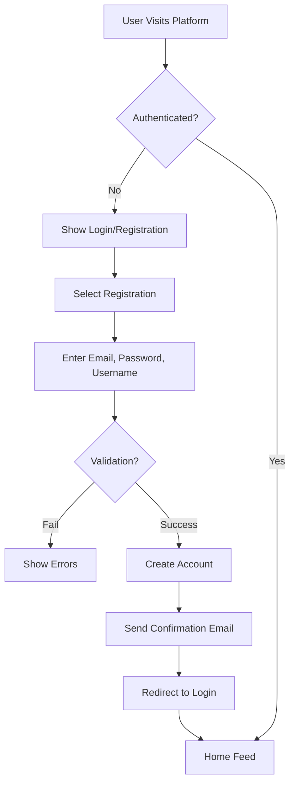
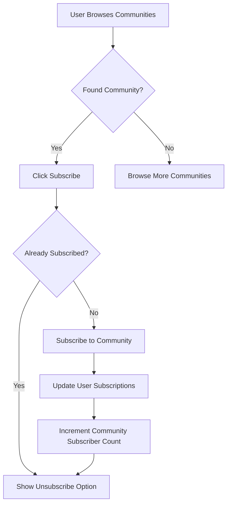
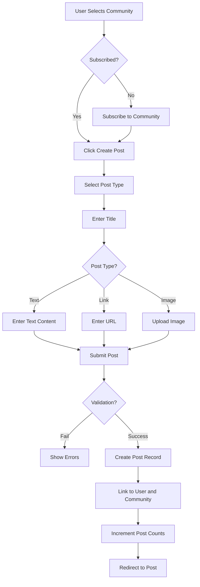
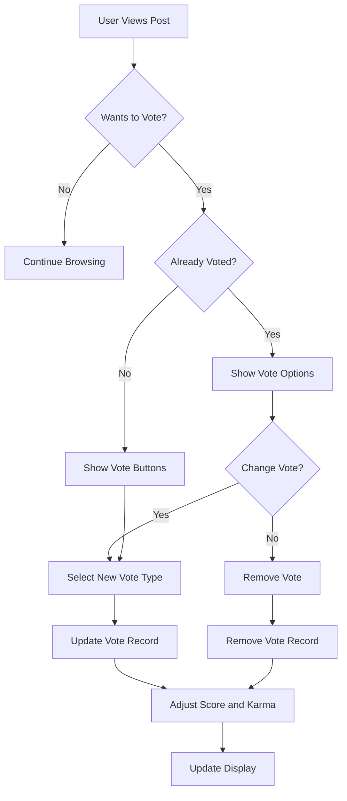
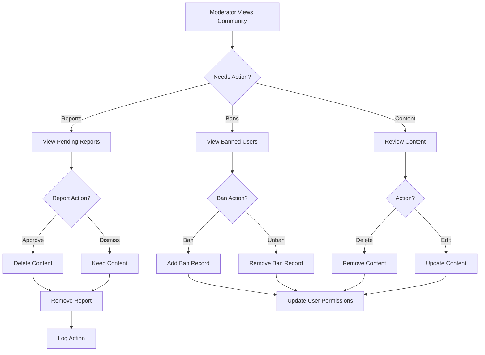

# Requirements Specification Document

## Overview

This document provides comprehensive business requirements for a Reddit-like community platform. The platform enables users to create accounts, join communities, share content, participate in discussions through comments and voting, and maintain community standards through moderation and reporting systems.

## Core Business Requirements

### User Account Management

Users can register with email and password, then authenticate using their credentials. Account management includes profile customization, password changes, and account deletion.

**Registration Requirements**

WHEN a user visits the registration page, THE system SHALL present a form requiring:
- Email address (unique identifier)
- Password (secure password requirements)
- Username (unique alphanumeric identifier)

WHEN a user submits registration information, THE system SHALL:
- Validate email format and uniqueness
- Validate password strength requirements
- Validate username format and uniqueness
- Create a new user account
- Send confirmation email to the provided address

WHEN registration fails, THE system SHALL display appropriate error messages for each validation failure.

**Login Requirements**

WHEN a user visits the login page, THE system SHALL present a form requiring:
- Email address
- Password

WHEN a user submits login credentials, THE system SHALL:
- Validate email and password combination
- Generate authentication token if valid
- Redirect to home page or dashboard
- Store authentication token securely

WHEN login fails, THE system SHALL display "Invalid email or password" error message.

**Password Management**

WHEN a logged-in user requests password change, THE system SHALL:
- Require current password verification
- Require new password input with strength validation
- Require password confirmation
- Update password in database
- Invalidate all active sessions

WHEN password change fails due to incorrect current password, THE system SHALL return appropriate error.

**Account Deletion**

WHEN a user requests account deletion, THE system SHALL:
- Delete all user posts
- Delete all user comments
- Delete user profile information
- Invalidate all authentication tokens
- Update karma scores for affected content

WHEN account deletion is confirmed, THE system SHALL redirect to public landing page.

### User Profile System

Each user has a profile page displaying personal information, activity statistics, and content history.

**Profile Information**

WHEN a user creates their profile, THE system SHALL store:
- Display name (user-chosen public name)
- Bio text (user-written biography)
- Avatar image (user-uploaded profile picture)

WHEN a user edits their profile, THE system SHALL update:
- Display name field
- Bio text field
- Avatar image file

**Profile Display**

WHEN viewing any user's profile page, THE system SHALL display:
- Display name
- Bio text content
- Avatar image
- Total karma score (calculated from post and comment votes)
- List of all posts created by user (with pagination)
- List of all comments written by user (with pagination)

WHEN viewing their own profile, THE user SHALL see additional management options including:
- Edit profile button
- Change password option
- Account deletion option

WHEN viewing another user's profile, THE system SHALL show only view-only information without management options.

**Karma System**

Every user has a single karma score that changes based on community feedback.

**Karma Calculation**

WHEN a user's post receives an upvote, THE system SHALL increase their karma by 1.

WHEN a user's post receives a downvote, THE system SHALL decrease their karma by 1.

WHEN a user's comment receives an upvote, THE system SHALL increase their karma by 1.

WHEN a user's comment receives a downvote, THE system SHALL decrease their karma by 1.

WHEN a user's vote is removed from a post or comment, THE system SHALL adjust karma accordingly:
- If vote was upvote, decrease karma by 1
- If vote was downvote, increase karma by 1

WHEN a user's post or comment is deleted, THE system SHALL remove associated karma changes from their total.

**Karma Display**

WHEN displaying a user's karma score, THE system SHALL:
- Show the total karma value
- Show "karma" label
- Display negative values with minus sign when applicable

### Community Management System

Users can create and join communities, each with its own theme and moderation.

**Community Creation**

WHEN a logged-in user requests to create a community, THE system SHALL:
- Require community name (alphanumeric, hyphens, underscores only)
- Require community description text
- Require community icon image upload
- Create community record in database
- Assign creator as community owner
- Subscribe creator to their new community

WHEN community creation fails due to name collision, THE system SHALL return "Community name already exists" error.

**Community Management**

WHEN a community owner requests to edit community settings, THE system SHALL:
- Allow name editing (if no collision exists)
- Allow description editing
- Allow icon image replacement
- Update community record in database

WHEN an owner transfers community ownership, THE system SHALL:
- Validate transfer recipient exists and is in community
- Update owner field in community record
- Grant new owner all owner permissions
- Remove owner permissions from previous owner

**Community Listing**

WHEN a user requests the community list, THE system SHALL:
- Return all communities with subscriber counts
- Include community name, description, and icon
- Support pagination for large result sets
- Include search functionality by name

WHEN a user searches for communities by name, THE system SHALL:
- Match partial community names
- Return results sorted by relevance
- Include subscriber counts in results

**Subscription System**

WHEN a logged-in user subscribes to a community, THE system SHALL:
- Verify user exists and community exists
- Create subscription record in database
- Increment community subscriber count
- Add community to user's subscribed list

WHEN a user unsubscribes from a community, THE system SHALL:
- Verify user exists and community exists
- Remove subscription record from database
- Decrement community subscriber count
- Remove community from user's subscribed list

WHEN a user views their subscribed communities list, THE system SHALL:
- Return all communities they are subscribed to
- Include subscriber counts for each community
- Include their subscription status

**Community Display**

WHEN viewing a community page, THE system SHALL display:
- Community name
- Community description
- Community icon
- Subscriber count
- List of moderators and owner
- List of banned users (for moderators)

WHEN viewing a community the user is subscribed to, THE system SHALL:
- Show unsubscribe button
- Show community management options (for owners/moderators)

WHEN viewing a community the user is NOT subscribed to, THE system SHALL:
- Show subscribe button
- Show community creation option (for logged-in users)

### Post System

Users can create and interact with content in the form of posts within communities.

**Post Creation**

WHEN a logged-in subscribed user creates a post, THE system SHALL:
- Accept post title (required field)
- Accept post type selection (text, link, or image)
- For text posts: accept text content
- For link posts: accept URL
- For image posts: accept image upload
- Create post record in database
- Link post to user and community
- Increment post count for user and community

WHEN post creation fails validation, THE system SHALL:
- Show "Title is required" error
- Show "Content is required" error for text posts
- Show "Invalid URL" error for link posts
- Show "Image upload failed" error for image posts

**Post Types**

The system supports three post types:

- **Text Post**: Contains text content only
- **Link Post**: Contains URL to external resource
- **Image Post**: Contains uploaded image file

WHEN displaying post type indicators, THE system SHALL show appropriate icons:
- Text post: Text icon
- Link post: Link icon
- Image post: Image icon

**Post Editing**

WHEN a post author requests to edit their post, THE system SHALL:
- Verify user is the post author
- Allow title modification
- Allow content modification (text posts)
- Allow URL modification (link posts)
- Allow image replacement (image posts)
- Update post record in database

WHEN non-author attempts to edit post, THE system SHALL return 403 Forbidden.

**Post Deletion**

WHEN a post author requests to delete their post, THE system SHALL:
- Verify user is the post author or moderator
- Delete post record from database
- Delete associated votes
- Delete associated comments
- Decrement post count for user and community
- Update karma scores for affected users

WHEN a moderator requests to delete any post, THE system SHALL:
- Verify moderator has permissions for the post's community
- Delete post record from database
- Delete associated votes
- Delete associated comments
- Update karma scores for affected users

**Post Display**

WHEN viewing a single post, THE system SHALL display:
- Post title
- Author name and profile link
- Community name and link
- Vote score
- Upvote/downvote buttons with current user's vote state
- Content (text, link, or image based on post type)
- Comment section with comment count
- Time since posting
- Edit and delete buttons (for author)
- Share options

WHEN displaying post content based on type:
- Text posts: Show full text content
- Link posts: Show link preview with domain name
- Image posts: Show image with download option

### Post Voting System

Users can vote on posts to indicate approval or disapproval.

**Vote Mechanics**

WHEN a logged-in user upvotes a post, THE system SHALL:
- Verify user has not already voted
- Create upvote record
- Increment post vote score by 1
- Increment post author's karma by 1

WHEN a logged-in user downvotes a post, THE system SHALL:
- Verify user has not already voted
- Create downvote record
- Decrement post vote score by 1
- Decrement post author's karma by 1

WHEN a user changes their vote, THE system SHALL:
- Remove previous vote record
- Create new vote record with new vote type
- Adjust post score by 2 (e.g., upvote to downvote: -1 -1 = -2)
- Adjust author karma accordingly

WHEN a user removes their vote, THE system SHALL:
- Remove vote record
- Reverse karma change for author
- Keep post score unchanged (removes vote from total)

**Vote Restrictions**

WHEN a user attempts to vote on their own post, THE system SHALL:
- Deny the vote
- Return appropriate error message

WHEN a logged-out user attempts to vote, THE system SHALL:
- Deny the vote
- Redirect to login or show authentication prompt

**Vote Display**

WHEN displaying post vote information, THE system SHALL:
- Show vote score (upvotes minus downvotes)
- Show upvote count and downvote count separately
- Highlight current user's vote state
- Show "vote" label for score

### Post Feeds

The platform provides three feed types for viewing posts with different content scopes and sorting options.

**Home Feed**

WHEN a logged-in user accesses their home feed, THE system SHALL:
- Show posts only from communities they are subscribed to
- Apply requested sorting algorithm
- Paginate results
- Show posts with preview content

WHEN a logged-out user accesses home feed URL, THE system SHALL:
- Redirect to login page
- Show "Login required" message

**Popular Feed**

WHEN any user (logged-in or logged-out) accesses popular feed, THE system SHALL:
- Show posts from all communities
- Apply requested sorting algorithm
- Paginate results
- Show posts with preview content

**Community Feed**

WHEN any user accesses a community's feed, THE system SHALL:
- Show posts only from that community
- Apply requested sorting algorithm
- Paginate results
- Show posts with preview content

**Sorting Algorithms**

WHEN a user requests sorting, THE system SHALL support:

- **Hot**: Rank by recent activity and vote score
- **New**: Sort by creation time (most recent first)
- **Top**: Sort by vote score with time filters
- **Controversial**: Rank by vote count with score near zero

WHEN user selects "Top" sorting, THE system SHALL:
- Provide time filter options (today, this week, this month, this year, all time)
- Apply selected time filter to content sorting

**Feed Display Requirements**

WHEN displaying post list in any feed, THE system SHALL show for each post:
- Title
- Author username with profile link
- Community name with community link
- Vote score
- Comment count
- Time since posted (e.g., "3 hours ago")

WHEN displaying post preview based on type:
- Text posts: Show first 200 characters
- Link posts: Show domain name of URL
- Image posts: Show image thumbnail

**Pagination**

WHEN feed results exceed display limit, THE system SHALL:
- Return paginated results
- Include next page token/indicator
- Allow user to navigate between pages
- Maintain sorting order across pages

### Comment System

Users can engage in discussions through comments on posts.

**Comment Creation**

WHEN a logged-in user creates a comment, THE system SHALL:
- Accept comment content text
- Link comment to post
- Create comment record in database
- Set comment author to logged-in user
- Set comment timestamp

WHEN a user creates a reply to a comment, THE system SHALL:
- Accept reply content text
- Link reply to parent comment
- Create reply record in database
- Set reply author to logged-in user
- Set reply timestamp
- Increment parent comment's reply count

**Nested Reply Structure**

WHEN a user creates a reply to any comment, THE system SHALL:
- Allow unlimited nesting depth
- Link reply to parent comment
- Maintain thread relationship in database
- Support reply to reply chains

WHEN displaying comment thread, THE system SHALL:
- Show parent comment
- Show all replies recursively
- Maintain indentation or visual nesting
- Show reply count for each comment

**Comment Editing**

WHEN a comment author requests to edit their comment, THE system SHALL:
- Verify user is the comment author
- Accept updated content text
- Update comment record in database
- Record edit timestamp

WHEN non-author attempts to edit comment, THE system SHALL return 403 Forbidden.

**Comment Deletion**

WHEN a comment author requests to delete their comment, THE system SHALL:
- Verify user is the comment author or moderator
- Delete comment record from database
- Delete associated votes
- Delete all replies (recursive)
- Decrement parent comment's reply count
- Update karma scores for affected users

WHEN a moderator requests to delete any comment, THE system SHALL:
- Verify moderator has permissions for the comment's post's community
- Delete comment record from database
- Delete associated votes
- Delete all replies (recursive)
- Update karma scores for affected users

**Comment Sorting**

WHEN displaying comments on a post, THE system SHALL support sorting by:
- **Best**: Sort by vote score (highest first)
- **New**: Sort by creation time (most recent first)
- **Controversial**: Sort by vote count with score near zero

**Comment Display**

WHEN displaying a comment, THE system SHALL show:
- Author username with profile link
- Comment content
- Vote score
- Time since posted
- Upvote/downvote buttons
- Reply button
- Edit and delete buttons (for author)

WHEN displaying a comment with replies, THE system SHALL:
- Show all replies recursively
- Maintain visual nesting structure
- Show total reply count

### Moderation System

The platform implements a multi-tier moderation system with role-based permissions.

**Moderator Roles**

The system supports two moderation roles:

- **Owner**: Community founder with complete control
- **Moderator**: Appointed users with moderation authority

**Role Hierarchy**

- Owner has all permissions including moderator permissions
- Moderator has moderation permissions but cannot manage roles
- Owner can appoint and remove moderators
- Moderators cannot manage roles (cannot appoint or remove other moderators or owners)

**Moderation Permissions**

**Moderator Permissions**

WHEN a user has moderator status in a community, THE system SHALL grant them:
- Delete any post in their community
- Delete any comment in their community
- Ban users from their community
- Unban users from their community
- View banned users list
- View all reports for their community
- Approve reports (deleting reported content)
- Dismiss reports (keeping reported content)

**Owner Permissions**

WHEN a user has owner status in a community, THE system SHALL grant them:
- All moderator permissions
- Create new communities
- Appoint moderators to their community
- Remove moderators from their community
- Edit community settings (name, description, icon)
- Transfer community ownership

**Ban System**

WHEN a moderator or owner bans a user from a community, THE system SHALL:
- Create ban record in database
- Prevent banned user from creating posts in that community
- Prevent banned user from creating comments in that community
- Allow banned user to still view content in that community
- Record ban timestamp and reason

WHEN a moderator or owner unbans a user from a community, THE system SHALL:
- Remove ban record from database
- Restore banned user's ability to create posts
- Restore banned user's ability to create comments
- Record unban timestamp

WHEN a banned user attempts to create a post in a banned community, THE system SHALL:
- Deny post creation
- Return "You are banned from this community" error

WHEN a banned user attempts to create a comment in a banned community, THE system SHALL:
- Deny comment creation
- Return "You are banned from this community" error

**Community Settings Management**

WHEN a community owner requests to edit community settings, THE system SHALL:
- Verify user is the community owner
- Allow name editing (with collision check)
- Allow description editing
- Allow icon image replacement
- Update community record in database

WHEN a non-owner attempts to edit community settings, THE system SHALL return 403 Forbidden.

### Reporting System

The platform implements a content reporting system for community moderation.

**Reporting Process**

WHEN a user reports content (post or comment), THE system SHALL:
- Accept report reason (required text field)
- Record reporter's user ID (anonymous to reported user)
- Record reported content reference
- Create report record in database
- Notify moderators of the affected community

WHEN a user reports content, THE system SHALL protect the reporter's identity:
- Reported user cannot see who reported them
- Report author remains anonymous to reported user
- Only moderators can see reporter information

**Report Viewing**

WHEN a moderator accesses their community's reports, THE system SHALL:
- Show all pending reports for their community
- Include reported content preview
- Include reporter's user ID
- Include report reason text
- Include report creation timestamp

WHEN a non-moderator accesses reports URL, THE system SHALL return 403 Forbidden.

**Moderator Review Actions**

**Approve Report**

WHEN a moderator approves a report, THE system SHALL:
- Delete the reported content (post or comment)
- Remove report from pending reports list
- Record moderation action in log
- Update karma scores for affected users
- Notify reporter of action taken

**Dismiss Report**

WHEN a moderator dismisses a report, THE system SHALL:
- Remove report from pending reports list
- Keep reported content intact
- Record moderation action in log
- Notify reporter of dismissal

**Report Resolution**

WHEN a report is either approved or dismissed, THE system SHALL:
- Remove report from active reports list
- Record final action in moderation log
- Update any affected user karma scores
- Send notification to reporter

**Report History**

WHEN viewing moderation history, THE system SHALL:
- Show approved and dismissed reports
- Include reporter information (moderator view only)
- Include moderator decision
- Include timestamp of decision
- Allow filtering by date range

## Authentication and Authorization

### Authentication System

The platform implements JWT-based authentication for all protected endpoints.

**Registration Authentication**

WHEN a user registers, THE system SHALL:
- Create user account with encrypted password
- Generate initial JWT token
- Return token to client
- Store refresh token for session management

**Login Authentication**

WHEN a user logs in, THE system SHALL:
- Validate credentials against database
- Generate JWT token with user ID and role
- Generate refresh token for session persistence
- Return both tokens to client
- Store refresh token securely

**Token Validation**

WHEN a protected endpoint is accessed, THE system SHALL:
- Validate JWT token signature
- Verify token has not expired
- Check user has required role for action
- Grant or deny access based on validation

**Session Management**

WHEN a user logs out, THE system SHALL:
- Invalidate current JWT token
- Remove refresh token from storage
- Clear user session data

WHEN a user changes password, THE system SHALL:
- Invalidate all active JWT tokens
- Require re-authentication on next request
- Issue new tokens after password update

### Authorization Controls

**Role-Based Access Control**

WHEN a request requires authentication, THE system SHALL:
- Verify JWT token validity
- Extract user role from token
- Check role against required permission level
- Grant or deny access accordingly

**Permission Matrix Implementation**

The following permission matrix implements access controls:

| Action | Guest | Member | Moderator | Owner |
|--------|-------|--------|-----------|-------|
| Create account | ❌ | ✅ | ✅ | ✅ |
| Log in | ❌ | ✅ | ✅ | ✅ |
| View popular feed | ✅ | ✅ | ✅ | ✅ |
| View community feeds | ✅ | ✅ | ✅ | ✅ |
| View community list | ✅ | ✅ | ✅ | ✅ |
| Search communities | ✅ | ✅ | ✅ | ✅ |
| Create posts | ❌ | ✅ | ✅ | ✅ |
| Comment on posts | ❌ | ✅ | ✅ | ✅ |
| Vote on posts | ❌ | ✅ | ✅ | ✅ |
| Vote on comments | ❌ | ✅ | ✅ | ✅ |
| Subscribe to communities | ❌ | ✅ | ✅ | ✅ |
| Edit own posts | ❌ | ✅ | ✅ | ✅ |
| Delete own posts | ❌ | ✅ | ✅ | ✅ |
| Edit own comments | ❌ | ✅ | ✅ | ✅ |
| Delete own comments | ❌ | ✅ | ✅ | ✅ |
| Report content | ❌ | ✅ | ✅ | ✅ |
| Delete any post in community | ❌ | ❌ | ✅ | ✅ |
| Delete any comment in community | ❌ | ❌ | ✅ | ✅ |
| Ban users from community | ❌ | ❌ | ✅ | ✅ |
| Unban users from community | ❌ | ❌ | ✅ | ✅ |
| View banned users list | ❌ | ❌ | ✅ | ✅ |
| View community reports | ❌ | ❌ | ✅ | ✅ |
| Approve reports | ❌ | ❌ | ✅ | ✅ |
| Dismiss reports | ❌ | ❌ | ✅ | ✅ |
| Create communities | ❌ | ❌ | ❌ | ✅ |
| Appoint moderators | ❌ | ❌ | ❌ | ✅ |
| Remove moderators | ❌ | ❌ | ❌ | ✅ |
| Edit community settings | ❌ | ❌ | ❌ | ✅ |

**Community-Specific Permissions**

WHEN checking community-specific permissions, THE system SHALL:
- Verify user's relationship to specific community
- Check if user is owner, moderator, or subscriber
- Grant permissions based on role within that community

## Business Workflow

### User Onboarding Flow

### Community Subscription Flow

### Post Creation Flow

### Voting Flow

### Moderation Action Flow

## Error Handling

### Authentication Errors

WHEN authentication fails, THE system SHALL:
- Return appropriate HTTP status code
- Provide clear error message
- Log security-relevant errors
- Support retry mechanisms

**HTTP Status Codes**

| Error Type | Status Code | Description |
|------------|-------------|-------------|
| Invalid credentials | 401 | Authentication failed |
| Expired token | 401 | Token has expired |
| Invalid token | 401 | Token signature invalid |
| Insufficient permissions | 403 | User lacks required role |
| Rate limited | 429 | Too many authentication attempts |

### Business Logic Errors

WHEN business validation fails, THE system SHALL:
- Return HTTP 400 Bad Request
- Include specific error messages
- Provide validation details
- Support user correction

**Common Validation Errors**

| Error Type | Error Message |
|------------|---------------|
| Email already exists | "Email is already registered" |
| Username already exists | "Username is already taken" |
| Invalid URL format | "URL format is invalid" |
| Community name exists | "Community name is already in use" |
| Already subscribed | "Already subscribed to this community" |
| Not subscribed | "Must be subscribed to create posts" |
| Content not found | "Requested content does not exist" |
| Permission denied | "You do not have permission to perform this action" |
| User banned | "You are banned from this community" |

### System Errors

WHEN system errors occur, THE system SHALL:
- Return HTTP 500 Internal Server Error
- Log error details for debugging
- Provide user-friendly error messages
- Support error recovery

## Performance Requirements

### Response Time Requirements

WHEN the system processes requests, THE response times shall be:
- Authentication requests: < 500ms
- Feed requests: < 2000ms
- Content creation: < 1000ms
- Voting operations: < 500ms
- Moderation actions: < 1000ms

### Scalability Requirements

WHEN user load increases, THE system SHALL:
- Support horizontal scaling
- Maintain consistent response times
- Handle concurrent users efficiently
- Scale database operations appropriately

### Data Integrity Requirements

WHEN data operations occur, THE system SHALL:
- Maintain ACID compliance
- Prevent race conditions in voting
- Ensure transaction consistency
- Support data recovery operations

## Conclusion

This requirements specification document provides comprehensive business requirements for a Reddit-like community platform. All requirements are defined in natural language with specific conditions and behaviors to ensure clear implementation guidance for the development team.

The document covers all core functionality including user account management, profile system, community management, post system, voting system, feed system, comment system, moderation system, and reporting system. Authentication, authorization, and business workflows are fully specified to ensure secure and reliable operation.

All technical implementation details including API endpoints, database schemas, and code structure are left to the development team's discretion based on these business requirements.