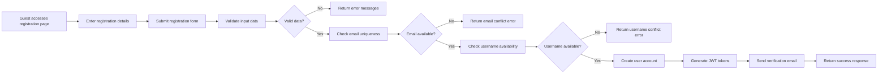
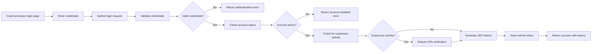

# Authentication Requirements Specification

## Overview

This document provides comprehensive authentication system requirements for the Reddit-like community platform. The authentication system enables secure user registration, login, session management, and password recovery while supporting the platform's four distinct user actors: Guest, Member, Moderator, and Owner.

## Authentication Requirements

### Core Authentication Functions

#### User Registration

WHEN a guest accesses the registration page, THE system SHALL provide a registration form requiring email address, password, and username.

WHEN a guest submits a registration request, THE system SHALL validate that the email address is in valid email format.

WHEN a guest submits a registration request, THE system SHALL validate that the password meets minimum security requirements (minimum 8 characters, contains at least one uppercase letter, one lowercase letter, and one number).

WHEN a guest submits a registration request, THE system SHALL validate that the username is unique and not already taken.

WHEN a guest submits a registration request, THE system SHALL validate that the username contains only alphanumeric characters, underscores, and hyphens.

WHEN a guest submits a registration request, THE system SHALL validate that the username is between 3 and 30 characters in length.

WHEN a guest submits a registration request, THE system SHALL validate that no password matches the email address or username.

WHEN a guest submits a registration request with valid data, THE system SHALL create a new member account with the provided credentials and set the default display name to the provided username.

WHEN a guest submits a registration request with valid data, THE system SHALL send a verification email to the provided email address.

WHEN a guest submits a registration request with valid data, THE system SHALL generate a JWT access token (15 minutes expiration) and refresh token (7 days expiration) for the new account.

WHEN a guest submits a registration request with valid data, THE system SHALL return HTTP 201 Created with user account details.

WHEN a guest submits a registration request with an email address that already exists, THE system SHALL return HTTP 409 Conflict with error code AUTH_EMAIL_ALREADY_EXISTS.

WHEN a guest submits a registration request with a username that already exists, THE system SHALL return HTTP 409 Conflict with error code AUTH_USERNAME_ALREADY_EXISTS.

WHEN a guest submits a registration request with invalid email format, THE system SHALL return HTTP 400 Bad Request with error code AUTH_INVALID_EMAIL_FORMAT.

WHEN a guest submits a registration request with a password that doesn't meet security requirements, THE system SHALL return HTTP 400 Bad Request with error code AUTH_WEAK_PASSWORD.

WHEN a guest submits a registration request with a username that contains invalid characters, THE system SHALL return HTTP 400 Bad Request with error code AUTH_INVALID_USERNAME.

WHEN a guest submits a registration request with a username that is too short or too long, THE system SHALL return HTTP 400 Bad Request with error code AUTH_USERNAME_LENGTH_INVALID.

WHERE email verification is enabled, IF the user does not verify their email within 7 days, THEN THE system SHALL invalidate the account and delete the user data.

#### User Login

WHEN a guest submits login credentials, THE system SHALL validate the email address and password against stored user credentials.

WHEN a guest submits login credentials, THE system SHALL validate that the email address is in valid email format.

WHEN a guest submits login credentials with valid authentication, THE system SHALL verify that the account is not banned or deactivated.

WHEN a guest submits login credentials with valid authentication, THE system SHALL return HTTP 200 OK with JWT access token and refresh token.

WHEN a guest submits login credentials with valid authentication, THE system SHALL include the user's actor role in the JWT payload.

WHEN a guest submits login credentials with valid authentication, THE system SHALL record the login timestamp and IP address for security auditing.

WHEN a guest submits login credentials with invalid password, THE system SHALL return HTTP 401 Unauthorized with error code AUTH_INVALID_CREDENTIALS.

WHEN a guest submits login credentials with non-existent email address, THE system SHALL return HTTP 401 Unauthorized with error code AUTH_USER_NOT_FOUND.

WHEN a guest submits login credentials with a banned account, THE system SHALL return HTTP 403 Forbidden with error code AUTH_ACCOUNT_BANNED.

WHEN a guest submits login credentials with a deactivated account, THE system SHALL return HTTP 403 Forbidden with error code AUTH_ACCOUNT_DEACTIVATED.

WHEN a guest submits login credentials with a banned account, THE system SHALL return HTTP 403 Forbidden with error code AUTH_ACCOUNT_BANNED.

WHEN a guest submits login credentials with a deactivated account, THE system SHALL return HTTP 403 Forbidden with error code AUTH_ACCOUNT_DEACTIVATED.

WHEN a guest attempts login from a new device or location, THE system SHALL require two-factor authentication if enabled.

WHERE two-factor authentication is enabled, IF a user logs in from a new device, THEN THE system SHALL require a verification code sent to the user's registered phone number or authenticator app.

#### Session Management

WHILE a user is authenticated, THE system SHALL maintain an active session using JWT tokens.

THE access token SHALL expire after 15 minutes of inactivity or 1 hour from issuance.

THE refresh token SHALL expire after 7 days of inactivity or 30 days from issuance.

WHEN an access token is expired but the refresh token is still valid, THE system SHALL issue a new access token upon request.

WHEN both access and refresh tokens are expired, THE system SHALL require the user to log in again.

THE system SHALL support token revocation for all devices when users request account security actions.

WHEN a user logs out, THE system SHALL invalidate the current refresh token.

WHEN a user changes their password, THE system SHALL invalidate all active sessions and require re-authentication.

WHEN a user deletes their account, THE system SHALL immediately invalidate all active sessions.

WHERE two-factor authentication is enabled, THE system SHALL maintain separate session durations for trusted and untrusted devices.

#### Password Management

WHEN a user wants to change their password, THE system SHALL require verification of their current password.

WHEN a user submits a new password, THE system SHALL validate that the new password meets the minimum security requirements.

WHEN a user submits a new password, THE system SHALL validate that the new password is different from the current password.

WHEN a user submits a new password, THE system SHALL validate that the new password is not in a list of compromised passwords.

WHEN a user submits a valid password change request, THE system SHALL update the password hash and invalidate all active sessions.

WHEN a user submits an invalid current password, THE system SHALL return HTTP 401 Unauthorized with error code AUTH_INVALID_CURRENT_PASSWORD.

WHEN a user submits a new password that doesn't meet security requirements, THE system SHALL return HTTP 400 Bad Request with error code AUTH_WEAK_PASSWORD.

WHERE password reset is requested, WHEN a user submits a valid email address, THE system SHALL send a password reset link with a time-limited token.

WHERE password reset is requested, WHEN a user clicks a password reset link, THE system SHALL validate that the token is still valid and not expired (24 hours).

WHERE password reset is requested, WHEN a user submits a new password via reset link, THE system SHALL validate that the new password meets security requirements and update the password hash.

WHERE password reset is requested, WHEN a password reset link expires, THE system SHALL invalidate the token and require a new reset request.

#### Account Deletion

WHEN a user requests account deletion, THE system SHALL require re-authentication with current password.

WHEN a user requests account deletion, THE system SHALL delete all user-generated content including posts, comments, and profile information.

WHEN a user requests account deletion, THE system SHALL delete all karma history associated with the user.

WHEN a user requests account deletion, THE system SHALL remove the user from all communities.

WHEN a user requests account deletion, THE system SHALL delete all personal data except as required by law.

WHEN a user requests account deletion, THE system SHALL log the deletion timestamp and send a confirmation email.

WHERE a user attempts to delete an account that owns a community, THE system SHALL require transferring ownership or disbanding the community first.

### Session Security

#### Token Storage and Management

THE system SHALL store refresh tokens in secure, database-backed storage with encryption at rest.

THE system SHALL use JWT access tokens with HS256 or RS256 signing algorithm.

THE access token payload SHALL include: userId, actor role, permissions array, and issued-at timestamp.

THE refresh token payload SHALL include: userId, issued-at timestamp, and device identifier.

THE system SHALL implement token rotation where each refresh token usage generates a new token.

WHERE token rotation is implemented, THE system SHALL maintain a token rotation history for security auditing.

#### IP and Device Tracking

THE system SHALL record the IP address and device fingerprint for each login event.

THE system SHALL track the number of active sessions per user account.

WHEN a user has more than 5 active sessions, THE system SHALL warn the user and provide session management options.

THE system SHALL allow users to view and terminate active sessions from other devices.

#### Suspicious Activity Detection

WHILE multiple failed login attempts occur from the same IP address, THE system SHALL implement rate limiting.

WHEN 5 failed login attempts occur within 10 minutes, THE system SHALL temporarily lock the account for 15 minutes.

WHEN suspicious activity is detected (multiple accounts from same device, unusual geographic location), THE system SHALL require additional verification.

WHERE suspicious activity is detected, THE system SHALL notify the user via email with options to secure their account.

## Authentication Flow

### Registration Flow



### Login Flow



### Password Reset Flow

```mermaid
graph LR
  A["User requests password reset"] --> B["Enter email address"]
  B --> C["Submit password reset request"]
  C --> D["Verify email exists"]
  D --> E{"Email exists?"}
  E -->|No| F["Return generic success message"]
  E -->|Yes| G["Generate reset token"]
  G --> H["Send reset email with token"]
  H --> I["User clicks reset link"]
  I --> J["Validate token expiration"]
  J --> K{"Token valid?"}
  K -->|No| L["Return token expired error"]
  K -->|Yes| M["Show password change form"]
  M --> N["User submits new password"]
  N --> O["Validate new password requirements"]
  O --> P{"Valid password?"}
  P -->|No| Q["Return password validation error"]
  P -->|Yes| R["Update password hash"]
  R --> S["Invalidate all sessions"]
  S --> T["Send confirmation email"]
```



## Actor-Specific Authentication Requirements

### Guest Actor

THE guest actor SHALL have access to the following public endpoints without authentication:
- Browse communities list
- View popular feed posts
- View community-specific feeds
- View user profiles (public information only)
- Search communities and posts

WHERE guest access is allowed, THE system SHALL track anonymous session IDs for analytics purposes.

THE guest actor SHALL NOT have access to authenticated endpoints including:
- Create posts or comments
- Vote on content
- Subscribe to communities
- Access home feed
- Manage account settings

### Member Actor

WHEN a user authenticates as a member, THE system SHALL assign the following default permissions:
- Create, edit, and delete own posts
- Create, edit, and delete own comments
- Vote on posts and comments
- Subscribe to communities
- Manage own profile and settings
- View home feed
- Access personal karma metrics

THE member actor SHALL NOT have access to moderator-level permissions including:
- Delete other users' content
- Ban other users
- Manage community settings
- Access moderator reports

### Moderator Actor

WHEN a user authenticates as a moderator, THE system SHALL assign the following additional permissions:
- Delete any post or comment in their assigned communities
- Ban users from their assigned communities
- View community reports
- Approve or dismiss reported content
- Manage community settings (within owner-defined limits)

WHERE a user has moderator status, THE system SHALL include the moderator flag and assigned community IDs in the JWT payload.

THE moderator actor SHALL still be restricted from:
- Deleting content from communities they don't moderate
- Banning users from communities they don't moderate
- Removing owners from their communities
- Managing users with higher authority

### Owner Actor

WHEN a user authenticates as an owner, THE system SHALL assign the following highest-level permissions:
- Complete control over their communities including all moderator actions
- Appoint and remove moderators
- Transfer community ownership
- Delete entire communities
- View all community analytics
- Configure community settings and policies

WHERE a user is a community owner, THE system SHALL include the owner flag and community ID in the JWT payload.

THE owner actor SHALL have all moderator permissions plus:
- Override all moderation decisions
- Access all reports for their community
- Manage all community members
- Modify community rules and guidelines

## Security Requirements

### Password Security

WHEN storing user passwords, THE system SHALL use bcrypt with a cost factor of at least 12.

THE system SHALL never store passwords in plain text or reversible encryption.

THE system SHALL implement password history to prevent reuse of the last 5 passwords.

THE system SHALL validate passwords against known compromised password databases.

### Communication Security

ALL authentication endpoints SHALL require HTTPS with TLS 1.3 or higher.

ALL API responses containing sensitive data SHALL be encrypted in transit.

THE system SHALL implement Content Security Policy headers to prevent XSS attacks.

### Data Protection

THE system SHALL implement rate limiting on all authentication endpoints (5 attempts per minute per IP).

WHEN sensitive operations occur, THE system SHALL require re-authentication (password change, account deletion).

THE system SHALL implement account activity logs including login attempts, password changes, and security events.

### Error Handling Security

WHERE authentication fails, THE system SHALL return generic error messages that don't reveal specific user information.

WHEN email addresses are checked during registration, THE system SHALL return the same response for existing or non-existing emails to prevent user enumeration.

THE system SHALL never expose internal error details to users in production environments.

## Session and Device Management

### Concurrent Session Handling

THE system SHALL allow users to maintain up to 5 active sessions simultaneously.

WHEN a user exceeds 5 active sessions, THE system SHALL prompt the user to terminate existing sessions.

THE system SHALL provide users with a list of active sessions including device type, location, and last active time.

WHERE a user selects "Sign out from all devices", THE system SHALL invalidate all refresh tokens associated with that account.

### Device Trust Management

THE system SHALL implement device fingerprinting using browser characteristics and IP information.

WHERE a user logs in from a trusted device, THE system SHALL extend refresh token validity.

WHERE a user logs in from a new device, THE system SHALL require additional verification steps.

THE system SHALL allow users to mark devices as trusted or untrusted in their security settings.

## Two-Factor Authentication

### 2FA Implementation

WHEN two-factor authentication is enabled, THE system SHALL require a second verification factor during login.

THE system SHALL support multiple 2FA methods including:
- Time-based one-time passwords (TOTP) via authenticator apps
- SMS-based one-time codes
- Email-based one-time codes
- Hardware security keys (optional)

WHERE TOTP is used, THE system SHALL generate a secret key and provide a QR code for easy setup.

WHERE SMS or email 2FA is used, THE system SHALL implement rate limiting to prevent abuse.

WHEN a user enables 2FA, THE system SHALL require verification of the second factor before completing setup.

WHEN a user disables 2FA, THE system SHALL require authentication with current credentials.

### Recovery and Backup Codes

WHERE 2FA is enabled, THE system SHALL generate and display backup codes that can be used for account recovery.

THE system SHALL require users to store backup codes securely and warn about recovery implications.

WHERE backup codes are used, THE system SHALL invalidate each code after a single use.

## API Authentication Specification

### Request Header Format

WHEN accessing protected endpoints, THE client SHALL include the Authorization header with format: `Bearer <access_token>`

WHERE access tokens are expired, THE client SHALL use refresh tokens to obtain new access tokens.

### Authentication Error Responses

WHEN authentication fails due to invalid token, THE system SHALL return HTTP 401 Unauthorized with body:
```json
{
  "error": "invalid_token",
  "message": "The provided access token is invalid or expired"
}
```

WHEN authentication fails due to insufficient permissions, THE system SHALL return HTTP 403 Forbidden with body:
```json
{
  "error": "insufficient_permissions",
  "message": "You do not have permission to perform this action"
}
```

WHEN rate limiting is exceeded, THE system SHALL return HTTP 429 Too Many Requests with body:
```json
{
  "error": "rate_limit_exceeded",
  "message": "Too many authentication attempts. Please try again later."
}
```

## Session Termination Scenarios

WHEN a user logs out, THE system SHALL invalidate the refresh token used for that session.

WHEN a user changes their password, THE system SHALL invalidate all active sessions except the current one.

WHEN a user deletes their account, THE system SHALL immediately invalidate all sessions.

WHERE an administrator bans a user, THE system SHALL immediately invalidate all active sessions.

WHERE suspicious activity is detected, THE system SHALL invalidate all active sessions and require re-authentication.

## Authentication Success Metrics

THE system SHALL track the following authentication metrics:
- Registration completion rate
- Login success rate
- Failed login attempts by user and IP
- Password reset request volume
- Token refresh rate
- Concurrent sessions per user
- Authentication errors by type

WHERE authentication metrics exceed thresholds, THE system SHALL trigger alerts for security review.

## Compliance and Legal Requirements

THE system SHALL implement data retention policies for authentication logs in compliance with applicable regulations.

WHERE user data is subject to GDPR or similar privacy regulations, THE system SHALL implement right to erasure for authentication data.

THE system SHALL provide users with access to their authentication activity logs and security settings.

## Error Codes Reference

The system SHALL support the following authentication error codes:
| Error Code | HTTP Status | Description |
|------------|-------------|-------------|
| AUTH_EMAIL_ALREADY_EXISTS | 409 | Email address is already registered |
| AUTH_USERNAME_ALREADY_EXISTS | 409 | Username is already taken |
| AUTH_INVALID_EMAIL_FORMAT | 400 | Email format is invalid |
| AUTH_WEAK_PASSWORD | 400 | Password doesn't meet security requirements |
| AUTH_INVALID_USERNAME | 400 | Username contains invalid characters |
| AUTH_USERNAME_LENGTH_INVALID | 400 | Username length is outside allowed range |
| AUTH_INVALID_CREDENTIALS | 401 | Email or password is incorrect |
| AUTH_USER_NOT_FOUND | 401 | User with this email doesn't exist |
| AUTH_ACCOUNT_BANNED | 403 | Account is banned |
| AUTH_ACCOUNT_DEACTIVATED | 403 | Account has been deactivated |
| AUTH_INVALID_CURRENT_PASSWORD | 401 | Current password verification failed |
| AUTH_TOKEN_EXPIRED | 401 | Access token has expired |
| AUTH_INVALID_TOKEN | 401 | Access token is invalid or malformed |
| AUTH_RATE_LIMITED | 429 | Too many authentication attempts |
| AUTH_INVALID_2FA_CODE | 401 | Two-factor authentication code is invalid |
| AUTH_2FA_REQUIRED | 403 | Two-factor authentication is required |
| AUTH_SESSION_EXPIRED | 401 | Session has expired, please log in again |
| AUTH_PASSWORD_IN_HISTORY | 400 | Password has been used recently |
| AUTH_PASSWORD_COMPROMISED | 400 | Password has been found in a data breach |
