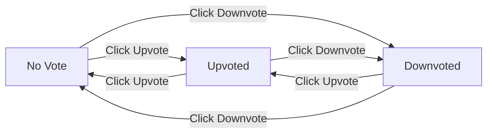
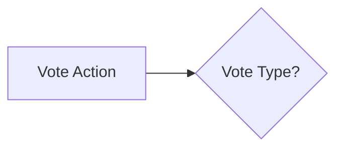

# Voting System Requirements

## Overview

The voting system is a fundamental component of the Reddit-like community platform that drives engagement, content ranking, and user participation. It enables users to express approval or disapproval of content (posts and comments) which directly impacts content visibility, user karma scores, and community dynamics.

This document defines the complete voting system requirements in natural language, covering both post and comment voting mechanics, score calculation logic, and user interaction patterns.

## Business Requirements

### Post Voting Functionality

Users can interact with posts through voting to influence content visibility and express opinion. The system supports three types of interactions:

**Creating a Vote**

WHEN a user votes on a post for the first time, THE system SHALL record the vote and update the post's score by adding 1 for upvotes or subtracting 1 for downvotes.

WHERE a user has not previously voted on a post, THEN THE system SHALL create a new vote record linking the user to the post with their selected vote type.

**Changing a Vote**

WHEN a user changes their vote on a post from upvote to downvote (or vice versa), THE system SHALL adjust the post's score by 2 points in the direction of the new vote (e.g., changing from downvote to upvote adds 2 to the score).

WHEN a user changes their vote on a post, THEN THE system SHALL update the existing vote record to reflect the new vote type.

**Removing a Vote**

WHEN a user removes their vote from a post (by clicking the same vote button again), THE system SHALL delete the vote record and revert the post's score to its previous value (adding 1 if removing a downvote, subtracting 1 if removing an upvote).

WHERE a user has previously voted on a post and clicks the same vote button, THEN THE system SHALL remove the vote entirely rather than creating a duplicate.

**Vote Limitation**

WHERE a user attempts to vote on a post, THEN THE system SHALL limit the user to exactly one active vote per post.

IF a user has an active vote on a post, THEN THE system SHALL prevent creation of additional votes until the existing vote is changed or removed.

WHERE a user attempts to vote on their own post, THEN THE system SHALL deny the vote request and display appropriate error message.

### Comment Voting Functionality

Comment voting operates identically to post voting but applies to comments within the comment hierarchy.

**Creating a Comment Vote**

WHEN a user votes on a comment for the first time, THE system SHALL record the vote and update the comment's score by adding 1 for upvotes or subtracting 1 for downvotes.

WHERE a user has not previously voted on a comment, THEN THE system SHALL create a new vote record linking the user to the comment with their selected vote type.

**Changing a Comment Vote**

WHEN a user changes their vote on a comment from upvote to downvote (or vice versa), THE system SHALL adjust the comment's score by 2 points in the direction of the new vote.

WHEN a user changes their vote on a comment, THEN THE system SHALL update the existing vote record to reflect the new vote type.

**Removing a Comment Vote**

WHEN a user removes their vote from a comment, THE system SHALL delete the vote record and revert the comment's score to its previous value.

WHERE a user has previously voted on a comment and clicks the same vote button, THEN THE system SHALL remove the vote entirely rather than creating a duplicate.

**Comment Vote Limitation**

WHERE a user attempts to vote on a comment, THEN THE system SHALL limit the user to exactly one active vote per comment.

IF a user has an active vote on a comment, THEN THE system SHALL prevent creation of additional votes until the existing vote is changed or removed.

WHERE a user attempts to vote on their own comment, THEN THE system SHALL deny the vote request and display appropriate error message.

### Vote Management Rules

The voting system enforces several business rules to maintain fairness and prevent abuse.

**Authentication Requirement**

WHERE a guest (non-authenticated user) attempts to vote on any post or comment, THEN THE system SHALL deny the vote request and redirect the user to authentication.

WHERE a user is not authenticated, THEN THE system SHALL require valid session token before processing any vote operation.

**Owner Vote Prevention**

WHERE a user attempts to vote on their own post, THEN THE system SHALL deny the vote request with error message "VOTE_OWN_CONTENT_PROHIBITED".

WHERE a user attempts to vote on their own comment, THEN THE system SHALL deny the vote request with error message "VOTE_OWN_COMMENT_PROHIBITED".

**Vote Type Definitions**

- **Upvote (+1)**: Represents approval of content quality, relevance, or value to community
- **Downvote (-1)**: Represents disagreement, low quality, or inappropriate content
- **No Vote (0)**: State when vote is removed or user has not voted

**Vote Display Rules**

WHERE a user views a post or comment listing, THEN THE system SHALL display the net vote score (upvotes minus downvotes).

WHERE a user views their own vote status, THEN THE system SHALL indicate whether they have upvoted, downvoted, or not voted on that content.

**Content Type Coverage**

All post types (text, link, image) support voting functionality identically.

All comment types (top-level and nested replies) support voting functionality identically.

### Score Calculation Logic

The voting system maintains accurate scores through precise arithmetic operations.

**Score Definition**

THE vote score of any post or comment SHALL equal the total number of upvotes minus the total number of downvotes.

THE score calculation SHALL always reflect the current state of all active votes.

**Initial Score State**

WHEN a new post or comment is created, THEN THE system SHALL initialize the score to zero.

**Score Adjustment on Vote Creation**

WHEN a user creates an upvote, THEN THE system SHALL add 1 to the post or comment score.

WHEN a user creates a downvote, THEN THE system SHALL subtract 1 from the post or comment score.

**Score Adjustment on Vote Change**

WHEN a user changes vote from upvote to downvote, THEN THE system SHALL subtract 2 from the score (removing +1, adding -1).

WHEN a user changes vote from downvote to upvote, THEN THE system SHALL add 2 to the score (removing -1, adding +1).

**Score Adjustment on Vote Removal**

WHEN a user removes an upvote, THEN THE system SHALL subtract 1 from the score.

WHEN a user removes a downvote, THEN THE system SHALL add 1 to the score.

**Score Accuracy Requirements**

THE system SHALL maintain score consistency even when multiple votes occur simultaneously.

WHERE vote operations are processed, THEN THE system SHALL ensure final score reflects cumulative effect of all operations.

**Negative Score Support**

WHERE a post or comment receives more downvotes than upvotes, THEN THE system SHALL allow the score to become negative.

THE system SHALL display negative scores clearly (e.g., "-5" not "(5)").

### Vote History and Tracking

The system maintains detailed records of all voting activity for analytics, moderation, and recovery purposes.

**Vote Record Structure**

WHEN a vote is created, THEN THE system SHALL store the following information:

- User identifier who cast the vote
- Post or comment identifier
- Vote type (upvote or downvote)
- Timestamp of when the vote was created
- Timestamp of when the vote was last modified (if applicable)

**Vote Retrieval**

WHERE a user views their own profile, THEN THE system SHALL provide option to view their voting history.

WHERE a moderator reviews reported content, THEN THE system SHALL provide vote history for investigation purposes.

**Vote Analytics**

THE system SHALL maintain aggregate statistics including:

- Total votes cast per user (for user activity metrics)
- Total votes received per post/comment (for content engagement metrics)
- Upvote/downvote ratio per content item (for quality analysis)

**Data Retention Requirements**

WHEN a user deletes their account, THEN THE system SHALL retain vote records for historical accuracy but anonymize user references.

WHEN a post or comment is deleted, THEN THE system SHALL retain vote records for analytics purposes but mark them as associated with deleted content.

### Business Rules Summary

**Voting Rights**

- Only authenticated users can vote
- One vote per user per post/comment (no duplicate votes)
- Users cannot vote on their own content
- All vote operations are irrevocable until explicitly changed or removed

**Score Integrity**

- Scores are always calculated as upvotes minus downvotes
- Negative scores are valid and properly displayed
- Score adjustments are precise (±1 for creation/removal, ±2 for changes)

**User Experience**

- Clear visual indication of current vote status (upvoted/downvoted/not voted)
- Immediate score update after vote operation
- Easy-to-reverse vote actions (click same button to change/remove)

### Error Handling Requirements

**Validation Errors**

IF vote data is malformed or missing required fields, THEN THE system SHALL return HTTP 400 with appropriate error code.

IF user attempts to vote on non-existent content, THEN THE system SHALL return HTTP 404 with error code "CONTENT_NOT_FOUND".

IF user attempts to vote while unauthorized, THEN THE system SHALL return HTTP 401 with error code "AUTHENTICATION_REQUIRED".

IF user attempts to vote on their own content, THEN THE system SHALL return HTTP 403 with error code "VOTE_OWN_CONTENT_PROHIBITED".

**Business Logic Errors**

IF vote operation cannot complete due to system constraints, THEN THE system SHALL return HTTP 500 with error code "VOTE_OPERATION_FAILED".

IF concurrent vote operations create conflicts, THEN THE system SHALL resolve through optimistic locking and retry mechanism.

### Mermaid Diagrams

#### Vote State Machine

#### Vote Score Calculation Flow

