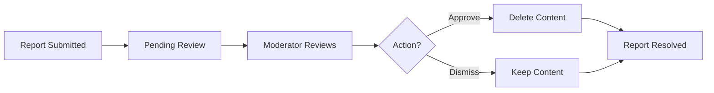

# Reddit-like Community Platform - Functional Requirements Specification

## Overview

This document provides comprehensive functional requirements for the Reddit-like community platform. The platform enables users to create, share, and discover content within specialized interest communities, with sophisticated voting, commenting, and moderation capabilities.

## User Account Management

### Registration Process

WHEN a guest provides valid registration information (unique username, email address, and password), THE system SHALL create a new user account and log them in automatically.

WHEN username already exists, THE system SHALL reject registration and return an appropriate error message.

WHEN email already exists, THE system SHALL reject registration and return an appropriate error message.

WHEN registration data is valid, THE system SHALL create a default member account with basic permissions.

### Login Process

WHEN a guest submits valid credentials (email and password), THE system SHALL authenticate and establish a user session.

WHEN authentication fails due to invalid credentials, THE system SHALL return an appropriate error message.

WHEN authentication fails due to unverified email (if email verification is enabled), THE system SHALL return an appropriate error message.

### Password Management

WHEN a member requests to change their password, THE system SHALL verify their current password and update to the new password.

WHEN password change fails validation (weak password, mismatched confirmation), THE system SHALL return appropriate error messages.

WHEN password meets security requirements, THE system SHALL update the password hash and invalidate all active sessions.

### Account Deletion

WHEN a member requests to delete their account, THE system SHALL:
- Delete the user's account
- Delete all posts created by the user
- Delete all comments created by the user
- Remove all votes cast by the user
- Reset karma contributions
- Log the user out from all active sessions

IF account deletion fails due to system error, THEN THE system SHALL return an appropriate error message and maintain account integrity.

## User Profile System

### Profile Information

THE system SHALL store the following profile information for each user:
- Display name (user-chosen identifier, not necessarily unique)
- Bio text (optional user-provided biography)
- Avatar image (optional user-uploaded profile image)
- Karma score (calculated value)

### Profile Editing

WHEN a member requests to update their display name, THE system SHALL update the display name after validation.

WHEN a member requests to update their bio text, THE system SHALL update the bio after validation.

WHEN a member requests to update their avatar image, THE system SHALL update the avatar after image validation.

IF a user attempts to edit another user's profile, THEN THE system SHALL deny the request with appropriate error message.

### Profile Viewing

WHEN any user or guest requests to view a profile, THE system SHALL display:
- Display name
- Bio text
- Avatar image
- Total karma score
- List of all posts created by the user
- List of all comments created by the user

### Karma Calculation

THE system SHALL calculate karma score as:
- Start at 0 for new users
- Add 1 for each upvote received on posts or comments
- Subtract 1 for each downvote received on posts or comments
- Adjust when votes are removed or changed
- Allow negative karma values

## Community System

### Community Creation

WHEN a member requests to create a community, THE system SHALL create a new community with:
- Unique name (validated for uniqueness)
- Description text
- Icon image
- Creator as owner

WHEN community name already exists, THE system SHALL reject creation and return appropriate error.

WHEN community name fails format validation, THE system SHALL reject creation with appropriate error.

### Community Browsing

WHEN any user or guest requests to view all communities, THE system SHALL return a paginated list of communities with:
- Community name
- Description
- Icon image
- Subscriber count

### Community Search

WHEN a search query is submitted, THE system SHALL return communities matching the query by name.

WHEN no communities match the search, THE system SHALL return an empty list.

### Community Listing

WHEN viewing a community's detail page, THE system SHALL display:
- Community name
- Description
- Icon image
- Subscriber count
- Owner information
- Moderator list

## Community Subscription System

### Subscription Management

WHEN a member requests to subscribe to a community, THE system SHALL add the user to the community's subscriber list.

WHEN a member requests to unsubscribe from a community, THE system SHALL remove the user from the community's subscriber list.

IF a member attempts to subscribe to a community they're already subscribed to, THEN THE system SHALL return appropriate message.

IF a member attempts to unsubscribe from a community they're not subscribed to, THEN THE system SHALL return appropriate message.

### Subscription Listing

WHEN a member requests to view their subscribed communities, THE system SHALL return a list of all communities they are subscribed to.

## Post System

### Post Creation

WHEN a member creates a post, THE system SHALL require:
- Community membership (member must be subscribed)
- Post type selection (text, link, or image)
- Title field (required)
- Content specific to post type:
  - Text post: text content
  - Link post: URL
  - Image post: uploaded image

WHEN a member creates a text post, THE system SHALL store the text content.

WHEN a member creates a link post, THE system SHALL validate and store the URL.

WHEN a member creates an image post, THE system SHALL validate and store the uploaded image.

IF a member attempts to create a post in a community they're not subscribed to, THEN THE system SHALL deny the request with appropriate error message.

### Post Editing

WHEN a member requests to edit their own post, THE system SHALL allow updates to:
- Title
- Content (text content, URL, or image)

WHEN a member requests to edit a post they do not own, THE system SHALL deny the request with appropriate error message.

### Post Deletion

WHEN a member requests to delete their own post, THE system SHALL:
- Mark the post as deleted
- Remove from feed displays
- Update comment counts and vote counts accordingly
- Preserve post data for audit trail

WHEN a member requests to delete a post they do not own, THE system SHALL deny the request with appropriate error message.

### Post View Requirements

WHEN viewing a single post, THE system SHALL display:
- Title
- Full content (text content, link URL, or image)
- Author username
- Community name
- Vote score
- Comment count
- Time since posted

## Post Voting System

### Vote Casting

WHEN a member upvotes a post, THE system SHALL:
- Record the upvote
- Increase the post's vote score by 1
- Increase the author's karma by 1
- Prevent duplicate votes

WHEN a member downvotes a post, THE system SHALL:
- Record the downvote
- Decrease the post's vote score by 1
- Decrease the author's karma by 1
- Prevent duplicate votes

### Vote Changes and Removal

WHEN a member changes their vote from upvote to downvote, THE system SHALL:
- Update the vote type
- Decrease post score by 2 (remove +1, add -1)
- Adjust author karma by -2

WHEN a member changes their vote from downvote to upvote, THE system SHALL:
- Update the vote type
- Increase post score by 2 (remove -1, add +1)
- Adjust author karma by +2

WHEN a member removes their vote entirely, THE system SHALL:
- Remove the vote record
- Revert the post score change
- Revert the author karma change

### One-Vote-Per-User Rule

WHEN a member attempts to vote on a post they've already voted on, THE system SHALL:
- Update their existing vote rather than creating a new vote
- Reject duplicate vote attempts

IF a guest attempts to vote on a post, THEN THE system SHALL deny the request and require authentication.

## Post Feeds

### Home Feed

WHEN a logged-in member requests the home feed, THE system SHALL:
- Show posts only from communities the user is subscribed to
- Support all sorting options (hot, new, top, controversial)
- Implement pagination

IF a guest requests the home feed, THEN THE system SHALL require authentication.

### Popular Feed

WHEN any user (authenticated or guest) requests the popular feed, THE system SHALL:
- Show posts from all communities across the platform
- Support all sorting options (hot, new, top, controversial)
- Implement pagination

### Community Feed

WHEN any user (authenticated or guest) requests a community feed, THE system SHALL:
- Show posts from the specific community
- Support all sorting options (hot, new, top, controversial)
- Implement pagination

### Sorting Options

WHEN any feed requests "Hot" sorting, THE system SHALL:
- Prioritize recent posts with many upvotes
- Apply time decay algorithm
- Show posts with strong engagement

WHEN any feed requests "New" sorting, THE system SHALL:
- Show most recently created posts first
- Ignore engagement metrics

WHEN any feed requests "Top" sorting, THE system SHALL:
- Sort by vote score (highest first)
- Apply time filter as specified (today, this week, this month, this year, all time)
- Support filtering by time period

WHEN any feed requests "Controversial" sorting, THE system SHALL:
- Prioritize posts with many votes but score close to zero
- Apply algorithm that detects divisive content
- Show posts with high engagement but mixed opinions

### Feed Display Requirements

WHEN viewing any feed, THE system SHALL display each post with:
- Title
- Author username
- Community name
- Vote score
- Comment count
- Time since posted
- Post-type-specific information:
  - Text post: first 200 characters of content
  - Image post: thumbnail of the image
  - Link post: domain name of the URL

## Comment System

### Comment Creation

WHEN a member creates a comment on a post, THE system SHALL:
- Store the comment content
- Link to the post
- Link to the author
- Set reply parent (null for direct post comment, comment ID for reply)

WHEN a member creates a reply to a comment, THE system SHALL:
- Store the reply content
- Link to the post
- Link to the author
- Link to the parent comment
- Maintain reply hierarchy

### Nested Reply Structure

THE system SHALL support unlimited comment depth with parent-child relationships.

WHEN displaying comments, THE system SHALL:
- Show parent comments first
- Indent or otherwise visually distinguish replies
- Maintain thread hierarchy
- Support expanding/collapsing reply threads

### Comment Editing

WHEN a member requests to edit their own comment, THE system SHALL allow content updates.

WHEN a member requests to edit a comment they do not own, THE system SHALL deny the request with appropriate error message.

### Comment Deletion

WHEN a member requests to delete their own comment, THE system SHALL:
- Mark the comment as deleted
- Update parent comment's reply count
- Preserve comment data for audit trail

IF a comment has replies, THEN THE system SHALL:
- Allow deletion to proceed
- Keep reply hierarchy intact
- Mark the deleted comment as removed

## Comment Voting System

### Comment Voting

WHEN a member upvotes a comment, THE system SHALL:
- Record the upvote
- Increase the comment's vote score by 1
- Increase the author's karma by 1

WHEN a member downvotes a comment, THE system SHALL:
- Record the downvote
- Decrease the comment's vote score by 1
- Decrease the author's karma by 1

### Vote Management

WHEN a member changes their vote on a comment, THE system SHALL apply the same logic as post voting changes.

WHEN a member removes their vote on a comment, THE system SHALL revert the karma adjustment.

## Comment Sorting

### Sort Options

WHEN comments are sorted by "Best", THE system SHALL:
- Sort by highest vote score first
- Consider vote ratio and total votes
- Prioritize well-received comments

WHEN comments are sorted by "New", THE system SHALL:
- Sort by most recent first
- Ignore vote scores

WHEN comments are sorted by "Controversial", THE system SHALL:
- Prioritize comments with many votes but score close to zero
- Apply controversial content algorithm

## Community Moderation System

### Moderator Roles and Hierarchy

THE system SHALL define the following community roles:
- Owner: Community creator, highest authority
- Moderator: Appointed by owner or other moderators, elevated privileges

WHEN a community is created, THE system SHALL automatically appoint the creator as owner.

### Owner Permissions

WHILE a user is community owner, THE system SHALL:
- Add moderators to the community
- Remove moderators from the community
- Edit community settings
- Transfer ownership to another member
- Maintain all other member permissions

### Moderator Permissions

WHILE a user is community moderator, THE system SHALL:
- Add other moderators to the community
- Edit community settings
- Delete any post in the community
- Delete any comment in the community
- Ban users from the community
- View banned user list
- View community reports
- Approve or dismiss reports

IF a user is community moderator, THEN THE system SHALL NOT:
- Remove the community owner
- Remove other moderators (only owner can remove moderators)

### Ban System

WHEN a moderator bans a user from a community, THE system SHALL:
- Add user to community's banned user list
- Prevent the banned user from creating posts in that community
- Prevent the banned user from creating comments in that community
- Allow the banned user to view community content

WHEN a moderator unbans a user from a community, THE system SHALL:
- Remove user from community's banned user list
- Restore user's ability to create posts and comments
- Maintain all other user privileges

WHEN a banned user attempts to create a post in a community, THEN THE system SHALL deny the request and show appropriate error message.

WHEN a banned user attempts to create a comment in a community, THEN THE system SHALL deny the request and show appropriate error message.

### Moderator Actions Log

THE system SHALL maintain a log of:
- Moderator appointments and removals
- Post deletions by moderators
- Comment deletions by moderators
- User bans and unbans
- Report resolutions

## Reporting System

### Content Reporting

WHEN a member reports a post, THE system SHALL:
- Store the report with reason text
- Link to the reported post
- Link to the reporting user
- Link to the post author

WHEN a member reports a comment, THE system SHALL:
- Store the report with reason text
- Link to the reported comment
- Link to the reporting user
- Link to the comment author
- Link to the parent post

IF a member attempts to report content they own, THEN THE system SHALL deny the request with appropriate error message.

### Report Viewing

WHILE a user is community moderator, THE system SHALL:
- Show all reports for the community
- Display reported content
- Display reporter information
- Display report reason
- Display timestamp

### Report Resolution

WHEN a moderator approves a report, THE system SHALL:
- Delete the reported content (post or comment)
- Remove the report from the active reports list
- Log the moderator action
- Notify the content author

WHEN a moderator dismisses a report, THE system SHALL:
- Keep the reported content
- Remove the report from the active reports list
- Log the moderator action

WHEN a report is dismissed, THEN THE system SHALL NOT:
- Show the dismissed report in active report list
- Allow re-submission of the same report

### Report History

THE system SHALL maintain a complete history of:
- All reports (active and resolved)
- Report reasons provided by users
- Moderator actions on reports
- Timestamps for all report-related events

## Business Requirements Summary

### User Account Management
- Registration with email, password, and unique username
- Login with email and password
- Password change capability
- Account deletion with cascading data removal

### User Profile
- Display name, bio, and avatar editing
- Public profile viewing
- Karma score calculation and display
- Post and comment history

### Community System
- Community creation with unique name, description, and icon
- Community browsing and search
- Subscription management
- Owner and moderator role assignment

### Post System
- Text, link, and image post types
- Post creation in subscribed communities
- Post editing and deletion by author
- Post view with metadata display

### Voting System
- Upvote and downvote functionality
- Vote changes and removal
- One-vote-per-user enforcement
- Karma impact calculation

### Feed System
- Home feed (subscribed communities only)
- Popular feed (all communities)
- Community feed (specific community)
- Sorting options: Hot, New, Top, Controversial
- Pagination support

### Comment System
- Comment creation with post association
- Nested reply structure with unlimited depth
- Comment editing and deletion by author
- Comment voting and karma impact

### Moderation System
- Owner and moderator role hierarchy
- Community-specific permissions
- User banning system
- Moderation actions log

### Reporting System
- Content reporting with reason selection
- Moderator review queue
- Report resolution (approve/dismiss)
- Report history maintenance

## Business Process Workflows

### User Registration Workflow

1. Guest accesses registration page
2. Guest fills in email, password, and username
3. System validates input data
4. If valid, system creates account and logs in user
5. User receives welcome confirmation

### Post Creation Workflow

1. User navigates to community page
2. User clicks "Create Post" button
3. User selects post type (text, link, or image)
4. User fills in title and content
5. User selects community (must be subscribed)
6. System validates and creates post
7. Post appears in relevant feeds

### Community Moderation Workflow

1. Moderator views community posts
2. User reports inappropriate content
3. Moderator reviews report and selected content
4. Moderator decides to approve or dismiss report
5. If approved, system deletes content
6. Report is removed from active queue
7. Content author is notified of deletion

### Report Resolution Workflow

## Authentication Requirements

### Authentication Requirements

WHEN accessing protected endpoints, THE system SHALL require authentication.

WHEN authentication fails due to invalid token, THE system SHALL return HTTP 401 Unauthorized.

WHEN access is denied due to insufficient permissions, THE system SHALL return HTTP 403 Forbidden.

### Role-Based Access Control

- Guests can view public content and feeds
- Members can create content, vote, and manage profiles
- Moderators have additional community management capabilities
- Owners have complete authority over their communities

## Performance Requirements

### Response Time Requirements

- Feed loading: 2 seconds maximum for initial page
- Post creation: 1 second maximum
- Comment submission: 500ms maximum
- Vote submission: 500ms maximum
- Search results: 1 second maximum

### Scalability Requirements

- Support 10,000 concurrent users
- Handle 100,000 posts daily
- Support 1,000 communities
- Process 10,000 votes daily

## Error Handling Requirements

### Common Error Scenarios

1. **Validation Errors**:
   - Username already taken
   - Email already registered
   - Invalid email format
   - Password strength requirements not met
   - Content length validation failures

2. **Authorization Errors**:
   - User not authenticated
   - Insufficient permissions
   - Access to restricted content
   - Community subscription requirements not met

3. **System Errors**:
   - Database connection failures
   - File upload failures
   - Service unavailable
   - Rate limiting exceeded

### Error Response Format

All error responses SHALL include:
- HTTP status code
- Error code string
- Human-readable error message
- Field-specific errors when applicable

## Security Requirements

### Data Protection

- All passwords MUST be hashed using bcrypt with cost factor of 12
- All communications MUST use HTTPS with TLS 1.3
- All API responses containing sensitive data MUST be encrypted in transit
- All database records MUST be encrypted at rest

### Access Control

- JWT tokens MUST be used for session management
- Access tokens MUST expire after 15 minutes
- Refresh tokens MUST expire after 7 days
- Rate limiting MUST be enforced on all authentication endpoints

### Authentication Security

- Multiple failed login attempts MUST trigger account lockout
- Suspicious activity MUST trigger additional verification
- Password changes MUST invalidate all active sessions
- Account deletion MUST invalidate all sessions immediately

## Acceptance Criteria

### User Account Management Acceptance Criteria

- [ ] Members can register with unique username, email, and password
- [ ] Members can login with valid credentials
- [ ] Members can change their password with current password verification
- [ ] Account deletion removes all user content and data
- [ ] System returns appropriate errors for duplicate accounts

### User Profile Acceptance Criteria

- [ ] Users can edit their display name, bio, and avatar
- [ ] User profiles display karma score and content history
- [ ] Public profile viewing works for all users and guests
- [ ] Karma calculation updates correctly with voting activity

### Community Management Acceptance Criteria

- [ ] Members can create communities with unique names
- [ ] Community browsing and search functions correctly
- [ ] Subscription management works for all members
- [ ] Owner and moderator roles function as defined

### Post System Acceptance Criteria

- [ ] Members can create posts in subscribed communities
- [ ] Post types (text, link, image) display correctly
- [ ] Post editing and deletion work for authors
- [ ] Vote scores update accurately

### Comment System Acceptance Criteria

- [ ] Members can create comments and nested replies
- [ ] Comment editing and deletion work for authors
- [ ] Comment voting affects karma scores correctly
- [ ] Nested comment structure displays properly

### Feed System Acceptance Criteria

- [ ] Home feed shows only subscribed communities
- [ ] Popular and community feeds display correctly
- [ ] Sorting options (Hot, New, Top, Controversial) work
- [ ] Pagination functions for large result sets

### Moderation Acceptance Criteria

- [ ] Owner and moderator permissions work correctly
- [ ] User banning system functions as defined
- [ ] Moderation actions are logged properly
- [ ] Community settings are configurable by owners

### Reporting Acceptance Criteria

- [ ] Content reporting works for all users
- [ ] Report queue displays correctly for moderators
- [ ] Report resolution (approve/dismiss) works
- [ ] Report history is maintained properly

## Conclusion

This functional requirements specification provides comprehensive coverage of the Reddit-like community platform's features and capabilities. The requirements cover user account management, community system, post system, comment system, voting system, feed system, moderation system, and reporting system.

All requirements are written in natural language with specific business logic and user behavior described. The development team is responsible for translating these requirements into technical specifications and implementation code.

The platform's success depends on implementing these requirements accurately and ensuring a high-quality user experience that encourages engagement while maintaining community standards and content quality.

> *Developer Note: This document defines **business requirements only**. All technical implementations (architecture, APIs, database design, etc.) are at the discretion of the development team.