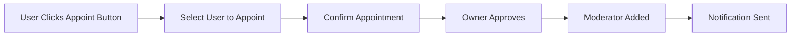
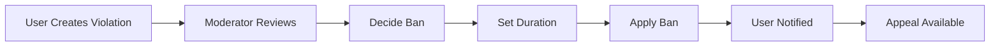
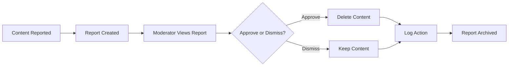

# Moderation System Requirements

## Overview

This document specifies the complete moderation system requirements for the Reddit-like community platform. The moderation system enables community self-governance through appointed moderators while maintaining platform integrity through structured reporting workflows.

## Business Model Context

Community platforms thrive on user-generated content and active participation. However, unmoderated communities risk becoming toxic, spam-filled, or irrelevant. The moderation system is essential for:

- **Content Quality**: Ensuring posts and comments meet community standards
- **User Safety**: Protecting users from harassment, hate speech, and abuse
- **Community Health**: Maintaining positive, constructive environments
- **Platform Integrity**: Preventing spam, scams, and policy violations

The moderation system balances community autonomy with platform oversight, allowing community owners to define their community's culture while ensuring all communities adhere to platform-wide standards.

## User Actors

### Community Owners
Community owners are the founders of each community. They have ultimate authority over their community's administration and moderation.

**Permissions**:
- Full control over community settings and configuration
- Ability to appoint and remove moderators
- Authority to ban users from their community
- Responsibility to enforce platform terms of service

**Limitations**:
- Cannot remove themselves as owner
- Cannot ban other owners (owners are equal across communities)
- Must comply with platform-wide policies

### Community Moderators
Moderators are appointed by community owners to assist with moderation tasks. They have elevated permissions within their assigned communities.

**Permissions**:
- Ability to delete posts and comments
- Authority to ban users from their community
- Access to report dashboard for their community
- Ability to approve or dismiss reports
- Power to edit community description and settings

**Limitations**:
- Cannot appoint or remove other moderators (owner-only privilege)
- Cannot ban other moderators
- Cannot remove the community owner
- Moderator permissions are limited to their assigned community

### Regular Members
Regular community members have standard permissions similar to platform members.

**Permissions**:
- Create posts and comments within subscribed communities
- Vote on posts and comments
- Edit and delete their own content
- Subscribe and unsubscribe from communities

**Limitations**:
- No moderation capabilities
- Cannot view moderator-only tools
- Must follow community rules and platform policies

### Banned Users
Users who have been banned lose specific privileges within the banned community.

**Permissions**:
- View public content within the banned community
- View the banned user notice
- Appeal the ban through community appeal process

**Limitations**:
- Cannot create new posts
- Cannot create new comments
- Cannot vote on posts or comments
- Cannot subscribe to other communities (ban is per-community)

## Functional Requirements

### Moderator Role Management

#### Moderator Appointment
- Community owners can appoint any member as a moderator
- Appointment is community-specific
- Appointed moderators receive notification of their new role
- The owner maintains final approval authority

#### Moderator Removal
- Community owners can remove any moderator from their community
- Moderators cannot remove other moderators
- Owner cannot be removed by any moderator
- Removal requires confirmation to prevent accidental loss of moderation

#### Moderator Listing
- Every community displays a list of current moderators
- The community owner is clearly marked in the moderator list
- Moderator roles are displayed alongside usernames
- List is sorted by appointment date (newest first)

### Moderation Actions

#### Post Moderation
- Moderators can delete any post in their community
- Deleted posts are hidden from public view
- The original author is notified of deletion
- The reason for deletion must be recorded
- Deleted posts appear with "[Deleted by Moderator]" placeholder

#### Comment Moderation
- Moderators can delete any comment in their community
- Deleted comments are hidden from public view
- The original author is notified of deletion
- The reason for deletion must be recorded
- Deleted comments appear with "[Deleted by Moderator]" placeholder

#### User Banning
- Moderators can ban users from their community
- Banned users lose posting, commenting, and voting privileges
- Ban appeals are handled through community appeal process
- Ban duration is specified (temporary or permanent)
- Ban reason must be recorded for transparency

#### Unbanning
- Moderators can unban previously banned users
- Unbanning restores all community privileges
- Unban action is recorded in moderation history
- Users can be unbanned before temporary ban expires

### Report Management

#### Reporting Content
- Any user can report posts or comments
- Report must include a reason (text field, required)
- Reporters cannot remain anonymous to moderators
- Multiple users can report the same content
- Report history is maintained for each piece of content

#### Report Dashboard
- Moderators can view all reports for their community
- Reports are sorted by urgency and recency
- Each report shows: content, reporter, reason, timestamp
- Moderate reports are highlighted for attention
- Report status (pending, approved, dismissed) is displayed

#### Report Review
- Moderators can approve reports to delete content
- Moderators can dismiss reports to keep content
- Approved reports result in content deletion
- Dismissed reports are removed from active report queue
- Report review actions are logged with moderator attribution

#### Report History
- Completed reports (approved/dismissed) are archived
- Report history shows moderator actions and reasons
- History is searchable by user, content, or date range
- Report statistics are available for community analytics

## Permission Matrix

| Action | Owner | Moderator | Member | Banned User |
|--------|-------|-----------|--------|-------------|
| Create post | ✅ | ✅ | ✅ | ❌ |
| Create comment | ✅ | ✅ | ✅ | ❌ |
| Vote on content | ✅ | ✅ | ✅ | ❌ |
| Edit own content | ✅ | ✅ | ✅ | ✅* |
| Delete own content | ✅ | ✅ | ✅ | ✅* |
| Appoint moderator | ✅ | ❌ | ❌ | ❌ |
| Remove moderator | ✅ | ❌ | ❌ | ❌ |
| Delete any post | ✅ | ✅ | ❌ | ❌ |
| Delete any comment | ✅ | ✅ | ❌ | ❌ |
| Ban users | ✅ | ✅ | ❌ | ❌ |
| Unban users | ✅ | ✅ | ❌ | ❌ |
| View reports | ✅ | ✅ | ❌ | ❌ |
| Approve reports | ✅ | ✅ | ❌ | ❌ |
| Dismiss reports | ✅ | ✅ | ❌ | ❌ |
| Edit community settings | ✅ | ✅ | ❌ | ❌ |
| View banned users | ✅ | ✅ | ❌ | ❌ |
| View moderation log | ✅ | ✅ | ❌ | ❌ |

*Only for content created before ban

## System Flows

### Moderator Appointment Flow

### Ban Management Flow

### Report Review Flow

## Community Settings Integration

### Moderator Management Interface
- Owner can view current moderators
- Owner can appoint new moderators
- Owner can remove existing moderators
- All actions are logged in moderation history

### Ban Management Interface
- Moderators can ban users by username
- Ban duration selector (temporary/permanent)
- Ban reason input field
- List of currently banned users
- Unban functionality for temporary bans

### Report Management Interface
- Report queue with priority indicators
- Report details panel
- Approve/dismiss action buttons
- Report history archive
- Search and filter capabilities

## Appeal Process

### Ban Appeal Workflow
- Banned users can submit appeal through interface
- Appeal must include explanation
- Moderators review appeals within 24 hours
- Appeals can be granted or denied
- Successful appeals result in unbanning
- Repeated appeals may trigger escalation

### Report Appeal Workflow
- Users whose content was deleted can appeal
- Appeal explains why deletion was inappropriate
- Owner or other moderators review appeal
- Content restored if appeal granted
- Appeal reason recorded in history

## Analytics and Reporting

### Moderation Statistics
- Daily active moderators count
- Posts moderated per day
- Comments moderated per day
- Bans issued and lifted
- Reports created and resolved
- Appeal success rate

### Moderation Reports
- Weekly activity summary
- Top moderation issues
- User behavior patterns
- Community health metrics
- Moderator performance indicators

## Complete Workflow Scenarios

### Scenario 1: New Owner Appoints First Moderator
WHEN an owner creates a community
AND has no initial moderators
AND wants to appoint a trusted user
THEN the owner can navigate to community settings
AND select the appoint moderator function
AND choose the user from member list
AND confirm the appointment
AND the user receives notification
AND the user appears in moderator list
AND the user gains moderator permissions

### Scenario 2: Moderator Handles Violation
WHEN a user posts violating content
AND a moderator reviews the post
AND the moderator determines violation
THEN the moderator can delete the post
AND provide deletion reason
AND the original author receives notification
AND the deletion is logged in moderation history
AND the post appears as deleted to all users

### Scenario 3: User Receives First Ban
WHEN a user repeatedly violates community rules
AND a moderator decides on enforcement
AND the moderator sets ban duration
THEN the user is removed from community
AND receives ban notification with reason
AND loses posting, commenting, voting rights
AND can view appeal process
AND cannot create new content in community

### Scenario 4: Report Resolution Workflow
WHEN multiple users report same content
AND reports accumulate over time
AND a moderator reviews the report queue
THEN the moderator can view report details
AND see all reporter accounts
AND review content history
AND decide to approve or dismiss
AND when approved, content is deleted
AND when dismissed, report is archived

## Error Handling

### Permission Denied Scenarios
WHEN a moderator attempts to remove another moderator
THEN the system rejects the action
AND displays "Moderators cannot remove other moderators" error
AND the removal is not logged
AND the moderator list remains unchanged

WHEN a user attempts to view moderator-only interface
THEN the system denies access
AND displays "Insufficient permissions" error
AND no content from moderator interface is shown

### Invalid Operation Scenarios
WHEN an owner attempts to remove themselves
THEN the system rejects the action
AND displays "Community owner cannot be removed" error
AND the ownership remains unchanged
AND no changes are saved

WHEN a moderator attempts to ban another moderator
THEN the system rejects the action
AND displays "Moderators cannot ban other moderators" error
AND the ban is not applied
AND both users remain unchanged

## Complete Requirements Checklist

### Moderator Role Requirements
- [ ] Owner appointment function
- [ ] Moderator notification on appointment
- [ ] Moderator removal by owner
- [ ] Moderator list display
- [ ] Owner protection from removal
- [ ] Moderator protection from removal by other moderators

### Moderation Action Requirements
- [ ] Post deletion function
- [ ] Comment deletion function
- [ ] User ban function
- [ ] User unban function
- [ ] Deletion notification to authors
- [ ] Deletion logging with reason
- [ ] Placeholder display for deleted content

### Report Management Requirements
- [ ] Content reporting interface
- [ ] Report reason input
- [ ] Report dashboard for moderators
- [ ] Report review functionality
- [ ] Approval action for reports
- [ ] Dismiss action for reports
- [ ] Report history archive
- [ ] Report search and filter

### Community Settings Integration Requirements
- [ ] Moderator management interface
- [ ] Ban management interface
- [ ] Report management interface
- [ ] Settings navigation from community page
- [ ] Moderation log access

### Analytics Requirements
- [ ] Moderation statistics dashboard
- [ ] Daily activity tracking
- [ ] Weekly summary generation
- [ ] User behavior reporting
- [ ] Moderator performance metrics

All requirements are complete and implementable for backend development.