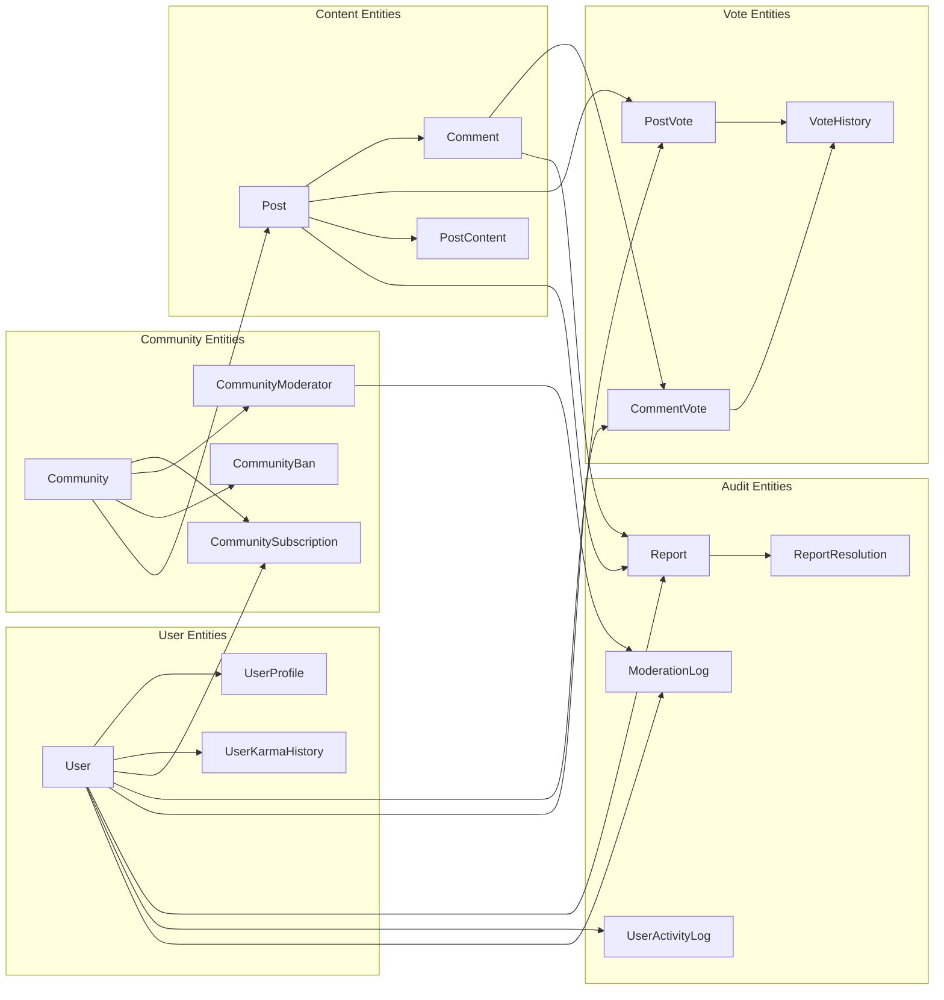
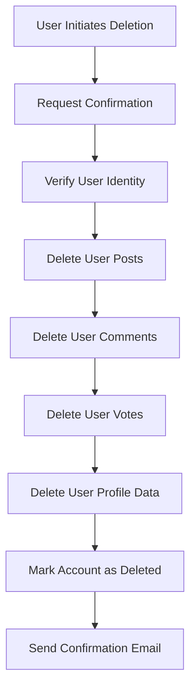
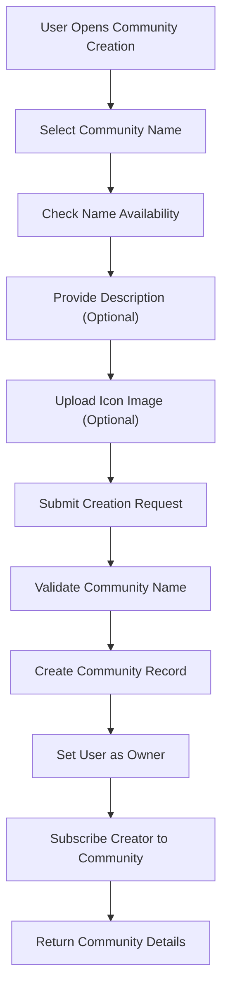
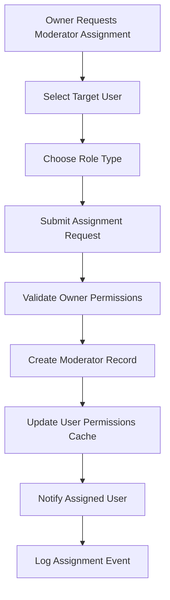
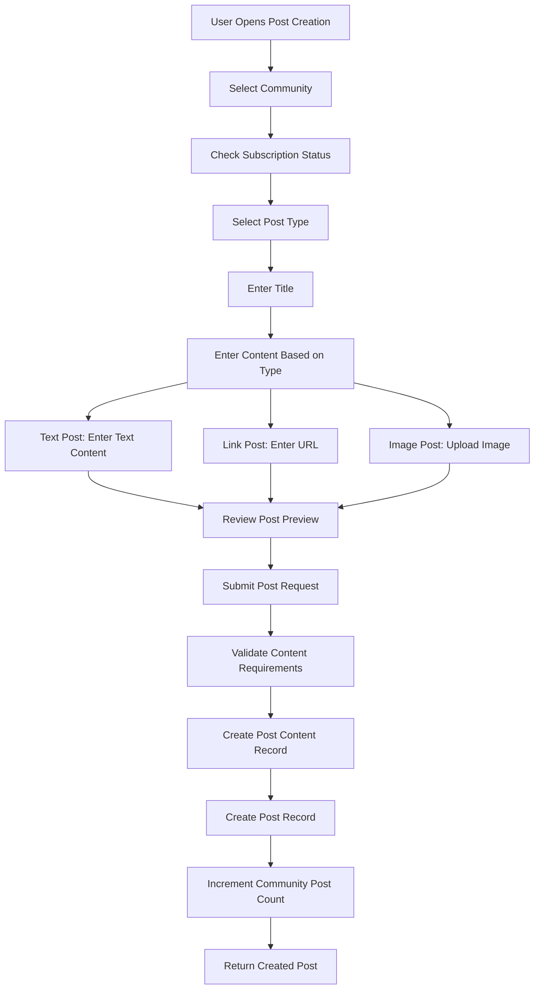
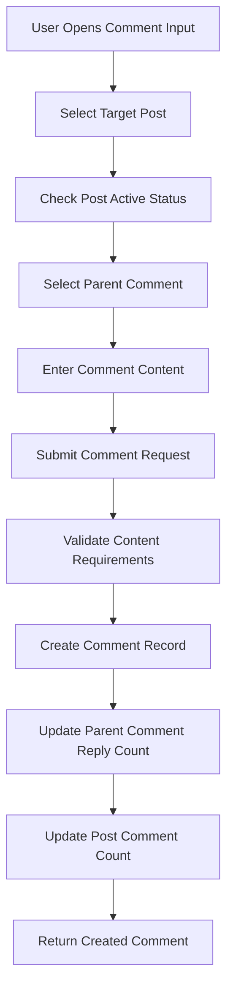
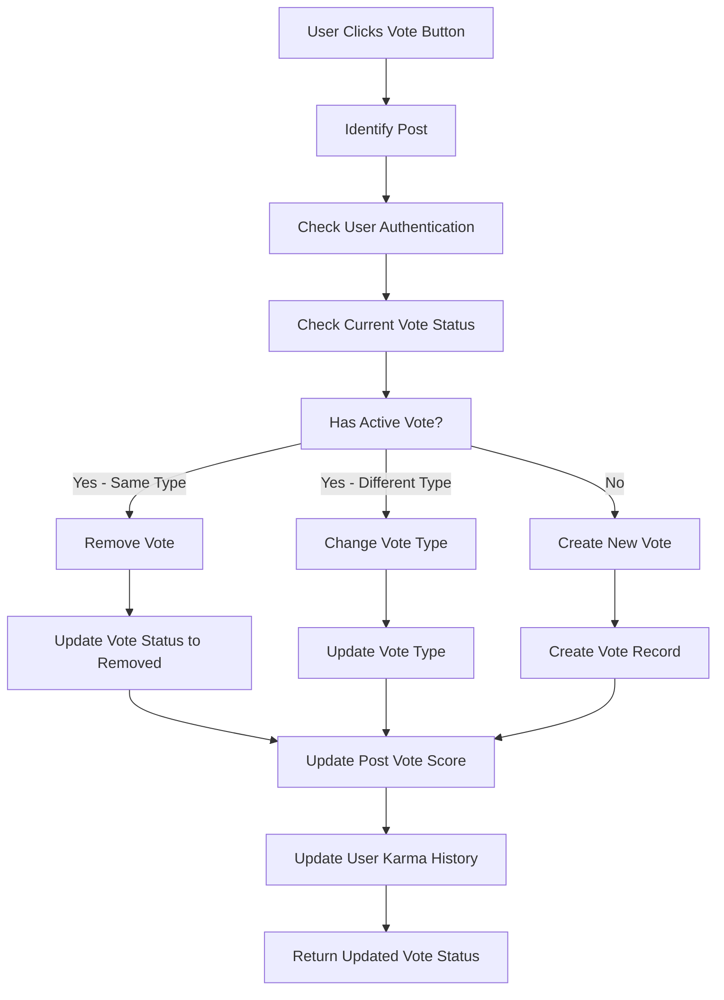
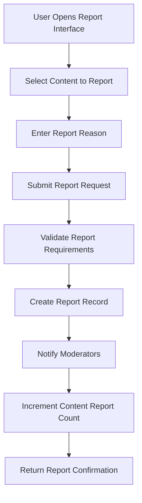

# Reddit-like Community Platform - Data Modeling Specification

## Document Purpose

This document provides the complete data modeling specifications for the Reddit-like community platform. It defines the core entities, their relationships, and the business-level data structures that will be implemented by backend developers. This specification serves as the foundation for database schema design, API structure, and business logic implementation.

## Entity Relationship Overview

## Core Entity Specifications

### User Entities

#### User (Main User Account)

The User entity represents the primary account for community members. Each user has a unique identifier and core account information.

**Key Attributes:**
- User ID (Primary Key)
- Email address (Unique, Required)
- Password hash (Securely stored)
- Username (Unique, Required)
- Account status (Active, Suspended, Deleted)
- Email verified flag
- Created timestamp
- Last login timestamp
- Session management data

**Business Rules:**
- Usernames must be unique across the entire platform
- Email addresses must be verified before certain actions (posting, commenting)
- Accounts can be soft-deleted (status changed to 'Deleted') rather than hard-deleted
- When a user account is deleted, all their content is also deleted

**User Account Deletion Workflow:**

#### UserProfile

User profile contains the customizable information that users display to other community members.

**Key Attributes:**
- User ID (Foreign Key to User)
- Display name (User's chosen public name)
- Bio text (Self-written biography)
- Avatar image URL or identifier
- Profile creation timestamp
- Last profile update timestamp

**Business Rules:**
- Display names must be unique and follow platform naming conventions
- Bio text is optional but limited to a maximum length
- Avatar images must meet size and format requirements
- Users can only edit their own profile information
- Profile changes are logged for audit purposes

#### UserKarmaHistory

Tracks changes to user karma scores over time for reporting and analytics purposes.

**Key Attributes:**
- History ID (Primary Key)
- User ID (Foreign Key)
- karma change amount (+1, -1, or 0 for removal)
- Context type (Post vote, Comment vote)
- Context ID (Post ID or Comment ID)
- Vote action type (Upvote, Downvote, Remove)
- Timestamp of karma change

**Business Rules:**
- Each karma change is logged individually
- The total karma score is calculated by summing all karma history entries
- Karma can be negative - no minimum balance enforcement
- Historical karma data is preserved for analytics and reporting

### Community Entities

#### Community

Communities are the core organizational units of the platform, centered around specific topics or interests.

**Key Attributes:**
- Community ID (Primary Key)
- Community name (Unique, Required)
- Description text
- Icon image URL or identifier
- Creator user ID (Foreign Key)
- Created timestamp
- Active status flag
- Subscriber count (Calculated field)

**Business Rules:**
- Community names must be unique and follow platform naming conventions
- Names are case-insensitive for comparison purposes
- Community descriptions support markdown formatting
- Icon images are optional but recommended for branding
- Each community must have exactly one owner
- Owners can be transferred to other moderators
- Communities can be deactivated but not permanently deleted

**Community Creation Workflow:**

#### CommunitySubscription

Tracks which users are subscribed to which communities, enabling feed personalization.

**Key Attributes:**
- Subscription ID (Primary Key)
- User ID (Foreign Key)
- Community ID (Foreign Key)
- Subscription timestamp
- Subscription status (Active, Unsubscribed)
- Last read timestamp

**Business Rules:**
- Users must be subscribed to a community before creating posts there
- Users can subscribe or unsubscribe at any time
- Multiple subscriptions to the same community are not allowed
- Subscription status changes are logged
- Community subscriber counts are calculated from active subscriptions

#### CommunityModerator

Defines the moderator relationships within communities, establishing authority structure.

**Key Attributes:**
- Moderator ID (Primary Key)
- Community ID (Foreign Key)
- User ID (Foreign Key)
- Role type (Owner, Moderator)
- Assigned by user ID (Foreign Key)
- Assignment timestamp
- Active status flag

**Business Rules:**
- Community owners are automatically assigned as moderators
- Only owners can assign or remove moderators
- Moderators cannot remove owners
- Moderators cannot remove each other
- Owners can transfer ownership to another moderator
- Each community must have at least one owner

**Moderator Assignment Workflow:**

#### CommunityBan

Tracks users who have been banned from specific communities.

**Key Attributes:**
- Ban ID (Primary Key)
- Community ID (Foreign Key)
- User ID (Foreign Key)
- Banning moderator ID (Foreign Key)
- Ban reason text
- Ban timestamp
- Ban duration (Permanent or temporary with expiry)
- Ban status (Active, Appeal submitted, Lifted)
- Appeal review timestamp (if applicable)

**Business Rules:**
- Only moderators can ban users from communities
- Bans apply to post and comment creation, not content viewing
- Ban durations can be permanent or temporary
- Banned users can submit appeals for review
- Appeals are reviewed by moderators
- Ban violations are tracked and may result in escalation

### Content Entities

#### Post

Posts are the primary content units in the community platform, representing user-submitted content.

**Key Attributes:**
- Post ID (Primary Key)
- Community ID (Foreign Key)
- User ID (Author, Foreign Key)
- Post type (Text, Link, Image)
- Title (Required, Required)
- Post content ID (Foreign Key to PostContent)
- Vote score (Calculated field)
- Comment count (Calculated field)
- Created timestamp
- Last edited timestamp
- Status (Active, Deleted, Moderated)
- Moderated reason (if applicable)

**Post Content Reference:**
- Each post references exactly one PostContent record
- PostContent stores the actual content (text, URL, or image reference)
- This separation allows for efficient querying without loading large content fields

**Business Rules:**
- Posts must belong to exactly one community
- Users can only post in communities they're subscribed to
- All posts require a title
- Post type determines required content fields
- Users can edit their own posts
- Users can delete their own posts
- Moderators can delete any post
- Deleted posts maintain records but show as "[deleted]"

**Post Creation Workflow:**

#### PostContent

Stores the actual content of posts, separated from metadata for performance optimization.

**Key Attributes:**
- Content ID (Primary Key)
- Post ID (Foreign Key to Post)
- Content type (Text, Link, Image)
- Text content (for text posts)
- URL (for link posts)
- Image reference (for image posts)
- Content length
- Created timestamp
- Last updated timestamp

**Content Requirements by Type:**
- **Text Posts**: Must have text content, limited to maximum length
- **Link Posts**: Must have valid URL format, URL is required
- **Image Posts**: Must have uploaded image with valid format and size

**Business Rules:**
- Content is immutable after creation (updates require new content record)
- URL validation is required for link posts
- Image uploads must meet platform standards
- Content is soft-deleted with the post

#### Comment

Comments enable discussion on posts and other comments, supporting threaded conversations.

**Key Attributes:**
- Comment ID (Primary Key)
- Post ID (Foreign Key)
- Parent comment ID (Foreign Key to Comment, null if top-level)
- User ID (Author, Foreign Key)
- Content text
- Vote score (Calculated field)
- Created timestamp
- Last edited timestamp
- Status (Active, Deleted, Moderated)
- Moderated reason (if applicable)
- Depth level (calculated field)

**Thread Structure:**
- Top-level comments have null parent comment ID
- Replies reference their parent comment ID
- Depth level is calculated based on parent hierarchy
- No depth limit is enforced for threading

**Business Rules:**
- Comments must belong to a post
- Comments can be top-level or replies to other comments
- Users can only comment on active posts
- Users can edit their own comments
- Users can delete their own comments
- Moderators can delete any comment
- Deleted comments show as "[deleted]" with original timestamp preserved

**Comment Creation Workflow:**

### Vote Entities

#### PostVote

Tracks individual user votes on posts, enabling vote management and score calculation.

**Key Attributes:**
- Vote ID (Primary Key)
- Post ID (Foreign Key)
- User ID (Voter, Foreign Key)
- Vote type (Upvote, Downvote)
- Created timestamp
- Last updated timestamp
- Vote status (Active, Removed)

**Business Rules:**
- Each user can have only one active vote per post
- Users can change their vote type (Upvote ↔ Downvote)
- Users can remove their vote entirely
- Vote timestamps are tracked for analytics
- Vote removal restores previous state
- vote score = upvotes - downvotes

**Post Voting Workflow:**

#### CommentVote

Tracks individual user votes on comments, following the same principles as post votes.

**Key Attributes:**
- Vote ID (Primary Key)
- Comment ID (Foreign Key)
- User ID (Voter, Foreign Key)
- Vote type (Upvote, Downvote)
- Created timestamp
- Last updated timestamp
- Vote status (Active, Removed)

**Business Rules:**
- Same rules apply as post votes but for comments
- Vote changes update comment vote score
- Vote removal affects karma accordingly
- Users can only vote on active comments

#### VoteHistory

Archive of all vote changes for reporting and analytics purposes.

**Key Attributes:**
- History ID (Primary Key)
- Vote ID (Foreign Key)
- Vote type before change
- Vote type after change
- Change timestamp
- Change reason (Created, Updated, Removed)

**Business Rules:**
- Every vote action creates a history record
- History is immutable once created
- Used for analytics and vote trend analysis
- Does not affect real-time vote calculations

### Audit Entities

#### Report

Tracks reports of inappropriate content by community members.

**Key Attributes:**
- Report ID (Primary Key)
- Report type (Post, Comment)
- Content ID (Foreign Key to Post or Comment)
- Reporter user ID (Foreign Key)
- Report reason text (Required)
- Report timestamp
- Report status (Pending, Under Review, Resolved, Dismissed)
- Resolution timestamp (if applicable)
- Resolution details (if resolved)

**Business Rules:**
- Users must provide a reason when reporting content
- Reports can be made on any post or comment
- Multiple users can report the same content
- Report counts are tracked for moderation alerts
- Duplicate reports from same user are not allowed

**Reporting Workflow:**

#### ReportResolution

Logs moderator actions on reports for audit trail purposes.

**Key Attributes:**
- Resolution ID (Primary Key)
- Report ID (Foreign Key)
- Moderator user ID (Foreign Key)
- Resolution action (Approve, Dismiss)
- Resolution timestamp
- Resolution notes (optional)

**Business Rules:**
- Only approved resolution actions are logged
- Resolution creates audit trail for accountability
- One resolution per report (no appeals after resolution)
- Resolved reports are marked as resolved in the system

#### ModerationLog

Comprehensive log of all moderation actions taken by moderators.

**Key Attributes:**
- Log ID (Primary Key)
- Community ID (Foreign Key)
- Moderator user ID (Foreign Key)
- Action type (Delete Post, Delete Comment, Ban User, Unban User, Approve Report, Dismiss Report, Assign Moderator, Remove Moderator, Transfer Ownership)
- Target ID (Foreign Key to affected content/user)
- Action timestamp
- Action details (JSON)
- Reason text (if applicable)

**Business Rules:**
- All moderation actions are logged
- Logs include full context of the action
- Logs are immutable once created
- Used for accountability and dispute resolution
- Accessible to platform administrators

#### UserActivityLog

Tracks user actions on the platform for security and analytics purposes.

**Key Attributes:**
- Log ID (Primary Key)
- User ID (Foreign Key)
- Action type (Login, Logout, Create Post, Edit Post, Delete Post, Create Comment, Edit Comment, Delete Comment, Vote, Subscribe, Unsubscribe, Report Content, Change Password, Update Profile, Account Delete)
- Target ID (Foreign Key to affected resource)
- Action timestamp
- IP address (for security)
- Device information (for security)
- Action details (JSON)

**Business Rules:**
- All significant user actions are logged
- Logs include security-relevant information
- Logs are used for anomaly detection
- Logs support security investigations
- Logs have retention policies

## Data Relationships and Constraints

### Required Relationships

**User-Profile Relationship:**
- One-to-One: Each user has exactly one profile
- Profile deletion automatically occurs with user account
- Profile updates are tracked for audit purposes

**User-Community Relationship:**
- Many-to-Many: Users can subscribe to multiple communities
- Communities have multiple subscribers
- Through CommunitySubscription entity
- Subscription required for posting in community

**User-Moderator Relationship:**
- Many-to-Many: Users can moderate multiple communities
- Communities have multiple moderators
- Through CommunityModerator entity
- Ownership hierarchy maintained

**User-Content Relationship:**
- One-to-Many: Users can create multiple posts and comments
- Content always has one author
- Content ownership enables editing/deletion rights

**Community-Content Relationship:**
- One-to-Many: Communities contain multiple posts
- Posts belong to exactly one community
- Community subscriber count affects feed generation

### Calculated Fields and Aggregates

**Vote Score Calculation:**
- Vote score = (Count of active upvotes) - (Count of active downvotes)
- Stored as denormalized field for performance
- Updated via database triggers or application logic
- Refreshed during vote operations

**Comment Count:**
- Total comments on a post (including all replies)
- Calculated from comment table
- Updated on comment creation/deletion

**Subscriber Count:**
- Active subscriptions to a community
- Updated on subscription/unsubscription
- May be cached for performance

**Karma Score:**
- Sum of all karma history entries for a user
- Can be negative
- Calculated from karma history table
- Updated on vote changes

## Data Quality and Integrity Requirements

### Business Validation Rules

**User Account Validation:**
- Email format validation
- Username format validation (alphanumeric, underscores only)
- Password strength requirements
- Duplicate prevention for email and username

**Community Validation:**
- Community name format and length limits
- Description length limits
- Icon image format and size restrictions
- Name uniqueness enforcement

**Content Validation:**
- Title length requirements (minimum and maximum)
- Text content length limits
- URL format validation for link posts
- Image upload requirements (size, format, aspect ratio)
- Comment length limits

**Vote Validation:**
- One active vote per user per content item
- Vote type validation (upvote/downvote only)
- Voting on active content only
- Self-voting prevention

**Moderation Validation:**
- Owner-only actions for moderator management
- Valid report reasons (not empty)
- Reason length requirements for reports
- Proper permission hierarchy enforcement

### Data Integrity Constraints

**Referential Integrity:**
- All foreign key relationships must be enforced
- Cascade deletion rules for dependent records
- Soft delete flag for preserving historical data

**Consistency Rules:**
- Vote score must match actual vote counts
- Comment count must match actual comment records
- Subscriber count must reflect active subscriptions
- Moderator permissions must match assigned roles

**Audit Requirements:**
- All significant changes must be logged
- User activity must be tracked
- Moderation actions must be logged
- Data exports must maintain consistency

## Performance and Scalability Considerations

### Denormalization Strategy

**Calculated Fields:**
- Vote scores stored as denormalized fields
- Comment counts cached in post records
- Subscriber counts cached in community records
- Karma scores calculated from history

**Materialized Views:**
- Popular feed queries
- User feed queries
- Community activity summaries
- User reputation metrics

### Partitioning Strategy

**User Data Partitioning:**
- By user ID range for large-scale deployments
- By geographic region for latency optimization

**Content Partitioning:**
- By community ID for related content grouping
- By creation timestamp for time-based queries

**Vote Data Partitioning:**
- By post ID for post-level queries
- By user ID for user-level queries

### Indexing Strategy

**Primary Indexes:**
- All primary keys with B-tree indexes
- Foreign key columns for join performance
- Unique constraint indexes

**Query Optimization Indexes:**
- User feed queries (community, subscription status)
- Post sorting (vote score, creation timestamp)
- Comment threading (post ID, parent comment ID)
- Moderation queries (community, moderator ID)

## Data Security and Privacy

### Data Protection Requirements

**User Data Protection:**
- Passwords hashed with strong algorithms (bcrypt, Argon2)
- Sensitive user data encryption at rest
- SSL/TLS for all data transmission
- Regular security audits

**Content Privacy:**
- Public content only by default
- Private communities with access controls
- Report confidentiality maintained
- User deletion complete data removal

### Compliance Requirements

**Data Retention Policies:**
- Activity logs retained for specified periods
- Deleted content retention for audit purposes
- GDPR compliance for EU users
- CCPA compliance for California users

**User Rights Implementation:**
- Right to access personal data
- Right to data portability
- Right to be forgotten (complete deletion)
- Right to correct inaccurate data

## Entity Relationship Summary Table

| Entity | Primary Key | Key Relationships | Critical Business Rules |
|--------|-------------|-------------------|------------------------|
| User | User ID | Profile, Posts, Comments, Votes | Unique email/username, account deletion |
| UserProfile | User ID | References User | Display name uniqueness, avatar requirements |
| Community | Community ID | Subscriptions, Moderators, Posts | Name uniqueness, subscriber management |
| CommunitySubscription | Subscription ID | User + Community | Required for posting, active status |
| CommunityModerator | Moderator ID | Community + User | Owner hierarchy, role restrictions |
| CommunityBan | Ban ID | Community + User | Ban duration, appeal process |
| Post | Post ID | Community + User + PostContent | Post type validation, subscription requirement |
| PostContent | Content ID | Post | Content format by type |
| Comment | Comment ID | Post + Parent + User | Threaded discussions, depth tracking |
| PostVote | Vote ID | Post + User | One active vote per user |
| CommentVote | Vote ID | Comment + User | Same as post vote rules |
| Report | Report ID | Content + Reporter | Reason required, status tracking |
| ModerationLog | Log ID | Community + Moderator | Action logging, audit trail |
| UserActivityLog | Log ID | User | Activity tracking, security |
| UserKarmaHistory | History ID | User + Context | Karma changes, historical record |

## Implementation Considerations for Backend Developers

### Database Design Recommendations

**Schema Structure:**
- Normalize core entities to eliminate redundancy
- Denormalize calculated fields for performance
- Use appropriate data types for each field
- Implement proper constraints and indexes

**Type Safety:**
- Use TypeScript enums for status fields
- Implement strict validation schemas
- Create proper entity models

**Migration Strategy:**
- Version-controlled database migrations
- Rolling deployment support
- Data integrity verification
- Rollback capability

### API Design Implications

**RESTful Endpoints:**
- Resource-based URL structure
- Consistent error handling
- Proper HTTP status codes
- HATEOAS for discoverability

**GraphQL Considerations:**
- Type-safe schemas
- Resolver composition
- DataLoader for N+1 prevention
- Pagination support

### Testing Requirements

**Unit Tests:**
- Entity validation rules
- Business logic implementations
- Calculation accuracy
- Edge case handling

**Integration Tests:**
- Database transactions
- API endpoint testing
- File upload handling
- Email notification flows

**Performance Tests:**
- Query optimization verification
- Caching effectiveness
- Load testing
- Concurrent operation handling

## Conclusion

This data modeling specification provides a comprehensive foundation for implementing the Reddit-like community platform. All entities, relationships, business rules, and constraints have been defined to support the platform's functionality while ensuring data integrity and performance. Backend developers can use this specification to design and implement the database schema, API structure, and business logic for the complete system.