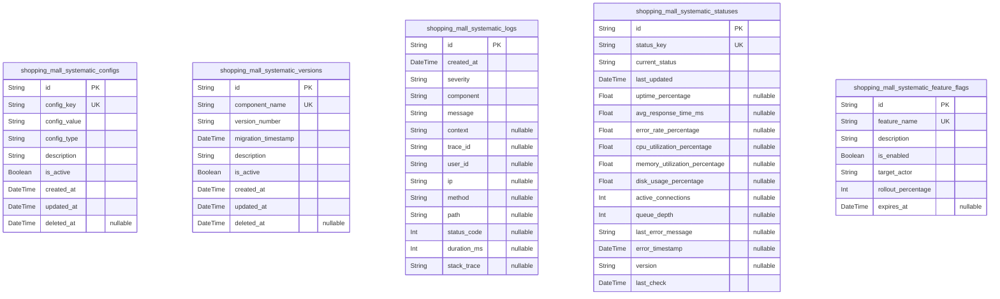
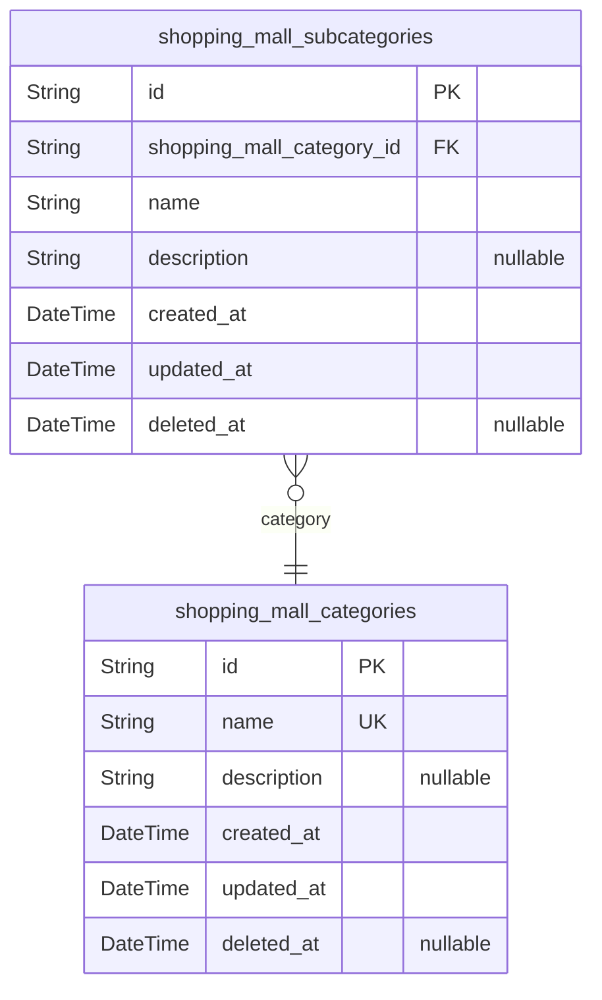
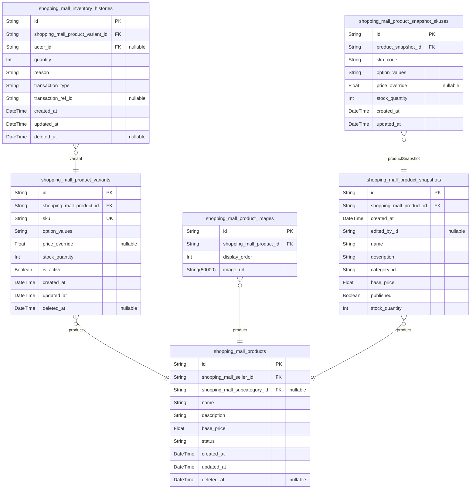
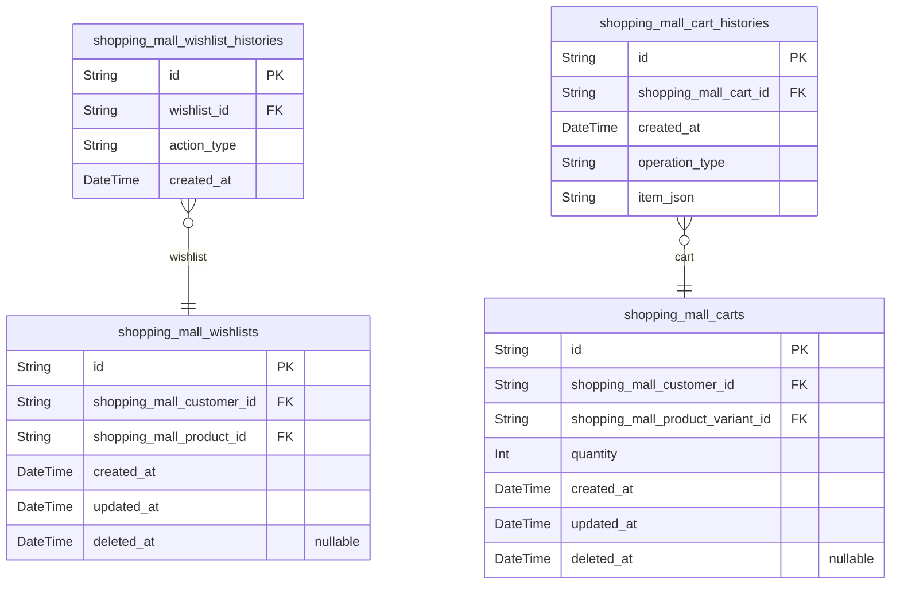
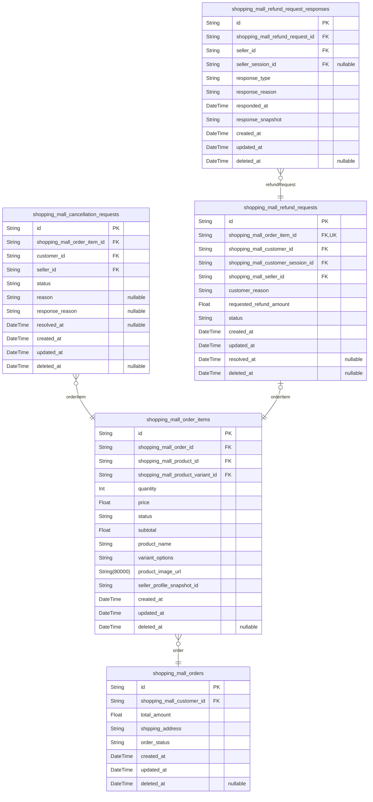
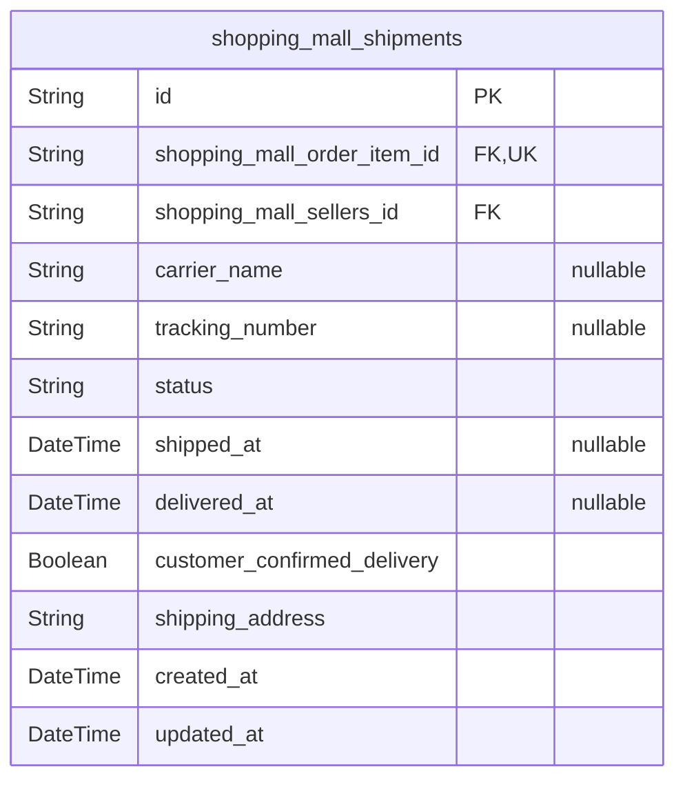
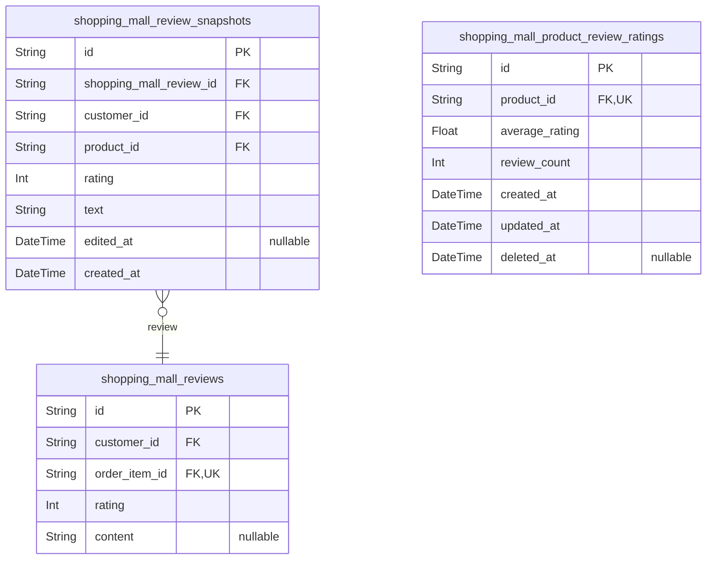
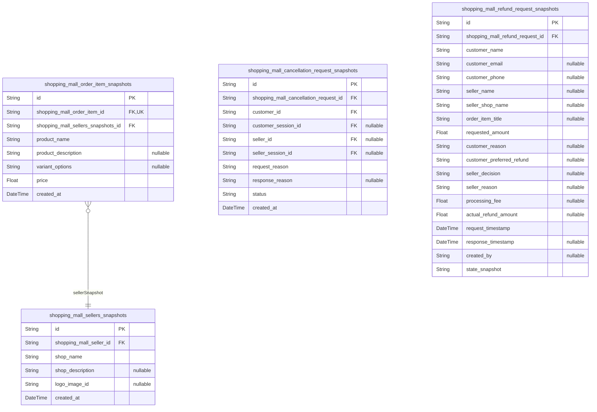

# Prisma Markdown

> Generated by [`prisma-markdown`](https://github.com/samchon/prisma-markdown)

- [Actors](#actors)
- [Systematic](#systematic)
- [Catalog](#catalog)
- [Products](#products)
- [Shopping](#shopping)
- [Orders](#orders)
- [Shipping](#shipping)
- [Reviews](#reviews)
- [Snapshots](#snapshots)

## Actors

```mermaid
erDiagram
"shopping_mall_customers" {
  String id PK
  String email UK
  String password_hash
  String display_name
  String phone_number "nullable"
  Boolean is_email_verified
  String status
  DateTime created_at
  DateTime updated_at
  DateTime deleted_at "nullable"
}
"shopping_mall_customer_sessions" {
  String id PK
  String shopping_mall_customer_id FK
  String ip
  String href "nullable"
  String referrer "nullable"
  DateTime created_at
  DateTime expired_at
}
"shopping_mall_customer_password_resets" {
  String id PK
  String shopping_mall_customer_id FK
  String token UK
  DateTime expired_at
  DateTime used_at "nullable"
  DateTime created_at
}
"shopping_mall_customer_email_verifications" {
  String id PK
  String shopping_mall_customer_id FK
  String token UK
  DateTime expired_at
}
"shopping_mall_sellers" {
  String id PK
  String email UK
  String password_hash
  String shop_name
  String shop_description "nullable"
  String logo_image_id "nullable"
  String status
  String rejection_reason "nullable"
  DateTime created_at
  DateTime updated_at
  DateTime deleted_at "nullable"
}
"shopping_mall_seller_sessions" {
  String id PK
  String shopping_mall_seller_id FK
  String ip
  String href
  String referrer
  DateTime created_at
  DateTime expired_at
}
"shopping_mall_seller_password_resets" {
  String id PK
  String shopping_mall_seller_id FK
  String token UK
  DateTime expires_at
  DateTime used_at "nullable"
  DateTime created_at
  DateTime updated_at
  DateTime deleted_at "nullable"
}
"shopping_mall_seller_email_verifications" {
  String id PK
  String shopping_mall_seller_id FK,UK
  String token UK
  DateTime expired_at
  DateTime verified_at "nullable"
  DateTime created_at
  DateTime updated_at
  DateTime deleted_at "nullable"
}
"shopping_mall_admins" {
  String id PK
  String email UK
  String password_hash
  String display_name
  String status
  DateTime created_at
  DateTime updated_at
  DateTime deleted_at "nullable"
}
"shopping_mall_admin_sessions" {
  String id PK
  String shopping_mall_admin_id FK
  String ip
  String href
  String referrer
  DateTime created_at
  DateTime expired_at
}
"shopping_mall_admin_password_resets" {
  String id PK
  String shopping_mall_admin_id FK
  String token UK
  DateTime expires_at
  DateTime created_at
  DateTime deleted_at "nullable"
}
"shopping_mall_admin_email_verifications" {
  String id PK
  String shopping_mall_admin_id FK
  String token UK
  DateTime expires_at
  DateTime verified_at "nullable"
}
"shopping_mall_super_admins" {
  String id PK
  String email UK
  String password_hash
  Boolean email_verified
  DateTime last_login_at "nullable"
  String status
  String grade
  DateTime created_at
  DateTime updated_at
  DateTime deleted_at "nullable"
}
"shopping_mall_super_admin_sessions" {
  String id PK
  String shopping_mall_super_admin_id FK
  String ip
  String href
  String referrer "nullable"
  DateTime created_at
  DateTime expired_at
}
"shopping_mall_super_admin_password_resets" {
  String id PK
  String shopping_mall_super_admin_id FK
  String token UK
  DateTime expired_at
  DateTime used_at "nullable"
  DateTime created_at
  DateTime updated_at
}
"shopping_mall_super_admin_email_verifications" {
  String id PK
  String shopping_mall_super_admin_id FK,UK
  String token UK
  DateTime expires_at
  DateTime verified_at "nullable"
  DateTime created_at
  DateTime updated_at
}
"shopping_mall_customer_sessions" }o--|| "shopping_mall_customers" : customer
"shopping_mall_customer_password_resets" }o--|| "shopping_mall_customers" : customer
"shopping_mall_customer_email_verifications" }o--|| "shopping_mall_customers" : customer
"shopping_mall_seller_sessions" }o--|| "shopping_mall_sellers" : seller
"shopping_mall_seller_password_resets" }o--|| "shopping_mall_sellers" : seller
"shopping_mall_seller_email_verifications" |o--|| "shopping_mall_sellers" : seller
"shopping_mall_admin_sessions" }o--|| "shopping_mall_admins" : admin
"shopping_mall_admin_password_resets" }o--|| "shopping_mall_admins" : admin
"shopping_mall_admin_email_verifications" }o--|| "shopping_mall_admins" : admin
"shopping_mall_super_admin_sessions" }o--|| "shopping_mall_super_admins" : superAdmin
"shopping_mall_super_admin_password_resets" }o--|| "shopping_mall_super_admins" : superAdmin
"shopping_mall_super_admin_email_verifications" |o--|| "shopping_mall_super_admins" : superAdmin
```

### `shopping_mall_customers`

Customer account table with email/password authentication, profile
information, and account status. Stores core customer identity data
separate from authentication tables for proper separation of concerns.

Properties as follows:

- `id`: Primary Key.
- `email`
  > Customer's email address for login and communication. Must be unique
  > across all customer accounts.
- `password_hash`
  > Hashed password for authentication. Stored securely using bcrypt or
  > similar algorithm.
- `display_name`: Public display name shown to other users during transactions and reviews.
- `phone_number`: Customer's phone number for contact and order notifications.
- `is_email_verified`
  > Whether customer has verified their email address through verification
  > email.
- `status`: Current account status: active, banned, or deleted.
- `created_at`: Timestamp when customer account was created.
- `updated_at`: Timestamp when customer account was last updated.
- `deleted_at`: Timestamp when customer account was soft-deleted (if applicable).

### `shopping_mall_customer_sessions`

Customer session table with JWT tokens for authentication. Tracks login
sessions including connection metadata such as IP address, accessed URL,
and referrer information. Each customer can have multiple active sessions
from different devices or browsers. This table serves as the audit trail
for customer authentication events and enables session management
capabilities including logout from all devices.

Properties as follows:

- `id`: Primary Key.
- `shopping_mall_customer_id`: Belonged customer's [shopping_mall_customers.id](#shopping_mall_customers).
- `ip`: Client IP address at time of login.
- `href`: Accessed URL or page path.
- `referrer`: Referrer URL from which customer arrived.
- `created_at`: Timestamp when session was created (login time).
- `expired_at`: Timestamp when session expires and becomes invalid.

### `shopping_mall_customer_password_resets`

Password reset tokens for customer account recovery. Stores secure
tokens, expiration timestamps, and reset status for customer password
management workflow.

Properties as follows:

- `id`: Primary Key.
- `shopping_mall_customer_id`: Customer's [shopping_mall_customers.id](#shopping_mall_customers) requesting password reset.
- `token`: Unique password reset token (UUID format) for secure password recovery.
- `expired_at`: Token expiration timestamp. Reset attempts are invalid after this time.
- `used_at`
  > Timestamp when token was successfully used for password reset. Null if
  > unused or expired.
- `created_at`: Token creation timestamp with timezone information.

### `shopping_mall_customer_email_verifications`

Email verification tokens for customer account confirmation

Properties as follows:

- `id`: Primary Key.
- `shopping_mall_customer_id`: Belonged customer's [shopping_mall_customers.id](#shopping_mall_customers)
- `token`: Unique verification token generated for email confirmation
- `expired_at`: Expiry timestamp for the verification token

### `shopping_mall_sellers`

Seller account table with email/password authentication, shop profile,
and approval status

Properties as follows:

- `id`: Primary Key.
- `email`: Unique email address for authentication and communication
- `password_hash`: Hashed password for secure authentication
- `shop_name`: Current shop name displayed to customers
- `shop_description`: Shop description for customer information
- `logo_image_id`: Reference to the logo image file
- `status`: Approval status for seller functionality
- `rejection_reason`: Reason for rejection if application was denied
- `created_at`: Timestamp when the seller account was created
- `updated_at`: Timestamp when the seller account was last updated
- `deleted_at`: Timestamp when the seller account was deleted (soft delete)

### `shopping_mall_seller_sessions`

Seller session table storing authentication sessions with JWT tokens,
connection metadata, and session lifecycle tracking for the
shopping_mall_sellers actor table. Each seller can have multiple
concurrent sessions across different devices and browsers.

Properties as follows:

- `id`: Primary Key.
- `shopping_mall_seller_id`: Seller's [shopping_mall_sellers.id](#shopping_mall_sellers).
- `ip`: Client IP address at the time of login.
- `href`: Current URL/href where the login occurred.
- `referrer`: Referrer URL from which the user arrived at the login page.
- `created_at`: Timestamp when the session was created.
- `expired_at`: Timestamp when the session expires. Non-null by default for security.

### `shopping_mall_seller_password_resets`

Password reset tokens for seller account recovery. Stores temporary
tokens that sellers can use to reset their passwords when forgotten. Each
token is unique, time-limited, and can only be used once. After use, the
token becomes invalid and cannot be reused for security reasons.

This table supports the seller authentication workflow by providing a
secure mechanism for password recovery without storing actual passwords
in the system.

Properties as follows:

- `id`: Primary Key.
- `shopping_mall_seller_id`
  > Seller account requesting password reset. {@link
  > shopping_mall_sellers.id}.
- `token`
  > Unique password reset token generated for security. This token is
  > included in the password reset URL sent to the seller's registered email
  > address.
- `expires_at`
  > Expiration datetime for this password reset token. Tokens should expire
  > after a reasonable time period (typically 1-2 hours) to prevent
  > unauthorized use.
- `used_at`
  > Datetime when this token was actually used to reset the password. NULL
  > until the token is used, indicating the reset request is still pending or
  > expired.
- `created_at`: Timestamp when this password reset request was created.
- `updated_at`: Timestamp when this record was last updated.
- `deleted_at`
  > Soft delete timestamp for audit trail preservation. NULL for active
  > records, set when record is soft-deleted.

### `shopping_mall_seller_email_verifications`

Email verification tokens for seller account confirmation. This table
tracks all email verification attempts for seller accounts, enabling the
email verification workflow required during seller registration. Each
seller can have multiple verification records over time, supporting both
initial registration and re-verification scenarios.

@{\link shopping_mall_sellers.id} - References the seller account being
verified

Properties as follows:

- `id`: Primary Key.
- `shopping_mall_seller_id`: Seller account being verified. @{\link shopping_mall_sellers.id}.
- `token`: Unique verification token for email confirmation.
- `expired_at`: Timestamp when verification token expires.
- `verified_at`: Timestamp when email was successfully verified (nullable until verified).
- `created_at`: Creation timestamp for audit trail.
- `updated_at`: Last update timestamp for audit trail.
- `deleted_at`: Soft delete timestamp for audit compliance (nullable when not deleted).

### `shopping_mall_admins`

Admin account table with email/password authentication and admin privileges

Properties as follows:

- `id`: Primary Key.
- `email`: Unique email address for admin account login and notifications
- `password_hash`: Hashed password for authentication security
- `display_name`: Admin's display name for identification in system operations
- `status`: Account status indicating active or deactivated state
- `created_at`: Timestamp when the admin account was created
- `updated_at`: Timestamp when the admin account was last updated
- `deleted_at`
  > Timestamp when the admin account was soft-deleted (nullable if not
  > deleted)

### `shopping_mall_admin_sessions`

Admin session tracking table recording authentication events for admin
users. Each row represents a single admin login session with connection
metadata and JWT token lifecycle information.

This table tracks:
- Admin user authentication events and session duration
- Connection context (IP address, requested URL, referrer)
- Session validity period (creation and expiration)
- Audit trail for admin access and potential security incidents

The session follows the standard pattern for all admin actor types
(admin, super_admin) with corresponding session tables
(shopping_mall_admin_sessions, shopping_mall_super_admin_sessions).

[shopping_mall_admins.id](#shopping_mall_admins) - The admin user who initiated this session
[shopping_mall_super_admin_sessions](#shopping_mall_super_admin_sessions) - Same pattern for super admin
sessions

Properties as follows:

- `id`: Primary Key. Unique identifier for each session record.
- `shopping_mall_admin_id`
  > Admin user's [shopping_mall_admins.id](#shopping_mall_admins). The admin who initiated
  > this session.
- `ip`
  > IP address from which the admin initiated the session. Stores the
  > client's public IP address at login time for security auditing.
- `href`
  > The URL path requested by the admin when initiating the session. Tracks
  > the entry point for audit purposes.
- `referrer`
  > HTTP referrer header value when the admin initiated the session. Captures
  > the previous page source for security analysis.
- `created_at`
  > Timestamp when the session was created (admin login time). Non-nullable
  > to ensure all sessions have a clear start time.
- `expired_at`
  > Timestamp when the session expires (JWT token expiry). Non-nullable to
  > enforce session validity management and automatic logout.

### `shopping_mall_admin_password_resets`

Password reset tokens for admin account recovery. Stores temporary tokens
issued when admins request password reset, enabling secure account
recovery while preventing unauthorized access.

Properties as follows:

- `id`: Primary Key.
- `shopping_mall_admin_id`: Admin account requesting password reset. [shopping_mall_admins.id](#shopping_mall_admins).
- `token`: Unique token hash for password reset verification.
- `expires_at`
  > Timestamp when password reset expires. After this time, the token becomes
  > invalid and admin must request a new reset.
- `created_at`: Timestamp when the password reset token was created.
- `deleted_at`: Timestamp when the password reset token was used or deleted.

### `shopping_mall_admin_email_verifications`

Email verification tokens for admin account confirmation. Stores
verification tokens sent to admin email addresses during registration to
confirm ownership of the email address. This table follows the same
pattern as other verification tables in the system (customer and seller
email verifications) to maintain consistency across actor types. Each
record represents a single email verification attempt and can be linked
to a specific admin account through the foreign key relationship.

When an admin registers, the system creates a verification record with a
unique token. The admin receives this token via email and must submit it
to verify their email address. Once verified, the record is marked with
the verification timestamp. If the token expires before verification, a
new verification record should be created.

Properties as follows:

- `id`: Primary Key.
- `shopping_mall_admin_id`
  > Admin account that this verification record belongs to. {@link
  > shopping_mall_admins.id}.
- `token`
  > Unique verification token sent to the admin's email address. This token
  > is used to verify email ownership when the admin clicks the verification
  > link or submits the token through the verification interface.
- `expires_at`
  > Timestamp when the verification token expires. Tokens typically expire
  > after 24-48 hours for security reasons. After this time, the verification
  > link becomes invalid and the admin must request a new verification email.
- `verified_at`
  > Timestamp when the email address was successfully verified. This field is
  > null until the admin completes the verification process. Once set, it
  > indicates the admin has confirmed ownership of the email address.

### `shopping_mall_super_admins`

Super admin account table with email/password authentication and ultimate
system control.

This table represents the canonical identity record for super
administrator users in the system. Super admins have all capabilities of
regular administrators plus additional high-level system controls
including managing other administrator accounts, promoting/demoting
between regular and super admin grades, and overriding platform policies
when necessary.

The table follows the actor pattern used across all user types in the
system, maintaining consistent authentication and session management
patterns while supporting the elevated privileges and responsibilities of
super administrative roles.

**Key Relationships:**
- One-to-many with `shopping_mall_super_admin_sessions` for login tracking
- One-to-many with `shopping_mall_super_admin_password_resets` for
password recovery
- One-to-many with `shopping_mall_super_admin_email_verifications` for
email verification
- One-to-one with `shopping_mall_admins` for grade upgrade path

**Security Considerations:**
- Email verification required before full functionality
- Password hashing using industry-standard algorithms
- Session management through separate table with JWT tokens
- Account status controls to prevent unauthorized access
- Audit trail through standard timestamp fields

**Business Logic:**
- Super admins cannot demote themselves (protected by business logic)
- At least one super admin must exist in the system at all times
- Super admin grade provides ultimate system authority and policy
enforcement capabilities

Properties as follows:

- `id`: Primary Key.
- `email`
  > Super admin's email address for login and communication. Must be unique
  > across all actor types. Used as the primary login identifier.
- `password_hash`
  > Hashed password using industry-standard encryption (bcrypt/argon2). Never
  > store plain text passwords.
- `email_verified`
  > Whether the email address has been verified through verification email.
  > Super admins cannot access full system features until email is verified.
- `last_login_at`
  > Timestamp of last successful login. Used for security auditing and
  > account activity tracking.
- `status`
  > Account status controlling access permissions. Valid values: 'active'
  > (full access), 'banned' (no access), 'deleted' (soft delete).
- `grade`
  > Administrator grade distinguishing super admins from regular admins.
  > Valid values: 'regularAdmin' (standard admin privileges), 'superAdmin'
  > (elevated system control).
- `created_at`
  > Timestamp when this super admin account was created. Automatically set on
  > record creation.
- `updated_at`
  > Timestamp when this super admin account was last updated. Automatically
  > updated on any field modification.
- `deleted_at`
  > Timestamp for soft deletion of this super admin account. NULL means
  > account is active. Used for audit trail preservation while logically
  > removing accounts.

### `shopping_mall_super_admin_sessions`

Super admin login session tracking table that records authentication
events with connection context and temporal information for security
auditing.

This table stores session records for super admin users, capturing
connection metadata such as IP address, requested URL, and referrer
information. Each super admin can have multiple sessions (one-to-many
relationship), with each session having a defined lifetime through the
expired_at timestamp. The table is append-only and never updated or
deleted, maintaining a complete audit trail of super admin access
patterns for security monitoring and incident investigation.

Properties as follows:

- `id`: Primary Key.
- `shopping_mall_super_admin_id`: Belonged super admin's [shopping_mall_super_admins.id](#shopping_mall_super_admins).
- `ip`: IP address of the client at the time of login.
- `href`: Requested URL/href at the time of login.
- `referrer`: Referrer header value from the request.
- `created_at`: When the session was created.
- `expired_at`: When the session expires (always NOT NULL for security).

### `shopping_mall_super_admin_password_resets`

Password reset token records for super admin account recovery. Each
record represents a password reset request with a unique token that
expires after a set period. Super admins can have multiple password reset
requests over time, but only one active reset at any given time.

This table supports the password reset workflow by storing cryptographic
tokens, expiration times, and usage status. When a super admin requests a
password reset, a new record is created with a secure random token. The
token is sent to the admin's registered email address and must be
presented within the expiration window to validate the reset request.

Relationships:
- shopping_mall_super_admins: Belongs to a specific super admin account
- shopping_mall_super_admin_sessions: When password is reset, all
existing sessions should be invalidated

**Operational Note**: When a super admin successfully resets their
password using a token, this record should be deleted to prevent token
reuse.

Properties as follows:

- `id`: Primary Key.
- `shopping_mall_super_admin_id`
  > Super admin's [shopping_mall_super_admins.id](#shopping_mall_super_admins) who requested
  > password reset.
- `token`
  > Unique password reset token. Cryptographically secure random value sent
  > to admin's email for password validation.
- `expired_at`
  > Token expiration datetime. Password reset requests become invalid after
  > this time.
- `used_at`
  > Timestamp when this token was successfully used for password reset. Null
  > if token hasn't been used yet.
- `created_at`: Record creation timestamp.
- `updated_at`: Record last update timestamp.

### `shopping_mall_super_admin_email_verifications`

Email verification tokens for super admin account confirmation. Stores
verification tokens and status for confirming super admin email addresses
during registration. Maintains audit trail of verification attempts and
timestamps for security purposes.

Properties as follows:

- `id`: Primary Key.
- `shopping_mall_super_admin_id`: Super admin account's [shopping_mall_super_admins.id](#shopping_mall_super_admins).
- `token`: Unique verification token for email confirmation.
- `expires_at`: Token expiration timestamp.
- `verified_at`: Timestamp when email was verified. NULL until verification completed.
- `created_at`: Record creation timestamp.
- `updated_at`: Record last update timestamp.

## Systematic

### `shopping_mall_systematic_configs`

System configuration settings for platform-wide parameters. Stores
key-value pairs defining system behavior including shipping fees, refund
windows, and other business rules.

Key configuration categories:
- Shipping configuration (base fees, free shipping thresholds)
- Refund policy settings (time windows, conditions)
- System operation flags (maintenance mode, feature toggles)
- Business rules (maximum order values, age restrictions)

Properties as follows:

- `id`: Primary Key.
- `config_key`
  > Unique configuration key identifier (e.g., 'shipping.base_fee',
  > 'refund.window_days').
- `config_value`
  > Configuration value stored as JSON string to support various data types
  > (numbers, booleans, objects, arrays).
- `config_type`
  > Data type category for configuration value (e.g., 'number', 'boolean',
  > 'string', 'object', 'array').
- `description`: Human-readable description of what this configuration controls.
- `is_active`
  > Whether this configuration is currently active. Allows keeping history
  > while switching between configurations.
- `created_at`: Timestamp when this configuration was created.
- `updated_at`: Timestamp when this configuration was last updated.
- `deleted_at`
  > Timestamp when this configuration was soft-deleted (nullable means not
  > deleted).

### `shopping_mall_systematic_versions`

System version tracking table that records database migrations and
component version information for the e-commerce platform. This table
maintains a complete history of all system component versions with their
migration timestamps and descriptions, enabling version control and
rollback capabilities for system updates.

Key functions:
- Tracks database migration versions with semantic versioning
- Records component-specific version information for system updates
- Maintains migration history for audit trail and rollback purposes
- Supports version comparison and upgrade path management

This table is essential for system maintenance and ensures proper version
control across all system components.

Properties as follows:

- `id`: Primary Key.
- `component_name`
  > Name of the system component or migration group (e.g., 'core',
  > 'authentication', 'inventory'). Must be unique per component for version
  > tracking.
- `version_number`
  > Semantic version number following format X.Y.Z (e.g., '1.2.3'). Tracks
  > the current version of the component.
- `migration_timestamp`
  > Timestamp when this version migration was executed. Used to track when
  > each component version was deployed.
- `description`
  > Description of the migration or version changes. Provides human-readable
  > context about what this version includes.
- `is_active`
  > Flag indicating if this is the currently active version for the
  > component. Only one version per component should be active at a time.
- `created_at`: Timestamp when this version record was created.
- `updated_at`: Timestamp when this version record was last updated.
- `deleted_at`
  > Soft delete timestamp for version records. Allows for version history
  > preservation while logically removing records.

### `shopping_mall_systematic_logs`

System event logs for monitoring and debugging purposes. Records all
system events including errors, warnings, info messages, and debug
information with timestamps, severity levels, component names, and
detailed context.

Properties as follows:

- `id`: Primary Key.
- `created_at`: Timestamp of when the event occurred
- `severity`: Event severity level (error, warning, info, debug, critical)
- `component`: Source component or module that generated the log
- `message`: Log message describing the event
- `context`: Additional structured context data in JSON format
- `trace_id`: Request identifier for tracing logs across services
- `user_id`: User identifier if the event is user-related
- `ip`: IP address of the client that triggered the event
- `method`: HTTP method if the event is web-related
- `path`: HTTP path if the event is web-related
- `status_code`: Response status code if the event is web-related
- `duration_ms`: Execution duration in milliseconds for performance monitoring
- `stack_trace`: Stack trace for error-level events

### `shopping_mall_systematic_statuses`

System status and health monitoring records that track the current
operational state of various platform components including uptime,
response times, error rates, and resource utilization metrics.

Properties as follows:

- `id`: Primary Key.
- `status_key`: Status identifier for the component or service being monitored
- `current_status`: Current status state (healthy, warning, degraded, error)
- `last_updated`: Last updated timestamp when status was last modified
- `uptime_percentage`: Uptime percentage calculated over recent time period
- `avg_response_time_ms`: Average response time in milliseconds for recent requests
- `error_rate_percentage`: Error rate percentage calculated from recent requests
- `cpu_utilization_percentage`: CPU utilization percentage
- `memory_utilization_percentage`: Memory utilization percentage
- `disk_usage_percentage`: Disk usage percentage
- `active_connections`: Active connection count
- `queue_depth`: Queue depth for background jobs or messages
- `last_error_message`: Last error message if status is error or warning
- `error_timestamp`: Timestamp of the error if one occurred
- `version`: Component or service version
- `last_check`: Last check timestamp

### `shopping_mall_systematic_feature_flags`

Platform feature flag configuration for A/B testing and gradual feature
rollouts. This table manages system-level feature toggles that control
feature availability across the entire platform. Features can be
enabled/disabled globally, targeted to specific actor types, or rolled
out gradually to production users. The system supports time-limited
features with expiration dates and percentage-based rollout strategies
for safe feature deployment.

Properties as follows:

- `id`: Primary Key.
- `feature_name`
  > Unique identifier for the feature flag following naming convention (e.g.,
  > 'new_checkout_flow', 'dark_mode'). Must be unique and follow snake_case
  > naming.
- `description`: Detailed description of what this feature does and its purpose.
- `is_enabled`
  > Enable or disable the feature. When false, the feature is completely
  > hidden from all users regardless of other settings.
- `target_actor`
  > Target actor type for this feature. 'all' means visible to all actors,
  > while specific values ('customer', 'seller', 'admin', 'super_admin')
  > restrict visibility to that actor type.
- `rollout_percentage`
  > Percentage of users who should see this feature (0-100). Enables gradual
  > rollout strategy for safe feature deployment. 100 means all eligible
  > users see it, 0 means no users see it despite being enabled.
- `expires_at`
  > Optional expiration date for time-limited features. When set, the feature
  > will automatically be disabled after this date.

## Catalog

### `shopping_mall_categories`

Top-level product categories with name and description for organizing the
product catalog. Categories enable hierarchical navigation and product
discovery. Each category can have multiple subcategories but only one
parent (handled in separate subcategories table).

Properties as follows:

- `id`: Primary Key.
- `name`: Category name for display and navigation.
- `description`: Category description with details about the category content.
- `created_at`: Timestamp when the category was created.
- `updated_at`: Timestamp when the category was last updated.
- `deleted_at`: Timestamp when the category was soft-deleted (null if active).

### `shopping_mall_subcategories`

Subcategories linked to parent categories for hierarchical product
organization. This table enables multi-level category navigation
supporting the shopping mall's product categorization system. Each
subcategory belongs to exactly one parent category and cannot have
further subcategories (single level of nesting only).

Properties as follows:

- `id`: Primary Key.
- `shopping_mall_category_id`
  > Parent category that this subcategory belongs to. {@link
  > shopping_mall_categories.id}.
- `name`: Name of the subcategory for display to customers.
- `description`
  > Description of the subcategory providing additional context for
  > navigation.
- `created_at`: Timestamp when this subcategory was created.
- `updated_at`: Timestamp when this subcategory was last updated.
- `deleted_at`: Timestamp when this subcategory was soft-deleted. Null if not deleted.

## Products

### `shopping_mall_products`

Product master data including name, description, category, base price,
and seller reference. Each product is owned by a seller and belongs to a
subcategory. Products can be active or inactive, with deletion support
through soft delete pattern.

Properties as follows:

- `id`: Primary Key.
- `shopping_mall_seller_id`: Seller who owns this product. [shopping_mall_sellers.id](#shopping_mall_sellers).
- `shopping_mall_subcategory_id`
  > Subcategory where this product is listed. {@link
  > shopping_mall_subcategories.id}.
- `name`: Product name displayed to customers.
- `description`: Detailed product description with specifications and features.
- `base_price`: Base price of the product in the smallest currency unit (cents).
- `status`
  > Product availability status. Values: 'draft' (not published), 'active'
  > (visible in catalog), 'inactive' (hidden from catalog), 'deleted' (soft
  > delete).
- `created_at`: Timestamp when the product was created.
- `updated_at`: Timestamp when the product was last updated.
- `deleted_at`: Timestamp when the product was soft deleted (nullable if not deleted).

### `shopping_mall_product_variants`

Product variant information with SKU code, option values, and price
overrides

Properties as follows:

- `id`: Primary Key
- `shopping_mall_product_id`: Product that this variant belongs to [shopping_mall_products.id](#shopping_mall_products)
- `sku`: Unique stock keeping unit code for this variant
- `option_values`: Option values for this variant (e.g., {"color": "Red", "size": "Large"})
- `price_override`
  > Optional price override for this variant (null means use product base
  > price)
- `stock_quantity`: Current stock quantity available for this variant
- `is_active`: Whether this variant is active and available for purchase
- `created_at`: When this variant record was created
- `updated_at`: When this variant record was last updated
- `deleted_at`: When this variant record was soft deleted (null if not deleted)

### `shopping_mall_product_images`

Product images associated with products. Each product can have multiple
images with display ordering. The first image is typically used as the
main product thumbnail.

Properties as follows:

- `id`: Primary Key.
- `shopping_mall_product_id`: Product that this image belongs to. [shopping_mall_products.id](#shopping_mall_products).
- `display_order`
  > Display order of this image among product's images. Lower numbers display
  > first.
- `image_url`: Image file reference or URL for the product image.

### `shopping_mall_product_snapshots`

Product snapshots preserving complete state at time of edits

Properties as follows:

- `id`: Primary Key.
- `shopping_mall_product_id`
  > Reference to the product that was snapshot. {@link
  > shopping_mall_products.id}.
- `created_at`: Timestamp when the snapshot was created.
- `edited_by_id`: Reference to the user who performed the edit that triggered this snapshot.
- `name`: Name of the product at time of snapshot.
- `description`: Description of the product at time of snapshot.
- `category_id`: Category reference at time of snapshot.
- `base_price`: Base price of the product at time of snapshot.
- `published`: Whether the product was published at time of snapshot.
- `stock_quantity`: Stock quantity at time of snapshot.

### `shopping_mall_product_snapshot_skuses`

Snapshot of product variant information preserved at the time of product
snapshot creation. This table captures the complete state of product
variants including SKU code, option values, price overrides, and stock
quantities exactly as they existed when a product was snapshot,
supporting historical tracking and dispute resolution.

This table is part of the snapshot architecture that ensures complete
audit trails for product modifications. Each time a product is edited and
a shopping_mall_product_snapshot is created, all associated variants are
also captured in this table with their complete state at that moment in
time.

Properties as follows:

- `id`: Primary Key.
- `product_snapshot_id`
  > Reference to the product snapshot this variant snapshot belongs to.
  > [shopping_mall_product_snapshots.id](#shopping_mall_product_snapshots).
- `sku_code`
  > The SKU (Stock Keeping Unit) code for this variant at the time of
  > snapshot. This identifies the specific variant configuration.
- `option_values`
  > JSON object containing the option values for this variant (e.g.,
  > {"color": "Red", "size": "Large"}). Captures the exact option
  > configuration at snapshot time.
- `price_override`
  > Optional price override for this variant at the time of snapshot. If
  > null, the product's base price is used. This field captures the
  > variant-specific pricing decision.
- `stock_quantity`
  > Available stock quantity for this variant at the time of snapshot. This
  > captures the inventory level exactly as it existed when the product
  > snapshot was created.
- `created_at`: Timestamp when this snapshot record was created in the database.
- `updated_at`: Timestamp when this snapshot record was last updated in the database.

### `shopping_mall_inventory_histories`

Inventory history records tracking stock movements with reasons. Each
record represents a single inventory transaction (positive for
restocking, negative for sales/adjustments). This immutable audit trail
preserves all stock changes over time, enabling accurate inventory
calculation and historical analysis.

Properties as follows:

- `id`: Primary Key.
- `shopping_mall_product_variant_id`
  > Target product variant's [shopping_mall_product_variants.id](#shopping_mall_product_variants).
  > Reference to the product variant that this inventory history record
  > belongs to.
- `actor_id`
  > Actor ID who performed the inventory action (null for system operations).
  > References the actor who initiated the inventory change.
- `quantity`
  > Quantity change amount. Positive for restocking/increase, negative for
  > sales/decrease.
- `reason`
  > Reason for this inventory transaction (e.g., 'order', 'restock',
  > 'damage', 'loss'). Maximum 255 characters.
- `transaction_type`
  > Type of transaction that caused this inventory change. Values: 'order'
  > (customer purchase), 'restock' (seller restock), 'adjustment' (manual
  > adjustment), 'cancellation' (order cancellation), 'refund' (order
  > refund).
- `transaction_ref_id`
  > Transaction reference ID (e.g., order ID, restock order number,
  > adjustment record ID). Links this inventory history record to the
  > specific transaction that caused it.
- `created_at`: Timestamp when this inventory history record was created.
- `updated_at`: Timestamp when this inventory history record was last updated.
- `deleted_at`
  > Timestamp when this inventory history record was soft-deleted (null if
  > active). Used for audit trail preservation.

## Shopping

### `shopping_mall_wishlists`

Customer wishlists containing product references for potential future
purchases. Each customer can have multiple wishlists with different
products, allowing them to save items for later consideration or
purchase. This table supports the customer shopping experience by
preserving product interest over time.

Properties as follows:

- `id`: Primary Key.
- `shopping_mall_customer_id`: Belonged customer's [shopping_mall_customers.id](#shopping_mall_customers).
- `shopping_mall_product_id`: Referenced product's [shopping_mall_products.id](#shopping_mall_products).
- `created_at`: Creation timestamp.
- `updated_at`: Last update timestamp.
- `deleted_at`: Soft deletion timestamp for historical preservation.

### `shopping_mall_carts`

Customer shopping cart items containing selected product variants and
quantities for potential purchase. This table represents items that
customers have added to their shopping cart but not yet purchased. Each
cart item links a customer to a specific product variant with a quantity
selection.

Key characteristics:
- Customers can add multiple variants to their cart for later purchase
- Same variant can only exist once per customer (duplicates combine
quantities)
- Cart items are removed when order is placed
- Items become unavailable if variants are deleted or run out of stock
- Quantity is validated against available stock before adding to cart

This table supports the shopping experience workflow where customers
browse products, add items to cart, review their selection, and
eventually proceed to checkout.

Properties as follows:

- `id`: Primary Key.
- `shopping_mall_customer_id`
  > Belonged customer's [shopping_mall_customers.id](#shopping_mall_customers). Required field
  > establishing the customer who owns this cart item.
- `shopping_mall_product_variant_id`
  > Selected product variant's [shopping_mall_product_variants.id](#shopping_mall_product_variants).
  > Required field linking to the specific product variant in the cart.
- `quantity`
  > Number of units of the selected variant added to cart. Must be positive
  > integer, validated against available stock before adding to cart.
- `created_at`
  > Timestamp when this cart item was created. Automatically set when item is
  > first added to cart.
- `updated_at`
  > Timestamp when this cart item was last modified. Updated when quantity
  > changes or item is edited.
- `deleted_at`
  > Soft delete timestamp. NULL for active cart items, populated when item is
  > removed (added to order, deleted by customer, or variant becomes
  > unavailable).

### `shopping_mall_wishlist_histories`

History of wishlist item additions and removals. This subsidiary table
tracks all changes to customer wishlists, enabling audit trails and
historical analysis of customer preferences. Each record represents a
single action (addition or removal) on a wishlist item, linked to the
parent wishlist record.

Properties as follows:

- `id`: Primary Key.
- `wishlist_id`
  > Parent wishlist record that this history entry belongs to. {@link
  > shopping_mall_wishlists.id}.
- `action_type`: Type of action performed on the wishlist item (added or removed).
- `created_at`: Timestamp when the wishlist history record was created.

### `shopping_mall_cart_histories`

History of shopping cart item modifications and checkouts. Records all
changes to cart items including additions, quantity updates, and checkout
events for audit trail and historical tracking.

Properties as follows:

- `id`: Primary Key.
- `shopping_mall_cart_id`
  > Reference to the shopping cart being modified. {@link
  > shopping_mall_carts.id}.
- `created_at`: Timestamp when the cart history record was created.
- `operation_type`
  > Type of cart operation performed. Values: 'add_item', 'update_quantity',
  > 'remove_item', 'checkout'.
- `item_json`: JSON snapshot of cart item state at the time of operation.

## Orders

### `shopping_mall_orders`

Order header records that encapsulate complete purchase transactions.
Each order contains one or more order items and is associated with a
customer who placed the order. The table stores immutable shipping
information and order-level status derived from its items.

Properties as follows:

- `id`: Primary Key.
- `shopping_mall_customer_id`: Customer who placed this order. [shopping_mall_customers.id](#shopping_mall_customers).
- `total_amount`: Total amount of the order including all items, shipping, and taxes.
- `shipping_address`: Shipping address at time of order placement (immutable snapshot).
- `order_status`
  > Aggregated order status based on item statuses (paid, shipped, delivered,
  > cancelled, refunded, partially completed).
- `created_at`: Timestamp when the order was created.
- `updated_at`: Timestamp when the order was last updated.
- `deleted_at`: Timestamp when the order was soft-deleted (nullable means not deleted).

### `shopping_mall_order_items`

Individual items within orders with product and variant details,
capturing the exact product information, variant options, pricing, and
quantity at the time of purchase. Each order item belongs to one order
and represents one purchasable unit with its specific configuration.

Properties as follows:

- `id`: Primary Key.
- `shopping_mall_order_id`
  > Belonged order's [shopping_mall_orders.id](#shopping_mall_orders). Links this order item
  > to its parent order for tracking and retrieval of all items within an
  > order.
- `shopping_mall_product_id`
  > Purchased product's [shopping_mall_products.id](#shopping_mall_products). Captures the
  > product reference at time of purchase for historical tracking.
- `shopping_mall_product_variant_id`
  > Purchased variant's [shopping_mall_product_variants.id](#shopping_mall_product_variants). Captures
  > the specific variant configuration (size, color, etc.) at time of
  > purchase.
- `quantity`: Quantity of the variant purchased in this order item.
- `price`
  > Price of the variant at time of purchase, in the currency used for the
  > order.
- `status`
  > Current status of this order item in its lifecycle (paid, shipped,
  > delivered, cancelled, refunded).
- `subtotal`: Total price for this order item (quantity × price) at time of purchase.
- `product_name`
  > Product name at time of purchase, preserved for audit trail when product
  > may be renamed or deleted.
- `variant_options`
  > Variant options at time of purchase (e.g., "Color: Red, Size: L"),
  > preserved for audit trail when variant may be modified.
- `product_image_url`
  > Product image URL at time of purchase, preserved for display in order
  > history.
- `seller_profile_snapshot_id`
  > Seller profile snapshot ID at time of purchase, preserving seller
  > information for historical order records.
- `created_at`: Timestamp when this order item was created.
- `updated_at`: Timestamp when this order item was last updated.
- `deleted_at`: Timestamp when this order item was soft-deleted (if applicable).

### `shopping_mall_cancellation_requests`

Customer cancellation requests for order items with approval workflow.

This table stores cancellation requests initiated by customers for their
order items.
Each request goes through an approval workflow where sellers can approve
or reject
the cancellation with associated response details. The system maintains
complete
history of all cancellation request state changes for dispute resolution.

Key relationships:
- Belongs to one shopping_mall_order_items (the item being cancelled)
- Belongs to one shopping_mall_customer (the customer who initiated)
- Belongs to one shopping_mall_seller (the seller who responds)

Properties as follows:

- `id`: Primary Key.
- `shopping_mall_order_item_id`: The order item being cancelled. [shopping_mall_order_items.id](#shopping_mall_order_items).
- `customer_id`
  > The customer who initiated the cancellation request. {@link
  > shopping_mall_customers.id}.
- `seller_id`
  > The seller who responds to the cancellation request. {@link
  > shopping_mall_sellers.id}.
- `status`: Current status of the cancellation request (pending/approved/rejected).
- `reason`: Customer-provided reason for requesting cancellation.
- `response_reason`: Seller-provided reason when approving or rejecting the request.
- `resolved_at`
  > Timestamp when the cancellation request was resolved (approved or
  > rejected).
- `created_at`: Timestamp when the cancellation request was created.
- `updated_at`: Timestamp when the cancellation request was last updated.
- `deleted_at`: Timestamp for soft deletion tracking.

### `shopping_mall_refund_requests`

Customer refund requests for order items with approval workflow and audit
trail

Properties as follows:

- `id`: Primary Key.
- `shopping_mall_order_item_id`
  > Referenced order item for this refund request. {@link
  > shopping_mall_order_items.id}.
- `shopping_mall_customer_id`
  > Customer who initiated the refund request. {@link
  > shopping_mall_customers.id}.
- `shopping_mall_customer_session_id`
  > Customer session at time of refund request. {@link
  > shopping_mall_customer_sessions.id}.
- `shopping_mall_seller_id`
  > Seller who must approve or reject this refund request. {@link
  > shopping_mall_sellers.id}.
- `customer_reason`: Customer's refund reason and explanation.
- `requested_refund_amount`: Customer's requested refund amount.
- `status`: Current status of the refund request: pending, approved, or rejected.
- `created_at`: Timestamp when the refund request was created.
- `updated_at`: Timestamp when the refund request was last updated.
- `resolved_at`: Timestamp when the refund request was resolved (approved or rejected).
- `deleted_at`: Timestamp when the refund request was deleted (soft delete).

### `shopping_mall_refund_request_responses`

Response records for refund requests with approval workflow and audit
trail. Stores seller responses (approved/rejected) with reasons,
timestamps, and complete snapshot of the refund request state at time of
response for dispute resolution and audit purposes.

Properties as follows:

- `id`: Primary Key.
- `shopping_mall_refund_request_id`
  > The parent refund request this response belongs to. {@link
  > shopping_mall_refund_requests.id}.
- `seller_id`: The seller who provided this response. [shopping_mall_sellers.id](#shopping_mall_sellers).
- `seller_session_id`
  > The seller's session at time of response (optional session context).
  > [shopping_mall_seller_sessions.id](#shopping_mall_seller_sessions).
- `response_type`
  > The type of response provided by the seller (approved or rejected). Must
  > be exactly 'approved' or 'rejected'.
- `response_reason`
  > The detailed reason explaining the seller's decision for the refund
  > request response.
- `responded_at`: Timestamp when the seller provided this response to the refund request.
- `response_snapshot`
  > Complete snapshot of the refund request state at time of response stored
  > as JSON for audit and dispute resolution.
- `created_at`: When this response record was created.
- `updated_at`: When this response record was last updated.
- `deleted_at`: Optional timestamp for soft deletion (null = active record).

## Shipping

### `shopping_mall_shipments`

Physical shipments containing order items from same seller with tracking
information. Each shipment represents a physical package sent from seller
to customer and contains one or more order items from the same seller.
Supports delivery confirmation through customer action or automatic
confirmation after 14 days.

Properties as follows:

- `id`: Primary Key.
- `shopping_mall_order_item_id`: Order item being shipped. [shopping_mall_order_items.id](#shopping_mall_order_items).
- `shopping_mall_sellers_id`
  > Seller responsible for shipping this shipment. {@link
  > shopping_mall_sellers.id}.
- `carrier_name`
  > Name of the shipping carrier (e.g., 'Samsung Logistics', 'Hanjin', 'CJ
  > Logistics').
- `tracking_number`: Tracking number provided by the shipping carrier for delivery tracking.
- `status`
  > Current shipment status: 'pending' (waiting for tracking), 'shipped'
  > (tracking added), 'delivered' (confirmed delivery).
- `shipped_at`
  > Timestamp when shipment status changed to 'shipped' (when tracking
  > information was added).
- `delivered_at`
  > Timestamp when shipment status changed to 'delivered' (customer
  > confirmation or automatic delivery after 14 days).
- `customer_confirmed_delivery`
  > Whether delivery was confirmed by customer action (true) or automatically
  > after 14 days (false).
- `shipping_address`
  > Shipping address at time of shipment creation, preserving the address
  > from the order.
- `created_at`: When this shipment record was created.
- `updated_at`: When this shipment record was last updated.

## Reviews

### `shopping_mall_reviews`

Customer reviews for products with ratings (1-5 stars) and optional text
content

Properties as follows:

- `id`: Primary Key.
- `customer_id`: Referenced customer's shopping_mall_customers.id
- `order_item_id`: Referenced order item's shopping_mall_order_items.id
- `rating`: Rating score from 1 to 5 stars given by customer
- `content`: Optional text content of the review written by customer

### `shopping_mall_review_snapshots`

Review snapshots preserving state at time of edit or deletion. This table
stores complete copies of customer reviews when they are modified,
creating an immutable audit trail of all review changes. Each snapshot
captures the review content, rating, and user information as it existed
at the time of the edit or deletion, enabling historical analysis and
dispute resolution.

Key relationships: References the original review in
shopping_mall_reviews table, allowing retrieval of the current review
state alongside its historical snapshots. Multiple snapshots can exist
for a single review, creating a complete history of all modifications.

**IMPORTANT**: This is an immutable audit table - snapshots should never
be modified or deleted once created, preserving the historical record for
compliance and dispute resolution purposes.

Properties as follows:

- `id`: Primary Key - Unique identifier for each review snapshot record.
- `shopping_mall_review_id`
  > Original review's [shopping_mall_reviews.id](#shopping_mall_reviews) that this snapshot
  > captures.
- `customer_id`: Customer who wrote the review's [shopping_mall_customers.id](#shopping_mall_customers).
- `product_id`: Product that was reviewed's [shopping_mall_products.id](#shopping_mall_products).
- `rating`
  > Star rating given by the customer (1-5 stars). Captured rating value at
  > time of snapshot.
- `text`
  > Text content of the review. Will be '[review deleted]' if review was
  > deleted.
- `edited_at`
  > When the original review was edited (if applicable). Null if this is the
  > original snapshot.
- `created_at`: When this snapshot was created (timestamp of the edit/delete action).

### `shopping_mall_product_review_ratings`

Aggregated product ratings calculated from customer reviews.

This table stores computed rating metrics for each product in the
shopping mall platform. It maintains real-time aggregation of customer
review data including average rating scores and review counts.

## Business Purpose

- **Rating Aggregation**: Calculates and stores average ratings from
customer reviews
- **Review Counting**: Maintains accurate count of non-deleted reviews
per product
- **Performance Optimization**: Provides fast access to rating
information without real-time aggregation
- **Product Display**: Enables display of rating metrics in product
listings and search results

## Key Relationships

- References: [shopping_mall_products.id](#shopping_mall_products) - The product being rated
- References: [shopping_mall_reviews.id](#shopping_mall_reviews) - Individual customer
reviews (via foreign key)

## Important Notes

- Ratings are automatically updated when reviews are added, edited, or
deleted
- Deleted reviews are excluded from rating calculations
- The average_rating field stores decimal values (e.g., 4.5 stars)
- This table enables efficient product sorting and filtering by rating

Properties as follows:

- `id`: Primary Key.
- `product_id`: Product being rated. References [shopping_mall_products.id](#shopping_mall_products).
- `average_rating`: Average rating calculated from customer reviews (1.0-5.0 scale).
- `review_count`: Total count of non-deleted customer reviews.
- `created_at`: Record creation timestamp.
- `updated_at`: Record last update timestamp.
- `deleted_at`: Record deletion timestamp (soft delete). Nullable for active records.

## Snapshots

### `shopping_mall_sellers_snapshots`

Seller profile snapshots created when seller shop information is edited,
preserving shop name, description, and logo at time of change

Properties as follows:

- `id`: Primary Key.
- `shopping_mall_seller_id`: Seller whose profile is being snapshot. [shopping_mall_sellers.id](#shopping_mall_sellers).
- `shop_name`: Shop name at time of snapshot
- `shop_description`: Shop description at time of snapshot
- `logo_image_id`: Reference to shop logo image file
- `created_at`: Timestamp when this snapshot was created

### `shopping_mall_order_item_snapshots`

Order item snapshots preserving complete state at time of purchase
including product name, description, variant options, and seller profile.
This table captures the exact information that customers saw when they
placed their orders, enabling accurate historical tracking for dispute
resolution and audit purposes.

Properties as follows:

- `id`: Primary Key.
- `shopping_mall_order_item_id`
  > Reference to the order item that was snapshot at time of purchase. {@link
  > shopping_mall_order_items.id}.
- `shopping_mall_sellers_snapshots_id`
  > Seller profile snapshot at time of purchase. {@link
  > shopping_mall_sellers_snapshots.id}.
- `product_name`: Product name at time of purchase.
- `product_description`: Product description at time of purchase.
- `variant_options`: Variant options (e.g., color, size) as JSON string at time of purchase.
- `price`: Item price at time of purchase.
- `created_at`: Timestamp when this snapshot was created.

### `shopping_mall_cancellation_request_snapshots`

Immutable historical records of cancellation requests preserving complete
state at time of edit. Each snapshot captures the cancellation request
details including customer request reason, seller response reason (if
any), current status, and timestamps. Used for audit trail and dispute
resolution when cancellation requests are updated.

Properties as follows:

- `id`: Primary Key.
- `shopping_mall_cancellation_request_id`
  > The cancellation request that this snapshot represents. {@link
  > shopping_mall_cancellation_requests.id}.
- `customer_id`
  > The customer who created the original cancellation request. {@link
  > shopping_mall_customers.id}.
- `customer_session_id`
  > Customer session context when the original request was created. {@link
  > shopping_mall_customer_sessions.id}.
- `seller_id`
  > The seller who responded to the cancellation request (if any). {@link
  > shopping_mall_sellers.id}.
- `seller_session_id`
  > Seller session context when the response was made (if any). {@link
  > shopping_mall_seller_sessions.id}.
- `request_reason`
  > The customer's reason for requesting cancellation at the time of
  > snapshot. Copy of cancellation request reason field.
- `response_reason`
  > The seller's response reason at the time of snapshot. Null if no response
  > was given yet.
- `status`
  > The cancellation request status at the time of snapshot. Values:
  > 'pending', 'approved', 'rejected'.
- `created_at`
  > Timestamp when this snapshot was created (when the original cancellation
  > request was created or last updated).

### `shopping_mall_refund_request_snapshots`

Refund request snapshots created when refund requests are updated,
preserving request state and responses for audit trail

Properties as follows:

- `id`: Primary Key.
- `shopping_mall_refund_request_id`
  > Parent refund request being snapshotted {@link
  > shopping_mall_refund_requests.id}
- `customer_name`: Customer who submitted the refund request
- `customer_email`: Customer's email address at time of refund request
- `customer_phone`: Customer's phone number at time of refund request
- `seller_name`: Seller who received the refund request
- `seller_shop_name`: Seller's shop name at time of refund request
- `order_item_title`: Order item being refunded
- `requested_amount`: Refund amount requested by customer
- `customer_reason`: Customer's reason for requesting refund
- `customer_preferred_refund`
  > Customer's refund preference (refund_to_original_payment, store_credit,
  > exchange)
- `seller_decision`: Seller's decision on the refund request
- `seller_reason`: Seller's reason for accepting or rejecting the refund request
- `processing_fee`: Refund processing fee charged to customer
- `actual_refund_amount`: Actual refund amount processed after fees
- `request_timestamp`: Timestamp of the refund request creation
- `response_timestamp`: Timestamp when seller responded to the refund request
- `created_by`: User who created this snapshot (customer or seller)
- `state_snapshot`: Complete refund state as JSON snapshot for detailed audit
