# Prisma Markdown

> Generated by [`prisma-markdown`](https://github.com/samchon/prisma-markdown)

- [Actors](#actors)
- [Systematic](#systematic)
- [Customer](#customer)
- [Seller](#seller)
- [Inventory](#inventory)
- [Cancellation](#cancellation)
- [Reviews](#reviews)
- [PlatformAdmin](#platformadmin)
- [Categories](#categories)
- [Orders](#orders)
- [ProductManagement](#productmanagement)

## Actors

```mermaid
erDiagram
"ecommerce_mall_customers" {
  String id PK
  String email UK
  String password_hash
  DateTime created_at
  DateTime updated_at
  DateTime deleted_at "nullable"
}
"ecommerce_mall_customer_sessions" {
  String id PK
  String ecommerce_mall_customer_id FK
  String ip
  String(80000) href
  String(80000) referrer "nullable"
  String access_token
  String refresh_token UK
  DateTime expires_at
  DateTime created_at
  DateTime updated_at
}
"ecommerce_mall_customer_password_resets" {
  String id PK
  String customer_id FK,UK
  String reset_token UK
  DateTime expires_at
  String ip "nullable"
  String user_agent "nullable"
  DateTime used_at "nullable"
  DateTime created_at
  DateTime updated_at
}
"ecommerce_mall_customer_email_verifications" {
  String id PK
  String ecommerce_mall_customer_id FK
  String token UK
  DateTime expires_at
  String ip "nullable"
  String user_agent "nullable"
  DateTime created_at
  DateTime updated_at
  DateTime deleted_at "nullable"
}
"ecommerce_mall_sellers" {
  String id PK
  String email UK
  String password_hash
  String shop_name UK
  String shop_description "nullable"
  String(80000) logo_url "nullable"
  String approval_status
  String rejection_reason "nullable"
  Boolean is_suspended
  DateTime created_at
  DateTime updated_at
  DateTime deleted_at "nullable"
}
"ecommerce_mall_seller_sessions" {
  String id PK
  String ecommerce_mall_seller_id FK
  String access_token
  String refresh_token
  String ip
  String user_agent
  String referrer
  DateTime created_at
  DateTime expired_at
  Boolean is_revoked
}
"ecommerce_mall_seller_password_resets" {
  String id PK
  String seller_id FK
  String token_hash
  DateTime expires_at
  DateTime used_at "nullable"
}
"ecommerce_mall_seller_email_verifications" {
  String id PK
  String seller_id FK,UK
  String token UK
  DateTime expired_at
  Boolean used
  DateTime created_at
  DateTime updated_at
  DateTime deleted_at "nullable"
}
"ecommerce_mall_admins" {
  String id PK
  String email UK
  String password_hash
  DateTime created_at
  DateTime updated_at
  DateTime deleted_at "nullable"
  String grade
  DateTime graded_at
}
"ecommerce_mall_admin_sessions" {
  String id PK
  String admin_id FK
  String ip
  String(80000) href
  String(80000) referrer "nullable"
  DateTime created_at
  DateTime expired_at
}
"ecommerce_mall_admin_password_resets" {
  String id PK
  String admin_id FK
  String token UK
  DateTime expires_at
  DateTime used_at "nullable"
  String ip "nullable"
  String user_agent "nullable"
  DateTime created_at
  DateTime updated_at
}
"ecommerce_mall_admin_audit_logs" {
  String id PK
  String performed_by_admin_id FK
  String action_type
  String action_details "nullable"
  String affected_user_id "nullable"
  String affected_seller_id "nullable"
  String affected_product_id "nullable"
  String affected_category_id "nullable"
  String ip_address "nullable"
  DateTime created_at
}
"ecommerce_mall_customer_sessions" }o--|| "ecommerce_mall_customers" : customer
"ecommerce_mall_customer_password_resets" |o--|| "ecommerce_mall_customers" : customer
"ecommerce_mall_customer_email_verifications" }o--|| "ecommerce_mall_customers" : customer
"ecommerce_mall_seller_sessions" }o--|| "ecommerce_mall_sellers" : seller
"ecommerce_mall_seller_password_resets" }o--|| "ecommerce_mall_sellers" : seller
"ecommerce_mall_seller_email_verifications" |o--|| "ecommerce_mall_sellers" : seller
"ecommerce_mall_admin_sessions" }o--|| "ecommerce_mall_admins" : admin
"ecommerce_mall_admin_password_resets" }o--|| "ecommerce_mall_admins" : admin
"ecommerce_mall_admin_audit_logs" }o--|| "ecommerce_mall_admins" : admin
```

### `ecommerce_mall_customers`

Customer accounts with email/password credentials and authentication
fields. This table serves as the primary identity record for customers,
storing authentication credentials (email and password hash) and temporal
audit fields. Customer-specific profile data such as display name and
phone number are stored in the separate ecommerce_mall_customer_profiles
table. All customer-related data (addresses, wishlist items, cart items,
orders, reviews) reference this table through customer_id foreign keys.

Properties as follows:

- `id`: Primary Key.
- `email`
  > Unique email address for customer login and communication. Required for
  > authentication and must be unique across all customers.
- `password_hash`
  > Hashed password for authentication. Uses secure hashing algorithm for
  > password storage.
- `created_at`
  > Timestamp when customer account was created. Automatically set on
  > creation.
- `updated_at`
  > Timestamp when customer account was last updated. Automatically updated
  > on any modification.
- `deleted_at`
  > Timestamp when customer account was soft-deleted. Nullable - accounts are
  > soft-deleted rather than hard-deleted to preserve order history and
  > compliance records.

### `ecommerce_mall_customer_sessions`

JWT session tokens for customer authentication with access and refresh
support.

Tracks active customer login sessions with connection context including
IP address, requested URL, and referrer information. This append-only
table serves as an audit trail of customer authentication events and
enables session management operations.

Session tokens contain both access tokens (for API authentication) and
refresh tokens (for token rotation without re-authentication). Each
session is tied to exactly one customer account and can have multiple
concurrent sessions.

## Session Lifecycle
- Created when customer completes login
- Extended automatically when refresh token used
- Invalidated when customer logs out or token expires
- Preserved for audit trail even after invalidation

Properties as follows:

- `id`: Primary Key.
- `ecommerce_mall_customer_id`
  > Customer account that owns this session. {@link
  > ecommerce_mall_customers.id}.
- `ip`: Client IP address at login time.
- `href`: URL requested during login.
- `referrer`: HTTP referrer header from login request.
- `access_token`: JWT access token for API authentication.
- `refresh_token`: JWT refresh token for token rotation.
- `expires_at`: Token expiration timestamp.
- `created_at`: Session creation timestamp.
- `updated_at`: Last update timestamp.

### `ecommerce_mall_customer_password_resets`

Password reset tokens for customer account recovery. Customers can
request password reset to receive a token via email. The token is valid
for a limited time and can only be used once. When password is changed,
all active sessions are invalidated but password reset tokens are not
automatically invalidated - only expired tokens are discarded. This table
supports the password recovery workflow while maintaining session
security.

Properties as follows:

- `id`: Primary Key.
- `customer_id`: Customer requesting password reset. [ecommerce_mall_customers.id](#ecommerce_mall_customers).
- `reset_token`
  > Unique password reset token. UUID format. Used in password reset URL for
  > verification.
- `expires_at`
  > Token expiration timestamp. Password reset requests are invalid after
  > this time.
- `ip`
  > IP address from which password reset was requested. For security audit
  > purposes.
- `user_agent`
  > User agent from which password reset was requested. For security audit
  > purposes.
- `used_at`
  > Timestamp when password was successfully reset using this token. Nullable
  > - only set when token is used.
- `created_at`: Record creation timestamp. Standard for all business entities.
- `updated_at`: Record last update timestamp. Standard for all business entities.

### `ecommerce_mall_customer_email_verifications`

Email verification tokens for customer registration confirmation.

Stores temporary tokens sent to customers during registration to verify
their email address. Each token is associated with a specific customer
and has an expiration time. After successful verification, the token is
invalidated. This table supports the email verification workflow in the
customer registration process and maintains audit trail of verification
attempts.

[ecommerce_mall_customers.id](#ecommerce_mall_customers) - Customer who owns this verification
token

Properties as follows:

- `id`: Primary Key.
- `ecommerce_mall_customer_id`
  > Customer who requested email verification. {@link
  > ecommerce_mall_customers.id}.
- `token`: Unique verification token sent to customer's email address.
- `expires_at`: Expiration timestamp for the verification token.
- `ip`: IP address from which verification was requested.
- `user_agent`: User agent string from verification request.
- `created_at`: When this verification record was created.
- `updated_at`: When this verification record was last updated.
- `deleted_at`: When this verification record was soft-deleted (if applicable).

### `ecommerce_mall_sellers`

Seller accounts with email/password credentials and authentication
fields. Sellers require administrator approval before they can sell
products. Account lifecycle includes pending registration, approved, and
suspended states. Deleted seller accounts preserve order history for
legal compliance.

Properties as follows:

- `id`: Primary Key.
- `email`: Seller's email address for login. Required, unique.
- `password_hash`: Hashed password for authentication.
- `shop_name`: Seller's shop/store name displayed to customers.
- `shop_description`: Seller's shop description.
- `logo_url`: URL to seller's shop logo image.
- `approval_status`: Approval status: pending, approved, rejected.
- `rejection_reason`: Reason for rejection when approval_status is rejected.
- `is_suspended`: Whether seller account is suspended by administrator.
- `created_at`: When this seller account was created.
- `updated_at`: When this seller account was last updated.
- `deleted_at`: When this seller account was deleted (soft delete).

### `ecommerce_mall_seller_sessions`

JWT session tokens for seller authentication with access and refresh
support. This table records seller login sessions with connection context
(IP address, headers, referrer) and temporal tracking for audit purposes.
Each session belongs to exactly one seller and is managed through
authentication flows rather than direct user CRUD operations. Expired
sessions are automatically invalidated by the authentication system.

Properties as follows:

- `id`: Primary Key.
- `ecommerce_mall_seller_id`: Seller's [ecommerce_mall_sellers.id](#ecommerce_mall_sellers).
- `access_token`: JWT access token for seller authentication.
- `refresh_token`: JWT refresh token for session renewal.
- `ip`: Client IP address at login time.
- `user_agent`: Browser/user agent string from login request.
- `referrer`: Referrer URL from login request.
- `created_at`: Session creation timestamp.
- `expired_at`
  > Session expiration timestamp. Sessions are automatically invalidated
  > after this time.
- `is_revoked`: Whether the session has been manually revoked.

### `ecommerce_mall_seller_password_resets`

Password reset tokens for seller account recovery. When sellers request
password reset, a token is generated and stored here with expiration
time. Tokens are one-time use and marked as used after successful
password change.

[ecommerce_mall_sellers.id](#ecommerce_mall_sellers)

Properties as follows:

- `id`: Primary Key.
- `seller_id`: Target seller's [ecommerce_mall_sellers.id](#ecommerce_mall_sellers).
- `token_hash`: Hashed password reset token (never store plain token in database).
- `expires_at`: When the password reset token expires.
- `used_at`: When the token was successfully used for password reset (null = unused).

### `ecommerce_mall_seller_email_verifications`

Email verification tokens for seller registration confirmation. Stores
verification tokens sent to sellers during registration to confirm their
email address. Each seller has exactly one verification record created
during registration.

Properties as follows:

- `id`: Primary Key.
- `seller_id`
  > Seller account that requires email verification. {@link
  > ecommerce_mall_sellers.id}.
- `token`: Unique verification token. [#uniqueIndex.token](##uniqueIndex).
- `expired_at`: Token expiration timestamp. Tokens older than this are invalid.
- `used`: Whether this verification was completed.
- `created_at`: Record creation timestamp. Required for all business entities.
- `updated_at`: Record last update timestamp. Required for all business entities.
- `deleted_at`: Record soft delete timestamp. Nullable - record is active when null.

### `ecommerce_mall_admins`

Admin accounts with email/password credentials, role hierarchy
(regular/super), and authentication fields. These are authenticated actor
entities that can perform platform administration operations including
seller approvals, product management, user bans, and order oversight.
Admins require email/password login and their sessions are tracked in a
separate session table. Deleted admins are preserved for audit trail
purposes.

Properties as follows:

- `id`: Primary Key.
- `email`: Unique email address for admin login and communication.
- `password_hash`: Encrypted password hash for authentication.
- `created_at`: Timestamp when admin account was created.
- `updated_at`: Timestamp when admin account was last updated.
- `deleted_at`: Optional timestamp for soft deletion (null = active account).
- `grade`
  > Admin role grade: 'regular' or 'super'. Super admins have elevated
  > privileges for promoting other admins.
- `graded_at`: Timestamp when admin grade was assigned or last changed.

### `ecommerce_mall_admin_sessions`

JWT session tokens for admin authentication with access and refresh
support. Tracks login sessions with connection metadata including IP
address, request URL, and referrer information. Used for security
auditing and session management. Admins can have multiple sessions but
only active ones are valid for authentication.

Properties as follows:

- `id`: Primary Key.
- `admin_id`: Admin user's [ecommerce_mall_admins.id](#ecommerce_mall_admins).
- `ip`: IP address of the client making the request.
- `href`: Full URL path of the login request.
- `referrer`: Referrer header from the login request.
- `created_at`: Timestamp when the session was created.
- `expired_at`: Timestamp when the session expires and becomes invalid.

### `ecommerce_mall_admin_password_resets`

Password reset tokens for admin account recovery. Stores time-limited
tokens that allow admins to reset their password when they forget it.
Each token is single-use and expires after a configurable period. The
table maintains audit trail of reset attempts including IP address and
user agent for security monitoring.

Properties as follows:

- `id`: Primary Key.
- `admin_id`: Admin account requesting password reset. [ecommerce_mall_admins.id](#ecommerce_mall_admins).
- `token`: Unique password reset token. Hashed before storage for security.
- `expires_at`: Token expiration timestamp. Reset attempts after this time are rejected.
- `used_at`: Timestamp when token was successfully used. Null until token is consumed.
- `ip`: IP address from which reset request was made. Used for security auditing.
- `user_agent`: User agent string from reset request. Used for security auditing.
- `created_at`: Record creation timestamp.
- `updated_at`: Record last update timestamp.

### `ecommerce_mall_admin_audit_logs`

Audit trail records for administrator actions and privilege usage. This
table tracks all significant administrative operations including seller
approvals/rejections, product deletions, user bans, privilege changes
(regular/super admin), category management actions, and order override
operations. The audit logs are immutable records that preserve a complete
history of administrative actions for accountability, compliance, and
dispute resolution purposes. All actions are automatically recorded when
administrators perform privileged operations.

Properties as follows:

- `id`: Primary Key.
- `performed_by_admin_id`
  > The administrator who performed the action. {@link
  > ecommerce_mall_admins.id}.
- `action_type`
  > Type of administrative action performed (e.g., seller_approval,
  > seller_rejection, product_deletion, user_ban, privilege_change,
  > category_management, order_override).
- `action_details`
  > Detailed description of the action performed including any notes,
  > reasons, or additional context.
- `affected_user_id`
  > User ID affected by this action (customer, seller, or admin). Null if
  > action doesn't affect a specific user.
- `affected_seller_id`
  > Seller ID affected by this action. Null if action doesn't affect a
  > specific seller.
- `affected_product_id`
  > Product ID affected by this action. Null if action doesn't affect a
  > specific product.
- `affected_category_id`
  > Category ID affected by this action. Null if action doesn't affect a
  > specific category.
- `ip_address`: IP address from which the administrative action was performed.
- `created_at`: Timestamp when the audit record was created.

## Systematic

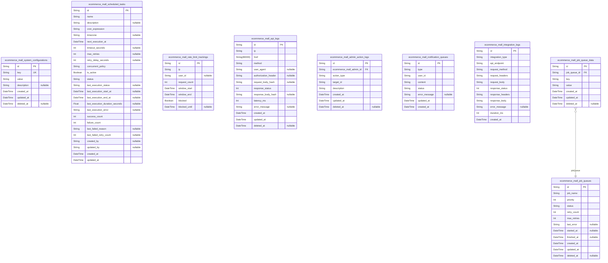

### `ecommerce_mall_system_configurations`

System configuration values for payment gateway settings, shipping rules,
and business hours. Stores key-value pairs for system-wide configuration
accessible across the application.

Properties as follows:

- `id`: Primary Key.
- `key`
  > Configuration key (e.g., 'payment_gateway', 'shipping_rules',
  > 'business_hours').
- `value`: Configuration value in JSON format.
- `description`: Optional description of what this configuration controls.
- `created_at`: Creation timestamp.
- `updated_at`: Last update timestamp.
- `deleted_at`: Deletion timestamp for soft delete.

### `ecommerce_mall_job_queues`

Background job queue records with status, retry count, and execution
history.

Properties as follows:

- `id`: Primary Key.
- `job_name`: Name of the job type to execute.
- `priority`: Priority level for job scheduling.
- `status`: Job execution status.
- `retry_count`: Current retry attempt count.
- `max_retries`: Maximum allowed retry attempts.
- `last_error`: Error message from last failed attempt.
- `started_at`: Timestamp when job processing started.
- `finished_at`: Timestamp when job processing completed.
- `created_at`: Record creation timestamp.
- `updated_at`: Record last update timestamp.
- `deleted_at`: Soft delete timestamp for audit preservation.

### `ecommerce_mall_scheduled_tasks`

Scheduled task metadata and execution history for batch processing and
cleanup jobs.

Tracks all scheduled tasks in the system including batch processing jobs,
maintenance operations,
and automated cleanup tasks. Each task has a unique identifier,
scheduling configuration,
execution status, and comprehensive history of past executions with
performance metrics.

**Key Concepts:**
- Scheduled tasks represent automated operations running at defined
intervals
- Supports both one-time and recurring tasks with cron-based scheduling
- Tracks execution history for monitoring, debugging, and audit purposes
- Stores execution metrics including duration, success rate, and error
details
- Supports manual retries and task cancellation

**Common Use Cases:**
- Monitoring task execution health and performance
- Debugging failed scheduled operations
- Auditing automated system operations
- Planning capacity and resource allocation

**Relationships:**
- Referenced by job_queues for job execution tracking
- Used by system administrators for operational oversight

**Design Notes:**
- Uses UUID primary keys for distributed system compatibility
- Soft delete via deleted_at for audit trail preservation
- Status field tracks current state of the task
- Cron expression format follows standard cron syntax
- Execution history stored separately for performance

**Timestamp Fields:**
- created_at: When the task definition was first created
- updated_at: When the task definition was last modified
- deleted_at: When the task was soft-deleted (nullable)
- next_execution_at: When the task is scheduled to run next
- last_execution_start_at: When the last execution started
- last_execution_end_at: When the last execution completed

Properties as follows:

- `id`: Primary Key. Unique identifier for the scheduled task.
- `name`: Task name for identification and logging.
- `description`: Detailed description of what the task does and why it exists.
- `cron_expression`
  > Cron expression defining the task schedule. Format: minute hour day month
  > weekday.
- `timezone`: Timezone for cron expression evaluation (e.g., 'UTC', 'Asia/Seoul').
- `next_execution_at`: The next scheduled execution time in the configured timezone.
- `timeout_seconds`
  > Maximum execution duration in seconds before timeout. Default 3600 (1
  > hour).
- `max_retries`: Maximum number of retry attempts on failure. Default 3.
- `retry_delay_seconds`: Delay in seconds between retry attempts. Default 60.
- `concurrent_policy`: Policy for handling concurrent executions: 'allow', 'deny', 'wait'.
- `is_active`: Whether the task is currently enabled and should be executed.
- `status`
  > Current status of the task: 'pending', 'running', 'completed', 'failed',
  > 'paused'.
- `last_execution_status`
  > Status of the most recent execution: 'pending', 'running', 'completed',
  > 'failed', 'timeout', 'cancelled'.
- `last_execution_start_at`: Timestamp when the last execution started.
- `last_execution_end_at`: Timestamp when the last execution completed.
- `last_execution_duration_seconds`: Duration of the last execution in seconds.
- `last_execution_error`: Error message from the last failed execution.
- `success_count`: Total number of successful executions.
- `failure_count`: Total number of failed executions.
- `last_failed_reason`: Reason for the most recent failure.
- `last_failed_retry_count`: Number of retries attempted before final failure.
- `created_by`: Identifier of the user/system that created this task definition.
- `updated_by`: Identifier of the user/system that last updated this task definition.
- `created_at`: Timestamp when the scheduled task definition was created.
- `updated_at`: Timestamp when the scheduled task definition was last updated.

### `ecommerce_mall_rate_limit_trackings`

Rate limit tracking records per IP/user for system-wide request
throttling. Tracks request counts within sliding time windows, reset
timestamps, and blocking status. Used by the rate limiting middleware to
enforce API usage policies.

Properties as follows:

- `id`: Primary Key.
- `ip`: Client IP address being rate limited.
- `user_id`: Optional reference to customer, seller, or admin user if authenticated.
- `request_count`: Number of requests made in the current time window.
- `window_start`: Start time of the current rate limiting window.
- `window_end`: End time of the current rate limiting window.
- `blocked`: Whether this IP/user is currently blocked due to rate limit exceeded.
- `blocked_until`: Timestamp when the block expires and rate limiting resets.

### `ecommerce_mall_api_logs`

API access logs capturing detailed information about each API request
including client IP, request URL, HTTP method, authentication status,
response latency, and timestamps. Used for audit trails, monitoring, and
debugging.

Properties as follows:

- `id`: Primary Key.
- `ip`: Client IP address that made the API request.
- `href`: Full request URL path including query parameters.
- `method`: HTTP method of the request (GET, POST, PUT, DELETE, PATCH).
- `user_agent`: User agent string from the client request.
- `authorization_header`: Authorization header value for authentication tracking.
- `request_body_hash`: Hash of request body for integrity verification.
- `response_status`: HTTP response status code.
- `response_body_hash`: Hash of response body for integrity verification.
- `latency_ms`: Request processing latency in milliseconds.
- `error_message`: Error message if request failed.
- `created_at`: Timestamp when the log entry was created.
- `updated_at`: Timestamp when the log entry was last updated.
- `deleted_at`: Soft delete timestamp.

### `ecommerce_mall_admin_action_logs`

Audit trail for administrator actions including seller approvals, product
deletions, and user bans.

Records administrative actions performed by admins on the platform,
including the action type, admin who performed it, target entity, and
description. Used for compliance and operational auditing.

Properties as follows:

- `id`: Primary Key.
- `ecommerce_mall_admin_id`: Administrator who performed the action. [ecommerce_mall_admins.id](#ecommerce_mall_admins).
- `action_type`
  > Type of administrative action (seller_approve, seller_reject,
  > seller_suspend, seller_unsuspend, user_ban, user_unban, product_delete,
  > category_create, category_edit, category_delete).
- `target_id`: ID of the target entity (user, seller, product, category).
- `description`: Detailed description of the action performed.
- `created_at`: When the action occurred.
- `updated_at`: When the record was last updated.
- `deleted_at`: Soft delete timestamp.

### `ecommerce_mall_notification_queues`

System notification queue (email, in-app notifications) with delivery
status and history

Properties as follows:

- `id`: Primary Key.
- `type`: Type of notification (email|in_app)
- `user_id`: Recipient user ID
- `content`: Notification content (HTML for email, JSON for in-app)
- `status`: Delivery status (pending|sent|failed|delivered)
- `error_message`: Delivery error message if failed
- `updated_at`: Timestamp of last status update
- `created_at`: Timestamp when notification was created

### `ecommerce_mall_integration_logs`

External API integration logs for payment gateway, shipping carrier, and
other third-party services. Records all request/response details for
debugging, audit, and monitoring purposes.

Properties as follows:

- `id`: Primary Key.
- `integration_type`: Type of integration (payment_gateway, shipping_carrier, other)
- `api_endpoint`: The API endpoint URL that was called
- `request_method`: HTTP method used for the request
- `request_headers`: Request headers as JSON string
- `request_body`: Request body as JSON string
- `response_status`: HTTP response status code
- `response_headers`: Response headers as JSON string
- `response_body`: Response body as JSON string
- `error_message`: Error message if the request failed
- `duration_ms`: Execution time in milliseconds
- `created_at`: Creation timestamp

### `ecommerce_mall_job_queue_data`

Job queue data key-value pairs for flexible JSON payload storage.

This table stores individual key-value pairs that together form the
complete payload for a job queue record. The key-value structure allows
flexible storage of different data types and nested objects while
maintaining a normalized schema. All key-value pairs for a single job are
grouped by the job_queue_id foreign key.

Key design aspects:
- Each record represents a single key-value pair from the job's JSON payload
- Multiple key-value pairs per job share the same job_queue_id
- The 'value' field stores the string representation of the data (JSON
for objects, primitives as strings)
- This enables the job queue system to handle varying payload structures
without schema changes
- The job_queue_id ensures all data for a job is traceable back to its
parent job queue record

Relationships:
- Belongs to a single job queue (ecommerce_mall_job_queues)
- Each job queue can have many key-value data pairs

Temporal fields follow standard pattern: created_at, updated_at,
deleted_at for audit and soft delete support.

Properties as follows:

- `id`: Primary Key.
- `job_queue_id`: Parent job queue's [ecommerce_mall_job_queues.id](#ecommerce_mall_job_queues).
- `key`: The key name for this payload data field.
- `value`
  > The string representation of the data value. JSON objects/arrays are
  > serialized as strings.
- `created_at`: Creation timestamp.
- `updated_at`: Last update timestamp.
- `deleted_at`: Deletion timestamp (nullable for soft delete).

## Customer

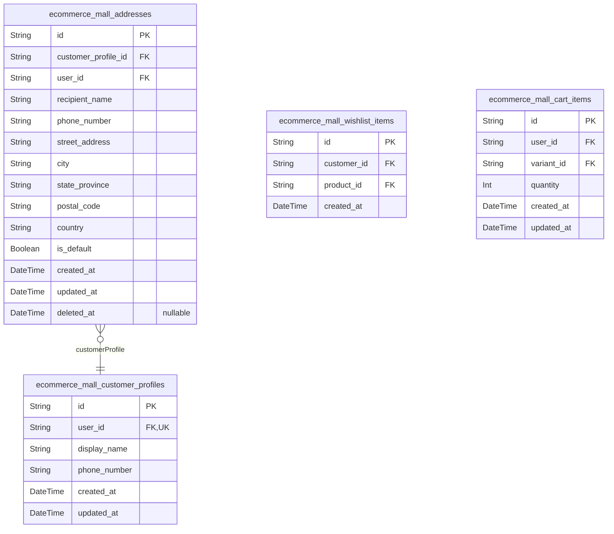

### `ecommerce_mall_customer_profiles`

Customer's display name and phone number linked to user account. Profiles
are subsidiary entities managed through customer accounts and do not
exist independently.

Properties as follows:

- `id`: Primary Key.
- `user_id`: Belonged customer's [ecommerce_mall_customers.id](#ecommerce_mall_customers).
- `display_name`: Customer's display name shown in public contexts.
- `phone_number`: Customer's phone number for contact and shipping.
- `created_at`: Record creation timestamp.
- `updated_at`: Record last update timestamp.

### `ecommerce_mall_addresses`

Multiple shipping addresses per customer with recipient info and default
flag. Each customer can have multiple addresses, and one address can be
marked as default shipping address for convenience. Addresses are linked
to customer profiles and users for audit purposes.

Properties as follows:

- `id`: Primary Key.
- `customer_profile_id`: Customer profile's [ecommerce_mall_customer_profiles.id](#ecommerce_mall_customer_profiles).
- `user_id`: User's [ecommerce_mall_customers.id](#ecommerce_mall_customers).
- `recipient_name`: Recipient name for the address.
- `phone_number`: Phone number for the address.
- `street_address`: Street address details.
- `city`: City name.
- `state_province`: State or province name.
- `postal_code`: Postal code.
- `country`: Country name.
- `is_default`: Whether this address is the default shipping address.
- `created_at`: Creation timestamp.
- `updated_at`: Last update timestamp.
- `deleted_at`: Deletion timestamp for soft delete.

### `ecommerce_mall_wishlist_items`

Products saved by customers for future purchase. Each wishlist item
represents a product that a customer wants to buy later. Customers can
add products to their wishlist and remove them at any time. If a product
is deleted by the seller, it is automatically removed from all customers'
wishlists. This table supports a many-to-many relationship between
customers and products through the wishlist feature.

Properties as follows:

- `id`: Primary Key.
- `customer_id`
  > Customer who saved the product to their wishlist. {@link
  > ecommerce_mall_customers.id}.
- `product_id`
  > Product that was saved to the customer's wishlist. {@link
  > ecommerce_mall_products.id}.
- `created_at`: Timestamp when the product was added to the customer's wishlist.

### `ecommerce_mall_cart_items`

Customer shopping cart items linking users to product variants with
quantity. Customers can add variants to cart, change quantities, remove
items, and view cart totals. Same variant in cart combines quantities via
unique constraint. Deleted or out-of-stock variants appear as unavailable
in cart. Deleted products automatically removed from all carts.

Properties as follows:

- `id`: Primary Key.
- `user_id`: Owner customer's [ecommerce_mall_customers.id](#ecommerce_mall_customers).
- `variant_id`: Selected product variant's [ecommerce_mall_product_variants.id](#ecommerce_mall_product_variants).
- `quantity`: Number of units in cart. Minimum 1.
- `created_at`: When cart item was created.
- `updated_at`: When cart item was last updated.

## Seller

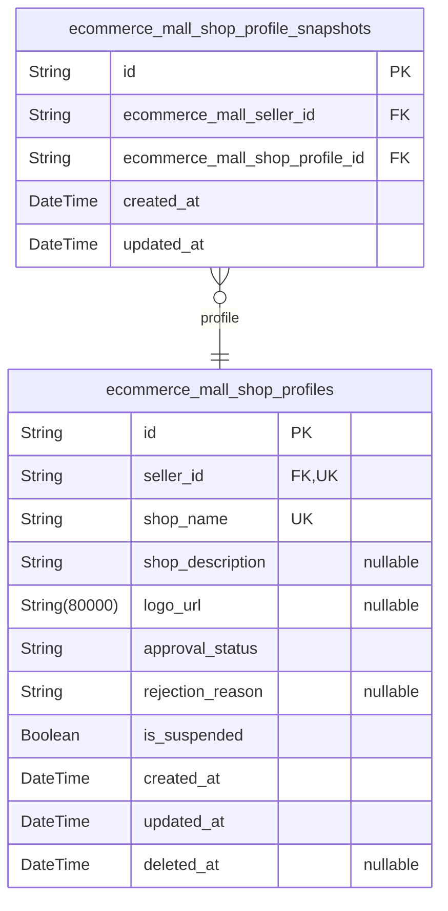

### `ecommerce_mall_shop_profiles`

Seller's shop profile including shop name, description, logo URL, and
approval status.

Seller shop profiles contain the business identity information that
sellers manage on the platform. Each seller account has exactly one shop
profile that displays their storefront information to customers including
shop name, description, and logo. The profile tracks approval status
during seller registration and suspension status for platform moderation.

Key business operations:
- Sellers can edit shop name, description, and logo
- Every edit creates a snapshot in ecommerce_mall_shop_profile_snapshots
- Admins approve/reject new seller registrations
- Admins can suspend seller accounts
- Deleted sellers retain their profile data for audit purposes

Relationships:
- ecommerce_mall_sellers: 1:1 relationship with seller account
- ecommerce_mall_shop_profile_snapshots: 1:N snapshots of profile history

Data Integrity:
- shop_name: required, unique within platform
- logo_url: optional, stored as URI reference
- approval_status: enum (pending|approved|rejected)
- is_suspended: boolean flag for administrative suspension

Properties as follows:

- `id`: Primary Key.
- `seller_id`
  > Seller account that owns this shop profile. {@link
  > ecommerce_mall_sellers.id}.
- `shop_name`
  > Seller's shop/store name displayed to customers. Unique identifier for
  > the seller's storefront on the platform.
- `shop_description`
  > Detailed description of the seller's shop, products, and business.
  > Displayed on shop profile page.
- `logo_url`
  > URL reference to the seller's shop logo image. Optional visual branding
  > for the storefront.
- `approval_status`
  > Seller account approval status during registration workflow. Values:
  > pending (awaiting admin approval), approved (active seller), rejected
  > (registration declined).
- `rejection_reason`
  > Reason provided by administrator when seller registration is rejected.
  > Visible to seller for resubmission guidance.
- `is_suspended`
  > Administrative suspension flag. When true, seller's products are hidden
  > from search/listings and sellers cannot create/edit products, but can
  > still process existing orders.
- `created_at`
  > Timestamp when this shop profile was created. Automatically set on
  > profile creation.
- `updated_at`
  > Timestamp when this shop profile was last updated. Automatically updated
  > on any profile modification.
- `deleted_at`
  > Timestamp when this shop profile was soft-deleted. Null if active, set
  > when seller account is deleted to preserve history.

### `ecommerce_mall_shop_profile_snapshots`

Seller profile snapshots created every time a seller edits their shop
profile. Each snapshot preserves the complete shop profile state (shop
name, description, logo URL, approval status) at the moment of edit for
audit trail and dispute resolution. Used for historical tracking of shop
profile changes and reviewing profile state at time of order or dispute.

Properties as follows:

- `id`: Primary Key.
- `ecommerce_mall_seller_id`: Belonged seller's [ecommerce_mall_sellers.id](#ecommerce_mall_sellers).
- `ecommerce_mall_shop_profile_id`
  > Seller profile state at time of edit snapshot {@link
  > ecommerce_mall_shop_profiles.id}.
- `created_at`: Timestamp when this snapshot was created (snapshot point-in-time).
- `updated_at`: Timestamp when this snapshot was last updated.

## Inventory

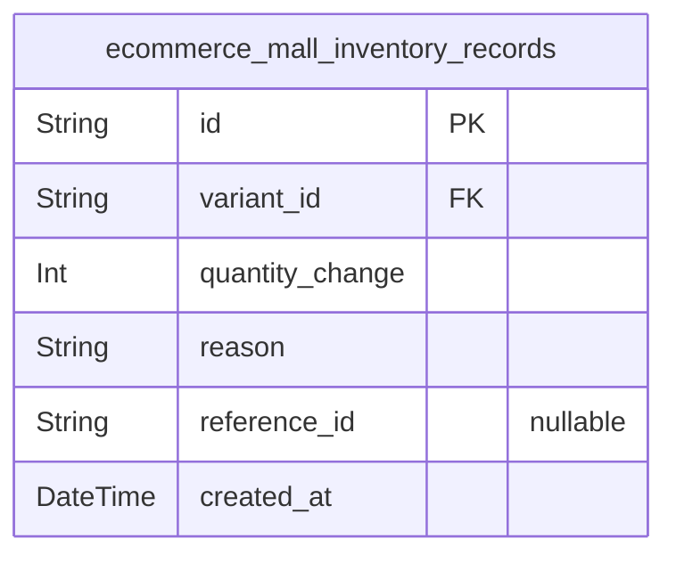

### `ecommerce_mall_inventory_records`

Records all stock level changes for product variants. Each record
represents a quantity change (positive for restock/adjustment, negative
for order/cancellation/refund) with reason code and timestamp. Current
stock = sum of all records for variant.

Properties as follows:

- `id`: Primary Key.
- `variant_id`: Product variant's [ecommerce_mall_product_variants.id](#ecommerce_mall_product_variants).
- `quantity_change`
  > Quantity change amount (positive for restock/adjustment, negative for
  > order/cancellation/refund).
- `reason`: Reason code: restock, order, adjustment, cancel, refund.
- `reference_id`: Optional reference ID for audit trail (e.g., order_id, shipment_id).
- `created_at`: Timestamp when inventory record was created.

## Cancellation

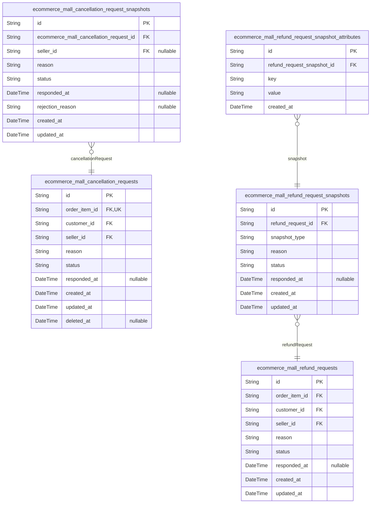

### `ecommerce_mall_cancellation_requests`

Customer-initiated requests to cancel paid order items. Each request is
associated with a specific order item, customer, and seller. Requests
progress through status workflow (pending → approved/rejected) with
resolution timestamps stored in responded_at. The snapshot table
ecommerce_mall_cancellation_request_snapshots captures the request state
at approval/rejection time for audit and dispute resolution purposes.

Properties as follows:

- `id`: Primary Key.
- `order_item_id`: The order item being cancelled. [ecommerce_mall_order_items.id](#ecommerce_mall_order_items).
- `customer_id`
  > The customer who requested the cancellation. {@link
  > ecommerce_mall_customers.id}.
- `seller_id`
  > The seller who will resolve the cancellation request. {@link
  > ecommerce_mall_sellers.id}.
- `reason`: The reason provided by customer for requesting cancellation.
- `status`: Current status of the cancellation request (pending, approved, rejected).
- `responded_at`: Timestamp when seller responded to the request.
- `created_at`: When the cancellation request was created.
- `updated_at`: When the cancellation request was last updated.
- `deleted_at`: Soft delete timestamp for audit compliance.

### `ecommerce_mall_refund_requests`

Customer-initiated refund requests for delivered order items. Customers
can request refunds within 7 days of item delivery. Each request includes
reason text, status (pending/approved/rejected), and response tracking.
Seller approves or rejects requests with optional notes. Snapshot of
request state preserved when resolved.

Properties as follows:

- `id`: Primary Key. UUID identifier for each refund request.
- `order_item_id`: The order item being refunded. [ecommerce_mall_order_items.id](#ecommerce_mall_order_items).
- `customer_id`
  > The customer who initiated the refund request. {@link
  > ecommerce_mall_customers.id}.
- `seller_id`
  > The seller who will approve or reject the refund request. {@link
  > ecommerce_mall_sellers.id}.
- `reason`
  > Customer-provided reason for requesting the refund. Required field with
  > detailed explanation.
- `status`
  > Current status of the refund request. Values: 'pending' (awaiting seller
  > response), 'approved' (seller approved refund), 'rejected' (seller
  > rejected refund).
- `responded_at`
  > Timestamp when the seller approved or rejected the refund request.
  > Nullable until response is provided.
- `created_at`: When the refund request was created.
- `updated_at`: When the refund request was last updated.

### `ecommerce_mall_cancellation_request_snapshots`

Historical snapshots of cancellation requests preserving request state
(reason, status, response) at approval/rejection time. Created immutably
when sellers respond to customer cancellation requests. Used for audit
trail and dispute resolution.

Properties as follows:

- `id`: Primary Key.
- `ecommerce_mall_cancellation_request_id`
  > References the parent cancellation request that this snapshot captures.
  > [ecommerce_mall_cancellation_requests.id](#ecommerce_mall_cancellation_requests).
- `seller_id`
  > References the seller who resolved this cancellation request. {@link
  > ecommerce_mall_sellers.id}.
- `reason`: Text reason provided by customer when requesting cancellation.
- `status`: Request status at time of snapshot (pending|approved|rejected).
- `responded_at`: Timestamp when seller responded to the cancellation request.
- `rejection_reason`
  > Reason provided by seller for rejecting the cancellation request (if
  > applicable).
- `created_at`: Timestamp when this snapshot was created.
- `updated_at`: Timestamp when this snapshot was last updated.

### `ecommerce_mall_refund_request_snapshots`

Snapshot records of refund requests at time of approval/rejection.
Captures the complete state of a refund request (reason, status,
respondedAt, snapshotData) when a seller approves or rejects the request.
Used for audit trail and dispute resolution. Immutable and cannot be
modified after creation.

Properties as follows:

- `id`: Primary Key.
- `refund_request_id`
  > Refund request that this snapshot belongs to. {@link
  > ecommerce_mall_refund_requests.id}.
- `snapshot_type`: Type of change that triggered this snapshot (edit).
- `reason`: Customer's reason for requesting refund at snapshot time.
- `status`: Request status at snapshot time (pending|approved|rejected).
- `responded_at`: Seller's response timestamp (null if pending).
- `created_at`: Timestamp when this snapshot was created.
- `updated_at`: Timestamp when this snapshot was last updated.

### `ecommerce_mall_refund_request_snapshot_attributes`

Key-value attribute storage for refund request snapshots. This table
decomposes JSON snapshot_data fields into normalized rows, enabling
efficient querying of specific attributes while preserving complete
snapshot state. Each snapshot can have multiple attributes (e.g.,
'reason', 'status', 'createdAt', 'respondedAt').

Properties as follows:

- `id`: Primary Key.
- `refund_request_snapshot_id`
  > Parent refund request snapshot this attribute belongs to. {@link
  > ecommerce_mall_refund_request_snapshots.id}.
- `key`: Attribute name such as 'reason', 'status', 'createdAt', or 'respondedAt'.
- `value`: JSON-serialized attribute value stored as string for flexibility.
- `created_at`
  > Timestamp when this attribute was stored. Used for audit trail of
  > snapshot attribute creation.

## Reviews

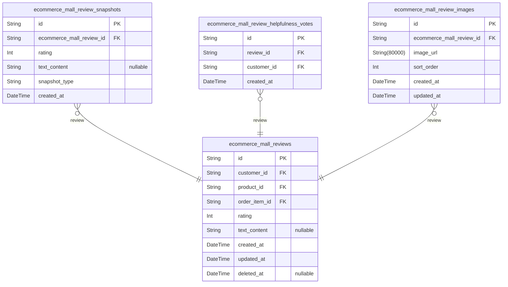

### `ecommerce_mall_reviews`

Customer reviews for products with rating (1-5 stars) and optional text
content. Each review is owned by a customer and associated with a
specific product and order item. Reviews can be edited (creating
snapshots) or deleted (preserved in snapshots).

Properties as follows:

- `id`: Primary Key.
- `customer_id`: Customer who wrote the review. [ecommerce_mall_customers.id](#ecommerce_mall_customers).
- `product_id`: Product being reviewed. [ecommerce_mall_products.id](#ecommerce_mall_products).
- `order_item_id`: Order item proof of purchase. [ecommerce_mall_order_items.id](#ecommerce_mall_order_items).
- `rating`: Customer rating (1-5 stars, required).
- `text_content`: Optional review text content.
- `created_at`: Review creation timestamp.
- `updated_at`: Last update timestamp.
- `deleted_at`: Soft delete timestamp. Nullable for active reviews.

### `ecommerce_mall_review_snapshots`

Historical snapshots of reviews for audit trail and dispute resolution.
Created whenever a review is edited or updated. Snapshots are immutable
and preserve the review state (rating, text) at that point in time.

Properties as follows:

- `id`: Primary Key.
- `ecommerce_mall_review_id`
  > Reference to the original review that this snapshot captures. {@link
  > ecommerce_mall_reviews.id}.
- `rating`: Rating value from 1 to 5 stars given by the customer.
- `text_content`
  > Optional text content of the review. Can be null if customer didn't
  > provide text.
- `snapshot_type`
  > Type of snapshot: 'edit' for review edits or 'deleted' for reviews marked
  > for deletion. Identifies the business event that triggered this snapshot.
- `created_at`: Timestamp when this snapshot was created (immutable).

### `ecommerce_mall_review_helpfulness_votes`

Helpfulness votes on reviews from other customers. Each vote records
which customer found which review helpful, with a timestamp of when the
vote was cast. Supports customer feedback on review quality and
usefulness.

Properties as follows:

- `id`: Primary Key.
- `review_id`: The review being voted on. [ecommerce_mall_reviews.id](#ecommerce_mall_reviews).
- `customer_id`
  > The customer who cast the helpfulness vote. {@link
  > ecommerce_mall_customers.id}.
- `created_at`: When the helpfulness vote was cast.

### `ecommerce_mall_review_images`

Optional images uploaded with reviews to provide visual context or
evidence. Each review can have multiple images with sort order and
timestamps. Images are automatically deleted when the associated review
is deleted.

Properties as follows:

- `id`: Primary Key.
- `ecommerce_mall_review_id`: Review that this image belongs to. [ecommerce_mall_reviews.id](#ecommerce_mall_reviews).
- `image_url`: URL of the uploaded review image.
- `sort_order`
  > Order of this image relative to other images for the same review. Lower
  > numbers appear first.
- `created_at`: When this image was uploaded.
- `updated_at`: When this image was last modified.

## PlatformAdmin

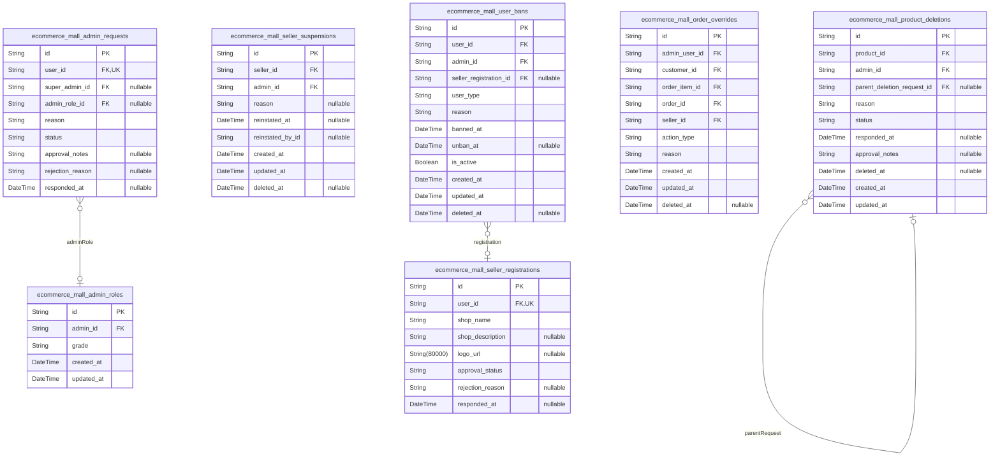

### `ecommerce_mall_admin_requests`

Administrator role application records tracking customer, seller, or
admin requests to gain platform administrative privileges. Supports
pending→approved or pending→rejected transitions with reason text,
approval notes, and status tracking. When approved, creates an admin role
record granting administrative privileges.

Properties as follows:

- `id`: Primary Key.
- `user_id`
  > Applicant user's [ecommerce_mall_customers.id](#ecommerce_mall_customers) or {@link
  > ecommerce_mall_sellers.id}. Must reference either a customer or seller
  > account.
- `super_admin_id`
  > Super administrator who processed the request {@link
  > ecommerce_mall_admins.id}. Nullable while status is pending.
- `admin_role_id`
  > Created admin role record when request is approved {@link
  > ecommerce_mall_admin_roles.id}. Nullable while status is pending.
- `reason`
  > Reason text explaining why the user wants administrative privileges.
  > Required when submitting request.
- `status`
  > Request status: 'pending' (initial), 'approved' (by super admin),
  > 'rejected' (by super admin). Status transitions: pending→approved,
  > pending→rejected. Approved/rejected status creates admin role or records
  > rejection.
- `approval_notes`
  > Notes from super administrator when approving request. Optional when
  > rejecting (required rejection reason stored separately in
  > admin_action_logs).
- `rejection_reason`
  > Reason text when super administrator rejects request. Stored as part of
  > admin action logs for audit trail.
- `responded_at`
  > Timestamp when super administrator responded to the request (approved or
  > rejected). Nullable while status is pending.

### `ecommerce_mall_admin_roles`

Grades assigned to administrators (regular or super) with timestamps.

This table stores administrator role grade assignments for the platform
administration system. It records which administrators have been granted
specific grade levels (regular or super) and when these assignments were
made.

## Business Purpose:

- Maintain administrator role hierarchy (regular vs super administrators)
- Track when each administrator grade was assigned
- Support audit trail for privilege assignments
- Enable role-based access control for platform operations

## Key Features:

- Administrators have a single active grade at any time
- Grade assignments are logged with timestamps for audit
- Super administrators have elevated privileges for managing other admins
- Regular administrators have standard platform management capabilities

## Relationships:

- References ecommerce_mall_admins table for admin identity
- Used by admin_action_logs for privilege tracking

## Query Patterns:

- Look up admin grade: SELECT * FROM admin_roles WHERE admin_id = ?
- Find super admins: SELECT * FROM admin_roles WHERE grade = 'super'
- Audit grade history: SELECT * FROM admin_roles WHERE admin_id = ? ORDER
BY created_at

Properties as follows:

- `id`: Primary Key.
- `admin_id`: Admin user's [ecommerce_mall_admins.id](#ecommerce_mall_admins).
- `grade`: Administrator grade level (regular|super).
- `created_at`: Timestamp when this role grade was assigned.
- `updated_at`: Timestamp when this role grade was last updated.

### `ecommerce_mall_seller_registrations`

Seller registration requests with approval status and rejection reasons

Properties as follows:

- `id`: Primary Key
- `user_id`
  > Seller user account that this registration request belongs to. {@link
  > ecommerce_mall_sellers.id}.
- `shop_name`: Shop name provided during registration
- `shop_description`: Shop description provided during registration
- `logo_url`: Logo image URL provided during registration
- `approval_status`: Approval status of the registration request (pending|approved|rejected)
- `rejection_reason`: Reason for rejection (required only when status is rejected)
- `responded_at`: Timestamp when the request was approved or rejected

### `ecommerce_mall_seller_suspensions`

Records of seller account suspensions by administrators. Tracks who
suspended the seller, when the suspension started, optional reason, and
when (if ever) the seller was reinstated. Used to enforce suspension
rules (hidden products, no new edits, existing order processing allowed).

Properties as follows:

- `id`: Primary Key.
- `seller_id`: Suspended seller's [ecommerce_mall_sellers.id](#ecommerce_mall_sellers).
- `admin_id`
  > Administrator who performed the suspension {@link
  > ecommerce_mall_admins.id}.
- `reason`: Optional reason for the suspension provided by the administrator.
- `reinstated_at`: Timestamp when the seller was reinstated (unsuspended), if applicable.
- `reinstated_by_id`: Administrator who reinstated the seller, if applicable.
- `created_at`: When the suspension record was created.
- `updated_at`: When the suspension record was last updated.
- `deleted_at`: For soft delete support. Null when active, timestamp when deleted.

### `ecommerce_mall_product_deletions`

Records of administrator-initiated product deletion requests for policy
violations.

Properties as follows:

- `id`: Primary Key.
- `product_id`: Product being deleted [ecommerce_mall_products.id](#ecommerce_mall_products).
- `admin_id`: Administrator who initiated the deletion [ecommerce_mall_admins.id](#ecommerce_mall_admins).
- `parent_deletion_request_id`
  > Parent deletion request if this is a follow-up action {@link
  > ecommerce_mall_product_deletions.id}.
- `reason`: Reason provided by administrator for product deletion.
- `status`: Current status of the deletion request (pending|approved|rejected).
- `responded_at`: Timestamp when administrator responded to the deletion request.
- `approval_notes`: Notes from administrator about the deletion decision.
- `deleted_at`: Timestamp when the product was actually deleted.
- `created_at`: Timestamp when this deletion request was created.
- `updated_at`: Timestamp when this deletion request was last updated.

### `ecommerce_mall_order_overrides`

Administrator-initiated order override actions including force
cancellation and refund. Records who (admin user), what action
(cancel/refund), which order/item, and timestamp. Supports full audit
trail and dispute resolution.

Properties as follows:

- `id`: Primary Key.
- `admin_user_id`
  > Administrator who performed the override. {@link
  > ecommerce_mall_admins.id}.
- `customer_id`: Customer affected by the override. [ecommerce_mall_customers.id](#ecommerce_mall_customers).
- `order_item_id`
  > Order item affected by the override. {@link
  > ecommerce_mall_order_items.id}.
- `order_id`: Order affected by the override. [ecommerce_mall_orders.id](#ecommerce_mall_orders).
- `seller_id`: Seller affected by the override. [ecommerce_mall_sellers.id](#ecommerce_mall_sellers).
- `action_type`: Type of override action: cancel or refund.
- `reason`: Reason for the override action provided by administrator.
- `created_at`: When the override action was performed.
- `updated_at`: Last update timestamp.
- `deleted_at`: Soft delete timestamp. Null means active record.

### `ecommerce_mall_user_bans`

Records of user bans with ban timestamps and reason tracking.

Properties as follows:

- `id`: Primary Key.
- `user_id`
  > Referenced customer/seller user's [ecommerce_mall_customers.id](#ecommerce_mall_customers) or
  > [ecommerce_mall_sellers.id](#ecommerce_mall_sellers).
- `admin_id`
  > Administrator who performed the ban action. {@link
  > ecommerce_mall_admins.id}.
- `seller_registration_id`
  > Reference to original seller registration if banning seller. {@link
  > ecommerce_mall_seller_registrations.id}.
- `user_type`: UUID of banned user for polymorphic ownership pattern.
- `reason`: Reason for the ban action provided by administrator.
- `banned_at`: Timestamp when user was banned.
- `unban_at`: Timestamp when ban expires or null for permanent ban.
- `is_active`: Whether the ban is currently active.
- `created_at`: Timestamp when ban was created.
- `updated_at`: Timestamp when ban was last updated.
- `deleted_at`: Timestamp when ban was deleted (soft delete).

## Categories

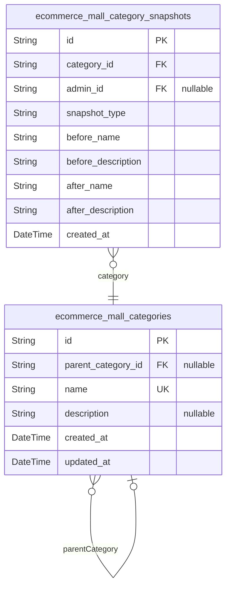

### `ecommerce_mall_categories`

Product categories with hierarchical structure supporting one-level
subcategory nesting. Categories are used to organize products for
browsing and filtering.

Properties as follows:

- `id`: Primary Key.
- `parent_category_id`
  > Parent category reference for hierarchical structure. Nullable for
  > top-level categories.
- `name`: Category name (required, unique).
- `description`: Category description (optional).
- `created_at`: Timestamp when category was created.
- `updated_at`: Timestamp when category was last updated.

### `ecommerce_mall_category_snapshots`

Audit trail for category edits. Records the category name and description
at the time of each edit, enabling historical review and dispute
resolution. Snapshots are immutable and cannot be deleted. Each record
preserves the category state (name, description) before and after
changes.

Properties as follows:

- `id`: Primary Key.
- `category_id`: Category that was changed. [ecommerce_mall_categories.id](#ecommerce_mall_categories).
- `admin_id`: Administrator who performed the edit. [ecommerce_mall_admins.id](#ecommerce_mall_admins).
- `snapshot_type`: Type of edit that triggered the snapshot (edit).
- `before_name`: Category name before the edit.
- `before_description`: Category description before the edit.
- `after_name`: Category name after the edit.
- `after_description`: Category description after the edit.
- `created_at`: Timestamp when the snapshot was created (when the edit occurred).

## Orders

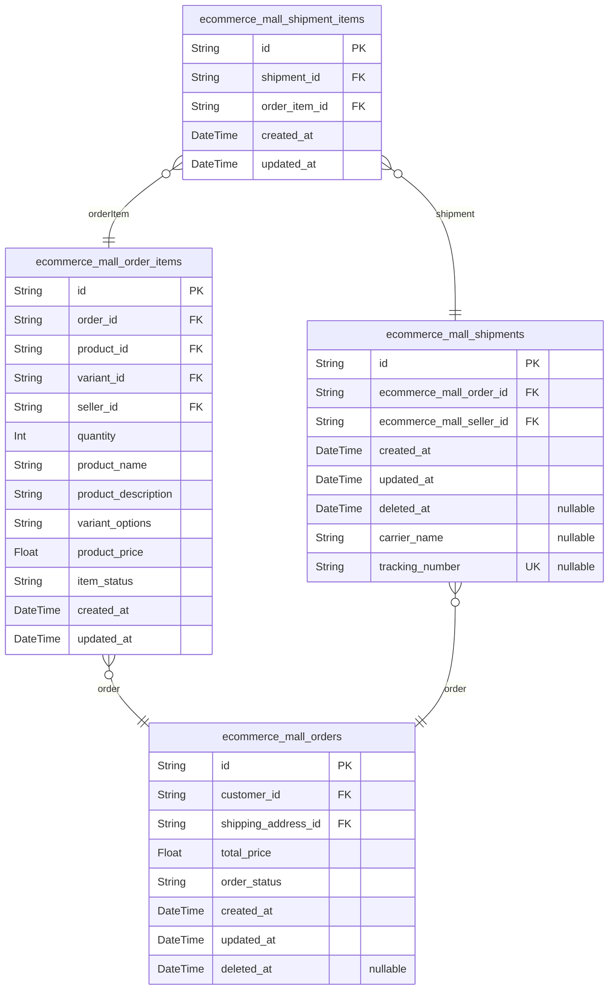

### `ecommerce_mall_orders`

Main order entity representing customer purchases. Contains order-level
information including customer reference, shipping address, status
tracking, and total price calculation. Each order contains one or more
order items representing purchased products with their variants. The
order status is derived from the collective status of its order items.

Properties as follows:

- `id`: Primary Key. Unique identifier for the order.
- `customer_id`: Customer who placed the order. [ecommerce_mall_customers.id](#ecommerce_mall_customers).
- `shipping_address_id`: Shipping address used for this order. [ecommerce_mall_addresses.id](#ecommerce_mall_addresses).
- `total_price`: Total price of the order calculated from all order items.
- `order_status`
  > Order status derived from order item statuses: paid (all items paid),
  > shipped (any item shipped, none delivered), delivered (all items
  > delivered), cancelled (all items cancelled), refunded (all items
  > refunded), partiallyCompleted (mixed states).
- `created_at`: Timestamp when the order was created.
- `updated_at`: Timestamp when the order was last updated.
- `deleted_at`: Optional timestamp for soft deletion.

### `ecommerce_mall_order_items`

Order items represent purchased products with their snapshots at purchase
time. Each order item belongs to an order, references a product variant,
and captures the seller's profile at purchase time. Order items support
item-level status tracking and can be individually cancelled or refunded.
This table stores all snapshot data including product name, description,
variant options, and price to preserve historical state.

Key characteristics:
- Belongs to orders (one order has many order items)
- References products, variants, and sellers at purchase time
- Stores snapshot data: product name, description, variant options, price
- Supports item-level status: paid, shipped, delivered, cancelled, refunded
- Can be individually cancelled or refunded
- Linked to shipments via shipment_items junction table
- One-to-many relationship with cancellation and refund requests

Properties as follows:

- `id`: Primary Key.
- `order_id`: Belonged order's [ecommerce_mall_orders.id](#ecommerce_mall_orders).
- `product_id`: Reference to product at purchase time [ecommerce_mall_products.id](#ecommerce_mall_products).
- `variant_id`
  > Reference to product variant at purchase time {@link
  > ecommerce_mall_product_variants.id}.
- `seller_id`
  > Reference to seller profile at purchase time {@link
  > ecommerce_mall_sellers.id}.
- `quantity`: Number of units purchased, minimum 1.
- `product_name`: Product name snapshot at purchase time.
- `product_description`: Product description snapshot at purchase time.
- `variant_options`: Variant option values as JSON at purchase time.
- `product_price`: Product price snapshot at purchase time.
- `item_status`: Status of the order item: paid, shipped, delivered, cancelled, refunded.
- `created_at`: Creation timestamp.
- `updated_at`: Last update timestamp.

### `ecommerce_mall_shipments`

Shipment records group order items into physical packages for shipping.
Each shipment is created by sellers when they ship items, and includes
carrier name and tracking number for delivery tracking. Shipment items
reference the order items that are included in this shipment. Multiple
shipments can exist for a single order (from different sellers), and each
shipment contains one or more order items.

Properties as follows:

- `id`: Primary Key.
- `ecommerce_mall_order_id`
  > The order that this shipment belongs to. A shipment always belongs to
  > exactly one order. [ecommerce_mall_orders.id](#ecommerce_mall_orders).
- `ecommerce_mall_seller_id`
  > The seller who created this shipment and is responsible for shipping the
  > items. [ecommerce_mall_sellers.id](#ecommerce_mall_sellers).
- `created_at`: Timestamp when the shipment record was created.
- `updated_at`: Timestamp when the shipment record was last updated.
- `deleted_at`: Optional timestamp for soft delete.
- `carrier_name`: Carrier name (e.g., 'Kuroneko Yamato', 'Yuunyu', 'CJ logistics').
- `tracking_number`: Tracking number provided by the carrier for delivery tracking.

### `ecommerce_mall_shipment_items`

Junction table linking shipments to order items for shipment-item
relationships.

Properties as follows:

- `id`: Primary Key.
- `shipment_id`: Shipment reference. [ecommerce_mall_shipments.id](#ecommerce_mall_shipments).
- `order_item_id`: Order item reference. [ecommerce_mall_order_items.id](#ecommerce_mall_order_items).
- `created_at`: Creation timestamp.
- `updated_at`: Last update timestamp.

## ProductManagement

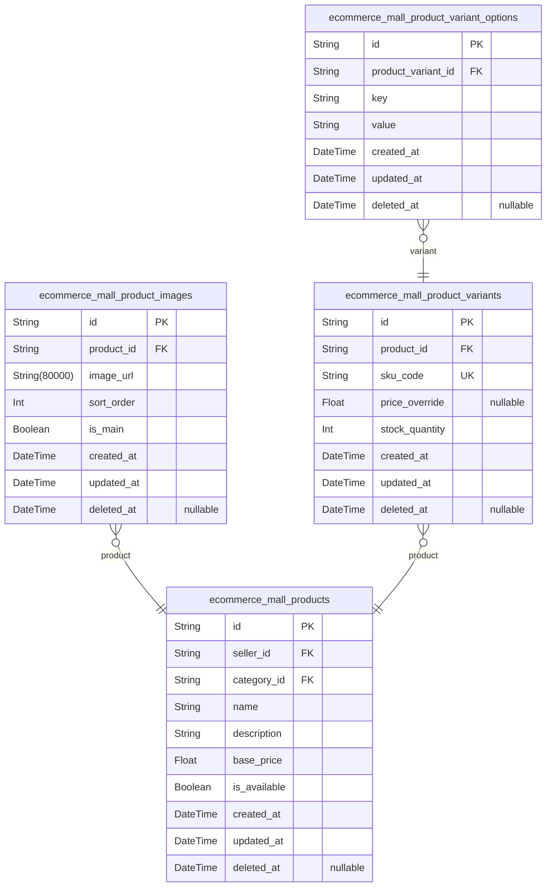

### `ecommerce_mall_products`

Main product listings created by sellers. Each product belongs to a
seller and category, contains name and description, base price, and
availability status. Products support soft delete via deleted_at
timestamp. Product edits create separate snapshots for audit trail and
dispute resolution.

Properties as follows:

- `id`: Primary Key.
- `seller_id`: Seller who created this product. [ecommerce_mall_sellers.id](#ecommerce_mall_sellers).
- `category_id`: Category this product belongs to. [ecommerce_mall_categories.id](#ecommerce_mall_categories).
- `name`: Product name displayed to customers.
- `description`: Detailed product description displayed on product page.
- `base_price`: Base price of the product in currency units.
- `is_available`: Whether this product is available for purchase.
- `created_at`: Timestamp when this product was created.
- `updated_at`: Timestamp when this product was last updated.
- `deleted_at`: Timestamp when this product was soft deleted. Null means active.

### `ecommerce_mall_product_images`

Multiple product images per product with ordering and main image
designation.

This table stores all images associated with a product. Each product can
have multiple images that are ordered by sort_order. The is_main flag
indicates which image serves as the thumbnail. Sellers can upload,
reorder, and delete images during product management. All image changes
are preserved in product snapshots created during product edits.

[ecommerce_mall_products.id](#ecommerce_mall_products)

Properties as follows:

- `id`: Primary Key.
- `product_id`: Product's [ecommerce_mall_products.id](#ecommerce_mall_products).
- `image_url`: URL or path to the product image.
- `sort_order`
  > Ordering of images within a product. Lower values appear first. Used for
  > arranging images in the product gallery.
- `is_main`: Whether this image is the main thumbnail for the product.
- `created_at`: When the image was uploaded.
- `updated_at`: When the image was last modified.
- `deleted_at`: When the image was soft-deleted (nullable if not deleted).

### `ecommerce_mall_product_variants`

Product variant (SKU) records that represent specific option combinations
(e.g., 'color: red, size: large') for products. Each variant has a unique
SKU code, optional price override (falls back to product base price), and
current stock quantity. Stock is managed through separate inventory
records rather than direct updates. Deleted variants are preserved for
audit and historical order records.

Properties as follows:

- `id`: Primary Key.
- `product_id`: Product that this variant belongs to. [ecommerce_mall_products.id](#ecommerce_mall_products).
- `sku_code`: Unique SKU code identifying this variant across all products.
- `price_override`
  > Optional price override for this variant. If null, uses the product's
  > base price.
- `stock_quantity`
  > Current stock quantity for this variant. Calculated from sum of inventory
  > records.
- `created_at`: Creation timestamp.
- `updated_at`: Last update timestamp.
- `deleted_at`: Soft delete timestamp. Null if not deleted.

### `ecommerce_mall_product_variant_options`

Product variant option key-value pairs for normalized storage of option
combinations like 'color: red, size: large'. Each product variant can
have multiple option pairs (e.g., {"color": "Red", "size": "Large"}
stored as separate rows).

Properties as follows:

- `id`: Primary Key.
- `product_variant_id`
  > Reference to the product variant. {@link
  > ecommerce_mall_product_variants.id}.
- `key`: Option name (e.g., 'color', 'size', 'material').
- `value`: Option value (e.g., 'Red', 'Large', 'Cotton').
- `created_at`: Creation timestamp.
- `updated_at`: Last update timestamp.
- `deleted_at`: Soft delete timestamp (nullable if not deleted).
