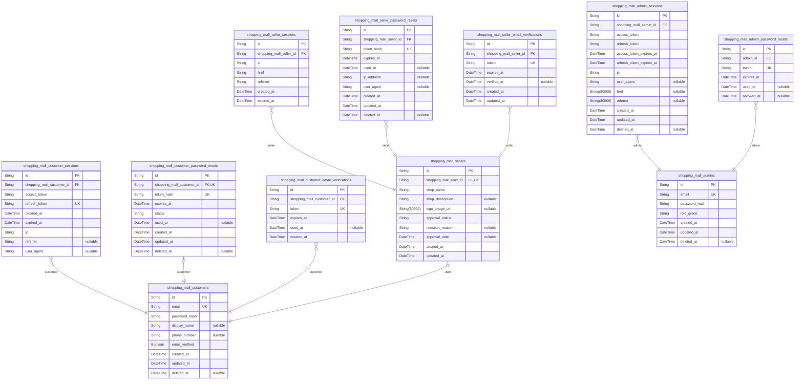
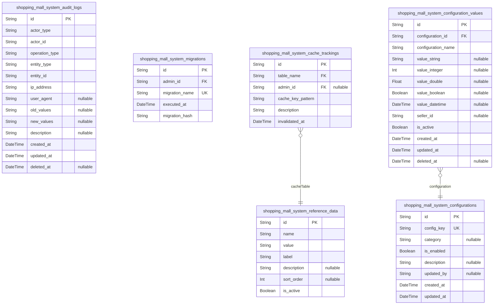
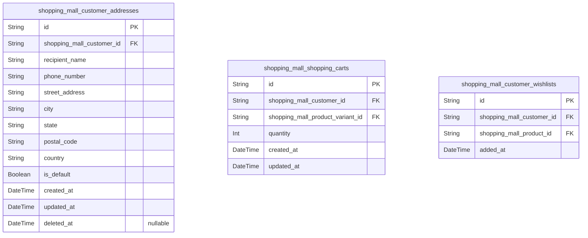
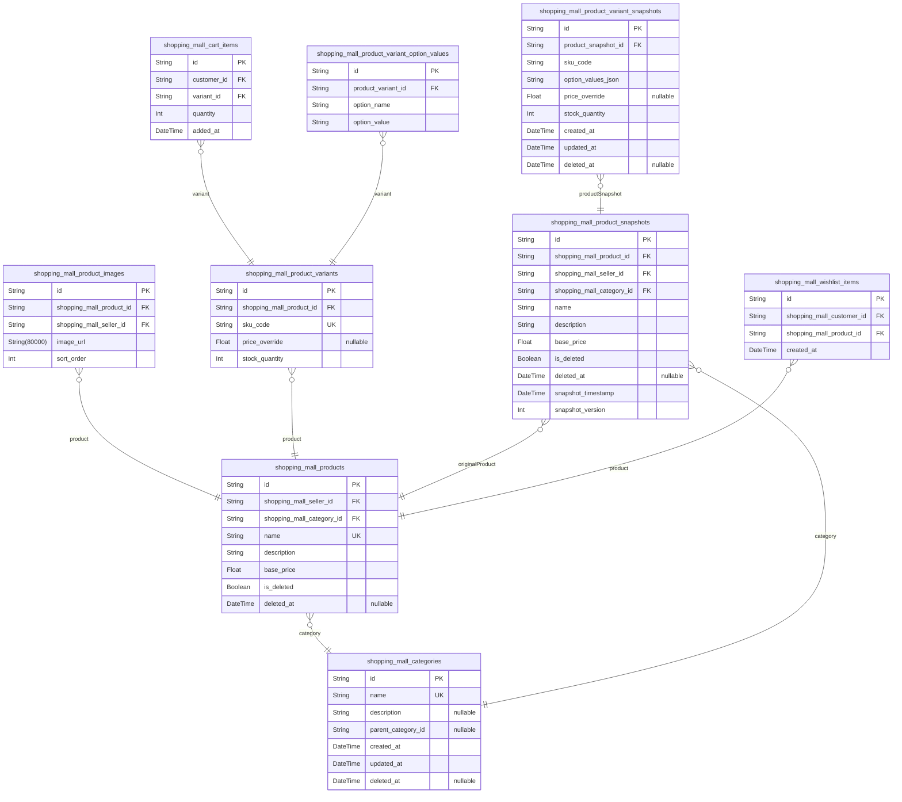
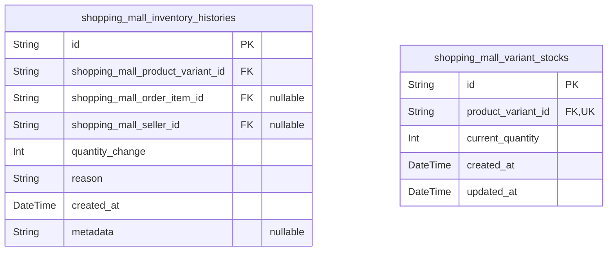
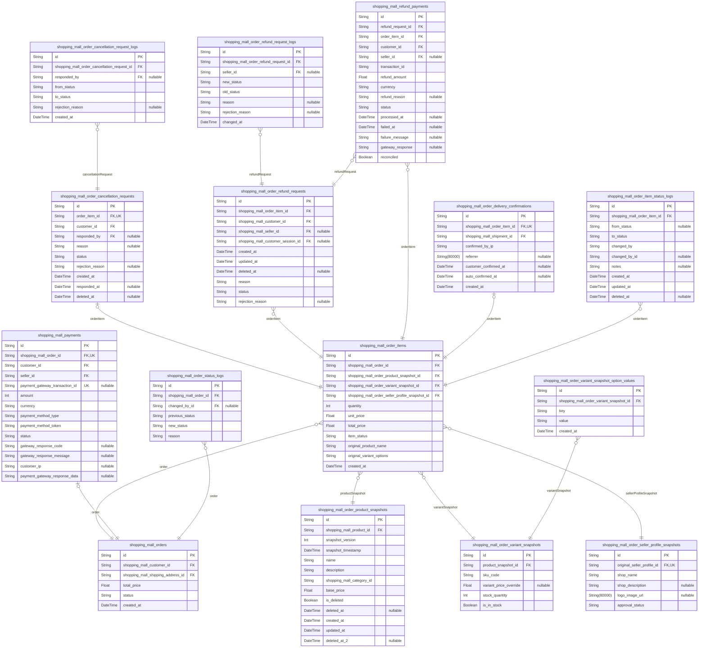
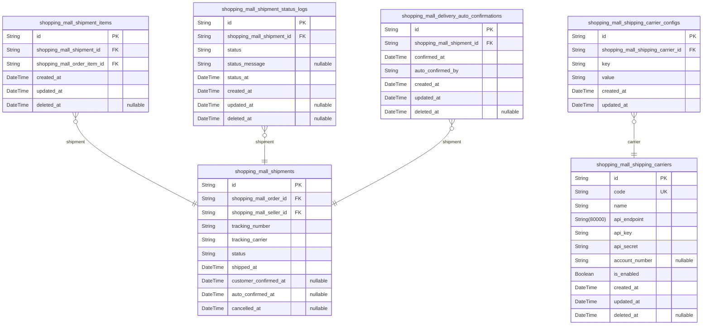
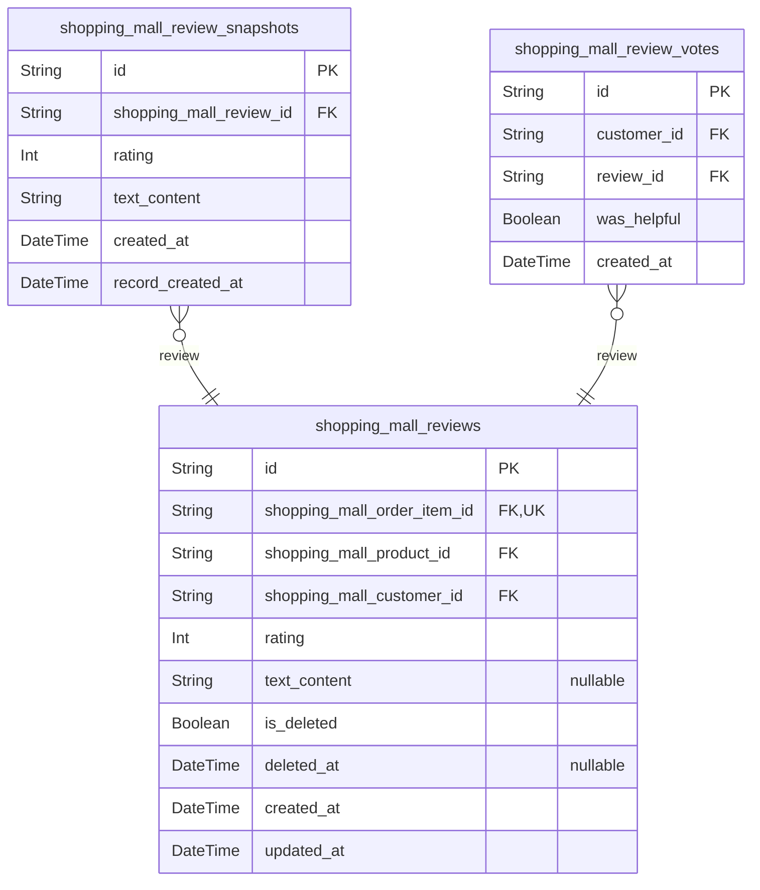

# Prisma Markdown

> Generated by [`prisma-markdown`](https://github.com/samchon/prisma-markdown)

- [Actors](#actors)
- [Systematic](#systematic)
- [Customers](#customers)
- [Sellers](#sellers)
- [Products](#products)
- [Inventory](#inventory)
- [Orders](#orders)
- [Shipping](#shipping)
- [Reviews](#reviews)

## Actors

### `shopping_mall_customers`

Registered customer accounts with email/password credentials and profile
information. This is an actor table that serves as the primary identity
record for customers, storing authentication credentials (email,
password_hash) and customer-specific profile data (display_name,
phone_number). Each customer can have multiple shipping addresses linked
via customer_addresses table and multiple wishlist items via
customer_wishlists table.

Properties as follows:

- `id`: Primary Key.
- `email`: Customer's email address for login and communication.
- `password_hash`: Encrypted password hash for authentication security.
- `display_name`: Customer's display name shown in public areas.
- `phone_number`: Customer's phone number for contact and order notifications.
- `email_verified`: Whether customer has verified their email address.
- `created_at`: Account creation timestamp.
- `updated_at`: Last account update timestamp.
- `deleted_at`: Account deletion timestamp (soft delete).

### `shopping_mall_customer_sessions`

Customer session tracking for JWT authentication with access and refresh
tokens

Properties as follows:

- `id`: Primary Key
- `shopping_mall_customer_id`
  > Belonged customer's [shopping_mall_customers.id](#shopping_mall_customers). Each session
  > belongs to exactly one customer account.
- `access_token`: Unique session identifier
- `refresh_token`: Token used to obtain new access tokens when they expire
- `created_at`: Timestamp when the session was created
- `expired_at`: Timestamp when the session will expire
- `ip`: IP address of the client that created this session
- `referrer`: Referrer URL of the client that created this session
- `user_agent`: Browser user agent string for session tracking

### `shopping_mall_customer_password_resets`

Password reset tokens for customer account recovery. Each token
represents a single password reset request with expiration and usage
tracking. Follows security best practices by storing tokens securely and
tracking their lifecycle from creation through completion or expiration.

Properties as follows:

- `id`: Primary Key.
- `shopping_mall_customer_id`: Customer who requested password reset. [shopping_mall_customers.id](#shopping_mall_customers).
- `token_hash`: Hashed password reset token (never store plaintext tokens for security).
- `expires_at`
  > Token expiration timestamp. Password reset links become invalid after
  > this time.
- `status`
  > Password reset status: pending (active reset), used (token successfully
  > used), expired (token expired before use), cancelled (reset request
  > cancelled).
- `used_at`
  > Timestamp when the password reset token was successfully used to reset
  > the password.
- `created_at`: Record creation timestamp.
- `updated_at`: Record last update timestamp.
- `deleted_at`: Soft delete timestamp. Used for compliance and audit trail preservation.

### `shopping_mall_customer_email_verifications`

Email verification tokens for customer account verification. Tokens are
sent to customers during registration to verify their email address. Each
token has a limited lifetime and can only be used once.

Properties as follows:

- `id`: Primary Key.
- `shopping_mall_customer_id`
  > Reference to the customer account that needs email verification. {@link
  > shopping_mall_customers.id}.
- `token`: The unique verification token sent to the customer's email address.
- `expires_at`
  > Timestamp when the verification token expires. Tokens are typically valid
  > for 24-48 hours.
- `used_at`: Timestamp when the token was used (null if unused).
- `created_at`: Timestamp when this verification record was created.

### `shopping_mall_sellers`

Seller account profiles with shop information, approval status, and
business credentials. This table serves as the primary identity record
for sellers in the system, with authentication managed through separate
shopping_mall_seller_sessions. Sellers can be in pending, approved, or
rejected states, and their approval status controls their ability to list
products and manage shop operations.

Properties as follows:

- `id`: Primary Key.
- `shopping_mall_user_id`: Associated user's [shopping_mall_customers.id](#shopping_mall_customers).
- `shop_name`: Shop name displayed to customers.
- `shop_description`: Detailed description of the seller's shop.
- `logo_image_url`: URL to seller's shop logo image.
- `approval_status`: Current approval status: pending, approved, or rejected.
- `rejection_reason`: Reason for rejection provided by administrator.
- `approval_date`: Timestamp when seller was approved by administrator.
- `created_at`: Record creation timestamp.
- `updated_at`: Record last update timestamp.

### `shopping_mall_seller_sessions`

JWT session tokens with access and refresh token support for seller
authentication. This table tracks login sessions for sellers, storing
connection context and temporal information for security auditing and
session management.

Properties as follows:

- `id`: Primary Key.
- `shopping_mall_seller_id`: Belonged seller's [shopping_mall_sellers.id](#shopping_mall_sellers).
- `ip`: IP address of the login session for security auditing.
- `href`: The href (URL) of the login session for tracking navigation context.
- `referrer`: The referrer information of the login session for tracking traffic source.
- `created_at`: Timestamp when the session was created.
- `expired_at`
  > Timestamp when the session expires. Sessions should be considered invalid
  > after this time.

### `shopping_mall_seller_password_resets`

Password reset tokens with expiration for seller password recovery

This table stores temporary tokens that sellers can use to reset their
passwords when they forget them. The tokens are single-use and expire
after a certain time period for security purposes.

Properties as follows:

- `id`: Primary Key.
- `shopping_mall_seller_id`: Belonged seller's [shopping_mall_sellers.id](#shopping_mall_sellers).
- `token_hash`: Unique token hash stored in database for security.
- `expires_at`: Token expiration timestamp.
- `used_at`: Timestamp when token was used (null if unused).
- `ip_address`: IP address from which the reset was requested.
- `user_agent`: Browser user agent string for security auditing.
- `created_at`: Created timestamp for audit trail.
- `updated_at`: Last updated timestamp for audit trail.
- `deleted_at`: Soft delete timestamp (null if not deleted).

### `shopping_mall_seller_email_verifications`

Email verification tokens with expiration for seller account verification

Properties as follows:

- `id`: Primary Key.
- `shopping_mall_seller_id`: Belonged seller's [shopping_mall_sellers.id](#shopping_mall_sellers)
- `token`: Unique verification token generated for email confirmation.
- `expires_at`: Expiration timestamp for the verification token.
- `verified_at`: Timestamp when the token was used for successful verification.
- `created_at`: Record creation timestamp.
- `updated_at`: Record last update timestamp.

### `shopping_mall_admins`

Administrator accounts with elevated privileges and role grading.

This table stores administrator user accounts that have system management
capabilities
including seller approval, category management, product oversight, order
management,
and user administration. Administrators can have two grades: regular
administrators
with standard management capabilities and super administrators with
complete system
oversight.

The table serves as the primary identity record for administrator type
users,
with authentication credentials stored here and session records in
shopping_mall_admin_sessions.
It follows the actor pattern similar to shopping_mall_customers and
shopping_mall_sellers.

Properties as follows:

- `id`: Primary Key.
- `email`: Administrator's email address for login and communication.
- `password_hash`: Encrypted password hash for authentication security.
- `role_grade`: Administrator privilege level: regular or super administrator.
- `created_at`: Account creation timestamp.
- `updated_at`: Last update timestamp.
- `deleted_at`: Soft deletion timestamp. Null means not deleted.

### `shopping_mall_admin_sessions`

JWT session tokens for administrator authentication tracking login
sessions and security context

Properties as follows:

- `id`: Primary Key.
- `shopping_mall_admin_id`: Belonged administrator's shopping_mall_admins.id
- `access_token`: JWT access token for API authentication
- `refresh_token`: JWT refresh token for session renewal
- `access_token_expires_at`: Access token expiration timestamp
- `refresh_token_expires_at`: Refresh token expiration timestamp
- `ip`: Client IP address during session creation
- `user_agent`: User agent string from client browser
- `href`: Current page URL when session created
- `referrer`: Referrer URL when session created
- `created_at`: Session creation timestamp
- `updated_at`: Session last active timestamp
- `deleted_at`: Session deletion timestamp (soft delete)

### `shopping_mall_admin_password_resets`

Password reset tokens for administrator accounts with expiration support
for secure password recovery workflow.

Properties as follows:

- `id`: Primary Key.
- `admin_id`
  > Administrator account that requested password reset. {@link
  > shopping_mall_admins.id}.
- `token`: Password reset token value (unique, randomly generated).
- `expires_at`: Expiration timestamp for the password reset token.
- `used_at`: Timestamp when the token was used (null if not yet used).
- `revoked_at`: Timestamp when the token was revoked (null if not revoked).

## Systematic

### `shopping_mall_system_audit_logs`

System-wide audit logs capturing all critical operations for compliance
and troubleshooting. Records who performed what action, when, from which
IP address, and what changes were made. Supports comprehensive audit
trail requirements for security, debugging, and regulatory compliance.

Properties as follows:

- `id`: Primary Key.
- `actor_type`
  > Type of actor who performed the operation (customer, seller, admin,
  > system).
- `actor_id`
  > ID of the actor who performed the operation (references customer, seller,
  > admin, or system records).
- `operation_type`
  > Type of operation performed (create, read, update, delete, login, logout,
  > approve, reject, suspend, unsuspend).
- `entity_type`
  > Type of entity affected by the operation (customer, seller, product,
  > order, review, etc.).
- `entity_id`: ID of the entity affected by the operation.
- `ip_address`: IP address from which the operation was performed.
- `user_agent`: User agent string of the client performing the operation.
- `old_values`
  > JSON string containing previous values before the operation (for update
  > operations).
- `new_values`: JSON string containing new values after the operation.
- `description`: Human-readable description of the operation performed.
- `created_at`: Timestamp when the audit log entry was created.
- `updated_at`: Timestamp when the audit log entry was last updated.
- `deleted_at`: Timestamp for soft delete tracking. Nullable - null means not deleted.

### `shopping_mall_system_configurations`

Configuration settings for platform customization, including theme
preferences, feature flags, and global system parameters that affect the
entire shopping mall platform.

Properties as follows:

- `id`: Primary Key.
- `config_key`: Unique configuration key for each setting
- `category`: Configuration category for organization
- `is_enabled`: Whether this configuration is enabled
- `description`: Description of what this configuration does
- `updated_by`: The last user who modified this configuration
- `created_at`: When this configuration was created
- `updated_at`: When this configuration was last updated

### `shopping_mall_system_reference_data`

Reference data for standardized values used across domains, ensuring
consistency and maintainability of domain-specific values like status
codes and configuration options.

Properties as follows:

- `id`: Primary Key.
- `name`: Unique reference data name for categorization
- `value`: Unique value within each name category
- `label`: Human-readable label for UI display
- `description`: Optional description providing context or usage instructions
- `sort_order`: Optional sort order for display priority
- `is_active`: Whether this reference data is active and usable

### `shopping_mall_system_migrations`

Database migration history record tracking schema changes and version
control.

Properties as follows:

- `id`: Primary Key.
- `admin_id`
  > The administrator who executed this migration. {@link
  > shopping_mall_admins.id}.
- `migration_name`: Name of the migration file or script that was executed.
- `executed_at`: Timestamp when this migration was executed in the database.
- `migration_hash`: Hash of the migration file content for integrity verification.

### `shopping_mall_system_cache_trackings`

Cache invalidation tracking system for efficient cache management across
the platform.

Properties as follows:

- `id`: Primary Key.
- `table_name`: Invalidated table name referencing system_reference_data.name.
- `admin_id`: User who triggered the cache invalidation for audit trail.
- `cache_key_pattern`: Cache key pattern that was invalidated
- `description`: Description of what was invalidated and why
- `invalidated_at`: Timestamp when cache invalidation was performed

### `shopping_mall_system_configuration_values`

Atomic configuration values for each setting with typed storage for
proper normalization. Stores individual configuration settings as
key-value pairs with explicit data types, ensuring First Normal Form
compliance and enabling efficient configuration management across the
platform.

Properties as follows:

- `id`: Primary Key.
- `configuration_id`
  > Configuration setting this value belongs to. {@link
  > shopping_mall_system_configurations.id}.
- `configuration_name`
  > Name of the configuration setting. This is a denormalized copy of the
  > configuration name for efficient lookups without joins. Maximum 100
  > characters.
- `value_string`
  > String value for string-type configurations. Maximum 255 characters.
  > Exactly one of value_string, value_integer, value_double, value_boolean,
  > or value_datetime must be populated.
- `value_integer`
  > Integer value for integer-type configurations. Exactly one of
  > value_string, value_integer, value_double, value_boolean, or
  > value_datetime must be populated.
- `value_double`
  > Double value for decimal-type configurations. Exactly one of
  > value_string, value_integer, value_double, value_boolean, or
  > value_datetime must be populated.
- `value_boolean`
  > Boolean value for flag-type configurations. Exactly one of value_string,
  > value_integer, value_double, value_boolean, or value_datetime must be
  > populated.
- `value_datetime`
  > Datetime value for timestamp-type configurations. Exactly one of
  > value_string, value_integer, value_double, value_boolean, or
  > value_datetime must be populated.
- `seller_id`
  > Seller-specific configuration override. If null, this is a system-wide
  > configuration. [shopping_mall_sellers.id](#shopping_mall_sellers).
- `is_active`
  > Whether this configuration value is currently active. Enables
  > configuration versioning without deleting previous values.
- `created_at`: When this configuration value was created.
- `updated_at`: When this configuration value was last updated.
- `deleted_at`
  > When this configuration value was soft deleted (null if not deleted).
  > Enables recovery of accidentally deleted configurations.

## Customers

### `shopping_mall_customer_addresses`

Customer shipping addresses with recipient information and default
address flags

Properties as follows:

- `id`: Primary Key.
- `shopping_mall_customer_id`: Belonged customer's [shopping_mall_customers.id](#shopping_mall_customers)
- `recipient_name`: Recipient's full name
- `phone_number`: Contact phone number for delivery
- `street_address`: Street address including building number and apartment
- `city`: City or municipality name
- `state`: State, province, or region
- `postal_code`: Postal or ZIP code
- `country`: Country name
- `is_default`: Whether this is the customer's default shipping address
- `created_at`: Timestamp when the address was created
- `updated_at`: Timestamp when the address was last updated
- `deleted_at`
  > Timestamp when the address was soft-deleted (nullable for active
  > addresses)

### `shopping_mall_shopping_carts`

Customer shopping cart items tracking selected product variants and
quantities.

Properties as follows:

- `id`: Primary Key.
- `shopping_mall_customer_id`: Customer who owns this cart item. [shopping_mall_customers.id](#shopping_mall_customers).
- `shopping_mall_product_variant_id`
  > Product variant selected by customer. {@link
  > shopping_mall_product_variants.id}.
- `quantity`
  > Number of units of the selected variant in the customer's cart. Must be
  > positive integer.
- `created_at`: Timestamp when the cart item was added to the customer's cart.
- `updated_at`: Timestamp when the cart item was last modified (quantity changed).

### `shopping_mall_customer_wishlists`

Customer wishlist items tracking products added for future purchase
consideration

Properties as follows:

- `id`: Primary Key.
- `shopping_mall_customer_id`
  > Customer who added this product to their wishlist. {@link
  > shopping_mall_customers.id}.
- `shopping_mall_product_id`
  > Product that the customer added to their wishlist. {@link
  > shopping_mall_products.id}.
- `added_at`: When the product was added to the customer's wishlist.

## Sellers

```mermaid
erDiagram
"shopping_mall_seller_profiles" {
  String id PK
  String email UK
  String password_hash
  String shop_name UK
  String shop_description "nullable"
  String(80000) logo_image_url "nullable"
  String approval_status
  String rejection_reason "nullable"
  DateTime approval_date "nullable"
  DateTime created_at
  DateTime updated_at
  DateTime deleted_at "nullable"
}
"shopping_mall_seller_approvals" {
  String id PK
  String shopping_mall_seller_id FK,UK
  String status
  String rejection_reason "nullable"
  DateTime processed_at "nullable"
  DateTime created_at
  DateTime updated_at
}
"shopping_mall_seller_settings" {
  String id PK
  String shopping_mall_seller_id FK,UK
  String theme_mode
  String custom_theme_color "nullable"
  String(80000) banner_image_url "nullable"
  String(80000) logo_image_url "nullable"
  String(80000) background_image_url "nullable"
  String font_family
  String default_view_mode
  Int products_per_page
  Boolean show_reviews
  Boolean show_wishlist
  Boolean show_comparison
  Boolean show_stock_quantity
  Boolean show_sold_out
  Boolean show_discounts
  Boolean enable_live_chat
  Float default_shipping_fee
  Float free_shipping_threshold "nullable"
  String store_description "nullable"
  String social_media_links "nullable"
  String business_hours "nullable"
  String return_policy "nullable"
  String terms_of_service "nullable"
  String privacy_policy "nullable"
  Boolean enable_search
  Boolean enable_categories
  Boolean show_featured_products
  Boolean show_new_products
  Boolean show_bestsellers
  Int featured_products_count
  Int new_products_count
  Int bestsellers_count
  DateTime updated_at
}
"shopping_mall_seller_statistics" {
  String id PK
  String shopping_mall_seller_id FK,UK
  Int total_products
  Int total_order_items
  Int pending_cancellation_requests
  Int pending_refund_requests
  Float average_rating "nullable"
  Int total_reviews
  Float total_sales_revenue
  Int pending_seller_approvals
  Int pending_shipments
  DateTime last_calculated_at
}
"shopping_mall_seller_categories" {
  String id PK
  String shopping_mall_seller_id FK
  String shopping_mall_category_id FK
  DateTime created_at
  DateTime updated_at
  DateTime deleted_at "nullable"
}
"shopping_mall_seller_payment_accounts" {
  String id PK
  String seller_id FK,UK
  String bank_name "nullable"
  String account_number "nullable"
  String account_holder_name "nullable"
  String payment_processor_status
  Float commission_rate
  Float minimum_payout_threshold
  String currency
  String payout_schedule
  DateTime last_payout_at "nullable"
  Float total_payout_amount
  Float pending_payout_amount
  Boolean auto_payout_enabled
  String tax_id "nullable"
  String business_registration_number "nullable"
  String verification_status
  DateTime created_at
  DateTime updated_at
}
"shopping_mall_seller_communications" {
  String id PK
  String seller_id FK,UK
  Boolean email_enabled
  Boolean sms_enabled
  Boolean push_enabled
  Boolean email_marketing_enabled
  Boolean sms_marketing_enabled
  String preferred_language
  String timezone
  Boolean notification_digest_enabled
  Int notification_digest_hour "nullable"
  Boolean order_alerts_enabled
  Boolean shipping_alerts_enabled
  Boolean payment_alerts_enabled
  Boolean review_alerts_enabled
  Boolean promotion_alerts_enabled
  DateTime last_communication_at "nullable"
  DateTime communication_blocked_at "nullable"
  String blocked_reason "nullable"
  DateTime created_at
  DateTime updated_at
  DateTime deleted_at "nullable"
}
"shopping_mall_seller_notifications" {
  String id PK
  String shopping_mall_seller_id FK
  String notification_type
  String title
  String message
  Boolean is_read
  DateTime created_at
  DateTime read_at "nullable"
}
"shopping_mall_seller_agreements" {
  String id PK
  String seller_id FK
  String agreement_type
  DateTime accepted_at
  String ip_address "nullable"
  String user_agent "nullable"
  String version "nullable"
}
"shopping_mall_seller_kycs" {
  String id PK
  String shopping_mall_seller_id FK,UK
  String verification_type
  String document_urls "nullable"
  String verification_status
  String rejected_reason "nullable"
  DateTime approved_at "nullable"
  String approved_by_admin_id "nullable"
  DateTime created_at
  DateTime updated_at
  DateTime deleted_at "nullable"
}
"shopping_mall_seller_reviews" {
  String id PK
  String customer_id FK
  String seller_id FK
  Int rating
  String content "nullable"
  Boolean is_deleted
  DateTime deleted_at "nullable"
  DateTime created_at
  DateTime updated_at
}
"shopping_mall_seller_subscriptions" {
  String id PK
  String shopping_mall_seller_id FK,UK
  String status
  DateTime started_at
  DateTime ended_at "nullable"
  DateTime cancelled_at "nullable"
  DateTime expired_at "nullable"
  Float paid_amount "nullable"
  String currency "nullable"
  String payment_id "nullable"
  Boolean auto_renew
  String cancellation_reason "nullable"
  DateTime created_at
  DateTime updated_at
}
"shopping_mall_seller_suspensions" {
  String id PK
  String shopping_mall_seller_id FK
  String admin_id FK "nullable"
  String approving_admin_id FK
  String status
  String reason
  DateTime started_at
  DateTime ended_at "nullable"
  DateTime approved_at "nullable"
  DateTime revoked_at "nullable"
  DateTime rejected_at "nullable"
  Int duration_days "nullable"
  Boolean appeal_allowed
  String review_notes "nullable"
  Boolean full_block
  Boolean hide_products
  Boolean block_orders
  Boolean block_login
  String initiating_ip "nullable"
  DateTime created_at
  DateTime updated_at
}
"shopping_mall_seller_verifications" {
  String id PK
  String shopping_mall_seller_id FK
  String approved_by_admin_id FK "nullable"
  String document_type
  String document_number
  String(80000) document_image_url
  String status
  String review_notes "nullable"
  DateTime verified_at "nullable"
  String rejection_reason "nullable"
}
"shopping_mall_seller_access_logs" {
  String id PK
  String seller_id FK
  String ip
  String(80000) referrer "nullable"
  String user_agent "nullable"
  String geolocation "nullable"
  Boolean success
  DateTime created_at
}
"shopping_mall_seller_exports" {
  String id PK
  String shopping_mall_seller_id FK
  String shopping_mall_admin_id FK "nullable"
  String format
  String scope
  String status
  String(80000) file_url "nullable"
  String error_message "nullable"
  DateTime requested_at
  DateTime started_at "nullable"
  DateTime completed_at "nullable"
  DateTime failed_at "nullable"
}
"shopping_mall_seller_payment_account_processor_configs" {
  String id PK
  String shopping_mall_seller_payment_account_id FK
  String provider_name
  String config_key
  String config_value
  DateTime created_at
  DateTime updated_at
}
"shopping_mall_seller_payment_account_processor_configs" }o--|| "shopping_mall_seller_payment_accounts" : paymentAccount
```

### `shopping_mall_seller_profiles`

Seller account profiles with approval status and shop configuration. This
table serves as the actor entity for sellers, containing their
authentication credentials, shop profile information, and approval
workflow status. Sellers must be approved by administrators before they
can actively sell products on the platform.

Properties as follows:

- `id`: Primary Key.
- `email`
  > Seller's email address for login and communication. Must be unique and
  > follow standard email format.
- `password_hash`
  > bcrypt hashed password for authentication. Never store plain text
  > passwords.
- `shop_name`
  > Name of the seller's shop/store that appears on product listings and
  > seller profile pages.
- `shop_description`
  > Detailed description of the seller's shop, products, and business
  > philosophy.
- `logo_image_url`
  > URL to the seller's logo image displayed on their shop profile and
  > product listings.
- `approval_status`
  > Current approval status of the seller account. Must be one of: pending
  > (initial state), approved (active), or rejected (not allowed to sell).
- `rejection_reason`
  > Description explaining why the seller was rejected by administrator. Only
  > populated when approval_status is 'rejected'.
- `approval_date`
  > Timestamp when the seller account was approved by administrator. Nullable
  > until approval occurs.
- `created_at`: When the seller account was initially created.
- `updated_at`: When the seller profile was last modified.
- `deleted_at`
  > When the seller account was deleted (soft delete). Null for active
  > accounts.

### `shopping_mall_seller_approvals`

Seller account approval history and status changes

Properties as follows:

- `id`: Primary Key.
- `shopping_mall_seller_id`
  > Seller account being approved or rejected. {@link
  > shopping_mall_sellers.id}.
- `status`: Approval status: pending, approved, or rejected
- `rejection_reason`: Reason provided when approval is rejected
- `processed_at`: Timestamp when the approval was processed
- `created_at`: Timestamp when the approval request was created
- `updated_at`: Timestamp when the approval record was last updated

### `shopping_mall_seller_settings`

Seller shop configuration settings including theme, layout preferences,
and store display options that customize the seller's storefront
appearance and behavior.

Properties as follows:

- `id`: Primary Key.
- `shopping_mall_seller_id`: Belonged seller's [shopping_mall_sellers.id](#shopping_mall_sellers).
- `theme_mode`: Store theme color palette selection (light, dark, custom).
- `custom_theme_color`: Custom theme color hex code when theme_mode is 'custom'.
- `banner_image_url`: Store banner image URL displayed at top of storefront.
- `logo_image_url`: Store logo image URL displayed in header.
- `background_image_url`: Store background image URL for storefront visual appeal.
- `font_family`: Primary font family for storefront typography.
- `default_view_mode`: Whether to show product images in grid or list view by default.
- `products_per_page`: Number of products to display per page in storefront.
- `show_reviews`: Whether to show product reviews section on storefront.
- `show_wishlist`: Whether to show product wishlist functionality.
- `show_comparison`: Whether to show product comparison feature.
- `show_stock_quantity`: Whether to display stock quantity on product pages.
- `show_sold_out`: Whether to show 'sold out' products in storefront listings.
- `show_discounts`: Whether to display product discounts and promotions prominently.
- `enable_live_chat`: Whether to enable live chat support on storefront.
- `default_shipping_fee`: Default shipping fee for orders from this seller.
- `free_shipping_threshold`: Minimum order amount for free shipping eligibility.
- `store_description`: Store description displayed on storefront about page.
- `social_media_links`: Store social media links JSON object.
- `business_hours`: Store business hours for customer service availability.
- `return_policy`: Store return policy text displayed to customers.
- `terms_of_service`: Store terms of service text displayed to customers.
- `privacy_policy`: Store privacy policy text displayed to customers.
- `enable_search`: Whether to show product search functionality on storefront.
- `enable_categories`: Whether to enable category navigation on storefront.
- `show_featured_products`: Whether to show featured products section on storefront home.
- `show_new_products`: Whether to show new products section on storefront home.
- `show_bestsellers`: Whether to show bestseller products section on storefront home.
- `featured_products_count`: Number of featured products to display on homepage.
- `new_products_count`: Number of new products to display on homepage.
- `bestsellers_count`: Number of bestseller products to display on homepage.
- `updated_at`: Last timestamp when store settings were updated.

### `shopping_mall_seller_statistics`

Seller dashboard statistics and metrics for quick overview of shop
performance

Properties as follows:

- `id`: Primary Key.
- `shopping_mall_seller_id`: Belonged seller's [shopping_mall_sellers.id](#shopping_mall_sellers)
- `total_products`: Total number of active products listed by the seller
- `total_order_items`: Total number of order items for all seller's products
- `pending_cancellation_requests`: Number of pending cancellation requests for seller's products
- `pending_refund_requests`: Number of pending refund requests for seller's products
- `average_rating`: Current average rating from customer reviews
- `total_reviews`: Total number of reviews received by seller's products
- `total_sales_revenue`: Total sales revenue from all completed orders
- `pending_seller_approvals`: Number of pending approvals from sellers
- `pending_shipments`: Number of pending order items waiting for shipment
- `last_calculated_at`: Date and time when statistics were last calculated

### `shopping_mall_seller_categories`

Seller-specific category assignment mapping sellers to their approved
product categories

Properties as follows:

- `id`: Primary Key.
- `shopping_mall_seller_id`
  > Belongs to the seller who owns this category assignment. {@link
  > shopping_mall_sellers.id}
- `shopping_mall_category_id`
  > Assigned product category for this seller. {@link
  > shopping_mall_categories.id}
- `created_at`: Timestamp when this seller category assignment was created.
- `updated_at`: Timestamp when this seller category assignment was last updated.
- `deleted_at`
  > Timestamp when this seller category assignment was soft-deleted (nullable
  > means not deleted).

### `shopping_mall_seller_payment_accounts`

Seller payment account configuration with bank account details and
commission settings. Payment processor integration details have been
normalized to a separate child table.

Properties as follows:

- `id`: Primary Key.
- `seller_id`: Belonged seller's [shopping_mall_sellers.id](#shopping_mall_sellers).
- `bank_name`: Primary bank account name for payment deposits.
- `account_number`: Bank account number for payment deposits.
- `account_holder_name`: Account holder name as registered with the bank.
- `payment_processor_status`: Payment processor integration status (inactive/active/suspended).
- `commission_rate`: Seller's commission rate as percentage (0-100).
- `minimum_payout_threshold`: Minimum payout threshold before payment is processed.
- `currency`: Default payment currency for transactions.
- `payout_schedule`: Payout schedule frequency (daily/weekly/monthly/custom).
- `last_payout_at`: Last payout date and amount for tracking.
- `total_payout_amount`: Total payout amount accumulated so far.
- `pending_payout_amount`: Pending payout amount awaiting processing.
- `auto_payout_enabled`: Whether automatic payout is enabled.
- `tax_id`: Seller's tax identification number for compliance.
- `business_registration_number`: Business registration number for payment processor verification.
- `verification_status`: Payment account verification status.
- `created_at`: When the payment account was created.
- `updated_at`: When the payment account was last updated.

### `shopping_mall_seller_communications`

Seller communication settings and preferences including channel
preferences, notification settings, and messaging configuration. Stores
seller opt-in/opt-out preferences for different communication channels
and notification types.

Properties as follows:

- `id`: Primary Key.
- `seller_id`
  > Seller account that owns these communication preferences. {@link
  > shopping_mall_sellers.id}.
- `email_enabled`: Whether email communications are enabled for this seller.
- `sms_enabled`: Whether SMS communications are enabled for this seller.
- `push_enabled`: Whether push notifications are enabled for this seller.
- `email_marketing_enabled`: Whether marketing emails are allowed (separate from transactional emails).
- `sms_marketing_enabled`: Whether marketing SMS messages are allowed.
- `preferred_language`
  > Seller's preferred language for communications (ISO 639-1 code, e.g.,
  > 'en', 'ko').
- `timezone`
  > Seller's preferred timezone for scheduled communications (IANA timezone
  > identifier, e.g., 'Asia/Seoul').
- `notification_digest_enabled`
  > Whether to send daily/weekly digest notifications instead of real-time
  > alerts.
- `notification_digest_hour`: Hour of day (0-23) to send digest notifications in seller's timezone.
- `order_alerts_enabled`: Whether to receive alerts about new orders.
- `shipping_alerts_enabled`: Whether to receive alerts about shipping updates.
- `payment_alerts_enabled`: Whether to receive alerts about payment processing.
- `review_alerts_enabled`: Whether to receive alerts about new product reviews.
- `promotion_alerts_enabled`: Whether to receive alerts about platform promotions and features.
- `last_communication_at`: Timestamp of the last communication sent to this seller.
- `communication_blocked_at`: Timestamp when communications were blocked (if applicable).
- `blocked_reason`
  > Reason for blocking communications (e.g., 'hard_bounce', 'complaint',
  > 'unsubscribed').
- `created_at`: When these communication preferences were created.
- `updated_at`: When these communication preferences were last updated.
- `deleted_at`: When these communication preferences were soft-deleted (null if active).

### `shopping_mall_seller_notifications`

Seller notification preferences and history

Properties as follows:

- `id`: Primary Key.
- `shopping_mall_seller_id`: Belonged seller's [shopping_mall_sellers.id](#shopping_mall_sellers)
- `notification_type`: Notification type (email, push, in_app)
- `title`: Notification title
- `message`: Notification message content
- `is_read`: Whether notification has been read
- `created_at`: Timestamp when notification was created
- `read_at`: Timestamp when notification was read

### `shopping_mall_seller_agreements`

Seller agreement acceptance history tracking platform terms, privacy
policy, and other legal agreements acceptance with timestamp and audit
metadata for compliance purposes.

Properties as follows:

- `id`: Primary Key.
- `seller_id`: Seller who accepted the agreement. [shopping_mall_sellers.id](#shopping_mall_sellers).
- `agreement_type`
  > Type of agreement accepted (e.g., 'terms_of_service', 'privacy_policy',
  > 'payment_policy').
- `accepted_at`: Timestamp when the seller accepted the agreement.
- `ip_address`: IP address of the seller when accepting the agreement.
- `user_agent`: Browser user agent string from acceptance device.
- `version`: Version of the agreement that was accepted.

### `shopping_mall_seller_kycs`

Seller KYC (Know Your Customer) verification documents and status
tracking. Stores identity verification documents submitted by sellers
during registration or periodic verification requirements. Maintains
status history for compliance auditing and dispute resolution purposes.

This table implements the KYC verification workflow where sellers submit
identification documents for administrator approval. The system supports
pending, approved, and rejected verification statuses with audit trail
capabilities.

Properties as follows:

- `id`: Primary Key.
- `shopping_mall_seller_id`
  > Seller's [shopping_mall_sellers.id](#shopping_mall_sellers). KYC verification record for
  > this seller account.
- `verification_type`
  > Type of KYC verification required (business_registration, tax_id,
  > personal_identity, bank_account).
- `document_urls`: Comma-separated list of document URLs uploaded by seller for verification.
- `verification_status`
  > Current verification status: pending (waiting for review), approved
  > (verified by administrator), rejected (documentation insufficient or
  > invalid).
- `rejected_reason`: Administrator's rejection reason when verification_status is 'rejected'.
- `approved_at`
  > Timestamp when administrator approved this KYC verification. Null until
  > approval occurs.
- `approved_by_admin_id`
  > Administrator who approved this KYC verification. References {@link
  > shopping_mall_admins.id}.
- `created_at`: When this KYC record was created.
- `updated_at`: When this KYC record was last updated.
- `deleted_at`: Soft deletion timestamp for audit trail preservation.

### `shopping_mall_seller_reviews`

Customer reviews and ratings for seller profiles. This table stores
feedback provided by customers about their experiences with sellers,
enabling a reputation system for the marketplace platform.

Key relationships:
- References shopping_mall_customers for reviewer identity
- References shopping_mall_sellers for the reviewed seller

This table supports the seller review system where customers can rate
sellers they've interacted with, providing valuable feedback for both
sellers and other customers considering transacting with a particular
seller.

Properties as follows:

- `id`: Primary Key.
- `customer_id`: Customer who wrote the review. [shopping_mall_customers.id](#shopping_mall_customers).
- `seller_id`: Seller being reviewed. [shopping_mall_sellers.id](#shopping_mall_sellers).
- `rating`: Rating score from 1 to 5 stars. 1 = very poor, 5 = excellent.
- `content`: Optional text content of the review providing detailed feedback.
- `is_deleted`: Soft delete flag for review removal.
- `deleted_at`: Timestamp when the review was soft deleted. Null if not deleted.
- `created_at`: Creation timestamp when the review was first created.
- `updated_at`: Last update timestamp when the review was last modified.

### `shopping_mall_seller_subscriptions`

Seller subscription plans and pricing tiers managed by administrators.

This table defines the available subscription plans that sellers can
subscribe to, including basic, premium, and enterprise options. Each plan
has specific features, pricing, and duration configuration.

Properties as follows:

- `id`: Primary Key.
- `shopping_mall_seller_id`: Reference to the seller account that subscribed to this plan.
- `status`: Current status of the subscription (active, inactive, cancelled, expired)
- `started_at`: Start date of the subscription period
- `ended_at`: End date of the subscription period
- `cancelled_at`: Date when subscription was cancelled by seller or administrator
- `expired_at`: Date when subscription expired (ended_at passed)
- `paid_amount`: Amount paid for this subscription period
- `currency`: Currency code for the paid amount (e.g., USD, KRW)
- `payment_id`: Reference to the payment record for this subscription
- `auto_renew`: Automatically renew this subscription when it expires
- `cancellation_reason`: Reason for cancellation if applicable
- `created_at`: Timestamp when the subscription record was created
- `updated_at`: Timestamp when the subscription record was last updated

### `shopping_mall_seller_suspensions`

Seller temporary suspension history records

Tracks all suspension events for seller accounts, maintaining audit trail of
suspension periods, reasons, and administrative actions. Supports both
seller-initiated and administrator-initiated suspensions.

Properties as follows:

- `id`: Primary Key.
- `shopping_mall_seller_id`: The suspended seller's [shopping_mall_sellers.id](#shopping_mall_sellers).
- `admin_id`
  > Administrator who initiated the suspension {@link
  > shopping_mall_admins.id}. Null for seller-initiated suspensions.
- `approving_admin_id`
  > Administrator who approved the suspension {@link
  > shopping_mall_admins.id}. Always set when suspension is effective.
- `status`: Suspension status: pending, approved, active, expired, revoked, rejected
- `reason`: Reason for suspension provided by initiating administrator or seller
- `started_at`: Start date and time of the suspension period
- `ended_at`
  > End date and time of the suspension period (null for indefinite
  > suspensions)
- `approved_at`: Date and time when suspension status was changed to approved/active
- `revoked_at`: Date and time when suspension was revoked (if applicable)
- `rejected_at`: Date and time when suspension status changed to rejected
- `duration_days`: Duration in days for finite suspensions (null for indefinite)
- `appeal_allowed`: Whether the seller can appeal this suspension decision
- `review_notes`: Notes from reviewing administrator about the suspension decision
- `full_block`: Whether seller access is completely blocked (true) or limited (false)
- `hide_products`
  > Whether this suspension affects product visibility (hidden from
  > search/results)
- `block_orders`: Whether this suspension affects order processing capabilities
- `block_login`: Whether this suspension prevents seller from logging in
- `initiating_ip`
  > IP address of the administrator who initiated the suspension for audit
  > purposes
- `created_at`: Timestamp when the suspension record was created
- `updated_at`: Timestamp when the suspension record was last updated

### `shopping_mall_seller_verifications`

Seller verification and compliance documents to ensure KYC/AML compliance
and legal requirements

Properties as follows:

- `id`: Primary Key.
- `shopping_mall_seller_id`: Belonged seller's [shopping_mall_sellers.id](#shopping_mall_sellers)
- `approved_by_admin_id`
  > Administrator who approved this verification {@link
  > shopping_mall_admins.id}
- `document_type`
  > Document type (passport, driver_license, business_license, tax_id,
  > bank_statement)
- `document_number`
  > Document identification number (government ID number, business
  > registration number, etc.)
- `document_image_url`: Copy of the document image for verification
- `status`: Verification status (pending, approved, rejected)
- `review_notes`: Optional notes from verification reviewer
- `verified_at`: Timestamp when verification was completed
- `rejection_reason`: Reason for rejection if verification failed

### `shopping_mall_seller_access_logs`

Seller login access logs that track authentication events, IP addresses,
and connection details for security auditing and compliance.

Properties as follows:

- `id`: Primary Key.
- `seller_id`: Seller's [shopping_mall_sellers.id](#shopping_mall_sellers) who accessed the system.
- `ip`: IP address from which the seller accessed the system.
- `referrer`: Full HTTP referrer header value showing the previous page URL.
- `user_agent`: HTTP user agent string identifying the client application.
- `geolocation`: geolocation data about the access location (e.g., city, country, ISP).
- `success`: Whether the login attempt was successful or failed.
- `created_at`
  > When this access log was created (successful login time or failed attempt
  > time).

### `shopping_mall_seller_exports`

Seller data export requests and completion history for GDPR compliance
and administrative oversight.

Properties as follows:

- `id`: Primary Key.
- `shopping_mall_seller_id`: Requesting seller's [shopping_mall_sellers.id](#shopping_mall_sellers).
- `shopping_mall_admin_id`: Processor administrator's [shopping_mall_admins.id](#shopping_mall_admins).
- `format`: Format preference for the exported data (JSON, CSV, or XML).
- `scope`: Requested data scope (profile, products, orders, inventory, all).
- `status`: Export request status (pending, processing, completed, failed).
- `file_url`: Storage URL for completed export files (S3, cloud storage, etc.).
- `error_message`: Error message for failed export requests.
- `requested_at`: Timestamp when export request was submitted by seller.
- `started_at`: Timestamp when export processing began.
- `completed_at`: Timestamp when export processing completed successfully.
- `failed_at`: Timestamp when export processing failed.

### `shopping_mall_seller_payment_account_processor_configs`

Payment processor integration configuration with structured key-value
pairs for different payment gateway providers. Stores provider-specific
configuration parameters such as API keys, webhook URLs, and other
provider-specific settings in normalized format for 1NF compliance.

Properties as follows:

- `id`: Primary Key.
- `shopping_mall_seller_payment_account_id`
  > Reference to the seller payment account this configuration belongs to.
  > [shopping_mall_seller_payment_accounts.id](#shopping_mall_seller_payment_accounts).
- `provider_name`
  > Name of the payment gateway provider (e.g., 'stripe', 'paypal',
  > 'kakao_pay', 'naver_pay').
- `config_key`: Configuration key name (e.g., 'api_key', 'secret_key', 'webhook_url').
- `config_value`
  > Configuration value stored as string (encrypted in production for
  > sensitive data).
- `created_at`: Timestamp when this configuration was created.
- `updated_at`: Timestamp when this configuration was last updated.

## Products

### `shopping_mall_products`

Main product listings with seller, category, pricing, and deletion status

Properties as follows:

- `id`: Primary Key.
- `shopping_mall_seller_id`: Seller who owns this product. [shopping_mall_sellers.id](#shopping_mall_sellers).
- `shopping_mall_category_id`: Primary category for this product. [shopping_mall_categories.id](#shopping_mall_categories).
- `name`: Product name displayed to customers.
- `description`: Product description with detailed specifications.
- `base_price`: Base price for the product (can be overridden by variant prices).
- `is_deleted`: Whether the product is deleted (soft delete).
- `deleted_at`: When the product was deleted (null if not deleted).

### `shopping_mall_product_images`

Product images with display ordering for product galleries

Properties as follows:

- `id`: Primary Key.
- `shopping_mall_product_id`: Belonged product's [shopping_mall_products.id](#shopping_mall_products)
- `shopping_mall_seller_id`: Created by seller's [shopping_mall_sellers.id](#shopping_mall_sellers) for audit trail
- `image_url`: Image URL for product display
- `sort_order`: Display order for product image galleries (lowest first)

### `shopping_mall_product_variants`

Product variants with SKU codes, pricing overrides, and stock quantities.
Each variant represents a specific configuration of options (e.g., 'Red /
Large') for its parent product. The option values are stored in a
separate child table to ensure 1NF compliance.

Properties as follows:

- `id`: Primary Key.
- `shopping_mall_product_id`: Parent product this variant belongs to. [shopping_mall_products.id](#shopping_mall_products).
- `sku_code`: Unique Stock Keeping Unit code identifying this variant.
- `price_override`
  > Optional price override specific to this variant. If null, uses product
  > base price.
- `stock_quantity`: Current stock quantity calculated from inventory history records.

### `shopping_mall_product_snapshots`

Product snapshots capturing complete product state at time of editing for
audit and dispute resolution

Properties as follows:

- `id`: Primary Key.
- `shopping_mall_product_id`: Original product being snapshotted. [shopping_mall_products.id](#shopping_mall_products).
- `shopping_mall_seller_id`
  > Seller who created the product at time of snapshot. {@link
  > shopping_mall_sellers.id}.
- `shopping_mall_category_id`: Category at the time of snapshot. [shopping_mall_categories.id](#shopping_mall_categories).
- `name`: Product name at the time of snapshot.
- `description`: Product description at the time of snapshot.
- `base_price`: Base price at the time of snapshot.
- `is_deleted`: Product deletion status at the time of snapshot.
- `deleted_at`: Deletion timestamp if product was deleted at time of snapshot.
- `snapshot_timestamp`: Snapshot creation timestamp for ordering and versioning.
- `snapshot_version`: Version number for tracking multiple snapshots of the same product.

### `shopping_mall_product_variant_snapshots`

Product variant snapshots capturing variant details at time of product
editing for audit trail and dispute resolution.

Properties as follows:

- `id`: Primary Key.
- `product_snapshot_id`: Parent product snapshot's [shopping_mall_product_snapshots.id](#shopping_mall_product_snapshots).
- `sku_code`: SKU code of the variant at time of snapshot.
- `option_values_json`
  > JSON string containing variant option values (e.g.,
  > {"color":"red","size":"L"}).
- `price_override`
  > Variant-specific price override at time of snapshot (null if using base
  > price).
- `stock_quantity`: Stock quantity of variant at time of snapshot.
- `created_at`: Creation timestamp.
- `updated_at`: Last update timestamp.
- `deleted_at`: Soft deletion timestamp (nullable - not used for snapshots).

### `shopping_mall_categories`

Product categories with hierarchical structure supporting one level of
nesting (parent-child relationships up to 2 levels). Categories form the
organizational backbone for product catalog browsing and navigation.

Properties as follows:

- `id`: Primary Key.
- `name`: Category display name used in navigation and product listings.
- `description`
  > Optional category description providing additional context about the
  > category's purpose.
- `parent_category_id`
  > Reference to parent category for hierarchical organization. Null for
  > top-level categories.
- `created_at`: Timestamp when the category record was created.
- `updated_at`: Timestamp when the category record was last updated.
- `deleted_at`: Timestamp when the category record was soft-deleted. Null if not deleted.

### `shopping_mall_cart_items`

Shopping cart items linking customers to product variants. Each record
represents a customer's selected quantity of a specific product variant
added to their shopping cart. The system combines quantities when the
same variant is added multiple times.

Properties as follows:

- `id`: Primary Key.
- `customer_id`
  > Customer who added this item to their cart. {@link
  > shopping_mall_customers.id}.
- `variant_id`
  > Product variant selected by the customer. {@link
  > shopping_mall_product_variants.id}.
- `quantity`
  > Quantity of the product variant added to the cart. Must be a positive
  > integer.
- `added_at`: Timestamp when this item was added to the cart.

### `shopping_mall_wishlist_items`

Customer wishlist items for products they want to purchase later. Stores
customer interest in products for future consideration.

Properties as follows:

- `id`: Primary Key.
- `shopping_mall_customer_id`: Belonged customer's [shopping_mall_customers.id](#shopping_mall_customers).
- `shopping_mall_product_id`: Referenced product's [shopping_mall_products.id](#shopping_mall_products).
- `created_at`: When the wishlist item was added.

### `shopping_mall_product_variant_option_values`

Product variant option values in normalized key-value format. Stores
individual option names and their values (e.g., 'color' → 'red', 'size' →
'L') for each variant. Replaces the 1NF-violating JSON string field for
proper database normalization.

Properties as follows:

- `id`: Primary Key.
- `product_variant_id`
  > Product variant this option belongs to. {@link
  > shopping_mall_product_variants.id}.
- `option_name`: Name of the option (e.g., 'color', 'size', 'material').
- `option_value`: Value of the option (e.g., 'red', 'L', 'cotton').

## Inventory

### `shopping_mall_inventory_histories`

Complete history of all stock quantity changes for each product variant.
This table records every inventory adjustment, order deduction, restock,
and refund operation as individual records, providing a complete audit
trail for stock movement analysis and reconciliation.

Key business requirements:
- Records ALL stock quantity changes (positive for restock, negative for
orders/deductions)
- Preserves complete history permanently for audit purposes
- Enables current stock calculation by summing all records for a variant
- Links to specific order IDs when applicable for traceability
- Uses reason codes to categorize different types of stock movements

Related entities: [shopping_mall_product_variants](#shopping_mall_product_variants) (stock changes
for specific variants)

Properties as follows:

- `id`: Primary Key.
- `shopping_mall_product_variant_id`
  > Product variant this inventory change applies to. {@link
  > shopping_mall_product_variants.id}.
- `shopping_mall_order_item_id`
  > Order item that caused this change (for order-related
  > deductions/restorations). [shopping_mall_order_items.id](#shopping_mall_order_items). Nullable
  > for manual adjustments.
- `shopping_mall_seller_id`
  > Seller who performed this inventory operation (for manual adjustments).
  > [shopping_mall_sellers.id](#shopping_mall_sellers).
- `quantity_change`
  > Change in stock quantity. Positive values indicate stock additions
  > (restocks, returns), negative values indicate stock removals (orders,
  > adjustments, losses).
- `reason`
  > Reason code categorizing this inventory change. Valid values: 'order'
  > (customer purchase), 'order_cancellation' (cancelled order restoration),
  > 'refund' (refunded item restoration), 'restock' (supplier shipment),
  > 'adjustment' (manual inventory adjustment), 'loss' (damage/loss).
- `created_at`: Timestamp when this inventory record was created.
- `metadata`
  > Optional JSON metadata for additional context about this inventory change
  > (e.g., shipment tracking, batch number, adjustment notes).

### `shopping_mall_variant_stocks`

Current stock quantity for each product variant, calculated as sum of all
inventory history records. This table provides real-time stock
availability for order processing and inventory management. Stock
quantities are computed by summing all quantity_change values from
shopping_mall_inventory_histories for each product variant.

This is a subsidiary table because stock quantities are not independently
managed by users but are computed from inventory history records. Users
interact with inventory through stock adjustments (which create history
records) rather than directly editing stock quantities.

Properties as follows:

- `id`: Primary Key.
- `product_variant_id`: Product variant this stock record tracks.
- `current_quantity`
  > Current stock quantity calculated as sum of all inventory history
  > records. Non-negative integer representing available units for sale.
- `created_at`
  > When this stock record was created (when first inventory transaction
  > occurred).
- `updated_at`: When this stock record was last updated (last inventory transaction).

## Orders

### `shopping_mall_orders`

Main order records with customer reference and status tracking. Each
order contains one or more order items and captures the customer's
purchase transaction at a specific point in time. The order status is
derived from its items and tracks the complete lifecycle from payment
through delivery, cancellation, or refund.

Properties as follows:

- `id`: Primary Key.
- `shopping_mall_customer_id`: Customer who placed this order.
- `shopping_mall_shipping_address_id`: Shipping address used for this order.
- `total_price`: Total price of the order including all items and shipping costs.
- `status`
  > Overall order status derived from its items: 'paid' (all items paid),
  > 'shipped' (any item shipped, none delivered), 'delivered' (all items
  > delivered), 'cancelled' (all items cancelled), 'refunded' (all items
  > refunded), 'partially_completed' (mixed states).
- `created_at`: Timestamp when the order was created.

### `shopping_mall_order_items`

Individual items within orders representing purchased product variants
with quantity. Captures product state at time of purchase through
snapshots for legal compliance and dispute resolution.

Properties as follows:

- `id`: Primary Key.
- `shopping_mall_order_id`: Belongs to the order that contains this item.
- `shopping_mall_order_product_snapshot_id`: Snapshot of the original product at time of purchase.
- `shopping_mall_order_variant_snapshot_id`: Snapshot of the product variant at time of purchase.
- `shopping_mall_order_seller_profile_snapshot_id`: Snapshot of the seller profile at time of purchase.
- `quantity`: Quantity of the product variant purchased in this order item.
- `unit_price`
  > Unit price of the product variant at time of purchase (from variant
  > snapshot).
- `total_price`
  > Total price for this order item (quantity × unit_price) at time of
  > purchase.
- `item_status`
  > Status of this order item: paid (payment completed), shipped (seller
  > shipped item), delivered (customer confirmed delivery), cancelled (item
  > was cancelled), refunded (item was refunded).
- `original_product_name`: Name of the product at time of purchase (from product snapshot).
- `original_variant_options`: Option values of the variant at time of purchase (from variant snapshot).
- `created_at`: Timestamp when the order item was created.

### `shopping_mall_order_product_snapshots`

Product snapshots preserving product state at order time for audit trail
and dispute resolution. Captures all product information including name,
description, category, base price, and deletion status at the moment of
purchase.

Properties as follows:

- `id`: Primary Key.
- `shopping_mall_product_id`: Original product reference [shopping_mall_products.id](#shopping_mall_products).
- `snapshot_version`: Snapshot version number for tracking multiple snapshots of same product.
- `snapshot_timestamp`: Timestamp when snapshot was created (order time).
- `name`: Product name at time of snapshot.
- `description`: Product description at time of snapshot.
- `shopping_mall_category_id`
  > Category reference [shopping_mall_categories.id](#shopping_mall_categories) at time of
  > snapshot.
- `base_price`: Base price at time of snapshot.
- `is_deleted`: Whether product was marked as deleted at time of snapshot.
- `deleted_at`: Deletion timestamp if product was deleted at time of snapshot.
- `created_at`: Creation timestamp for audit trail.
- `updated_at`: Last update timestamp for audit trail.
- `deleted_at_2`: Soft delete timestamp for record removal tracking.

### `shopping_mall_order_variant_snapshots`

Product variant snapshots capturing variant details at time of product
editing.

Each time a product's variants are modified (added, edited, or removed),
a snapshot is created
that preserves the complete state of all variants including their SKU
codes, option values,
prices, and stock quantities at that moment in time.

**Snapshot Purpose:**
- Preserve exact product state at time of editing for audit trail
- Enable dispute resolution by showing what variant information was current
- Maintain historical accuracy even when original variants are modified
or deleted
- Support legal compliance by tracking product information at time of sale

**Snapshot Triggers:**
- Product variant addition
- Product variant price modification
- Product variant stock quantity changes
- Product variant option value updates

**Snapshot Contents:**
- Complete variant information (SKU, options, price, stock)
- Variant-specific pricing (price override or null for base price)
- Stock quantity at time of snapshot
- Option values in structured JSON format

**Use Cases:**
- Seller viewing variant history when editing products
- Customer support referencing exact variant info during disputes
- Admin auditing product changes for compliance
- Order processing with preserved variant state

Properties as follows:

- `id`: Primary Key.
- `product_snapshot_id`
  > The product snapshot this variant snapshot belongs to. {@link
  > shopping_mall_product_snapshots.id}.
- `sku_code`: The original SKU code of the variant at time of snapshot.
- `variant_price_override`
  > Variant-specific price if overriding the product base price, otherwise
  > null.
- `stock_quantity`: Stock quantity of this variant at time of snapshot.
- `is_in_stock`: Whether this variant is currently in stock (computed from stock_quantity).

### `shopping_mall_order_seller_profile_snapshots`

Seller profile snapshots preserving seller information (shop name, logo,
description) at the time of order purchase for historical reference and
audit trail.

Properties as follows:

- `id`: Primary Key.
- `original_seller_profile_id`
  > Reference to the original seller profile being snapshotted. {@link
  > shopping_mall_seller_profiles.id}.
- `shop_name`: Shop name at the time of snapshot (denormalized for historical reference).
- `shop_description`
  > Shop description at the time of snapshot (denormalized for historical
  > reference).
- `logo_image_url`
  > Logo image URL at the time of snapshot (denormalized for historical
  > reference).
- `approval_status`
  > Seller approval status at the time of snapshot (denormalized for
  > historical reference).

### `shopping_mall_order_cancellation_requests`

Customer cancellation requests with seller response tracking.

This table stores cancellation requests initiated by customers for
specific order items. It tracks the complete lifecycle from request
creation through seller response (approval or rejection).

Key relationships:
- References shopping_mall_order_items for the specific order item being
cancelled
- References shopping_mall_customers for the requesting customer
- References shopping_mall_sellers for the responding seller

The unique constraint on order_item_id ensures each order item can have
at most one active cancellation request, maintaining the 1:1 relationship
between order items and cancellation requests.

Properties as follows:

- `id`: Primary Key.
- `order_item_id`: Order item's [shopping_mall_order_items.id](#shopping_mall_order_items).
- `customer_id`: Requesting customer's [shopping_mall_customers.id](#shopping_mall_customers).
- `responded_by`
  > Responding seller's [shopping_mall_sellers.id](#shopping_mall_sellers). Null when request
  > is pending or cancelled without seller response.
- `reason`: Customer-provided reason for the cancellation request.
- `status`
  > Current status of the cancellation request. One of: pending, approved,
  > rejected.
- `rejection_reason`
  > Seller-provided reason when cancellation is rejected. Null when request
  > is approved or not yet responded to.
- `created_at`: When the cancellation request was created.
- `responded_at`
  > When the seller responded to the cancellation request. Null when request
  > is still pending.
- `deleted_at`: Soft delete timestamp for audit trail preservation.

### `shopping_mall_order_cancellation_request_logs`

Audit history records for cancellation request status changes. This table
captures every status change in the lifecycle of a cancellation request,
including who responded, when the change occurred, and any rejection
reasons if applicable. The table follows the snapshot principle for
immutable history tracking and enables comprehensive audit trails for
dispute resolution.

Properties as follows:

- `id`: Primary Key.
- `shopping_mall_order_cancellation_request_id`
  > Referenced cancellation request's {@link
  > shopping_mall_order_cancellation_requests.id}.
- `responded_by`
  > Admin or seller who responded to the cancellation request. {@link
  > shopping_mall_admins.id} or [shopping_mall_sellers.id](#shopping_mall_sellers).
- `from_status`: Previous status of the cancellation request before this change.
- `to_status`
  > New status of the cancellation request after this change. Valid values:
  > pending, approved, rejected.
- `rejection_reason`
  > Reason for rejection if the status changed to rejected. Nullable for
  > approved requests or when no reason is provided.
- `created_at`: Timestamp when this status change log was created.

### `shopping_mall_order_refund_requests`

Customer refund requests with seller response tracking

This table captures refund requests initiated by customers for delivered
order items. It includes request details, seller response information,
and status tracking. A separate status log table
(shopping_mall_order_refund_request_logs) maintains the complete history
of status changes for audit trail purposes.

Properties as follows:

- `id`: Primary Key.
- `shopping_mall_order_item_id`
  > Belonged order item's [shopping_mall_order_items.id](#shopping_mall_order_items) that is being
  > refunded.
- `shopping_mall_customer_id`
  > Customer who initiated the refund request. {@link
  > shopping_mall_customers.id}.
- `shopping_mall_seller_id`: Seller who processed the refund request. [shopping_mall_sellers.id](#shopping_mall_sellers).
- `shopping_mall_customer_session_id`
  > Customer session during request creation. {@link
  > shopping_mall_customer_sessions.id}.
- `created_at`: Creation timestamp.
- `updated_at`: Last update timestamp.
- `deleted_at`
  > Soft delete timestamp (nullable - records are never permanently deleted
  > for audit trail).
- `reason`: Refund request reason provided by customer.
- `status`: Current status of the refund request (pending, approved, rejected).
- `rejection_reason`: Seller's rejection reason when refund is rejected.

### `shopping_mall_order_refund_request_logs`

Complete history of refund request status changes for audit trail and
dispute resolution.

Properties as follows:

- `id`: Primary Key.
- `shopping_mall_order_refund_request_id`: Belonged refund request's [shopping_mall_order_refund_requests.id](#shopping_mall_order_refund_requests).
- `seller_id`
  > Seller who responded to the status change. {@link
  > shopping_mall_sellers.id}.
- `new_status`: New status after the change (pending/approved/rejected).
- `old_status`: Previous status before the change (pending/approved/rejected).
- `reason`: Customer-provided reason for the status change.
- `rejection_reason`: Seller-provided rejection reason when status changes to rejected.
- `changed_at`: Timestamp of when this status change occurred.

### `shopping_mall_payments`

Payment transaction records tracking all payment attempts including
successful payments, failures, and cancellations. This table maintains
complete audit trails for payment processing with external payment
gateways, including transaction IDs, amounts, currency information, and
response data for debugging and compliance purposes.

Properties as follows:

- `id`: Primary Key.
- `shopping_mall_order_id`: Reference to the order being paid for. [shopping_mall_orders.id](#shopping_mall_orders).
- `customer_id`
  > Reference to the customer making the payment. {@link
  > shopping_mall_customers.id}.
- `seller_id`
  > Reference to the seller receiving payment. {@link
  > shopping_mall_sellers.id}.
- `payment_gateway_transaction_id`: Unique transaction ID from the payment gateway for tracking.
- `amount`: Payment amount in smallest currency unit (e.g., cents).
- `currency`: ISO 4217 currency code (e.g., USD, KRW, EUR).
- `payment_method_type`
  > Type of payment method used (credit_card, debit_card, digital_wallet,
  > bank_transfer, etc.).
- `payment_method_token`
  > Tokenized representation of payment method (never stores actual card
  > numbers).
- `status`: Current payment state: pending, succeeded, failed, cancelled, expired.
- `gateway_response_code`: Payment gateway response code for error tracking and debugging.
- `gateway_response_message`: Payment gateway response message with detailed error information.
- `customer_ip`: Customer IP address at time of payment for fraud detection.
- `payment_gateway_response_data`: Full JSON response data from payment gateway for audit and debugging.

### `shopping_mall_refund_payments`

Refund payment records tracking successful refund transactions for
cancelled order items. Records payment gateway interactions, refund
amounts, and transaction status for audit and reconciliation purposes.

Properties as follows:

- `id`: Primary Key.
- `refund_request_id`
  > Associated refund request being processed. {@link
  > shopping_mall_order_refund_requests.id}.
- `order_item_id`
  > Original order item that was refunded. {@link
  > shopping_mall_order_items.id}.
- `customer_id`: Customer who requested the refund. [shopping_mall_customers.id](#shopping_mall_customers).
- `seller_id`: Seller who processed the refund. [shopping_mall_sellers.id](#shopping_mall_sellers).
- `transaction_id`
  > Payment gateway transaction identifier provided by the external payment
  > processor.
- `refund_amount`: Amount refunded to the customer in the original currency.
- `currency`: Currency code for the refund amount (ISO 4217 format).
- `refund_reason`
  > Refund reason provided by the seller or administrator (if different from
  > original request).
- `status`: Status of the refund payment processing.
- `processed_at`: Timestamp when the refund was processed successfully.
- `failed_at`: Timestamp when the refund payment failed.
- `failure_message`: Failure message if the refund payment failed.
- `gateway_response`: Gateway response data for audit and debugging purposes.
- `reconciled`: Whether this refund payment has been reconciled with accounting systems.

### `shopping_mall_order_delivery_confirmations`

Customer delivery confirmation records tracking when customers confirm
receipt of shipments. These records enable automatic delivery status
updates when customers don't manually confirm within 14 days.

Properties as follows:

- `id`: Primary Key.
- `shopping_mall_order_item_id`: Belonged order item's [shopping_mall_order_items.id](#shopping_mall_order_items).
- `shopping_mall_shipment_id`: Belonged shipment's [shopping_mall_shipments.id](#shopping_mall_shipments).
- `confirmed_by_ip`: The customer's IP address when confirming delivery.
- `referrer`: The HTTP referrer header when customer confirmed delivery.
- `customer_confirmed_at`
  > Date and time when customer manually confirmed delivery. Null until
  > customer confirms.
- `auto_confirmed_at`
  > Date and time when delivery was automatically confirmed (14 days from
  > shipment).
- `created_at`: Date and time when the delivery confirmation record was created.

### `shopping_mall_order_status_logs`

Comprehensive audit trail tracking all order status changes throughout
the order lifecycle. Each record captures who made the status change, the
previous and new status values, and the business reason for the change
(automated system changes or manual administrator actions).

Properties as follows:

- `id`: Primary Key.
- `shopping_mall_order_id`: Belonged order's [shopping_mall_orders.id](#shopping_mall_orders)
- `changed_by_id`
  > User who performed the status change. Could be automated system (null) or
  > specific user (customer, seller, or administrator).
- `previous_status`: Previous order status before the change
- `new_status`: New order status after the change
- `reason`
  > Business reason for the status change (system message or administrator's
  > explanation)

### `shopping_mall_order_item_status_logs`

Order item status change history for comprehensive audit trail and status
tracking. Records every status change event including who performed the
change (customer, seller, administrator), the new status value, and any
associated notes or reasons. This table enables complete reconstruction
of an order item's status history for dispute resolution, compliance, and
operational monitoring.

Properties as follows:

- `id`: Primary Key.
- `shopping_mall_order_item_id`: Order item's [shopping_mall_order_items.id](#shopping_mall_order_items).
- `from_status`
  > Previous status before the change
  > (paid/shipped/delivered/cancelled/refunded).
- `to_status`: New status after the change (paid/shipped/delivered/cancelled/refunded).
- `changed_by`
  > Type of actor who performed the status change
  > (customer/seller/administrator).
- `changed_by_id`
  > ID of the actor who performed the change
  > (customer_id/seller_id/administrator_id).
- `notes`
  > Additional notes or reasons for the status change (e.g., cancellation
  > reason, refund reason).
- `created_at`: When this status change record was created.
- `updated_at`: When this status change record was last updated.
- `deleted_at`: For soft delete support.

### `shopping_mall_order_variant_snapshot_option_values`

Normalized option value pairs for product variant snapshots. Stores
individual option names (e.g., 'color', 'size') and their corresponding
values (e.g., 'red', 'L') as separate rows to ensure First Normal Form
(1NF) compliance. Each variant snapshot can have multiple option values,
enabling flexible product variant definitions without JSON arrays or
composite values.

Properties as follows:

- `id`: Primary Key. Unique identifier for each option value record.
- `shopping_mall_order_variant_snapshot_id`
  > Parent variant snapshot's {@link
  > shopping_mall_order_variant_snapshots.id}. References the snapshot of the
  > product variant at the time of order purchase.
- `key`
  > Option name (e.g., 'color', 'size', 'material'). The attribute descriptor
  > for this option value.
- `value`
  > Option value (e.g., 'red', 'L', 'cotton'). The actual value assigned to
  > this option name.
- `created_at`: Creation timestamp. When this option value record was created.

## Shipping

### `shopping_mall_shipments`

Main shipment records with tracking information from sellers

Properties as follows:

- `id`: Primary Key.
- `shopping_mall_order_id`
  > Reference to the order this shipment belongs to. {@link
  > shopping_mall_orders.id}.
- `shopping_mall_seller_id`
  > Reference to the seller who created this shipment. {@link
  > shopping_mall_sellers.id}.
- `tracking_number`: Unique tracking number provided by the carrier
- `tracking_carrier`: Name of the shipping carrier (e.g., "FedEx", "DHL", "Korea Express")
- `status`: Current status of the shipment (pending, in_transit, delivered, cancelled)
- `shipped_at`: Timestamp when the seller shipped the items
- `customer_confirmed_at`: Timestamp when the customer manually confirmed delivery
- `auto_confirmed_at`: Timestamp when delivery was automatically confirmed after 14 days
- `cancelled_at`: Timestamp when the shipment was cancelled (if applicable)

### `shopping_mall_shipment_items`

Linkage between shipments and order items being shipped. This junction
table enables tracking which specific order items are included in each
shipment, supporting partial shipments and multi-seller order scenarios
where different items ship separately.

Properties as follows:

- `id`: Primary Key.
- `shopping_mall_shipment_id`
  > Belonged shipment's [shopping_mall_shipments.id](#shopping_mall_shipments). The shipment that
  > contains this order item.
- `shopping_mall_order_item_id`
  > Belonged order item's [shopping_mall_order_items.id](#shopping_mall_order_items). The order
  > item being shipped in this shipment.
- `created_at`: When this shipment item linkage was created.
- `updated_at`: When this shipment item linkage was last updated.
- `deleted_at`
  > When this shipment item linkage was soft deleted (nullable if not
  > deleted).

### `shopping_mall_shipment_status_logs`

Tracks delivery status history for each shipment with timestamp and
status changes. This table maintains a complete audit trail of all status
transitions that a shipment undergoes during its lifecycle, from initial
creation through final delivery or cancellation. Each status change
creates a new log entry with the timestamp, status value, and optional
notes from the system or administrator.

Properties as follows:

- `id`: Primary Key.
- `shopping_mall_shipment_id`
  > Shipment's [shopping_mall_shipments.id](#shopping_mall_shipments). The shipment that this
  > status log belongs to.
- `status`
  > Current status of the shipment. Values: pending (waiting for processing),
  > shipped (out for delivery), in_transit (moving between facilities),
  > out_for_delivery (final delivery attempt), delivered (successfully
  > delivered), cancelled (shipment cancelled).
- `status_message`
  > Detailed status message or notes explaining the status change. Can
  > include carrier notes, delivery attempt results, or administrative
  > comments.
- `status_at`: Timestamp when this status was recorded.
- `created_at`: When this status log record was created in the system.
- `updated_at`
  > When this status log record was last updated. For append-only audit
  > records, this may remain null as status logs are typically not modified
  > after creation.
- `deleted_at`
  > Soft delete timestamp for compliance and audit purposes. Status logs are
  > typically preserved for audit trail even when associated shipments are
  > soft-deleted.

### `shopping_mall_delivery_auto_confirmations`

Records automatic delivery confirmation events when customers don't
manually confirm within 14 days. This table captures system-initiated
status changes that occur when shipping deliveries are not confirmed by
customers within the specified timeframe, ensuring delivery records
remain complete for audit purposes.

Properties as follows:

- `id`: Primary Key.
- `shopping_mall_shipment_id`: Shipment's [shopping_mall_shipments.id](#shopping_mall_shipments).
- `confirmed_at`
  > Timestamp when the delivery was automatically confirmed (14 days after
  > shipment).
- `auto_confirmed_by`: Identifier for the automated process that confirmed the delivery.
- `created_at`: When this automatic confirmation record was created.
- `updated_at`: When this automatic confirmation record was last updated.
- `deleted_at`: Optional soft delete timestamp for audit trail preservation.

### `shopping_mall_shipping_carriers`

Shipping carrier integration configuration table that stores API
credentials, endpoints, and connection settings for external shipping
partners. This table enables the platform to connect with multiple
shipping carriers (such as FedEx, UPS, DHL) and manage their integration
configurations for automated shipping label generation, tracking, and
delivery notifications.

Properties as follows:

- `id`: Primary Key.
- `code`
  > Unique code identifier for the carrier (e.g., 'fedex', 'ups', 'dhl',
  > 'usps'). Used internally to reference the carrier in other tables.
- `name`
  > Display name of the shipping carrier shown to customers and
  > administrators (e.g., 'FedEx', 'United Parcel Service', 'DHL Express').
- `api_endpoint`
  > Base URL endpoint for the carrier's API (e.g.,
  > 'https://api.fedex.com/ws').
- `api_key`
  > API authentication key or username provided by the carrier for secure API
  > access.
- `api_secret`: API secret or password used for authentication with the carrier's API.
- `account_number`: Account number assigned by the carrier for billing and tracking purposes.
- `is_enabled`: Indicates if this carrier is currently enabled for use in the platform.
- `created_at`: The date and time when this carrier configuration was created.
- `updated_at`: The date and time when this carrier configuration was last updated.
- `deleted_at`
  > Optional date and time when this carrier configuration was disabled or
  > archived (soft delete).

### `shopping_mall_shipping_carrier_configs`

Carrier-specific configuration options stored as key-value pairs for
normalization. Each carrier can have multiple custom configuration
parameters such as weight units, dimension units, or other
carrier-specific settings.

This table provides a flexible schema for storing carrier integration
parameters while maintaining First Normal Form (1NF) by storing
individual key-value pairs in separate rows rather than JSON strings in a
single field.

Related entity: [shopping_mall_shipping_carriers](#shopping_mall_shipping_carriers)

Properties as follows:

- `id`: Primary Key.
- `shopping_mall_shipping_carrier_id`
  > Carrier this configuration belongs to. {@link
  > shopping_mall_shipping_carriers.id}.
- `key`
  > Configuration parameter name (e.g., 'weight_unit', 'dimension_unit',
  > 'api_endpoint').
- `value`
  > Configuration parameter value (e.g., 'kg', 'cm',
  > 'https://api.carrier.com/v1').
- `created_at`: Timestamp when this configuration record was created.
- `updated_at`: Timestamp when this configuration record was last updated.

## Reviews

### `shopping_mall_reviews`

Customer reviews with ratings and text content for products

Properties as follows:

- `id`: Primary Key.
- `shopping_mall_order_item_id`: Belonged order item's [shopping_mall_order_items.id](#shopping_mall_order_items)
- `shopping_mall_product_id`: Belonged product's [shopping_mall_products.id](#shopping_mall_products)
- `shopping_mall_customer_id`: Customer who wrote this review's [shopping_mall_customers.id](#shopping_mall_customers)
- `rating`: Rating score from 1 to 5 stars
- `text_content`: Review text content provided by customer (optional)
- `is_deleted`: Soft delete flag for reviews
- `deleted_at`: Timestamp when the review was deleted (soft delete)
- `created_at`: Timestamp when the review was created
- `updated_at`: Timestamp when the review was last updated

### `shopping_mall_review_snapshots`

Historical snapshots of review edits for audit trail and dispute
resolution. Each review edit creates a new snapshot preserving the rating
and text content at that point in time.

Properties as follows:

- `id`: Primary Key.
- `shopping_mall_review_id`
  > Belonged review's [shopping_mall_reviews.id](#shopping_mall_reviews). References the
  > original review that this snapshot captures.
- `rating`: Rating value (1 to 5 stars) at the time of this snapshot.
- `text_content`
  > Review text content at the time of this snapshot. Empty string when no
  > text was provided.
- `created_at`: Timestamp when this snapshot was created (review edit time).
- `record_created_at`: Timestamp when this snapshot record was created in the database.

### `shopping_mall_review_votes`

Customer review helpfulness votes from other users for quality assessment
and review ranking.

Properties as follows:

- `id`: Primary Key.
- `customer_id`: Reviewer who voted on the review. [shopping_mall_customers.id](#shopping_mall_customers).
- `review_id`: Target review that received the vote. [shopping_mall_reviews.id](#shopping_mall_reviews).
- `was_helpful`: Whether the vote indicates the review was helpful.
- `created_at`: Timestamp when the vote was recorded.
