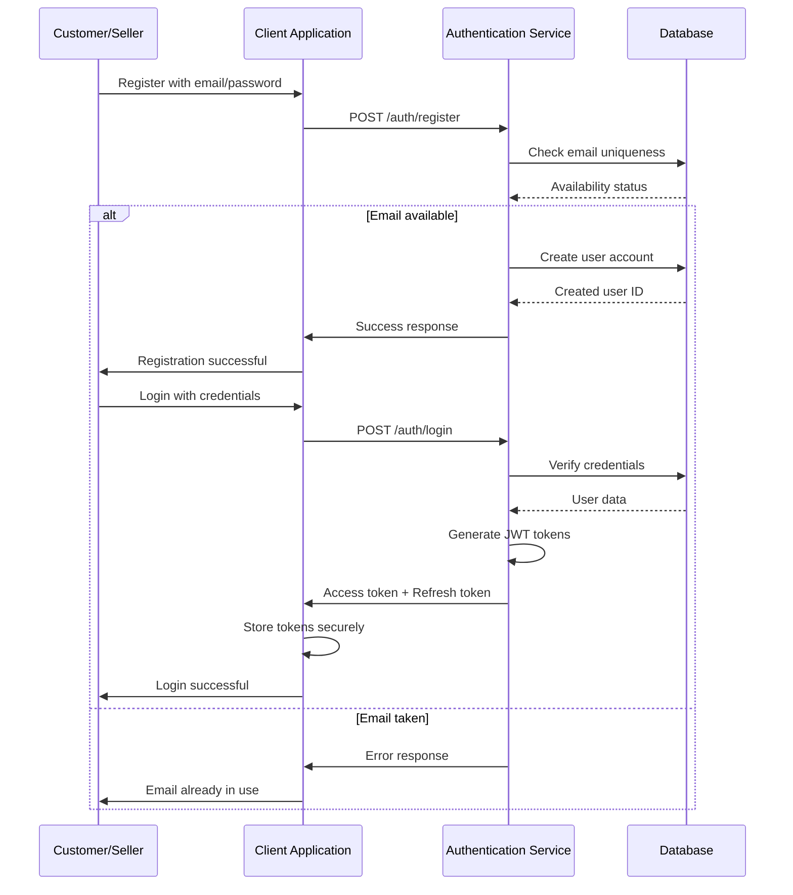
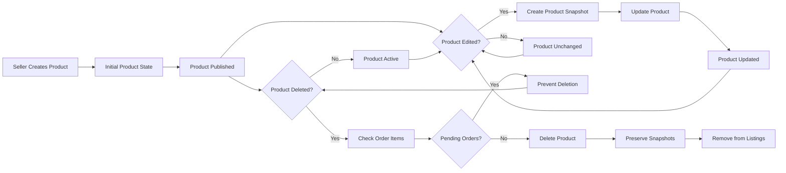
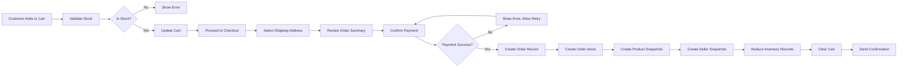
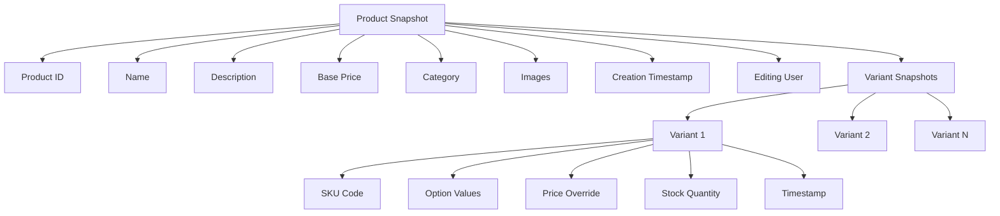
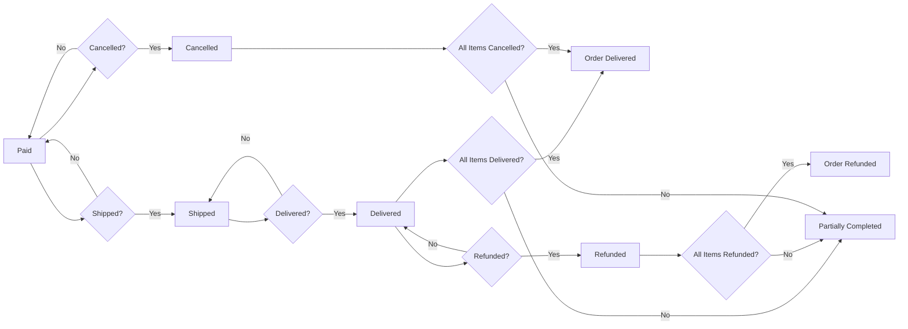
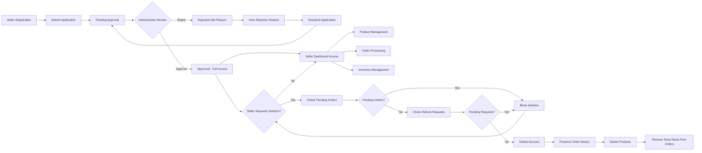

# E-Commerce Shopping Mall Platform Requirements Specification

## Executive Summary

### Business Context

This e-commerce shopping mall platform serves as a comprehensive marketplace connecting customers, sellers, and administrators in a digital commerce environment. The platform addresses the growing demand for robust online retail infrastructure that supports diverse product catalogs, secure transactions, and efficient order management.

### Platform Vision

The platform enables:
- **For Customers**: A unified shopping experience with diverse product selection, secure transactions, and comprehensive order tracking
- **For Sellers**: Professional storefronts with inventory management, order processing, and customer engagement tools
- **For Administrators**: Platform oversight capabilities for governance, dispute resolution, and policy enforcement

### Market Differentiation

Key differentiators include:
- **Immutable Snapshots**: Complete audit trail for all critical data modifications supporting dispute resolution
- **Seller Empowerment**: Non-technical sellers can manage complex inventories without development resources
- **Advanced Search**: Multi-criteria search with real-time filtering and intelligent sorting
- **Flexible Fulfillment**: Seller-controlled shipping with comprehensive tracking integration

### Success Metrics

- **Customer Acquisition**: 50,000+ registered customers in year one
- **Seller Base**: 500+ active sellers with regular product updates
- **Transaction Volume**: $10M+ in annual gross merchandise value
- **Platform Health**: 99.9% uptime, <2 second page load times
- **Customer Satisfaction**: 85%+ positive review rate

## User Actors and Authentication Requirements

### Actor Hierarchy

The platform supports four distinct user actor types with clearly defined permissions and capabilities:

1. **Customer**: Primary shoppers who browse products, make purchases, and engage with sellers through reviews
2. **Seller**: Business users who create products, manage inventory, and process customer orders
3. **Administrator**: Platform managers who oversee operations, approve sellers, and handle policy violations
4. **Super Administrator**: System owners with ultimate control over platform configuration and user management

### Authentication Flow

### Token Management

The authentication system uses JSON Web Tokens (JWT) for stateless session management:
- **Access Token**: 30-minute lifetime for API requests
- **Refresh Token**: 7-day lifetime for session continuation
- **Payload Structure**: Includes user ID, role, permissions array, and expiration timestamp
- **Storage Strategy**: HTTP-only cookies for production security
- **Revocation**: Users can invalidate all active sessions from any device

### Account Verification Requirements

**WHEN a user registers, THE system SHALL require email verification before full functionality.**

**WHILE an account is unverified, THE system SHALL limit functionality to email verification and account management.**

**IF a verification email expires, THEN THE system SHALL allow re-sending of verification requests.**

**WHEN an account is verified, THE system SHALL enable full platform access.**

## Account Management Requirements

### Customer Account Management

**WHEN a customer registers, THE system SHALL require email address and password with appropriate validation.**

**WHEN a customer attempts to log in, THE system SHALL authenticate credentials and create a new session.**

**WHEN a customer requests password change, THE system SHALL verify current password and update with encrypted new credentials.**

**WHEN a customer requests account deletion, THE system SHALL preserve order history for legal compliance while removing profile information.**

**WHEN a customer deletes their account, THEN THE system SHALL:**
- Delete the customer's profile information completely
- Preserve all order records associated with the customer
- Update all reviews to display "deleted user" instead of the customer's name
- Maintain audit trails for compliance and legal requirements

**WHILE a customer has active orders with status "paid" or "shipped", THE system SHALL prevent account deletion until all orders are completed or cancelled.**

### Customer Profile Management

**WHEN a customer accesses profile settings, THE system SHALL display current display name and phone number.**

**WHEN a customer updates their display name, THE system SHALL validate format and save the new value.**

**WHEN a customer updates their phone number, THE system SHALL validate format and save the new value.**

**IF a customer attempts to update with invalid format, THEN THE system SHALL show specific error message for each field.**

**WHEN profile changes are made, THE system SHALL create a profile snapshot preserving previous values.**

### Address Management

**WHEN a customer adds a new shipping address, THE system SHALL store: recipient name, phone number, street address, city, state/province, postal code, and country.**

**WHEN a customer edits an existing address, THE system SHALL update all specified fields.**

**WHEN a customer deletes an address, THE system SHALL remove the address record.**

**WHEN a customer sets an address as default, THE system SHALL update default flag for all addresses for that customer.**

**IF a customer attempts to use a deleted address during checkout, THEN THE system SHALL prevent checkout and show appropriate error.**

**IF a customer has no default address, THEN THE system SHALL require address selection during first checkout.**

### Seller Account Management

**WHEN a seller registers, THE system SHALL require email address, password, and initial shop information, but place the account in "pending" approval status.**

**WHEN a seller attempts to log in with pending approval status, THEN THE system SHALL deny access and show appropriate message with approval status.**

**WHEN an administrator approves a seller account, THE system SHALL change status to "approved" and allow full platform access.**

**WHEN an administrator rejects a seller registration, THE system SHALL store the rejection reason and allow resubmission.**

**WHEN a seller with rejected status attempts to log in, THEN THE system SHALL show rejection reason and provide option to resubmit application.**

**WHEN a seller requests account deletion, THE system SHALL verify no pending orders or requests exist before proceeding.**

**WHEN a seller account is deleted, THEN THE system SHALL:**
- Remove all products from active listings
- Preserve complete order history and product snapshots
- Maintain shop name and logo in historical order records
- Delete all unsold inventory records

**WHILE a seller has pending orders with status "paid" or "shipped", THE system SHALL prevent account deletion until resolution.**

**WHILE a seller has pending cancellation or refund requests, THE system SHALL prevent account deletion until resolution.**

### Seller Profile Management

**WHEN a seller accesses shop profile settings, THE system SHALL display current shop name, description, and logo.**

**WHEN a seller updates shop name, THE system SHALL create a snapshot of previous values.**

**WHEN a seller updates shop description, THE system SHALL create a snapshot of previous values.**

**WHEN a seller uploads a new logo image, THE system SHALL create a snapshot of previous logo reference.**

**WHEN a seller edits profile information, THEN THE system SHALL:**
- Create a complete profile snapshot recording all changed values
- Store timestamp, editor information, and before/after values
- Make snapshot available for dispute resolution
- Update current profile values for display

**WHEN a customer views a seller profile, THE system SHALL show current shop name, description, and logo.**

## Product Management Requirements

### Product Creation Workflow

**WHEN a seller creates a new product, THE system SHALL require: name, description, category selection, and base price.**

**WHEN a seller creates a product, THE system SHALL associate it with their seller account.**

**WHEN a seller edits an existing product, THE system SHALL create a complete product snapshot including all fields and images.**

**WHEN a seller attempts to delete a product, THE system SHALL verify no pending order items exist.**

**WHEN a seller deletes a product, THEN THE system SHALL:**
- Remove all variants associated with the product
- Delete all inventory records for those variants
- Update product search indexing to exclude the product
- Preserve product snapshots for historical reference
- Remove product from all customer wishlists

**WHEN a product is deleted, THEN ALL of the following shall occur:**
- Product no longer appears in search results
- Product no longer appears in category listings
- Product detail pages return 404 or appropriate error
- Existing order records retain product snapshots
- Wishlist entries for the product are automatically removed

### Product Variant Management

**WHEN a seller creates a product variant, THE system SHALL require: SKU code, option values, and stock quantity.**

**WHEN a seller updates a variant, THE system SHALL create a snapshot of all variant data including SKU, options, and price.**

**WHEN a seller attempts to delete a variant, THE system SHALL verify no pending order items exist.**

**WHEN a product has zero variants, THEN THE system SHALL:**
- Display product as "unavailable" in search and listings
- Allow product to remain visible but not purchasable
- Show appropriate message to customers attempting purchase

**WHEN a product has at least one variant, THEN THE system SHALL:**
- Allow product to be added to cart
- Enable variant selection during purchase
- Display stock availability per variant
- Calculate pricing based on variant-specific or base price

### Product Image Management

**WHEN a seller uploads product images, THE system SHALL store multiple image references per product.**

**WHEN a seller reorders product images, THE system SHALL update display order for all images.**

**WHEN a seller deletes an image, THE system SHALL remove the image reference and update product snapshots accordingly.**

**IF a product has no images, THEN THE system SHALL:**
- Display placeholder image during product listings
- Show appropriate error during product detail view
- Allow product to remain searchable but not displayed prominently

### Inventory Tracking and Management

**WHEN an order is placed, THE system SHALL create negative inventory records for purchased variants.**

**WHEN an order is cancelled or refunded, THE system SHALL create positive inventory records restoring stock.**

**WHEN stock reaches zero for a variant, THEN THE system SHALL:**
- Display "out of stock" status for that variant
- Prevent variant from being added to cart
- Show appropriate message to customers attempting purchase

**WHEN a seller views inventory history, THE system SHALL display all recorded changes with timestamps, quantities, and reasons.**

**WHILE viewing inventory history, THEN THE system SHALL:**
- Show chronological list of all changes
- Display running balance for current stock calculation
- Include reason codes for each transaction
- Show operator information for audit purposes

## Order Processing Requirements

### Cart Management

**WHEN a customer adds a variant to cart, THE system SHALL ensure they select a specific variant.**

**WHEN a customer specifies quantity during add-to-cart, THE system SHALL validate against available stock.**

**WHEN the same variant already exists in cart, THEN THE system SHALL:**
- Combine quantities rather than creating duplicate entries
- Update cart subtotal for that variant line
- Show updated cart total price

**WHEN a customer views cart, THE system SHALL display:**
- Product name, variant options, price, quantity, and subtotal
- Total cart price
- Stock availability warning if applicable
- Unavailable item indicators

**WHEN cart quantity exceeds available stock, THEN THE system SHALL:**
- Display warning message for that item
- Prevent checkout until quantity is adjusted
- Show current available stock quantity

**WHEN a variant is deleted or becomes out of stock, THEN THE system SHALL:**
- Mark item as unavailable in cart
- Display appropriate message
- Allow customer to remove item from cart
- Prevent checkout of unavailable items

### Checkout Process

**WHEN a customer proceeds to checkout, THE system SHALL validate all items are available for purchase.**

**WHEN checkout is initiated, THE system SHALL require shipping address selection.**

**WHEN a customer reviews order summary, THE system SHALL show:**
- List of items with prices
- Shipping address
- Total price

**WHEN a customer confirms order, THE system SHALL proceed to payment processing.**

**WHEN payment fails, THEN THE system SHALL NOT create order record and allow retry.**

**WHEN payment succeeds, THEN THE system SHALL create order record.**

### Order Creation

**WHEN an order is placed successfully, THEN THE system SHALL:**
- Create inventory records reducing stock for each purchased variant
- Remove items from the customer's cart
- Create order record with current shipping address
- Generate order items from cart variants
- Create product snapshots preserving state at time of purchase
- Create seller profile snapshots at time of purchase

**WHEN an order item is created, THE system SHALL:**
- Capture product name, description, variant options
- Store price at time of purchase
- Save current seller shop name and logo reference
- Set initial status to "paid"
- Link to associated product and seller snapshots

### Order Structure and Status

**WHEN an order has multiple items from different sellers, THEN THE system SHALL:**
- Group items by seller for shipment processing
- Maintain individual item status for each order item
- Allow cancellation and refund at item level only

**IF all order items have status "paid", THEN THE system SHALL set overall order status to "paid".**

**IF any item has status "shipped" and none are "delivered", THEN THE system SHALL set overall order status to "shipped".**

**IF all items have status "delivered", THEN THE system SHALL set overall order status to "delivered".**

**IF all items have status "cancelled", THEN THE system SHALL set overall order status to "cancelled".**

**IF all items have status "refunded", THEN THE system SHALL set overall order status to "refunded".**

**IF items have mixed statuses (e.g., some delivered, some refunded), THEN THE system SHALL set overall order status to "partially completed".**

### Shipping and Tracking

**WHEN a shipment is created, THE system SHALL associate it with one or more order items from the same seller.**

**WHEN a seller enters tracking information, THE system SHALL store carrier name and tracking number for the shipment.**

**WHEN a shipment is created, THEN ALL of the following shall occur:**
- All items in the shipment change status to "shipped"
- Tracking information becomes visible to customers
- Delivery countdown begins for automatic delivery confirmation

**WHEN a customer confirms delivery, THEN THE system SHALL:**
- Change all items in that shipment to status "delivered"
- Update order status if all items are now delivered
- Enable review functionality for those items

**WHEN 14 days have passed since shipping without customer confirmation, THEN THE system SHALL:**
- Automatically change all items in shipment to "delivered"
- Update order status accordingly
- Enable review functionality

### Order Cancellation Process

**WHEN a customer requests cancellation for a "paid" item, THE system SHALL create a cancellation request with reason.**

**WHEN a seller responds to a cancellation request, THEN THE system SHALL:**
- Create snapshot of request state at time of response
- Change item status to "cancelled" if approved
- Restore stock quantities if approved
- Keep item status unchanged if rejected

**WHEN an item is cancelled, THEN THE system SHALL:**
- Create positive inventory record restoring stock
- Update order status if all items are cancelled
- Show cancellation confirmation to customer

**IF all items in an order are cancelled, THEN THE system SHALL set overall order status to "cancelled".**

### Refund Process

**WHEN a customer requests refund for a "delivered" item within 7 days, THE system SHALL create a refund request with reason.**

**WHEN a seller responds to a refund request, THEN THE system SHALL:**
- Create snapshot of request state at time of response
- Process refund if approved
- Restore stock quantities if approved
- Keep item status unchanged if rejected

**WHEN an item is refunded, THEN THE system SHALL:**
- Create positive inventory record restoring stock
- Update order status if all items are refunded
- Show refund confirmation to customer

**IF all items in an order are refunded, THEN THE system SHALL set overall order status to "refunded".**

**IF any item is refunded but others remain active, THEN THE system SHALL set overall order status to "partially completed".**

## Review System Requirements

**WHEN a customer writes a review for a product, THE system SHALL require rating (1-5 stars).**

**WHEN a customer writes a review, THE system SHALL associate it with a specific order item that has status "delivered".**

**WHEN a customer writes a review, THEN THE system SHALL:**
- Allow optional text content
- Store rating and text content
- Timestamp the review creation
- Link to the purchased product

**WHEN a customer edits their review, THE system SHALL create a snapshot of the previous review state.**

**WHEN a customer deletes their review, THE system SHALL:**
- Remove review from product's review list
- Preserve review snapshot for audit purposes
- Recalculate product's average rating excluding deleted review

**WHEN a product's average rating is calculated, THEN THE system SHALL:**
- Include only non-deleted reviews
- Calculate arithmetic mean of all ratings
- Store average for display purposes
- Update product detail pages automatically

**WHEN reviews are displayed on product page, THE system SHALL:**
- Show reviews sorted by newest first
- Display rating, text content, and timestamp
- Show reviewer information (or "deleted user" if anonymized)
- Display average rating and total count

## Business Rules and Validation

### Account Validation Rules

**WHEN a customer registers, THE system SHALL validate email format and uniqueness.**

**WHEN a customer registers, THE system SHALL validate password strength requirements.**

**WHEN a seller registers, THE system SHALL validate email format and uniqueness.**

**WHEN a seller registers, THE system SHALL validate password strength requirements.**

**IF email format is invalid, THEN THE system SHALL show specific error message.**

**IF email already exists, THEN THE system SHALL show specific error message.**

**IF password does not meet requirements, THEN THE system SHALL show specific error message.**

### Product Validation Rules

**WHEN a product is created, THE system SHALL require name field.**

**WHEN a product is created, THE system SHALL require description field.**

**WHEN a product is created, THE system SHALL require category selection.**

**WHEN a product is created, THE system SHALL require base price field.**

**WHEN a product is created, THE system SHALL associate it with seller account.**

**WHEN a product is edited, THE system SHALL validate all required fields remain present.**

**IF a product has no variants, THEN THE system SHALL display as "unavailable".**

**IF a product has variants but none are in stock, THEN THE system SHALL display as "out of stock".**

### Inventory Validation Rules

**WHEN inventory is added, THE system SHALL validate quantity is positive.**

**WHEN inventory is subtracted, THE system SHALL validate reason field.**

**WHEN inventory reaches zero, THE system SHALL update variant status.**

**WHEN inventory is adjusted, THE system SHALL create history record.**

**WHEN order placement requires inventory reduction, THEN THE system SHALL:**
- Verify sufficient stock exists
- Reduce stock by exact quantity
- Create inventory history record
- Fail transaction if insufficient stock

### Order Validation Rules

**WHEN an order is placed, THE system SHALL validate shipping address selection.**

**WHEN an order is placed, THE system SHALL validate all items are available.**

**WHEN payment fails, THEN THE system SHALL NOT create order record.**

**WHEN payment succeeds, THEN THE system SHALL:**
- Create order record with status "paid"
- Reduce inventory for purchased variants
- Remove items from cart
- Create order item records
- Create product and variant snapshots

**WHEN a customer has no default address, THEN THE system SHALL:**
- Require address selection before checkout
- Allow creating new address during checkout
- Show appropriate error if address unavailable

### Review Validation Rules

**WHEN a customer writes a review, THE system SHALL require rating between 1-5.**

**WHEN a customer writes a review, THE system SHALL require item status to be "delivered".**

**WHEN a customer writes a review, THE system SHALL allow optional text content.**

**WHEN a customer edits a review, THE system SHALL require existing review ownership.**

**IF a customer attempts to write multiple reviews for same item, THEN THE system SHALL prevent duplicate.**

### Snapshot Validation Rules

**WHEN any snapshot is created, THE system SHALL be immutable and non-deletable.**

**WHEN a snapshot is created, THE system SHALL include complete state at time of event.**

**WHEN a snapshot is accessed, THE system SHALL verify appropriate permissions.**

**WHEN a snapshot is used for dispute resolution, THEN THE system SHALL:**
- Show complete historical state
- Include all related snapshots
- Provide context for comparison
- Maintain chain of custody

## Snapshot and Audit System

### Snapshot Creation Triggers

**WHEN a product is edited, THE system SHALL create a complete product snapshot.**

**WHEN a variant is edited, THE system SHALL create a snapshot of that variant.**

**WHEN a seller profile is edited, THE system SHALL create a profile snapshot.**

**WHEN an order item is created, THE system SHALL create product and variant snapshots.**

**WHEN a review is edited, THE system SHALL create a review snapshot.**

**WHEN a cancellation request is updated, THE system SHALL create a request snapshot.**

**WHEN a refund request is updated, THE system SHALL create a request snapshot.**

### Snapshot Structure Requirements

**WHEN a product snapshot is created, THE system SHALL include:**
- Complete product data at time of snapshot
- All variant snapshots with their complete state
- Image references at time of snapshot
- Timestamp of snapshot creation
- User who performed the edit

**WHEN a variant snapshot is created, THE system SHALL include:**
- SKU code at time of snapshot
- Option values at time of snapshot
- Price at time of snapshot
- Timestamp of snapshot creation

**WHEN a seller profile snapshot is created, THE system SHALL include:**
- Shop name at time of snapshot
- Shop description at time of snapshot
- Logo reference at time of snapshot
- Timestamp of snapshot creation

**WHEN an order item snapshot is created, THE system SHALL include:**
- Product snapshot with all fields
- Variant snapshot with all fields
- Seller profile snapshot with shop information
- Price at time of purchase
- Timestamp of snapshot creation

**WHEN a review snapshot is created, THE system SHALL include:**
- Rating at time of snapshot
- Text content at time of snapshot
- Timestamp of snapshot creation
- User who performed the edit

### Snapshot Access and Usage

**WHEN an owner views their own snapshots, THE system SHALL provide access.**

**WHEN an administrator views any snapshot, THE system SHALL provide complete access.**

**WHEN a snapshot is created, THEN THE system SHALL:**
- Store snapshot in immutable storage
- Prevent deletion of any snapshot
- Enable retrieval by timestamp and user context
- Support dispute resolution needs

**WHILE viewing snapshots for dispute resolution, THEN THE system SHALL:**
- Show complete historical state of modified data
- Include timestamps and modifier information
- Enable comparison between versions
- Preserve chain of custody

## Seller Dashboard Requirements

**WHEN a seller accesses dashboard, THE system SHALL display summary statistics.**

**WHEN a seller views summary, THE system SHALL show:**
- Total number of active products
- Total number of order items for their products
- Number of pending cancellation requests
- Number of pending refund requests

**WHEN a seller views order items, THE system SHALL show list of items for their products.**

**WHEN a seller filters order items, THE system SHALL support filtering by status.**

**WHEN a seller processes shipments, THE system SHALL select items for each shipment.**

**WHEN a seller enters tracking information, THEN THE system SHALL create shipment records.**

## Administrator System Requirements

### Seller Approval Workflow

**WHEN a seller registration is pending, THE system SHALL require administrator action.**

**WHEN an administrator approves a seller, THE system SHALL set status to "approved".**

**WHEN an administrator rejects a seller, THE system SHALL require rejection reason.**

**WHEN a seller is rejected, THEN THE system SHALL:**
- Store rejection reason in seller record
- Allow seller to view reason
- Enable resubmission of new application
- Keep previous application data for reference

### Seller Suspension

**WHEN an administrator suspends a seller, THE system SHALL hide all their products.**

**WHEN a seller is suspended, THEN THE system SHALL:**
- Hide products from search and category listings
- Block new purchases of their products
- Allow processing of existing orders (shipping, responses)
- Prevent product creation and editing

**WHEN an administrator unsuspends a seller, THE system SHALL restore product visibility.**

### Category Management

**WHEN an administrator creates a category, THE system SHALL store name and description.**

**WHEN an administrator creates a subcategory, THE system SHALL link to parent category.**

**WHEN an administrator edits a category, THE system SHALL allow name and description updates.**

**WHEN an administrator deletes a category, THE system SHALL set products to "uncategorized".**

**IF a category has products, THEN THE system SHALL:**
- Require administrator to reassign or uncategorize products first
- Or automatically mark products as uncategorized
- Maintain category history for reference

### Product Oversight

**WHEN an administrator views all products, THE system SHALL display products from all sellers.**

**WHEN an administrator views a product snapshot, THE system SHALL show complete historical state.**

**WHEN an administrator deletes a product, THEN THE system SHALL:**
- Remove product from listings immediately
- Delete all variants and inventory records
- Preserve product snapshots for audit
- Remove from all customer wishlists
- Update order history snapshots

### Order Oversight

**WHEN an administrator views all orders, THE system SHALL display complete order data.**

**WHEN an administrator force-cancels an item, THE system SHALL:**
- Process refund to customer
- Restore stock quantities
- Update item and order status
- Create audit trail

**WHEN an administrator force-refunds an item, THE system SHALL:**
- Process refund to customer
- Restore stock quantities
- Update item and order status
- Create audit trail

### User Management

**WHEN an administrator views all customers, THE system SHALL display customer accounts.**

**WHEN an administrator bans a customer, THE system SHALL prevent login.**

**WHEN an administrator unbans a customer, THE system SHALL restore access.**

**WHEN an administrator views all sellers, THE system SHALL display seller accounts with status.**

**WHEN an administrator bans a seller, THE system SHALL:**
- Prevent login to seller account
- Maintain existing order processing capabilities
- Allow order fulfillment and dispute resolution

## Business Workflow Diagrams

### Product Lifecycle and Snapshot Management

### Order Processing and Inventory Flow

### Product Snapshot Structure

### Order Status Transition Flow

### Seller Account Lifecycle

## Complete User Actors and Permissions Matrix

### Customer Permissions

| Action | Customer | Seller | Admin | Super Admin |
|--------|----------|--------|-------|-------------|
| Register Account | ✅ | ❌ | ❌ | ❌ |
| Login/Logout | ✅ | ✅ | ✅ | ✅ |
| View Products | ✅ | ✅ | ✅ | ✅ |
| Search Products | ✅ | ✅ | ✅ | ✅ |
| Filter by Category | ✅ | ✅ | ✅ | ✅ |
| Filter by Price Range | ✅ | ✅ | ✅ | ✅ |
| Filter In-Stock Only | ✅ | ✅ | ✅ | ✅ |
| Sort Products | ✅ | ✅ | ✅ | ✅ |
| Add to Wishlist | ✅ | ❌ | ❌ | ❌ |
| Add to Cart | ✅ | ❌ | ❌ | ❌ |
| Edit Cart | ✅ | ❌ | ❌ | ❌ |
| Place Order | ✅ | ❌ | ❌ | ❌ |
| View Order History | ✅ | ❌ | ❌ | ❌ |
| Cancel Order Items | ✅ | ❌ | ❌ | ✅ |
| Request Refund | ✅ | ❌ | ❌ | ✅ |
| Write Reviews | ✅ | ❌ | ❌ | ❌ |
| Edit Own Reviews | ✅ | ❌ | ❌ | ❌ |
| View Seller Profiles | ✅ | ❌ | ❌ | ❌ |
| View Product Details | ✅ | ❌ | ❌ | ✅ |
| View Product Snapshots | ✅ | ❌ | ❌ | ✅ |

### Seller Permissions

| Action | Customer | Seller | Admin | Super Admin |
|--------|----------|--------|-------|-------------|
| Register Seller | ❌ | ✅ | ❌ | ❌ |
| Apply for Approval | ❌ | ✅ | ❌ | ❌ |
| Edit Shop Profile | ❌ | ✅ | ❌ | ❌ |
| Create Products | ❌ | ✅ | ❌ | ❌ |
| Edit Own Products | ❌ | ✅ | ❌ | ❌ |
| Delete Own Products | ❌ | ✅ | ❌ | ❌ |
| Add Product Images | ❌ | ✅ | ❌ | ❌ |
| Reorder Product Images | ❌ | ✅ | ❌ | ❌ |
| Create Variants | ❌ | ✅ | ❌ | ❌ |
| Edit Variants | ❌ | ✅ | ❌ | ❌ |
| Add Inventory | ❌ | ✅ | ❌ | ❌ |
| Adjust Inventory | ❌ | ✅ | ❌ | ❌ |
| View Inventory History | ❌ | ✅ | ❌ | ❌ |
| View Product Snapshots | ❌ | ✅ | ❌ | ❌ |
| View Own Order Items | ❌ | ✅ | ❌ | ❌ |
| Process Shipments | ❌ | ✅ | ❌ | ❌ |
| Handle Cancellation Requests | ❌ | ✅ | ❌ | ✅ |
| Handle Refund Requests | ❌ | ✅ | ❌ | ✅ |
| View Seller Dashboard | ❌ | ✅ | ❌ | ❌ |
| Suspend Own Account | ❌ | ✅ | ❌ | ❌ |

### Administrator Permissions

| Action | Customer | Seller | Admin | Super Admin |
|--------|----------|--------|-------|-------------|
| View All Products | ❌ | ❌ | ✅ | ✅ |
| View All Order Items | ❌ | ❌ | ✅ | ✅ |
| Approve Seller Registration | ❌ | ❌ | ✅ | ✅ |
| Reject Seller Registration | ❌ | ❌ | ✅ | ✅ |
| Suspend Seller Account | ❌ | ❌ | ✅ | ✅ |
| Unsuspend Seller Account | ❌ | ❌ | ✅ | ✅ |
| Manage Categories | ❌ | ❌ | ✅ | ✅ |
| Delete Any Product | ❌ | ❌ | ✅ | ✅ |
| View Any Product Snapshot | ❌ | ❌ | ✅ | ✅ |
| Force Cancel Order Items | ❌ | ❌ | ✅ | ✅ |
| Force Refund Order Items | ❌ | ❌ | ✅ | ✅ |
| View All Customers | ❌ | ❌ | ✅ | ✅ |
| Ban Customer Account | ❌ | ❌ | ✅ | ✅ |
| Unban Customer Account | ❌ | ❌ | ✅ | ✅ |
| View All Seller Accounts | ❌ | ❌ | ✅ | ✅ |
| Ban Seller Account | ❌ | ❌ | ✅ | ✅ |
| Promote Admin to Super | ❌ | ❌ | ❌ | ✅ |
| Demote Super to Admin | ❌ | ❌ | ❌ | ✅ |
| View All Snapshots | ❌ | ❌ | ✅ | ✅ |

### Super Administrator Permissions

| Action | Customer | Seller | Admin | Super Admin |
|--------|----------|--------|-------|-------------|
| Full System Access | ❌ | ❌ | ❌ | ✅ |
| Configure Platform Settings | ❌ | ❌ | ❌ | ✅ |
| Manage Admin Accounts | ❌ | ❌ | ❌ | ✅ |
| Override Any System Rules | ❌ | ❌ | ❌ | ✅ |
| Access All Data Without Restrictions | ❌ | ❌ | ❌ | ✅ |
| Audit All User Activities | ❌ | ❌ | ❌ | ✅ |
| View Complete Audit Logs | ❌ | ❌ | ❌ | ✅ |
| Export All Data | ❌ | ❌ | ❌ | ✅ |

## Error Handling Requirements

### Authentication Errors

**WHEN invalid credentials are submitted, THEN THE system SHALL:**
- Return appropriate error code
- Log security event
- Increment failed login counter
- Implement rate limiting after threshold

**WHEN account is locked due to failures, THEN THE system SHALL:**
- Block authentication attempts
- Show appropriate error message
- Provide unlock or reset instructions
- Log security event

**WHEN session expires, THEN THE system SHALL:**
- Return appropriate error code
- Redirect to login page
- Preserve navigation context for return
- Show appropriate error message

**WHEN authentication token is invalid, THEN THE system SHALL:**
- Return appropriate error code
- Clear invalid token
- Show appropriate error message

### Validation Errors

**WHEN form data is invalid, THEN THE system SHALL:**
- Return specific field errors
- Show descriptive validation messages
- Preserve form data where possible
- Highlight invalid fields

**WHEN business validation fails, THEN THE system SHALL:**
- Return specific error code
- Show descriptive business rule message
- Provide recovery path when possible
- Log error for debugging

**WHEN duplicate entry is detected, THEN THE system SHALL:**
- Return appropriate error code
- Show user-friendly message
- Suggest alternative action
- Preserve original record

### Business Logic Errors

**WHEN inventory is insufficient, THEN THE system SHALL:**
- Show current available quantity
- Suggest adjusted quantity or wait
- Allow user to remove item
- Update shopping cart display

**WHEN product is unavailable, THEN THE system SHALL:**
- Show appropriate message
- Allow removal from cart/wishlist
- Suggest similar available products
- Update displays automatically

**WHEN order cannot be cancelled, THEN THE system SHALL:**
- Show current order status
- Explain why cancellation isn't allowed
- Provide alternative options
- Link to return/refund process

**WHEN refund window has passed, THEN THE system SHALL:**
- Show current order status
- Explain refund policy
- Suggest customer service contact
- Provide escalation path

### System Errors

**WHEN database operation fails, THEN THE system SHALL:**
- Log complete error details
- Return appropriate error code
- Show user-friendly message
- Implement retry mechanism if appropriate

**WHEN external service fails, THEN THE system SHALL:**
- Log service error details
- Return appropriate error code
- Show user-friendly message
- Implement fallback procedures

**WHEN payment gateway fails, THEN THE system SHALL:**
- Log payment error details
- Return appropriate error code
- Show user-friendly message
- Allow payment retry with different method

### Recovery Processes

**WHEN error occurs during order placement, THEN THE system SHALL:**
- Roll back database transactions
- Preserve cart state
- Allow user to retry order
- Show appropriate error message

**WHEN error occurs during payment, THEN THE system SHALL:**
- Roll back any partial changes
- Preserve cart state
- Allow user to retry payment
- Show appropriate error message

**WHEN error occurs during checkout, THEN THE system SHALL:**
- Preserve cart and customer data
- Allow user to restart checkout
- Show appropriate error message
- Log error for investigation

## Performance Requirements

### Response Time Expectations

**WHEN a user performs common search, THEN THE system SHALL return results within 2 seconds.**

**WHEN a user views product listing, THEN THE system SHALL load page within 2 seconds.**

**WHEN a user views product detail page, THEN THE system SHALL load page within 3 seconds.**

**WHEN a user adds item to cart, THEN THE system SHALL complete within 1 second.**

**WHEN a user places order, THEN THE system SHALL complete within 5 seconds.**

**WHEN a user logs in, THEN THE system SHALL complete within 1 second.**

**WHEN a user accesses dashboard, THEN THE system SHALL load summary within 3 seconds.**

**WHEN a user views order history, THEN THE system SHALL load first page within 3 seconds.**

**WHEN a user views review section, THEN THE system SHALL load within 2 seconds.**

**WHEN a user uploads image, THEN THE system SHALL complete within 10 seconds for images under 5MB.**

**WHEN a user searches with filters, THEN THE system SHALL return results within 3 seconds.**

### Concurrency Requirements

**WHEN multiple users attempt to purchase same inventory, THEN THE system SHALL:**
- Prevent overselling through atomic operations
- Show appropriate error if stock insufficient
- Maintain data integrity under load
- Implement proper locking mechanisms

**WHEN inventory is updated simultaneously, THEN THE system SHALL:**
- Use optimistic locking for updates
- Show appropriate error if conflict detected
- Allow user to retry with current values
- Maintain inventory accuracy

**WHEN order creation occurs simultaneously, THEN THE system SHALL:**
- Process each order independently
- Maintain order sequence and integrity
- Handle payment processing concurrently
- Update inventory atomically

### Scalability Requirements

**WHEN platform scales to 100,000 products, THEN THE system SHALL:**
- Maintain search response times within requirements
- Support efficient category navigation
- Enable product filtering and sorting
- Handle concurrent user load

**WHEN platform scales to 10,000 active sellers, THEN THE system SHALL:**
- Maintain dashboard load times within requirements
- Support order processing capacity
- Enable efficient order assignment
- Handle seller dashboard load

**WHEN platform scales to 1,000,000 orders per month, THEN THE system SHALL:**
- Maintain order processing performance
- Support reporting and analytics
- Enable audit trail queries
- Handle payment processing volume

### Availability Requirements

**THE system SHALL achieve 99.9% uptime for core functionality.**

**THE system SHALL maintain order processing availability 99.9% of time.**

**THE system SHALL maintain product browsing availability 99.9% of time.**

**THE system SHALL maintain user authentication availability 99.9% of time.**

**WHEN planned maintenance occurs, THEN THE system SHALL:**
- Notify users in advance
- Schedule during low-traffic periods
- Minimize impact on active processes
- Provide status updates

### User Experience Requirements

**WHEN a user performs action, THEN THE system SHALL show immediate feedback.**

**WHEN an operation is in progress, THEN THE system SHALL show loading indicator.**

**WHEN an operation completes, THEN THE system SHALL show success confirmation.**

**WHEN an error occurs, THEN THE system SHALL show user-friendly message.**

**WHEN a user navigates, THEN THE system SHALL maintain context where appropriate.**

**WHEN a user returns after time away, THEN THE system SHALL:**
- Show login prompt if session expired
- Preserve shopping cart state
- Show appropriate welcome message
- Allow quick re-authentication

## Conclusion

This requirements specification document provides comprehensive business requirements for the e-commerce shopping mall platform. The document covers all functional areas including user management, product catalog, order processing, and administrative controls.

The platform implements a comprehensive marketplace solution with the following core business capabilities:

1. **User Management**: Complete account lifecycle with approval workflows for sellers and comprehensive user management for administrators
2. **Product Catalog**: Advanced product management with variants, inventory tracking, and snapshot preservation for historical accuracy
3. **Shopping Experience**: Complete customer journey from search and wishlist to cart and checkout with robust validation
4. **Order Processing**: Sophisticated order management with item-level cancellation, shipping tracking, and refund processing
5. **Seller Tools**: Professional seller dashboard with order processing, shipment management, and inventory control
6. **Review System**: Customer engagement through product reviews with star ratings and seller reputation tracking
7. **Administrative Control**: Comprehensive oversight with seller approval, category management, and dispute resolution capabilities
8. **Audit and Compliance**: Immutable snapshots for all critical data modifications supporting dispute resolution and legal requirements

The platform balances customer convenience with seller professionalism while maintaining administrative oversight for platform health and compliance.

**Next Steps for Development Team**:
1. Review all requirements and clarify any ambiguities
2. Design technical architecture to support these business requirements
3. Implement authentication system with JWT-based session management
4. Develop database schema supporting all business entities and relationships
5. Implement API endpoints following REST principles
6. Build frontend components for each user journey
7. Implement snapshot system for audit and compliance requirements
8. Build admin interface for platform management

The requirements document serves as the complete business specification for development implementation. Technical implementation details including API design, database schema, and frontend requirements are at the discretion of the development team.