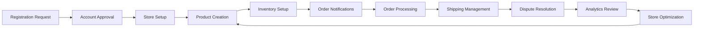
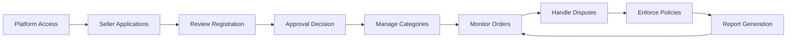

# E-Commerce Shopping Mall Platform

## Business Vision

### Why This Service Exists

The e-commerce shopping mall platform addresses the fundamental challenge faced by small-to-medium businesses in establishing a professional online presence. Traditional e-commerce solutions often require significant technical expertise, substantial upfront investment, and ongoing maintenance costs that price out many potential sellers.

This platform solves several critical market gaps:

1. **Accessibility**: Provides a turnkey e-commerce solution that requires no coding knowledge, enabling any business to launch an online store quickly
2. **Affordability**: Eliminates the need for expensive custom development by providing a comprehensive, pre-built platform
3. **Scalability**: Grows with businesses from single-product startups to multi-seller marketplaces
4. **Trust**: Built-in dispute resolution mechanisms and order history preservation protect both buyers and sellers
5. **Compliance**: Automatically handles legal requirements for order preservation and transaction records

The platform bridges the gap between complex enterprise e-commerce systems and simplistic single-seller solutions, creating a middle ground that serves diverse business needs.

## Market Position

### Competitive Differentiation

This shopping mall platform competes in a crowded e-commerce space but distinguishes itself through several key innovations:

| Feature | Standard Platforms | Our Platform |
|---------|-------------------|--------------|
| Multi-seller marketplace | Often limited | Core functionality |
| No-code implementation | Requires technical skills | Fully automated |
| Price point | Enterprise pricing | Accessible pricing |
| Seller control | Moderate | High autonomy |
| Dispute resolution | Reactive | Proactive tracking |

### Target Market Segments

1. **Small Businesses**: Local retailers, artisans, and specialty product sellers
2. **Startups**: Emerging brands looking to establish online presence quickly
3. **Entrepreneurs**: Individuals testing product concepts without large investments
4. **Specialty Markets**: Niche products requiring specialized category organization

### Revenue Strategy

The platform implements a sustainable multi-tiered revenue model:

1. **Transaction Fees**: Small percentage of each successful sale
2. **Premium Seller Plans**: Enhanced features, analytics, and priority support
3. **Category Management Services**: Specialized categorization and promotion
4. **Value-Added Services**: Advanced inventory management, shipping integrations
5. **Enterprise Solutions**: Custom integrations and dedicated support for large sellers

## User Base

### Primary Actors

The platform serves three distinct user categories, each with unique needs and capabilities:

#### 1. Customer (Buyer)

Customers represent the core revenue source for all sellers on the platform. They seek:

- Easy product discovery and browsing
- Secure and varied payment options
- Reliable shipping and delivery tracking
- Fair dispute resolution processes
- Comprehensive product information and reviews
- Personalized shopping experiences

Customers do not differentiate between sellers' stores - they experience the platform as a unified shopping destination. Their primary goals are to find desired products, compare options, complete purchases securely, and resolve any post-purchase issues efficiently.

#### 2. Seller

Sellers are the content providers who populate the marketplace with products. They need:

- Tools to create and manage product listings
- Inventory tracking and management capabilities
- Order processing and fulfillment workflows
- Customer communication channels
- Performance analytics and insights
- Flexible pricing and promotion tools

Sellers operate with significant autonomy while adhering to platform standards. They manage their storefronts, process orders, handle customer inquiries, and maintain inventory levels.

#### 3. Administrator

Administrators ensure the platform operates fairly and efficiently. Their responsibilities include:

- Seller registration approval and management
- Category structure maintenance
- Dispute resolution when parties cannot reach agreement
- Policy enforcement and violation handling
- System monitoring and performance optimization

Administrators act as the platform's governance layer, ensuring trust and reliability for all participants.

### User Journey Mapping

#### Customer Journey

#### Seller Journey

#### Administrator Journey

## Core Features

### Customer Experience Features

#### Account Management

Customers create accounts using email and password credentials. The account system provides:

- Secure registration with email verification
- Password recovery and management
- Account deletion with data preservation
- Profile management including display name and phone number
- Multiple shipping address management with default designation

#### Product Discovery

The platform enables comprehensive product discovery through:

- Category browsing with hierarchical subcategories
- Advanced search with filtering by price, category, and stock status
- Sorting options including newest, price low-to-high, and price high-to-low
- Paginated results for efficient navigation
- Product previews showing main images, descriptions, and pricing

#### Shopping Process

The complete shopping experience includes:

- Wishlist management for saving favorite products
- Shopping cart with multiple product variants
- Real-time inventory visibility
- Price calculations with automatic adjustments
- Checkout flow with address selection
- Payment processing integration
- Order confirmation and tracking

#### Post-Purchase Experience

After purchase, customers can:

- Track shipment status and tracking numbers
- Confirm delivery completion
- Request cancellations for unshipped items
- Request refunds within 7 days of delivery
- Write and edit product reviews
- View complete purchase history
- Manage wishlist and cart across sessions

### Seller Features

#### Store Management

Sellers maintain full control over their storefront:

- Shop name and description configuration
- Logo management with version history
- Shop profile customization
- Business information display
- Approval status visibility

#### Product Catalog

Comprehensive product management capabilities:

- Product creation with name, description, and category
- Multiple image uploads with reorder capability
- Base price configuration
- Category and subcategory selection
- Product deletion with pending order validation

#### Inventory Control

Advanced inventory management features:

- Stock quantity tracking
- Inventory history with change reasons
- Restocking and adjustment recording
- Automatic stock reduction on orders
- Stock restoration on cancellations/refunds
- Out-of-stock indication for customers

#### Variant Management

Flexible product variant system:

- Multiple variant creation per product
- SKU code management
- Option value specification (e.g., color, size)
- Individual variant pricing
- Stock per variant tracking
- Variant deletion with order validation

#### Order Processing

Complete order management system:

- Order notification system
- Order item status tracking
- Individual item shipping management
- Tracking information entry
- Shipment grouping control
- Cancellation request response
- Refund request handling

### Administrator Features

#### Seller Management

Administrators ensure platform quality through:

- Seller registration review and approval
- Rejection reason documentation
- Approval status visibility
- Account suspension capabilities
- Product visibility management
- Account unsuspension

#### Category Oversight

Category structure management:

- Category creation with subcategory support
- Category name and description editing
- Category deletion with product reassignment
- Category hierarchy maintenance
- Category browsing by customers

#### Product and Order Oversight

Platform-wide monitoring capabilities:

- Product viewing and snapshot preservation
- Product deletion for violations
- Order viewing across all users
- Order cancellation authority
- Order refund authority

#### User Management

Customer and seller account oversight:

- Customer account viewing
- Customer banning capabilities
- Seller account viewing
- Seller banning capabilities
- Account status monitoring

## Business Model

### Value Proposition

This shopping mall platform delivers unique value through several interconnected mechanisms:

#### For Customers

1. **One-Stop Shopping**: Access to diverse products from multiple sellers in one location
2. **Quality Assurance**: Platform-moderated seller approval process
3. **Consumer Protection**: Dispute resolution and refund mechanisms
4. **Price Transparency**: Easy comparison across sellers and products
5. **Convenience**: Streamlined checkout and tracking processes

#### For Sellers

1. **Market Access**: Immediate access to established customer base
2. **Low Barrier to Entry**: No technical expertise or large startup costs
3. **Scalable Infrastructure**: Platform grows with business needs
4. **Inventory Management**: Built-in stock tracking and management
5. **Customer Tools**: Built-in review and wishlist systems

#### For Platform

1. **Transaction Volume**: Revenue from successful sales
2. **Scale Economies**: Costs decrease as user base grows
3. **Network Effects**: More sellers attract more customers and vice versa
4. **Data Insights**: Aggregate insights for platform improvement
5. **Partnership Opportunities**: Integration potential with payment and shipping providers

### Revenue Streams

The platform implements a multi-tiered revenue strategy:

| Stream | Description | Target Implementation | Percentage/Amount |
|--------|-------------|----------------------|-------------------|
| Transaction Fee | Percentage of successful sale | Year 1 | 5-10% |
| Premium Seller Plan | Enhanced features and visibility | Year 1, Q4 | $29-99/month |
| Category Promotion | Featured placement in categories | Year 2 | $100-500/month |
| Shipping Integration | Priority shipping rates | Year 2 | Margin share |
| Enterprise Solutions | Custom integrations and support | Year 3 | Custom pricing |

### Cost Structure

#### Fixed Costs

- Platform development and maintenance
- Server infrastructure and scaling
- Payment processing integration
- Customer support systems
- Legal compliance and documentation

#### Variable Costs

- Transaction processing fees
- Customer support scaling
- Marketing and acquisition costs
- Seller onboarding resources
- Compliance and audit services

### Growth Strategy

#### Phase 1: Platform Foundation (0-6 months)

1. Launch minimum viable platform with core features
2. Recruit initial seller base (50-100 sellers)
3. Establish payment and shipping integrations
4. Implement basic compliance and security measures
5. Develop customer acquisition channels

#### Phase 2: Seller Growth (6-18 months)

1. Expand seller base to 500+ merchants
2. Introduce premium seller features
3. Enhance category management capabilities
4. Implement advanced analytics for sellers
5. Establish customer loyalty programs

#### Phase 3: Platform Maturity (18-36 months)

1. Expand into specialized categories
2. Introduce cross-platform marketing
3. Develop API for enterprise integrations
4. Implement international shipping
5. Launch private label or marketplace-only products

### Risk Mitigation

#### Compliance Risks

- Regular legal review of policies and terms
- Payment card industry compliance
- Data protection regulations
- Consumer protection laws

#### Operational Risks

- System redundancy and backup protocols
- Payment gateway diversification
- Customer support team scaling
- Dispute resolution escalation paths

#### Market Risks

- Continuous customer feedback integration
- Competitive landscape monitoring
- Economic sensitivity analysis
- Seller and customer churn prevention

## Success Metrics

### Customer Acquisition Metrics

| Metric | Target (Year 1) | Target (Year 2) | Measurement Frequency |
|--------|----------------|-----------------|----------------------|
| Registered Customers | 10,000 | 50,000 | Weekly |
| Daily Active Users | 2,000 | 10,000 | Daily |
| Conversion Rate | 2.5% | 3.5% | Monthly |
| Customer Retention (30-day) | 35% | 45% | Monthly |
| Customer Retention (90-day) | 20% | 30% | Quarterly |

### Seller Metrics

| Metric | Target (Year 1) | Target (Year 2) | Measurement Frequency |
|--------|----------------|-----------------|----------------------|
| Registered Sellers | 100 | 500 | Monthly |
| Active Sellers (monthly sales) | 80 | 300 | Monthly |
| Product Listings | 5,000 | 50,000 | Monthly |
| Seller Satisfaction Score | 4.0/5.0 | 4.5/5.0 | Quarterly |
| Seller Retention Rate | 80% | 85% | Quarterly |

### Platform Performance Metrics

| Metric | Target (Year 1) | Target (Year 2) | Measurement Frequency |
|--------|----------------|-----------------|----------------------|
| Average Order Value | $50 | $65 | Weekly |
| Order Completion Rate | 85% | 90% | Weekly |
| Page Load Time | <2 seconds | <1.5 seconds | Daily |
| Payment Success Rate | 95% | 98% | Daily |
| Customer Support Response Time | <24 hours | <12 hours | Weekly |

### Financial Metrics

| Metric | Target (Year 1) | Target (Year 2) | Measurement Frequency |
|--------|----------------|-----------------|----------------------|
| Gross Merchandise Value | $1M | $10M | Monthly |
| Platform Revenue | $50K | $500K | Monthly |
| Customer Acquisition Cost | $15 | $20 | Monthly |
| Lifetime Customer Value | $150 | $250 | Quarterly |
| Contribution Margin | 25% | 35% | Quarterly |

### Quality and Trust Metrics

| Metric | Target (Year 1) | Target (Year 2) | Measurement Frequency |
|--------|----------------|-----------------|----------------------|
| Seller Approval Rate | 70% | 80% | Monthly |
| Review Response Time | <72 hours | <48 hours | Weekly |
| Dispute Resolution Rate | 85% | 90% | Monthly |
| Product Return Rate | 8% | 6% | Monthly |
| Customer Satisfaction Score | 4.0/5.0 | 4.5/5.0 | Quarterly |

## Future Vision

### Short-Term Enhancements (0-12 months)

1. **Enhanced Analytics**: Seller-specific performance dashboards
2. **Mobile Experience**: Dedicated mobile app for customers
3. **Loyalty Program**: Points and rewards system
4. **Social Sharing**: Integration with social media platforms
5. **Advanced Search**: AI-powered product recommendations

### Medium-Term Development (1-2 years)

1. **International Expansion**: Multi-currency and language support
2. **Subscription Models**: Subscription-based shopping experience
3. **Sustainability Features**: Eco-friendly product categorization
4. **Community Features**: Seller-customer engagement tools
5. **Advanced Fulfillment**: Integration with multiple shipping providers

### Long-Term Vision (2-5 years)

1. **Platform Ecosystem**: Third-party app integration marketplace
2. **AI-Driven Operations**: Automated inventory management and pricing
3. **Blockchain Integration**: Transparent transaction tracking
4. **Global Marketplace**: International seller and customer support
5. **Vertical Specialization**: Industry-specific marketplace variations

This shopping mall platform aims to transform how businesses and consumers interact in the digital marketplace by providing an accessible, scalable, and trustworthy environment for e-commerce success.