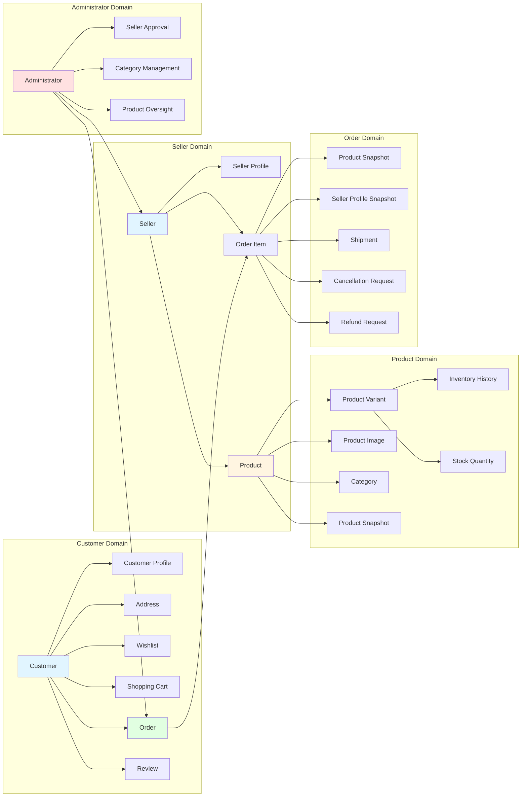

# Functional Requirements Document

## Executive Summary

This document defines the comprehensive functional requirements for the Shopping Mall e-commerce platform. The system must support complete end-to-end operations including customer account management, seller operations, product management, order processing, payments, shipping, reviews, and administrative oversight.

The platform operates on a strict foundation of trust and transparency, with all financial transactions requiring immutable snapshots to preserve historical data for legal and dispute resolution purposes. Every data modification must create an auditable trail of previous states.

## Customer Account Management

### Account Registration and Authentication

**WHEN** a guest visits the platform,
**THE** system **SHALL** require authentication before accessing any feature, denying guest browsing.

**WHEN** a guest wants to create a customer account,
**THE** system **SHALL** provide a registration form requiring email and password.

**WHEN** a guest submits registration information,
**THE** system **SHALL** validate the email format, password strength, and uniqueness, then create the account.

**WHEN** account creation succeeds,
**THE** system **SHALL** prompt the user to log in with their credentials.

**WHEN** a registered customer returns to the platform,
**THE** system **SHALL** provide a login form accepting email and password.

**WHEN** a customer submits login credentials,
**THE** system **SHALL** validate them against stored credentials and authenticate if valid.

**WHEN** authentication fails,
**THE** system **SHALL** return an error with a user-friendly message indicating invalid credentials.

**WHEN** a customer requests to change their password,
**THE** system **SHALL** require current password verification before accepting a new password.

**WHEN** password change succeeds,
**THE** system **SHALL** confirm the change and require re-authentication with the new password.

**WHEN** a customer wants to delete their account,
**THE** system **SHALL** prompt for confirmation and validate that the account can be deleted.

**WHEN** account deletion completes,
**THE** system **SHALL** preserve order history and order snapshots (for seller records and legal compliance),
**THE** system **SHALL** preserve reviews with "deleted user" placeholder (not deleting review content),
**THE** system **SHALL** delete the customer's profile information,
**THE** system **SHALL** delete all associated addresses,
**THE** system **SHALL** delete the customer's wishlists and cart items,
**THE** system **SHALL** terminate all active sessions.

### Profile Management

**WHEN** a customer registers,
**THE** system **SHALL** allow the customer to provide optional profile information including display name and phone number.

**WHEN** a customer wants to update their profile,
**THE** system **SHALL** allow editing of display name and phone number.

**WHEN** profile information is submitted for update,
**THE** system **SHALL** validate the phone number format and update the record.

**WHEN** profile update succeeds,
**THE** system **SHALL** confirm the changes and display updated information.

### Address Management

**WHEN** a customer wants to add a shipping address,
**THE** system **SHALL** provide a form requiring recipient name, phone number, street address, city, state/province, postal code, and country.

**WHEN** an address is added successfully,
**THE** system **SHALL** save the address to the customer's account.

**WHEN** a customer has addresses,
**THE** system **SHALL** display a list of all addresses with editing and deletion options.

**WHEN** a customer selects an address for editing,
**THE** system **SHALL** display the current values and allow modification of all fields.

**WHEN** address editing completes,
**THE** system **SHALL** save the updated address information.

**WHEN** a customer selects an address for deletion,
**THE** system **SHALL** prompt for confirmation and delete the address if confirmed.

**WHEN** a customer sets an address as default shipping,
**THE** system **SHALL** mark that address as default and clear the default from any other address.

**WHEN** the system needs a default shipping address,
**THE** system **SHALL** use the address marked as default, or the first address if no default exists.

## Seller Account Management

### Account Registration and Authentication

**WHEN** a guest wants to create a seller account,
**THE** system **SHALL** provide a registration form requiring email and password.

**WHEN** a guest submits seller registration information,
**THE** system **SHALL** validate the information and create a pending seller account.

**WHEN** seller registration succeeds,
**THE** system **SHALL** display the account approval status (pending, approved, or rejected).

**WHEN** an account status is pending or approved,
**THE** system **SHALL** allow the seller to log in.

**WHEN** a seller logs in,
**THE** system **SHALL** check account approval status.

**IF** account status is rejected,
**THEN** the system **SHALL** display the rejection reason and allow the seller to submit a new registration request.

**WHEN** a seller requests to change their password,
**THE** system **SHALL** require current password verification before accepting a new password.

**WHEN** password change succeeds,
**THE** system **SHALL** confirm the change and require re-authentication with the new password.

**WHEN** a seller wants to delete their account,
**THE** system **SHALL** validate that:
- No pending orders exist with status "paid" or "shipped",
- No pending cancellation or refund requests exist.

**IF** account deletion validation passes,
**THEN** the system **SHALL** delete the seller's account.

**WHEN** account deletion completes,
**THE** system **SHALL** preserve all order history and order snapshots (for legal compliance),
**THE** system **SHALL** preserve the shop name in past orders (for historical accuracy),
**THE** system **SHALL** delete the seller's products from active listings,
**THE** system **SHALL** delete the seller's profile information,
**THE** system **SHALL** terminate all active sessions.

### Seller Profile Management

**WHEN** a seller registers,
**THE** system **SHALL** allow the seller to provide shop name, shop description, and logo image.

**WHEN** a seller wants to edit their profile,
**THE** system **SHALL** allow editing of shop name, shop description, and logo image.

**WHEN** profile editing completes,
**THE** system **SHALL** create a snapshot preserving the previous profile state,
**THE** system **SHALL** update the profile with new values.

**WHEN** a customer views a seller's profile,
**THE** system **SHALL** display the current shop name, description, and logo.

## Product Management

### Product Creation

**WHEN** an approved seller wants to create a product,
**THE** system **SHALL** provide a form requiring product name, description, category, and base price.

**WHEN** a product is created,
**THE** system **SHALL** assign the product to the creating seller.

**WHEN** a product is created,
**THE** system **SHALL** create at least one variant (SKU) with SKU code, option values, price, and stock quantity.

**WHEN** product creation completes,
**THE** system **SHALL** display the new product in the seller's product list.

### Product Editing

**WHEN** a seller wants to edit their product,
**THE** system **SHALL** allow editing of name, description, category, base price, and images.

**WHEN** product editing completes,
**THE** system **SHALL** create a product snapshot preserving all previous values including variants and their options,
**THE** system **SHALL** update the product with new values.

**WHEN** a seller views product snapshots,
**THE** system **SHALL** display a history of all changes with timestamps and value comparisons.

**WHEN** a seller wants to delete their product,
**THE** system **SHALL** validate that:
- No order items exist for any variant with status "paid" or "shipped",
- No pending cancellation or refund requests exist for any variant.

**IF** product deletion validation passes,
**THEN** the system **SHALL** delete the product and all its variants and inventory records.

**WHEN** a product is deleted,
**THE** system **SHOULD** remove it from search results and category listings,
**THE** system **SHOULD** preserve all snapshots of the product and its variants for historical records.

**WHEN** an administrator deletes a product,
**THE** system **SHALL** apply the same deletion rules as seller deletion,
**THE** system **SHOULD** preserve all snapshots and historical data.

### Product Images

**WHEN** a seller creates or edits a product,
**THE** system **SHALL** allow uploading multiple images.

**WHEN** images are uploaded,
**THE** system **SHALL** allow reordering (first image becomes the main/thumbnail).

**WHEN** a seller wants to delete an image,
**THE** system **SHALL** allow removal of the image.

**WHEN** image changes occur,
**THE** system **SHALL** include them in the product snapshot.

### Product Variants (SKU)

**WHEN** a seller creates a product,
**THE** system **SHALL** require at least one variant with SKU code, option values, price, and stock quantity.

**WHEN** a seller wants to add variants to a product,
**THE** system **SHALL** allow creating additional variants with the same option structure.

**WHEN** a seller wants to edit a variant,
**THE** system **SHALL** allow editing of SKU code, option values, and price.

**WHEN** variant editing completes,
**THE** system **SHALL** create a snapshot of the variant and include it in the product snapshot.

**WHEN** a seller wants to delete a variant,
**THE** system **SHALL** validate that:
- No order items exist for that variant with status "paid" or "shipped",
- No pending cancellation or refund requests exist for that variant.

**IF** variant deletion validation passes,
**THEN** the system **SHALL** delete the variant and its inventory records.

**WHEN** a product has no valid variants,
**THE** system **SHOULD** display the product as "unavailable" in search and listings.

### Category Management

**WHEN** a product is created or edited,
**THE** system **SHALL** require selection from available categories.

**WHEN** categories are listed,
**THE** system **SHOULD** display a two-level hierarchy (category → subcategory).

**WHEN** a customer browses categories,
**THE** system **SHOULD** display the complete category tree.

**WHEN** a customer selects a category,
**THE** system **SHOULD** display products in that category and subcategories.

## Inventory Management

### Stock Tracking

**WHEN** a product variant is created,
**THE** system **SHALL** initialize stock quantity to zero.

**WHEN** a customer adds a variant to their cart,
**THE** system **SHALL** check the current stock quantity.

**WHEN** stock quantity is less than the cart quantity,
**THE** system **SHOULD** display a warning to the customer.

**WHEN** stock reaches zero,
**THE** system **SHOULD** mark the variant as "out of stock".

**WHEN** a variant is out of stock,
**THE** system **SHOULD** prevent adding it to the cart.

**WHEN** a variant is out of stock,
**THE** system **SHOULD** mark it as unavailable in the cart if already present.

### Inventory History

**WHEN** stock changes (increase or decrease),
**THE** system **SHALL** create an inventory history record with:
- Quantity change (positive for restocking, negative for orders/adjustments)
- Change reason
- Timestamp

**WHEN** a seller wants to add inventory (restock),
**THE** system **SHALL** allow specifying quantity and reason.

**WHEN** restocking completes,
**THE** system **SHALL** create a positive inventory history record.

**WHEN** a seller wants to subtract inventory (adjustment/loss),
**THE** system **SHALL** allow specifying quantity and reason.

**WHEN** inventory adjustment completes,
**THE** system **SHALL** create a negative inventory history record.

**WHEN** an order is placed,
**THE** system **SHALL** create a negative inventory history record for each purchased variant.

**WHEN** an order is cancelled,
**THE** system **SHALL** create a positive inventory history record for each cancelled item.

**WHEN** a refund is processed,
**THE** system **SHALL** create a positive inventory history record for each refunded item.

**WHEN** a seller views inventory history,
**THE** system **SHOULD** display all records for the variant with timestamps and reasons.

## Shopping Cart

### Cart Management

**WHEN** a customer wants to add a variant to their cart,
**THE** system **SHALL** allow selecting a specific variant and specifying quantity.

**WHEN** the same variant is already in the cart,
**THE** system **SHALL** combine quantities instead of creating a separate line item.

**WHEN** a customer views their cart,
**THE** system **SHOULD** display each item with product name, variant options, price, quantity, and subtotal.

**WHEN** cart items are displayed,
**THE** system **SHOULD** show the total price of all items.

**WHEN** a customer wants to change cart quantity,
**THE** system **SHOULD** allow modifying the quantity for any item.

**WHEN** a customer wants to remove an item,
**THE** system **SHOULD** remove that item from the cart.

**WHEN** a variant's stock is insufficient,
**THE** system **SHOULD** display a warning in the cart.

**WHEN** a variant is deleted or out of stock,
**THE** system **SHOULD** mark the item as unavailable in the cart.

**WHEN** an unavailable item exists in the cart,
**THE** system **SHOULD** prevent checkout until the item is removed or addressed.

## Checkout and Order Processing

### Checkout Process

**WHEN** a customer proceeds to checkout from cart,
**THE** system **SHOULD** validate that no items are unavailable.

**IF** unavailable items exist,
**THEN** the system **SHOULD** prevent checkout and display error messages.

**WHEN** a customer proceeds with valid items,
**THE** system **SHOULD** allow selecting a shipping address (default or new).

**WHEN** a shipping address is selected,
**THE** system **SHOULD** display the order summary including:
- List of items with prices
- Selected shipping address
- Total price

**WHEN** a customer confirms the order,
**THE** system **SHOULD** process payment through the payment gateway.

### Payment Processing

**WHEN** payment is initiated,
**THE** system **SHOULD** initiate the payment process with the external payment gateway.

**WHEN** payment succeeds,
**THE** system **SHOULD** create the order record.

**WHEN** payment fails,
**THE** system **SHOULD** cancel the checkout process,
**THE** system **SHOULD** allow the customer to retry payment.

### Order Creation

**WHEN** payment succeeds and order is created,
**THE** system **SHALL** create order items for each purchased variant with quantity and status "paid".

**WHEN** order creation completes,
**THE** system **SHOULD** decrease stock quantities for each purchased variant.

**WHEN** stock decrease completes,
**THE** system **SHOULD** create negative inventory history records.

**WHEN** order creation completes,
**THE** system **SHOULD** remove cart items for that order.

**WHEN** order creation completes,
**THE** system **SHALL** create snapshots of each purchased product and variant (preserving product name, description, variant options, and price at purchase time).

**WHEN** order creation completes,
**THE** system **SHALL** create snapshots of each seller's profile (preserving shop name and logo at purchase time).

### Order Structure

**WHEN** an order is created,
**THE** system **SHOULD** group items by seller for shipping purposes.

**WHEN** an order contains multiple variants,
**THE** system **SHOULD** combine identical variants into single order items with quantity.

**WHEN** order items come from different sellers,
**THE** system **SHOULD** create separate shipments for each seller.

**WHEN** an order item is created,
**THE** system **SHOULD** assign initial status "paid".

### Order History

**WHEN** a customer wants to view their order history,
**THE** system **SHOULD** display a list of all orders, paginated and sorted by newest first.

**WHEN** order history is displayed,
**THE** system **SHOULD** show each order with order number, date, total price, and overall status.

**WHEN** a customer selects an order for details,
**THE** system **SHOULD** display the full order information including:
- List of items with product name, variant, quantity, price, and item status
- Shipping address
- List of shipments with tracking information

### Order Status Management

**WHEN** an order item status changes,
**THE** system **SHOULD** update the overall order status based on its items.

**IF** all items have status "paid",
**THEN** the order status is "paid".

**IF** any item has status "shipped" and no items are delivered,
**THEN** the order status is "shipped".

**IF** all items have status "delivered",
**THEN** the order status is "delivered".

**IF** all items have status "cancelled",
**THEN** the order status is "cancelled".

**IF** all items have status "refunded",
**THEN** the order status is "refunded".

**IF** items have mixed statuses (e.g., some delivered, some refunded),
**THEN** the order status is "partially completed".

### Order Cancellation

**WHEN** a customer wants to cancel an item,
**THE** system **SHOULD** allow requesting cancellation for items with status "paid".

**WHEN** a cancellation request is created,
**THE** system **SHOULD** store the cancellation request with a reason (text).

**WHEN** a seller receives a cancellation request,
**THE** system **SHOULD** allow the seller to approve or reject the request.

**WHEN** a seller responds to a cancellation request,
**THE** system **SHOULD** create a snapshot of the request state.

**IF** cancellation is approved,
**THEN** the item status changes to "cancelled",
**THEN** stock quantities are restored via inventory history,
**THEN** the item's refund is processed.

**WHEN** remaining items in an order continue processing normally,
**THE** system **SHOULD** allow the order to proceed without the cancelled item.

**WHEN** all items in an order are cancelled,
**THE** system **SHOULD** change the overall order status to "cancelled".

### Refund Requests

**WHEN** a customer wants to request a refund,
**THE** system **SHOULD** allow requesting refund for items with status "delivered".

**WHEN** a refund request is created,
**THE** system **SHOULD** require a reason (text) and verify it's within 7 days of delivery.

**WHEN** a seller receives a refund request,
**THE** system **SHOULD** allow the seller to approve or reject the request.

**WHEN** a seller responds to a refund request,
**THE** system **SHOULD** create a snapshot of the request state.

**IF** refund is approved,
**THEN** the item status changes to "refunded",
**THEN** stock quantities are restored via inventory history,
**THEN** the customer's payment is refunded.

**WHEN** remaining items in an order are unaffected,
**THE** system **SHOULD** allow the order to continue for non-refunded items.

**WHEN** all items in an order are refunded,
**THE** system **SHOULD** change the overall order status to "refunded".

## Shipping and Tracking

### Shipment Management

**WHEN** a seller needs to ship items,
**THE** system **SHOULD** allow selecting one or more of their items to include in a shipment.

**WHEN** a shipment is created,
**THE** system **SHOULD** assign all items in it to status "shipped".

**WHEN** a shipment is created,
**THE** system **SHOULD** record carrier name and tracking number.

**WHEN** a customer wants to view shipment information,
**THE** system **SHOULD** display tracking information for each shipment.

**WHEN** a customer wants to confirm delivery,
**THE** system **SHOULD** allow confirming delivery per shipment.

**WHEN** delivery is confirmed,
**THE** system **SHOULD** change all items in that shipment to status "delivered".

**WHEN** a shipment has not been confirmed after 14 days,
**THE** system **SHOULD** automatically change all items in that shipment to status "delivered".

## Review System

### Review Creation and Management

**WHEN** a customer wants to write a review,
**THE** system **SHOULD** allow writing a review only after an item's status is "delivered".

**WHEN** a review is created,
**THE** system **SHOULD** require rating (1 to 5 stars) and allow optional text content.

**WHEN** a customer writes a review,
**THE** system **SHOULD** limit to one review per product per order.

**WHEN** reviews are displayed,
**THE** system **SHOULD** show all reviews sorted by newest first.

**WHEN** a customer wants to edit their review,
**THE** system **SHOULD** allow editing rating and text content.

**WHEN** a review is edited,
**THE** system **SHOULD** create a snapshot of the previous state.

**WHEN** a customer wants to delete their review,
**THE** system **SHOULD** delete the review (but preserve the snapshot).

**WHEN** a product's average rating is calculated,
**THE** system **SHOULD** use only non-deleted reviews.

## Wishlist Management

### Wishlist Operations

**WHEN** a customer wants to add a product to their wishlist,
**THE** system **SHOULD** allow adding the product (not specific variant).

**WHEN** a customer wants to view their wishlist,
**THE** system **SHOULD** display products in their wishlist, paginated.

**WHEN** a customer wants to remove a product,
**THE** system **SHOULD** remove it from the wishlist.

**WHEN** a product is deleted by the seller,
**THE** system **SHOULD** automatically remove it from all wishlists.

## Search and Filtering

### Product Search

**WHEN** a customer wants to search products,
**THE** system **SHOULD** allow searching by product name.

**WHEN** search results are displayed,
**THE** system **SHOULD** show products from all sellers.

**WHEN** search results are paginated,
**THE** system **SHOULD** support pagination with default page size.

**WHEN** a customer wants to filter search results,
**THE** system **SHOULD** allow filtering by:
- Category
- Price range (minimum and maximum)
- In-stock only (filter to variants with stock > 0)

**WHEN** a customer wants to sort search results,
**THE** system **SHOULD** allow sorting by:
- Newest first (by product creation date)
- Price (low to high)
- Price (high to low)

### Product Listing Display

**WHEN** products are listed (search results, category pages),
**THE** system **SHOULD** show each product with:
- Main image (thumbnail)
- Product name
- Base price or price range (if variants have different prices)
- Seller shop name
- Average rating (if reviews exist)

### Product Detail Page

**WHEN** a customer views a product detail page,
**THE** system **SHOULD** show:
- All product images (ordered with main image first)
- Product name and description
- Category path
- Seller shop name (linked to seller profile)
- All available variants with prices and stock status
- Average rating and total review count
- All reviews with ratings and text content

## Administrator System

### Seller Management

**WHEN** administrators want to view pending seller approvals,
**THE** system **SHOULD** display a list of pending seller registration requests.

**WHEN** an administrator reviews a pending seller,
**THE** system **SHOULD** allow approving or rejecting the registration.

**WHEN** a seller is rejected,
**THE** system **SHOULD** require the administrator to provide a rejection reason.

**WHEN** a seller is suspended,
**THE** system **SHOULD** hide their products from search and category listings,
**THE** system **SHOULD** prevent purchasing of their products,
**THE** system **SHOULD** allow the seller to process existing orders (ship items, respond to cancellation/refund requests),
**THE** system **SHOULD** prevent creation of new products and editing of existing products.

**WHEN** a seller is unsuspended,
**THE** system **SHOULD** make their products visible again.

### Category Management

**WHEN** administrators want to create categories,
**THE** system **SHOULD** allow creating categories and subcategories.

**WHEN** administrators want to edit categories,
**THE** system **SHOULD** allow editing category names and descriptions.

**WHEN** administrators want to delete a category,
**THE** system **SHOULD** delete the category and make products in it uncategorized.

### Product Oversight

**WHEN** administrators want to view all products,
**THE** system **SHOULD** display all products on the platform.

**WHEN** administrators want to view product snapshots,
**THE** system **SHOULD** allow viewing snapshots of any product.

**WHEN** administrators want to delete a product,
**THE** system **SHOULD** allow forced deletion for policy violations.

### Order Oversight

**WHEN** administrators want to view all orders,
**THE** system **SHOULD** display all orders on the platform.

**WHEN** administrators want to force-cancel items,
**THE** system **SHOULD** allow force-cancelling individual items or entire orders.

**WHEN** force-cancel completes,
**THE** system **SHOULD** process refunds for cancelled items and restore stock.

**WHEN** administrators want to force-refund items,
**THE** system **SHOULD** allow force-refunding individual items or entire orders.

**WHEN** force-refund completes,
**THE** system **SHOULD** restore stock for refunded items.

### User Management

**WHEN** administrators want to view customer accounts,
**THE** system **SHOULD** display all customer accounts.

**WHEN** administrators want to ban a customer,
**THE** system **SHOULD** prevent the customer from logging in.

**WHEN** administrators want to unban a customer,
**THE** system **SHOULD** restore the customer's login capability.

**WHEN** administrators want to view seller accounts,
**THE** system **SHOULD** display all seller accounts.

**WHEN** administrators want to ban a seller,
**THE** system **SHOULD** prevent the seller from logging in.

**WHEN** a seller is banned,
**THE** system **SHOULD** preserve existing orders and processing capabilities.

## Snapshot Principle

### Data Preservation

**WHEN** any editable data is modified,
**THE** system **SHALL** create a snapshot preserving the previous state.

**WHEN** a snapshot is created,
**THE** system **SHALL** record:
- Timestamp of when the change was made
- What was changed (field names)
- Values before the change
- Values after the change

**WHEN** snapshots are created,
**THE** system **SHALL** make them immutable and non-deletable.

**WHEN** relevant parties want to view snapshots,
**THE** system **SHOULD** allow viewing of snapshots for dispute resolution.

### Product Snapshots

**WHEN** a product is edited,
**THE** system **SHALL** create a product snapshot including all product fields (name, description, category, base price, images).

**WHEN** product variants are included in the snapshot,
**THE** system **SHALL** create product-snapshot-to-product-snapshot-SKU relationships.

**WHEN** product deletion occurs,
**THE** system **SHOULD** preserve all product snapshots.

**WHEN** administrators view product snapshots,
**THE** system **SHOULD** allow viewing snapshots of any product.

### Seller Profile Snapshots

**WHEN** a seller's profile is edited,
**THE** system **SHALL** create a profile snapshot.

**WHEN** order items reference sellers,
**THE** system **SHOULD** store snapshots of seller profiles at purchase time.

### Order Item Snapshots

**WHEN** order items are created,
**THE** system **SHALL** include snapshots of:
- Product and variant at time of purchase
- Seller profile at time of purchase

### Review Snapshots

**WHEN** a review is edited,
**THE** system **SHOULD** create a review snapshot.

### Cancellation and Refund Snapshots

**WHEN** cancellation or refund requests are updated,
**THE** system **SHOULD** create snapshots of the request state.

## Business Rules and Constraints

### Account Deletion Constraints

**WHEN** a customer requests account deletion,
**THE** system **SHOULD** preserve order history and reviews but delete profile information.

**WHEN** a seller requests account deletion,
**THE** system **SHOULD** validate that no orders exist with status "paid" or "shipped",
**THE** system **SHOULD** validate that no pending cancellation or refund requests exist.

**IF** seller deletion validation fails,
**THEN** the system **SHOULD** prevent account deletion and display the reason.

### Product and Variant Deletion Constraints

**WHEN** a seller or administrator wants to delete a product,
**THE** system **SHOULD** validate that no order items exist for any variant with status "paid" or "shipped".

**WHEN** a seller or administrator wants to delete a variant,
**THE** system **SHOULD** validate that no order items exist for that variant with status "paid" or "shipped".

**WHEN** a seller or administrator wants to delete a product or variant,
**THE** system **SHOULD** validate that no pending cancellation or refund requests exist for any variant.

**IF** product/variant deletion validation fails,
**THEN** the system **SHOULD** prevent deletion and display the reason.

### Shipping and Payment Dependencies

**WHEN** stock quantities are modified,
**THE** system **SHOULD** only decrease for paid or shipped order items.

**WHEN** stock quantities are restored,
**THE** system **SHOULD** increase for cancelled or refunded order items.

**WHEN** a shipment is created,
**THE** system **SHOULD** change all items in it to status "shipped".

**WHEN** a customer confirms delivery or 14 days pass,
**THE** system **SHOULD** change all items in the shipment to status "delivered".

## Business Entity Relationships

## Functional Requirements Summary

This functional requirements document has been created to serve as a comprehensive specification for the Shopping Mall e-commerce platform. The requirements cover:

1. **Customer Account Management**: Complete customer lifecycle including registration, profile management, address management, and account deletion with appropriate data preservation.

2. **Seller Account Management**: Seller registration with approval workflow, profile management with snapshots, and account deletion constraints.

3. **Product Management**: Product creation with variants, editing with snapshots, deletion constraints based on order status, and image management.

4. **Inventory Management**: Stock tracking, inventory history for all stock changes, and restocking/adjustment workflows.

5. **Shopping Cart and Checkout**: Cart management, validation, checkout process with address selection, and order creation.

6. **Order Processing**: Complete order lifecycle including payment processing, order status management, and multi-item order handling.

7. **Payment Handling**: Payment gateway integration, success/failure handling, and refund processing.

8. **Shipping Management**: Shipment creation, tracking information, delivery confirmation, and automatic delivery status updates.

9. **Review System**: Review creation with time-based restrictions, editing with snapshots, deletion with preservation, and rating calculations.

10. **Wishlist Management**: Product wishlisting, pagination, and automatic removal on product deletion.

11. **Search and Filtering**: Comprehensive search with filtering by category, price range, and stock status, plus multiple sort options.

12. **Administrator System**: Complete administrative oversight including seller management, category management, product/order/user management with force-cancel and force-refund capabilities.

13. **Snapshot Principle**: Immutable data snapshots for all critical data modifications to support dispute resolution and legal compliance.

14. **Business Rules**: Critical constraints for account and product deletion based on order status and pending requests.

All requirements are written in EARS format for clarity and implementability, with specific conditions, triggers, and system responses clearly defined. The system must handle every business scenario comprehensively to support a production-ready e-commerce platform.

## Next Steps for Development

With these functional requirements established, the development team can proceed to:

1. Create database schema designs based on the entity relationships
2. Implement authentication and authorization around the defined user actors
3. Build the product management API endpoints following the CRUD requirements
4. Implement inventory tracking and snapshot preservation logic
5. Develop the order processing workflow with payment gateway integration
6. Build the shipping management system with tracking integration
7. Implement the review and rating system with snapshot capabilities
8. Build the administrator dashboard with oversight functions
9. Implement search and filtering functionality
10. Develop the complete testing strategy based on functional requirements

All development should reference this document for business logic clarification and requirement verification.