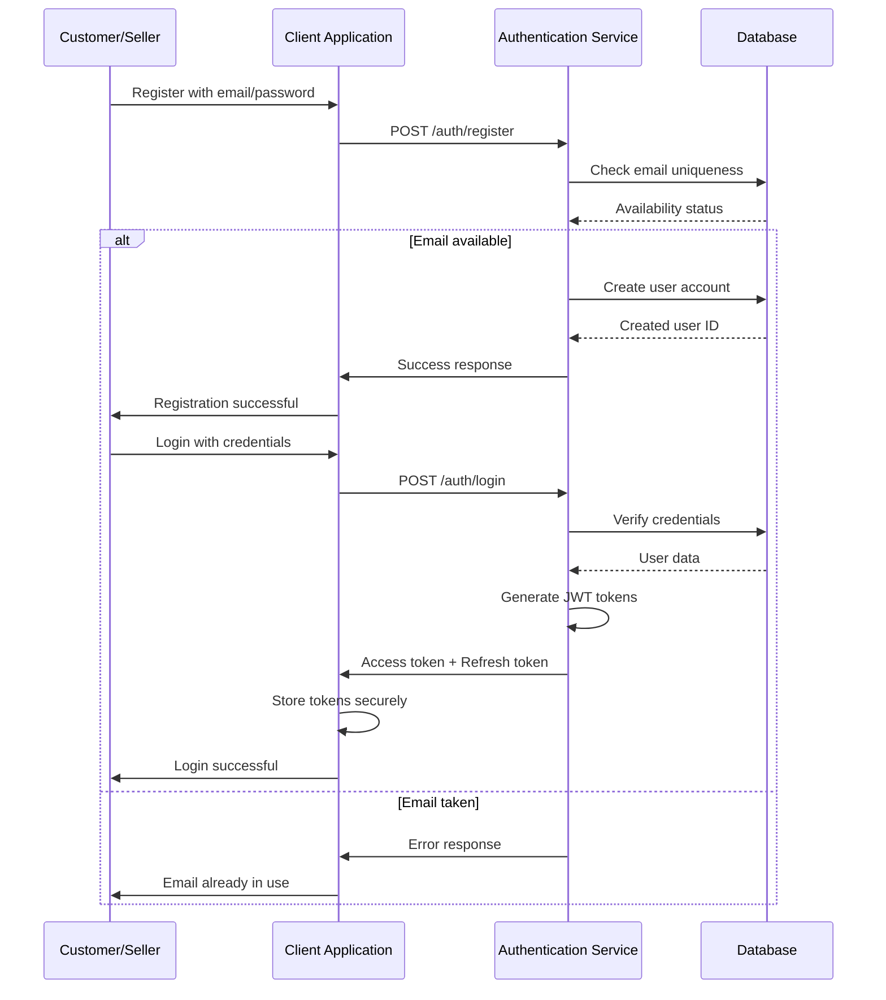

# E-Commerce Shopping Mall Platform

## User Actor Hierarchy and Authentication Requirements

### Actor Classification Overview

This e-commerce shopping mall platform implements a comprehensive user actor system designed to support multiple stakeholder types with clearly defined permissions and responsibilities. The actor hierarchy consists of four distinct user types, each with specific capabilities and restrictions.

### Actor Hierarchy Structure

```
┌─────────────────────────────────────────────────────────────┐
│                      Super Admin                            │
│  (Ultimate system control and policy enforcement)           │
└─────────────────────────────────────────────────────────────┘
                            │
                            ▼
┌─────────────────────────────────────────────────────────────┐
│                        Admin                                │
│  (Platform oversight, user management, content moderation)  │
└─────────────────────────────────────────────────────────────┘
                            │
                            ▼
┌─────────────────────────────────────────────────────────────┐
│       ┌─────────────────┐         ┌───────────────────┐     │
│       │   Customer      │         │     Seller        │     │
│       │ (Buyers)        │         │ (Business Users)  │     │
│       └─────────────────┘         └───────────────────┘     │
│                        │                  │                  │
└────────────────────────┼──────────────────┼─────────────────┘
                         │                  │
                         └──────────────────┘
                              (Shared features)
```

## User Actor Definitions

### Customer Actor

Customers are individuals who purchase products from the platform. They have full access to browsing, purchasing, and personal account management features.

#### Registration Requirements

- WHEN a visitor wants to use the platform, THE system SHALL require them to register an account
- WHEN a visitor signs up, THE system SHALL collect email address and password
- WHEN registration is submitted, THE system SHALL validate email format and password strength
- THE system SHALL NOT allow duplicate email addresses for customer accounts
- THE system SHALL send a verification email to new customers
- WHILE account is unverified, THE system SHALL limit functionality to registration verification only

#### Login and Session Management

- WHEN a registered customer attempts to access the platform, THE system SHALL prompt for email and password
- WHEN login credentials are submitted, THE system SHALL validate against stored records
- IF credentials are invalid, THEN THE system SHALL return appropriate error message
- IF credentials are valid, THEN THE system SHALL establish authenticated session
- WHILE authenticated, THE system SHALL maintain session state securely

#### Password Management

- WHEN a customer wants to change their password, THE system SHALL require current password verification
- WHEN new password is submitted, THE system SHALL validate password strength requirements
- IF password change is successful, THEN THE system SHALL update credentials and notify customer
- WHEN a customer forgets password, THE system SHALL provide password reset flow
- WHEN password reset request is submitted, THE system SHALL send verification link to registered email
- IF reset link is used, THEN THE system SHALL allow password reconfiguration

#### Account Deletion

- WHEN a customer requests account deletion, THE system SHALL preserve order history for legal compliance
- WHEN account deletion is processed, THE system SHALL remove profile information completely
- IF customer has placed orders, THEN THE system SHALL replace customer name with "deleted user" in reviews
- IF customer has active orders (paid, shipped), THEN THE system SHALL block deletion until orders complete
- WHILE account is being deleted, THE system SHALL log deletion request and timestamp

#### Profile Management

- WHEN customer account is created, THE system SHALL initialize empty profile with default values
- THE system SHALL store display name and phone number as core profile fields
- WHILE profile is incomplete, THE system SHALL prompt customer to complete during first login
- WHEN customer wants to update profile information, THE system SHALL allow modification of display name
- WHEN display name is changed, THE system SHALL validate against profanity and length constraints
- WHEN phone number is changed, THE system SHALL validate format and existence
- IF profile update is successful, THEN THE system SHALL update stored profile data

#### Address Management

- WHEN a customer adds shipping address, THE system SHALL require all mandatory fields
- THE system SHALL collect recipient name, phone number, street address, city, state/province, postal code, and country
- WHEN address is submitted, THE system SHALL validate address format and completeness
- THE system SHALL allow customers to add multiple shipping addresses
- IF maximum address limit is reached, THEN THE system SHALL prevent additional address creation
- WHEN a customer wants to modify an address, THE system SHALL allow changes to any address field
- WHEN address is edited, THE system SHALL record snapshot of previous address state

#### Wishlist Management

- WHEN a customer views a product, THE system SHALL provide option to add to wishlist
- WHEN product is added to wishlist, THE system SHALL record product reference and timestamp
- THE system SHALL allow customers to maintain multiple items in their wishlist
- IF wishlist exceeds storage limit, THEN THE system SHALL prompt customer to manage contents
- WHEN customer removes item from wishlist, THE system SHALL delete product reference immediately

#### Shopping Cart Requirements

- WHEN customer adds product variant to cart, THE system SHALL validate variant availability
- WHEN variant is added, THE system SHALL record product details, variant options, quantity, and price
- IF same variant already exists in cart, THEN THE system SHALL merge quantities instead of creating duplicate entries
- WHEN cart quantity exceeds available stock, THEN THE system SHALL warn customer and limit quantity
- THE system SHALL maintain cart state during session until checkout or explicit clearance

### Seller Actor

Sellers are business users who create products, manage inventory, and interact with customers through the platform.

#### Registration and Approval Process

- WHEN a prospective seller submits a registration request, THE system SHALL collect the following information: email address, password, shop name, shop description, and logo image
- WHEN a seller completes registration submission, THE system SHALL create an account with status "pending" and require administrator approval
- WHILE a seller account has status "pending", THE system SHALL prevent the seller from accessing seller features including product creation and order management
- WHEN an administrator reviews a pending seller application, THE system SHALL allow the administrator to either approve or reject the application
- IF an application is rejected, THEN THE system SHALL require the administrator to provide a rejection reason
- IF a seller receives a rejection notification, THEN THE system SHALL allow the seller to submit a new registration request with updated information
- WHEN a seller submits a new registration request after rejection, THE system SHALL create a new application with status "pending"
- WHEN an administrator approves a seller application, THE system SHALL update the account status to "approved" and notify the seller via email

#### Account Status Types

- THE system SHALL support the following seller account statuses:
  - "pending": Registration submitted, awaiting administrator review
  - "approved": Application approved, seller can access all features
  - "rejected": Application rejected, seller cannot sell but can reapply
  - "suspended": Account temporarily disabled by administrator

#### Account Deletion Requirements

- A seller can only delete their account if all of the following conditions are met:
  - No pending orders with status "paid" or "shipped"
  - No pending cancellation requests
  - No pending refund requests
- WHEN a seller attempts to delete their account, THE system SHALL validate all conditions above and ONLY proceed if all conditions are satisfied
- IF conditions are not met, THEN THE system SHALL return specific error information about which conditions remain unmet
- WHEN a seller account is deleted, THE system SHALL preserve historical data for legal and business continuity requirements

#### Shop Profile Management

- WHEN a seller creates their profile, THE system SHALL require a shop name and store the created timestamp
- WHEN a seller updates their profile information, THE system SHALL create a profile snapshot preserving the previous state
- WHEN a seller modifies any profile attribute, THE system SHALL create a profile snapshot that includes timestamp, previous values, new values, user ID, and timestamp of change

#### Product Management

- WHEN a seller creates a new product, THE system SHALL require product name, description, category, and base price
- WHEN a product is created, THE system SHALL associate it with the creating seller and set initial status to "active"
- WHEN a product is created, THE system SHALL create the first product snapshot preserving initial values
- WHEN a seller edits an existing product, THE system SHALL allow modification of product name, description, category, base price, product images, and product variants
- WHEN any product attribute is modified, THE system SHALL create a product snapshot that preserves the previous state of all product attributes

#### Inventory Management

- EACH product variant maintains an inventory count that changes through specific events
- THE system SHALL maintain an immutable inventory history for each variant containing timestamp, quantity change, reason for change, related entity ID, and user ID
- THE system SHALL calculate current stock by summing all inventory history records for a variant
- WHEN inventory history is empty, THE system SHALL treat current stock as 0
- WHEN a customer adds a variant to their cart, THE system SHALL check if current stock is greater than or equal to requested quantity

#### Seller Dashboard

- WHEN a seller accesses their dashboard, THE system SHALL display total number of active products, total number of order items, number of pending cancellation requests, number of pending refund requests, summary of recent sales activity, and recent order notifications

### Admin Actor

Administrators are platform managers responsible for overseeing operations, user management, and content moderation.

#### Admin Access Requirements

- WHEN a user submits a request to become an administrator, THE system SHALL require the request to include a reason
- WHEN a super administrator reviews a pending admin request, THE system SHALL allow approval or rejection
- WHEN approved, THE system SHALL update the user to have regular administrator permissions

#### Admin Management Capabilities

- WHEN an administrator accesses admin features, THE system SHALL allow seller approval management, category management, product oversight, order oversight, and user management
- WHEN an administrator views pending seller applications, THE system SHALL allow approval or rejection of registrations
- WHEN rejecting seller applications, THE system SHALL require the administrator to provide a reason
- WHEN a seller is suspended, THE system SHALL hide seller products from search and category listings
- WHEN a seller is suspended, THE system SHALL prevent new product creation and editing
- WHEN a seller is suspended, THE system SHALL allow existing order processing (ship items, respond to requests)
- WHEN an administrator unsuspends a seller, THE system SHALL restore seller visibility and product creation capabilities

#### Category Management

- WHEN an administrator creates categories, THE system SHALL allow creation of top-level categories and subcategories
- WHEN an administrator edits category information, THE system SHALL allow updates to category names and descriptions
- WHEN an administrator deletes a category, THE system SHALL mark products in that category as uncategorized

#### Product Oversight

- WHEN an administrator views products, THE system SHALL allow viewing all products on the platform
- WHEN an administrator views product snapshots, THE system SHALL grant access to view complete snapshot data
- WHEN an administrator deletes a product, THE system SHALL remove it for policy violations

#### Order Oversight

- WHEN an administrator views orders, THE system SHALL allow viewing all orders on the platform
- WHEN an administrator force-cancels an item, THE system SHALL refund the customer and restore stock
- WHEN an administrator force-refunds an item, THE system SHALL process the refund transaction

#### User Management

- WHEN an administrator views customers, THE system SHALL allow viewing all customer accounts
- WHEN an administrator bans a customer, THE system SHALL prevent the customer from logging in
- WHEN an administrator unsuspends a customer, THE system SHALL restore customer login capability

#### Admin Permission Matrix

| Feature | Customer | Seller | Admin | Super Admin |
|---------|----------|--------|-------|-------------|
| Browse products | ✅ | ✅ | ✅ | ✅ |
| Search products | ✅ | ✅ | ✅ | ✅ |
| Add to wishlist | ✅ | ✅ | ✅ | ✅ |
| Add to cart | ✅ | ✅ | ✅ | ✅ |
| Place orders | ✅ | ❌ | ❌ | ❌ |
| View order history | ✅ | ❌ | ✅ | ✅ |
| Create products | ❌ | ✅ | ❌ | ❌ |
| Manage inventory | ❌ | ✅ | ❌ | ❌ |
| Review management | ❌ | ❌ | ✅ | ✅ |
| Approve sellers | ❌ | ❌ | ✅ | ✅ |
| Manage categories | ❌ | ❌ | ✅ | ✅ |
| Suspend accounts | ❌ | ❌ | ✅ | ✅ |
| Force cancel orders | ❌ | ❌ | ✅ | ✅ |
| View all data | ❌ | ❌ | ✅ | ✅ |
| Manage admin users | ❌ | ❌ | ❌ | ✅ |

### Super Admin Actor

Super administrators have ultimate system control and policy enforcement capabilities.

#### Super Admin Capabilities

- WHEN a super administrator accesses the system, THE system SHALL grant all admin capabilities plus additional privileges
- WHEN a super administrator promotes a regular admin, THE system SHALL allow promotion to super admin status
- WHEN a super administrator demotes another super admin, THE system SHALL allow demotion to regular admin status
- WHEN a super administrator attempts to demote themselves, THE system SHALL prevent the self-demotion action
- WHEN a super administrator views pending requests, THE system SHALL display all pending admin promotion requests
- WHEN a super administrator approves admin requests, THE system SHALL grant appropriate administrator permissions

#### Super Admin Exclusive Features

- USER MANAGEMENT: Complete user account control including banning/unbanning any user
- POLICY ENFORCEMENT: Override business rules when necessary for platform integrity
- DATA AUDIT: Complete access to all system data and logs for compliance purposes
- SYSTEM CONFIGURATION: Platform-wide settings and configuration management
- EMERGENCY RESPONSE: Immediate intervention capabilities for critical situations

## Authentication Requirements

### Authentication Flow



### Login and Session Management

- WHEN a user attempts to log in, THE system SHALL authenticate using email and password credentials
- IF authentication fails, THEN THE system SHALL return appropriate error without revealing whether email or password was incorrect
- WHEN a user successfully logs in, THE system SHALL create a session and grant access to appropriate features based on user role
- WHILE authenticated, THE system SHALL maintain session state securely using JWT tokens
- WHEN session expires, THE system SHALL require re-authentication or token refresh
- WHEN user logs out, THE system SHALL terminate the session and invalidate tokens

### Password Management Requirements

- WHEN a user wants to change their password, THE system SHALL require current password verification
- WHEN new password is submitted, THE system SHALL validate password strength requirements
- IF password change is successful, THEN THE system SHALL update credentials and notify user
- WHEN a user forgets password, THE system SHALL provide password reset flow
- WHEN password reset request is submitted, THE system SHALL send verification link to registered email
- IF reset link is used, THEN THE system SHALL allow password reconfiguration
- IF password reset link is expired, THEN THE system SHALL return error with recovery options

### Account Verification

- WHEN user account is created, THE system SHALL require email verification before full functionality
- IF verification email expires, THEN THE system SHALL allow re-sending of verification request
- WHILE account is unverified, THE system SHALL limit to email verification and account management functions only

## Business Rules

### Account Validation Rules

- WHEN customer account is created, THE system SHALL require email verification before full functionality
- IF login credentials are invalid, THEN THE system SHALL return appropriate error without revealing specific credentials
- IF password reset link is expired, THEN THE system SHALL return error with recovery options
- IF maximum login attempts exceeded, THEN THE system SHALL temporarily block account and require CAPTCHA

### Profile Validation Rules

- IF email format is invalid during registration, THEN THE system SHALL return error with format guidance
- IF phone number format is invalid, THEN THE system SHALL return error with example format
- IF display name violates content policy, THEN THE system SHALL return error with reason

### Seller Approval Rules

- WHEN seller registration is submitted, THE system SHALL require administrator approval before full access
- WHEN seller approval is pending, THE system SHALL prevent product creation and sales activities
- WHEN seller is rejected, THE system SHALL provide detailed rejection reason and allow reapplication
- WHEN seller is suspended, THE system SHALL hide products from public view but allow order processing

### Inventory Validation Rules

- WHILE customer adds items to cart, THE system SHALL verify variant stock quantity >= requested quantity
- WHEN customer completes purchase, THE system SHALL create negative inventory record for each purchased variant
- IF inventory validation fails during checkout, THEN THE system SHALL cancel the order and notify customer

### Order Validation Rules

- WHEN customer places order, THE system SHALL validate all cart items are available
- IF cart contains unavailable items, THEN THE system SHALL block checkout until items are removed
- WHEN order is placed, THE system SHALL update inventory and order status appropriately

## Error Handling Requirements

### Authentication Errors

| Error Code | Condition | User Message | Resolution Action |
|------------|-----------|--------------|-------------------|
| AUTH_INVALID_CREDENTIALS | Invalid login credentials | "Invalid email or password" | Verify credentials and retry |
| AUTH_UNVERIFIED_ACCOUNT | Unverified account | "Please verify your email address" | Check email for verification link |
| AUTH_EXPIRED_RESET_LINK | Expired password reset link | "Reset link has expired" | Request new password reset |
| AUTH_SESSION_EXPIRED | Expired session | "Session expired, please login again" | Re-authenticate to continue |

### Validation Errors

| Error Code | Condition | User Message | Resolution Action |
|------------|-----------|--------------|-------------------|
| PROFILE_INVALID_EMAIL | Invalid email format | "Please enter a valid email address" | Check email format |
| PROFILE_INVALID_PHONE | Invalid phone format | "Please enter a valid phone number" | Check phone format |
| PROFILE_INVALID_NAME | Invalid display name | "Display name contains invalid characters" | Use only allowed characters |
| ADDRESS_MISSING_FIELD | Missing address field | "Please fill in all address fields" | Complete required fields |
| ADDRESS_INVALID_FORMAT | Invalid address format | "Please enter a valid address format" | Check address format |

### Business Logic Errors

| Error Code | Condition | User Message | Resolution Action |
|------------|-----------|--------------|-------------------|
| PRODUCT_HAS_ACTIVE_ORDERS | Cannot delete product | "Cannot delete product with active orders" | Wait for order completion |
| VARIANT_HAS_ACTIVE_ORDERS | Cannot delete variant | "Cannot delete variant with active orders" | Wait for order completion |
| CART_UNAVAILABLE_ITEMS | Cart has unavailable items | "Some items are no longer available" | Remove unavailable items |
| SELLER_NOT_APPROVED | Seller not approved | "Seller account pending approval" | Contact support for status |

## Performance Requirements

### Response Time Targets

| Operation | Target Response Time | Maximum Allowable Time |
|-----------|---------------------|----------------------|
| User authentication (login/register) | < 1 second | 2 seconds |
| Product search results | < 2 seconds | 5 seconds |
| Product listing pages | < 2 seconds | 4 seconds |
| Cart operations | < 1 second | 2 seconds |
| Checkout process | < 3 seconds | 5 seconds |
| Order history loading | < 2 seconds | 4 seconds |
| Dashboard loading | < 3 seconds | 6 seconds |
| Admin operations | < 2 seconds | 4 seconds |

### Availability Requirements

- WHEN user attempts to access their account, THE system SHALL be available 99.9% of the time
- WHILE user is actively using cart or checkout, THE system SHALL maintain session state reliably
- IF system maintenance is scheduled, THE system SHALL provide advance notice and minimize disruption
- WHEN administrative actions are performed, THE system SHALL maintain data integrity and consistency

### Concurrency Requirements

- WHEN multiple users access the same product, THE system SHALL handle concurrent requests without data corruption
- WHEN inventory updates occur, THE system SHALL use atomic operations to prevent race conditions
- WHEN order processing occurs, THE system SHALL handle high-volume transactions during peak times

### Scalability Requirements

- THE system SHALL support growth in user base without significant performance degradation
- THE system SHALL scale horizontally to handle increased load during peak shopping periods
- THE system SHALL maintain performance as inventory size grows to millions of products

## User Scenarios

### New Customer Onboarding

1. Customer visits platform homepage
2. Customer clicks "Sign Up" and enters email and password
3. System sends verification email with link
4. Customer clicks verification link and account becomes active
5. System prompts customer to complete profile information
6. Customer adds shipping address and sets as default
7. Customer can now browse products and add to wishlist
8. Customer adds products to cart and proceeds to checkout

### Seller Registration and Approval

1. Prospective seller visits platform and clicks "Sell on Platform"
2. Seller fills in registration information including shop details
3. System creates account with "pending" status and sends notification to administrators
4. Administrator reviews pending seller application within 24 hours
5. Administrator approves or rejects the application
6. IF approved, seller receives email notification and can begin product creation
7. IF rejected, seller receives detailed reason and can submit new application

### Product Management Workflow

1. Approved seller navigates to "Create Product" page in dashboard
2. Seller fills in product details (name, description, category, base price)
3. Seller uploads product images and sets image order
4. Seller creates product variants with SKU codes and initial stock quantities
5. Seller reviews product information and publishes the product
6. Product becomes available in search results and category listings
7. Customers can view, search, and purchase the product
8. Seller can monitor sales and manage inventory through dashboard

### Order Processing Workflow

1. Customer browses products and finds items of interest
2. Customer adds product variants to shopping cart
3. Customer reviews cart and proceeds to checkout
4. Customer selects shipping address and reviews order summary
5. Customer confirms order and proceeds to payment
6. System validates inventory availability and processes payment
7. IF payment succeeds, THE system creates order and updates inventory
8. Customer receives order confirmation and tracking information
9. Seller processes order and ships items
10. Customer receives items and can write reviews

### Dispute Resolution Workflow

1. Customer requests cancellation or refund for delivered item
2. System prompts customer to provide reason for request
3. Seller receives notification of pending request
4. Seller reviews request and approves or rejects with explanation
5. IF approved, THE system processes refund and updates inventory
6. IF rejected, customer can contact support for escalation
7. All request history is preserved for audit purposes

### Administrator Oversight Workflow

1. Administrator accesses admin dashboard to review platform activity
2. Administrator views pending seller approval requests
3. Administrator reviews seller applications and approves or rejects
4. Administrator monitors customer complaints and review reports
5. Administrator investigates potential policy violations
6. Administrator suspends accounts or removes content as needed
7. Administrator generates compliance reports and platform analytics
8. Administrator promotes regular administrators to super admin status when appropriate
