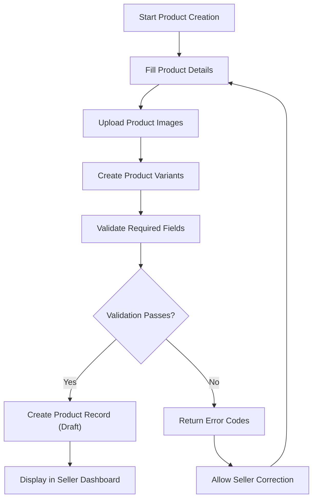
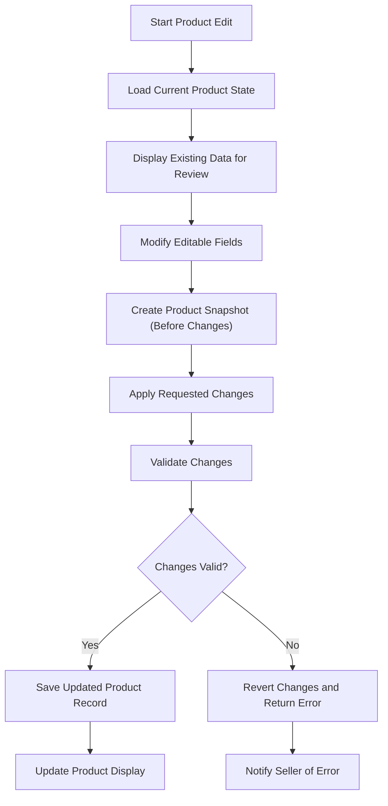
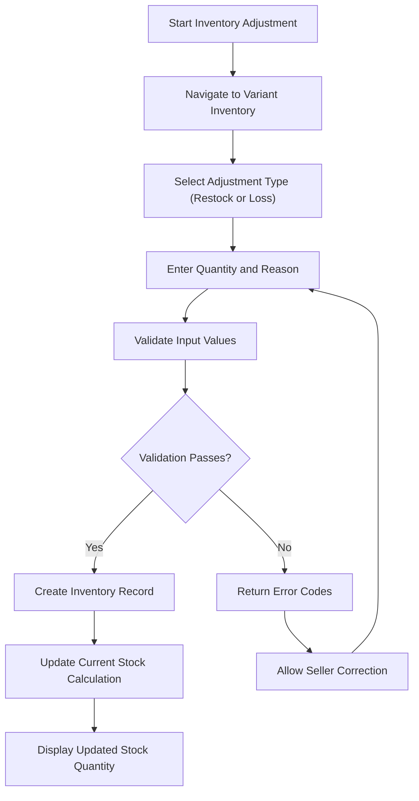
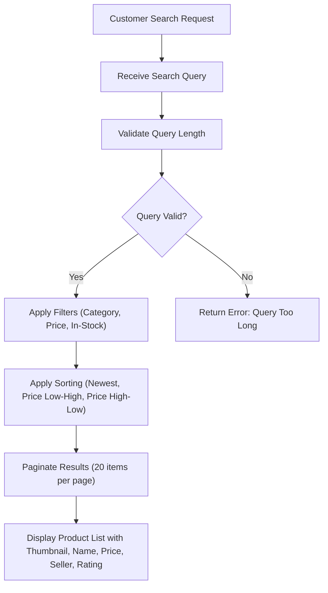

# Product Management Requirements Specification

## 1. Product Overview and Business Context

### 1.1 Product Definition

Products are the core items that sellers list for sale on the e-commerce platform. Each product represents a tangible or digital item that customers can purchase, complete with variants for different options (size, color, etc.) and inventory management for stock tracking.

### 1.2 Business Model Integration

This product management system supports the platform's mission to connect sellers and customers in a secure, transparent marketplace. Every product modification must be recorded through snapshots to ensure legal compliance, dispute resolution capabilities, and transparent business practices.

### 1.3 Key Business Principles

- **Snapshots are mandatory** for all product and variant modifications
- **Inventory must be tracked** through history records, not direct stock assignment
- **Seller ownership** is fundamental - sellers control their own products
- **Customer experience** drives search, filtering, and product display
- **Legal compliance** requires preservation of order history and product state

## 2. Product Creation and Management

### 2.1 Product Creation Workflow

#### Product Creation Requirements

WHEN a seller attempts to create a product, THE system SHALL validate the following fields:
- Product name: Required, must be non-empty string, maximum 200 characters
- Description: Required, must be non-empty string, minimum 100 characters
- Category: Required, must reference existing valid category (including subcategories)
- Base price: Required, must be positive number (minimum $0.01)
- Initial inventory: At least one variant must have stock quantity ≥ 0

WHEN product name is empty or exceeds character limit, THE system SHALL return error "PRODUCT_NAME_INVALID"

WHEN description is empty or below minimum length, THE system SHALL return error "PRODUCT_DESCRIPTION_INVALID"

WHEN category does not exist or is deleted, THE system SHALL return error "CATEGORY_NOT_FOUND"

WHEN base price is zero, negative, or exceeds maximum allowed value ($1,000,000), THE system SHALL return error "PRODUCT_PRICE_INVALID"

#### Product Creation Process

WHEN a seller creates a product, THE system SHALL:

1. Navigate to "Create Product" page in seller dashboard
2. Fill in product details (name, description, category, base price)
3. Upload at least one product image ( thumbnail required)
4. Create initial variant(s) with SKU, options, and stock quantity
5. Review and submit product for creation
6. Validate all required fields and business rules
7. IF validation passes, CREATE product record with "draft" status
8. IF validation fails, RETURN specific error codes and messages
9. Show product in seller's product list but not in public search
10. Require seller to publish product to make it available to customers

### 2.2 Product Editing Process

#### Product Editing Workflow

- Sellers can edit their own products at any time
- All edits trigger a snapshot of the previous product state
- Product updates must maintain all existing variants and images
- Category cannot be changed after initial product creation
- Product status changes from "draft" to "published" when made public

#### Product Editing Validation

WHEN a seller attempts to edit a product, THE system SHALL validate:
- Product name: Must be non-empty string, maximum 200 characters
- Description: Must be non-empty string, minimum 100 characters
- Base price: Must be positive number, maximum $1,000,000
- At least one variant must exist and be valid
- At least one image must exist if product was previously published

WHILE product has published status, THE system SHALL prevent:
- Changing the product category
- Removing all variants (at least one must remain)
- Removing all images if product is visible to customers

WHEN edit would cause validation failure for existing variants, THE system SHALL return error "PRODUCT_EDIT_INVALID"

WHEN seller attempts to change category on published product, THE system SHALL return error "CATEGORY_CHANGE_NOT_ALLOWED"

#### Product Editing Process

WHEN a seller edits a product, THE system SHALL:

1. Load current product state and display existing data
2. Modify any editable fields and settings
3. Review changes before submitting
4. Create snapshot of current product state (before changes)
5. Apply the requested changes to the product
6. IF changes are valid, SAVE updated product record
7. IF changes are invalid, REVERT and return error codes
8. Continue to display current state to customers until changes are saved
9. Apply changes immediately for new customers if product is published

### 2.3 Product Deletion Process

#### Product Deletion Conditions

- Sellers can delete their own products
- Products can only be deleted if no pending orders exist for any variant
- Products can only be deleted if no pending cancellations or refunds exist
- Once deleted, product no longer appears in search or category listings
- All variant records are deleted with the product
- All inventory records remain for historical tracking

#### Product Deletion Validation

WHEN product has any order items with status "paid" or "shipped" for any variant, THE system SHALL prevent deletion and return error "PRODUCT_HAS_ACTIVE_ORDERS"

WHEN product has any pending cancellation requests, THE system SHALL prevent deletion and return error "PRODUCT_HAS_PENDING_CANCELLATION"

WHEN product has any pending refund requests, THE system SHALL prevent deletion and return error "PRODUCT_HAS_PENDING_REFUND"

#### Product Deletion Process

WHEN a seller deletes a product, THE system SHALL:

1. Initiate product deletion through seller dashboard
2. Check all variants for active orders, cancellations, and refunds
3. IF any blocking conditions exist, RETURN appropriate error and abort
4. Create final snapshot of product state before deletion
5. Delete all product records and associated variants
6. Remove product from search indexes and category listings
7. Update product references in existing orders to "product deleted"
8. Automatically remove customer wishlist entries for this product
9. Preserve inventory history records for audit trail
10. Log product deletion in seller activity log

## 3. Product Variants (SKU) Management

### 3.1 Variant Creation and Structure

#### Variant Definition

A variant represents a specific combination of product options (e.g., "Red / Large", "Blue / Small"). Each variant has a unique SKU code and can have its own price and stock quantity.

#### Variant Creation Requirements

WHEN a seller creates a product, THE system SHALL require:
- At least one variant must be created with the product
- Each variant must have a unique SKU code (maximum 50 characters)
- Each variant must have at least one option value defined
- Each variant must have initial stock quantity ≥ 0

WHEN duplicate SKU code exists for same seller's products, THE system SHALL return error "SKU_DUPLICATE"

WHEN variant options are empty or invalid, THE system SHALL return error "VARIANT_OPTIONS_INVALID"

#### Variant Option Structure

- Options are defined as key-value pairs (e.g., {"color": "Red", "size": "Large"})
- Option keys must be consistent across all variants of same product
- Option values can be any string, maximum 100 characters each
- All variants of a product must have same option keys defined

### 3.2 Variant Editing Process

#### Variant Editing Workflow

- Sellers can edit SKU code, option values, and price for existing variants
- All edits trigger a snapshot of the previous variant state
- Stock quantity cannot be edited directly (must use inventory adjustment)
- SKU code changes must maintain uniqueness across seller's products

#### Variant Editing Validation

WHEN a seller attempts to edit a variant, THE system SHALL validate:
- SKU code: Must be non-empty, maximum 50 characters, unique for seller
- Option values: Must match expected option keys for product, valid strings
- Price: Must be non-negative number, maximum $1,000,000
- Product must have at least one valid variant after edit

WHEN edit would cause SKU duplication, THE system SHALL return error "SKU_DUPLICATE"

WHEN edit would make variant incompatible with product options, THE system SHALL return error "VARIANT_INCOMPATIBLE"

WHEN variant has active orders, cancellations, or refunds, THE system SHALL return error "VARIANT_HAS_ACTIVE_ORDERS"

#### Variant Editing Process

WHEN a seller edits a variant, THE system SHALL:

1. Load current variant state and display existing data
2. Modify editable fields (SKU, options, price)
3. Validate new values against business rules
4. Create snapshot of current variant state (before changes)
5. Apply the requested changes to the variant
6. IF changes are valid, SAVE updated variant record
7. IF changes are invalid, RETURN appropriate error codes
8. Maintain original variant state in existing order items
9. Use updated variant information for new orders

### 3.3 Variant Deletion Process

#### Variant Deletion Conditions

- Sellers can delete variants from their products
- Variants can only be deleted if no pending orders exist
- Variants can only be deleted if no pending cancellations or refunds exist
- Product must have at least one variant remaining after deletion

#### Variant Deletion Validation

WHEN variant has any order items with status "paid" or "shipped", THE system SHALL prevent deletion and return error "VARIANT_HAS_ACTIVE_ORDERS"

WHEN variant has any pending cancellation requests, THE system SHALL prevent deletion and return error "VARIANT_HAS_PENDING_CANCELLATION"

WHEN variant has any pending refund requests, THE system SHALL prevent deletion and return error "VARIANT_HAS_PENDING_REFUND"

WHEN product would have zero variants after deletion, THE system SHALL prevent deletion and return error "PRODUCT_NEEDS_AT_LEAST_ONE_VARIANT"

#### Variant Deletion Process

WHEN a seller deletes a variant, THE system SHALL:

1. Initiate variant deletion through product management interface
2. Check variant for active orders, cancellations, and refunds
3. IF any blocking conditions exist, RETURN appropriate error and abort
4. Validate that product will have at least one variant remaining
5. IF product would have zero variants, RETURN error "PRODUCT_NEEDS_AT_LEAST_ONE_VARIANT"
6. Create snapshot of current variant state before deletion
7. Delete variant record and associated inventory records
8. Remove variant from product's available variants list
9. Make customer cart entries with deleted variant unavailable
10. Preserve wishlist entries (product remains in wishlist)

### 3.4 Variant Inventory Integration

#### Stock Quantity Management

- Current stock quantity is calculated by summing all inventory records
- Stock starts at 0 when variant is created
- Inventory records track all quantity changes with reasons
- Order placement automatically creates negative inventory record
- Order cancellation/refund automatically creates positive inventory record

WHEN variant stock reaches 0, THE system SHALL:
- Mark variant as "out of stock" in all user interfaces
- Prevent variant from being added to customer carts
- Display "Out of Stock" message instead of price
- Allow customers to view variant details but not purchase

WHEN variant stock increases from 0, THE system SHALL:
- Automatically mark variant as "in stock"
- Allow variant to be added to customer carts
- Display normal price and purchase options
- Remove "Out of Stock" restrictions

## 4. Product Images Management

### 4.1 Image Upload and Structure

#### Image Upload Requirements

WHEN a seller uploads product images, THE system SHALL:
- Accept image files in JPG, PNG, or WebP format
- Validate image file size (maximum 5MB per image)
- Validate image dimensions (minimum 800x800 pixels recommended)
- Store original images with optimized thumbnails
- Generate image URLs for product pages and listings

WHEN image format is not supported, THE system SHALL return error "IMAGE_FORMAT_INVALID"

WHEN image file size exceeds 5MB, THE system SHALL return error "IMAGE_SIZE_EXCEEDED"

WHEN image dimensions are below 400x400 pixels, THE system SHALL return error "IMAGE_RESOLUTION_INVALID"

#### Image Upload Process

WHEN a seller uploads product images, THE system SHALL:

1. Select images for upload through product management interface
2. Validate each image format, size, and dimensions
3. IF any image fails validation, RETURN specific error codes
4. Store original images and generate optimized versions
5. Create image records with metadata (original URL, thumbnail URL, order index)
6. Save image associations with the product
7. Display uploaded images in preview mode
8. Allow seller to reorder images before final submission
9. Make first uploaded image main thumbnail by default
10. Save final image order when product is published

### 4.2 Image Reordering Process

#### Image Reordering Workflow

- Sellers can reorder product images after upload
- First image in order is used as product thumbnail
- Reordering can be done for any product state (draft or published)
- Reordering triggers no snapshot (only structural change)

#### Image Reordering Validation

WHEN a seller attempts to reorder images, THE system SHALL:
- Verify all image IDs exist for this product
- Verify no duplicate positions in reordering
- Validate position values are sequential integers starting from 0

WHEN duplicate image IDs are detected, THE system SHALL return error "IMAGE_DUPLICATE_POSITION"

WHEN position values are invalid (negative or non-sequential), THE system SHALL return error "IMAGE_POSITION_INVALID"

#### Image Reordering Process

WHEN a seller reorders product images, THE system SHALL:

1. Access image reorder interface for product
2. Display current image order with drag-and-drop interface
3. Drag and drop images to desired positions
4. Validate new order structure
5. IF validation fails, RETURN appropriate error codes
6. Save new image order to database
7. Update thumbnail reference (first image becomes thumbnail)
8. IF product is published, update public image display
9. Log image reordering in product edit history
10. Apply changes immediately to both seller preview and customer view

### 4.3 Image Deletion Process

#### Image Deletion Workflow

- Sellers can delete images from their products
- At least one image must remain after deletion (if product has been published)
- Deleted images are removed from all displays immediately
- Image deletion does not create a snapshot (only structural change)

#### Image Deletion Validation

WHEN deletion would leave product with zero images AND product has been published, THE system SHALL prevent deletion and return error "PRODUCT_NEEDS_AT_LEAST_ONE_IMAGE"

WHEN image ID does not exist for this product, THE system SHALL return error "IMAGE_NOT_FOUND"

#### Image Deletion Process

WHEN a seller deletes product images, THE system SHALL:

1. Select image(s) for deletion through product management interface
2. Validate that at least one image will remain
3. IF product would have zero images, RETURN error "PRODUCT_NEEDS_AT_LEAST_ONE_IMAGE"
4. Delete image records and remove image files from storage
5. Update product's image list and thumbnail reference
6. Immediately remove images from all display contexts
7. IF product is published, update public image display
8. Log image deletion in product edit history
9. Preserve original image references in order items
10. Update customer views immediately to reflect new image structure

## 5. Inventory Tracking System

### 5.1 Inventory Record Structure

#### Inventory Record Requirements

WHEN inventory changes occur, THE system SHALL create an inventory record with:
- Reference to specific product variant (not just product)
- Quantity change amount (positive for restocking, negative for sales)
- Transaction type (enum: "order", "restock", "adjustment", "cancellation", "refund")
- Transaction reference ID (e.g., order ID, restock order number)
- Timestamp of transaction
- Reason/description for the transaction
- User ID of actor who initiated the transaction (if applicable)

#### Inventory Record Validation

WHEN inventory record would cause negative stock quantity, THE system SHALL:
- FOR order transactions: Prevent order creation (already handled by cart validation)
- FOR adjustment transactions: Return error "INVENTORY_ADJUSTMENT_INVALID"
- Allow the adjustment if business logic specifically permits negative stock

### 5.2 Stock Quantity Calculation

#### Current Stock Calculation

THE system SHALL calculate current stock quantity for each variant as:
- Start with base quantity of 0 when variant is created
- Add all positive inventory records (restocks, refunds, cancellations)
- Subtract all negative inventory records (orders, adjustments)
- Formula: `current_stock = Σ(inventory_records.quantity)`

#### Real-time Stock Display

WHILE customer views product with variants, THE system SHALL:
- Calculate and display current stock quantity for each variant
- Show "In Stock" message when stock > 0
- Show "Out of Stock" message when stock = 0
- Show specific stock quantity for informational purposes
- Disable out-of-stock variants in cart and checkout flows

### 5.3 Inventory Adjustment Process

#### Seller Inventory Adjustment Workflow

- Sellers can add inventory (restock) for any variant
- Sellers can subtract inventory (adjustment/loss) for any variant
- All adjustments require a reason (text description)
- Adjustments create inventory history records
- Adjustments do not affect existing order items

#### Inventory Adjustment Validation

WHEN a seller attempts inventory adjustment, THE system SHALL:
- Validate adjustment reason is non-empty, maximum 500 characters
- Validate quantity is non-zero integer
- Validate quantity is not negative for restock operations
- Validate quantity is not positive for adjustment operations
- Verify variant belongs to seller's product

WHEN adjustment reason is empty, THE system SHALL return error "INVENTORY_REASON_REQUIRED"

WHEN adjustment quantity is zero, THE system SHALL return error "INVENTORY_QUANTITY_REQUIRED"

WHEN adjustment quantity exceeds logical limits (e.g., negative restock), THE system SHALL return error "INVENTORY_QUANTITY_INVALID"

#### Inventory Adjustment Process

WHEN a seller performs inventory adjustment, THE system SHALL:

1. Navigate to inventory management for specific product variant
2. Display current stock quantity and inventory history
3. Select adjustment type (restock or adjustment/loss)
4. Enter quantity and reason for adjustment
5. Validate input values and business rules
6. IF validation fails, RETURN appropriate error codes
7. Create inventory record with:
   - Variant reference
   - Quantity change (positive for restock, negative for adjustment)
   - Transaction type ("restock" or "adjustment")
   - Reason and timestamp
8. Update current stock calculation
9. Display updated stock quantity to seller
10. Log adjustment in seller activity log

## 6. Product Search and Filtering

### 6.1 Search Functionality

#### Product Search Requirements

WHEN a customer searches for products, THE system SHALL:
- Search product names using partial matching
- Include products from all sellers in search results
- Support case-insensitive search matching
- Return results paginated (20 products per page default)
- Sort by newest first by default

WHEN search query is empty, THE system SHALL return popular or trending products

WHEN search query exceeds maximum length (100 characters), THE system SHALL return error "SEARCH_QUERY_TOO_LONG"

#### Search Query Processing

- Search queries are trimmed of whitespace before processing
- Search supports multi-word queries (space-separated)
- Search matches any part of product name
- Search includes category names as implicit filters
- Search results include all relevant product information

### 6.2 Filtering Capabilities

#### Category Filtering

WHEN customer filters by category, THE system SHALL:
- Include products from selected category
- Include products from all subcategories of selected category
- Display category hierarchy information
- Support filtering by multiple categories

#### Price Range Filtering

WHEN customer specifies price range, THE system SHALL:
- Filter products by base price or variant price range
- Support minimum and maximum price constraints
- Handle currency formatting (USD default)
- Include products within specified price range

#### In-Stock Filtering

WHEN customer enables "in-stock only" filter, THE system SHALL:
- Exclude products where all variants have stock quantity = 0
- Include products where at least one variant has stock quantity > 0
- Show "Out of Stock" variants with appropriate status

### 6.3 Sorting Options

#### Sorting Requirements

WHEN customer selects sorting option, THE system SHALL:
- Support "newest first" sorting by creation timestamp
- Support "price low to high" sorting by minimum variant price
- Support "price high to low" sorting by maximum variant price
- Maintain consistent sorting for all paginated results

#### Sort Implementation

- Newest first: `ORDER BY created_at DESC`
- Price low to high: `ORDER BY MIN(variant.price) ASC`
- Price high to low: `ORDER BY MAX(variant.price) ASC`
- Default sorting: newest first (creation timestamp descending)

### 6.4 Search Result Display

#### Product Listing Information

WHEN displaying search results, THE system SHALL show for each product:
- Main thumbnail image (from first product image)
- Product name
- Price information (base price or price range)
- Seller shop name (linked to seller profile)
- Average rating (if reviews exist)
- Stock status indicator

#### Price Display Logic

WHEN product has one variant, THE system SHALL display that variant's price

WHEN product has multiple variants with same price, THE system SHALL display single price

WHEN product has multiple variants with different prices, THE system SHALL display price range (e.g., "$19.99 - $29.99")

WHEN all variants are out of stock, THE system SHALL display "Out of Stock" instead of price

## 7. Snapshot Principle and Implementation

### 7.1 Snapshot Requirements Overview

#### Snapshot Mandate

WHEN editable data is modified, THE system SHALL create a snapshot to preserve the previous state. This is a mandatory requirement for all e-commerce operations.

#### Snapshot Preservation

- Snapshots are immutable and cannot be deleted
- Snapshots record: when the change was made, what was changed, and the values before and after
- Snapshots can be viewed by relevant parties (owners, administrators) for dispute resolution
- Snapshots are preserved indefinitely for legal and business purposes

### 7.2 Product Snapshot Structure

#### Product Snapshot Requirements

WHEN a product is edited, THE system SHALL create a product snapshot that includes:
- All product fields at time of snapshot (name, description, category, base price, status)
- Timestamp of snapshot creation
- User ID of actor who made the change
- Reference to original product ID

#### Product-Snapshot to Product-Snapshot-SKU Relationship

WHEN a product is snapshotted, THE system SHALL also:
- Create product-snapshot records for each variant at that moment
- Include variant SKU codes, option values, and prices
- Link each product-snapshot-SKU to its parent product-snapshot
- Preserve complete variant state for historical accuracy

#### Snapshot Content Preservation

- Product snapshots include all images associated at time of snapshot
- Product snapshots include category information at time of snapshot
- Product snapshots include seller information at time of snapshot
- Product snapshots include all variant details at time of snapshot

### 7.3 Variant Snapshot Structure

#### Variant Snapshot Requirements

WHEN a variant is edited, THE system SHALL create a variant snapshot that includes:
- All variant fields at time of snapshot (SKU, options, price, stock level)
- Timestamp of snapshot creation
- User ID of actor who made the change
- Reference to original variant ID
- Reference to product-snapshot for consistency

#### Variant Snapshot Business Logic

- Each variant edit creates a new snapshot
- Variant snapshots preserve option values exactly as defined
- Variant snapshots capture price overrides from base price
- Variant snapshots maintain relationship to product snapshots

### 7.4 Snapshot Access and Review

#### Seller Snapshot Access

WHEN a seller views product snapshots, THE system SHALL:
- Show list of all snapshots for their products
- Allow viewing snapshot details and changes
- Display timestamp and actor information for each snapshot
- Enable comparison between different snapshots

#### Administrator Snapshot Access

WHEN an administrator views product snapshots, THE system SHALL:
- Allow viewing snapshots of any product on platform
- Show all historical changes regardless of ownership
- Enable audit of product modifications for policy compliance
- Support investigation of seller activities

#### Snapshot Display Requirements

- Snapshots are displayed in chronological order (newest first)
- Each snapshot shows date, time, and change summary
- Full variant details are available for each snapshot
- Comparison view highlights differences between snapshots

## 8. Seller-Specific Product Workflows

### 8.1 Seller Account Integration

#### Seller Product Ownership

- Products belong to the seller who creates them
- Sellers can only edit products they own
- Sellers can only delete products they own
- Product visibility is tied to seller account status

#### Seller Account Status Integration

WHEN seller account is suspended, THE system SHALL:
- Hide all seller's products from search and category listings
- Block new purchases of seller's products
- Allow seller to process existing orders
- Prevent new product creation and existing product editing
- Maintain visibility of products in past orders

WHEN seller account is unsuspended, THE system SHALL:
- Restore visibility of seller's products
- Enable new purchases of seller's products
- Allow seller to create new products and edit existing products
- Resume normal product management workflows

### 8.2 Seller Dashboard Integration

#### Product Summary Metrics

THE seller dashboard SHALL display:
- Total number of products (all statuses)
- Number of active products (published, not deleted)
- Number of products with stock issues
- Number of products with no variants
- Number of products with no images

#### Product Status Overview

- Active products: Published and available for purchase
- Draft products: Created but not yet published
- Deleted products: Removed from catalog but in database
- Unavailable products: No in-stock variants available

### 8.3 Seller Approval Integration

#### Seller Approval Status Integration

WHEN seller account is pending approval, THE system SHALL:
- Allow seller to create products but not publish them
- Prevent products from appearing in public search
- Allow seller to complete product setup in draft mode
- Show approval status prominently in seller dashboard

WHEN seller account is approved, THE system SHALL:
- Allow seller to publish products
- Enable products to appear in public search
- Allow normal product management workflows
- Remove draft-only restrictions

WHEN seller account is rejected, THE system SHALL:
- Prevent all product creation and editing
- Hide all seller's products from public view
- Allow seller to submit new registration request
- Provide clear rejection reason display

## 9. Business Rules and Validation

### 9.1 Product Business Rules

#### Product Creation Rules

WHEN a product is created, THE system SHALL enforce:
- Product must have at least one variant
- Product must have at least one image
- Product category must be valid and not deleted
- Product name must be unique within seller's portfolio (for clarity)
- Product description must meet minimum length requirements

#### Product Publication Rules

WHEN a product is published, THE system SHALL verify:
- At least one variant exists with stock quantity > 0 OR allows "out of stock" visibility
- At least one image is uploaded and valid
- All required fields are filled and valid
- Seller account is in good standing (not suspended or rejected)

WHEN product fails validation for publication, THE system SHALL:
- Prevent publication and return specific error codes
- Display detailed requirements to seller for correction
- Allow seller to save as draft while addressing issues

### 9.2 Inventory Business Rules

#### Stock Management Rules

WHILE customer adds items to cart, THE system SHALL:
- Verify variant stock quantity >= requested quantity
- Show warning if stock is low (less than 10 units)
- Block addition if stock < requested quantity
- Update cart display with current stock status

WHEN customer completes purchase, THE system SHALL:
- Create negative inventory record for each purchased variant
- Reduce current stock calculation accordingly
- Remove items from customer's cart
- Update order item status to "paid"

### 9.3 Variant Business Rules

#### Variant Compatibility Rules

WHEN a seller creates or edits a product, THE system SHALL:
- Ensure all variants have same option keys defined
- Prevent option value conflicts between variants
- Validate SKU codes are unique across seller's products
- Ensure at least one variant remains after any edit or deletion

#### Price Consistency Rules

WHEN variant prices are set, THE system SHALL:
- Validate prices are non-negative numbers
- Validate prices don't exceed maximum allowed value
- Allow price overrides from base product price
- Calculate price range for display purposes

## 10. Error Handling Scenarios

### 10.1 Product Creation Errors

#### Product Creation Error Matrix

| Error Code | Condition | User Message | Resolution Action |
|------------|-----------|--------------|-------------------|
| PRODUCT_NAME_INVALID | Empty name or exceeds 200 chars | "Product name must be between 1 and 200 characters" | Edit product name |
| PRODUCT_DESCRIPTION_INVALID | Empty description or below 100 chars | "Description must be at least 100 characters" | Expand product description |
| CATEGORY_NOT_FOUND | Invalid or deleted category reference | "Selected category is not available" | Choose a different category |
| PRODUCT_PRICE_INVALID | Price is zero, negative, or exceeds limit | "Price must be between $0.01 and $1,000,000" | Enter valid price |
| SKU_DUPLICATE | Duplicate SKU code for same seller | "SKU code must be unique across your products" | Use a different SKU code |
| VARIANT_OPTIONS_INVALID | Missing or invalid variant options | "Variant options must be properly defined" | Review variant option structure |
| IMAGE_FORMAT_INVALID | Unsupported image format | "Images must be in JPG, PNG, or WebP format" | Convert image format |
| IMAGE_SIZE_EXCEEDED | Image exceeds 5MB limit | "Image file size must not exceed 5MB" | Compress or resize image |
| IMAGE_RESOLUTION_INVALID | Image too small (below 400x400) | "Image resolution must be at least 400x400 pixels" | Use higher resolution image |

### 10.2 Product Modification Errors

#### Product Edit Error Matrix

| Error Code | Condition | User Message | Resolution Action |
|------------|-----------|--------------|-------------------|
| PRODUCT_EDIT_INVALID | Invalid edit combination | "Some changes are not compatible" | Review and modify edits |
| CATEGORY_CHANGE_NOT_ALLOWED | Attempting to change category | "Category cannot be changed after product creation" | Cannot modify category |
| PRODUCT_HAS_ACTIVE_ORDERS | Blocking orders exist for deletion | "Product cannot be deleted due to active orders" | Wait for order completion |
| PRODUCT_HAS_PENDING_CANCELLATION | Pending cancellations exist | "Product cannot be deleted with pending cancellations" | Wait for cancellation resolution |
| PRODUCT_HAS_PENDING_REFUND | Pending refunds exist | "Product cannot be deleted with pending refunds" | Wait for refund resolution |
| VARIANT_HAS_ACTIVE_ORDERS | Variant has active orders | "Variant cannot be deleted due to active orders" | Wait for order completion |
| VARIANT_HAS_PENDING_CANCELLATION | Pending variant cancellations | "Variant cannot be deleted with pending cancellations" | Wait for cancellation resolution |
| VARIANT_HAS_PENDING_REFUND | Pending variant refunds | "Variant cannot be deleted with pending refunds" | Wait for refund resolution |
| PRODUCT_NEEDS_AT_LEAST_ONE_VARIANT | Deletion would remove all variants | "Product must have at least one variant" | Create additional variant first |
| PRODUCT_NEEDS_AT_LEAST_ONE_IMAGE | Deletion would remove all images | "Product must have at least one image" | Upload additional image first |

### 10.3 Inventory Error Scenarios

#### Inventory Error Matrix

| Error Code | Condition | User Message | Resolution Action |
|------------|-----------|--------------|-------------------|
| INVENTORY_REASON_REQUIRED | Empty adjustment reason | "Reason for adjustment is required" | Provide adjustment reason |
| INVENTORY_QUANTITY_REQUIRED | Zero quantity adjustment | "Adjustment quantity must be specified" | Enter valid quantity |
| INVENTORY_QUANTITY_INVALID | Logical quantity error | "Quantity must be positive for restock, negative for adjustment" | Correct quantity direction |
| INVENTORY_ADJUSTMENT_INVALID | Would cause negative stock | "Adjustment would result in invalid stock level" | Adjust quantity or add stock first |
| VARIANT_NOT_FOUND | Invalid variant reference | "Specified variant does not exist" | Verify variant selection |
| IMAGE_POSITION_INVALID | Invalid image reordering | "Image positions must be valid and sequential" | Reorder images correctly |
| IMAGE_DUPLICATE_POSITION | Duplicate image positions | "Each image must have a unique position" | Fix duplicate positions |
| IMAGE_NOT_FOUND | Invalid image reference | "Specified image does not exist" | Verify image selection |

### 10.4 Search and Filter Errors

#### Search Error Matrix

| Error Code | Condition | User Message | Resolution Action |
|------------|-----------|--------------|-------------------|
| SEARCH_QUERY_TOO_LONG | Query exceeds 100 characters | "Search query must be 100 characters or less" | Shorten search query |

## 11. Business Process Diagrams

### 11.1 Product Creation Workflow

### 11.2 Product Editing Workflow

### 11.3 Inventory Adjustment Workflow

### 11.4 Product Search and Filter Workflow

## 12. Implementation Notes

### 12.1 Key Database Relationships

- Products have many variants (one-to-many)
- Products have many images (one-to-many)
- Variants have many inventory records (one-to-many)
- Products belong to sellers (many-to-one)
- Products belong to categories (many-to-one)
- Snapshots preserve complete product states at modification time

### 12.2 Business Logic Highlights

- Product deletion blocked if any variant has active orders
- Category cannot be changed after product creation
- Stock calculation is sum of all inventory records
- Snapshots created for all product and variant modifications
- Out-of-stock variants cannot be purchased but can be viewed

### 12.3 Performance Considerations

- Stock calculations should use cached totals for real-time display
- Search should use full-text indexing for product names
- Category filtering should support recursive queries for subcategories
- Product snapshots should be stored efficiently for quick retrieval

### 12.4 Security Considerations

- Sellers can only edit their own products
- Inventory adjustments require authentication
- Snapshot access follows ownership rules
- Product deletion requires validation of all blocking conditions

### 12.5 Audit Requirements

- All inventory changes create history records
- All product modifications create snapshots
- Seller approval status changes are logged
- Error conditions and validation failures are recorded
- All business rule violations should generate audit trails