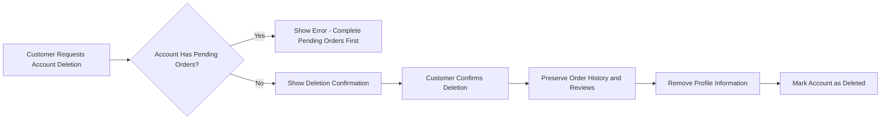

# E-Commerce Shopping Mall Platform - Requirements Specification Document

## Business Overview

The E-Commerce Shopping Mall Platform is a comprehensive marketplace solution that connects customers and sellers in a secure, scalable e-commerce environment. This platform enables sellers to create and manage product listings while customers browse, purchase, and review products with a seamless shopping experience.

### Platform Business Model

The platform operates as a digital marketplace that generates revenue through seller fees and transaction commissions. Sellers create shops to showcase their products, set competitive pricing, and manage inventory. Customers browse products, compare options, read reviews, and complete purchases through an integrated payment system. The platform ensures trust through secure transactions, buyer/seller protection policies, and comprehensive dispute resolution mechanisms.

### Market Position and Value Proposition

This shopping mall platform addresses key market needs by providing:
- **For Customers**: A wide variety of products from multiple sellers, competitive pricing, secure payment processing, transparent reviews, and reliable customer support
- **For Sellers**: Powerful tools for product management, inventory control, customer insights, and business growth through marketplace exposure
- **For the Platform**: A scalable architecture that supports growth, automated operations through no-code implementation, and comprehensive analytics for continuous improvement

## User Actors and Authentication

### Customer Actor

Customers are the primary users of the platform who browse products, make purchases, and interact with sellers through reviews and communications.

#### Authentication Flow
- Customers sign up with email and password
- Customers log in with email and password
- Session management with JWT tokens for secure authentication
- Password change functionality for security maintenance
- Account deletion with data preservation for legal compliance

#### Customer Permissions
- Browse products and categories
- Search products with filters and sorting
- Add products to cart and wishlist
- Complete purchases and track orders
- Write and manage reviews for purchased products
- Manage personal profile, addresses, and preferences
- View order history and tracking information

### Seller Actor

Sellers are business entities that create product listings, manage inventory, and fulfill customer orders.

#### Seller Registration and Approval Process
- Sellers register with email and password
- Seller accounts require administrator approval before selling
- Sellers can view their approval status (pending, approved, rejected)
- Rejected sellers receive rejection reasons and can resubmit requests
- Sellers can manage shop profiles, products, and orders

#### Seller Permissions
- Create, edit, and delete product listings
- Manage product variants (SKUs) and inventory
- Process orders, shipments, cancellations, and refunds
- View customer reviews and ratings for their products
- Access seller dashboard with business analytics
- Manage shop profile and branding
- Respond to customer inquiries and dispute resolutions

#### Account Deletion Requirements
- Can only delete account if no pending orders or refund requests
- Preserves order history and snapshots for legal compliance
- Deletes active product listings but maintains historical data

### Administrator Actor

Administrators maintain platform integrity, moderate content, and manage user accounts.

#### Administrator Permissions
- Approve or reject seller registrations
- Manage categories and subcategories
- Review and moderate product content
- Handle customer and seller disputes
- View all platform data for oversight
- Ban or suspend accounts for policy violations
- Force-cancel or refund orders when necessary

### Super Administrator Actor

Super administrators have elevated privileges for platform management and governance.

#### Super Administrator Permissions
- All administrator capabilities plus
- Promote/demote regular administrators
- Manage other super administrators (cannot demote themselves)
- Override any system decision when absolutely necessary
- Access comprehensive platform analytics and reports

### Authentication System Design

#### Login and Session Management
- Secure email/password authentication with encrypted password storage
- JWT token-based session management for stateless authentication
- Automatic session timeout after inactivity period
- Password change functionality requiring current password verification
- Two-factor authentication support for elevated security scenarios

#### Permission Matrix
| Feature | Guest | Customer | Seller | Admin | Super Admin |
|---------|-------|----------|--------|-------|-------------|
| Browse Products | ✓ | ✓ | ✓ | ✓ | ✓ |
| Search Products | ✓ | ✓ | ✓ | ✓ | ✓ |
| View Categories | ✓ | ✓ | ✓ | ✓ | ✓ |
| Create Account | ✓ | ✗ | ✓ | ✗ | ✗ |
| Add to Cart | ✗ | ✓ | ✓ | ✓ | ✓ |
| Complete Purchase | ✗ | ✓ | ✗ | ✗ | ✗ |
| Create Products | ✗ | ✗ | ✓ | ✓ | ✓ |
| Manage Inventory | ✗ | ✗ | ✓ | ✓ | ✓ |
| Process Orders | ✗ | ✗ | ✓ | ✓ | ✓ |
| Write Reviews | ✗ | ✓ | ✗ | ✓ | ✓ |
| Approve Sellers | ✗ | ✗ | ✗ | ✓ | ✓ |
| Manage Categories | ✗ | ✗ | ✗ | ✓ | ✓ |
| Ban Users | ✗ | ✗ | ✗ | ✓ | ✓ |
| Manage Admins | ✗ | ✗ | ✗ | ✗ | ✓ |

## Functional Requirements

### Customer Account Management

#### Account Registration
- Customers sign up with email and password
- Email must be unique across all user accounts
- Password must meet security requirements (minimum length, complexity)
- Account verification via email confirmation link
- Registration completes account creation and automatic login

#### Account Login
- Customers log in with email and password credentials
- Failed login attempts trigger security measures after threshold
- Successful authentication returns JWT token for session management
- Session persists until explicit logout or timeout

#### Password Management
- Customers can change password after authentication
- Current password required for password change verification
- New password must meet security requirements
- Password change creates security log entry

#### Account Deletion
- Customers can delete their accounts
- Account deletion preserves:
  - Order history (for seller records and legal compliance)
  - Reviews (preserved but shown as "deleted user")
  - Transaction history for audit purposes
- Profile information is removed from active records
- Deletion is irreversible - customers must create new account if returning

#### Account Deletion Workflow

### Customer Profile Management

#### Profile Information
- Each customer has a profile with:
  - Display name (required)
  - Phone number (required)
  - Account status (active, suspended, deleted)
  - Registration date
  - Last login date

#### Profile Editing
- Customers can edit display name and phone number
- All profile edits create snapshots for audit trail
- Phone number validation for format compliance
- Real-time validation during editing process

### Address Management

#### Address Creation
- Customers can add multiple shipping addresses
- Each address includes:
  - Recipient name (required)
  - Phone number (required)
  - Street address (required)
  - City (required)
  - State/Province (required)
  - Postal code (required)
  - Country (required)

#### Address Management
- Customers can edit existing addresses
- Customers can delete addresses
- One address can be set as default shipping address
- Default address is used for orders without address selection
- Address validation ensures data consistency

#### Address Snapshot Principle
- All address modifications create snapshots
- Snapshots preserve address state at time of order
- Order records use snapshot address at time of purchase

### Product Management

#### Product Creation
- Sellers create products with:
  - Name (required)
  - Description (required)
  - Category (required, can select subcategory)
  - Base price (required)
  - Images (multiple, reorderable)

#### Product Editing
- Sellers can edit their own products
- Every edit creates a product snapshot
- Snapshots preserve complete product state
- Product name, description, category, and base price are tracked
- Image changes are included in product snapshots

#### Product Deletion
- Products can be deleted only if:
  - No pending order items (paid or shipped status)
  - No pending cancellation or refund requests
- Product deletion also deletes all variants and inventory records
- Deleted products no longer appear in search or listings
- Snapshots are preserved even after product deletion

#### Product Visibility Rules
- Active products with variants appear in search and category listings
- Products with no variants visible but shown as "unavailable"
- Products from suspended sellers are hidden from listings
- Deleted products are completely removed from public view

### Product Variant Management

#### Variant Creation
- Sellers can add multiple variants to products
- Each variant includes:
  - SKU code (unique identifier, required)
  - Option values (e.g., color: "Red", size: "Large")
  - Price (can override base price, optional)
  - Stock quantity (required, starts at 0)

#### Variant Editing
- Sellers can edit variant SKU code, option values, and price
- Every edit creates a variant snapshot
- Snapshots preserve complete variant state
- Price changes affect order calculations

#### Variant Deletion
- Variants can be deleted only if:
  - No pending order items (paid or shipped status)
  - No pending cancellation or refund requests
- Product must maintain at least one variant to be purchasable
- Deleting last variant renders product unavailable

#### Stock Quantity Management
- Each variant has separate stock quantity
- Stock changes through inventory history records
- Order placement automatically decrements stock
- Order cancellation/refund automatically increments stock
- Stock reaches 0 → variant shown as "out of stock"
- Out of stock variants cannot be added to cart

### Product Search and Filtering

#### Search Functionality
- Customers can search products by name
- Search results from all sellers included
- Search results paginated for performance
- Real-time search suggestions as customers type

#### Filter Options
- Filter by category (including subcategories)
- Filter by price range (minimum and maximum)
- Filter by in-stock only (available variants)
- Filter by seller shop name

#### Sorting Options
- Sort by newest first (default)
- Sort by price (low to high)
- Sort by price (high to low)
- Sort by rating (high to low)

#### Search Results Display
- Each product shows:
  - Main image (thumbnail)
  - Product name
  - Base price or price range
  - Seller shop name
  - Average rating (if reviews exist)

### Product Detail Page

#### Product Information Display
- All product images (reorderable main image first)
- Product name and description
- Category hierarchy
- Seller shop name (clickable link to seller profile)
- Product status (available, unavailable, out of stock)

#### Variant Selection
- All available variants with prices and stock status
- Visual indicator for in-stock vs out of stock variants
- Price display for each variant
- Stock quantity for each variant

#### Review Display
- Average rating from all non-deleted reviews
- Total review count
- Rating breakdown by star level
- All reviews sorted by newest first
- Verified purchase badges where applicable

### Wishlist Management

#### Wishlist Creation
- Customers can add products to wishlist
- Products added to wishlist (not specific variants)
- Wishlist is customer-specific

#### Wishlist Display
- Wishlist shows all added products
- Products paginated for performance
- Wishlist shows product images, names, and prices
- Customers can view product detail pages from wishlist

#### Wishlist Management
- Customers can remove products from wishlist
- Deleted products automatically removed from all wishlists
- Wishlist updates in real-time

### Shopping Cart Management

#### Cart Item Addition
- Customers add specific variants to cart (not products)
- Specify quantity when adding to cart
- If same variant already in cart, quantities combine
- Stock validation when adding to cart

#### Cart Display
- Cart shows each item with:
  - Product name
  - Variant options
  - Unit price
  - Quantity
  - Subtotal price
- Cart shows total price of all items
- Stock warnings when quantity exceeds available stock
- Unavailable items marked as unavailable

#### Cart Management
- Customers can change item quantities
- Customers can remove items from cart
- Cart updates totals in real-time
- Unavailable items cannot be checked out

### Checkout and Order Placement

#### Checkout Process
- Customers proceed to checkout from cart
- Unavailable items blocked from checkout
- Customers must select shipping address (or use default)
- Order summary displays:
  - Items with prices
  - Shipping address
  - Total price

#### Order Placement
- Customers confirm and place order
- External payment gateway integration
- Payment processing results in success or failure
- Failed payment → order not created, customer can retry
- Successful payment → order created with all order items

#### Stock and Cart Updates
- Order placement decreases stock quantities for purchased variants
- Cart items removed for purchased products
- Order record created with all necessary information
- Each purchased variant becomes order item with "paid" status
- Product and variant snapshots saved with order items
- Seller profile snapshots saved with order items

### Order Processing

#### Order Structure
- Orders contain one or more order items
- Order items represent purchased product variants with quantities
- Order items can be from different sellers
- Each order item has independent status
- Each order item can be individually cancelled or refunded

#### Order Status Management
**Order Item Status**
- Paid: Payment completed, waiting for seller to ship
- Shipped: Seller has shipped the item
- Delivered: Item has been delivered
- Cancelled: Item was cancelled
- Refunded: Item was refunded

**Order Status**
- Derived from order items:
  - All items paid → order "paid"
  - Any item shipped (none delivered) → order "shipped"
  - All items delivered → order "delivered"
  - All items cancelled → order "cancelled"
  - All items refunded → order "refunded"
  - Mixed states → order "partially completed"

### Shipping and Tracking

#### Shipment Creation
- Sellers ship order items from their products
- Shipment can include one or more order items from same seller
- Different sellers ship separately (different shipments)
- Sellers choose bundling or individual shipping

#### Shipping Process
- Sellers view items needing shipping for their products
- Sellers select items to include in shipment
- Sellers enter tracking information (carrier, tracking number)
- All items in shipment share tracking information
- Shipment creation changes all items to "shipped" status

#### Delivery Confirmation
- Customers view tracking information per shipment
- Customers confirm delivery per shipment (not per item)
- Customer confirmation → all shipment items to "delivered" status
- Automatic delivery after 14 days if no confirmation

### Order Cancellation and Refunds

#### Cancellation Process
- Cancellation handled per order item (not entire order)
- Customers request cancellation for "paid" status items
- Cancellation includes reason text
- Sellers approve or reject cancellation requests
- Seller response creates snapshot of request state
- Approved cancellation → item cancelled, refund processed
- Cancelled items restore stock quantities
- Remaining items continue processing normally

#### Refund Process
- Refund handled per order item (not entire order)
- Customers request refund for "delivered" status items
- Refund requested within 7 days of delivery
- Refund includes reason text
- Sellers approve or reject refund requests
- Seller response creates snapshot of request state
- Approved refund → item refunded
- Refunded items restore stock quantities
- Remaining items unaffected

### Review and Rating System

#### Review Creation
- Customers can write reviews for purchased products
- Reviews written after item status is "delivered"
- One review per product per order
- Reviews include rating (1-5 stars, required) and optional text

#### Review Management
- Customers can edit their own reviews
- Every edit creates review snapshot
- Customers can delete their own reviews
- Deleted reviews preserved in snapshots

#### Review Display
- Reviews on product detail pages
- Average rating from all non-deleted reviews
- Rating breakdown by star level
- Reviews sorted by newest first
- Verified purchase badges

#### Review Snapshot Principle
- Every edit creates review snapshot
- Every deletion creates review snapshot
- Snapshots preserve review state at time of modification
- Snapshots immutable and cannot be deleted
- Used for dispute resolution and audit trail

### Seller Dashboard

#### Dashboard Metrics
- Total number of products
- Total number of order items for products
- Number of pending cancellation requests
- Number of pending refund requests

#### Order Management
- List of all order items for seller's products
- Filter by status (paid, shipped, delivered, cancelled, refunded)
- View detailed order information
- Process shipments, cancellations, and refunds

### Product Management Features

#### Category Management
- Products organized into categories
- Categories support one level of nesting (subcategories)
- Each category has name and description
- Categories created and managed by administrators only
- Customers can browse categories and view products

#### Snapshot Principle
- All editable data modifications recorded
- Snapshots preserve previous state for dispute resolution
- Snapshots include timestamp, changes, before/after values
- Snapshots immutable and cannot be deleted
- Relevant parties can view snapshots for their data

#### Product Snapshots
- When product edited, product snapshot created
- Product snapshot includes all product fields
- Product snapshot includes variant snapshots at that moment
- Product snapshots preserved after product deletion

#### Order Snapshots
- Each order item saves product snapshot at purchase time
- Each order item saves variant snapshot at purchase time
- Each order item saves seller profile snapshot at purchase time
- Snapshots preserve complete context for future reference

### Administrator Features

#### Seller Management
- View pending seller approvals
- Approve or reject seller registrations
- Reject with mandatory reason
- Rejected sellers can resubmit requests
- Suspend seller accounts
- Unsuspend seller accounts
- Suspend impact: products hidden, no new product creation/editing

#### Category Management
- Create categories and subcategories
- Edit category names and descriptions
- Delete categories (products become uncategorized)
- Categories managed by administrators only

#### Product Oversight
- View all products on platform
- View snapshots of any product
- Delete any product for policy violations

#### Order Oversight
- View all orders on platform
- Force-cancel items or entire orders
- Force-refund items or entire orders

#### User Management
- View all customer accounts
- Ban/unban customers
- View all seller accounts
- Ban sellers (existing orders remain active)

## Business Rules and Validation

### Account Validation

#### Email Uniqueness
- Email must be unique across all user accounts
- Registration fails if email already exists
- Email validation follows RFC 5322 standards

#### Password Requirements
- Minimum length of 8 characters
- Must contain at least one uppercase letter
- Must contain at least one lowercase letter
- Must contain at least one numeric character
- Must contain at least one special character
- Passwords stored with bcrypt hashing

#### Account Status Transitions
- Active accounts can perform all operations
- Suspended accounts cannot log in or perform operations
- Banned accounts cannot log in
- Deleted accounts show as "deleted user" for history

### Product Validation

#### Product Creation Requirements
- Name required, minimum 3 characters
- Description required, minimum 10 characters
- Category must be valid existing category
- Base price must be positive number
- At least one variant required for purchase

#### Product Editing Constraints
- Name cannot be empty after edit
- Price cannot be negative after edit
- Category cannot be changed to non-existent category
- Product must maintain at least one variant

#### Product Deletion Conditions
- No pending paid or shipped order items
- No pending cancellation or refund requests
- If conditions not met, deletion blocked with error

### Inventory Validation

#### Stock Quantity Rules
- Stock quantity must be non-negative integer
- Stock cannot be less than zero after deduction
- Restocking must be positive quantity
- Adjustment must maintain non-negative stock

#### Stock Validation During Operations
- Cart addition blocked if stock less than requested quantity
- Checkout blocked if stock less than cart quantity
- Order placement checks stock availability
- Refund processing verifies stock restoration

### Order Validation

#### Order Placement Constraints
- Cart must not contain unavailable items
- All items in cart must have available stock
- Shipping address must be valid customer address
- Payment must complete successfully

#### Order Status Transitions
- Paid → Shipped (by seller)
- Shipped → Delivered (by customer confirmation or 14 days)
- Paid → Cancelled (by seller approval)
- Delivered → Refunded (by seller approval)
- Status changes must follow business rules

### Review Validation

#### Review Eligibility
- Customer must have purchased product
- Order item status must be "delivered"
- One review per product per order
- Review must have rating (1-5 stars)

#### Review Content Rules
- Rating must be integer 1-5
- Text content cannot exceed character limit
- No profanity or policy violations
- One review per product per order

#### Review Editing Rules
- Only review author can edit
- Rating range 1-5 maintained
- Text content length validated
- Snapshots created for all edits

## Error Handling

### Authentication Errors

#### Invalid Credentials
- WHEN invalid email or password provided, THEN system SHALL show "Invalid email or password."
- WHEN account deleted, THEN system SHALL show "This account has been deleted."
- WHEN account banned, THEN system SHALL show "This account has been banned."
- WHEN account not approved (seller), THEN system SHALL show "Your account is pending approval."

#### Session Management Errors
- WHEN session expired, THEN system SHALL redirect to login page
- WHEN token invalid, THEN system SHALL show "Please log in again."
- WHEN multiple logins detected, THEN system SHALL show "Another device logged in with your account."

### Validation Errors

#### Input Validation Errors
- WHEN email format invalid, THEN system SHALL show "Invalid email format."
- WHEN password too short, THEN system SHALL show "Password must be at least 8 characters."
- WHEN required field missing, THEN system SHALL show "[Field name] is required."
- WHEN value outside range, THEN system SHALL show "[Field name] must be between [min] and [max]."

#### Business Validation Errors
- WHEN product cannot be deleted, THEN system SHALL show "Cannot delete product with pending orders."
- WHEN review eligibility not met, THEN system SHALL show "You can only review products you have purchased and received."
- WHEN out of stock, THEN system SHALL show "Product is out of stock."

### Business Logic Errors

#### Permission Errors
- WHEN unauthorized access attempt, THEN system SHALL show "You do not have permission to perform this action."
- WHEN trying to edit others' content, THEN system SHALL show "You can only edit your own content."
- WHEN trying to access others' private data, THEN system SHALL show "Access denied."

#### State Transition Errors
- WHEN invalid order status transition, THEN system SHALL show "This action cannot be performed on the current order status."
- WHEN trying to review non-delivered item, THEN system SHALL show "You can only review items after they have been delivered."
- WHEN trying to cancel already shipped item, THEN system SHALL show "Cannot cancel item that has already been shipped."

### System Errors

#### Database Errors
- WHEN database connection failed, THEN system SHALL show "Service temporarily unavailable. Please try again later."
- WHEN data integrity violation, THEN system SHALL show "Data error. Please contact support."

#### External Service Errors
- WHEN payment gateway unavailable, THEN system SHALL show "Payment service temporarily unavailable. Please try again later."
- WHEN external API timeout, THEN system SHALL show "Service timeout. Please try again later."

## Performance Requirements

### Response Time Expectations

#### Page Load Times
- Product listing page: < 2 seconds
- Product detail page: < 3 seconds
- Search results page: < 2 seconds
- Checkout page: < 2 seconds
- Dashboard page: < 3 seconds

#### API Response Times
- Authentication endpoints: < 500ms
- Product search API: < 1 second
- Product listing API: < 1 second
- Cart operations: < 500ms
- Order placement: < 2 seconds

#### Interactive Element Times
- Form validation: < 200ms
- Auto-complete suggestions: < 300ms
- Filter updates: < 500ms
- Real-time stock updates: < 1 second

### Concurrency Requirements

#### Simultaneous Operations
- System must handle 1,000 concurrent users
- System must handle 100 concurrent product searches
- System must handle 50 concurrent order placements
- System must handle 200 concurrent cart updates

#### Data Consistency
- Stock quantity updates must be atomic
- Review ratings must be calculated atomically
- Order status transitions must be transactional
- Snapshot creation must be atomic

### Scalability Requirements

#### Horizontal Scaling
- Authentication services: Horizontal scalable
- Product services: Horizontal scalable
- Order services: Horizontal scalable
- Caching layer: Horizontal scalable

#### Data Growth
- Support 100,000+ products
- Support 1,000,000+ orders
- Support 10,000,000+ reviews
- Support 100,000,000+ inventory records

### Availability Requirements

#### System Uptime
- Platform availability: 99.9% uptime
- Maintenance windows: Scheduled during low-traffic hours
- Disaster recovery: 4-hour recovery time objective

#### Backup Requirements
- Daily database backups
- Hourly snapshot backups for critical data
- Geographic redundancy for disaster recovery
- Backup retention: 30 days minimum

## Conclusion

This requirements specification document provides comprehensive coverage of the E-Commerce Shopping Mall Platform's functional requirements, business rules, error handling, and performance specifications. The document serves as the authoritative foundation for backend development, ensuring all stakeholders have a complete understanding of the system requirements.

The platform's architecture follows the Snapshot Principle to ensure data integrity and auditability for all critical business operations. This approach provides legal compliance for transaction records, dispute resolution capabilities, and complete audit trails for all data modifications.

All user actors are properly defined with appropriate permissions and authentication flows. The system supports the complete customer journey from product discovery through purchase and review, while providing sellers with comprehensive tools for product management, order fulfillment, and business analytics.

Administrative features ensure platform integrity through seller approval, content moderation, and oversight capabilities. The flexible permission model allows for both regular administrators and super administrators with elevated privileges for platform governance.

This specification enables the AutoBE pipeline to generate a complete, production-ready backend application that meets all business requirements and scalability needs of the E-Commerce Shopping Mall Platform.