# Shipping and Tracking Requirements Specification

## Business Model and Shipment Philosophy

### Why Shipment Management Matters

In an e-commerce shopping mall platform, the shipment process represents the critical physical fulfillment phase where digital orders become tangible deliveries. This phase directly impacts customer satisfaction, seller reputation, and overall platform trustworthiness.

### Core Shipment Principles

- **Shipment as a Physical Container**: A shipment represents a physical package sent from seller to customer
- **Seller Responsibility**: Each seller manages their own shipments independently
- **Order Item Grouping**: Order items can be grouped into shipments based on seller decisions
- **Multi-Shipment Orders**: A single order can span multiple shipments when items come from different sellers or are shipped separately
- **Immutable Tracking**: Once tracking information is recorded, it cannot be altered (creates audit trail)

### Business Value of Shipment System

- **Transparency**: Customers know exactly when and how their items arrive
- ** Accountability**: Sellers are responsible for their shipping performance
- **Dispute Resolution**: Shipment history provides clear evidence for delivery issues
- **Operational Efficiency**: Structured shipment workflow enables automation and optimization

## Shipment Overview and Creation Process

### What is a Shipment?

A shipment is a physical delivery unit that contains one or more order items from the same seller. Each shipment represents a single package that will be sent to a customer.

### Shipment Creation Principles

- **Seller-Initiated**: Only sellers can create shipments for their own order items
- **Item Grouping**: Sellers decide which order items to include in each shipment
- **Flexibility**: Sellers can choose to ship items individually or bundle them together
- **One-Shot Creation**: Shipment creation is a one-time event that cannot be undone
- **Tracking Requirement**: Every shipment must have tracking information at creation

### Shipment Creation Workflow

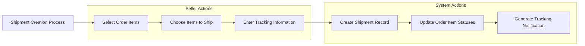

### Step-by-Step Shipment Creation Process

#### Step 1: Seller Accesses Shipping Dashboard

- Seller navigates to their shipping dashboard in seller dashboard
- The system displays order items that require shipping for their products
- Items are filtered to show only those with status "paid" or "shipped"
- Items are grouped by order for easy management

#### Step 2: Select Order Items for Shipment

- Seller reviews available order items that need shipping
- Seller can select one or multiple items from the same order
- Items from different sellers must be in separate shipments
- The system validates that selected items can be shipped (not already shipped, cancelled, or refunded)

#### Step 3: Choose Shipment Strategy

Sellers can choose from these shipment strategies:

1. **Individual Shipping**: Ship each item separately
   - Each item becomes its own shipment
   - Each shipment has its own tracking information
   - Customer receives multiple packages

2. **Batch Shipping**: Combine multiple items into one shipment
   - Multiple items from same seller are grouped together
   - Single tracking number for all items
   - Customer receives one package containing multiple items

3. **Partial Shipping**: Ship some items now, others later
   - Seller ships available items immediately
   - Out-of-stock or backorder items ship separately
   - Customer receives items as they become available

#### Step 4: Enter Tracking Information

When creating a shipment, the seller must provide:

1. **Carrier Name**
   - The shipping carrier (e.g., "FedEx", "UPS", "DHL", "USPS")
   - Free text field with autocomplete suggestions
   - Must not be empty or whitespace-only

2. **Tracking Number**
   - The carrier's tracking identifier
   - Free text field that may contain letters, numbers, and hyphens
   - Must not be empty or whitespace-only
   - Example formats: "1Z999AA10123456784", "RD123456789US", "123456789"

3. **Optional Fields**
   - Estimated delivery date (customer-friendly timeline)
   - Shipping method (e.g., "Standard", "Express", "Overnight")
   - Notes for customer (if supported by system)

#### Step 5: Create Shipment Record

- System validates all required tracking information
- System creates the shipment record with unique identifier
- System records creation timestamp and seller information
- System links the shipment to selected order items
- System generates audit log entries for compliance

#### Step 6: Update Order Item Statuses

- All order items in the shipment change status to "shipped"
- Order status is recalculated based on new item statuses
- Customer receives notification of shipment
- Inventory remains unchanged (stock was already deducted at order time)

#### Step 7: Generate Customer Notification

- Customer receives shipment notification via email and/or app
- Notification includes tracking information and carrier details
- Notification may include estimated delivery date
- Customer can view tracking details in their order history

### Shipment Creation Validation Rules

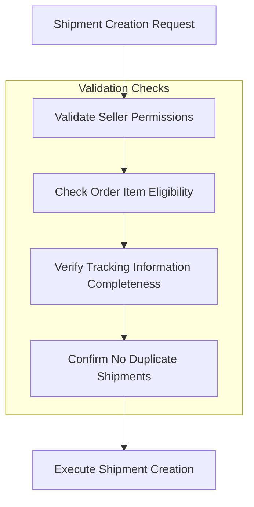

## Tracking Information Requirements

### Tracking Information Structure

Every shipment must include the following tracking information:

#### Required Tracking Fields

1. **Carrier Name (Mandatory)**
   - Type: String (free text with validation)
   - Description: The shipping carrier company name
   - Validation Rules:
     - Cannot be empty or whitespace-only
     - Maximum length: 100 characters
     - Case-insensitive storage (normalize to title case)
   - Example Values: "FedEx", "UPS", "DHL", "USPS", "Amazon Logistics"

2. **Tracking Number (Mandatory)**
   - Type: String (alphanumeric with special characters)
   - Description: The carrier's unique tracking identifier
   - Validation Rules:
     - Cannot be empty or whitespace-only
     - Maximum length: 50 characters
     - Preserve original format (preserve hyphens, spaces if carrier uses them)
     - No transformation or normalization allowed
   - Example Formats:
     - FedEx: "1Z999AA10123456784"
     - UPS: "1Z999AA10123456784"
     - USPS: "EA123456789US"
     - DHL: "123456789"

#### Optional Tracking Fields

1. **Estimated Delivery Date**
   - Type: Date/Time
   - Description: The expected delivery date provided by carrier
   - Validation Rules:
     - Must be in the future (not before shipment date)
     - Cannot be earlier than shipment date
   - Business Logic:
     - Used for customer communication and expectations
     - Does not affect system status transitions
     - Stored for reference only

2. **Shipping Method**
   - Type: String (from predefined list or free text)
   - Description: The service level chosen by seller
   - Example Values: "Standard", "Express", "Overnight", "Economy"

### Tracking Information Display Requirements

#### For Customers

When customers view shipment details, they should see:

- **Carrier Name**: Clearly displayed for carrier identification
- **Tracking Number**: Formatted for easy copying or clicking
- **Status**: Current shipment status (shipped, in transit, out for delivery, delivered)
- **Estimated Delivery**: If provided by seller/carrier
- **Track Button/Link**: Direct link to carrier's tracking page

#### For Sellers

When sellers view shipment details, they should see:

- **All Tracking Information**: Carrier, tracking number, estimated delivery
- **Creation Timestamp**: When tracking was recorded
- **Linked Order Items**: Which items are included in this shipment
- **Customer Contact Information**: For carrier support if needed
- **Shipping Costs**: Actual costs incurred by seller

### Tracking Information Management Rules

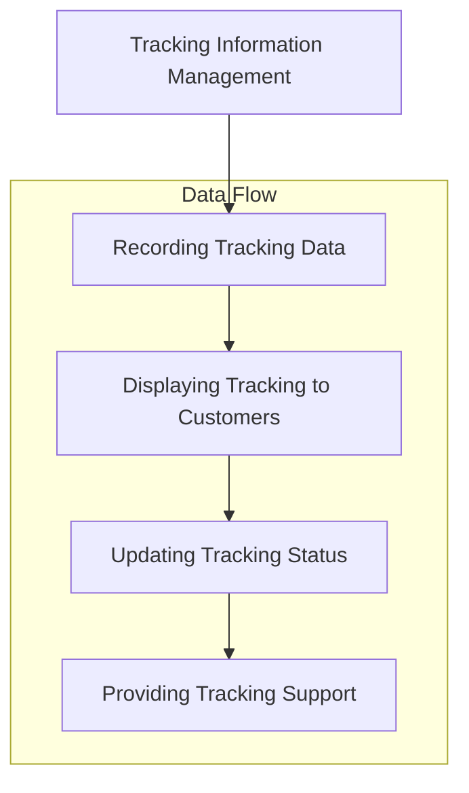

#### Recording Tracking Data

- **Once-and-Only-Once Principle**: Tracking information is recorded exactly once at shipment creation
- **No Modifications Allowed**: Once recorded, tracking data cannot be changed
- **Immutable Audit Trail**: Tracking information creates permanent record for disputes
- **Error Handling**: If incorrect tracking information is entered, create new shipment

#### Displaying Tracking to Customers

- **Immediate Availability**: Tracking information available immediately after shipment creation
- **Clear Presentation**: Display in customer-friendly format with carrier branding
- **Tracking Link**: Provide direct link to carrier's tracking page
- **Status Updates**: Show current delivery status from carrier

#### Updating Tracking Status

- **Automated Status Pull**: System may periodically fetch status from carrier API
- **Manual Status Override**: Customer or seller may update status based on real-world information
- **Status Sync Rules**:
  - "Delivered" status from carrier triggers customer delivery confirmation
  - "Out for Delivery" status triggers delivery expectation notifications
  - Status changes are logged for audit purposes

#### Providing Tracking Support

- **Customer Support**: Track a specific item through the system
- **Carrier Communication**: Provide tracking numbers to customer for carrier support
- **Dispute Resolution**: Use tracking history as evidence in delivery disputes

## Delivery Confirmation Workflow

### Delivery Confirmation Methods

Customers can confirm delivery of shipments through two methods:

1. **Manual Confirmation**: Customer explicitly confirms delivery
2. **Automatic Confirmation**: System confirms delivery after time threshold

### Manual Delivery Confirmation Process

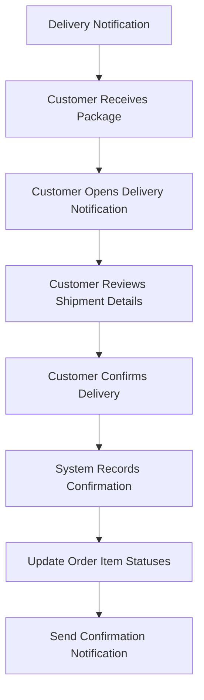

#### Step-by-Step Manual Confirmation

##### Step 1: Delivery Notification

- Customer receives notification that shipment has been delivered
- Notification may come from carrier (SMS, email) or platform app
- Notification includes tracking information and delivery confirmation

##### Step 2: Customer Receives Package

- Customer physically receives the shipment package
- Customer inspects package for damage or missing items
- Customer compares package contents to order details

##### Step 3: Access Delivery Confirmation Interface

- Customer navigates to order history in customer account
- Customer finds the delivered shipment in the order
- Customer sees "Confirm Delivery" button or option

##### Step 4: Review Shipment Details

- Customer reviews complete shipment details:
  - Carrier and tracking number
  - List of included order items
  - Expected delivery date vs actual delivery date
  - Package condition notes (if applicable)

##### Step 5: Confirm Delivery

- Customer explicitly confirms delivery through interface
- System presents confirmation prompt:
  - "Are you sure you want to confirm delivery?"
  - "Items will change to delivered status"
  - "You may now write reviews for these items"
- Customer confirms action (final approval)

##### Step 6: System Records Confirmation

- System records delivery confirmation timestamp
- System logs which customer confirmed delivery
- System creates audit trail entry
- System updates shipment status to "delivered"

##### Step 7: Update Order Item Statuses

- All order items in the shipment change status to "delivered"
- Order status is recalculated based on new item statuses
- Customer eligibility for reviews is updated
- Return/refund eligibility window begins (if applicable)

##### Step 8: Send Confirmation Notification

- Customer receives confirmation notification
- Notification summarizes delivery confirmation
- Notification may include next steps (reviews, returns)

### Automatic Delivery Confirmation Process

When customers do not manually confirm delivery, the system implements automatic confirmation:

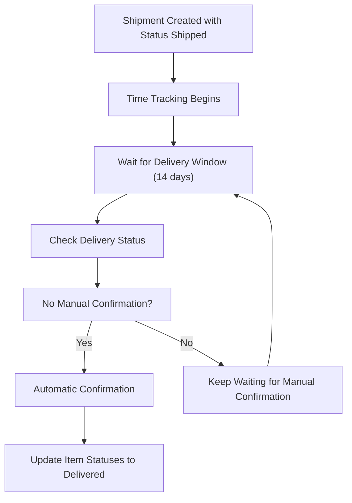

#### Automatic Confirmation Timeline

- **Standard Window**: 14 days from shipment date
- **Configurable Period**: May vary by jurisdiction or carrier
- **No Extensions**: Automatic confirmation is final
- **No Override**: Customer cannot prevent automatic confirmation after window

#### Automatic Confirmation Logic

1. **Shipment Date as Start Point**
   - Timer begins when shipment status changes to "shipped"
   - System records the exact date/time of shipment
   - This date is used for all time calculations

2. **14-Day Countdown**
   - System waits exactly 14 calendar days from shipment date
   - Includes weekends and holidays
   - No business day exclusions

3. **Status Check at Day 14**
   - At exactly 14 days, system checks for manual confirmation
   - If manual confirmation exists, use that timestamp
   - If no manual confirmation, trigger automatic confirmation

4. **Automatic Confirmation Execution**
   - System records confirmation timestamp as day 14 date/time
   - System updates all items in shipment to "delivered"
   - System treats this as final delivery confirmation
   - System creates audit trail entry

5. **Customer Notification**
   - Customer receives notification of automatic confirmation
   - Notification explains timing and implications
   - Notification may include review or return instructions

#### Automatic Confirmation Business Rules

- **Protects Customers**: Prevents indefinite waiting for delivery confirmation
- **Protects Sellers**: Prevents stale shipments from blocking operations
- **Provides Certainty**: Creates clear timeline for order closure
- **Enables Reviews**: Allows customers to write reviews after window
- **Supports Returns**: Maintains return eligibility based on confirmed date

### Delivery Confirmation Validation

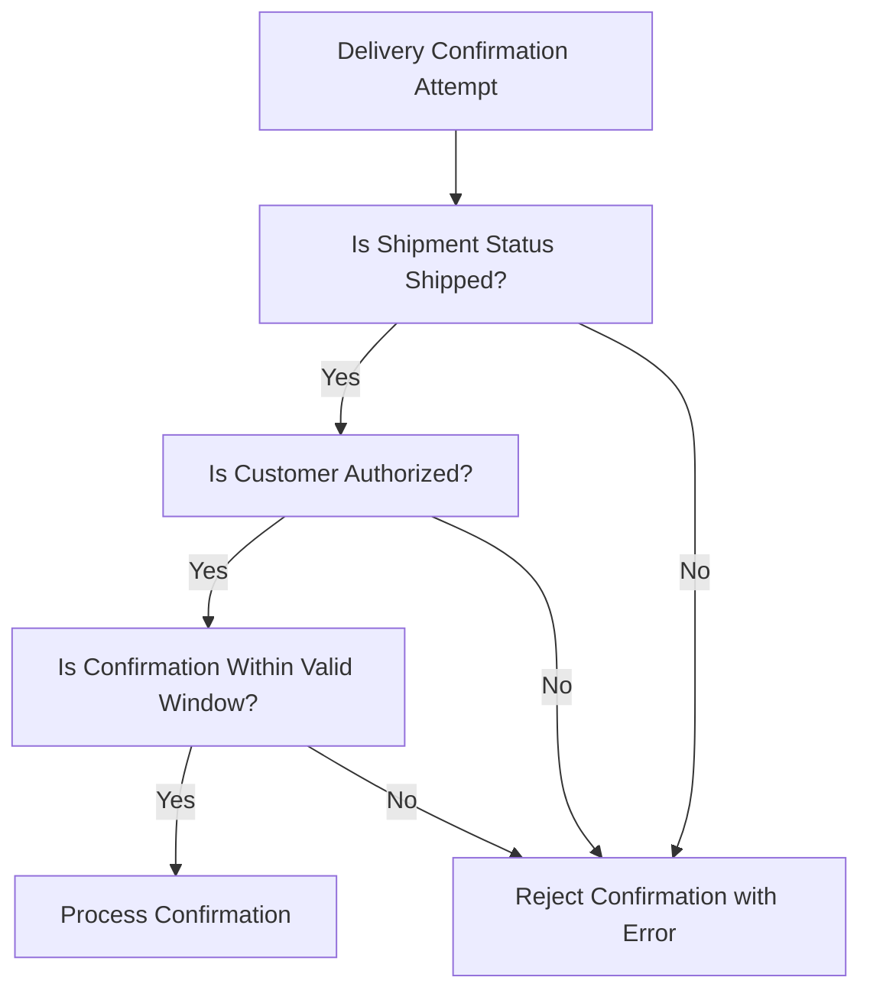

#### Validation Checks

1. **Shipment Status Validation**
   - Only shipments with status "shipped" can be confirmed
   - Already delivered shipments cannot be reconfirmed
   - Cancelled shipments cannot be confirmed

2. **Customer Authorization Validation**
   - Only the customer who placed the order can confirm delivery
   - Admins can force confirm delivery if needed
   - Cannot confirm delivery for other customers' shipments

3. **Time Window Validation**
   - Manual confirmation can happen at any time after shipment
   - Automatic confirmation only after 14 days (if manual not done)
   - No retroactive confirmations after automatic confirmation

### Delivery Confirmation Error Handling

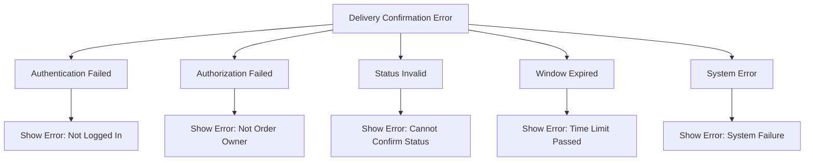

#### Common Error Scenarios

1. **Authentication Failed**
   - **Scenario**: Customer not logged in when attempting confirmation
   - **Error Message**: "Please log in to confirm delivery"
   - **Recovery**: Redirect to login, then return to confirmation

2. **Authorization Failed**
   - **Scenario**: Customer attempting to confirm someone else's delivery
   - **Error Message**: "You cannot confirm delivery for this shipment"
   - **Recovery**: Show own order history, not others

3. **Status Invalid**
   - **Scenario**: Attempting to confirm already delivered or cancelled shipment
   - **Error Message**: "This shipment has already been delivered or cancelled"
   - **Recovery**: Show shipment details with current status

4. **Window Expired**
   - **Scenario**: Attempting manual confirmation after automatic confirmation
   - **Error Message**: "Automatic delivery confirmation has already occurred"
   - **Recovery**: Show automatic confirmation timestamp

5. **System Error**
   - **Scenario**: Database error, timeout, or other technical issue
   - **Error Message**: "Delivery confirmation failed. Please try again."
   - **Recovery**: Retry mechanism, support contact information

## Shipment Status Management

### Shipment Status Definitions

#### Status: Created
- **Description**: Shipment record created, tracking information recorded
- **Timing**: Immediate upon shipment creation
- **Eligible Actions**: None (newly created)
- **Related Statuses**: Next → Shipped

#### Status: Shipped
- **Description**: Package has been handed over to carrier
- **Trigger**: Shipment creation completes (automated)
- **Timing**: At shipment creation time
- **Eligible Actions**:
  - Customer views tracking information
  - Seller can view shipment details
  - Status progresses to In Transit
- **Related Statuses**: Previous → Created, Next → In Transit

#### Status: In Transit
- **Description**: Package is moving through carrier network
- **Trigger**: Automatically detected from carrier tracking
- **Timing**: When carrier updates status to in transit
- **Eligible Actions**:
  - Customer tracks package location
  - Seller monitors delivery progress
  - Status progresses to Out for Delivery or Delivered
- **Related Statuses**: Previous → Shipped, Next → Out for Delivery/Delivered

#### Status: Out for Delivery
- **Description**: Package is with carrier for final delivery attempt
- **Trigger**: Automatically detected from carrier tracking
- **Timing**: When carrier indicates delivery attempt
- **Eligible Actions**:
  - Customer prepares for delivery
  - Customer may schedule redelivery if needed
  - Status progresses to Delivered or Delivery Attempted
- **Related Statuses**: Previous → In Transit, Next → Delivered

#### Status: Delivered
- **Description**: Package successfully delivered to customer
- **Trigger**: Customer manual confirmation OR automatic confirmation (14 days)
- **Timing**: At confirmation timestamp
- **Eligible Actions**:
  - Customer may write reviews for items
  - Customer may initiate returns if within policy
  - Order items change to delivered status
  - Status is final (no further progression)
- **Related Statuses**: Previous → Out for Delivery/In Transit/Shipped

#### Status: Delivery Attempted
- **Description**: Carrier attempted delivery but was unsuccessful
- **Trigger**: Automatically detected from carrier tracking
- **Timing**: When carrier reports delivery failure
- **Eligible Actions**:
  - Customer may schedule redelivery
  - Customer may redirect package
  - Status progresses to Delivered or Returned to Sender
- **Related Statuses**: Previous → In Transit, Next → Delivered/Returned

#### Status: Returned to Sender
- **Description**: Package returned to seller due to delivery failure
- **Trigger**: Automatically detected from carrier tracking
- **Timing**: When carrier reports return
- **Eligible Actions**:
  - Seller may reship item
  - Customer may request refund
  - Order status adjusts based on item availability
- **Related Statuses**: Previous → Delivery Attempted, Next → Shipped/Refunded

### Status Transition Matrix

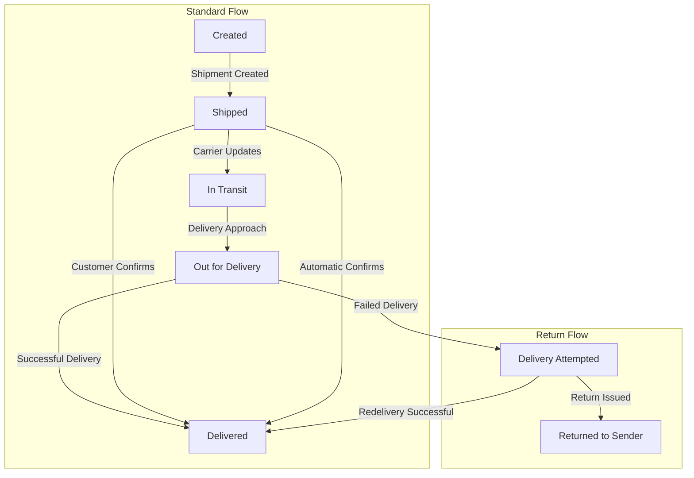

### Status Transition Rules

#### Rule 1: Linear Progression
- Most shipments follow linear progression through statuses
- Cannot skip statuses without legitimate reason
- Backward transitions are restricted

#### Rule 2: Manual Override Authority
- Customers can manually confirm delivery at any time
- Admins can force status changes for exceptional cases
- Manual overrides take precedence over automatic detection

#### Rule 3: Final State Protection
- "Delivered" and "Returned to Sender" are final states
- No further status transitions allowed from final states
- Special processes required for recovery

#### Rule 4: Concurrent Status Updates
- When shipment status changes to "delivered":
  - All order items in shipment change to "delivered"
  - Order status recalculates based on items
  - Review eligibility updates for customer
  - Return eligibility window begins

## Seller Shipping Workflows

### Seller Shipping Dashboard

#### Dashboard Overview

Sellers access shipping through their dedicated dashboard which provides:

- **Order Items Requiring Shipping**: List of paid items waiting for shipment
- **Shipment History**: All previously created shipments
- **Shipment Statistics**: Shipment volume, delivery rates, performance metrics
- **Quick Actions**: Create shipments, view tracking, update status
- **Carrier Integration**: Direct connection to shipping carriers

#### Dashboard Navigation

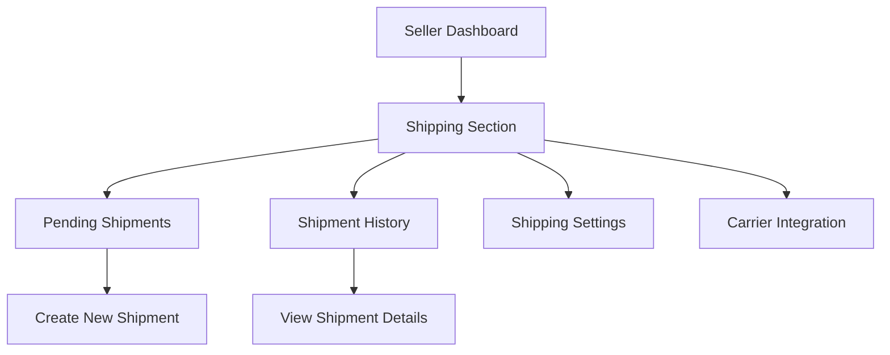

#### Pending Shipments View

This view displays order items that need shipping:

1. **Order Grouping**: Items grouped by order for easy management
2. **Status Filters**: Filter by item status (paid, shipped)
3. **Date Range**: Filter by order date range
4. **Search**: Search by order number or customer name
5. **Bulk Actions**: Mark multiple items as shipped

### Seller Shipment Creation Workflow

#### Workflow Overview

Sellers create shipments following this standardized process:

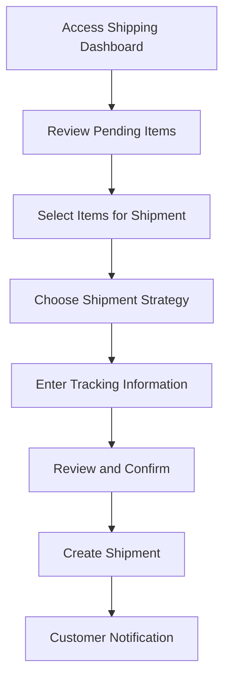

#### Detailed Seller Workflow Steps

##### Step 1: Access Shipping Dashboard

- Seller logs into seller account
- Seller navigates to shipping section
- Dashboard displays pending items requiring shipping

##### Step 2: Review Pending Items

System displays:
- Order number and customer information
- List of order items with product details
- Item quantities and prices
- Current status (paid or shipped)
- Shipping address

##### Step 3: Select Items for Shipment

Seller can:
- Select individual items for separate shipments
- Select multiple items for combined shipment
- Mark items as shipped immediately
- Choose not to ship some items (reason required)

##### Step 4: Choose Shipment Strategy

Seller selects from:
- **Individual Shipping**: One item per shipment
- **Batch Shipping**: Multiple items in one shipment
- **Partial Shipping**: Some items now, others later

##### Step 5: Enter Tracking Information

Seller provides:
- Carrier name
- Tracking number
- Optional: Estimated delivery date
- Optional: Shipping method notes

##### Step 6: Review and Confirm

Seller reviews:
- Selected items and quantities
- Tracking information accuracy
- Customer shipping address
- Total shipping costs

Seller confirms shipment creation

##### Step 7: Create Shipment

System:
- Validates all information
- Creates shipment record
- Updates order item statuses
- Generates tracking notifications

##### Step 8: Customer Notification

Customer receives:
- Email notification with tracking details
- App notification with shipment info
- Tracking link for carrier website

### Seller Shipment Management Features

#### Shipment List View

Sellers can view all their shipments with these columns:

- **Shipment ID**: Unique identifier
- **Order Number**: Associated order
- **Customer**: Customer name and contact
- **Items**: List of included items
- **Carrier**: Shipping carrier
- **Tracking Number**: Carrier tracking ID
- **Status**: Current shipment status
- **Shipping Date**: When shipment was created
- **Delivery Date**: When delivered (if delivered)
- **Actions**: Edit (if allowed), View Details, Print Label

#### Shipment Search and Filter

Sellers can search and filter shipments by:

1. **Date Range**: Shipments created in specific period
2. **Status**: Filter by current status
3. **Carrier**: Filter by shipping carrier
4. **Customer**: Search by customer name
5. **Order Number**: Search by order
6. **Tracking Number**: Search by tracking ID

#### Shipment Details View

When seller views shipment details, they see:

- **Basic Information**:
  - Shipment ID and status
  - Creation date and time
  - Carrier and tracking number
  - Shipping address

- **Order Items**:
  - Complete list of items in shipment
  - Product names and variant details
  - Quantities and prices

- **Tracking Information**:
  - All tracking data entered at creation
  - Status history and timestamps
  - Estimated delivery date

- **Customer Information**:
  - Customer name and contact details
  - Delivery confirmation status
  - Delivery confirmation timestamp

- **Actions**:
  - Add tracking (if carrier integration supports)
  - Contact carrier support
  - Print shipping label
  - View related order

### Seller Shipping Performance Metrics

#### Key Performance Indicators

Sellers can monitor these shipping metrics:

1. **Shipment Volume**:
   - Total shipments created (monthly, quarterly, annually)
   - Average items per shipment
   - Shipment growth trends

2. **Delivery Performance**:
   - Delivery confirmation rate
   - Average delivery time
   - Delivery success rate

3. **Customer Satisfaction**:
   - Delivery-related complaints
   - Review ratings related to shipping
   - Return rate by shipping carrier

4. **Cost Efficiency**:
   - Average shipping cost per shipment
   - Carrier cost comparison
   - Shipping cost as percentage of order value

### Seller Shipping Rules and Constraints

#### Rule 1: Seller Authorization
- Only the seller who created the order items can create shipments
- Sellers cannot ship items from other sellers' orders
- Admins can create shipments for any order if necessary

#### Rule 2: Item Status Requirements
- Only items with status "paid" can be included in shipments
- Items already shipped cannot be added to new shipments
- Items cancelled or refunded cannot be shipped

#### Rule 3: One-Shipment-Per-Seller Rule
- Items from same seller can be combined in one shipment
- Items from different sellers must be in separate shipments
- Order items grouped logically by seller

#### Rule 4: Tracking Information Integrity
- All tracking information must be accurate and valid
- Tracking numbers must belong to specified carrier
- False tracking information may result in penalties

#### Rule 5: No Shipment Modification
- Once shipment is created, tracking information cannot be changed
- If tracking error occurs, create new shipment with corrected info
- Original shipment record remains for audit trail

## Customer Shipping Experience

### Shipping Notifications

#### Notification Types

Customers receive shipping notifications throughout the delivery process:

1. **Shipment Created Notification**
   - When seller creates shipment
   - Includes tracking information
   - Estimated delivery date if provided

2. **Shipment In Transit Notification**
   - When carrier updates status
   - Package location information
   - Expected delivery timeline

3. **Out for Delivery Notification**
   - When carrier indicates delivery attempt
   - Day-of delivery expectation
   - Customer preparation reminders

4. **Delivery Confirmation Request**
   - When package is delivered
   - Request for customer confirmation
   - Next steps (reviews, returns)

5. **Automatic Delivery Confirmation**
   - If customer does not manually confirm
   - 14-day window explanation
   - Next steps and timeline

#### Notification Channels

Customers receive notifications through:

- **Email**: Primary notification channel
- **SMS**: Delivery-critical notifications
- **App Push**: Real-time updates in customer app
- **Account Dashboard**: All notifications in notification center

### Customer Tracking Page

#### Tracking Page Access

Customers can access tracking information through:

1. **Order History Page**:
   - View all shipments for their orders
   - Click on shipment to view details
   - Direct tracking link to carrier website

2. **Dedicated Tracking Page**:
   - Single page showing all active shipments
   - Real-time tracking status updates
   - Carrier map view of package location

3. **Notification Links**:
   - Click tracking links in email notifications
   - Direct to specific shipment details
   - Preserves customer context

#### Tracking Page Display

The tracking page shows:

1. **Basic Shipment Information**:
   - Tracking number and carrier
   - Estimated delivery date
   - Current status and status description
   - Shipping address

2. **Package Progress**:
   - Visual timeline of status changes
   - Status history with timestamps
   - Estimated delivery timeline

3. **Order Items**:
   - List of items in this shipment
   - Product names and variant details
   - Quantities included

4. **Action Buttons**:
   - Contact carrier (if supported)
   - Track on carrier website
   - Request delivery changes (if carrier supports)
   - Report delivery issue

### Customer Delivery Confirmation Interface

#### Accessing Confirmation

Customers access delivery confirmation through:

1. **Order History**:
   - Navigate to specific order
   - Find shipped item section
   - See "Confirm Delivery" option

2. **Notification Links**:
   - Click confirmation request in email
   - Direct to confirmation page
   - Pre-filled with shipment details

3. **Dedicated Confirmation Page**:
   - Shows pending confirmations
   - Select shipments to confirm
   - Bulk confirmation option

#### Confirmation Page Elements

The confirmation page displays:

1. **Shipment Summary**:
   - Carrier and tracking number
   - Expected vs actual delivery date
   - Package condition notes (if any)

2. **Item Details**:
   - List of items in shipment
   - Product names and quantities
   - Total item value

3. **Confirmation Prompt**:
   - "Have you received this package?"
   - "Confirming delivery allows you to:
     - Write product reviews
     - Request returns/refunds
     - Complete your purchase journey"

4. **Actions**:
   - "Confirm Delivery" button (primary)
   - "Report Issue" button (if problem)
   - "Cancel" button (no action taken)

#### Confirmation Process Flow

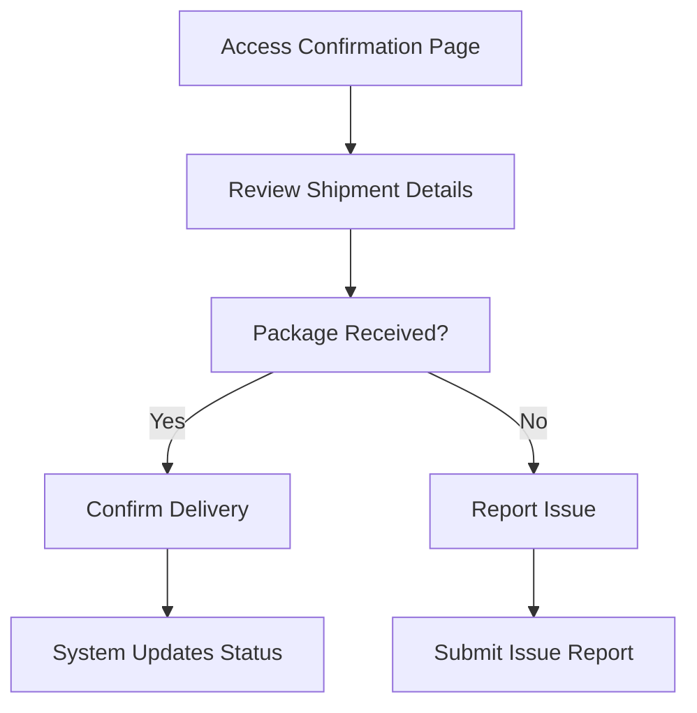

## Automatic Delivery Handling

### Automatic Confirmation Logic

#### 14-Day Automatic Confirmation Window

When customers do not manually confirm delivery, the system implements automatic confirmation after 14 days:

#### Window Calculation

- **Start Point**: Shipment creation timestamp
- **Duration**: 14 calendar days (including weekends/holidays)
- **Check Time**: Exactly at 14-day mark
- **Fallback**: Use shipment status change to "shipped" if creation timestamp unavailable

#### Logic Flow

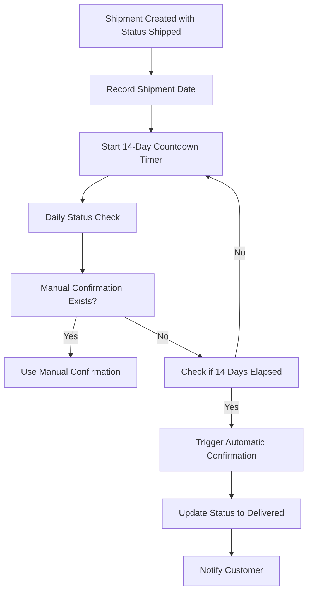

#### Implementation Considerations

##### 1. Time Zone Handling
- Use UTC for consistent timestamp storage
- Display local time to customers based on account settings
- Calculate 14-day window in UTC
- Handle daylight saving time transitions

##### 2. Leap Year and Month Handling
- 14 days = exactly 14×24 hours
- No special handling for month boundaries
- No business day exclusions

##### 3. System Reliability
- Background job for daily checks
- Retry logic for failed checks
- Manual override capability
- Alert system for monitoring failures

### Automatic Confirmation Business Rules

#### Rule 1: Finality
- Automatic confirmation is as valid as manual confirmation
- Cannot be reversed or overridden after execution
- Creates binding delivery record

#### Rule 2: Customer Rights Preserved
- Return eligibility based on automatic confirmation date
- Review eligibility begins after automatic confirmation
- Customer retains all rights as if manual confirmation occurred

#### Rule 3: Notification Requirement
- Customer must be notified of automatic confirmation
- Notification includes timing explanation
- Notification explains next steps (reviews, returns)

#### Rule 4: Admin Override
- Administrators can manually confirm delivery before automatic
- Administrators can prevent automatic confirmation if investigation needed
- Audit trail maintained for all overrides

### Automatic Confirmation Scheduler

#### Daily Batch Processing

Automatic confirmation runs as a daily batch job:

1. **Execution Time**: 02:00 UTC daily
2. **Scope**: All shipments with status "shipped" or "in transit"
3. **Filter**: Shipment created ≥14 days ago without manual confirmation
4. **Processing**: Process each eligible shipment
5. **Logging**: Record all automatic confirmations for audit
6. **Error Handling**: Handle failures gracefully with retry logic

#### Batch Processing Workflow

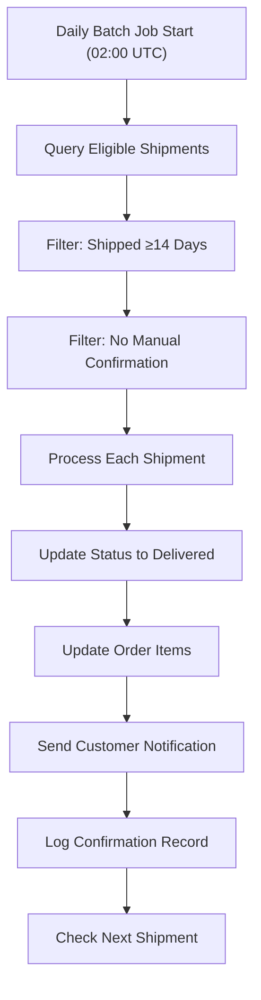

#### Error Handling and Recovery

##### Partial Failure Handling
- If some shipments fail, process remaining shipments
- Log specific failures with detailed error information
- Enable manual reprocessing of failed shipments
- Alert system administrators of failures

##### Manual Recursion
- Administrators can manually trigger automatic confirmation
- Can process single shipments or batches
- Can view failure history and retry

### Automatic Confirmation Monitoring

#### System Monitoring

The automatic confirmation system is monitored through:

1. **Job Success Rate**:
   - Percentage of eligible shipments processed
   - Target: >99.9% success rate
   - Alerts if below threshold

2. **Processing Volume**:
   - Daily count of automatic confirmations
   - Weekly/Monthly trends
   - Anomaly detection for unusual volumes

3. **Error Log Analysis**:
   - Weekly review of error patterns
   - Automated alerts for new error types
   - Regular log cleanup and archiving

#### Customer Communication

Customers receive clear communication about automatic confirmation:

- **Pre-emptive Notification**: Explanation of 14-day window in terms
- **Pre-Automatic Notification**: Warning before automatic confirmation
- **Post-Automatic Notification**: Confirmation of automatic confirmation

### Automatic Confirmation Edge Cases

#### Edge Case 1: Future-Dated Shipments
- **Scenario**: Shipment date in future
- **Solution**: Use actual shipping date, not creation date
- **Implementation**: Start countdown when status changes to "shipped"

#### Edge Case 2: Time Zone Differences
- **Scenario**: Customer in different time zone from system
- **Solution**: Use UTC for all calculations
- **Display**: Convert to customer's local time for visibility

#### Edge Case 3: Simultaneous Manual and Automatic
- **Scenario**: Customer confirms at same time as automatic
- **Solution**: First confirmation wins (database atomic operations)
- **Logging**: Record both attempts with timestamps

#### Edge Case 4: System Maintenance Window
- **Scenario**: Batch job cannot run during maintenance
- **Solution**: Extend 14-day window by maintenance duration
- **Logging**: Document all extended windows

## Business Rules and Constraints

### Critical Business Rules

#### Rule 1: One Shipment Per Seller Per Order Group
- Items from same seller can be combined in one shipment
- Items from different sellers must be in separate shipments
- Orders with items from multiple sellers create multiple shipments

#### Rule 2: Shipping Address Immutability
- Once shipment is created, shipping address cannot be changed
- Address is frozen at shipment creation time
- Correct address requires new shipment creation

#### Rule 3: Tracking Information Immutability
- Tracking information cannot be modified after shipment creation
- If tracking error occurs, create new shipment with correct info
- Original shipment record preserved for audit trail

#### Rule 4: Delivery Confirmation Finality
- Manual confirmation is permanent
- Automatic confirmation (14-day) is permanent
- Cannot be reversed or overridden after confirmation

#### Rule 5: Status Transition Constraints
- Only authorized actors can trigger status changes
- Status transitions follow predefined sequence
- Invalid transitions are rejected

### Business Logic Constraints

#### Constraint 1: Shipment Creation Prerequisites
- Shipment can only be created if items have status "paid"
- Items already shipped cannot be added to new shipments
- Items cancelled or refunded cannot be shipped

#### Constraint 2: Automatic Confirmation Triggers
- Automatic confirmation only after 14-day window
- Automatic confirmation only if no manual confirmation exists
- Manual confirmation takes precedence over automatic

#### Constraint 3: Status Transition Validation
- Only valid status transitions allowed
- Each transition may have specific authorization requirements
- Invalid transitions logged and rejected

#### Constraint 4: Customer Rights Preservation
- Return eligibility based on confirmed delivery date
- Review eligibility begins after delivery confirmation
- Customer rights protected regardless of confirmation method

### Business Rule Enforcement

#### Rule 1: Authorization Validation
- Every action requires role-based authorization check
- System enforces seller-only shipment creation
- Admin override logging required

#### Rule 2: Status Validation
- Every status change validates current status and next status
- Invalid transitions rejected with specific error messages
- Status history preserved for audit

#### Rule 3: Data Integrity
- Shipping address locked at shipment creation
- Tracking information immutable after recording
- Confirmation timestamps cannot be altered

#### Rule 4: Business Logic Validation
- Shipment creation validates all prerequisites
- Automatic confirmation validates time windows
- Customer rights validated against business policies

### Error Handling Business Rules

#### Error 1: Shipment Creation Failure
- **Cause**: Missing tracking information, invalid item status
- **Response**: Detailed error message with specific issue
- **Recovery**: User corrects information and retries

#### Error 2: Status Transition Failure
- **Cause**: Invalid status change, unauthorized actor
- **Response**: Error message explaining why transition failed
- **Recovery**: User contacts admin or corrects status

#### Error 3: Automatic Confirmation Failure
- **Cause**: System error during batch processing
- **Response**: Retry mechanism, administrator alert
- **Recovery**: Manual processing or extended window

#### Error 4: Confirmation Failure
- **Cause**: Customer not authorized, invalid shipment status
- **Response**: Clear error message with explanation
- **Recovery**: User selects correct shipment or contacts support

### Audit and Compliance Requirements

#### Audit Trail Requirements

1. **Shipment Creation**:
   - Timestamp of creation
   - Seller who created shipment
   - Tracking information provided
   - Order items included

2. **Status Changes**:
   - Timestamp of each status change
   - Actor who triggered change
   - Previous and new status values
   - Reason for change (if provided)

3. **Delivery Confirmations**:
   - Manual confirmation timestamp and actor
   - Automatic confirmation timestamp and mechanism
   - Notification history

4. **Shipping Data Changes**:
   - Any changes to shipping information
   -Actor responsible for change
   - Reason for change (if applicable)

#### Data Retention Requirements

- Shipment records retained for minimum 7 years (legal compliance)
- Tracking information preserved permanently for audit
- Delivery confirmation records retained indefinitely
- Status history preserved for entire retention period

#### Compliance Requirements

- GDPR: Customer data protection in shipping context
- CCPA: California resident data rights
- Consumer Rights Act: Delivery confirmation requirements
- Industry standards: Tracking format compliance

## Summary

This shipping and tracking requirements document provides comprehensive specifications for implementing the e-commerce platform's shipment management system.

### Key Implementation Priorities

1. **Shipment Creation Workflow**:
   - Implement seller shipping dashboard
   - Enable tracking information entry
   - Support item grouping and batching
   - Ensure status synchronization

2. **Tracking Information System**:
   - Design immutable tracking data structure
   - Implement status monitoring from carriers
   - Create customer-facing tracking pages
   - Ensure data integrity and audit trails

3. **Delivery Confirmation System**:
   - Build manual confirmation interface
   - Implement 14-day automatic confirmation logic
   - Design notification infrastructure
   - Ensure status synchronization

4. **Status Management Engine**:
   - Implement status transition rules
   - Create business rule validation
   - Design status history tracking
   - Build audit trail infrastructure

5. **Seller and Customer Experiences**:
   - Design seller shipping dashboard
   - Create customer tracking pages
   - Implement notification system
   - Build reporting and analytics

### Technical Implementation Notes

- Use job schedulers for automatic confirmation processing
- Implement real-time status updates with carrier APIs
- Design scalable notification infrastructure
- Create comprehensive audit logging
- Build admin override capabilities

This system will enable robust, compliant, and customer-friendly shipping management that supports the platform's e-commerce operations.

> *Developer Note: This document defines **business requirements only**. All technical implementations (architecture, APIs, database design, etc.) are at the discretion of the development team.