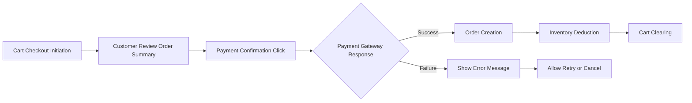
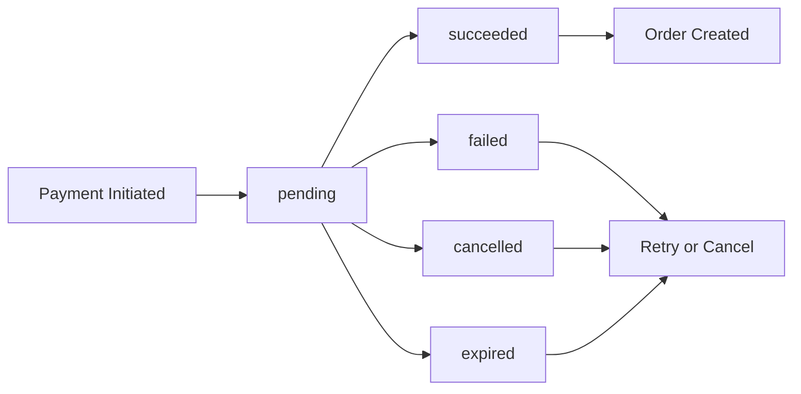
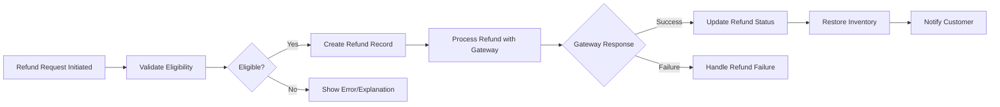

# Payment Processing Requirements

## Payment Processing Overview

### Payment Process Flow



### Payment Processing Business Model

#### Business Logic

- **Payment Timing**: Payment is processed after order review but before order creation
- **Payment Gateway**: External payment gateway integration (specific provider not specified)
- **Payment States**: Payment can succeed or fail - no partial or pending states
- **Order Creation Dependency**: Orders are only created upon successful payment
- **Payment Retry**: Payment failures allow customers to retry or abandon the order

#### Critical Business Rules

- **Atomic Transaction**: Payment processing and order creation must be atomic
- **No Partial Payments**: Each payment attempt is all-or-nothing for the order total
- **Immediate Confirmation**: Successful payment must be confirmed before proceeding
- **Error Handling**: Payment failures must provide clear error information to customers

## Payment Gateway Integration Requirements

### Payment Gateway Interface

#### API Integration

- **Payment Gateway Provider**: External third-party payment gateway (integration details to be determined by development team)
- **API Communication**: HTTPS-based API calls with appropriate authentication
- **Request Data**: Order details, customer information, payment method token
- **Response Data**: Success/failure status, transaction ID, error codes

#### Integration Requirements

- **Secure Communication**: All payment gateway communications must use HTTPS
- **Tokenization**: Payment method details must be tokenized (credit card numbers, bank account info)
- **PCI Compliance**: System must maintain PCI DSS compliance through third-party gateway
- **Webhook Configuration**: Payment status updates via webhooks (if supported by gateway)

#### Error Handling Integration

- **Network Errors**: Handle timeout, connection refused, and network unavailable errors
- **Gateway Errors**: Handle gateway-specific error codes and messages
- **Validation Errors**: Validate payment request data before sending to gateway
- **Retry Logic**: Implement appropriate retry mechanisms for transient failures

### Payment Method Support

#### Supported Payment Methods

- **Credit/Debit Cards**: Major card networks (Visa, MasterCard, American Express, etc.)
- **Digital Wallets**: Apple Pay, Google Pay (if supported by gateway)
- **Bank Transfers**: Direct bank transfers (if supported by gateway)
- **Local Payment Methods**: Region-specific payment methods (based on gateway capabilities)

#### Payment Method Validation

- **Card Validation**: Validate card number format, expiry date, CVV
- **Billing Information**: Collect and validate billing address information
- **Customer Information**: Collect shipping and contact information
- **Data Security**: Never store full card numbers or sensitive payment data

## Payment Status Management

### Payment States

#### Payment Status Definitions

| Payment State | Description | Action Required |
|---------------|-------------|----------------|
| `pending` | Payment initiated, awaiting gateway response | Wait for gateway confirmation |
| `succeeded` | Payment successfully processed | Proceed to order creation |
| `failed` | Payment processing failed | Allow customer retry or cancellation |
| `cancelled` | Payment cancelled by customer | Return to cart review |
| `expired` | Payment attempt expired | Allow new payment attempt |

#### Payment Status Transitions



### Payment Data Management

#### Payment Record Structure

- **Payment ID**: Unique identifier for payment tracking
- **Order ID**: Reference to associated order
- **Amount**: Payment amount in smallest currency unit
- **Currency**: ISO 4217 currency code
- **Payment Method**: Type and tokenized reference
- **Customer Information**: Email, name, billing address
- **Transaction ID**: Payment gateway transaction reference
- **Status**: Current payment state
- **Timestamps**: Created, processed, updated times
- **Response Data**: Gateway response details and error codes

#### Payment Audit Trail

- **All Payment Attempts**: Record every payment attempt regardless of outcome
- **Gateway Responses**: Store full gateway responses for audit and debugging
- **Error Details**: Capture error codes, messages, and stack traces
- **Customer Actions**: Log customer-initiated payment actions

## Payment Failure Handling

### Failure Categories

#### Technical Failures

- **Network Errors**: Connection timeouts, DNS failures, network unavailability
- **Gateway Errors**: Payment gateway service unavailable, maintenance downtime
- **Validation Errors**: Invalid payment method, insufficient funds, card declined
- **System Errors**: Internal application errors during payment processing

#### Customer Failures

- **Cancelled Payments**: Customer initiated payment cancellation
- **Expired Sessions**: Payment session timeout before completion
- **Browser Back**: Customer navigated away during payment process
- **Payment Abandonment**: Customer stopped payment process

### Failure Response Actions

#### Customer-Facing Responses

1. **Clear Error Messages**: Provide understandable error information
2. **Retry Options**: Allow customers to attempt payment again
3. **Alternative Methods**: Suggest different payment methods if applicable
4. **Support Contact**: Provide support contact information
5. **Session Recovery**: Maintain cart state and allow continuation

#### System Responses

1. **Error Logging**: Record detailed error information for debugging
2. **Alerting**: Trigger alerts for critical system failures
3. **Recovery Procedures**: Implement automatic recovery for transient failures
4. **Cleanup**: Remove incomplete payment records when appropriate

#### Retry Logic

- **Automated Retries**: Implement retry for transient network failures (max 2 attempts)
- **Delay Between Retries**: 1-2 second delay between retry attempts
- **Exponential Backoff**: Use exponential backoff for network-related failures
- **Manual Retry**: Allow unlimited customer-initiated payment retries

### Error Code Standardization

#### Payment Gateway Error Codes

| Error Code Category | Example Codes | Customer Message |
|---------------------|---------------|------------------|
| Network Errors | TIMEOUT, CONNECTION_REFUSED | "Network error. Please try again." |
| Authentication Errors | INVALID_API_KEY, AUTH_FAILED | "Payment processing error. Contact support." |
| Card Decline | CARD_DECLINED, INSUFFICIENT_FUNDS | "Payment declined. Please check card details." |
| Validation Errors | INVALID_CARD_NUMBER, EXPIRED_CARD | "Invalid card information. Please check and try again." |
| Gateway Errors | GATEWAY_UNAVAILABLE, MAINTENANCE | "Payment service temporarily unavailable. Please try again later." |

## Refund Processing

### Refund Business Rules

#### Refund Eligibility

- **Order Status**: Refunds can only be processed for completed orders
- **Time Limit**: Refund requests must be made within specified timeframe (e.g., 30 days)
- **Product Condition**: Physical goods may require return confirmation
- **Digital Goods**: May have different refund policies
- **Final Sale Items**: Special items may be non-refundable

#### Refund Authorization

- **Customer Initiated**: Customers request refunds through order management
- **Seller Initiated**: Sellers can issue refunds for valid reasons
- **Admin Initiated**: Administrators can force refunds for dispute resolution
- **Automated Refunds**: System refunds for order cancellations

### Refund Processing Flow

#### Refund Request Flow



#### Refund Types

| Refund Type | Process | Timeframe |
|-------------|---------|----------|
| Full Refund | Refund entire payment amount | Standard processing |
| Partial Refund | Refund portion of payment | Standard processing |
| Exchange Refund | Refund for product exchange | Standard processing |
| Shipping Refund | Refund shipping costs only | May differ from product refund |

### Refund Documentation Requirements

#### Refund Record Structure

- **Refund ID**: Unique identifier for refund tracking
- **Payment ID**: Reference to original payment
- **Order ID**: Reference to associated order
- **Amount**: Refund amount in smallest currency unit
- **Currency**: ISO 4217 currency code
- **Refund Reason**: Text description of refund justification
- **Refund Type**: Full/partial/exchange/shipping
- **Status**: Pending, processing, completed, failed
- **Gateway Transaction ID**: Refund transaction reference
- **Requested By**: User ID of person requesting refund
- **Processed By**: User ID of person processing refund
- **Timestamps**: Requested, processed, updated times

#### Audit and Compliance

- **Refund History**: Complete record of all refund attempts
- **Approval Trail**: Document all approval steps
- **Business Justification**: Record business reasons for refunds
- **Tax Implications**: Handle tax adjustments for refunds
- **Reporting**: Generate refund reports for accounting

### Automated Refund Scenarios

#### System-Automated Refunds

- **Order Cancellation**: Automatic refund when orders are cancelled
- **Return Processing**: Refunds processed upon return receipt
- **Shipping Issues**: Refunds for shipping problems or delays
- **Price Adjustments**: Refunds for pricing errors or promotions
- **Service Issues**: Refunds for service failures

#### Refund Automation Triggers

| Trigger Condition | Action | Timeline |
|-------------------|--------|----------|
| Order cancellation request approved | Issue refund | Immediate |
| Return item received and verified | Issue refund | Within 24 hours |
| Shipping delay beyond guarantee | Issue shipping refund | Manual review |
| Product not as described | Issue full refund | Customer discretion |

## Payment and Refund Integration Scenarios

### Complete Payment Workflow

#### Customer Purchase Flow

1. **Cart Review**: Customer reviews cart items and totals
2. **Shipping Selection**: Customer selects shipping address and method
3. **Payment Selection**: Customer chooses payment method
4. **Payment Initiation**: System prepares payment request
5. **Gateway Communication**: Payment request sent to gateway
6. **Gateway Response**: System receives payment confirmation
7. **Order Creation**: Successful payment triggers order creation
8. **Post-Processing**: Inventory deduction, email notifications

#### Technical Implementation Points

- **Payment Request Data**:
  ```json
  {
    "amount": 19999,
    "currency": "USD",
    "description": "Order #12345 Purchase",
    "customer_email": "customer@example.com",
    "customer_ip": "192.168.1.1",
    "payment_method_token": "pm_abc123",
    "metadata": {
      "order_id": "12345",
      "customer_id": "cust_67890"
    }
  }
  ```

- **Payment Response Data**:
  ```json
  {
    "status": "succeeded",
    "transaction_id": "txn_123456789",
    "payment_id": "pay_987654321",
    "amount": 19999,
    "currency": "USD",
    "created_at": "2026-02-12T12:30:00Z",
    "metadata": {
      "order_id": "12345"
    }
  }
  ```

#### Error Handling Points

- **Network Timeout**: Retry logic with exponential backoff
- **Gateway Unavailable**: Display maintenance message, queue payment for retry
- **Invalid Payment Method**: Validate before gateway call, show specific error
- **Insufficient Funds**: Clear customer message, suggest alternative payment
- **System Error**: Log detailed error, provide user-friendly message

### Complete Refund Workflow

#### Customer Refund Request Flow

1. **Refund Request Initiation**: Customer requests refund through order interface
2. **Eligibility Validation**: System validates refund eligibility
3. **Admin Review**: Refund request reviewed by seller/admin
4. **Approval/Rejection**: Decision made and communicated
5. **Refund Processing**: Approved refund processed through gateway
6. **Completion Notification**: Customer notified of refund status
7. **Inventory Restoration**: Product inventory restored

#### Technical Implementation Points

- **Refund Request Data**:
  ```json
  {
    "order_id": "12345",
    "items": ["item_1", ""item_2"],
    "amount": 19999,
    "reason": "Product not as described",
    "customer_note": "The item is defective and doesn't work properly.",
    "requested_by": "cust_67890"
  }
  ```

- **Refund Processing Data**:
  ```json
  {
    "payment_id": "pay_987654321",
    "amount": 19999,
    "currency": "USD",
    "reason": "Customer refund request approved",
    "metadata": {
      "refund_id": "ref_abcdef123",
      "order_id": "12345",
      "processed_by": "admin_123"
    }
  }
  ```

- **Refund Response Data**:
  ```json
  {
    "status": "succeeded",
    "refund_id": "ref_abcdef123",
    "transaction_id": "refund_987654321",
    "amount": 19999,
    "currency": "USD",
    "created_at": "2026-02-12T14:30:00Z",
    "metadata": {
      "refund_id": "ref_abcdef123"
    }
  }
  ```

### Integration Testing Scenarios

#### Payment Integration Tests

1. **Success Path**: Complete payment flow with valid payment method
2. **Failure Path**: Payment failure with appropriate error handling
3. **Network Timeout**: Payment gateway timeout and retry logic
4. **Gateway Maintenance**: Gateway unavailable scenario
5. **Invalid Payment Method**: Card number validation errors
6. **Insufficient Funds**: Card decline scenario
7. **Duplicate Payment**: Prevent duplicate payment processing
8. **Concurrent Payments**: Handle multiple payment attempts simultaneously

#### Refund Integration Tests

1. **Full Refund**: Complete refund of payment amount
2. **Partial Refund**: Partial refund of payment amount
3. **Multiple Refunds**: Multiple refunds for same payment
4. **Refund Timing**: Refund processing time validation
5. **Refund Reversal**: Reverse incorrect refund
6. **Refund with Order**: Refund for order with multiple items
7. **Refund Failure**: Refund processing failure handling
8. **Inventory Restoration**: Verify inventory restoration after refund

## Payment Security Requirements

### Data Security

#### Payment Data Protection

- **PCI DSS Compliance**: Maintain compliance through third-party gateway
- **Tokenization**: Tokenize all payment method information
- **Encryption**: Encrypt payment data in transit and at rest
- **Access Control**: Restrict payment data access to authorized personnel
- **Audit Logging**: Log all payment data access and modifications

#### Sensitive Data Handling

- **Card Data**: Never store full card numbers, CVV, or PINs
- **Authentication Data**: Never store authentication data after authorization
- **Customer Data**: Securely store customer payment preferences
- **Transaction Data**: Securely store payment transaction records

### Fraud Prevention

#### Fraud Detection Measures

- **Velocity Checking**: Limit payment attempts from same source
- **Address Verification**: Validate billing address against card records
- **CVV Verification**: Require CVV for card-not-present transactions
- **Geolocation**: Flag transactions from unusual locations
- **Behavioral Analysis**: Monitor for anomalous payment patterns

#### Fraud Response

- **Suspicious Activity**: Flag and review suspicious payment patterns
- **Manual Review**: Escalate high-risk transactions for manual review
- **Block Suspicious**: Temporarily block suspected fraudulent accounts
- **Report Fraud**: Report fraud to relevant authorities and payment networks

## Payment Reporting and Analytics

### Payment Reporting Requirements

#### Daily Payment Reports

- **Total Payment Volume**: Daily payment total amount
- **Transaction Count**: Daily payment transaction count
- **Success Rate**: Daily payment success percentage
- **Failed Transactions**: List of failed payment attempts
- **Refund Summary**: Daily refund totals and counts

#### Business Intelligence

- **Revenue Analytics**: Revenue by time period, product category, customer segment
- **Payment Method Mix**: Usage distribution by payment method
- **Customer Payment Behavior**: Payment patterns and preferences
- **Geographic Analysis**: Payment distribution by location
- **Performance Metrics**: Payment processing time and success rates

### Audit and Compliance Reporting

#### Financial Audit Requirements

- **Payment History**: Complete payment transaction history
- **Refund History**: Complete refund transaction history
- **Dispute Records**: Payment dispute and chargeback documentation
- **Regulatory Reporting**: Tax and financial regulatory reporting data
- **Data Retention**: Maintain payment data per regulatory requirements

#### Compliance Documentation

- **PCI Compliance**: Documentation of PCI DSS compliance
- **Tax Compliance**: Sales tax calculation and reporting records
- **Anti-Money Laundering**: AML compliance documentation
- **Consumer Protection**: Consumer rights and dispute resolution records

## Implementation Considerations

### Technology Stack Recommendations

#### Payment Gateway Selection Criteria

- **Global Coverage**: Support for international payments
- **Payment Method Support**: Support for required payment methods
- **API Quality**: Comprehensive, well-documented API
- **Sandbox Environment**: Free testing environment
- **Reputation**: Proven track record and reliability
- **Fees**: Competitive transaction fees and structure
- **Support**: Technical support and merchant services

#### Technology Integration Patterns

- **SDK Integration**: Use official payment gateway SDKs
- **API Integration**: Direct REST API integration for maximum control
- **Webhook Configuration**: Configure webhooks for status updates
- **Callback URLs**: Set up callback URLs for asynchronous updates
- **Retry Configuration**: Configure appropriate retry policies

### Development Guidelines

#### Code Implementation Standards

- **Error Handling**: Comprehensive error handling for all payment operations
- **Logging**: Detailed logging for all payment activities
- **Testing**: Extensive testing including edge cases and failure scenarios
- **Security**: Follow security best practices for payment processing
- **Performance**: Optimize for payment processing speed and reliability

#### Code Quality Requirements

- **Code Review**: Mandatory code review for payment processing modules
- **Unit Testing**: 100% code coverage for payment logic
- **Integration Testing**: Comprehensive integration testing
- **Security Scanning**: Regular security vulnerability scanning
- **Performance Testing**: Load testing for payment processing capacity

### Deployment Considerations

#### Environment Setup

- **Development**: Use payment gateway sandbox environment
- **Testing**: Comprehensive testing in staging environment
- **Production**: Secure production environment with monitoring
- **Backup**: Regular backup of payment data
- **Disaster Recovery**: Plan for payment processing failures

#### Monitoring and Alerting

- **Payment Success Rate**: Monitor for unusual payment success rate changes
- **Gateway Availability**: Monitor payment gateway service status
- **Error Patterns**: Alert on recurring payment errors
- **Performance Degradation**: Monitor payment processing time
- **Security Events**: Alert on potential security incidents

## Summary

This payment processing requirements document provides comprehensive specifications for integrating payment functionality into the e-commerce platform. The system must handle payment processing, refund management, and error handling with robust error handling, security, and compliance capabilities.

### Key Requirements Recap

- **Payment Gateway Integration**: External payment gateway integration with comprehensive error handling
- **Payment Status Management**: Complete payment state tracking and management
- **Refund Processing**: Full refund lifecycle management with automated scenarios
- **Security Compliance**: PCI DSS compliance and fraud prevention measures
- **Error Handling**: Comprehensive error handling for all payment scenarios
- **Reporting and Analytics**: Payment reporting and business intelligence capabilities

### Next Steps for Development Team

1. **Payment Gateway Selection**: Choose appropriate payment gateway provider
2. **Integration Design**: Design payment integration architecture
3. **Security Implementation**: Implement payment security measures
4. **Testing Strategy**: Develop comprehensive payment testing strategy
5. **Deployment Plan**: Create payment system deployment plan

The development team has full autonomy over the technical implementation approach, including technology stack selection, architecture design, and detailed implementation patterns. This document provides business requirements only; all technical implementation decisions are at the discretion of the development team based on business needs and technical constraints.