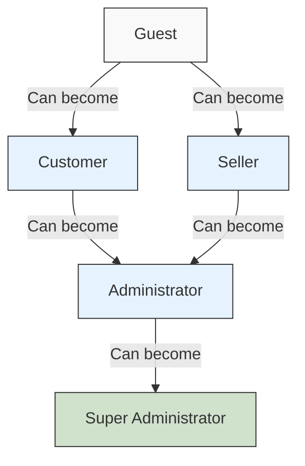
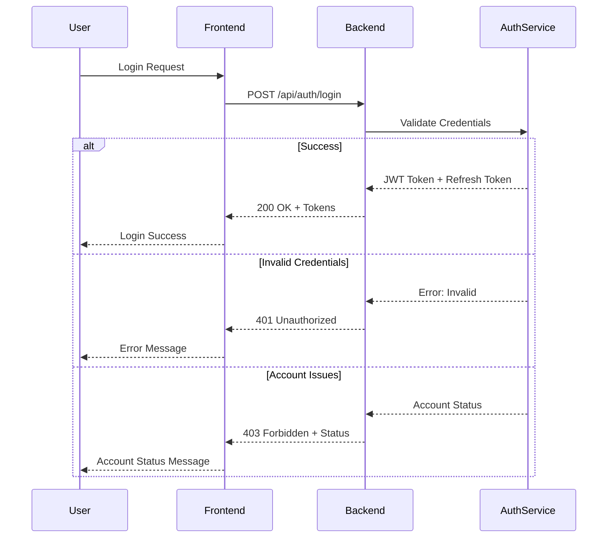
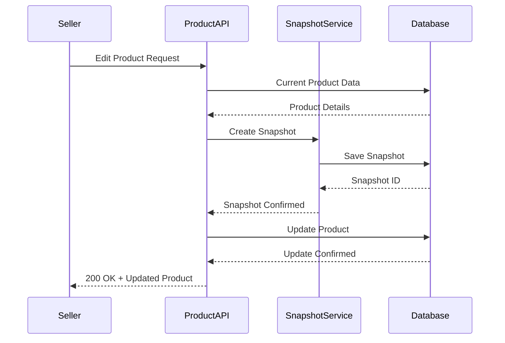
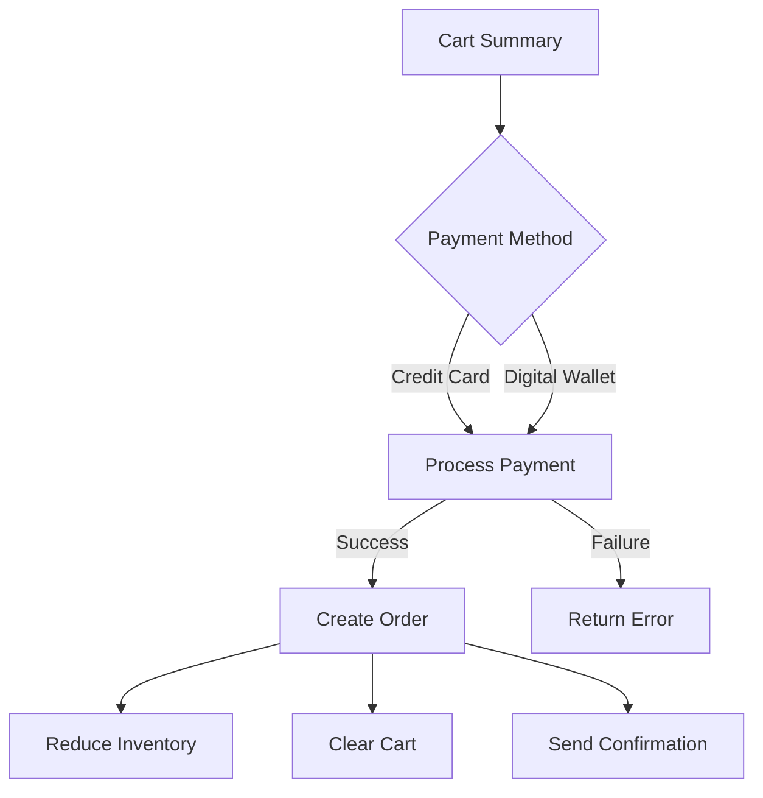

# E-Commerce Shopping Mall Platform - Requirements Analysis Document

## Overview

This document provides comprehensive requirements analysis for the E-Commerce Shopping Mall Platform, building upon foundational business requirements and error handling specifications. It serves as a bridge between high-level business needs and technical implementation specifications for backend developers.

## Document Purpose and Scope

This analysis document consolidates all functional requirements, business rules, validation constraints, and error handling specifications into a cohesive requirements specification that will guide the Database, Interface, Test, and Realize phases of the AutoBE pipeline.

## Core System Components

### User Authentication and Authorization

#### Actor System

The platform implements a comprehensive multi-actor system with distinct permission levels and capabilities:

**Actor Authentication Flow:**

### Authentication Requirements

WHEN a user attempts to log in, THE system SHALL verify email format validity first.

WHEN email format is valid, THE system SHALL check account existence and status.

WHEN account exists but is suspended, THE system SHALL return HTTP 403 with error code `AUTH_ACCOUNT_SUSPENDED`.

WHEN account exists but is pending approval, THE system SHALL return HTTP 403 with error code `AUTH_ACCOUNT_PENDING_APPROVAL`.

WHEN account is rejected, THE system SHALL return HTTP 403 with error code `AUTH_ACCOUNT_REJECTED` and include rejection reason.

WHEN credentials are valid, THE system SHALL generate JWT tokens with appropriate scope.

WHEN token expires, THE system SHALL return HTTP 401 with error code `AUTH_TOKEN_EXPIRED`.

#### Account Types and Registration

**Customer Registration:**

WHEN a user registers as a customer, THE system SHALL require email, password, display name, and phone number.

WHEN registration is complete, THE system SHALL automatically create a customer profile.

WHEN email already exists, THE system SHALL return HTTP 409 with error code `AUTH_EMAIL_ALREADY_EXISTS`.

**Seller Registration:**

WHEN a user registers as a seller, THE system SHALL create account in pending approval status.

WHEN registration is submitted, THE system SHALL send notification to administrators.

WHEN administrator approves, THE system SHALL change status to active.

WHEN administrator rejects, THE system SHALL return HTTP 403 with rejection reason and allow resubmission.

**Administrator Registration:**

WHEN a user requests administrator privileges, THE system SHALL create request with status "pending".

WHEN request is approved, THE system SHALL grant regular administrator status.

WHEN regular administrator requests elevation, SUPER administrator can promote to super administrator.

### Profile Management

#### Customer Profile

WHEN a customer creates their profile, THE system SHALL store display name and phone number.

WHEN a customer updates their profile, THE system SHALL create a snapshot preserving previous values.

WHEN a customer deletes their account, THE system SHALL preserve order history and reviews.

#### Seller Profile

WHEN a seller creates their profile, THE system SHALL store shop name, description, and logo.

WHEN a seller edits their profile, THE system SHALL create a snapshot and maintain history.

WHEN a seller's account is approved, THE system SHALL enable profile visibility.

### Address Management

#### Address Operations

WHEN a customer adds an address, THE system SHALL store recipient name, phone, street, city, state, postal code, and country.

WHEN a customer sets an address as default, THE system SHALL update default flag on all addresses.

WHEN a customer edits an address, THE system SHALL create a snapshot of previous state.

WHEN a customer deletes an address, THE system SHALL remove record but preserve historical references.

### Product Catalog

#### Product Creation and Management

WHEN a seller creates a product, THE system SHALL require name, description, category, base price, and at least one variant.

WHEN a product is created, THE system SHALL automatically generate primary SKU.

WHEN a seller edits a product, THE system SHALL create a product snapshot including all variants.

WHEN a product has no variants, THE system SHALL display as "unavailable" but visible in search.

WHEN a seller deletes a product, THE system SHALL check for pending orders first.

WHEN pending orders exist, THE system SHALL prevent deletion and return HTTP 400.

**Product Editing Workflow:**

#### Product Variants and Inventory

WHEN a product variant is added, THE system SHALL require unique SKU code, option values, stock quantity.

WHEN a variant's price is set, THE system SHALL validate against base price constraints.

WHEN inventory is restocked, THE system SHALL create inventory history record.

WHEN inventory is adjusted, THE system SHALL require reason and create record.

WHEN stock reaches zero, THE system SHALL mark variant as "out of stock".

WHEN out of stock variant is added to cart, THE system SHALL prevent selection.

#### Product Images

WHEN images are uploaded, THE system SHALL validate file format and size.

WHEN image ordering is changed, THE system SHALL update display sequence.

WHEN an image is deleted, THE system SHALL remove file and update product record.

WHEN main image is removed, THE system SHALL promote another image to main status.

### Shopping Experience

#### Wishlist Management

WHEN a customer adds a product to wishlist, THE system SHALL create wishlist item.

WHEN wishlist exceeds maximum capacity, THE system SHALL return HTTP 400.

WHEN a product is deleted from wishlist, THE system SHALL remove item.

WHEN a seller deletes a product, THE system SHALL automatically remove from all wishlists.

#### Cart Management

WHEN a variant is added to cart, THE system SHALL check availability first.

WHEN variant already in cart, THE system SHALL increment quantity instead of adding duplicate.

WHEN cart item quantity exceeds stock, THE system SHALL show warning and limit to available quantity.

WHEN cart item becomes unavailable, THE system SHALL mark as unavailable but keep in cart.

WHEN cart is checked out, THE system SHALL validate all items are available.

WHEN unavailable items exist, THE system SHALL prevent checkout with specific error.

#### Checkout Process

WHEN customer proceeds to checkout, THE system SHALL require shipping address selection.

WHEN no address selected, THE system SHALL use customer's default address if available.

WHEN address is selected, THE system SHALL lock address for this order.

WHEN payment processing is initiated, THE system SHALL validate order totals and items.

WHEN payment succeeds, THE system SHALL create order record and reduce inventory.

WHEN payment fails, THE system SHALL return error and allow retry.

**Checkout Flow:**

### Order Processing

#### Order Creation

WHEN an order is placed, THE system SHALL create order header with customer and address information.

WHEN order items are added, THE system SHALL create order item records for each variant.

WHEN inventory is reduced, THE system SHALL create inventory history record with negative quantity.

WHEN snapshot is created, THE system SHALL preserve product name, description, variant options, and price at time of purchase.

WHEN seller profile snapshot is created, THE system SHALL preserve shop name and logo at time of purchase.

#### Order Status Management

**Order Item Status Flow:**

WHEN an order item is created, THE system SHALL set status to "paid".

WHEN seller ships item, THE system SHALL change status to "shipped".

WHEN customer confirms delivery, THE system SHALL change status to "delivered".

WHEN item is automatically marked delivered after 14 days, THE system SHALL change status to "delivered".

WHEN item is cancelled, THE system SHALL change status to "cancelled" and restore inventory.

WHEN item is refunded, THE system SHALL change status to "refunded" and restore inventory.

**Order Status Derivation:**

WHEN all items are paid, THE system SHALL set order status to "paid".

WHEN any item is shipped, THE system SHALL set order status to "shipped".

WHEN all items are delivered, THE system SHALL set order status to "delivered".

WHEN all items are cancelled, THE system SHALL set order status to "cancelled".

WHEN all items are refunded, THE system SHALL set order status to "refunded".

WHEN mixed status exists, THE system SHALL set order status to "partially completed".

#### Shipping Process

WHEN seller ships items, THE system SHALL create shipment record.

WHEN shipment is created, THE system SHALL include one or more order items from same seller.

WHEN tracking information is added, THE system SHALL associate with shipment.

WHEN shipment is created, THE system SHALL change all included items to "shipped" status.

WHEN customer confirms shipment delivery, THE system SHALL change all items to "delivered" status.

#### Cancellation Process

WHEN customer requests cancellation, THE system SHALL require reason text.

WHEN request is submitted, THE system SHALL set status to "cancellation requested".

WHEN seller approves, THE system SHALL change status to "cancelled" and restore inventory.

WHEN seller rejects, THE system SHALL notify customer with reason.

WHEN snapshot is created, THE system SHALL preserve request state at time of response.

#### Refund Process

WHEN customer requests refund, THE system SHALL require reason text.

WHEN item delivered date exceeds 7 days, THE system SHALL reject refund request.

WHEN request is approved, THE system SHALL change status to "refunded" and restore inventory.

WHEN snapshot is created, THE system SHALL preserve request state at time of response.

### Review System

#### Review Creation and Management

WHEN customer writes review, THE system SHALL require rating (1-5 stars).

WHEN review is submitted, THE system SHALL verify item delivered status first.

WHEN customer edits review, THE system SHALL create snapshot of previous version.

WHEN customer deletes review, THE system SHALL preserve snapshot and set text to "[review deleted]".

WHEN average rating is calculated, THE system SHALL exclude deleted reviews.

WHEN multiple reviews exist for same product, THE system SHALL show newest first.

#### Review Display Requirements

WHEN product page loads, THE system SHALL retrieve all non-deleted reviews.

WHEN rating average displays, THE system SHALL show calculated mean from all reviews.

WHEN review count displays, THE system SHALL count all non-deleted reviews.

### Seller Dashboard

#### Dashboard Metrics

WHEN seller dashboard loads, THE system SHALL show total product count.

WHEN dashboard loads, THE system SHALL show total order items for seller's products.

WHEN dashboard loads, THE system SHALL show pending cancellation requests count.

WHEN dashboard loads, THE system SHALL show pending refund requests count.

#### Order Management

WHEN seller views order items, THE system SHALL filter by seller's products.

WHEN items are filtered, THE system SHALL allow status-based filtering.

WHEN items are displayed, THE system SHALL include snapshot data from time of purchase.

### Administrator Functions

#### Seller Management

WHEN administrator reviews seller registration, THE system SHALL require approval or rejection reason.

WHEN seller is suspended, THE system SHALL hide products from search and listings.

WHEN seller is suspended, THE system SHALL prevent product creation and editing.

WHEN seller is suspended, THE system SHALL allow processing of existing orders.

WHEN seller is unsuspended, THE system SHALL restore product visibility.

#### Category Management

WHEN category is created, THE system SHALL allow optional parent category for subcategories.

WHEN category is edited, THE system SHALL create snapshot of previous values.

WHEN category is deleted, THE system SHALL mark products as uncategorized.

WHEN category has subcategories, THE system SHALL prevent deletion or move subcategories.

#### Product Oversight

WHEN administrator views all products, THE system SHALL show products from all sellers.

WHEN product is viewed, THE system SHALL allow access to all snapshots.

WHEN product is deleted, THE system SHALL preserve order history and snapshots.

#### Order Oversight

WHEN administrator views all orders, THE system SHALL show complete order information.

WHEN force-cancel is executed, THE system SHALL refund customer and restore inventory.

WHEN force-refund is executed, THE system SHALL refund customer.

#### User Management

WHEN administrator bans customer, THE system SHALL prevent login.

WHEN administrator unbans customer, THE system SHALL restore login capability.

WHEN administrator bans seller, THE system SHALL prevent login.

WHEN administrator bans seller, THE system SHALL preserve existing order processing capability.

### Snapshot Principle Implementation

#### Snapshot Data Structure

WHEN a snapshot is created, THE system SHALL record timestamp of creation.

WHEN a snapshot is created, THE system SHALL store complete previous state.

WHEN a snapshot is created, THE system SHALL store snapshot metadata including actor and reason.

WHEN a snapshot is viewed, THE system SHALL preserve historical accuracy.

#### Snapshot Applications

**Product Snapshots:**

WHEN product is edited, THE system SHALL create snapshot with all fields.

WHEN product snapshot is created, THE system SHALL include variant snapshots.

WHEN product is deleted, THE system SHALL preserve all historical snapshots.

**Order Snapshots:**

WHEN order item is created, THE system SHALL snapshot product and variant.

WHEN order item is created, THE system SHALL snapshot seller profile.

**Profile Snapshots:**

WHEN seller profile is edited, THE system SHALL create snapshot.

WHEN review is edited, THE system SHALL create snapshot.

### Error Handling Integration

This requirements document integrates with the comprehensive error handling specification in `10-error-handling.md`. All business processes defined in this document must implement appropriate error handling according to those specifications.

## Implementation Considerations

### Database Design Notes

While this document focuses on business requirements rather than database schemas, the following considerations should guide the Database phase:

1. **Versioning Strategy**: Implement snapshot tables with historical tracking
2. **Audit Trail**: Maintain complete modification history for all critical entities
3. **Soft Deletes**: Implement soft delete pattern for data preservation
4. **Referential Integrity**: Preserve order history even when related data changes

### Authentication Implementation

The authentication system should implement JWT-based tokens with:

- Short-lived access tokens (15-30 minutes)
- Longer-lived refresh tokens (7-30 days)
- Token revocation mechanism for security
- Scope-based authorization for different actor types

### Performance Considerations

- Implement caching for frequently accessed data (categories, popular products)
- Use pagination for all list endpoints with reasonable limits
- Implement asynchronous processing for image processing and snapshot creation
- Optimize inventory calculations with denormalized stock fields

### Business Rule Enforcement

All business rules defined in this document should be:

- Implemented in service layer with proper transaction handling
- Validated at API boundary before processing
- Enforced at database level where possible
- Logged for audit and debugging purposes

## Document Next Steps

This requirements analysis document serves as the authoritative specification for the Database, Interface, Test, and Realize phases of the AutoBE pipeline. Each phase will build upon these requirements to produce production-ready backend code.

The document should be reviewed by technical leads to ensure completeness and feasibility before proceeding to implementation phases.