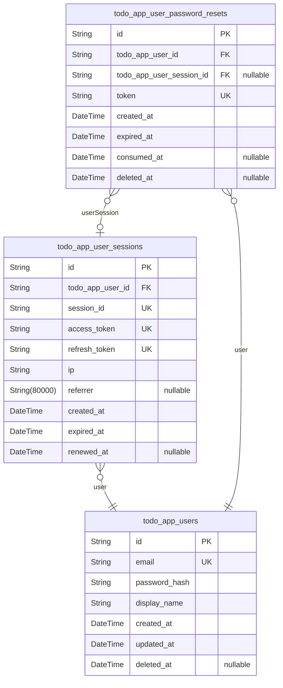
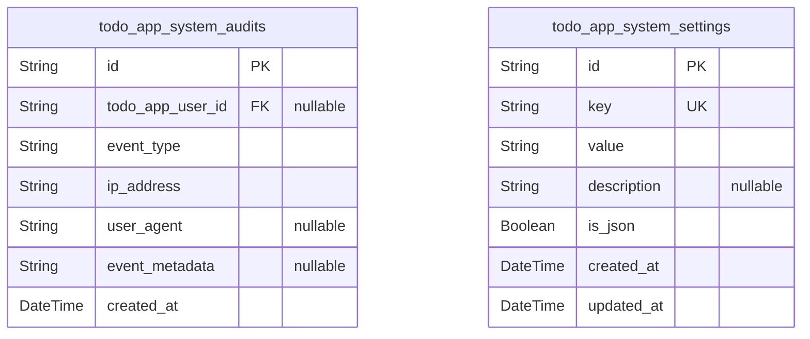
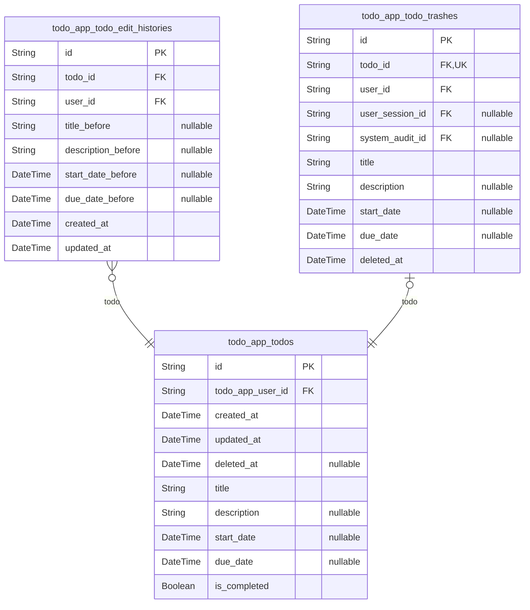

# Prisma Markdown

> Generated by [`prisma-markdown`](https://github.com/samchon/prisma-markdown)

- [Actors](#actors)
- [Systematic](#systematic)
- [Todo](#todo)

## Actors

### `todo_app_users`

Main user table with email/password authentication credentials and
profile information

Properties as follows:

- `id`: Primary Key.
- `email`
  > Email address for user login and notifications. Must be unique across all
  > users.
- `password_hash`: Hashed password for authentication. Never stores plain text passwords.
- `display_name`: User's display name shown in the application interface.
- `created_at`: Timestamp when the user account was created.
- `updated_at`: Timestamp when the user account was last updated.
- `deleted_at`: Optional timestamp when the user account was soft-deleted.

### `todo_app_user_sessions`

JWT session tokens with access and refresh token support for user
authentication

Properties as follows:

- `id`: Primary Key.
- `todo_app_user_id`: Reference to the user who owns this session. [todo_app_users.id](#todo_app_users).
- `session_id`: Unique session identifier (UUID) for the session token.
- `access_token`
  > JWT access token for API authentication. This token is used to authorize
  > API requests.
- `refresh_token`
  > JWT refresh token for obtaining new access tokens. Used for token
  > rotation and extended sessions.
- `ip`: IP address of the client that established this session.
- `referrer`: Referrer URL that led to the application (if applicable).
- `created_at`: Timestamp when this session was created (login time).
- `expired_at`: Timestamp when this session will expire and be invalidated.
- `renewed_at`: Timestamp when this session was last renewed (token rotation).

### `todo_app_user_password_resets`

Password reset tokens for user account recovery. Each token is valid for
a single use and expires after a set period. Linked to users table for
authentication flow.

Properties as follows:

- `id`: Primary Key.
- `todo_app_user_id`: User account requesting password reset. [todo_app_users.id](#todo_app_users)
- `todo_app_user_session_id`
  > Session context for this password reset request. {@link
  > todo_app_user_sessions.id}
- `token`
  > Password reset token generated for authentication. Used in password reset
  > URL.
- `created_at`: Timestamp when this password reset request was created.
- `expired_at`
  > Timestamp when this password reset token expires. After this time, the
  > token becomes invalid.
- `consumed_at`: Timestamp when the token was consumed (password successfully changed).
- `deleted_at`: Timestamp when this password reset record was permanently deleted.

## Systematic

### `todo_app_system_audits`

System audit log entries for tracking important system events such as
authentication attempts, security events, and configuration changes. This
table provides comprehensive audit trails for security monitoring and
compliance requirements.

Properties as follows:

- `id`: Primary Key.
- `todo_app_user_id`: User who triggered the audit event. [todo_app_users.id](#todo_app_users).
- `event_type`
  > Category of the audit event (login, logout, password_change,
  > security_alert, system_config_change, etc.).
- `ip_address`: IP address from which the event originated.
- `user_agent`: Browser or client user agent string.
- `event_metadata`
  > Additional event details in JSON format (e.g., login success/failure
  > reason, config changes details).
- `created_at`: Timestamp when the audit event occurred.

### `todo_app_system_settings`

System configuration settings and parameters for application-wide
configuration management.

Properties as follows:

- `id`: Primary Key.
- `key`
  > Unique configuration key identifier (e.g., 'app.name',
  > 'features.enabled').
- `value`
  > Configuration value stored as string for flexibility (supports JSON for
  > complex values).
- `description`: Human-readable description of what this configuration setting controls.
- `is_json`: Flag indicating whether the value field contains JSON-formatted data.
- `created_at`: Timestamp when this configuration was created.
- `updated_at`: Timestamp when this configuration was last updated.

## Todo

### `todo_app_todos`

Main todo item records with title, description, dates, and completion
status. Each todo belongs to exactly one user (todo_app_users) and can
have zero or one associated edit history records and trash entries.
Supports the complete Todo lifecycle from creation through editing,
completion, soft deletion, and permanent deletion.

Properties as follows:

- `id`: Primary Key.
- `todo_app_user_id`
  > Owner user's [todo_app_users.id](#todo_app_users). The user who created and owns
  > this todo item.
- `created_at`: Timestamp when the todo item was created.
- `updated_at`: Timestamp when the todo item was last updated.
- `deleted_at`
  > Timestamp when the todo item was soft-deleted. Nullable indicates active
  > todo.
- `title`: Title of the todo item. Required field, cannot be empty.
- `description`: Detailed description of the todo item. Optional field, can be empty.
- `start_date`
  > Optional start date for the todo item. Indicates when work on this task
  > should begin.
- `due_date`
  > Optional due date for the todo item. Indicates when this task should be
  > completed.
- `is_completed`
  > Completion status flag. True indicates the todo is completed, false
  > indicates active/incomplete.

### `todo_app_todo_edit_histories`

Edit history entries tracking all changes made to todo items. Captures
the state of todo fields (title, description, start_date, due_date) at
the time of each edit, allowing reconstruction of todo item evolution
over time.

This is a subsidiary entity managed through parent todo items. Each edit
creates a history entry that permanently records the previous values
before the change, supporting complete audit trails for todo item
modifications.

Properties as follows:

- `id`: Primary Key.
- `todo_id`: Referenced todo item's [todo_app_todos.id](#todo_app_todos).
- `user_id`: Editing user's [todo_app_users.id](#todo_app_users).
- `title_before`: Todo title value before the edit.
- `description_before`: Todo description value before the edit.
- `start_date_before`: Todo start date value before the edit.
- `due_date_before`: Todo due date value before the edit.
- `created_at`: Creation timestamp of this history entry.
- `updated_at`: Last update timestamp of this history entry.

### `todo_app_todo_trashes`

Trash management records for soft-deleted todo items with restoration
capability.

This table captures the state of todo items when they are soft-deleted by
users. It maintains
a complete snapshot of the todo at the time of deletion, allowing for
restoration if needed
before permanent deletion occurs. The table tracks which user performed
the deletion and
provides audit trail through system audit references.

Key features:
- Stores todo state at time of soft deletion
- Enables todo restoration to active state
- Supports permanent deletion workflow
- Maintains audit trail of deletion events
- Links to user and session for accountability

Properties as follows:

- `id`: Primary Key.
- `todo_id`: Reference to the soft-deleted todo item [todo_app_todos.id](#todo_app_todos).
- `user_id`: User who performed the soft delete [todo_app_users.id](#todo_app_users).
- `user_session_id`: User session during deletion [todo_app_user_sessions.id](#todo_app_user_sessions).
- `system_audit_id`
  > System audit reference for deletion event {@link
  > todo_app_system_audits.id}.
- `title`: Todo title at time of deletion.
- `description`: Todo description at time of deletion.
- `start_date`: Todo start date at time of deletion (nullable if not set).
- `due_date`: Todo due date at time of deletion (nullable if not set).
- `deleted_at`: Timestamp when the todo was soft-deleted to trash.
