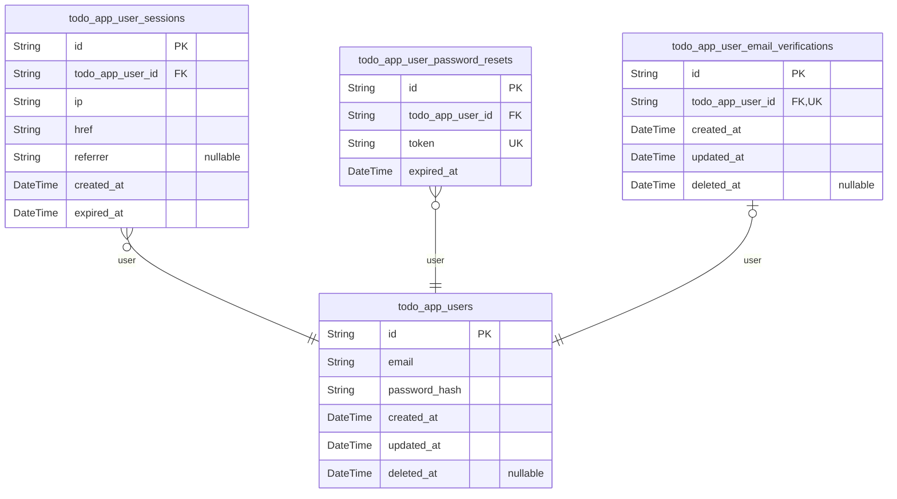
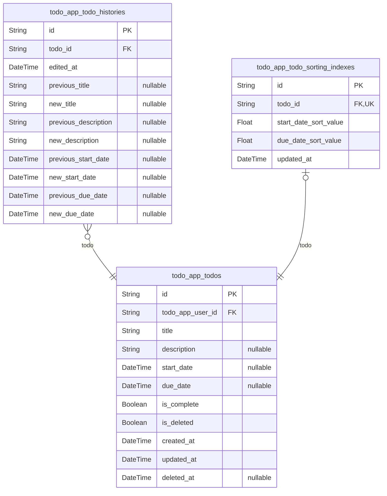

# Prisma Markdown

> Generated by [`prisma-markdown`](https://github.com/samchon/prisma-markdown)

- [Systematic](#systematic)
- [Todos](#todos)

## Systematic

### `todo_app_users`

Main user table with email/password authentication credentials. Each user
can have one profile, multiple todos, multiple sessions, password reset
tokens, and email verification tokens. This is the core actor entity for
the authentication system.

Properties as follows:

- `id`: Primary Key.
- `email`: Unique email address for user identification and authentication.
- `password_hash`: Securely hashed password using bcrypt algorithm.
- `created_at`: Timestamp when the user account was created.
- `updated_at`: Timestamp when the user account was last updated.
- `deleted_at`
  > Timestamp when the user account was soft-deleted. Null if active.
  > Supports trash management workflow for account deletion with recovery
  > possibility.

### `todo_app_user_sessions`

JWT session tokens with access and refresh token support. Each session
represents a logged-in state for a user with connection metadata and
expiration tracking.

Properties as follows:

- `id`: Primary Key.
- `todo_app_user_id`: Owner user's [todo_app_users.id](#todo_app_users).
- `ip`: Client IP address when session was created.
- `href`: Page URL (href) when session was created.
- `referrer`: Referrer URL when session was created.
- `created_at`: Session creation timestamp.
- `expired_at`: Session expiration timestamp. Sessions beyond this time are invalid.

### `todo_app_user_password_resets`

Password reset tokens with expiration for password recovery

Properties as follows:

- `id`: Primary Key.
- `todo_app_user_id`: Reset request user [todo_app_users.id](#todo_app_users).
- `token`: Password reset token for verification.
- `expired_at`: Token expiration timestamp. Reset requests older than this are invalid.

### `todo_app_user_email_verifications`

Email verification tokens for account verification workflows

Properties as follows:

- `id`: Primary Key.
- `todo_app_user_id`: User who needs email verification [todo_app_users.id](#todo_app_users)
- `created_at`: Creation timestamp
- `updated_at`: Update timestamp
- `deleted_at`: Deletion timestamp for soft delete

## Todos

### `todo_app_todos`

Main todo items belonging to users with title, optional description and
dates. Each todo is owned by exactly one user and cannot be accessed by
other users. Supports soft delete functionality through is_deleted flag.
Deleted todos appear in the user's trash until permanently deleted or
restored. The table maintains a one-to-many relationship with
todo_app_todo_histories for edit history tracking.

Properties as follows:

- `id`: Primary Key.
- `todo_app_user_id`: Owner user's [todo_app_users.id](#todo_app_users).
- `title`
  > Todo title. Required field. Minimum 1 character, maximum 255 characters.
  > Trimmed of leading and trailing whitespace before storage.
- `description`: Optional detailed description of the todo item.
- `start_date`
  > Optional start date for the todo item. NULL indicates no start date set.
  > Used for sorting - todos without start_date appear at the end when sorted
  > by start_date.
- `due_date`
  > Optional due date for the todo item. NULL indicates no due date set. Used
  > for sorting - todos without due_date appear at the end when sorted by
  > due_date.
- `is_complete`
  > Completion status flag. false indicates incomplete (default), true
  > indicates completed.
- `is_deleted`
  > Soft delete flag. false indicates active todo (appears in normal list),
  > true indicates deleted/todo is in trash. Deleted todos do not appear in
  > normal todo list views.
- `created_at`: Timestamp when the todo item was created.
- `updated_at`: Timestamp when the todo item was last updated.
- `deleted_at`
  > Timestamp when the todo item was soft-deleted (is_deleted set to true).
  > NULL indicates the todo is not deleted.

### `todo_app_todo_histories`

History of edits made to todo items tracking all changes over time. Each
edit creates a new history entry recording the previous and new values
for all changed fields. Belongs to exactly one todo with cascade deletion
when todo is permanently removed.

Properties as follows:

- `id`: Primary Key.
- `todo_id`: The todo item this history entry belongs to. [todo_app_todos.id](#todo_app_todos)
- `edited_at`: Timestamp when this edit was made.
- `previous_title`: Previous title value before this edit (null if title unchanged).
- `new_title`: New title value after this edit (null if title unchanged).
- `previous_description`
  > Previous description value before this edit (null if description
  > unchanged).
- `new_description`: New description value after this edit (null if description unchanged).
- `previous_start_date`: Previous start_date value before this edit (null if start_date unchanged).
- `new_start_date`: New start_date value after this edit (null if start_date unchanged).
- `previous_due_date`: Previous due_date value before this edit (null if due_date unchanged).
- `new_due_date`: New due_date value after this edit (null if due_date unchanged).

### `todo_app_todo_sorting_indexes`

Indexes for efficient sorting by start_date and due_date with NULL handling.

This table stores computed index values that enable efficient date-based
sorting
while handling todos without dates appropriately. Used for performance
optimization
when displaying sorted todo lists.

Properties as follows:

- `id`: Primary Key.
- `todo_id`: Target todo's [todo_app_todos.id](#todo_app_todos).
- `start_date_sort_value`
  > Computed sort value for start_date (0 for NULL, Unix timestamp for valid
  > dates).
- `due_date_sort_value`
  > Computed sort value for due_date (0 for NULL, Unix timestamp for valid
  > dates).
- `updated_at`: Last update timestamp.
