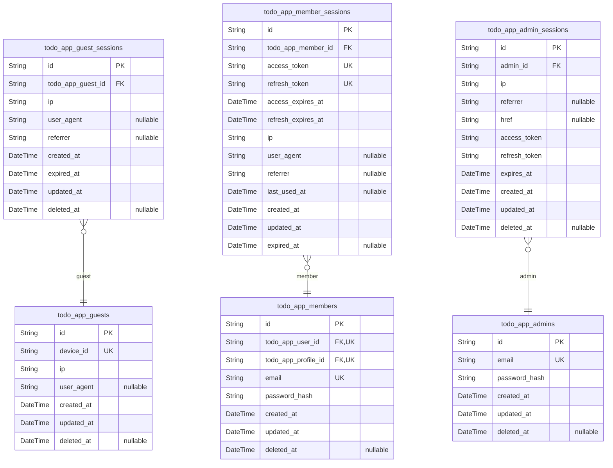
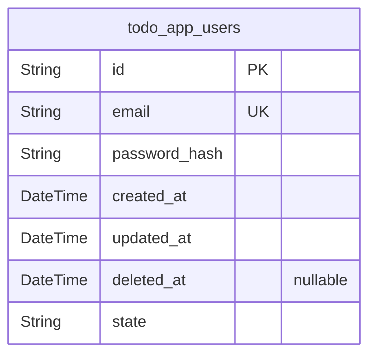
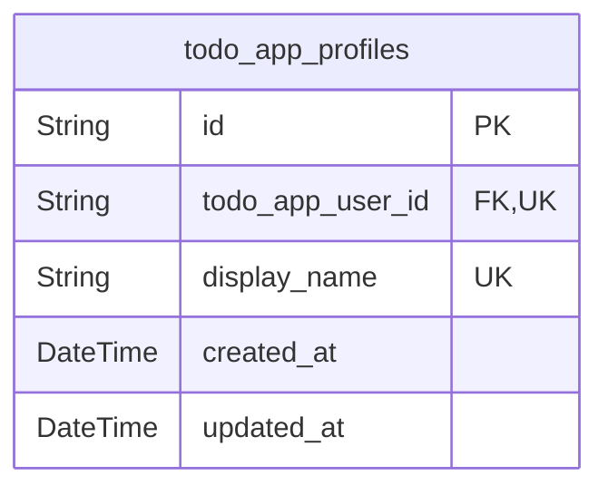
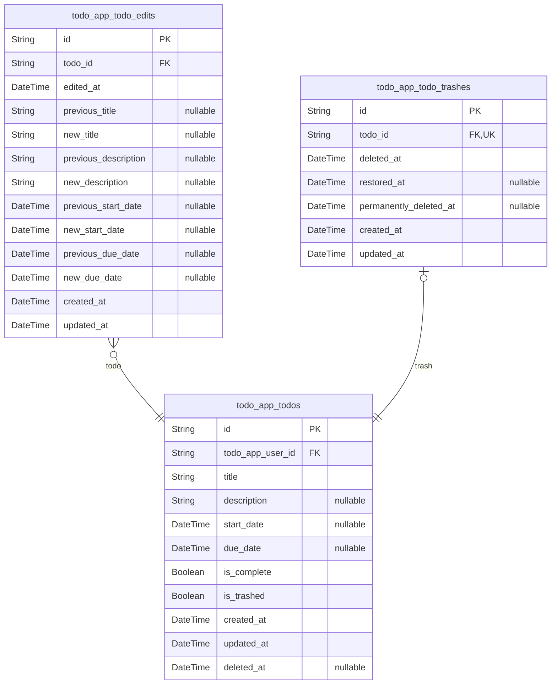
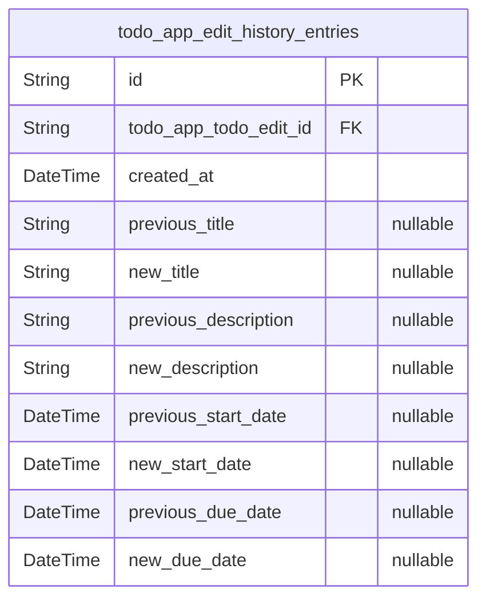

# Prisma Markdown

> Generated by [`prisma-markdown`](https://github.com/samchon/prisma-markdown)

- [Systematic](#systematic)
- [Users](#users)
- [Profiles](#profiles)
- [Todos](#todos)
- [EditHistory](#edithistory)

## Systematic

### `todo_app_guests`

Temporary guest accounts identified by device session data. Stores guest
identity information and tracks session metadata for unauthenticated
users. Used to maintain continuity for guests who may later register as
members.

Properties as follows:

- `id`: Primary Key.
- `device_id`: Unique identifier for the guest's device/browser session.
- `ip`: IP address of the guest at session creation.
- `user_agent`: Browser user agent string for device identification.
- `created_at`: Timestamp when the guest account was created.
- `updated_at`: Timestamp when the guest account was last updated.
- `deleted_at`
  > Timestamp when the guest account was soft-deleted (nullable if not
  > deleted).

### `todo_app_guest_sessions`

Temporary session tokens for guest access without authentication. Each
guest user has multiple sessions that track connection metadata and
expiration. Sessions expire after a configured time period and are used
for security auditing and session management.

Properties as follows:

- `id`: Primary Key.
- `todo_app_guest_id`: Belonged guest's [todo_app_guests.id](#todo_app_guests).
- `ip`: Client IP address at session creation.
- `user_agent`: Browser user agent string for session identification.
- `referrer`: Referrer URL when session was created.
- `created_at`: Session creation timestamp.
- `expired_at`: Session expiration timestamp. Sessions are invalid after this time.
- `updated_at`: Last update timestamp.
- `deleted_at`: Soft delete timestamp. If null, session is active.

### `todo_app_members`

Registered member accounts with email/password authentication
credentials. Members can create, edit, complete, and delete their own
todos. Each member has exactly one profile and can have multiple
sessions. Account lifecycle includes registration, authentication,
password change, and permanent deletion (cascades to all member's todos
and profile).

Properties as follows:

- `id`: Primary Key. Member account identifier.
- `todo_app_user_id`: Member's user account. [todo_app_users.id](#todo_app_users).
- `todo_app_profile_id`: Member's display profile. [todo_app_profiles.id](#todo_app_profiles).
- `email`: Unique email address for authentication. Used as login identifier.
- `password_hash`: Securely hashed password for authentication.
- `created_at`: When the member account was created.
- `updated_at`: When the member account was last updated.
- `deleted_at`
  > When the member account was permanently deleted. Null indicates active
  > account.

### `todo_app_member_sessions`

JWT session tokens for member authentication with access and refresh
support. Each session tracks authentication tokens, connection metadata,
and session lifecycle including creation, expiration, and last usage
timestamps.

Properties as follows:

- `id`: Primary Key.
- `todo_app_member_id`
  > Member's [todo_app_members.id](#todo_app_members). References the authenticated member
  > account for this session.
- `access_token`
  > JWT access token for API authentication. Used for authorizing requests on
  > behalf of the member.
- `refresh_token`
  > JWT refresh token for obtaining new access tokens without
  > re-authentication.
- `access_expires_at`
  > Expiration timestamp for the access token. Access tokens typically have
  > short validity periods.
- `refresh_expires_at`
  > Expiration timestamp for the refresh token. Refresh tokens have longer
  > validity periods to enable session persistence.
- `ip`
  > IP address of the client that initiated this session. Used for security
  > monitoring and anomaly detection.
- `user_agent`
  > HTTP User-Agent header from the client's request. Used for device
  > identification and security tracking.
- `referrer`
  > HTTP Referer header from the client's request. Indicates the source of
  > the authentication request.
- `last_used_at`
  > Timestamp of the last API request made with this session. Used for
  > session activity monitoring and cleanup.
- `created_at`: Creation timestamp of this session record.
- `updated_at`: Last update timestamp of this session record.
- `expired_at`
  > Session expiration timestamp. After this time, the session should be
  > considered invalid.

### `todo_app_admins`

System administrator accounts with elevated privileges. Admins have full
access to system management and can perform actions across all domains.

Properties as follows:

- `id`: Primary Key.
- `email`: Admin email address for authentication. Must be unique and verified.
- `password_hash`: Secure password hash using bcrypt or similar algorithm.
- `created_at`: Timestamp when this admin account was created.
- `updated_at`: Timestamp when this admin account was last updated.
- `deleted_at`: Timestamp when this admin account was soft deleted. Null if active.

### `todo_app_admin_sessions`

JWT session tokens for administrator authentication with access and
refresh support.

Each entry represents an active authentication session for an
administrator, storing JWT tokens, connection metadata, and session
validity period. The table supports multiple concurrent sessions per
administrator for different devices or locations.

Sessions are tracked from login through expiration or invalidation,
enabling security auditing and session management features.

Properties as follows:

- `id`: Primary Key.
- `admin_id`: Administrator's [todo_app_admins.id](#todo_app_admins).
- `ip`: Client IP address at login time.
- `referrer`: HTTP referrer header at login time.
- `href`: Target URL path at login time.
- `access_token`: JWT access token for authentication.
- `refresh_token`: JWT refresh token for session renewal.
- `expires_at`: Token expiration timestamp.
- `created_at`: Session creation timestamp.
- `updated_at`: Last update timestamp.
- `deleted_at`: Soft delete timestamp for invalidated sessions.

## Users

### `todo_app_users`

User accounts with email authentication and account lifecycle management.
Each user has a unique email, securely hashed password, and can be in
pending_verification, active, or deleted state. Users can create, edit,
complete, and delete their own todos. Account deletion cascades to all
todos and edit history. Complete privacy isolation ensures users can only
access their own data.

Properties as follows:

- `id`: Primary Key. Unique identifier for each user account.
- `email`
  > User's email address. Required for authentication. Must be unique across
  > all accounts.
- `password_hash`: Securely hashed password for authentication. Never stored in plain text.
- `created_at`: Account creation timestamp. Auto-generated on registration.
- `updated_at`: Last update timestamp. Auto-updated on any account modification.
- `deleted_at`
  > Account deletion timestamp. NULL for active accounts, set on permanent
  > deletion.
- `state`
  > Account state. Values: pending_verification (new account, email not
  > verified), active (fully functional), deleted (permanently removed).

## Profiles

### `todo_app_profiles`

User display profiles with display name and timestamps. Each user has
exactly one profile. Profile privacy is absolute - users can only access
their own profile data. The display name serves as the user's identifier
in the application interface without revealing their email address.

Properties as follows:

- `id`: Primary Key.
- `todo_app_user_id`: Belonged user's [todo_app_users.id](#todo_app_users).
- `display_name`
  > User's display name for identification in the interface. Must be between
  > 1 and 100 characters, cannot be whitespace-only. Never reveals the user's
  > email address.
- `created_at`: Profile creation timestamp.
- `updated_at`: Profile last update timestamp.

## Todos

### `todo_app_todos`

Core todo entity with user ownership, title, optional description, dates,
completion status, and soft delete state.

Todos represent individual tasks or items that users create, edit,
complete, and manage through a complete lifecycle including soft deletion
to trash and restoration.

Properties as follows:

- `id`: Primary Key.
- `todo_app_user_id`: Owner user's [todo_app_users.id](#todo_app_users).
- `title`: Todo title (1-500 characters, required).
- `description`: Optional todo description.
- `start_date`: Optional start date for the todo.
- `due_date`: Optional due date for the todo.
- `is_complete`: Whether the todo is marked as complete (default false).
- `is_trashed`: Whether the todo is in trash (soft deleted).
- `created_at`: When this todo was created.
- `updated_at`: When this todo was last updated.
- `deleted_at`: When this todo was permanently deleted, if applicable.

### `todo_app_todo_edits`

Records all edits to todo items including timestamps and field-level
changes. Each edit captures the previous and new values for title,
description, start date, and due date. Edits are automatically created
whenever a todo is modified and provide an audit trail of all changes
made by users.

This table follows First Normal Form (1NF) with atomic values, Second
Normal Form (2NF) where all non-key attributes depend on the primary key,
and Third Normal Form (3NF) without transitive dependencies. Each edit
history entry is immutable once created and cannot exist independently of
a todo.

Relationships:
- Each edit history entry belongs to exactly one todo (todo_app_todos)
- A todo can have many edit history entries (1:N relationship)
- Editing capabilities are captured through separate previous/new field
pairs

Reference: @link todo_app_todos.id

Properties as follows:

- `id`: Primary Key.
- `todo_id`: Target todo this edit history entry belongs to. [todo_app_todos.id](#todo_app_todos).
- `edited_at`
  > Timestamp when the edit was made. Records the exact date and time of the
  > edit operation.
- `previous_title`
  > The title value before this edit. NULL if title was not changed in this
  > edit.
- `new_title`
  > The title value after this edit. NULL if title was not changed in this
  > edit.
- `previous_description`
  > The description value before this edit. NULL if description was not
  > changed in this edit.
- `new_description`
  > The description value after this edit. NULL if description was not
  > changed in this edit.
- `previous_start_date`
  > The start date value before this edit. NULL if start date was not changed
  > in this edit.
- `new_start_date`
  > The start date value after this edit. NULL if start date was not changed
  > in this edit.
- `previous_due_date`
  > The due date value before this edit. NULL if due date was not changed in
  > this edit.
- `new_due_date`
  > The due date value after this edit. NULL if due date was not changed in
  > this edit.
- `created_at`
  > Creation timestamp. Automatically set when the edit history entry is
  > created.
- `updated_at`
  > Last update timestamp. Automatically updated whenever the record is
  > modified.

### `todo_app_todo_trashes`

Soft delete tracking for todos. Records when a todo was deleted via soft
delete, whether it has been restored from trash, and when it was
permanently deleted. Each todo can have at most one trash record. Used to
implement the trash system where deleted todos can be restored or
permanently removed along with their edit history.

Properties as follows:

- `id`: Primary Key.
- `todo_id`
  > Deleted todo's [todo_app_todos.id](#todo_app_todos). Unique constraint ensures 1:1
  > relationship.
- `deleted_at`
  > When the todo was soft-deleted. Non-null indicates the todo is currently
  > in trash state.
- `restored_at`
  > When the todo was restored from trash. Nullable - non-null means todo was
  > restored from trash at this time.
- `permanently_deleted_at`
  > When the todo was permanently deleted from trash. Nullable - non-null
  > means permanent deletion occurred at this time.
- `created_at`: Record creation timestamp.
- `updated_at`: Record last update timestamp.

## EditHistory

### `todo_app_edit_history_entries`

Records all edits to todos with timestamps and changed field values.
Automatically created on every todo edit, captures only fields that
actually changed (title, description, start date, due date) with their
previous and new values. Each edit creates exactly one history entry.
History entries are immutable and sorted from most recent to oldest by
timestamp.

Properties as follows:

- `id`: Primary Key.
- `todo_app_todo_edit_id`: Edit record reference. [todo_app_todo_edits.id](#todo_app_todo_edits).
- `created_at`: Edit timestamp when this history entry was created.
- `previous_title`: Previous title value if title was changed, null otherwise.
- `new_title`: New title value if title was changed, null otherwise.
- `previous_description`: Previous description value if description was changed, null otherwise.
- `new_description`: New description value if description was changed, null otherwise.
- `previous_start_date`: Previous start date value if start date was changed, null otherwise.
- `new_start_date`: New start date value if start date was changed, null otherwise.
- `previous_due_date`: Previous due date value if due date was changed, null otherwise.
- `new_due_date`: New due date value if due date was changed, null otherwise.
