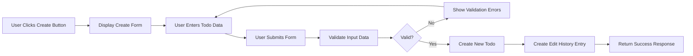
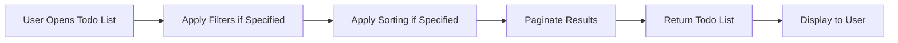
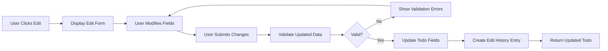
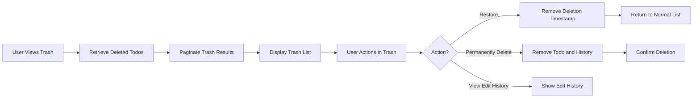

# Multi-User Todo Application Requirements

## Executive Summary

This document provides comprehensive business requirements for a multi-user Todo application. The system enables multiple independent users to manage their personal to-do lists with full privacy isolation. Each user maintains complete ownership and control over their own todos, with robust support for creation, editing, completion tracking, deletion with soft-delete functionality, and comprehensive trash management. The application follows strict privacy principles where users cannot access or view any other users' data.

## Service Overview

### Vision and Purpose

The multi-user Todo application is designed to provide individuals with a personal task management system that emphasizes privacy, reliability, and user control. Unlike collaborative todo applications that focus on team coordination, this service is built specifically for individual users who need a private space to organize their tasks, set deadlines, and track progress without any risk of data exposure to other users.

### Target Users

The primary user base consists of:
- **Individual Task Managers**: Personal productivity users who want a private space to organize daily tasks
- **Privacy-Conscious Professionals**: Users who need to manage sensitive or personal tasks without sharing with others
- **Frequent Task Organizers**: Users who regularly create, edit, and manage multiple todos throughout their day

### Core Value Propositions

1. **Complete Privacy Guarantee**: Each user's todos are completely isolated and inaccessible to other users
2. **Flexible Task Management**: Comprehensive editing, completion toggling, and deadline tracking capabilities
3. **Reliable Data Preservation**: Soft-delete functionality with trash recovery options
4. **Comprehensive History Tracking**: Full edit history for every todo modification
5. **Intelligent Organization**: Advanced filtering and sorting options for efficient task management

### Business Model

This application follows a freemium model designed to attract individual productivity users:
- **Free Tier**: Full functionality with standard limits (unlimited todos, basic filtering, trash retention)
- **Premium Tier**: Enhanced features including extended trash retention, advanced analytics, and additional storage capacity
- **Revenue Streams**: Subscription-based model targeting power users who need extended features

### Success Metrics

Key performance indicators for this service include:
- **User Acquisition**: Monthly active users (MAU), daily active users (DAU)
- **User Engagement**: Average todos per user, edit frequency, trash restoration rate
- **Data Retention**: 90-day retention rate, weekly active user percentage
- **Business Metrics**: Free-to-premium conversion rate, subscription renewal rate

## User Actors

### Primary User Actor

**Name**: `user`

**Type**: Individual authenticated user

**Description**: Authenticated users who can create, manage, and organize their personal todo lists. Each user has complete privacy - they can only access and manage their own todos. Users can perform all todo operations including creation, viewing, editing, completion toggling, deletion, and trash management.

**Permissions**:
- Register with email and password
- Log in to access account
- Create, view, edit, and delete own todos
- Toggle todo completion status
- Access and manage personal trash
- Edit account profile information
- Change account password
- Delete own account

**Restrictions**:
- Cannot view, access, or manage other users' todos
- Cannot see other users' profiles
- Cannot access other users' trash or deleted items

**JWT Payload Structure**:
- `userId`: Unique identifier for the user
- `role`: User role (typically "user" for this application)
- `permissions`: Array of specific permissions (e.g., ["read:todos", "write:todos", "manage:trash"])

### Non-Authenticated Users

**Name**: `guest`

**Type**: Unauthenticated visitor

**Description**: Users who have not logged in to the system.

**Permissions**:
- View public pages (registration, login)
- Access authentication endpoints

**Restrictions**:
- Cannot access any todo data
- Cannot view any user-specific information
- Cannot access any protected resources

## Authentication Requirements

### Core Authentication Functions

- Users can register with email and password
- Users can log in to access their account
- Users can log out to end their session
- System maintains user sessions securely
- Users can verify their email address
- Users can reset forgotten passwords
- Users can change their password
- Users can revoke access from all devices

### Registration Process

WHEN a new user submits registration information including email and password, THE system SHALL:
1. Validate email format and password strength
2. Create a new user account with the provided information
3. Generate a user ID and create a profile with default display name derived from email
4. Store the password securely using bcrypt hashing
5. Generate initial access and refresh tokens
6. Return successful registration response with authentication tokens

IF email format is invalid, THEN THE system SHALL return appropriate error message with specific field indication

IF password does not meet strength requirements, THEN THE system SHALL return error with password policy details

### Login Process

WHEN a user submits login credentials (email and password), THE system SHALL:
1. Locate user account by email
2. Validate password using secure hash comparison
3. If valid, generate new access and refresh tokens
4. Update last login timestamp
5. Return authentication tokens and user profile information

IF credentials are invalid, THEN THE system SHALL return authentication failure with secure error message

### Session Management

- Access tokens expire after 30 minutes of inactivity
- Refresh tokens expire after 30 days
- Session tokens are stored in httpOnly cookies for security
- Users can view their active sessions and revoke from any device

## Functional Requirements

### Account Management

#### User Registration

WHEN a user submits registration with valid email and password, THE system SHALL create a new user account with default profile settings.

WHERE registration includes required fields (email, password), THE system SHALL validate email format and password complexity before account creation.

IF registration data is invalid, THEN THE system SHALL return appropriate validation errors with field-specific messages.

#### User Login

WHEN a user submits valid credentials for login, THE system SHALL authenticate and return access tokens for subsequent API calls.

IF credentials are invalid, THEN THE system SHALL return authentication failure without revealing whether email or password was incorrect.

#### Profile Management

WHILE a user is authenticated, THE system SHALL allow them to view and edit their profile information including display name.

WHERE a user edits their profile, THE system SHALL save changes immediately and update the profile data.

#### Password Management

WHILE a user is authenticated, THE system SHALL allow them to change their password by providing current password and new password.

WHERE password change fails due to invalid current password, THEN THE system SHALL return appropriate error without revealing whether the password field was empty.

#### Account Deletion

WHEN a user requests account deletion, THE system SHALL:
1. Verify user authentication
2. Permanently delete all user data including todos, trash, and profile information
3. Invalidate all active sessions
4. Return successful deletion confirmation

WHERE account deletion is requested, THE system SHALL permanently remove all user todos including those in trash.

### Todo Creation

#### Basic Todo Creation

WHEN a user submits a todo creation request with required title, THE system SHALL create a new todo with provided title and optional description, start date, and due date.

WHERE todo creation includes description, start date, or due date, THE system SHALL store these values as provided.

WHERE optional fields are not provided, THE system SHALL store null values for description, start date, and due date.

WHERE a todo is created, THE system SHALL set completed status to false by default.

WHERE a todo is created, THE system SHALL set creation timestamp to current system time.

#### Validation Rules

IF a todo is created without a title, THEN THE system SHALL return validation error indicating title is required.

IF a todo is created with an invalid date format for start date or due date, THEN THE system SHALL return appropriate error message.

### Todo Viewing

#### Todo List Pagination

WHILE a user views their todo list, THE system SHALL return paginated results with configurable page size.

WHERE pagination is requested, THE system SHALL include total count of todos matching filter criteria.

WHERE no todos exist for a user, THE system SHALL return empty list with zero count.

#### Todo List Display Information

WHERE a todo is displayed in list view, THE system SHALL show: title, completion status, start date (if set), due date (if set), and creation date.

WHERE a todo has no start date, THE system SHALL display null or placeholder for start date field.

WHERE a todo has no due date, THE system SHALL display null or placeholder for due date field.

#### Single Todo Detail View

WHEN a user requests specific todo details, THE system SHALL return complete todo information including full description.

WHERE requested todo does not exist or belongs to another user, THEN THE system SHALL return appropriate access error.

### Todo Completion

#### Mark as Complete

WHEN a user requests to mark a todo as complete, THE system SHALL update todo completed status to true.

WHERE todo completion is successful, THE system SHALL return updated todo information with completed status.

#### Mark as Incomplete

WHEN a user requests to mark a todo as incomplete, THE system SHALL update todo completed status to false.

WHERE todo incomplete status is successful, THE system SHALL return updated todo information with completed status.

### Todo Editing

#### Edit Todo Fields

WHEN a user submits todo edit request with updated fields, THE system SHALL update specified fields for the todo.

WHERE title is included in edit request, THE system SHALL update todo title with new value.

WHERE description is included in edit request, THE system SHALL update todo description with new value.

WHERE start date is included in edit request, THE system SHALL update todo start date with new value.

WHERE due date is included in edit request, THE system SHALL update todo due date with new value.

#### Edit History Creation

WHERE a todo is edited, THE system SHALL create edit history entry recording:
1. Timestamp of edit
2. Previous title (if changed)
3. New title (if changed)
4. Previous description (if changed)
5. New description (if changed)
6. Previous start date (if changed)
7. New start date (if changed)
8. Previous due date (if changed)
9. New due date (if changed)

WHERE an edit history entry is created, THE system SHALL store all changed fields and their previous values.

#### History View

WHEN a user requests edit history for a todo, THE system SHALL return all history entries sorted from most recent to oldest.

WHERE no edit history exists for a todo, THE system SHALL return empty history list.

### Todo Deletion

#### Soft Delete

WHEN a user requests todo deletion, THE system SHALL mark todo as deleted without permanent removal.

WHERE todo is soft-deleted, THE system SHALL set deletion timestamp.

WHERE todo is soft-deleted, THE system SHALL remove it from normal todo list views.

WHERE todo is soft-deleted, THE system SHALL make it available in user's trash.

### Trash Management

#### Trash List Pagination

WHILE a user views their trash list, THE system SHALL return paginated results with configurable page size.

WHERE trash pagination includes total count, THE system SHALL include total count of deleted todos.

WHERE no deleted todos exist for a user, THE system SHALL return empty trash list.

#### Trash Display Information

WHERE a deleted todo is displayed in trash, THE system SHALL show: title, completion status at deletion, start date (if set), due date (if set), and deletion timestamp.

#### Todo Restoration

WHEN a user requests todo restoration from trash, THE system SHALL:
1. Verify todo exists in trash
2. Remove deletion timestamp
3. Make todo visible in normal todo list again
4. Return restored todo information

WHERE restoration fails due to non-existent todo, THEN THE system SHALL return appropriate error.

#### Permanent Deletion

WHEN a user requests permanent deletion from trash, THE system SHALL:
1. Remove todo record completely from database
2. Delete all associated edit history entries
3. Return successful deletion confirmation

WHERE permanent deletion occurs, THE system SHALL permanently remove edit history entries.

WHERE permanent deletion fails due to non-existent todo, THEN THE system SHALL return appropriate error.

### Filtering

#### Completion Status Filter

WHERE a user filters todo list by completion status, THE system SHALL:
- IF "all" filter selected, THEN show all todos
- IF "complete" filter selected, THEN show only completed todos
- IF "incomplete" filter selected, THEN show only incomplete todos

WHERE filtering is applied, THE system SHALL return only todos matching filter criteria.

### Sorting

#### Sort by Creation Date

WHERE a user sorts todo list by creation date, THE system SHALL order todos by creation timestamp.

WHERE sorting is newest first, THE system SHALL place most recently created todos first.

WHERE sorting is oldest first, THE system SHALL place oldest created todos first.

#### Sort by Start Date

WHERE a user sorts todo list by start date, THE system SHALL order todos by start date value.

WHERE sorting is earliest first, THE system SHALL place earliest start dates first.

WHERE sorting is latest first, THE system SHALL place latest start dates first.

WHERE a todo has no start date, THE system SHALL place it at the end when sorting by start date.

#### Sort by Due Date

WHERE a user sorts todo list by due date, THE system SHALL order todos by due date value.

WHERE sorting is earliest first, THE system SHALL place earliest due dates first.

WHERE sorting is latest first, THE system SHALL place latest due dates first.

WHERE a todo has no due date, THE system SHALL place it at the end when sorting by due date.

### Privacy Controls

#### User Data Isolation

WHERE a user accesses any resource, THE system SHALL verify ownership by checking user ID.

WHERE a user requests data belonging to another user, THEN THE system SHALL deny access with appropriate error.

WHERE a user account is deleted, THE system SHALL remove all related data completely.

#### Profile Privacy

WHERE a user requests another user's profile, THEN THE system SHALL deny access with privacy error.

WHERE a user views their own profile, THE system SHALL return complete profile information.

## Business Rules

### Data Validation Rules

#### Todo Title Requirements

- Todo title is required field (minimum 1 character, maximum 255 characters)
- Title cannot be empty or contain only whitespace
- Title is trimmed of leading and trailing whitespace before storage

#### Date Validation Rules

- Start date and due date must be valid ISO 8601 date format
- Start date can be null (optional field)
- Due date can be null (optional field)
- Date values must be parseable by standard JavaScript Date parser

#### Profile Validation Rules

- Display name must be 1-100 characters
- Display name cannot be empty or whitespace-only
- Display name is trimmed of whitespace before storage

### Permission Logic

#### Access Control Rules

- Users can only access their own todos
- Users can only view their own profile
- Users cannot access other users' trash
- Users cannot access other users' edit history
- All queries must include user ID filter to ensure isolation

#### Permission Verification

WHERE any operation is requested, THE system SHALL verify user authentication

WHERE operation involves specific resource ownership, THE system SHALL verify user owns the resource

IF verification fails, THEN THE system SHALL return appropriate error without revealing resource existence

### Edit History Business Logic

#### History Entry Requirements

- Edit history entry must be created for every field that changes
- History entry should store both previous and new values
- History entry timestamp must record exact edit time
- History entries should be immutable once created

#### History Access Rules

- Only the todo owner can view edit history
- History entries are ordered from most recent to oldest
- History view should include all historical changes
- History is not affected by todo restoration from trash

### Trash Management Rules

#### Soft Delete Behavior

- Deleted todos are marked with deletion timestamp
- Deleted todos are excluded from normal todo list queries
- Deleted todos are moved to user's trash
- Trash items can be restored by removing deletion timestamp

#### Trash Retention Rules

- Deleted todos remain in trash until manually restored or permanently deleted
- System does not automatically purge trash items
- Trash items maintain their original metadata including edit history

#### Restoration Logic

- Restoring from trash removes deletion timestamp
- Restored todos return to normal todo list with original state
- Edit history is preserved during restoration
- Completion status is preserved during restoration

#### Permanent Deletion Impact

- Permanent deletion removes todo completely from database
- Edit history entries for that todo are also permanently deleted
- Trash item cannot be restored after permanent deletion

### Filtering and Sorting Rules

#### Filter Combination Logic

- Multiple filters can be combined (e.g., incomplete + sorted by due date)
- Filters are applied in sequence: filtering first, then sorting
- Filter criteria must match exactly as specified

#### Sort Priority

- When multiple sort criteria are provided, apply first criterion then secondary
- Default sort is by creation date (newest first) when no sort specified

#### Empty Value Handling

- Todos without start date are treated as having lowest priority in start date sorting
- Todos without due date are treated as having lowest priority in due date sorting
- Null values sort after valid date values

## Workflow Specifications

### Todo Creation Workflow

### Todo List Viewing Workflow

### Todo Edit Workflow

### Trash Management Workflow

## Data Requirements

### Core Data Entities

#### User Entity

The system stores user account information including:
- Unique identifier (UUID)
- Email address (unique, required)
- Password hash (securely stored)
- Display name (user-defined, optional default from email)
- Account creation timestamp
- Last login timestamp

#### Todo Entity

Each todo includes:
- Unique identifier (UUID)
- User identifier (foreign key to user)
- Title (required, text)
- Description (optional, text)
- Start date (optional, datetime)
- Due date (optional, datetime)
- Completion status (boolean, default false)
- Creation timestamp
- Deletion timestamp (if soft-deleted)

#### Edit History Entity

Each edit history entry records:
- Unique identifier (UUID)
- Todo identifier (foreign key to todo)
- Edit timestamp
- Previous title (null if unchanged)
- New title (null if unchanged)
- Previous description (null if unchanged)
- New description (null if unchanged)
- Previous start date (null if unchanged)
- New start date (null if unchanged)
- Previous due date (null if unchanged)
- New due date (null if unchanged)

## Privacy & Security Requirements

### User Privacy Requirements

#### Data Isolation

THE system SHALL ensure complete isolation between users' data.

WHERE any query involves user data, THE system SHALL automatically include user ID filter.

WHERE cross-user data access is attempted, THEN THE system SHALL deny access.

#### Profile Privacy

WHERE any user attempts to view another user's profile, THE system SHALL deny access.

WHERE profile privacy is enforced, THE system SHALL not reveal whether target user exists.

### Authentication Security

#### Password Storage

THE system SHALL store passwords using bcrypt hashing with appropriate cost factor.

WHERE password verification is performed, THE system SHALL use constant-time comparison.

#### Token Security

THE system SHALL use JWT for authentication tokens.

WHERE access tokens are issued, THE system SHALL set appropriate expiration time (30 minutes).

WHERE refresh tokens are issued, THE system SHALL set appropriate expiration time (30 days).

#### Session Management

THE system SHALL support session revocation across all devices.

WHERE logout occurs, THE system SHALL invalidate current session tokens.

## Error Handling Requirements

### Validation Errors

#### Input Validation

IF todo creation request lacks required title, THEN THE system SHALL return validation error with specific field indication.

IF date fields contain invalid format, THEN THE system SHALL return appropriate date format error.

IF display name exceeds maximum length, THEN THE system SHALL return length validation error.

### Authentication Errors

#### Login Failures

IF login credentials are invalid, THEN THE system SHALL return authentication failure.

WHERE credential failure occurs, THE system SHALL not reveal whether email or password was incorrect.

#### Token Expiration

IF access token expires during API call, THEN THE system SHALL return authentication required error.

### Access Control Errors

#### Unauthorized Access

IF user attempts to access another user's data, THEN THE system SHALL return access denied error.

WHERE access denied occurs, THE system SHALL not reveal whether requested resource exists.

### Business Logic Errors

#### Deletion Errors

IF permanent deletion of non-existent todo is requested, THEN THE system SHALL return appropriate error.

IF restoration of non-existent trash item is requested, THEN THE system SHALL return appropriate error.

### System Failure Exceptions

#### Database Connection Failure

IF database connection fails during operation, THEN THE system SHALL return appropriate error.

WHERE recovery is possible, THE system SHALL retry operation with exponential backoff.

## Performance Requirements

### Response Time Expectations

#### Standard Operations

THE system SHALL complete todo list retrieval within 2 seconds for typical user data size.

THE system SHALL complete todo creation within 1 second.

THE system SHALL complete todo updates within 1 second.

#### Pagination Performance

THE system SHALL return paginated results within 1 second even with large todo counts.

THE system SHALL efficiently handle sorting with indexed fields.

### User Experience Requirements

#### List Loading

WHILE todo list is loading, THE system SHALL indicate loading state to user.

WHERE list loading exceeds expected time, THE system SHALL show appropriate message.

#### Edit History Loading

WHERE edit history contains many entries, THE system SHALL load efficiently.

WHERE history loading fails, THE system SHALL provide clear error message.

## Exception Scenarios

### Data Access Exceptions

#### Resource Not Found

IF user requests non-existent todo, THEN THE system SHALL return appropriate error.

WHERE error is returned, THE system SHALL not reveal whether todo ever existed.

#### Ownership Verification Failure

IF user requests todo belonging to another user, THEN THE system SHALL return access denied.

### Concurrent Modification Exceptions

#### Edit Conflicts

WHERE multiple users attempt same operation simultaneously, THE system SHALL handle gracefully.

WHERE concurrent modification detected, THE system SHALL return appropriate conflict error.

### System Failure Exceptions

#### Database Connection Failure

IF database connection fails during operation, THEN THE system SHALL return appropriate error.

WHERE recovery is possible, THE system SHALL retry operation with exponential backoff.

## Success Criteria

### Functional Success

- Users can create todos with all specified fields
- Users can view paginated todo lists with filtering and sorting
- Users can complete, edit, and delete their own todos
- Trash management allows restoration and permanent deletion
- Edit history is maintained for all changes
- Complete privacy isolation between users

### User Experience Success

- Todo operations respond within acceptable timeframes
- Error messages are clear and actionable
- Navigation and workflows are intuitive
- System handles edge cases gracefully

### Business Success

- User acquisition meets growth targets
- User engagement metrics meet benchmarks
- Data retention rates meet business goals
- System reliability meets availability targets