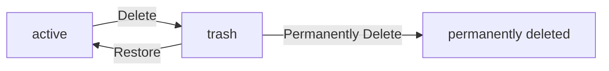

**todoApp — Business concepts, relationships, and states from user perspective**

Business concepts, relationships, and states from user perspective

# Domain Concepts

Describe what each concept means to users and why it exists.

## User Concept

Users are the central entities in this application, representing individuals who create and manage their own todo lists. Each user has a unique email address that serves as their login identifier and a securely stored password for authentication. When users sign up, they create an account that becomes the foundation for all their activities in the application. Users log in to access their personal workspace where they can create, edit, view, and delete their todos. Each user's data remains completely private and isolated from other users. Users can change their password for security purposes or update their display name through their profile settings. When users decide to delete their account, the system permanently removes all their todos and related data, including those in the trash folder and edit history. Users never see other users' accounts or data in this private todo application.

### Account Creation

WHEN a user signs up with their email and password, THE system SHALL:
1. Validate the email format
2. Ensure the email is unique across all users
3. Create a new user record with the provided email and securely hashed password
4. Initialize the user's profile with a default display name
5. Set the user's account status to active

THE system SHALL NOT create an account if the email is already registered by another user.
WHILE an account is active, THE system SHALL allow the user to log in with their credentials.

### Email Authentication

WHEN a user attempts to log in, THE system SHALL:
1. Accept the user's email and password as credentials
2. Verify the password matches the stored hash
3. Create an authenticated session for the user

IF the email is not found in the system, THE system SHALL reject the login attempt.
IF the password does not match the stored hash, THE system SHALL reject the login attempt.

WHEN a user's session expires, THE system SHALL require re-authentication with email and password.

### Password Management

WHEN a user requests to change their password, THE system SHALL:
1. Require the user to provide their current password
2. Validate that the new password meets security requirements
3. Securely hash the new password and update the user record

THE system SHALL NOT allow password changes without successful current password verification.
IF a user forgets their password, THE system SHALL provide a secure password recovery flow.

WHEN a user deletes their account, THE system SHALL permanently remove the password hash and all associated authentication data.

### Private Workspace

WHEN a user logs in, THE system SHALL:
1. Provide access to their personal workspace
2. Display only their own todos
3. Ensure their profile information is isolated from other users

WHILE in their workspace, THE system SHALL:
1. Allow users to create todos that are visible only to them
2. Permit editing of user-specific data
3. Restrict access to other users' data

THE system SHALL prevent users from viewing, accessing, or interacting with any data belonging to other users.

### Account Deletion

WHEN a user requests account deletion, THE system SHALL:
1. Begin a cascading deletion process
2. Permanently remove all todos created by the user
3. Permanently remove all todos in the user's trash folder
4. Permanently delete all edit history entries associated with the user's todos
5. Mark the user account as deleted in the system

WHILE the account deletion process is running, THE system SHALL:
1. Prevent the user from logging in
2. Maintain data integrity during deletion
3. Complete the deletion process without user intervention

AFTER account deletion, THE system SHALL NOT retain any data associated with the user.

### User Isolation

THE system SHALL ensure complete data isolation between users.

WHILE any user operation occurs, THE system SHALL:
1. Only return data belonging to the authenticated user
2. Block access attempts to other users' data
3. Filter all queries by the authenticated user's ID

IF a user attempts to access another user's data, THE system SHALL:
1. Reject the request
2. Log the access attempt for security monitoring

WHILE system operations occur, THE system SHALL maintain user data separation at all storage and processing layers.

## Profile Concept

Each user maintains a personal profile that stores their display name for identification purposes within the application interface. Users can edit their display name at any time to personalize their experience, but this name is only visible to themselves. Other users cannot view any profile information, maintaining the privacy-focused nature of this todo application. The display name appears alongside todos to identify which user created them when viewing lists. Profile data exists as a separate but linked entity to the user account and is automatically created when users sign up. Users cannot access profiles belonging to other users, ensuring complete data privacy. The profile serves as the only user-specific information visible within the system, containing just enough detail for identification without compromising privacy.

### Display Name

### Display Name

WHEN a user creates their profile, THE system SHALL:
1. Require a display name between 1 and 100 characters
2. Automatically create the display name field alongside their account

A display name is used to identify a user within the application interface without revealing their email address.

WHEN a user views their todos, THE system SHALL display their display name alongside each todo they have created.

The display name appears in the interface to identify which user created each todo, but never reveals the user's email address.

### Profile Editing

### Profile Editing

WHEN a user edits their profile, THE system SHALL:
1. Allow modification of the display name field
2. Preserve the existing profile if no changes are made
3. Update the display name to the new value provided

A user can change their display name at any time to personalize their experience.

WHILE a user is editing their profile, THE system SHALL:
1. Validate that the display name contains between 1 and 100 characters
2. Reject requests where the display name is empty or exceeds 100 characters

IF a user submits a display name with fewer than 1 character or more than 100 characters, THE system SHALL reject the request.

### Profile Privacy

### Profile Privacy

WHEN any user attempts to access another user's profile, THE system SHALL reject the request.

NO user, regardless of role or permissions, can view profile information belonging to another user.

Profile privacy is absolute in this private todo application—there is no mechanism to access another user's profile.

WHEN a user deletes their account, THE system SHALL permanently remove their profile data.

### User Identification

### User Identification

WHEN a user creates their profile, THE system SHALL:
1. Automatically link the profile to their user account
2. Use the email address as the unique identifier for the account

Each profile belongs to exactly one user account and contains only the display name for identification.

The profile serves as the user's only visible identifier in the application, showing their chosen display name instead of their email address.

WHEN a user is identified in the system, THE system SHALL use their profile display name in all interface elements.

### Profile Visibility

### Profile Visibility

WHEN a user views their own profile, THE system SHALL display their display name and profile information.

A user can only view their own profile information, never another user's profile.

Profile visibility is restricted to the profile owner only—this is a private todo application where user profiles are not shared.

WHEN the application needs to identify a user, THE system SHALL use their display name from their profile.

## Todo Concept

Todos represent individual tasks or items that users create to organize their work and personal activities. Users create todos with a required title and optional details including description, start date, and due date. When first created, todos are incomplete by default, awaiting user action. Users view todos in paginated lists that show key information like completion status, dates, and creation timestamps. Users can toggle completion status back and forth as tasks progress. Users can edit all aspects of their todos after creation, and every change is preserved in the edit history. When users delete a todo, it moves to a trash folder rather than being immediately removed, allowing recovery if needed. Users can permanently delete todos from trash when they no longer need them. Each user's todos exist in complete isolation from other users' todos.

### Todo Creation

WHEN a user creates a todo, THE system SHALL:
1. Require a title
2. Allow an optional description
3. Allow an optional start date
4. Allow an optional due date
5. Set the completion status to incomplete by default
6. Record the creation timestamp
7. Associate the todo with the creating user

IF the title is missing, THE system SHALL reject the request.
IF the title exceeds 500 characters, THE system SHALL reject the request.

WHERE a start date is provided, THE system SHALL validate that it is not later than the due date.
WHERE a due date is provided, THE system SHALL validate that it is not earlier than the start date.

WHILE a todo is incomplete, THE system SHALL allow the user to toggle its completion status.

### Completion Toggle

WHEN a user marks a todo as complete, THE system SHALL:
1. Change the completion status to complete
2. Record the completion timestamp in the edit history
3. Preserve all other todo attributes

WHEN a user marks a todo as incomplete, THE system SHALL:
1. Change the completion status to incomplete
2. Record the completion status change timestamp in the edit history
3. Preserve all other todo attributes

WHEN a user toggles the completion status, THE system SHALL:
1. Update the completion status to the opposite state
2. Record the change in the edit history
3. Update the editedAt timestamp

WHILE a todo is complete, THE system SHALL allow the user to revert it to incomplete.

### Edit Capability

WHEN a user edits a todo, THE system SHALL:
1. Allow modification of title, description, start date, and due date
2. Record each change in the edit history
3. Preserve unchanged attributes from the previous version
4. Update the editedAt timestamp to the current time

EACH edit MUST be recorded in the todo's edit history with:
- The timestamp of the edit
- The previous and new title (if changed)
- The previous and new description (if changed)
- The previous and new start date (if changed)
- The previous and new due date (if changed)

WHEN a user views a todo, THE system SHALL:
1. Display the current values of all attributes
2. Allow navigation to the full edit history
3. Show the complete edit history from most recent to oldest

WHILE viewing edit history, THE system SHALL:
1. Display all historical entries in reverse chronological order
2. Show only changes that occurred during user edits
3. Exclude system-managed timestamps and internal metadata

### Date Management

WHEN a todo is created, THE system SHALL:
1. Allow the user to optionally specify a start date
2. Allow the user to optionally specify a due date
3. Permit either date to be omitted or set to null
4. Validate that if both dates are provided, the start date is not later than the due date

WHEN sorting todos by start date, THE system SHALL:
1. Sort todos with a start date chronologically
2. Place todos without a start date at the end of the list

WHEN sorting todos by due date, THE system SHALL:
1. Sort todos with a due date chronologically
2. Place todos without a due date at the end of the list

WHEN editing a todo's dates, THE system SHALL:
1. Validate that the start date is not later than the due date
2. Allow either date to be cleared (set to null)
3. Update the edit history with date changes

WHERE a due date passes without completion, THE system SHALL:
1. Continue to show the todo as overdue in filtered views
2. Maintain the overdue state until completion or deletion

### Private Task Storage

WHEN a user creates a todo, THE system SHALL:
1. Associate the todo exclusively with the creating user
2. Ensure the todo is not visible to any other user
3. Maintain complete data isolation between users

WHEN a user requests a list of todos, THE system SHALL:
1. Return only todos belonging to that user
2. Exclude todos from other users regardless of relationship or access attempt
3. Ignore any external identifiers or shared references

WHEN a user queries for a specific todo, THE system SHALL:
1. Return the todo only if it belongs to the requesting user
2. Reject requests for todos belonging to other users
3. Return not found for deleted or non-existent todos in the same user's scope

WHERE any user attempts to access another user's todo, THE system SHALL:
1. Reject the request
2. Provide no information about the existence or non-existence of the requested todo

WHEN a user account is deleted, THE system SHALL:
1. Permanently remove all todos associated with that user
2. Remove all edit history entries for those todos
3. Ensure no data remains recoverable

### Trash Management

WHEN a user deletes a todo, THE system SHALL:
1. Perform a soft delete instead of permanent removal
2. Mark the todo as deleted
3. Preserve all todo data including edit history
4. Exclude the todo from normal todo lists

WHEN a user views their trash, THE system SHALL:
1. Display a list of deleted todos specific to that user
2. Include paginated results
3. Show the same information as the normal list: title, completion status, dates, and deletion timestamp

WHEN a user restores a todo from trash, THE system SHALL:
1. Mark the todo as not deleted
2. Return it to the normal todo list
3. Preserve the full edit history
4. Reset any completion status for recovery intent

WHEN a user permanently deletes a todo from trash, THE system SHALL:
1. Remove the todo permanently
2. Delete all associated edit history entries
3. Ensure no trace of the todo remains

WHEN a user account is permanently deleted, THE system SHALL:
1. Permanently delete all todos in trash
2. Delete all edit history for those todos
3. Ensure complete data erasure without possibility of recovery

## EditHistory Concept

EditHistory tracks every modification users make to their todos, providing a complete audit trail of changes over time. Each time a user edits a todo's title, description, start date, or due date, a new history entry is automatically created. Users can view the full edit history of any todo they own, seeing when each change occurred and what values were modified. The history entries are sorted from most recent to oldest, allowing users to trace the evolution of their todos. Each history entry records the timestamp, previous values, and new values for all changed fields. Users cannot access edit history for other users' todos, maintaining data privacy. The edit history persists until the todo is permanently deleted from the trash, at which point both the todo and its history are removed together. This feature helps users understand how their tasks have evolved and provides accountability for changes.

### Edit History Creation

WHEN a user edits a todo's title, description, start date, or due date, THE system SHALL create a new edit history entry.

WHEN an edit history entry is created, THE system SHALL:
1. Record the exact timestamp when the edit was made
2. Store the previous value and new value for each changed field
3. Associate the history entry with the specific todo being edited
4. Store the user ID of the person who made the edit

IF no fields were changed during an edit attempt, THE system SHALL NOT create a new history entry.

WHERE multiple fields are changed simultaneously, THE system SHALL create a single history entry that captures all changes made in that edit operation.

### Edit History Content

Each edit history entry records:

1. WHEN the edit occurred (timestamp)
2. The previous title and new title (only if title was changed)
3. The previous description and new description (only if description was changed)
4. The previous start date and new start date (only if start date was changed)
5. The previous due date and new due date (only if due date was changed)

WHERE a field was not modified during an edit, THE system SHALL NOT include it in the history entry.

THE system SHALL maintain the order of edit history entries based on when they were created.

WHEN a history entry is viewed, THE system SHALL display the time of edit in the user's local timezone.

### Viewing Edit History

WHEN a user requests to view the edit history of their todo, THE system SHALL return all history entries for that todo.

WHEN edit history is displayed, THE system SHALL sort entries from most recent to oldest.

WHERE a user requests edit history for a todo they do not own, THE system SHALL reject the request.

WHILE a user has permission to view a todo, THE system SHALL automatically include its edit history in the response.

WHERE a user views the details of their todo, THE system SHALL indicate how many edit history entries exist (without requiring a separate request).

# Domain Relationships

Describe how concepts relate to each other from a business perspective.

## Conceptual Relationships

Describe how concepts relate to each other in business terms.

### User-to-Todo Ownership

WHEN a user creates a todo, THE system SHALL establish exclusive ownership of that todo to the creating user.

WHILE a todo exists, THE system SHALL ensure only its owner can modify or delete it.

WHEN a user deletes their account, THE system SHALL permanently remove all todos owned by that user.

A user can never own a todo created by another user.

Each todo belongs to exactly one user.

WHEN a todo is restored from trash, THE system SHALL maintain its original owner.

WHEN a todo is permanently deleted from trash, THE system SHALL permanently remove its edit history.

WHEN a user's account is deleted, THE system SHALL permanently delete all associated todo edit history.

A user's ownership of todos cannot be transferred to another user.

### User-to-Profile Association

WHEN a user account is created, THE system SHALL automatically create an associated profile record.

A profile record can exist for exactly one user account.

WHEN a user updates their profile, THE system SHALL maintain the association between the profile and the original user account.

A user can view their own profile only—profiles of other users are never accessible.

WHEN a user deletes their account, THE system SHALL permanently delete their associated profile record.

The display name stored in a profile is user-specific and does not identify the user to others.

### Todo-to-EditHistory Relationship

WHEN a todo is first created, THE system SHALL initialize an empty edit history for that todo.

WHEN a todo's title is changed, THE system SHALL create a new edit history entry.

WHEN a todo's description is changed, THE system SHALL create a new edit history entry.

WHEN a todo's start date is changed, THE system SHALL create a new edit history entry.

WHEN a todo's due date is changed, THE system SHALL create a new edit history entry.

WHILE a todo exists, THE system SHALL maintain all edit history entries associated with it.

Each edit history entry records exactly one change operation on a specific todo.

A todo can have multiple edit history entries—each records one modification event.

WHEN a todo is permanently deleted from trash, THE system SHALL remove all associated edit history entries.

### Bidirectional Entity Links

Each todo record explicitly references its owner user account.

Each profile record explicitly references its associated user account.

Each edit history entry explicitly references the todo it documents changes for.

When querying a user's todos, THE system SHALL include all todos linked to that user's account.

When querying a todo's edit history, THE system SHALL include all edit history entries linked to that todo.

When a user account is deleted, THE system SHALL remove all references from associated todos and profile records.

A todo reference cannot point to multiple user accounts—it points to exactly one.

An edit history entry reference cannot point to multiple todos—it points to exactly one.

## Lifecycle and Retention

Describe business rules for concept lifecycle and data retention from a user perspective.

### User Lifecycle and Retention

WHEN a user signs up, THE system SHALL create a user account with the provided email and hashed password.

WHEN a user deletes their account, THE system SHALL:
1. Permanently remove all of the user's todos (including those in trash)
2. Permanently remove all of the user's edit history
3. Permanently remove the user's profile
4. Deactivate the account immediately

THE system SHALL retain user account data only as long as the account exists.

WHILE an account is active, THE system SHALL retain the user's email, password hash, and timestamps (createdAt, updatedAt).

WHERE an account is deleted, THE system SHALL immediately erase all user data permanently without recoverable period.

### Todo Lifecycle and Retention

WHEN a todo is created, THE system SHALL set its status to incomplete by default.

WHEN a todo is marked as complete, THE system SHALL update its completion status.

WHEN a todo is marked as incomplete, THE system SHALL update its completion status.

WHEN a todo is soft-deleted, THE system SHALL move it to the user's trash without permanently removing data.

WHILE a todo is in trash, THE system SHALL NOT include it in the normal todo list.

WHILE a todo is not in trash, THE system SHALL include it in the normal todo list.

THE system SHALL retain todo data for as long as it exists in either active or trash state.

### EditHistory Lifecycle and Retention

WHEN a todo is edited, THE system SHALL create a new edit history entry.

Each edit history entry SHALL record:
1. When the edit was made
2. The previous and new values for title (if changed)
3. The previous and new values for description (if changed)
4. The previous and new values for start date (if changed)
5. The previous and new values for due date (if changed)

WHEN a todo is permanently deleted, THE system SHALL also delete all associated edit history entries.

WHILE a todo exists (including in trash), THE system SHALL retain all edit history entries for that todo.

Edit history entries SHALL be sorted from most recent to oldest.

### Archival and Recovery (Trash System)

WHEN a user views their trash, THE system SHALL display only deleted todos belonging to that user.

WHEN a todo is restored from trash, THE system SHALL:
1. Move the todo back to the normal todo list
2. Restore all todo properties including completion status
3. Preserve all edit history

WHEN a user permanently deletes a todo from trash, THE system SHALL:
1. Permanently remove the todo
2. Permanently remove all associated edit history entries
3. Make the data irrecoverable

THE system SHALL NOT automatically archive or permanently delete todos after a retention period.

WHILE a todo remains in trash, THE system SHALL retain it indefinitely until the user takes action.

# Enums and State Machines

Enum type definitions and state transitions.

## Enum Definitions

Define all enum types with their allowed values and descriptions.

### Todo Completion Status Enum

### Todo Completion Status

WHEN a todo is created, THE system SHALL automatically set its completion status to incomplete.

THE system SHALL support only two completion statuses for todos:
1. "incomplete" - The default state when a todo is created
2. "complete" - The state when a user has marked the todo as finished

WHEN a user marks a todo as complete, THE system SHALL set its completion status to "complete".

WHEN a user marks a todo as incomplete, THE system SHALL set its completion status to "incomplete".

WHEN filtering todos by completion status, THE system SHALL support three filter options:
1. "all" - Include both complete and incomplete todos
2. "complete" - Include only complete todos
3. "incomplete" - Include only incomplete todos

### Edit History Field Tracking Enum

THE system SHALL track changes to the following fields in edit history entries:
1. "title" - When the todo title is modified
2. "description" - When the todo description is modified
3. "startDate" - When the todo start date is modified
4. "dueDate" - When the todo due date is modified

WHEN recording an edit history entry, THE system SHALL include:
- The timestamp of when the edit was made
- The previous and new values for each tracked field that was changed
- NO change tracking for fields not in this allowed enumeration

### Trash and Deletion State Enum

### Todo Deletion State Enum

WHEN a user deletes a todo, THE system SHALL set its deletion state to "trashed" rather than permanently removing it.

THE system SHALL support only two deletion states for todos:
1. "active" - The todo is in normal use and visible in the user's todo list
2. "trashed" - The todo has been deleted but is still recoverable from the trash

WHEN a user permanently deletes a todo from the trash, THE system SHALL set its deletion state to "permanently_deleted" and remove all associated edit history.

WHEN viewing the trash list, THE system SHALL return only todos with deletion state "trashed".

## State Transitions

Define valid state transition paths for stateful concepts.

### Todo State Transitions

### Todo Creation

WHEN a user creates a todo, THE system SHALL assign the initial state as "incomplete".

### Todo Completion Toggle

WHEN a user marks a todo as complete, THE system SHALL transition its state from "incomplete" to "complete".
WHEN a user marks a todo as incomplete, THE system SHALL transition its state from "complete" to "incomplete".

### Todo Deletion

WHEN a user deletes a todo, THE system SHALL transition its state from "active" to "trash".

### Todo Restoration

WHEN a user restores a todo from trash, THE system SHALL transition its state from "trash" to "active".

### Todo Permanent Deletion

WHEN a user permanently deletes a todo from trash, THE system SHALL transition its state from "trash" to "permanently deleted".

### Edit History Lifecycle

### Edit History Creation

WHEN a todo is edited, THE system SHALL create a new edit history entry and associate it with the todo.
WHEN a todo is created, THE system SHALL create an initial edit history entry documenting the creation.

### Edit History Retention

WHEN a todo is permanently deleted, THE system SHALL delete all associated edit history entries.

### Edit History Access

WHILE a todo is in "active" or "trash" state, THE system SHALL allow the owner to view its complete edit history.

### Workflow: Todo Deletion and Recovery

### Status Change Constraints

A todo in "permanently deleted" state cannot be restored.
A todo in "active" state cannot be directly deleted to "permanently deleted" — deletion must first transition to "trash".
A todo in "trash" state can only be restored to "active" or permanently deleted — no direct transition to "complete" or "incomplete" is allowed while in trash.