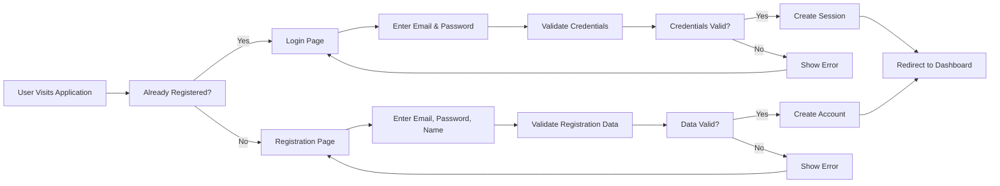
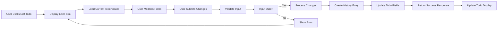
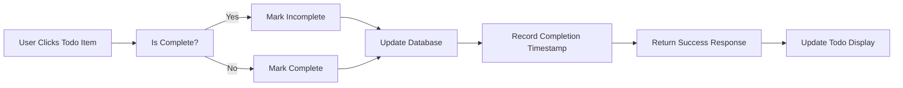
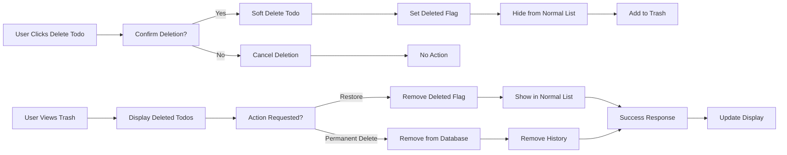

# Multi-User Todo Application Requirements Specification Document

## Table of Contents

1. [Introduction](#introduction)
2. [Service Overview](#service-overview)
3. [User Actors](#user-actors)
4. [Functional Requirements](#functional-requirements)
5. [User Workflows](#user-workflows)
6. [Business Rules](#business-rules)
7. [Performance Requirements](#performance-requirements)
8. [Security Considerations](#security-considerations)

---

## Introduction

This requirements specification document provides a comprehensive overview of the Multi-User Todo Application system. The document serves as the foundation for backend development, detailing all business requirements, user workflows, and system behaviors necessary to implement a secure, efficient, and user-friendly todo management application.

The Multi-User Todo Application enables multiple independent users to create, manage, and organize their personal todo lists while maintaining strict data privacy and security standards. Each user's data is completely isolated from other users, ensuring complete privacy and security of personal information.

## Service Overview

### Business Model

The Multi-User Todo Application is designed to provide a private, secure todo management solution for individuals who want to organize their tasks without compromising their data privacy. Unlike many public todo applications that may share user data or display advertisements, this application focuses on:

- **User Privacy**: Complete data isolation between users with no sharing capabilities
- **Data Ownership**: Users retain full control over their data with the ability to delete it permanently
- **No Advertising**: A clean, distraction-free interface focused solely on task management
- **Cross-Device Accessibility**: Users can access their todo lists from any device with internet connectivity

The business model is centered on providing value through privacy and security rather than through data monetization. Revenue generation strategies may include premium features in future versions while maintaining the core privacy-focused approach.

### Service Vision

The vision for this service is to become the preferred todo management application for privacy-conscious individuals who want powerful task management capabilities without sacrificing their personal data security. The service aims to demonstrate that privacy and functionality are not mutually exclusive but can be successfully combined to create a superior user experience.

### Key Service Characteristics

- **Private by Design**: Every user's data is completely isolated from others
- **Simple Interface**: Clean, intuitive interface focused on core functionality
- **Reliable Storage**: Robust data persistence with proper backup and recovery mechanisms
- **Mobile-First**: Optimized for use on mobile devices while maintaining desktop compatibility
- **Offline Support**: Future capability to work offline with automatic sync when connection is restored

## User Actors

### User Actor: Member (Authenticated User)

The primary actor in the system is the authenticated user who interacts with the todo application to manage their personal tasks. This actor has the following capabilities and limitations:

#### Capabilities

- **Account Management**: Register, log in, update profile, and delete their account
- **Todo Creation**: Create new todo items with titles, descriptions, and optional dates
- **Todo Viewing**: View lists of their todos with pagination and various filtering/sorting options
- **Todo Management**: Mark todos as complete/incomplete, edit todo details, and manage todo status
- **Todo Deletion**: Delete todos with soft deletion (move to trash) or permanent deletion
- **Trash Management**: View, restore, or permanently delete items in their trash
- **History Access**: View edit history for all their todo items

#### Limitations

- **No Cross-User Access**: Cannot view, access, or interact with other users' data
- **No Public Sharing**: Todo items cannot be shared with other users or made public
- **Profile Privacy**: Profile information is visible only to the account owner
- **Single Account**: Each email address can only be used for one account

### Non-Authenticated Users

Individuals who have not logged in or created an account have no access to the system. They cannot view any data, create accounts without proper registration, or access any functionality beyond the login/registration pages.

## Functional Requirements

### Account Management Requirements

#### User Registration

WHEN a new user provides their email address and password, THE system SHALL create a new user account with the provided credentials and a default display name derived from the email address.

WHILE user registration is in progress, THE system SHALL validate that the email address is not already registered and that the password meets minimum security requirements (minimum length, contains required character types).

IF an email address is already registered, THEN THE system SHALL return an appropriate error message and prevent duplicate account creation with that email.

IF password requirements are not met, THEN THE system SHALL return an error message specifying the password requirements that were not satisfied.

#### User Login

WHEN a user submits their email and password for authentication, THE system SHALL verify the credentials and create a new user session.

IF credentials are valid, THEN THE system SHALL return a session token and user information.

IF credentials are invalid, THEN THE system SHALL return an appropriate error message indicating authentication failure.

#### Profile Management

THE system SHALL allow users to view their own profile information including display name.

WHEN a user requests to update their profile, THE system SHALL allow modification of their display name while keeping other profile information unchanged.

IF a user attempts to update their profile with invalid data, THEN THE system SHALL return an error message and preserve the existing profile information.

#### Password Management

WHEN a user requests to change their password, THE system SHALL validate their current password before allowing the change.

THE system SHALL require users to provide both their current password and the new password when changing passwords.

IF the current password provided does not match the stored password, THEN THE system SHALL return an error message and prevent the password change.

#### Account Deletion

WHEN a user requests account deletion, THE system SHALL permanently delete all data associated with that account including all todo items, trash items, and edit history.

THE deletion process SHALL be irreversible once confirmed.

WHILE account deletion is processing, THE system SHALL ensure all related data is completely removed from the system.

### Todo Creation Requirements

WHEN a user creates a new todo, THE system SHALL store the todo with the provided title (required), description (optional), start date (optional), and due date (optional).

WHILE a todo is being created, THE system SHALL validate that the title field is not empty.

IF the title field is empty, THEN THE system SHALL return an error message indicating that the title is required.

WHEN a todo is successfully created, THE system SHALL set the completion status to "incomplete" by default.

THE system SHALL record the creation timestamp when a todo is first created.

### Todo View Requirements

WHEN a user requests a list of their todos, THE system SHALL return a paginated list of their todos based on their current filter and sort preferences.

Each todo in the list SHALL include the following information:

- Title
- Completion status (complete or incomplete)
- Start date (if set) or null
- Due date (if set) or null
- Creation timestamp

WHEN a user requests details for a specific todo, THE system SHALL return all information about that todo including the full description.

IF a user requests a todo that does not belong to them, THEN THE system SHALL deny access and return an appropriate error message.

WHEN retrieving todo lists, THE system SHALL apply the user's current filtering and sorting preferences.

### Todo Completion Requirements

WHEN a user requests to mark a todo as complete, THE system SHALL update the todo's completion status to "complete".

WHEN a user requests to mark a todo as incomplete, THE system SHALL update the todo's completion status to "incomplete".

THE toggle operation SHALL be atomic and immediate.

### Todo Editing Requirements

WHEN a user requests to edit a todo, THE system SHALL accept updates to the title, description, start date, and due date fields.

WHEN a todo is successfully edited, THE system SHALL create a new history entry recording the changes.

THE system SHALL allow partial updates where only some fields are modified.

WHEN updating only certain fields, THE system SHALL preserve existing values for fields not included in the update request.

### Todo History Requirements

WHEN a user requests the edit history for a todo, THE system SHALL return a chronological list of all history entries for that todo.

History entries SHALL be sorted from most recent to oldest.

Each history entry SHALL include:

- Timestamp of the edit
- Title before and after the edit (if changed)
- Description before and after the edit (if changed)
- Start date before and after the edit (if changed)
- Due date before and after the edit (if changed)

WHEN a history entry records changes, THE system SHALL only include fields that were actually modified.

### Todo Deletion Requirements

WHEN a user requests to delete a todo, THE system SHALL perform a soft delete by marking the todo as deleted.

THE system SHALL retain the todo in the database with a deleted flag rather than permanently removing it.

A soft-deleted todo SHALL NOT appear in normal todo lists.

### Trash Management Requirements

WHEN a user requests their trash list, THE system SHALL return a paginated list of their soft-deleted todos.

WHEN a user requests to restore a todo from trash, THE system SHALL remove the deleted flag and make the todo visible in normal todo lists again.

WHEN a user requests permanent deletion of a todo from trash, THE system SHALL permanently remove the todo and all associated edit history entries.

THE permanent deletion SHALL be irreversible.

### Filtering Requirements

WHEN a user requests to filter their todo list, THE system SHALL support the following filter options:

- All todos (default)
- Only complete todos
- Only incomplete todos

WHILE filtering is applied, THE system SHALL return only todos that match the specified criteria.

THE system SHALL combine filtering with existing sorting preferences.

### Sorting Requirements

WHEN a user requests to sort their todo list, THE system SHALL support the following sorting options:

- Creation date: newest first
- Creation date: oldest first
- Start date: earliest first
- Start date: latest first
- Due date: earliest first
- Due date: latest first

WHEN sorting by start date, THE system SHALL place todos without a start date at the end of the list.

WHEN sorting by due date, THE system SHALL place todos without a due date at the end of the list.

WHILE sorting is applied, THE system SHALL maintain the filter criteria.

## User Workflows

### User Registration and Authentication Workflow

### Creating a New Todo Workflow

```mermaid
graph LR
  A["User Clicks New Todo"] --> B["Display Creation Form"]
  B --> C["User Enters Title"]
  C --> D["User Optionally Enters Description"]
  D --> E["User Optionally Sets Start Date"]
  E --> F["User Optionally Sets Due Date"]
  F --> G["User Submits Form"]
  G --> H["Validate Title"]
  H --> I["Title Valid?"]
  I -->|Yes| J["Create Todo"]
  I -->|No| K["Show Error"]
  J --> L["Set Default Incomplete"]
  L --> M["Record Creation Timestamp"]
  M --> N["Return Success Response"]
  K --> B
  N --> O["Update Todo List"]
```

### Editing an Existing Todo Workflow

### Completing a Todo Workflow

### Deleting and Restoring Todos Workflow

## Business Rules

### Data Validation Rules

#### Title Validation

WHEN a user creates or edits a todo, THE system SHALL validate that the title field is not empty.

IF the title field is empty or contains only whitespace, THEN THE system SHALL return an error message.

#### Date Validation

WHEN a user sets a start date or due date, THE system SHALL validate that the date is in a valid format.

IF a date is provided in an invalid format, THEN THE system SHALL return an error message.

WHILE sorting, THE system SHALL treat invalid dates as missing values.

#### Description Validation

WHEN a user enters a description, THE system SHALL accept any text up to a reasonable maximum length (recommended: 10,000 characters).

IF a description exceeds the maximum length, THEN THE system SHALL return an error message.

#### Email Validation

WHEN a user registers or updates their email, THE system SHALL validate that the email is in a valid format and is unique.

IF email validation fails, THEN THE system SHALL return an appropriate error message.

### Todo State Management

#### Default Todo State

WHEN a new todo is created, THE system SHALL set the completion status to "incomplete" by default.

#### Completion Status Options

THE system SHALL support exactly two completion status values:

- Incomplete (default)
- Complete

#### Editing Restrictions

WHILE a todo is in the trash, THE system SHALL NOT allow editing of the todo's fields.

### Edit History Requirements

#### History Entry Creation

WHEN a todo is edited, THE system SHALL create a new history entry.

THE history entry SHALL be created at the time of the edit operation.

#### History Entry Content

Each history entry SHALL record the following information:

- Timestamp of the edit operation
- Title value before the edit (if changed)
- Title value after the edit (if changed)
- Description value before the edit (if changed)
- Description value after the edit (if changed)
- Start date value before the edit (if changed)
- Start date value after the edit (if changed)
- Due date value before the edit (if changed)
- Due date value after the edit (if changed)

#### History Entry Preservation

THE system SHALL preserve all history entries for the lifetime of the todo.

### Trash Management Rules

#### Soft Delete Implementation

WHEN a user deletes a todo, THE system SHALL mark the todo as deleted rather than permanently removing it.

THE deleted todo SHALL remain in the database for potential recovery.

#### Trash Access

WHEN a user accesses their trash, THE system SHALL return only todos marked as deleted.

#### Restore Functionality

WHEN a user restores a todo from trash, THE system SHALL remove the deleted flag.

THE restored todo SHALL be added back to the normal todo list.

#### Permanent Deletion

WHEN a user permanently deletes a todo from trash, THE system SHALL:

1. Remove the todo from the database
2. Remove all history entries associated with the todo
3. Permanently delete all related data

THE permanent deletion SHALL be irreversible.

### Privacy and Access Control Rules

#### User Data Isolation

THE system SHALL ensure that users can only access their own todos.

IF a user attempts to access a todo belonging to another user, THEN THE system SHALL deny access.

#### Profile Privacy

THE system SHALL restrict profile information access to the account owner only.

IF a user attempts to view another user's profile, THEN THE system SHALL deny access.

#### Authentication Requirements

WHEN a user attempts to access protected resources, THE system SHALL require valid authentication.

IF a user is not authenticated, THEN THE system SHALL return an authentication error.

### Sorting and Filtering Rules

#### Sort Priority

WHEN multiple sort criteria are specified, THE system SHALL apply them in the order they were requested.

#### Missing Date Handling

WHEN sorting todos by start date, THE system SHALL place todos without a start date at the end of the list.

WHEN sorting todos by due date, THE system SHALL place todos without a due date at the end of the list.

#### Filter Combination

WHILE both filtering and sorting are applied, THE system SHALL first filter the todos according to the filter criteria, then apply sorting to the filtered results.

## Performance Requirements

### Response Time Expectations

#### Todo List Loading

WHEN a user loads their todo list, THE system SHALL return results within 2 seconds for typical data volumes (up to 10,000 todos).

WHEN a user loads a large todo list (10,000+ todos), THE system SHALL return results within 5 seconds.

#### Todo Creation

WHEN a user creates a new todo, THE system SHALL return confirmation within 1 second.

#### Todo Editing

WHEN a user edits an existing todo, THE system SHALL return confirmation within 1 second.

#### Authentication Operations

WHEN a user logs in or logs out, THE system SHALL complete the operation within 1 second.

### Pagination Requirements

#### Default Page Size

WHEN returning todo lists, THE system SHALL use a default page size of 20 items.

#### Maximum Page Size

THE system SHALL limit the maximum page size to 100 items to prevent performance degradation.

#### Page Navigation

WHEN a user navigates between pages, THE system SHALL return the requested page within the performance targets.

#### Invalid Page Handling

IF a user requests a page beyond the available range, THEN THE system SHALL return an appropriate error message.

### Concurrency Considerations

#### Simultaneous Updates

WHILE multiple users update the same todo simultaneously (unlikely but possible), THE system SHALL use optimistic locking to prevent data loss.

#### Session Management

THE system SHALL support concurrent sessions for the same user.

### User Experience Goals

#### Interface Responsiveness

WHEN a user performs any action, THE system SHALL provide immediate visual feedback within 200 milliseconds.

#### Loading Indicators

WHEN an operation takes more than 1 second to complete, THE system SHALL display a loading indicator.

#### Error Recovery

WHEN an error occurs, THE system SHALL provide clear guidance on how the user can recover or retry the action.

## Security Considerations

### Data Privacy Requirements

#### Complete Data Isolation

THE system SHALL ensure that each user's todo data is completely isolated from other users' data.

#### No Unauthorized Access

THE system SHALL prevent any form of unauthorized data access including:

- Direct database access
- API manipulation
- Parameter injection
- Session hijacking

### Access Control Requirements

#### Resource Ownership Verification

WHEN a user requests access to a specific resource, THE system SHALL verify that the resource belongs to that user.

IF the resource does not belong to the user, THEN THE system SHALL deny access.

#### Permission Validation

WHEN a user attempts to perform an action, THE system SHALL validate that the user has permission to perform that action.

IF the user lacks permission, THEN THE system SHALL return an appropriate error message.

### Authentication Security

#### Password Security

WHEN a user sets or changes their password, THE system SHALL store the password using industry-standard hashing algorithms.

THE system SHALL enforce minimum password complexity requirements.

#### Session Security

WHEN a user logs in, THE system SHALL create a secure session token.

THE session token SHALL have a reasonable expiration time.

### Session Security

#### Token Expiration

THE system SHALL implement automatic session expiration after 30 days of inactivity.

#### Token Revocation

WHEN a user logs out, THE system SHALL immediately invalidate their session token.

#### Concurrent Session Support

THE system SHALL support multiple concurrent sessions for the same user.

### Audit and Logging

#### Security Event Logging

THE system SHALL log security-relevant events including:

- Failed login attempts
- Successful logins
- Password changes
- Account deletions
- Suspicious activities

#### Log Retention

THE system SHALL retain security logs for at least 90 days.

---

*Developer Note: This document defines **business requirements only**. All technical implementations (architecture, APIs, database design, etc.) are at the discretion of the development team.*