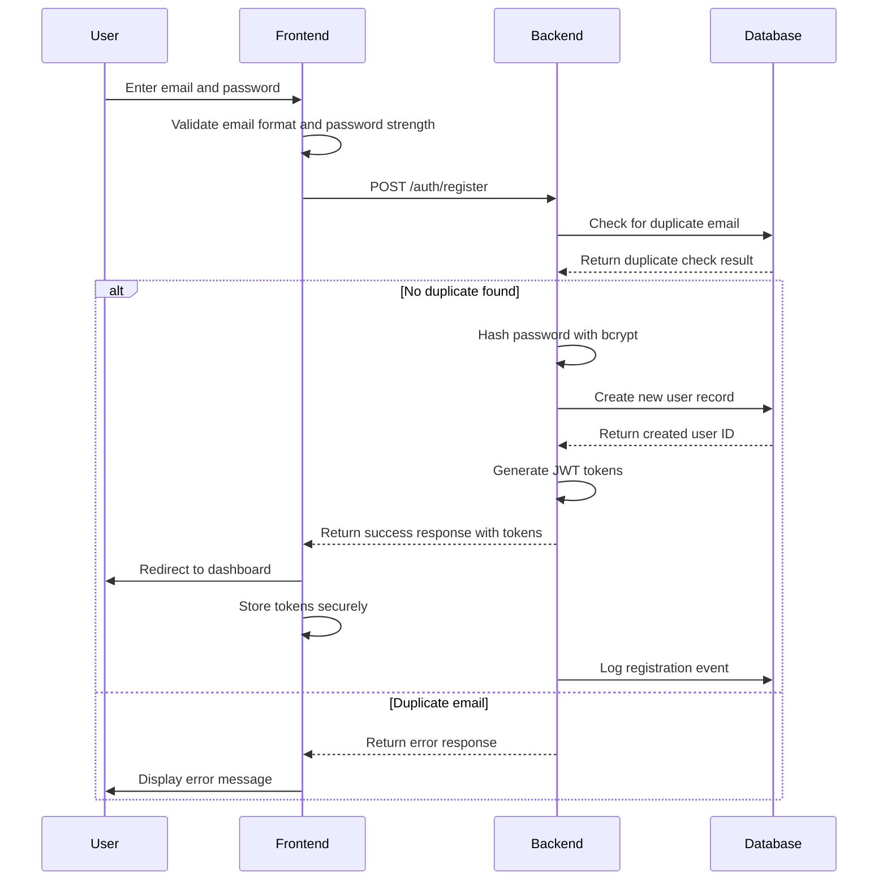
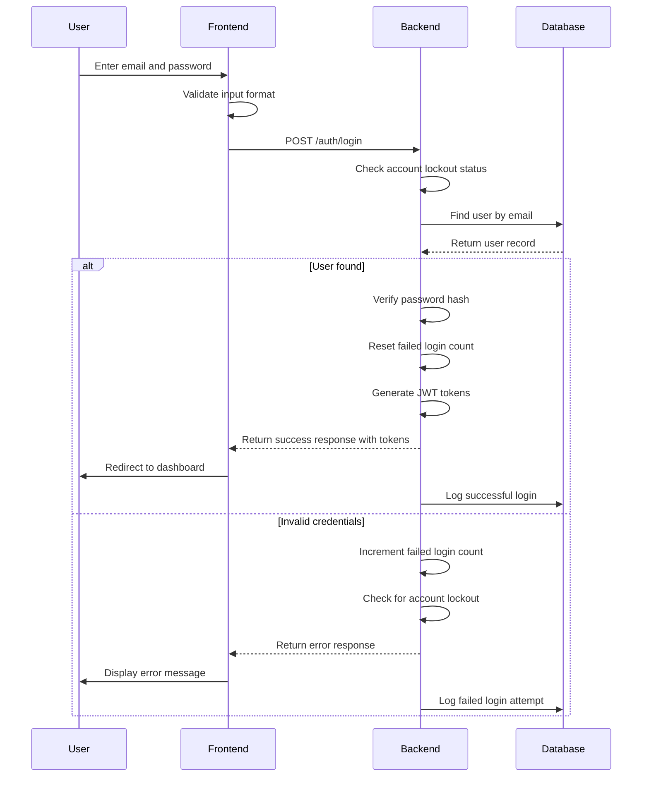
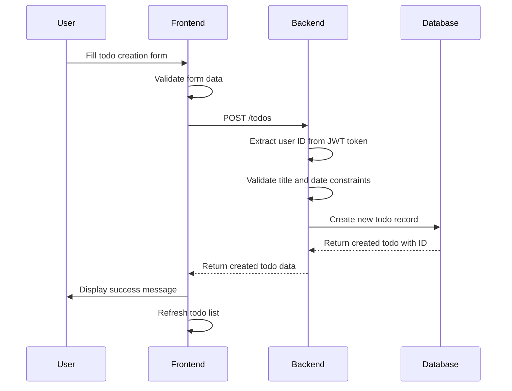

# Multi-User Todo Application - Requirements Specification

## 1. User Authentication and Account Management

### 1.1 User Registration
WHEN a new user visits the application, THE system SHALL provide a registration form requiring email address and password. The system SHALL:
- Validate email format (user@example.com format)
- Require password of minimum length (8 characters) and complexity (at least one uppercase letter, one lowercase letter, one number, and one special character)
- Store user credentials securely using bcrypt hashing with salt rounds of 12
- Create a new user account with a unique identifier (UUID v4)
- Automatically log the user in after successful registration
- Send a welcome email notification

WHILE user registration, THE system SHALL provide real-time validation. The system SHALL:
- Show error messages immediately for invalid email format
- Display password strength indicator during input
- Validate password confirmation matches before submission
- Prevent duplicate email registration
- Display helpful guidance for field requirements

### 1.2 User Login
WHEN a registered user returns to the application, THE system SHALL provide a login form requiring email address and password. The system SHALL:
- Verify the provided credentials against stored user data
- Issue JWT access token with 1-hour expiration time
- Issue refresh token with 7-day expiration time
- Create a user session with appropriate security measures
- Redirect the user to their todo dashboard
- Display appropriate error messages for invalid credentials
- Lock account after 5 consecutive failed login attempts for 15 minutes

WHILE user login, THE system SHALL implement security measures. The system SHALL:
- Rate limit login attempts from the same IP address
- Log failed login attempts for security monitoring
- Require CAPTCHA after 3 consecutive failures from same IP
- Notify user of new device login via email notification
- Support two-factor authentication optional implementation

### 1.3 Password Management
WHILE a user is logged in, THE system SHALL allow them to change their password. The system SHALL:
- Require the user to provide their current password
- Require the new password to meet minimum complexity requirements
- Validate the new password confirmation matches
- Update the stored password securely using bcrypt hashing
- Maintain the user's session after successful password change
- Invalidate all other active sessions after password change

WHEN a user forgets their password, THE system SHALL provide a password recovery process. The system SHALL:
- Require the user's email address
- Send a secure recovery link or code to that email with 1-hour expiration
- Allow the user to set a new password after verification
- Invalidate all active sessions after password change
- Log all password recovery attempts for security monitoring

### 1.4 Account Deletion
WHEN a user decides to delete their account, THE system SHALL permanently remove all their data. The system SHALL:
- Require the user to confirm their intention through a two-step process
- Permanently delete all todos associated with the account
- Permanently delete all edit history for those todos
- Permanently delete all trash items for those todos
- Terminate the user session
- Make all data unrecoverable after 30-day backup retention period
- Send confirmation email to the user's registered email address

### 1.5 Session Management
WHILE a user is authenticated, THE system SHALL maintain their session. The system SHALL:
- Issue access tokens with 1-hour expiration time
- Allow token refresh when expiration approaches (within 30 minutes)
- Terminate sessions upon explicit logout
- Handle session expiration gracefully
- Require re-authentication after session expiration
- Support concurrent session management
- Implement session activity tracking

## 2. Todo Management Features

### 2.1 Creating Todos
WHEN a user wants to add a new task, THE system SHALL provide a todo creation form. The system SHALL:
- Require a title field (non-empty string, maximum 255 characters)
- Allow an optional description field (can be empty, maximum 5,000 characters)
- Allow an optional start date field (can be empty, must be valid ISO date format)
- Allow an optional due date field (can be empty, must be valid ISO date format)
- Set newly created todos as incomplete by default
- Store the creation timestamp automatically (UTC timezone)
- Validate required fields before creation
- Return appropriate error messages for validation failures
- Support rich text formatting in description field

WHILE creating a todo, THE system SHALL provide real-time validation. The system SHALL:
- Show error messages immediately for invalid input
- Allow users to modify fields before submission
- Prevent submission of incomplete required information
- Display helpful guidance for field requirements
- Validate date ranges (due date cannot be before start date)

### 2.2 Viewing Todo Lists
WHEN a user opens their todo list, THE system SHALL display their todos in a paginated view. The system SHALL:
- Show a configurable number of todos per page (default: 20 items)
- Include the title of each todo
- Include the completion status (complete or incomplete)
- Include the start date if set (formatted as YYYY-MM-DD)
- Include the due date if set (formatted as YYYY-MM-DD)
- Include the creation timestamp (formatted with timezone awareness)
- Provide navigation controls for other pages
- Display appropriate messages when no todos exist
- Support infinite scroll as an alternative pagination method

WHEN a user navigates between pages, THE system SHALL update the view. The system SHALL:
- Load the appropriate set of todos for the requested page
- Update pagination controls to reflect current position
- Maintain filter and sort settings across page navigation
- Preserve user preferences for display options
- Support bookmarking specific pages with filters

### 2.3 Viewing Single Todos
WHEN a user selects a specific todo for detailed view, THE system SHALL display all its information. The system SHALL:
- Show the complete title
- Show the full description (even if empty)
- Show the start date if set (or indicate "Not set")
- Show the due date if set (or indicate "Not set")
- Show the completion status clearly
- Show the creation timestamp
- Show the last update timestamp
- Display a history of edits if available
- Show todo priority level if implemented

WHILE viewing a single todo, THE system SHALL allow immediate actions. The system SHALL:
- Provide buttons to edit the todo
- Provide buttons to complete/uncomplete the todo
- Provide buttons to delete the todo
- Enable these actions without leaving the detail view
- Show visual feedback for action completion

### 2.4 Completing and Uncompleting Todos
WHEN a user marks a todo as complete, THE system SHALL update its status. The system SHALL:
- Change the todo's completion status to "complete"
- Record the completion timestamp
- Update the todo in the user's todo list immediately
- Reflect the change in filtered views
- Update any related dashboard metrics
- Notify other devices of status change in real-time
- Track completion streaks for motivation

WHEN a user marks a complete todo as incomplete, THE system SHALL revert its status. The system SHALL:
- Change the todo's completion status to "incomplete"
- Record the uncompletion timestamp
- Update the todo in the user's todo list immediately
- Reflect the change in filtered views
- Update any related dashboard metrics
- Reset any completion streaks
- Log the status change for audit purposes

### 2.5 Editing Todos
WHEN a user modifies a todo's details, THE system SHALL allow changes to specific fields. The system SHALL:
- Allow title modification
- Allow description modification
- Allow start date modification
- Allow due date modification
- Validate all fields according to creation rules
- Create an edit history entry for each change
- Update the todo's last modification timestamp
- Update the todo in the user's todo list immediately
- Support partial updates (PATCH method)
- Implement optimistic concurrency control

#### 2.5.1 Edit History Requirements
WHEN a todo is edited, THE system SHALL create a history entry. The system SHALL:
- Record the exact timestamp of the edit (UTC timezone)
- Store the previous title if changed
- Store the previous description if changed
- Store the previous start date if changed
- Store the previous due date if changed
- Link the history entry to the specific todo
- Display edits from most recent to oldest
- Maintain edit history even if other fields are modified
- Store the user ID who made the edit (for multi-user scenarios)
- Track the exact changes made to each field

WHEN a user views a todo's edit history, THE system SHALL display complete information. The system SHALL:
- Show the timestamp of each edit
- Show what changed in each edit (title, description, start date, due date)
- Show the exact values before and after each edit
- Sort entries from most recent to oldest
- Display appropriate messages when no history exists
- Support filtering history by specific field changes
- Export history as JSON for backup purposes

#### 2.5.2 Permanent Edit History Deletion
WHEN a todo is permanently deleted, THE system SHALL remove all associated history. The system SHALL:
- Delete all edit history entries for that todo
- Ensure history entries are unrecoverable
- Clear any cached history information
- Maintain data integrity across the system
- Log the deletion for audit purposes
- Update any related analytics data

### 2.6 Deleting Todos
WHEN a user deletes a todo, THE system SHALL implement soft deletion. The system SHALL:
- Remove the todo from normal view in the todo list
- Preserve the todo data in the database
- Move the todo to the user's trash section
- Maintain the edit history for the todo
- Record the deletion timestamp
- Allow the todo to be restored from trash
- Implement soft delete with deleted_at timestamp
- Maintain referential integrity

#### 2.6.1 Trash List Display
WHEN a user views their trash, THE system SHALL display deleted todos separately. The system SHALL:
- Show only todos that have been soft-deleted
- Include the title of each deleted todo
- Include the original completion status
- Include the deletion timestamp
- Paginate the list for performance (default: 20 items per page)
- Display clear visual indicators that these are deleted items
- Support restoration from trash directly from the list
- Show the total count of deleted items

#### 2.6.2 Restore from Trash
WHEN a user restores a deleted todo, THE system SHALL return it to normal view. The system SHALL:
- Move the todo from trash to normal todo list
- Restore the todo's edit history
- Update the last modification timestamp
- Make the todo visible in all normal views
- Remove the deletion timestamp from the record
- Update any related cache entries
- Log the restoration event
- Clear any expired trash items

#### 2.6.3 Permanent Deletion
WHEN a user permanently deletes a todo from trash, THE system SHALL remove all related data. The system SHALL:
- Permanently delete the todo from the database
- Permanently delete all associated edit history entries
- Permanently delete the todo from the trash
- Ensure data is unrecoverable
- Clear any cached information about the todo
- Update any related analytics data
- Log the permanent deletion for audit purposes
- Return appropriate success confirmation

## 3. Privacy Controls

### 3.1 Complete User Data Isolation
WHILE any operation occurs, THE system SHALL ensure users can only access their own data. The system SHALL:
- Automatically filter all queries by the authenticated user's ID
- Prevent queries from accessing other users' data
- Log access attempts that might indicate unauthorized access
- Implement multiple layers of access control
- Validate ownership on every operation
- Implement row-level security in database
- Audit all data access for security monitoring
- Implement data masking for sensitive fields

### 3.2 Access Control Requirements
WHEN a user attempts to access data, THE system SHALL verify permissions. The system SHALL:
- Check that the user is authenticated before granting access
- Verify that requested data belongs to the authenticated user
- Deny access attempts to other users' data with appropriate error messages
- Log suspicious access patterns for security review
- Maintain audit trails for all data access
- Implement role-based access control
- Support permission inheritance for shared resources
- Audit all access attempts

### 3.3 No Cross-User Visibility
THE system SHALL NOT provide any mechanism for users to discover other users. The system SHALL:
- Never display other users' information in any interface
- Never expose user identifiers in API responses
- Never allow users to search for or browse other users
- Never create relationships between user accounts
- Maintain complete data isolation between all users
- Implement user anonymization in logs
- Mask user identifiers in all public-facing outputs
- Audit cross-user access attempts

### 3.4 Session Isolation
WHILE a user session exists, THE system SHALL maintain session integrity. The system SHALL:
- Ensure one user's session cannot affect another user's session
- Use secure session management practices
- Invalidate sessions upon logout or expiration
- Prevent session hijacking attempts
- Isolate all session-specific data
- Implement session binding to IP addresses
- Support concurrent session management
- Audit session events

## 4. Filtering and Sorting Capabilities

### 4.1 Filtering Todos
WHEN a user filters their todo list, THE system SHALL support multiple filter criteria. The system SHALL:
- Allow filtering by completion status (all, complete, incomplete)
- Support combined filter criteria
- Preserve filter state across page navigation
- Allow saving filter presets
- Display active filter indicators
- Support custom filter creation
- Implement efficient filtering queries

### 4.2 Sorting Todos
WHEN a user sorts their todo list, THE system SHALL support multiple sort criteria. The system SHALL:
- Sort by creation date (newest first or oldest first)
- Sort by start date (earliest first or latest first)
- Sort by due date (earliest first or latest first)
- Allow multi-column sorting
- Preserve sort preferences across sessions
- Handle todos without dates appropriately in sorting
- Implement efficient sorting queries
- Support natural sorting for numeric titles

#### 4.2.1 Date Handling in Sorting
TODOS without a start date SHALL appear at the end when sorting by start date. The system SHALL:
- Treat null start dates as having the lowest priority
- Sort null values consistently across ascending and descending order
- Provide clear indication of null date values
- Support configurable null sorting behavior

TODOS without a due date SHALL appear at the end when sorting by due date. The system SHALL:
- Treat null due dates as having the lowest priority
- Sort null values consistently across ascending and descending order
- Provide clear indication of null date values
- Support configurable null sorting behavior

### 4.3 Search Functionality
WHEN a user searches their todos, THE system SHALL support text-based search. The system SHALL:
- Search across title and description fields
- Support partial matching
- Implement case-insensitive search
- Support special character search
- Provide search suggestions
- Implement search result highlighting
- Support saved search queries

## 5. Trash Management System

### 5.1 Trash Deletion Process
WHEN a todo is soft-deleted, THE system SHALL move it to the user's trash. The system SHALL:
- Set a deleted_at timestamp to the current time
- Update the todo's status to indicate deletion
- Remove from normal todo list queries
- Add to trash list for the user
- Maintain all associated edit history
- Implement automatic cleanup for old trash items after 30 days

### 5.2 Trash Restoration Workflow
WHEN a user restores a todo from trash, THE system SHALL reverse the deletion. The system SHALL:
- Clear the deleted_at timestamp
- Restore the todo to normal visibility
- Update the last modification timestamp
- Maintain all edit history
- Update any related cache entries
- Log the restoration event

### 5.3 Trash Cleanup Process
THE system SHALL automatically clean up old trash items. The system SHALL:
- Permanently delete items in trash older than 30 days
- Run cleanup process daily during low-traffic hours
- Log all cleanup operations
- Provide trash cleanup reports
- Allow manual cleanup before 30-day period
- Implement backup before permanent deletion

## 6. Business Rules and Validations

### 6.1 Data Validation Rules
THE system SHALL enforce the following validation rules:
- Title: Required, non-empty, maximum 255 characters
- Description: Optional, maximum 5,000 characters
- Start Date: Optional, valid ISO date format, must be before due date if both provided
- Due Date: Optional, valid ISO date format, must be after start date if both provided
- Completion Status: Must be either "complete" or "incomplete"
- User ID: Must match authenticated user's ID for all operations

### 6.2 Permission Business Logic
THE system SHALL implement the following permission rules:
- Users can only create todos for themselves
- Users can only view their own todos
- Users can only edit their own todos
- Users can only delete their own todos
- Trash operations are limited to the user's own deleted items
- Edit history is only visible to the todo owner

### 6.3 Data Integrity Rules
THE system SHALL maintain the following data integrity rules:
- All todos must have a valid user association
- Edit history entries must reference valid todo IDs
- Trash items must maintain links to original todos
- Timestamps must be stored in UTC timezone
- All dates must be validated for proper format

## 7. Authentication and Security Workflow

### 7.1 Registration Workflow

### 7.2 Login Workflow

### 7.3 Todo Creation Workflow

## 8. Performance Requirements

### 8.1 Response Time Requirements
THE system SHALL meet the following performance requirements:
- Authentication operations complete within 2 seconds
- Todo CRUD operations complete within 1 second
- Todo list pagination renders within 3 seconds for 100+ items
- Filter and sort operations complete within 1 second
- System handles concurrent users without performance degradation
- API response time p99 under 5 seconds under normal load
- Database query optimization for complex filters

### 8.2 Loading Experience
THE system SHALL provide responsive user experience:
- Initial application load under 3 seconds
- Todo list load under 2 seconds for 1,000 items
- Filtering and sorting under 1 second
- Search results under 2 seconds
- Progress indicators for operations exceeding 2 seconds

### 8.3 Database Performance
THE system SHALL implement efficient data access:
- Database indexes on user_id, created_at, start_date, due_date
- Connection pooling with maximum 100 connections
- Query optimization for common filters and sorts
- Caching layer for frequently accessed data
- Database connection retry logic

## 9. Error Handling and Recovery

### 9.1 Validation Errors
WHEN validation fails, THE system SHALL provide clear error messages. The system SHALL:
- Return specific error codes for each validation failure
- Include human-readable error messages
- Highlight invalid fields in the interface
- Support form-level and field-level error reporting
- Log validation errors for monitoring

### 9.2 Authentication Errors
WHEN authentication fails, THE system SHALL provide appropriate responses. The system SHALL:
- Return 401 status for invalid credentials
- Return 403 status for unauthorized access attempts
- Include meaningful error messages
- Log security-relevant events
- Implement rate limiting for repeated failures

### 9.3 Access Control Errors
WHEN access control fails, THE system SHALL prevent unauthorized access. The system SHALL:
- Return 403 status for unauthorized data access
- Log security-relevant events
- Implement audit logging for access attempts
- Alert security team for suspicious patterns

### 9.4 Data Processing Errors
WHEN data processing fails, THE system SHALL handle errors gracefully. The system SHALL:
- Return 500 status for server errors
- Include error ID for troubleshooting
- Implement automatic retry for transient failures
- Log detailed error information for debugging

## 10. Success Criteria

### 10.1 Functional Success Metrics
- Users can successfully register, login, and manage their accounts
- Todos can be created, viewed, edited, and deleted without errors
- Privacy controls work consistently across all operations
- Trash functionality works as expected with restoration capability
- Filter and sort operations return expected results

### 10.2 Performance Success Criteria
- Authentication operations complete within 2 seconds
- Todo CRUD operations complete within 1 second
- Todo list pagination renders within 3 seconds for 100+ items
- Filter and sort operations complete within 1 second
- System handles concurrent users without performance degradation

### 10.3 User Satisfaction Criteria
- Users can complete their primary tasks without assistance
- Error recovery processes are clear and effective
- Privacy concerns are fully addressed
- Trash recovery prevents significant data loss
- Interface is intuitive enough for new users after minimal exposure

## 11. Implementation Notes

### 11.1 Technology Stack
- Backend Framework: NestJS
- Database: PostgreSQL with Prisma ORM
- Authentication: JWT tokens with refresh token rotation
- Password Hashing: bcrypt with salt rounds of 12
- Date Handling: UTC timezone with proper conversion
- Caching: Redis for session management and frequently accessed data

### 11.2 Security Considerations
- All passwords hashed with bcrypt
- JWT tokens with short expiration (1 hour)
- HTTPS required for all communications
- Input validation on all endpoints
- SQL injection prevention through Prisma ORM
- XSS prevention through proper output encoding
- CSRF protection for state-changing operations

### 11.3 Scalability Considerations
- Database connection pooling
- Caching layer for frequently accessed data
- Asynchronous processing for heavy operations
- Load balancing for horizontal scaling
- Database read replicas for scaling read operations

### 11.4 Maintenance Requirements
- Regular database backups
- Log monitoring and alerting
- Performance monitoring
- Security audit logging
- Automated testing suite
- Continuous integration and deployment

## Summary

This requirements specification provides a comprehensive foundation for implementing the multi-user Todo application. The system must support complete user authentication with secure password management, robust todo management with full CRUD operations, comprehensive edit history tracking, reliable trash management with restoration capability, strict privacy controls ensuring complete user data isolation, and flexible filtering and sorting capabilities.

All operations must maintain data integrity, provide clear error messages, meet performance requirements, and implement appropriate security measures. The implementation must follow the specified NestJS, Prisma, and PostgreSQL technology stack while addressing all functional, non-functional, and security requirements outlined in this specification.