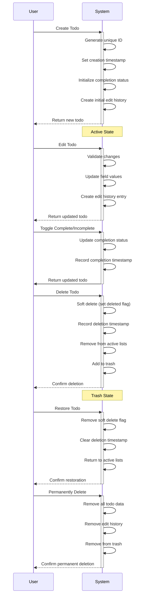
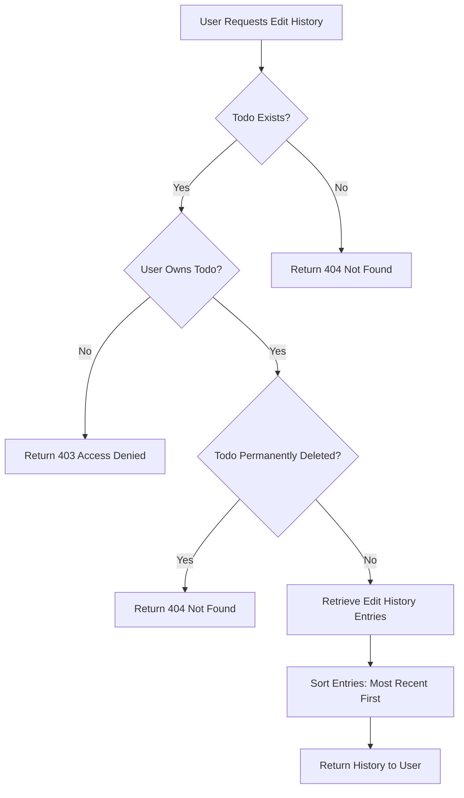
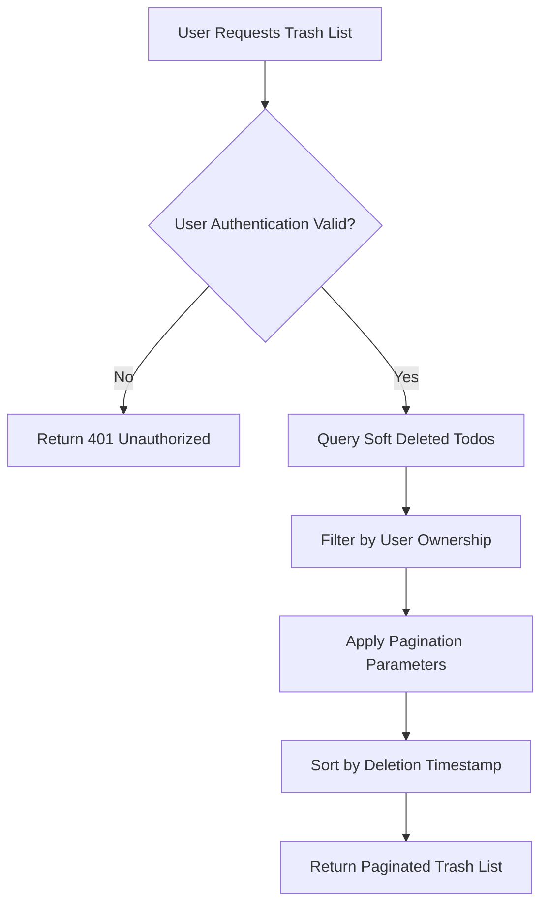
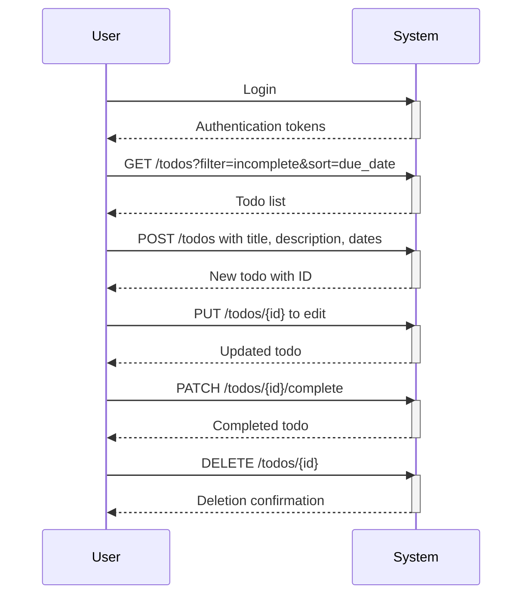
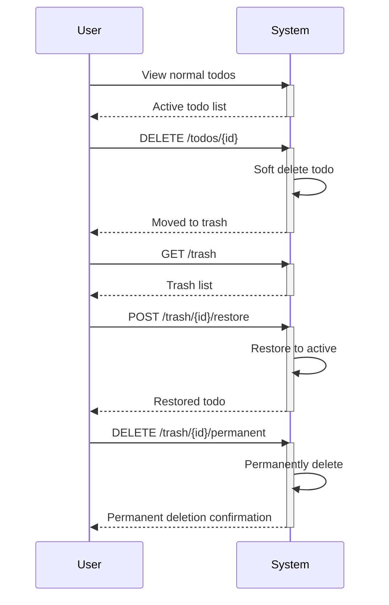

# Multi-User Todo Application Requirements Specification

## Service Overview

This is a private, multi-user todo application where each user maintains their own isolated todo list. The system provides comprehensive lifecycle management for todo items, including creation, active editing, completion tracking, soft deletion, trash management, and permanent deletion. Every todo item maintains complete edit history, and all user data is strictly isolated from other users.

The application supports the complete todo management workflow: users can create todos with titles, descriptions, and optional dates, toggle completion status, edit all properties while maintaining history, soft delete items for recovery, permanently delete items from trash, and manage their account including password changes and account deletion.

## Functional Requirements

### Account Management Requirements

#### User Registration

**WHEN a user registers with their email address and password, THE system SHALL:**

1. **Create a new user account** - Store the email address and securely hashed password
2. **Initialize user profile** - Create a profile with the provided email as display name initially
3. **Generate authentication credentials** - Create access and refresh tokens for session management
4. **Create initial user data structures** - Initialize empty todo lists and trash for the new user
5. **Return successful registration** - Provide confirmation that the account is ready for use

**WHERE the email address is already registered, THE system SHALL NOT create the account and SHALL return an error message indicating the email is already in use.**

**WHERE the password does not meet minimum security requirements, THE system SHALL NOT create the account and SHALL return an error message with specific requirements.**

**WHERE invalid email format is provided, THE system SHALL NOT create the account and SHALL return an error message with email format requirements.**

#### User Authentication

**WHEN a user attempts to log in with their email and password, THE system SHALL:**

1. **Verify user credentials** - Check the email exists and password matches the stored hash
2. **Generate authentication tokens** - Create access token and refresh token upon successful verification
3. **Track authentication state** - Store session information for the authenticated user
4. **Return authentication response** - Provide tokens and user information for the authenticated session

**WHERE credentials do not match, THE system SHALL NOT authenticate the user and SHALL return an error message indicating invalid credentials.**

**WHERE a user account has been deleted, THE system SHALL NOT authenticate the user and SHALL return an appropriate error.**

**WHERE a user has exceeded authentication attempt limits, THE system SHALL LOCK the account temporarily and require administrative intervention or time-based unlocking.**

#### Password Management

**WHEN a user wants to change their password, THE system SHALL:**

1. **Require current password verification** - Verify the user knows their existing password
2. **Accept new password submission** - Collect the new password with security requirements
3. **Securely update credentials** - Replace the old password hash with the new one
4. **Invalidate existing sessions** - Force re-authentication on all current sessions
5. **Confirm password change** - Provide confirmation that the password has been updated

**WHERE the current password verification fails, THE system SHALL NOT change the password and SHALL return an error message.**

**WHERE the new password does not meet security requirements, THE system SHALL NOT change the password and SHALL return an error message with requirements.**

#### Account Deletion

**WHEN a user requests to delete their account, THE system SHALL:**

1. **Require authentication verification** - Confirm the user is logged in and authorized
2. **Perform comprehensive data deletion** - Remove all user data permanently
3. **Delete all todos** - Permanently remove all todos belonging to the user
4. **Delete all trash items** - Permanently remove all deleted todos in trash
5. **Delete all edit history** - Permanently remove all edit history entries for the user's todos
6. **Delete user account** - Remove the user account and authentication data
7. **Invalidate all sessions** - Terminate all active sessions for the user
8. **Confirm account deletion** - Provide confirmation that the account is permanently deleted

**WHERE account deletion fails partway through, THE system SHALL ROLL BACK all changes to maintain data integrity.**

**WHERE a user attempts to delete an account that does not exist, THE system SHALL NOT perform deletion and SHALL return an appropriate error.**

### User Profile Management

#### Profile Creation and Retrieval

**WHEN a user registers, THE system SHALL automatically create a profile with:**

1. **Display name** - Initially set to the user's email address
2. **User association** - Linked to the user account
3. **Privacy isolation** - Completely separate from other users' profiles

**WHEN a user views their own profile, THE system SHALL return:**

1. **Display name** - The user's current display name
2. **User information** - Account status and basic profile data
3. **Privacy confirmation** - Explicit indication that profile privacy is maintained

**WHERE a user attempts to view another user's profile, THE system SHALL NOT return the profile and SHALL return an access denied error.**

#### Profile Modification

**WHEN a user wants to edit their display name, THE system SHALL:**

1. **Require authentication** - Verify the user is logged in
2. **Accept new display name** - Collect the new display name from the user
3. **Validate display name** - Check for valid format and length constraints
4. **Update profile** - Save the new display name to the user's profile
5. **Return updated profile** - Provide confirmation with the new display name

**WHERE the display name is empty or contains only whitespace, THE system SHALL NOT update the profile and SHALL return an error message.**

**WHERE the display name exceeds maximum length, THE system SHALL NOT update the profile and SHALL return an error message with length requirements.**

**WHERE a user attempts to update another user's profile, THE system SHALL NOT perform the update and SHALL return an access denied error.**

### Todo Creation and Management

#### Todo Creation

**WHEN a user creates a new todo, THE system SHALL:**

1. **Require title field** - The title is mandatory and must not be empty
2. **Accept optional description** - Description can be null, empty, or contain content
3. **Accept optional start date** - Start date can be null or a valid date value
4. **Accept optional due date** - Due date can be null or a valid date value
5. **Set initial completion status** - Newly created todos are always incomplete by default
6. **Record creation timestamp** - Set the creation time to current system time
7. **Link to user** - Associate the todo with the creating user's account
8. **Create initial edit history** - Document the creation event
9. **Return created todo** - Provide the complete todo with all system-assigned fields

**WHERE a user attempts to create a todo without a title, THE system SHALL NOT create the todo and SHALL return an error message indicating title is required.**

**WHERE a user attempts to create a todo with invalid date formats, THE system SHALL NOT create the todo and SHALL return an error message with valid date format requirements.**

**WHERE a user attempts to create a todo for another user, THE system SHALL NOT create the todo and SHALL return an access denied error.**

#### Todo List Viewing

**WHEN a user requests their todo list, THE system SHALL:**

1. **Filter by user ownership** - Return only todos belonging to the requesting user
2. **Apply filters** - Apply any requested completion status filters (all, complete, incomplete)
3. **Apply sorting** - Sort according to requested criteria (creation date, start date, due date)
4. **Handle date sorting rules** - Todos without start/due dates appear at the end when sorting by those dates
5. **Paginate results** - Return results in pages based on user-specified page size and offset
6. **Return todo summaries** - Include title, completion status, start date, due date, and creation date
7. **Exclude trash items** - Do not include soft deleted todos in normal lists

**WHERE a user requests todos for another user, THE system SHALL NOT return the todos and SHALL return an access denied error.**

**WHERE pagination parameters are invalid, THE system SHALL NOT return results and SHALL return an error message with valid pagination requirements.**

**WHERE filtering or sorting parameters are invalid, THE system SHALL NOT return results and SHALL return an error message with valid parameter requirements.**

#### Todo Detail Viewing

**WHEN a user requests details of a specific todo, THE system SHALL:**

1. **Verify user ownership** - Ensure the todo belongs to the requesting user
2. **Return complete details** - Provide all todo information including full description
3. **Include all dates** - Show creation date, start date, due date, and completion date if applicable
4. **Include completion status** - Show whether the todo is complete or incomplete

**WHERE a user requests a todo that does not belong to them, THE system SHALL NOT return the todo and SHALL return an access denied error.**

**WHERE a user requests a todo that has been permanently deleted, THE system SHALL NOT return the todo and SHALL return a not found error.**

### Todo Completion Management

#### Completion Toggle

**WHEN a user marks a todo as complete, THE system SHALL:**

1. **Verify user ownership** - Ensure the todo belongs to the requesting user
2. **Set completion status** - Mark the todo as complete
3. **Record completion timestamp** - Set the completion time to current system time
4. **Return updated todo** - Provide confirmation with the new completion status

**WHEN a user marks a todo as incomplete, THE system SHALL:**

1. **Verify user ownership** - Ensure the todo belongs to the requesting user
2. **Set completion status** - Mark the todo as incomplete
3. **Remove completion timestamp** - Clear the completion time if present
4. **Return updated todo** - Provide confirmation with the new completion status

**WHERE a user attempts to modify completion status for another user's todo, THE system SHALL NOT perform the modification and SHALL return an access denied error.**

**WHERE a user attempts to modify a permanently deleted todo, THE system SHALL NOT perform the modification and SHALL return a not found error.**

### Todo Editing

#### Todo Property Updates

**WHEN a user edits a todo, THE system SHALL:**

1. **Verify user ownership** - Ensure the todo belongs to the requesting user
2. **Accept partial updates** - Allow updating any combination of title, description, start date, and due date
3. **Validate input data** - Check all provided values for valid formats
4. **Update specified fields** - Modify only the fields provided in the update request
5. **Preserve unchanged fields** - Keep all fields not included in the update unchanged
6. **Create edit history entry** - Document the changes with timestamps and old/new values
7. **Return updated todo** - Provide confirmation with all updated fields

**WHERE a user attempts to edit another user's todo, THE system SHALL NOT perform the update and SHALL return an access denied error.**

**WHERE a user attempts to edit a permanently deleted todo, THE system SHALL NOT perform the update and SHALL return a not found error.**

**WHERE a user provides invalid date formats in an update, THE system SHALL NOT perform the update and SHALL return an error message with valid date format requirements.**

### Todo Deletion and Trash Management

#### Soft Deletion

**WHEN a user deletes a todo, THE system SHALL:**

1. **Verify user ownership** - Ensure the todo belongs to the requesting user
2. **Soft delete instead of permanent deletion** - Set a deleted flag without removing data
3. **Record deletion timestamp** - Mark when the deletion occurred
4. **Remove from active lists** - Exclude from normal todo list views
5. **Add to trash** - Include in the user's trash view
6. **Preserve all data** - Keep all todo data and edit history intact
7. **Confirm deletion** - Provide confirmation that the todo has been moved to trash

**IF a user attempts to access a soft-deleted todo through normal routes, THE system SHALL NOT return the todo and SHALL indicate the todo is not found.**

**WHERE a user attempts to delete another user's todo, THE system SHALL NOT perform the deletion and SHALL return an access denied error.**

**WHERE a user attempts to delete a todo that has already been permanently deleted, THE system SHALL NOT perform any operation and SHALL return an appropriate error.**

#### Trash Viewing

**WHEN a user requests their trash list, THE system SHALL:**

1. **Filter by user ownership** - Return only soft deleted todos belonging to the requesting user
2. **Include only deleted items** - Show only todos that have been soft deleted
3. **Apply pagination** - Return results in pages based on user-specified parameters
4. **Sort by deletion time** - Show most recently deleted items first
5. **Return basic information** - Include title, deletion timestamp, and original dates
6. **Allow full detail viewing** - Support viewing complete details of trash items

**WHERE a user requests trash for another user, THE system SHALL NOT return trash items and SHALL return an access denied error.**

**WHERE pagination parameters are invalid, THE system SHALL NOT return results and SHALL return an error message.**

#### Trash Restoration

**WHEN a user restores a todo from trash, THE system SHALL:**

1. **Verify user ownership** - Ensure the todo belongs to the requesting user
2. **Remove soft delete flag** - Clear the deleted status
3. **Clear deletion timestamp** - Remove the deletion time marker
4. **Return to active lists** - Include in normal todo list views
5. **Preserve all data** - Keep all todo data and edit history intact
6. **Return restored todo** - Provide confirmation with the restored todo details

**WHERE a user attempts to restore a todo that has been permanently deleted, THE system SHALL NOT perform restoration and SHALL return a not found error.**

**WHERE a user attempts to restore another user's todo from trash, THE system SHALL NOT perform restoration and SHALL return an access denied error.**

#### Permanent Deletion

**WHEN a user permanently deletes a todo from trash, THE system SHALL:**

1. **Verify user ownership** - Ensure the todo belongs to the requesting user
2. **Permanently remove todo data** - Delete all todo fields and information
3. **Permanently remove edit history** - Delete all edit history entries for this todo
4. **Remove from trash** - Exclude from trash view results
5. **Confirm permanent deletion** - Provide confirmation that the todo is permanently deleted

**WHEN a user permanently deletes their account, THE system SHALL:**

1. **Permanently delete all todos** - Remove all todos belonging to the user
2. **Permanently delete all trash items** - Remove all soft deleted todos
3. **Permanently delete all edit history** - Remove all edit history entries
4. **Remove user account** - Delete the user account and authentication data
5. **Invalidate all sessions** - Terminate all active sessions

**WHERE a user attempts to permanently delete a todo that is not in trash, THE system SHALL NOT perform deletion and SHALL return an appropriate error.**

**WHERE a user attempts to permanently delete another user's todo, THE system SHALL NOT perform deletion and SHALL return an access denied error.**

### Filtering and Sorting

#### Completion Status Filtering

**WHEN a user filters todos by completion status, THE system SHALL:**

1. **Support "All" filter** - Include all todos (complete and incomplete)
2. **Support "Complete" filter** - Include only completed todos
3. **Support "Incomplete" filter** - Include only incomplete todos
4. **Apply filter to list views** - Filter normal todo lists and trash views appropriately
5. **Return filtered results** - Only include todos matching the specified filter criteria

**WHERE an invalid filter value is provided, THE system SHALL NOT return results and SHALL return an error message with valid filter options.**

#### Sorting Options

**WHEN a user sorts todo lists, THE system SHALL support:**

1. **Creation date sorting** - Sort by creation timestamp (newest first or oldest first)
2. **Start date sorting** - Sort by start date (earliest first or latest first)
3. **Due date sorting** - Sort by due date (earliest first or latest first)
4. **Handle missing dates** - Todos without start dates appear at end when sorting by start date
5. **Handle missing dates** - Todos without due dates appear at end when sorting by due date
6. **Maintain user ownership** - Only sort todos belonging to the requesting user

**WHERE sorting by start date, THE system SHALL treat todos without start dates as having the latest possible date (appearing at the end when sorting ascending, or beginning when sorting descending).**

**WHERE sorting by due date, THE system SHALL treat todos without due dates as having the latest possible date (appearing at the end when sorting ascending, or beginning when sorting descending).**

**WHERE an invalid sort value is provided, THE system SHALL NOT return results and SHALL return an error message with valid sort options.**

### Edit History Management

#### History Recording

**THE system SHALL record edit history for every change to a todo's:**

1. **Title** - When the title is modified
2. **Description** - When the description is modified
3. **Start date** - When start date is added, modified, or removed
4. **Due date** - When due date is added, modified, or removed
5. **Completion status** - When completion status is toggled

**WHEN a todo is created, THE system SHALL create an initial edit history entry documenting:**

1. **Creation timestamp** - When the todo was first created
2. **Initial field values** - The original values of all fields
3. **Initial completion status** - The original incomplete status

#### History Viewing

**WHEN a user views a todo's edit history, THE system SHALL:**

1. **Verify user ownership** - Ensure the todo belongs to the requesting user
2. **Return all history entries** - Include every edit recorded for the todo
3. **Sort by timestamp** - Present entries from most recent to oldest
4. **Show timestamps** - Display when each edit was made
5. **Show field changes** - Indicate which fields were modified
6. **Show old values** - Display values before the change
7. **Show new values** - Display values after the change

**WHERE a todo has no edit history, THE system SHALL return an empty history list without error.**

**WHERE a user attempts to view edit history for another user's todo, THE system SHALL NOT return history and SHALL return an access denied error.**

**WHERE a user attempts to view edit history for a permanently deleted todo, THE system SHALL NOT return history and SHALL return a not found error.**

#### History Preservation

**WHEN a todo is soft deleted, THE system SHALL:**

1. **Preserve all edit history** - Keep all history entries intact
2. **Maintain history linkage** - Keep history connected to the original todo
3. **Enable history access** - Allow viewing history while in trash

**WHEN a todo is permanently deleted, THE system SHALL:**

1. **Permanently remove all edit history** - Delete all history entries
2. **Remove all historical data** - Ensure history cannot be recovered
3. **Complete data destruction** - Ensure no trace of the todo or its history remains

## User Actors and Authentication

### User Actor Structure

**The system defines one primary user actor:**

| Actor | Description | Permission Level |
|-------|-------------|------------------|
| User | Authenticated todo application user with personal account | Member |

### Authentication Requirements

**ALL API endpoints that access or modify user data SHALL require authentication.**

**THE system SHALL validate authentication tokens on every request.**

**WHERE authentication fails, THE system SHALL return a 401 Unauthorized response.**

### Session Management

**THE system SHALL support token-based authentication with:**

1. **Access tokens** - Short-lived tokens for API authentication
2. **Refresh tokens** - Long-lived tokens for session renewal
3. **Token expiration** - Automatic token expiration and renewal
4. **Session termination** - Immediate invalidation on account deletion or password change

**WHEN an access token expires, THE system SHALL require token renewal using refresh tokens.**

**WHERE refresh token validation fails, THE system SHALL require re-authentication.**

### Permission Matrix

| Feature | Guest | User |
|---------|-------|------|
| Register account | Yes | No |
| Login/logout | Yes | Yes |
| View own profile | No | Yes |
| Edit own profile | No | Yes |
| Create todo | No | Yes |
| View own todos | No | Yes |
| View other users' todos | No | No |
| Complete todo | No | Yes |
| Edit own todo | No | Yes |
| Delete own todo | No | Yes |
| View trash | No | Yes |
| Restore from trash | No | Yes |
| Permanently delete | No | Yes |
| View edit history | No | Yes |
| Change password | No | Yes |
| Delete account | No | Yes |

## Data Lifecycle Management

### Todo Lifecycle States

### Data Retention Policies

**Active todos are retained indefinitely** until:

1. The user permanently deletes the todo
2. The user permanently deletes their account
3. A future business requirement mandates archival

**Soft deleted todos are retained** in the trash:

1. Indefinitely until the user permanently deletes them
2. At least 30 days minimum before potential automated cleanup
3. Until the user account is permanently deleted

**Edit history entries are retained**:

1. For active todos - indefinitely as part of the todo data
2. For soft deleted todos - indefinitely while in trash
3. For permanently deleted todos - completely removed with the todo

## Edit History System

### History Entry Structure

**Each edit history entry includes:**

| Field | Description | Type |
|-------|-------------|------|
| timestamp | When the edit was made | datetime |
| fieldsChanged | Array of field names that were modified | array<string> |
| titleOld | Title value before change (null if unchanged) | string or null |
| titleNew | Title value after change (null if unchanged) | string or null |
| descriptionOld | Description value before change (null if unchanged) | string or null |
| descriptionNew | Description value after change (null if unchanged) | string or null |
| startDateOld | Start date value before change (null if unchanged) | datetime or null |
| startDateNew | Start date value after change (null if unchanged) | datetime or null |
| dueDateOld | Due date value before change (null if unchanged) | datetime or null |
| dueDateNew | Due date value after change (null if unchanged) | datetime or null |
| completionStatusOld | Completion status before change | string ("complete" or "incomplete") |
| completionStatusNew | Completion status after change | string ("complete" or "incomplete") |

### History Viewing Workflow

### History Preservation Rules

**Edit history is preserved during:**

1. **Active state** - All edits retained in active todo
2. **Soft delete** - History maintained while in trash
3. **Trash** - History available for viewing
4. **Restoration** - History preserved when returning to active state

**Edit history is permanently removed when:**

1. Todo is permanently deleted from trash
2. User account is permanently deleted
3. System cleanup processes remove orphaned history

## Trash Management

### Trash Viewing Workflow

### Trash Operation Rules

**Trash items cannot be:**

1. Modified in normal edit operations
2. Completed or marked incomplete
3. Filtered in normal todo lists
4. Sorted in normal todo lists
5. Accessed through normal todo retrieval routes

**Trash items can be:**

1. Viewed in the trash-specific interface
2. Restored to active status
3. Permanently deleted
4. Bulk-restored or bulk-permanently-deleted

## Privacy and Access Control

### Complete User Data Isolation

**The system enforces strict privacy through:**

1. **User ID association** - Every todo linked to creating user
2. **Ownership verification** - All operations verify user ownership
3. **Query filtering** - All queries automatically filter by user ID
4. **Access control checks** - All endpoints validate user authorization

### Access Control Implementation

**Every API endpoint SHALL implement:**

1. **Authentication validation** - Verify user is logged in
2. **Ownership verification** - Verify todo belongs to requesting user
3. **Permission validation** - Verify user has required permissions
4. **Error handling** - Return appropriate error for unauthorized access

### Privacy Violation Prevention

**THE system SHALL NOT:**

1. Return other users' todos in list views
2. Allow viewing of other users' profiles
3. Allow editing of other users' todos
4. Allow deletion of other users' todos
5. Allow access to other users' edit history
6. Allow access to other users' trash

**WHEN a privacy violation is attempted, THE system SHALL:**

1. Not perform the requested operation
2. Return appropriate access denied error
3. Log the attempted violation for security monitoring
4. Not expose any information about the requested resource

## Error Handling

### Authentication Errors

| Error | Description | HTTP Status | User Guidance |
|-------|-------------|-------------|---------------|
| Invalid credentials | Email or password does not match | 401 | "Invalid email or password. Please try again." |
| Expired token | Access token has expired | 401 | "Session expired. Please log in again." |
| Invalid token | Token format is invalid or corrupted | 401 | "Invalid authentication. Please log in again." |
| Missing token | Request lacks authentication token | 401 | "Authentication required. Please log in." |
| Token revoked | Token has been invalidated | 401 | "Session terminated. Please log in again." |

### Validation Errors

| Error | Description | HTTP Status | User Guidance |
|-------|-------------|-------------|---------------|
| Title required | Todo creation without title | 400 | "Title is required. Please provide a title." |
| Invalid date format | Date value in invalid format | 400 | "Invalid date format. Please use YYYY-MM-DD format." |
| Invalid pagination | Page size or offset is invalid | 400 | "Invalid pagination parameters. Please check page size and offset." |
| Invalid filter | Filter value is not supported | 400 | "Invalid filter value. Please use 'all', 'complete', or 'incomplete'." |
| Invalid sort | Sort value is not supported | 400 | "Invalid sort value. Please use 'created_at', 'start_date', or 'due_date'." |
| Invalid display name | Profile update with empty or invalid name | 400 | "Display name must contain valid characters and cannot be empty." |

### Access Control Errors

| Error | Description | HTTP Status | User Guidance |
|-------|-------------|-------------|---------------|
| Unauthorized access | User attempts to access another user's data | 403 | "You do not have permission to access this resource." |
| Account not found | User attempts to delete non-existent account | 404 | "Account not found." |
| Todo not found | User attempts to access non-existent todo | 404 | "Todo not found." |
| Trash item not found | User attempts to restore permanently deleted item | 404 | "Item not found in trash." |

### System Errors

| Error | Description | HTTP Status | User Guidance |
|-------|-------------|-------------|---------------|
| Database error | Database operation failed | 500 | "An internal error occurred. Please try again later." |
| Authentication service error | Authentication service unavailable | 503 | "Authentication service temporarily unavailable. Please try again later." |
| Validation service error | Validation service unavailable | 503 | "Validation service temporarily unavailable. Please try again later." |

## Business Rules

### Data Validation Rules

**Todo Field Validation:**

1. **Title** - Required, must not be empty or whitespace-only, maximum length 255 characters
2. **Description** - Optional, can be null or empty, maximum length 10,000 characters
3. **Start date** - Optional, must be valid date format if provided, can be in past or future
4. **Due date** - Optional, must be valid date format if provided, can be in past or future

**User Profile Validation:**

1. **Display name** - Required for updates, must not be empty or whitespace-only, maximum length 100 characters

**Authentication Validation:**

1. **Email** - Required format validation, must be unique, maximum length 255 characters
2. **Password** - Minimum 8 characters, must contain uppercase, lowercase, number, and special character

### Todo State Management

**Active Todo States:**

1. **Incomplete** - New todos are always incomplete by default
2. **Complete** - Can be toggled from incomplete
3. **Edit possible** - All fields can be modified
4. **Visible** - Included in normal list views

**Soft Deleted Todo States:**

1. **Deleted** - Marked with soft delete flag and deletion timestamp
2. **Hidden** - Excluded from normal views
3. **Trash** - Available in trash view
4. **Restorable** - Can be returned to active state

**Permanently Deleted Todo States:**

1. **Removed** - All data permanently deleted
2. **Unrecoverable** - Cannot be restored
3. **No history** - Edit history permanently removed

### Sorting and Filtering Rules

**Date Handling for Sorting:**

1. **Missing start dates** - Treated as latest possible date when sorting by start date
2. **Missing due dates** - Treated as latest possible date when sorting by due date
3. **Sort direction** - Support both ascending and descending order for all sortable fields

**Filter Combinations:**

1. **Completion status filter** - Can be applied independently or with other filters
2. **Pagination** - Can be applied with any filter combination
3. **Sorting** - Can be applied with any filter combination

## User Workflows

### Creating and Managing a Todo

### Trash and Recovery Workflow

## Performance Requirements

### Response Time Expectations

**CRITICAL operations must complete within:**

1. **Authentication** - Login, registration, token validation: < 500ms
2. **Todo creation** - Initial creation with edit history: < 1s
3. **Todo retrieval** - Single todo details: < 500ms
4. **Todo list with pagination** - Default page size: < 1s
5. **Edit operations** - Property updates with history: < 500ms
6. **Completion toggle** - Status changes: < 200ms
7. **Trash operations** - View, restore, permanent delete: < 500ms
8. **Edit history view** - All history entries: < 1s

**Maximum response times for complex operations:**

1. **Large todo lists** - 100+ items: < 2s
2. **Complex filtering** - Multiple filters: < 1.5s
3. **Complex sorting** - Multiple sort criteria: < 1.5s
4. **Bulk operations** - Multiple item operations: < 3s

### Pagination Requirements

**Default pagination settings:**

1. **Default page size** - 20 items per page
2. **Maximum page size** - 100 items per page
3. **Pagination parameter** - Page number and offset
4. **Total count** - Include total count in response headers

**Large dataset handling:**

1. **Cursor-based pagination** - For very large datasets
2. **Infinite scrolling** - Optional infinite scroll implementation
3. **Lazy loading** - Load additional pages on demand

## Future Considerations

### Planned Feature Extensions

**Version 2 Enhancements:**

1. **Multiple Todo Lists** - Support for organizing todos into different lists
2. **Todo Tags** - Tag-based categorization and filtering
3. **Attachment Support** - File attachments to todo items
4. **Reminders** - Notification system for upcoming due dates
5. **Recurring Todos** - Automatic creation of recurring tasks

**Version 3 Enhancements:**

1. **Collaborative Todos** - Shared todo items with multiple users
2. **Team Projects** - Project-based todo organization
3. **Advanced Analytics** - Usage statistics and productivity insights
4. **Export Functionality** - Export todos to various formats
5. **Mobile App** - Native mobile applications for iOS and Android

### Scalability Considerations

**Database Scaling:**

1. **Read replicas** - For handling increased read load
2. **Database sharding** - By user ID for large-scale deployments
3. **Caching layer** - Redis for frequently accessed data
4. **Connection pooling** - Efficient database connection management

**API Scaling:**

1. **Load balancing** - Distribute traffic across multiple instances
2. **Microservices architecture** - Separate services for different concerns
3. **Message queues** - For asynchronous operations and background tasks
4. **CDN integration** - For serving static assets

### Integration Points

**External Service Integration:**

1. **Email notifications** - For reminders and account management
2. **Calendar integration** - Sync due dates with user calendars
3. **Authentication providers** - OAuth support for Google, Microsoft, etc.
4. **Third-party services** - Integrations with productivity tools

## Security Considerations

### Data Privacy Requirements

**User data protection:**

1. **AES-256 encryption** - At rest for sensitive data
2. **TLS 1.3** - In transit for all communications
3. **Password hashing** - bcrypt with cost factor 12
4. **Token encryption** - JWT tokens with strong signing

**Privacy compliance:**

1. **GDPR support** - Data export and deletion capabilities
2. **Privacy policy** - Clear documentation of data usage
3. **Terms of service** - Legal agreement for service use
4. **Cookie consent** - Compliance with cookie regulations

### Access Control Requirements

**Authentication security:**

1. **Multi-factor authentication** - Optional MFA support
2. **Failed login tracking** - Lockout after 5 failed attempts
3. **Session management** - Concurrent session handling
4. **Token rotation** - Automatic token refresh

**Authorization security:**

1. **Role-based access** - Different permission levels
2. **Resource ownership** - Verify user ownership for all operations
3. **Audit logging** - Track sensitive operations
4. **Rate limiting** - Prevent abuse and DDoS attacks

### Audit and Logging

**Security logging:**

1. **Authentication events** - Login, logout, token events
2. **Access events** - All API access with user context
3. **Sensitive operations** - Deletions, password changes
4. **Error events** - Security-related errors and anomalies

**Log retention:**

1. **Security logs** - 1 year minimum retention
2. **Audit logs** - 7 years for compliance
3. **Application logs** - 30 days retention
4. **Backup logs** - 1 year retention

## Conclusion

This requirements specification provides a comprehensive foundation for developing a secure, scalable multi-user todo application. The system implements complete lifecycle management with soft deletion, comprehensive edit history tracking, and strict privacy controls ensuring complete user data isolation.

All requirements follow EARS format for clear, testable specifications that developers can implement with confidence. The document covers all functional requirements, business rules, error handling, performance expectations, and security considerations needed for production deployment.

The architecture supports future enhancements including collaborative features, advanced analytics, and mobile applications while maintaining the core privacy and data integrity requirements established in this specification.