# Multi-User Todo Application Requirements Specification

## 1. Introduction

### 1.1 Executive Summary

This document provides comprehensive requirements specification for a multi-user Todo list application. The system enables individual users to create, manage, and organize personal todo items with full privacy isolation between users. Key features include todo creation with optional metadata, completion tracking, edit history recording, soft-delete functionality with trash management, and flexible filtering and sorting capabilities.

### 1.2 Service Vision

The multi-user Todo application aims to provide a privacy-first personal organization tool where users can manage their tasks and reminders without concerns about data sharing or unauthorized access. Each user's todos remain completely private, accessible only to that individual user through secure authentication.

### 1.3 Target Users

- **Individual Users**: People managing personal tasks, reminders, and to-do lists
- **Privacy-Conscious Individuals**: Users who require complete isolation of their data from others
- **Professional Users**: Individuals needing organized task management with edit tracking
- **Team Members**: Users who need personal task management within a multi-tenant environment

### 1.4 Core Features

- **User Authentication**: Secure email and password-based sign-up and login
- **Todo Management**: Complete CRUD operations for personal todo items
- **Metadata Support**: Optional start dates, due dates, and descriptions
- **Edit History**: Automatic recording of all todo modifications
- **Trash Management**: Soft-delete functionality with restoration capabilities
- **Privacy Protection**: Complete user data isolation and access control
- **Advanced Filtering**: Filter todos by completion status
- **Flexible Sorting**: Sort by multiple criteria with customizable order
- **Pagination**: Efficient handling of large todo collections

### 1.5 Business Goals

- Provide a secure, private todo management solution
- Enable users to track task progress with edit history
- Support flexible task organization through filtering and sorting
- Ensure data integrity and user control over their information
- Deliver reliable performance with responsive user interface

### 1.6 Success Metrics

- **User Adoption**: Number of registered users and active daily users
- **Data Integrity**: Zero instances of cross-user data access
- **User Satisfaction**: Feedback on usability and functionality
- **System Reliability**: Uptime percentage and error rates
- **Performance**: Response times under 2 seconds for typical operations
- **Storage Efficiency**: Effective management of edit history and trash data

## 2. User Requirements

### 2.1 User Personas

#### Persona 1: Daily Task Organizer

- **Description**: Regular users who manage daily tasks and reminders
- **Needs**: Quick todo creation, easy completion marking, flexible filtering
- **Goals**: Stay organized, remember important deadlines, track task progress
- **Pain Points**: Complicated interfaces, lack of edit history for important changes

#### Persona 2: Project Planner

- **Description**: Users who use the system for project-related task management
- **Needs**: Detailed descriptions, precise date management, edit tracking
- **Goals**: Plan project milestones, track task evolution, maintain documentation
- **Pain Points**: Incomplete metadata support, lack of history for audit trails

#### Persona 3: Privacy-First User

- **Description**: Users who prioritize data privacy and security
- **Needs**: Complete data isolation, secure authentication, transparent privacy controls
- **Goals**: Keep personal tasks private, prevent any data leakage between users
- **Pain Points**: Cross-user data access risks, unclear privacy policies

### 2.2 Authentication Requirements

WHEN a user creates an account, THE system SHALL require a unique email address and password.

WHEN a user logs in, THE system SHALL authenticate using email and password credentials.

WHEN authentication succeeds, THE system SHALL generate a secure session token.

WHEN a user's session expires, THE system SHALL require re-authentication.

WHEN a user attempts to log in with invalid credentials, THE system SHALL deny access and provide an error message.

WHEN a user changes their password, THE system SHALL update the password hash and invalidate existing sessions.

WHEN a user deletes their account, THE system SHALL terminate all active sessions for that user.

#### Account Creation Workflow

1. User accesses the registration page
2. User enters email address and password
3. System validates email format and password strength
4. System creates new user account with hashed password
5. System generates authentication token
6. System returns success response with token
7. User is automatically logged in after registration

#### Login Workflow

1. User accesses the login page
2. User enters email address and password
3. System verifies credentials against stored hash
4. System generates authentication token if valid
5. System returns success response with token
6. User is logged in and redirected to the main application

### 2.3 Profile Management

WHEN a user registers, THE system SHALL create a user profile with the user's email as default display name.

WHEN a user changes their display name, THE system SHALL update the profile information.

WHEN a user attempts to view another user's profile, THE system SHALL deny access and indicate the profile is private.

WHEN a user edits their profile, THE system SHALL log the change for audit purposes.

WHERE a user has no custom display name, THE system SHALL use the email address as the display name.

### 2.4 Privacy Expectations

WHEN a user creates a todo, THE system SHALL associate the todo with that user's account.

WHEN a user retrieves their todo list, THE system SHALL return only todos owned by that user.

WHEN a user attempts to access another user's todo, THE system SHALL deny access.

WHEN a user deletes their account, THE system SHALL permanently remove all associated todos.

WHERE trash items are viewed, THE system SHALL ensure users only see their own trash.

WHEN edit history is retrieved, THE system SHALL only return history for the authenticated user's todos.

## 3. Functional Requirements

### 3.1 Account Management

WHEN a user signs up, THE system SHALL create an account with email and password.

WHEN a user logs in, THE system SHALL authenticate the user and establish a session.

WHEN a user changes their password, THE system SHALL update the password hash securely.

WHEN a user deletes their account, THE system SHALL permanently remove the user and all associated data.

WHEN a user deletes their account, THE system SHALL delete all todos owned by that user, including those in trash.

WHEN a user changes their display name, THE system SHALL update the profile information.

#### Account Deletion Process

WHEN a user initiates account deletion, THE system SHALL show a confirmation dialog.

WHEN the user confirms account deletion, THE system SHALL permanently delete:
- User account record
- All todos owned by the user (including completed and incomplete)
- All todos in the user's trash
- All edit history records for the user's todos
- All authentication tokens for the user

WHERE account deletion encounters a database error, THE system SHALL rollback all changes and display an error message.

WHERE account deletion succeeds, THE system SHALL immediately terminate all active sessions for that user.

### 3.2 Todo Creation

WHEN a user creates a todo, THE system SHALL require a title.

WHEN a user creates a todo, THE system SHALL accept an optional description.

WHEN a user creates a todo, THE system SHALL accept an optional start date.

WHEN a user creates a todo, THE system SHALL accept an optional due date.

WHEN a todo is created, THE system SHALL set the initial completion status to incomplete.

WHEN a user creates a todo with a start date after the due date, THE system SHALL allow the creation but log a validation warning.

WHILE creating a todo, THE system SHALL associate the todo with the authenticated user.

WHEN a user creates a todo, THE system SHALL generate a unique identifier for that todo.

#### Todo Creation Validation

WHERE title exceeds maximum length (255 characters), THE system SHALL truncate to maximum length.

WHERE description exceeds maximum length (10,000 characters), THE system SHALL truncate to maximum length.

WHERE start date or due date format is invalid, THE system SHALL return validation error.

WHERE start date and due date are provided but start date is after due date, THE system SHALL allow creation but warn user.

### 3.3 Todo Viewing

WHEN a user requests their todo list, THE system SHALL return todos owned by that user.

THE todo list view SHALL include the following information for each todo:
- Title
- Completion status (complete or incomplete)
- Start date (if set)
- Due date (if set)
- Creation timestamp

WHEN a user requests a single todo, THE system SHALL return all details including description and edit history.

WHERE pagination is applied, THE system SHALL include total count and current page information.

WHEN a user views a single todo, THE system SHALL include:
- Complete title and description
- Start date (if set)
- Due date (if set)
- Completion status
- Creation timestamp
- Last updated timestamp
- Complete edit history

### 3.4 Completion Management

WHEN a user marks a todo as complete, THE system SHALL update the completion status to complete.

WHEN a user marks a todo as incomplete, THE system SHALL update the completion status to incomplete.

WHEN a todo's completion status changes, THE system SHALL update the "last updated" timestamp.

WHEN a user toggles completion status, THE system SHALL not affect other todo properties.

WHERE a user attempts to change completion status of a non-existent todo, THE system SHALL return a "not found" error.

### 3.5 Todo Editing

WHEN a user edits a todo, THE system SHALL allow updating title, description, start date, and due date.

WHEN a todo is edited, THE system SHALL create an edit history entry.

WHEN a todo is edited, THE system SHALL preserve all original properties that are not being changed.

WHEN a todo's title is changed, THE system SHALL record the previous and new title in edit history.

WHEN a todo's description is changed, THE system SHALL record the previous and new description in edit history.

WHEN a todo's start date is changed, THE system SHALL record the previous and new start date in edit history.

WHEN a todo's due date is changed, THE system SHALL record the previous and new due date in edit history.

WHERE a user edits a todo they do not own, THE system SHALL deny the edit and return an access error.

#### Edit History Requirements

WHEN a todo is created, THE system SHALL create the initial edit history entry.

WHEN any todo property is modified, THE system SHALL create a new edit history entry.

WHEN edit history is retrieved, THE system SHALL return entries sorted from most recent to oldest.

WHEN edit history is retrieved, THE system SHALL include:
- Timestamp of the edit
- Title before and after (if changed)
- Description before and after (if changed)
- Start date before and after (if changed)
- Due date before and after (if changed)

#### Edit History Validation

WHERE title exceeds maximum length after edit, THE system SHALL truncate to maximum length.

WHERE description exceeds maximum length after edit, THE system SHALL truncate to maximum length.

WHERE date format is invalid during edit, THE system SHALL return validation error.

### 3.6 Todo Deletion

WHEN a user deletes a todo, THE system SHALL perform a soft delete.

WHEN a todo is soft-deleted, THE system SHALL set the "deletedAt" timestamp.

WHEN a todo is soft-deleted, THE system SHALL exclude it from normal todo list views.

WHEN a todo is soft-deleted, THE system SHALL move it to the user's trash.

WHEN a todo is soft-deleted, THE system SHALL preserve the edit history.

WHERE a user attempts to delete a non-existent todo, THE system SHALL return a "not found" error.

WHERE a user attempts to delete a todo they do not own, THE system SHALL deny the deletion and return an access error.

### 3.7 Trash Management

WHEN a user requests their trash list, THE system SHALL return all soft-deleted todos owned by that user.

WHEN a user requests trash list, THE system SHALL include deletion timestamp for each item.

WHEN a user restores a todo from trash, THE system SHALL remove the "deletedAt" timestamp.

WHEN a todo is restored from trash, THE system SHALL include it in the normal todo list.

WHEN a todo is restored from trash, THE system SHALL preserve all original properties and edit history.

WHEN a user permanently deletes a todo from trash, THE system SHALL remove the todo and its edit history.

WHERE trash items exceed retention period (30 days), THE system SHALL automatically mark them for permanent deletion.

#### Trash Pagination Requirements

WHILE viewing trash, THE system SHALL implement pagination with 20 items per page.

WHERE there are more than 20 trash items, THE system SHALL provide pagination controls.

WHERE a user navigates to an invalid page number, THE system SHALL redirect to the last valid page.

### 3.8 Filtering

WHEN a user filters todos by completion status "All", THE system SHALL return all todos.

WHEN a user filters todos by completion status "Complete", THE system SHALL return only completed todos.

WHEN a user filters todos by completion status "Incomplete", THE system SHALL return only incomplete todos.

WHERE filtering is applied, THE system SHALL preserve all other todo properties in the response.

### 3.9 Sorting

WHEN a user sorts by creation date "Newest First", THE system SHALL order todos by creation timestamp descending.

WHEN a user sorts by creation date "Oldest First", THE system SHALL order todos by creation timestamp ascending.

WHEN a user sorts by start date "Earliest First", THE system SHALL order by start date ascending, with null values last.

WHEN a user sorts by start date "Latest First", THE system SHALL order by start date descending, with null values last.

WHEN a user sorts by due date "Earliest First", THE system SHALL order by due date ascending, with null values last.

WHEN a user sorts by due date "Latest First", THE system SHALL order by due date descending, with null values last.

WHERE todos have null values for the sort field, THE system SHALL place them at the end of results.

### 3.10 User Profile Management

WHEN a user's display name is updated, THE system SHALL save the change and update the profile.

WHEN a user's display name is empty, THE system SHALL use the email address as display name.

WHERE a user attempts to view another user's profile, THE system SHALL deny access.

## 4. Business Rules

### 4.1 Data Validation Rules

#### Title Validation

- Maximum length: 255 characters
- Cannot be empty (required field)
- Leading and trailing whitespace will be trimmed
- All UTF-8 characters are permitted

#### Description Validation

- Maximum length: 10,000 characters
- Can be empty (optional field)
- All UTF-8 characters are permitted
- HTML content is not sanitized (for flexibility)

#### Date Validation

- Start date: Optional date-time value
- Due date: Optional date-time value
- Date format: ISO 8601 format (YYYY-MM-DDTHH:mm:ssZ)
- Start date can be after due date (business decision to allow flexibility)

#### User Profile Validation

- Display name: Maximum 100 characters
- Email format: Valid email format required
- Password: Minimum 8 characters, hashed before storage

### 4.2 Permission Logic

#### Todo Access Control

- Users can only create todos for themselves
- Users can only view their own todos
- Users can only edit their own todos
- Users can only delete their own todos
- Users can only view their own trash
- Users can only restore their own trash items
- Users can only permanently delete their own trash items

#### Account Access Control

- Users can only access their own account information
- Users cannot view other users' profiles
- Users cannot delete other users' accounts
- Users cannot modify other users' data

#### Trash Access Control

- Trash items are strictly private to the owner
- Users cannot access trash items from other users
- Trash deletion (permanent) only affects owner's items
- Trash restoration only affects owner's items

### 4.3 Privacy Enforcement Rules

#### Data Isolation

- Each user's todo data exists in complete isolation
- Database queries MUST include user ID filter
- No cross-user data access is permitted
- No data sharing between users is available

#### Session Security

- Authentication tokens are user-specific
- Session tokens expire after inactivity period
- Tokens are invalidated on password change
- Tokens are invalidated on account deletion

#### Audit Trail

- All todo edits are recorded in history
- Trash actions are logged with timestamps
- Account modifications are tracked
- Access attempts are logged for security

### 4.4 Edit History Business Logic

#### History Creation

- Initial todo creation creates first history entry
- Each property modification creates a new history entry
- History entries cannot be modified or deleted
- History entries are immutable once created

#### History Content

- Each entry records timestamps of changes
- Each entry records before/after values for changed properties
- Entries are sorted chronologically (most recent first)
- Complete history is preserved even after todo deletion

#### History Retention

- Edit history persists through soft deletes
- Edit history is restored with todo from trash
- Edit history is permanently deleted with todo from trash

### 4.5 Trash Management Rules

#### Trash Lifecycle

- Trash items are retained for 30 days by default
- Automatic cleanup runs periodically for items older than 30 days
- Trash items can be restored at any time before permanent deletion
- Permanent deletion removes all associated data

#### Trash Operations

- Trash view shows only the authenticated user's trash items
- Trash pagination is independent from normal todo list pagination
- Trash restoration preserves all original properties and metadata
- Trash restoration preserves complete edit history

#### Trash Automatic Cleanup

- System automatically permanently deletes trash older than 30 days
- Cleanup runs without user notification (to avoid disruption)
- Items cannot be recovered after automatic cleanup
- Cleanup is performed in batches for efficiency

## 5. Workflow Specifications

### 5.1 User Registration and Login Workflow

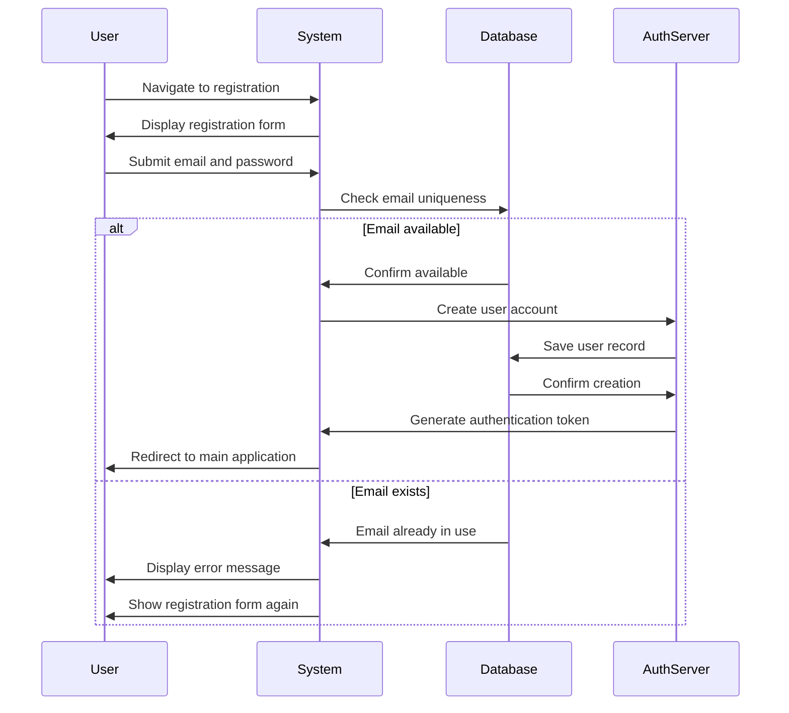

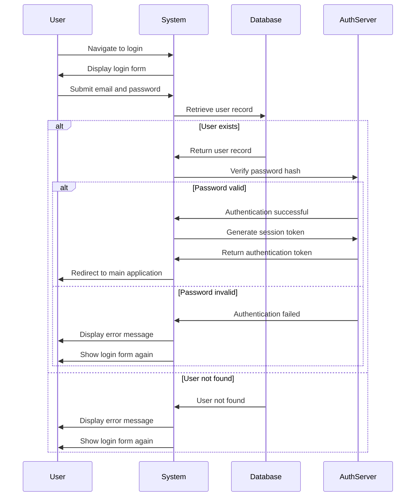

### 5.2 Todo Creation Workflow

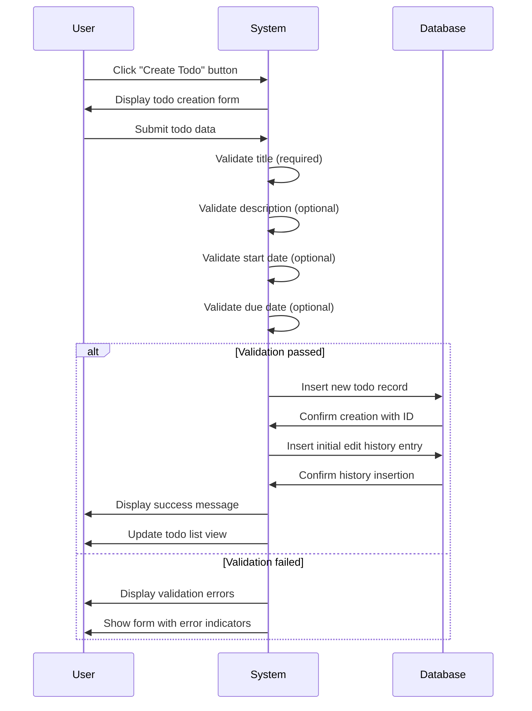

### 5.3 Todo Deletion and Trash Workflow

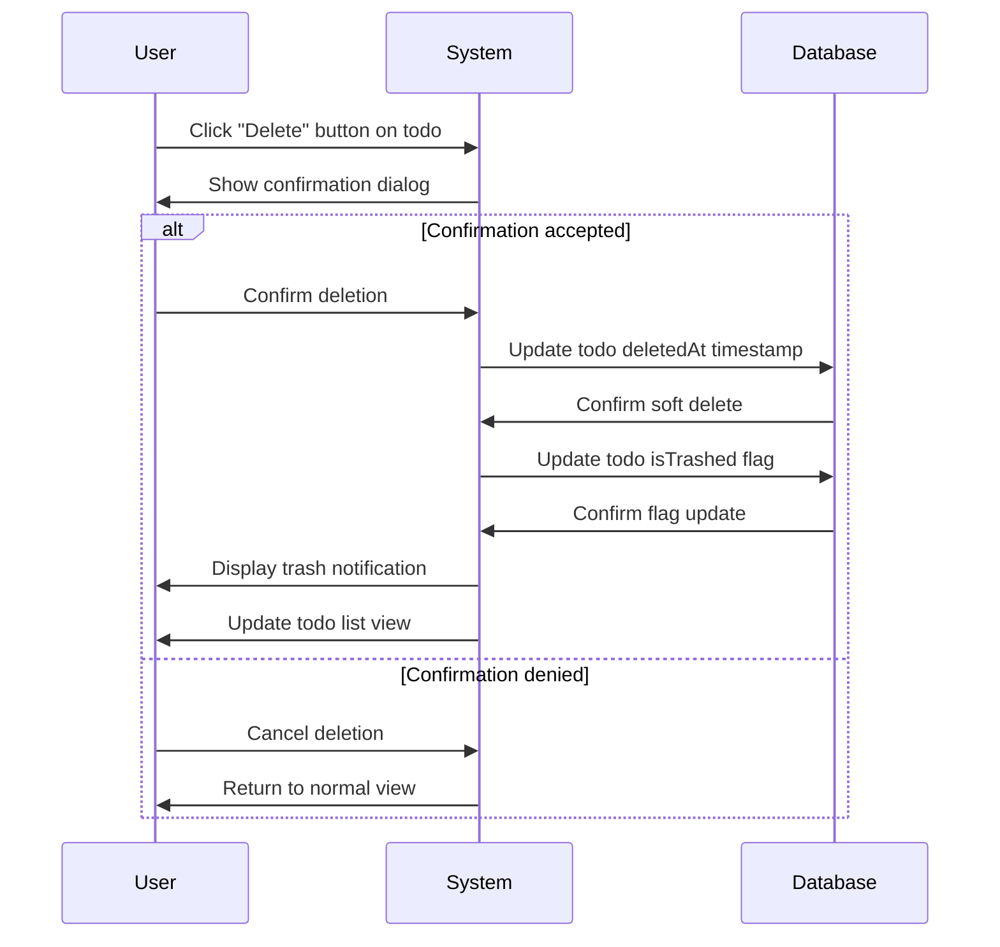

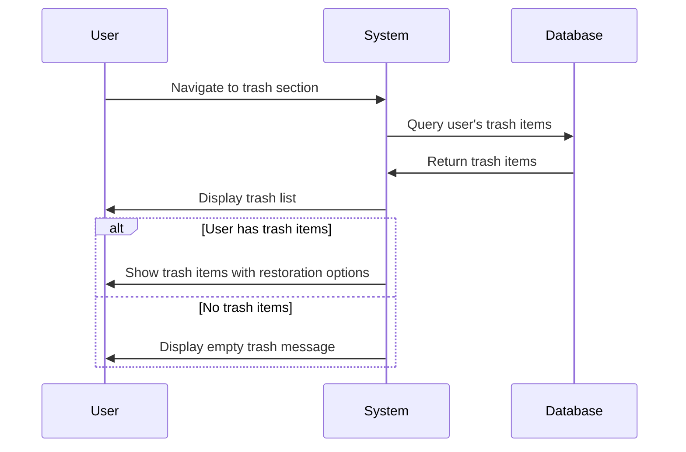

### 5.4 Edit History Workflow

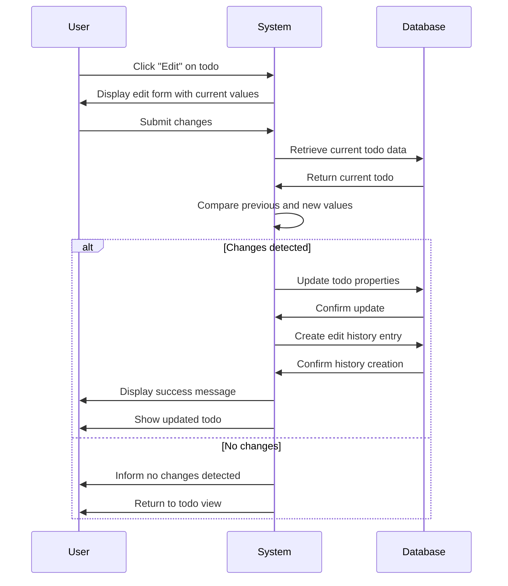

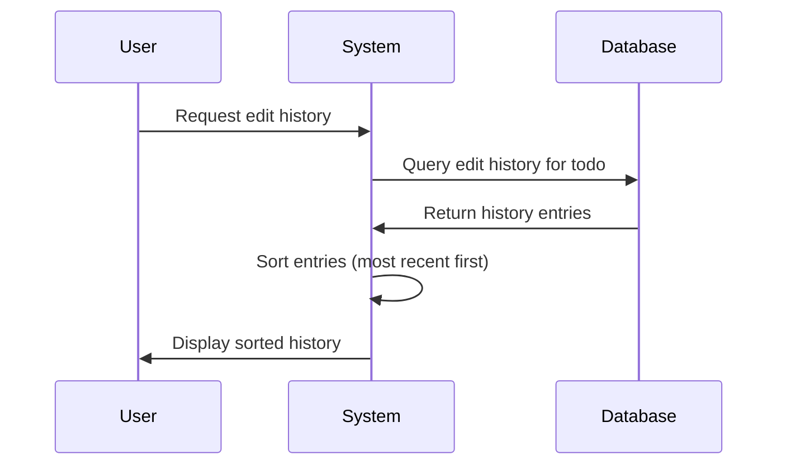

### 5.5 Trash Restoration Workflow

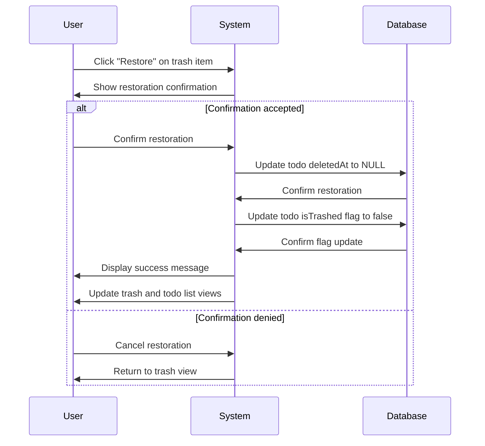

### 5.6 Permanent Deletion Workflow

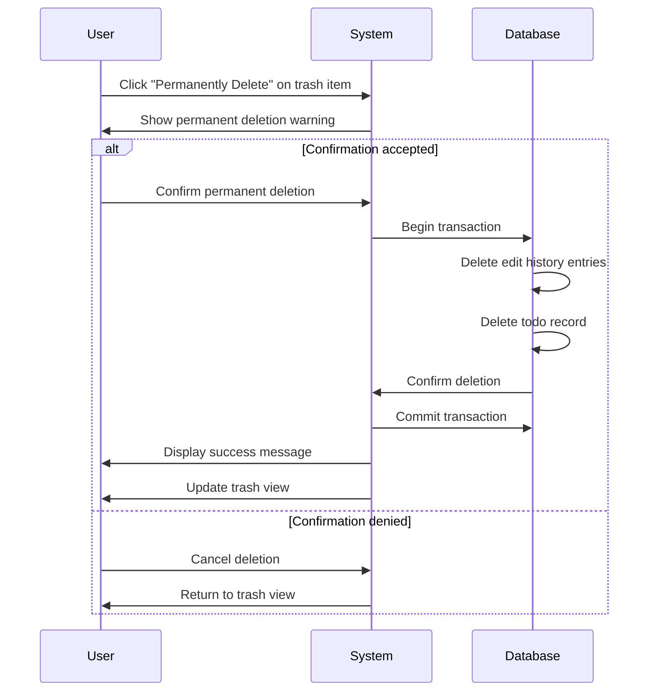

## 6. Data Requirements

### 6.1 User Data Structure

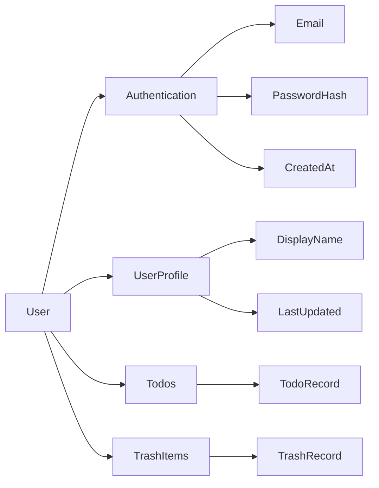

### 6.2 Todo Data Structure

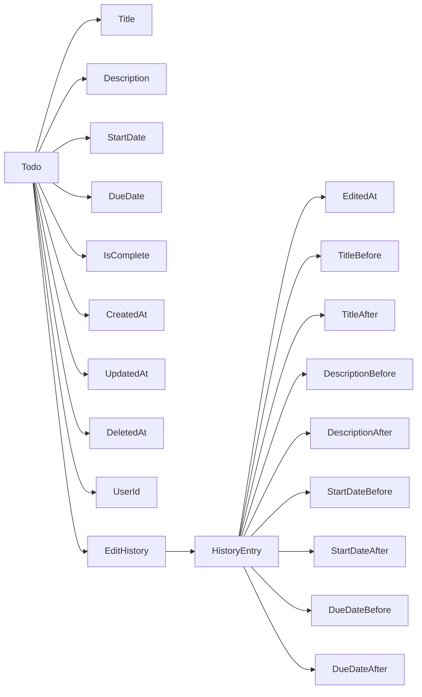

### 6.3 Data Relationships

- **One-to-Many**: User to Todos (one user can have many todos)
- **One-to-Many**: Todo to EditHistory (one todo can have many history entries)
- **One-to-One**: User to UserProfile (one profile per user)
- **One-to-Many**: User to AuthenticationTokens (one user can have multiple active sessions)

### 6.4 Data Retention Policies

- **User Data**: Retained until account deletion
- **Todo Data**: Retained until permanent deletion
- **Trash Data**: Retained for 30 days after deletion, then permanently removed
- **Edit History**: Retained with todo until permanent deletion
- **Authentication Tokens**: Retained during active session, invalidated on logout/password change

## 7. Privacy & Security Requirements

### 7.1 Authentication Security

- Passwords must be hashed using bcrypt with cost factor 10
- Authentication tokens must be JWT tokens with 24-hour expiration
- Token refresh mechanism must be implemented for extended sessions
- Session hijacking protection must be implemented
- Brute force attack prevention must be implemented

### 7.2 Data Encryption

- All password hashes must use salted hashes
- Database field-level encryption for sensitive data
- HTTPS encryption for all API communications
- Secure token storage on client side

### 7.3 Access Control

- Role-based access control with user role
- User-level data isolation enforced at database level
- API endpoints must verify user ownership of resources
- No data leakage between users possible

### 7.4 Privacy Controls

- Complete user data isolation
- No cross-user data access
- Transparent privacy policies
- User data export functionality
- Right to be forgotten (account deletion)

## 8. Error Handling Requirements

### 8.1 Validation Errors

- Title empty: "Title is required"
- Title too long: "Title must be 255 characters or fewer"
- Description too long: "Description must be 10,000 characters or fewer"
- Invalid date format: "Invalid date format. Use YYYY-MM-DDTHH:mm:ssZ"
- Start date after due date: "Start date is after due date. Would you like to proceed anyway?"

### 8.2 Authentication Errors

- Invalid credentials: "Invalid email or password"
- Session expired: "Your session has expired. Please log in again."
- Token invalid: "Your authentication token is invalid. Please log in again."

### 8.3 Access Control Errors

- Todo not owned by user: "You do not have permission to access this todo."
- Trash item not owned by user: "You do not have permission to access this trash item."
- Account not owned by user: "You do not have permission to perform this action on this account."

### 8.4 Data Processing Errors

- Database connection failed: "A database connection error occurred. Please try again."
- Todo not found: "The requested todo could not be found."
- Trash item not found: "The requested trash item could not be found."

### 8.5 Recovery Procedures

- Failed operations should rollback to previous state
- Users should receive clear error messages
- System should attempt automatic recovery where possible
- Persistent errors should be logged for administrator review

## 9. Performance Requirements

### 9.1 Response Time Requirements

- Todo list retrieval: Under 2 seconds for typical user (up to 1,000 todos)
- Single todo retrieval: Under 1 second
- Todo creation: Under 1 second
- Todo update: Under 1 second
- Todo deletion: Under 1 second
- Trash list retrieval: Under 2 seconds for typical user (up to 100 trash items)
- Edit history retrieval: Under 1 second for typical todo (up to 100 history entries)

### 9.2 Loading Experience

- Initial application load: Under 3 seconds
- Todo list scrolling: Smooth at 60 FPS
- Pagination: Immediate response when navigating pages
- Filter/sort operations: Results displayed within 2 seconds

### 9.3 Scaling Considerations

- Support up to 1,000 todos per user
- Support up to 100 trash items per user
- Support up to 100 edit history entries per todo
- Database query optimization for large datasets
- Indexing on frequently queried fields (userId, deletedAt, completion status, dates)

## 10. Success Criteria

### 10.1 Functional Success

- All users can create, view, edit, and manage their own todos
- No cross-user data access occurs
- Edit history is complete and accurate
- Trash system functions correctly with restoration capability
- Filtering and sorting work accurately

### 10.2 Security Success

- Zero instances of unauthorized data access
- All authentication tokens are secure and properly managed
- Passwords are stored securely with hashing
- Audit logs are maintained for all critical operations

### 10.3 User Experience Success

- System response times meet performance requirements
- Users can complete tasks with minimal clicks
- Error messages are clear and actionable
- Interface is intuitive for typical use cases

### 10.4 Data Integrity Success

- No data loss for normal operations
- Trash items are retained for full retention period
- Edit history is preserved through all operations
- All business rules are enforced consistently

This requirements specification provides comprehensive guidance for developing a multi-user Todo application with complete privacy, robust functionality, and production-ready quality standards.