# Multi-User Todo Application - Requirements Specification

## 1. Introduction

This document provides comprehensive requirements specification for a multi-user Todo list application. The system enables multiple users to create, manage, and organize their personal todo items while maintaining strict data isolation and privacy controls.

### 1.1 Purpose

The purpose of this document is to define all functional, business, and technical requirements for the Todo application backend system. This specification serves as the foundation for database design, API development, and system implementation.

### 1.2 Scope

The Todo application provides:
- Multi-user account management with secure authentication
- Personal todo list management for each user
- Complete todo lifecycle including creation, editing, completion, and deletion
- Edit history tracking for transparency and accountability
- Trash management with restoration capabilities
- Comprehensive filtering and sorting options
- Strict privacy controls ensuring complete data isolation

### 1.3 Target Audience

This specification is intended for:
- Backend developers implementing the NestJS application
- Database designers creating the Prisma schema
- Quality assurance engineers developing test cases
- System architects ensuring scalability and security

### 1.4 Document Conventions

This document uses the following conventions:
- EARS format (WHEN, THE, SHALL, etc.) for requirements
- Business-focused language without technical implementation details
- Natural language descriptions of workflows and processes
- Clear distinction between user requirements and business rules

## 2. Service Overview

### 2.1 Executive Summary

The multi-user Todo application is a secure, privacy-focused platform that enables individuals to manage their personal task lists. Each user has complete control over their own todos while the system ensures complete isolation between user data.

### 2.2 Business Vision

To provide a simple yet powerful todo management tool that prioritizes user privacy, data security, and ease of use. The application should be so intuitive that users can start managing their tasks immediately without training or documentation.

### 2.3 Target Users

The primary users of this application are:
- **Individual Productivity Users**: People who want to organize their daily tasks, appointments, and goals
- **Personal Task Managers**: Users who need to track personal projects and deadlines
- **Privacy-Conscious Individuals**: Users who value complete data ownership and privacy

### 2.4 Core Features

#### Account Management
- User registration with email and password
- Secure login and session management
- Profile customization with display name
- Password change functionality
- Account deletion with complete data removal

#### Todo Management
- Create todos with title, description, and optional dates
- View personal todo lists with pagination
- Complete or uncomplete todos with simple toggle
- Edit existing todos with full history tracking
- Soft delete and restore functionality

#### Advanced Features
- Edit history for transparency and accountability
- Trash management with restoration capabilities
- Comprehensive filtering (all, complete, incomplete)
- Flexible sorting (creation date, start date, due date)
- Personal data isolation and privacy

#### Security Features
- Secure authentication and authorization
- Complete data isolation between users
- Password security and management
- Session security and management

### 2.5 Business Goals

1. **User Acquisition**: Enable users to easily sign up and start managing their tasks
2. **User Retention**: Provide an intuitive experience that encourages continued use
3. **Data Security**: Maintain complete trust through robust security measures
4. **Privacy Leadership**: Establish the application as a privacy-first solution
5. **Scalability**: Build a system that can grow with user base and feature requirements

### 2.6 Success Metrics

- **Registration Conversion**: Percentage of visitors who complete registration
- **Daily Active Users**: Number of users who create or modify todos daily
- **Todo Retention Rate**: Percentage of created todos that remain un-deleted
- **User Satisfaction**: Net Promoter Score and user feedback
- **System Availability**: 99.9% uptime for critical operations

## 3. User Requirements

### 3.1 User Personas

#### Persona 1: Busy Professional
- **Name**: Sarah, 32, Marketing Manager
- **Goals**: Track work tasks, deadlines, and personal appointments
- **Pain Points**: Needs quick access to tasks, wants to avoid data breaches
- **Key Features**: Fast task creation, reliable privacy controls, easy navigation

#### Persona 2: Student
- **Name**: Alex, 20, University Student
- **Goals**: Manage assignments, study schedules, and personal goals
- **Pain Points**: Limited technical expertise, needs clear interface
- **Key Features**: Simple interface, clear workflows, mobile accessibility

#### Persona 3: Privacy-First User
- **Name**: Jamie, 28, Technology Professional
- **Goals**: Complete control over personal data, no third-party access
- **Pain Points**: Data privacy concerns with mainstream applications
- **Key Features**: Complete data isolation, transparent privacy controls, local-first capabilities

### 3.2 Authentication Requirements

#### Account Registration
- **WHEN** a new user registers, THE system SHALL require a valid email address and secure password
- **WHEN** registration data is submitted, THE system SHALL validate email format and password strength
- **WHEN** registration is successful, THE system SHALL create a new user account and authentication credentials
- **WHEN** registration fails due to existing email, THE system SHALL return an appropriate error message

#### User Login
- **WHEN** a user attempts to log in, THE system SHALL verify email and password credentials
- **WHEN** credentials are valid, THE system SHALL issue a secure authentication token
- **WHEN** credentials are invalid, THE system SHALL deny access without revealing specific failure reasons
- **WHEN** login succeeds, THE system SHALL maintain an active session for the authenticated user

#### Session Management
- **WHEN** a user logs out, THE system SHALL immediately terminate the current session
- **WHEN** a user changes their password, THE system SHALL invalidate all active sessions
- **WHEN** a user deletes their account, THE system SHALL terminate all active sessions
- **WHEN** a session expires, THE system SHALL require re-authentication for protected operations

#### Password Management
- **WHEN** a user requests password change, THE system SHALL require verification of current password
- **WHEN** a password is changed, THE system SHALL update credentials securely and invalidate sessions
- **WHERE** password storage is required, THE system SHALL use strong cryptographic hashing
- **WHEN** password validation occurs, THE system SHALL verify securely without exposing raw values

### 3.3 Profile Management

#### Profile Information
- **WHEN** a user registers, THE system SHALL create a default profile with email-based display name
- **WHEN** a user edits their profile, THE system SHALL allow display name modification
- **WHILE** profile display occurs, THE system SHALL show only the user's own profile information
- **WHERE** profile data is stored, THE system SHALL maintain strict privacy controls

#### Profile Privacy
- **WHEN** any user attempts to view another user's profile, THE system SHALL deny access
- **WHEN** a user views their own profile, THE system SHALL display current profile information
- **WHILE** profile operations occur, THE system SHALL enforce user-level access controls
- **WHERE** profile data is requested, THE system SHALL verify user authorization

### 3.4 Account Lifecycle

#### Account Deletion
- **WHEN** a user requests account deletion, THE system SHALL permanently remove all user data
- **WHERE** user data is stored, THE system SHALL ensure complete removal of todos, trash, and history
- **WHEN** account deletion completes, THE system SHALL terminate all active sessions
- **WHEN** account deletion fails, THE system SHALL provide appropriate error information

#### Data Purge
- **WHEN** a user account is deleted, THE system SHALL permanently delete all associated todos
- **WHEN** todo data is deleted, THE system SHALL remove all edit history entries for those todos
- **WHERE** permanent deletion occurs, THE system SHALL ensure no data recovery is possible
- **WHEN** data purge completes, THE system SHALL confirm successful removal

### 3.5 Feature Prioritization

#### Critical Features (MVP)
1. User registration and authentication
2. Basic todo CRUD operations
3. Todo completion toggle
4. Private data isolation
5. Basic error handling

#### Secondary Features (Phase 2)
1. Edit history tracking
2. Trash management
3. Comprehensive filtering
4. Flexible sorting options
5. Advanced privacy controls

#### Enhanced Features (Future)
1. Advanced notification system
2. Collaboration capabilities
3. Mobile app integration
4. Import/export functionality
5. Analytics and insights

## 4. Functional Requirements

### 4.1 Account Management Functionality

#### User Registration
- **WHEN** a visitor submits registration data, THE system SHALL validate email format and password strength
- **WHEN** registration data is valid, THE system SHALL create a new user account with authentication credentials
- **WHEN** registration succeeds, THE system SHALL return success response and authentication token
- **WHEN** registration fails due to existing email, THE system SHALL return appropriate error message

#### User Authentication
- **WHEN** a user submits login credentials, THE system SHALL verify email and password combination
- **WHEN** credentials are valid, THE system SHALL issue secure authentication token
- **WHEN** credentials are invalid, THE system SHALL deny access without revealing specific failure reasons
- **WHEN** authentication succeeds, THE system SHALL establish active user session

#### Session Management
- **WHEN** a user logs out, THE system SHALL immediately terminate current session
- **WHEN** password changes occur, THE system SHALL invalidate all active sessions
- **WHEN** account deletion occurs, THE system SHALL terminate all active sessions
- **WHEN** session expires, THE system SHALL require re-authentication

### 4.2 Todo CRUD Operations

#### Todo Creation
- **WHEN** a user creates a todo, THE system SHALL require a title and accept optional description, start date, and due date
- **WHEN** todo creation succeeds, THE system SHALL return the created todo with auto-generated fields
- **WHEN** todo creation fails due to invalid data, THE system SHALL return validation errors
- **WHEN** a new todo is created, THE system SHALL set completion status to incomplete by default

#### Todo Listing
- **WHEN** a user requests their todo list, THE system SHALL return only todos belonging to that user
- **WHEN** todo listing occurs, THE system SHALL support pagination with configurable page size
- **WHEN** filtering is applied, THE system SHALL return todos matching specified criteria
- **WHEN** sorting is applied, THE system SHALL return todos in specified order

#### Todo Retrieval
- **WHEN** a user requests a specific todo, THE system SHALL return details for that todo only if owned by user
- **WHEN** todo retrieval succeeds, THE system SHALL return complete todo information including description
- **WHEN** user attempts to access another user's todo, THE system SHALL deny access
- **WHEN** non-existent todo is requested, THE system SHALL return appropriate error response

#### Todo Editing
- **WHEN** a user edits their todo, THE system SHALL allow modification of title, description, start date, and due date
- **WHEN** todo editing succeeds, THE system SHALL create edit history entry and return updated todo
- **WHEN** editing fails due to invalid data, THE system SHALL return validation errors
- **WHEN** a user attempts to edit another user's todo, THE system SHALL deny access

#### Todo Completion Toggle
- **WHEN** a user marks a todo as complete, THE system SHALL update completion status to true
- **WHEN** a user marks a todo as incomplete, THE system SHALL update completion status to false
- **WHEN** completion status changes, THE system SHALL update timestamp and create edit history entry
- **WHEN** completion toggle fails, THE system SHALL return appropriate error response

### 4.3 Edit History Tracking

#### History Creation
- **WHEN** a todo is edited, THE system SHALL create a history entry recording the changes
- **WHEN** edit history is created, THE system SHALL record timestamp, changed fields, and new values
- **WHEN** multiple fields are modified, THE system SHALL create single history entry with all changes
- **WHEN** history creation fails, THE system SHALL roll back the edit operation

#### History Retrieval
- **WHEN** a user requests edit history, THE system SHALL return history entries for their todos only
- **WHEN** history listing occurs, THE system SHALL sort entries from most recent to oldest
- **WHEN** history retrieval succeeds, THE system SHALL return complete history information
- **WHEN** user attempts to access another user's todo history, THE system SHALL deny access

### 4.4 Trash Management

#### Todo Deletion
- **WHEN** a user deletes a todo, THE system SHALL perform soft deletion and move to trash
- **WHEN** todo is moved to trash, THE system SHALL maintain user association and preserve data
- **WHEN** deletion succeeds, THE system SHALL update todo status and remove from normal list
- **WHEN** deletion fails due to access restrictions, THE system SHALL deny the operation

#### Trash Listing
- **WHEN** a user requests trash list, THE system SHALL return only deleted todos belonging to user
- **WHEN** trash listing occurs, THE system SHALL support pagination with configurable page size
- **WHEN** trash listing succeeds, THE system SHALL return complete trash information
- **WHEN** trash listing fails, THE system SHALL return appropriate error response

#### Todo Restoration
- **WHEN** a user restores a todo from trash, THE system SHALL move todo back to normal list
- **WHEN** restoration occurs, THE system SHALL update todo status and remove from trash
- **WHEN** restoration succeeds, THE system SHALL return restored todo information
- **WHEN** restoration fails due to access restrictions, THE system SHALL deny the operation

#### Permanent Deletion
- **WHEN** a user permanently deletes a todo from trash, THE system SHALL remove all associated data
- **WHEN** permanent deletion occurs, THE system SHALL delete todo and all edit history entries
- **WHEN** permanent deletion succeeds, THE system SHALL confirm complete removal
- **WHEN** permanent deletion fails, THE system SHALL return appropriate error response

### 4.5 Filtering and Sorting

#### Completion Status Filtering
- **WHEN** filtering by all todos, THE system SHALL return both complete and incomplete todos
- **WHEN** filtering by complete todos, THE system SHALL return only completed todos
- **WHEN** filtering by incomplete todos, THE system SHALL return only incomplete todos
- **WHEN** filtering fails, THE system SHALL return appropriate error response

#### Sorting Options
- **WHEN** sorting by creation date, THE system SHALL order todos by creation timestamp
- **WHEN** sorting by start date, THE system SHALL order todos by start date with null values at end
- **WHEN** sorting by due date, THE system SHALL order todos by due date with null values at end
- **WHEN** sorting fails, THE system SHALL return appropriate error response

#### Combined Filtering
- **WHEN** multiple filters are applied, THE system SHALL apply all filters together
- **WHEN** combined filtering succeeds, THE system SHALL return results matching all criteria
- **WHEN** filtering combined with pagination, THE system SHALL apply pagination after filtering
- **WHEN** combined filtering fails, THE system SHALL return appropriate error response

### 4.6 Privacy Controls

#### Data Isolation
- **WHEN** any data operation occurs, THE system SHALL ensure complete user data isolation
- **WHEN** todo queries are executed, THE system SHALL automatically filter by authenticated user
- **WHEN** access control checks occur, THE system SHALL verify user authorization
- **WHEN** privacy violations are detected, THE system SHALL prevent unauthorized access

#### Access Verification
- **WHEN** user attempts to view todos, THE system SHALL verify ownership before returning results
- **WHEN** user attempts to edit todos, THE system SHALL verify ownership before allowing changes
- **WHEN** user attempts to delete todos, THE system SHALL verify ownership before allowing deletion
- **WHEN** access verification fails, THE system SHALL deny the request immediately

#### Profile Privacy
- **WHEN** any user attempts to view another user's profile, THE system SHALL deny access
- **WHEN** a user views their own profile, THE system SHALL allow display of profile information
- **WHEN** profile access is requested, THE system SHALL verify user authorization
- **WHEN** profile privacy violations occur, THE system SHALL prevent unauthorized access

## 5. Business Rules

### 5.1 Data Validation Rules

#### Todo Validation
- **WHEN** a todo is created, THE system SHALL require title field and validate non-empty
- **WHEN** description is provided, THE system SHALL accept empty or null values
- **WHEN** start date is provided, THE system SHALL validate date format and logical consistency
- **WHEN** due date is provided, THE system SHALL validate date format and logical consistency
- **WHEN** validation fails, THE system SHALL return appropriate error messages

#### User Input Validation
- **WHEN** email is provided, THE system SHALL validate email format
- **WHEN** password is provided, THE system SHALL validate minimum length and strength requirements
- **WHEN** display name is provided, THE system SHALL validate non-empty and appropriate length
- **WHEN** date values are provided, THE system SHALL validate date format and ranges

#### Data Type Validation
- **WHEN** boolean values are processed, THE system SHALL accept true or false only
- **WHEN** date values are processed, THE system SHALL validate ISO 8601 format
- **WHEN** numeric values are processed, THE system SHALL validate appropriate ranges
- **WHEN** string values are processed, THE system SHALL validate length constraints

### 5.2 Permission Logic

#### User-Level Access Control
- **WHEN** any user operation occurs, THE system SHALL verify authentication before processing
- **WHEN** data queries are executed, THE system SHALL filter results by authenticated user ID
- **WHEN** data modifications occur, THE system SHALL verify user ownership before allowing changes
- **WHEN** unauthorized access is attempted, THE system SHALL deny the request

#### Todo Ownership Verification
- **WHEN** a user accesses a todo, THE system SHALL verify the todo belongs to that user
- **WHEN** a user edits a todo, THE system SHALL verify ownership before allowing modifications
- **WHEN** a user deletes a todo, THE system SHALL verify ownership before allowing deletion
- **WHEN** ownership verification fails, THE system SHALL return access denied error

#### Profile Access Control
- **WHEN** any user attempts to view another user's profile, THE system SHALL deny access
- **WHEN** a user views their own profile, THE system SHALL allow normal profile operations
- **WHEN** profile access is requested, THE system SHALL verify user authorization
- **WHEN** profile access violations occur, THE system SHALL prevent unauthorized access

### 5.3 Privacy Enforcement Rules

#### Complete Data Isolation
- **WHEN** any data operation occurs, THE system SHALL enforce user-level data isolation
- **WHEN** todo queries are executed, THE system SHALL automatically include user ID filter
- **WHEN** trash queries are executed, THE system SHALL automatically include user ID filter
- **WHEN** privacy isolation fails, THE system SHALL prevent data leakage immediately

#### Cross-User Access Prevention
- **WHEN** a user attempts to access another user's todo, THE system SHALL deny access
- **WHEN** a user attempts to access another user's edit history, THE system SHALL deny access
- **WHEN** a user attempts to access another user's trash, THE system SHALL deny access
- **WHEN** cross-user access is detected, THE system SHALL log security event and prevent operation

#### Session Privacy
- **WHEN** a user logs out, THE system SHALL ensure no session data remains accessible
- **WHEN** session expires, THE system SHALL invalidate all session information
- **WHEN** password changes occur, THE system SHALL invalidate all sessions for security
- **WHEN** session cleanup occurs, THE system SHALL remove expired session data

### 5.4 Edit History Business Logic

#### History Creation Triggers
- **WHEN** a todo's title is modified, THE system SHALL create edit history entry
- **WHEN** a todo's description is modified, THE system SHALL create edit history entry
- **WHEN** a todo's start date is modified, THE system SHALL create edit history entry
- **WHEN** a todo's due date is modified, THE system SHALL create edit history entry
- **WHEN** multiple fields are modified, THE system SHALL create single history entry

#### History Recording Requirements
- **WHEN** edit history is created, THE system SHALL record timestamp of edit
- **WHEN** edit history is created, THE system SHALL record which fields were changed
- **WHEN** edit history is created, THE system SHALL record new values for changed fields
- **WHEN** history recording fails, THE system SHALL roll back the edit operation

#### History Access Control
- **WHEN** a user requests edit history, THE system SHALL verify todo ownership
- **WHEN** history retrieval succeeds, THE system SHALL return complete history information
- **WHEN** unauthorized history access is attempted, THE system SHALL deny the request
- **WHEN** history data is corrupted, THE system SHALL implement appropriate recovery

### 5.5 Trash Management Rules

#### Soft Delete Implementation
- **WHEN** a todo is deleted, THE system SHALL perform soft deletion (mark as deleted)
- **WHEN** todo is soft deleted, THE system SHALL move todo to trash state
- **WHEN** trash state occurs, THE system SHALL maintain todo data and user association
- **WHEN** soft deletion fails, THE system SHALL return appropriate error response

#### Trash Restoration Logic
- **WHEN** a todo is restored from trash, THE system SHALL remove trash status
- **WHEN** restoration occurs, THE system SHALL return todo to normal list state
- **WHEN** restoration succeeds, THE system SHALL update todo status accordingly
- **WHEN** restoration fails, THE system SHALL return appropriate error response

#### Permanent Deletion Requirements
- **WHEN** a todo is permanently deleted, THE system SHALL remove all todo data
- **WHEN** permanent deletion occurs, THE system SHALL delete all edit history entries
- **WHEN** permanent deletion succeeds, THE system SHALL confirm complete removal
- **WHEN** permanent deletion fails, THE system SHALL return appropriate error response

### 5.6 Filtering and Sorting Rules

#### Filter Application Logic
- **WHEN** multiple filters are applied, THE system SHALL apply all filters together
- **WHEN** completion status filtering occurs, THE system SHALL include appropriate status values
- **WHEN** combined filtering succeeds, THE system SHALL return results matching all criteria
- **WHEN** filtering fails, THE system SHALL return appropriate error response

#### Sort Order Implementation
- **WHEN** sorting by creation date, THE system SHALL order by timestamp in specified direction
- **WHEN** sorting by start date, THE system SHALL order by start date with null values at end
- **WHEN** sorting by due date, THE system SHALL order by due date with null values at end
- **WHEN** sorting with null values, THE system SHALL place nulls at end for date-based sorting

#### Pagination Logic
- **WHEN** pagination is applied, THE system SHALL return appropriate page of results
- **WHEN** page size exceeds limits, THE system SHALL enforce maximum page size
- **WHEN** pagination parameters are invalid, THE system SHALL return appropriate error response
- **WHEN** pagination succeeds, THE system SHALL return total count and current page data

## 6. Workflow Specifications

### 6.1 User Registration and Login Workflow

#### Registration Process
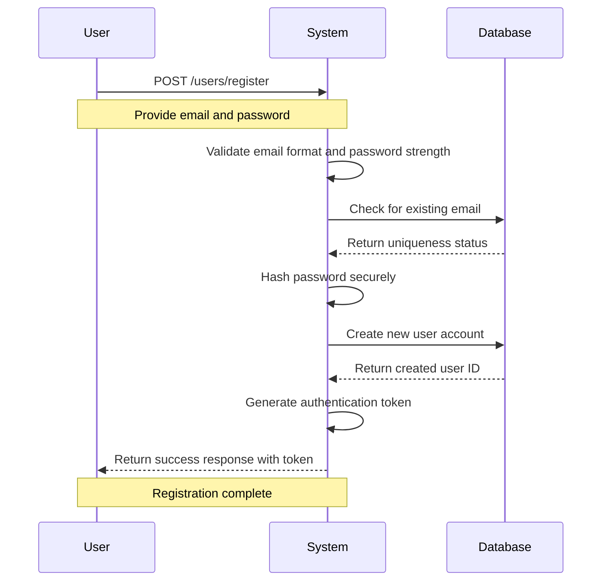

#### Login Process
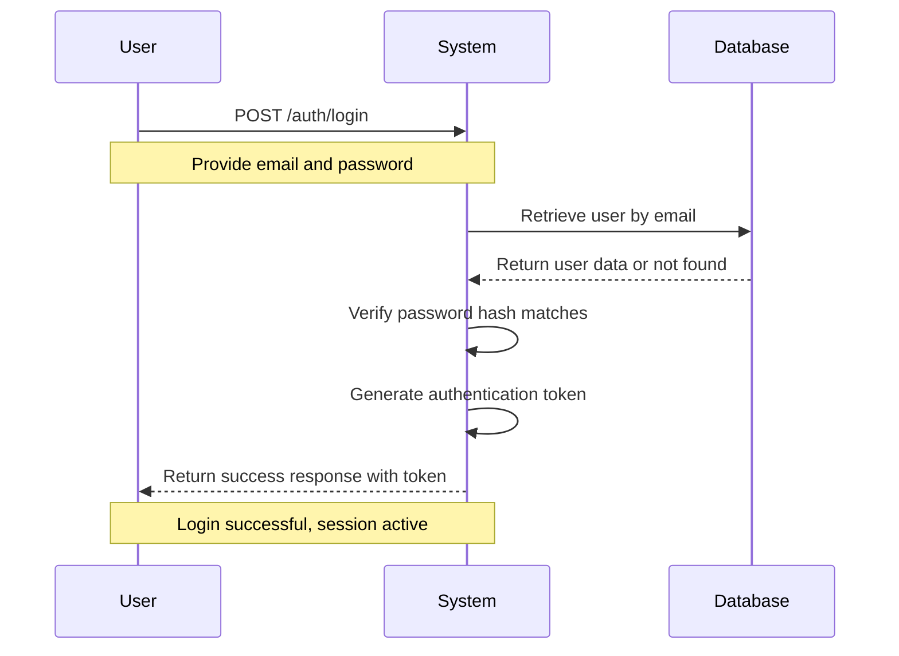

#### Session Management
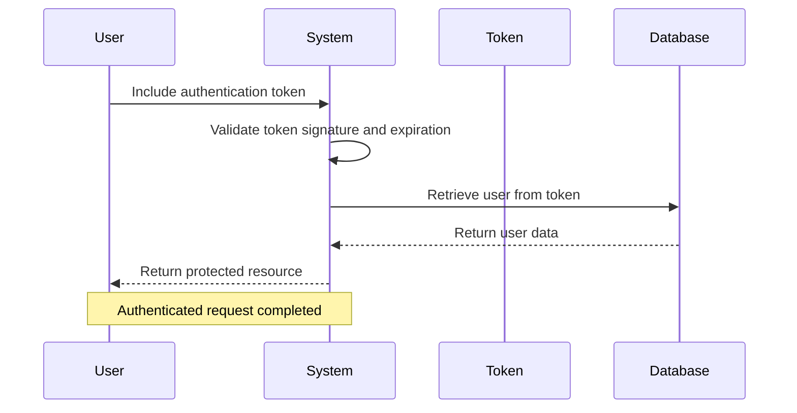

### 6.2 Todo Creation Workflow

#### Todo Creation Process
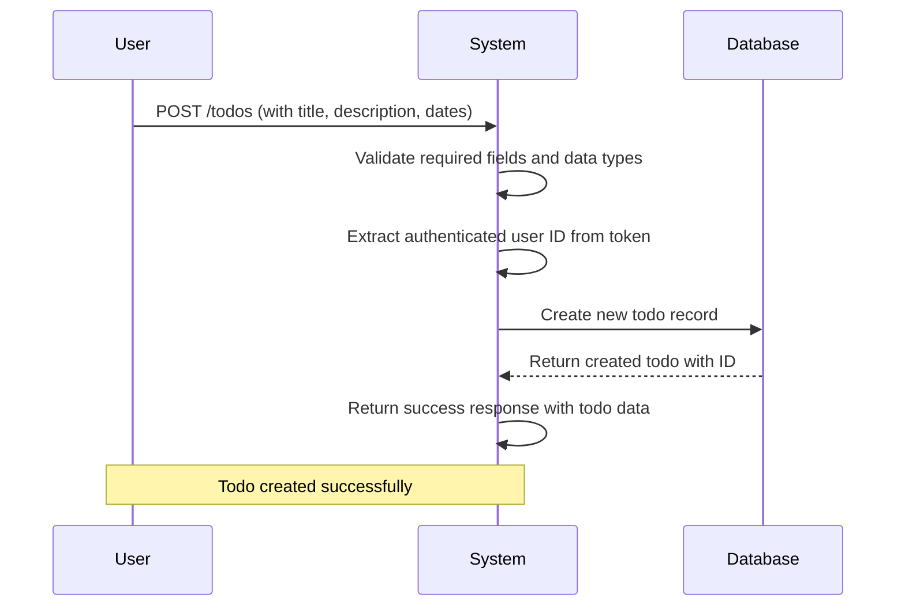

#### Creation Validation
- **WHEN** title is empty or missing, THE system SHALL return "Title is required" error
- **WHEN** description exceeds maximum length, THE system SHALL return appropriate error
- **WHEN** start date format is invalid, THE system SHALL return "Invalid date format" error
- **WHEN** due date format is invalid, THE system SHALL return "Invalid date format" error

### 6.3 Todo Management Workflow

#### Todo Listing Process
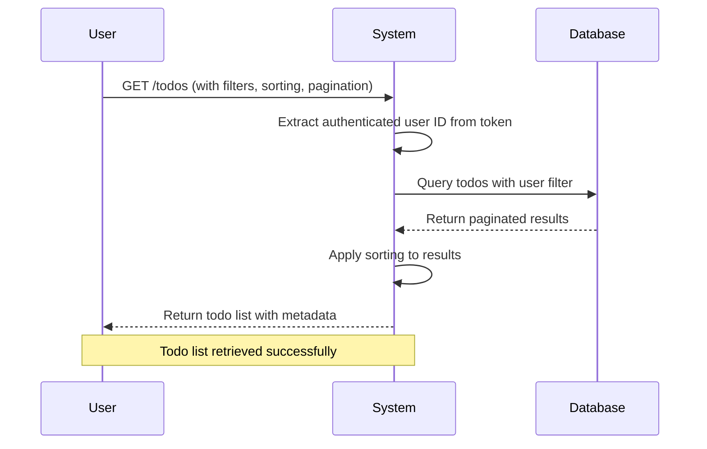

#### Single Todo Retrieval
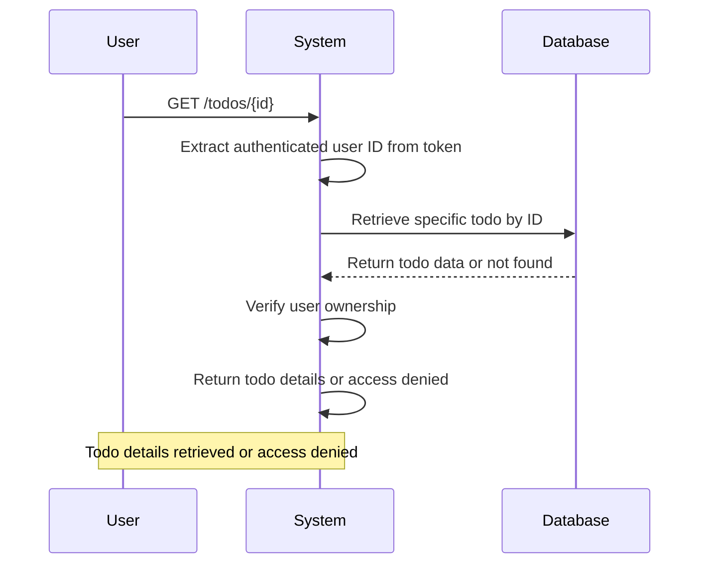

### 6.4 Edit History Workflow

#### History Creation Process
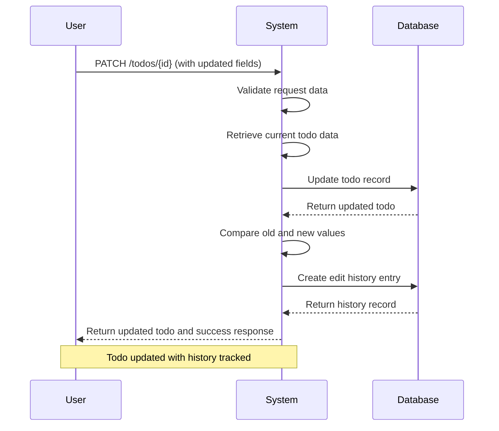

#### History Retrieval Process
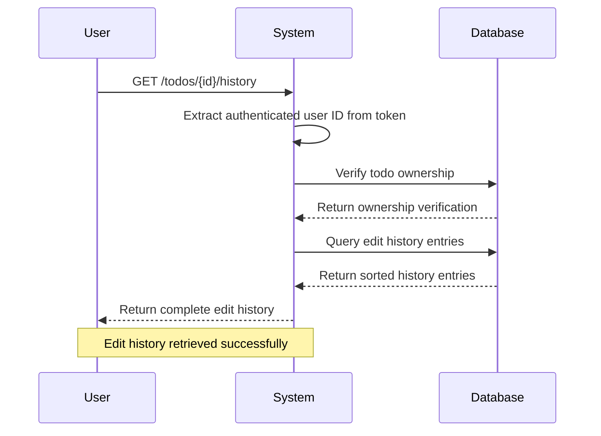

### 6.5 Trash Management Workflow

#### Trash Deletion Process
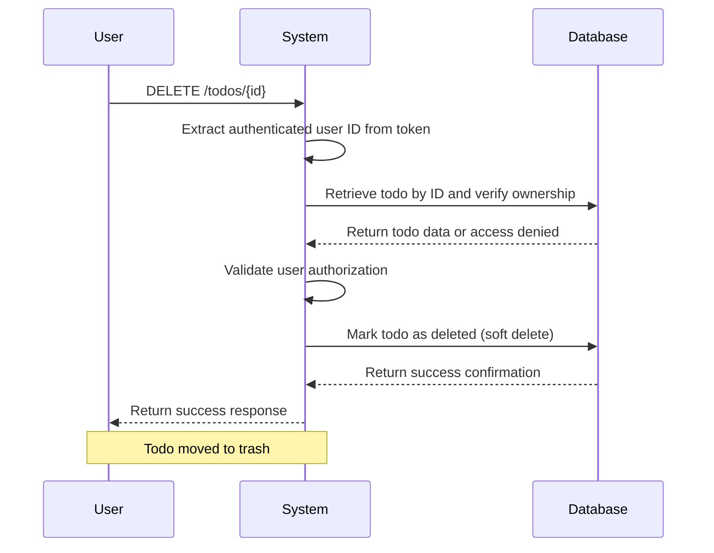

#### Trash Listing Process
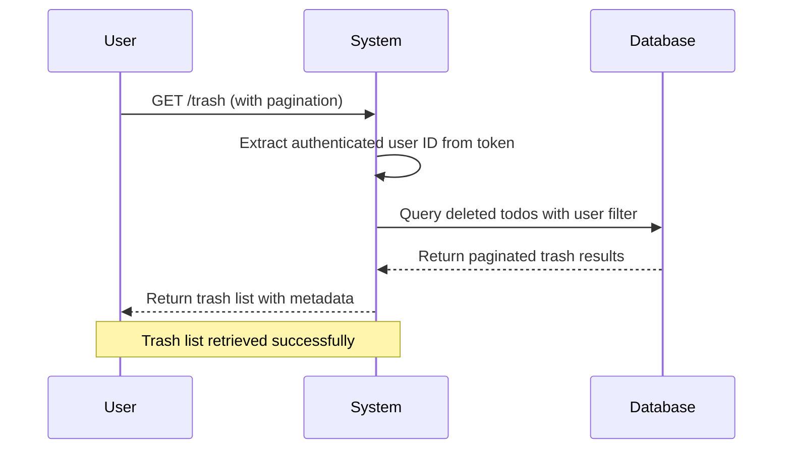

#### Trash Restoration Process
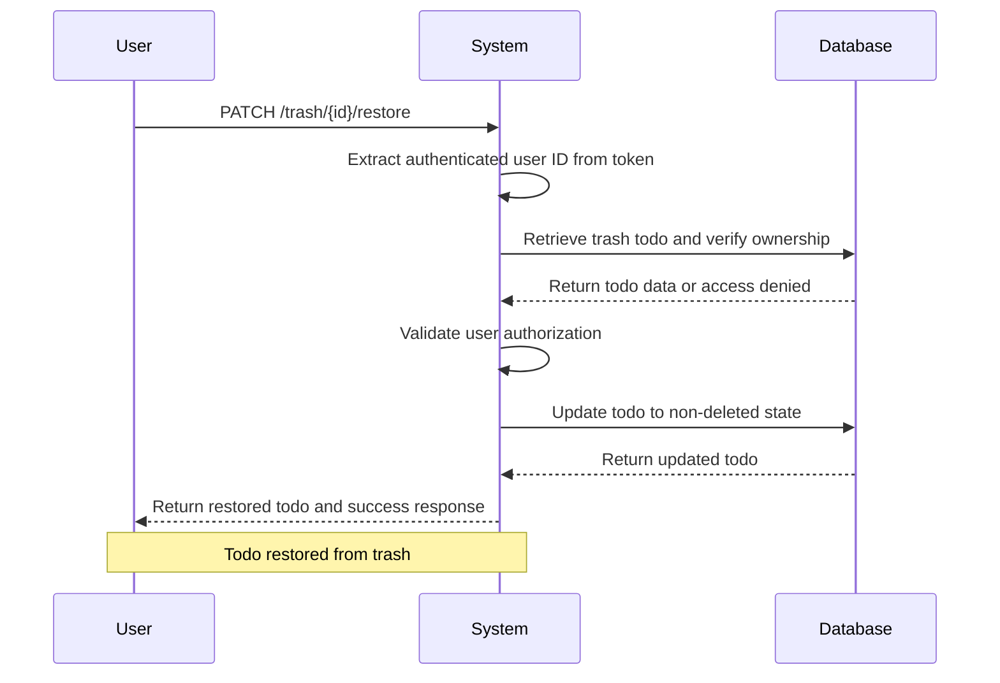

#### Permanent Deletion Process
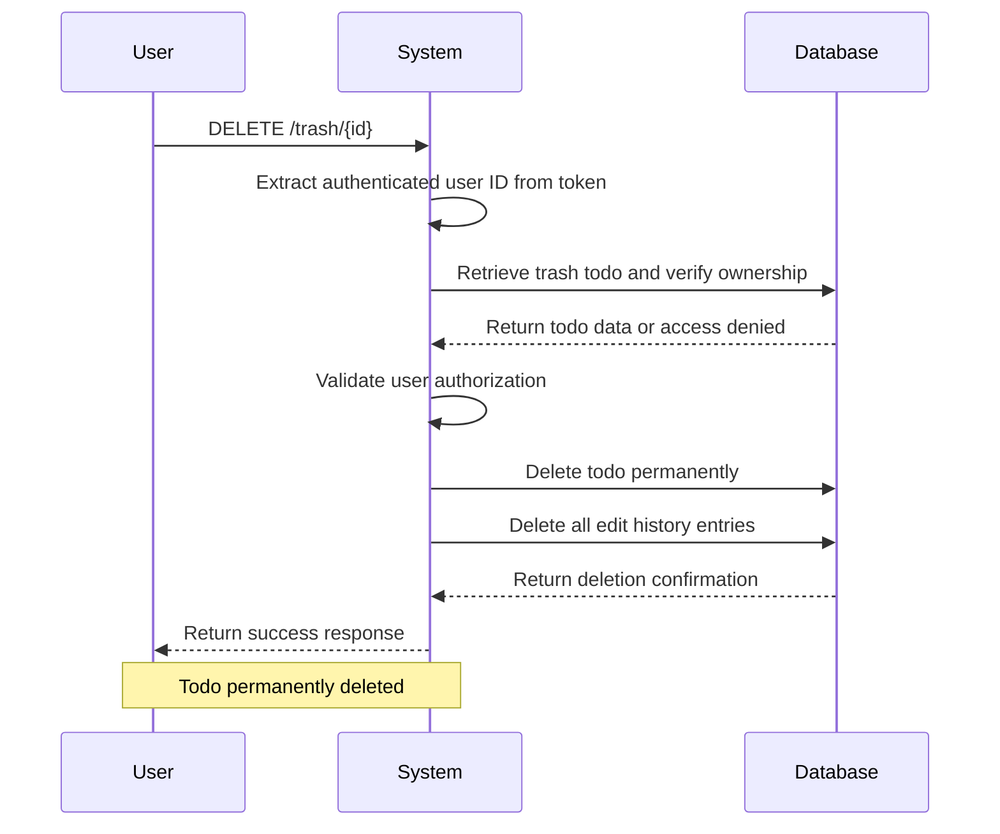

## 7. Privacy and Security Requirements

### 7.1 User Privacy Requirements

#### Complete Data Isolation
- **WHEN** a user accesses the system, THE system SHALL ensure that user data is completely isolated from other users' data.
- **WHEN** any query is executed, THE system SHALL automatically filter results to show only data belonging to the authenticated user.
- **WHEN** a user attempts to access another user's data, THE system SHALL deny access and return appropriate error response.

#### Private Todo Information
- **WHEN** a user views their todo list, THE system SHALL show only todos created by that specific user.
- **WHEN** a user views trash, THE system SHALL show only deleted todos belonging to that user.
- **WHEN** a user views edit history, THE system SHALL show only history entries for their own todos.
- **WHILE** a user is logged in, THE system SHALL enforce complete data privacy for all operations.

#### Profile Privacy
- **WHEN** a user attempts to view another user's profile, THE system SHALL deny access.
- **WHILE** a user is viewing their own profile, THE system SHALL allow display of profile information.
- **WHEN** a user tries to access any profile other than their own, THE system SHALL return access denied error.

#### Complete User Anonymity
- **WHEN** a user performs any operation, THE system SHALL not expose any identifying information to other users.
- **WHILE** todo items are displayed, THE system SHALL never show the creator's identity information.
- **WHERE** user identity is required internally, THE system SHALL store it only for access control purposes.

### 7.2 Data Access Controls

#### User-Scoped Data Access
- **WHEN** any data operation is performed, THE system SHALL verify that the data belongs to the authenticated user.
- **WHEN** a user creates a todo, THE system SHALL associate the todo with that specific user's account.
- **WHEN** a user attempts to access data not owned by them, THE system SHALL deny the request.
- **WHERE** data filtering is applied, THE system SHALL enforce user ID-based filtering on all queries.

#### Access Verification
- **WHEN** a user views a todo list, THE system SHALL verify user authorization before returning results.
- **WHEN** a user attempts to edit a todo, THE system SHALL verify ownership before allowing changes.
- **WHEN** a user attempts to delete a todo, THE system SHALL verify ownership before allowing deletion.
- **WHEN** a user attempts to restore a deleted todo, THE system SHALL verify ownership before restoration.

#### Permission Matrix
| Action | User | Notes |
|--------|------|-------|
| Create Todo | ✅ | Users can create todos for their own account |
| View Own Todo List | ✅ | Users can see their complete todo list |
| View Single Todo | ✅ | Users can view details of their own todos |
| Edit Own Todo | ✅ | Users can modify their own todos |
| Delete Own Todo | ✅ | Users can soft-delete their own todos |
| Restore Deleted Todo | ✅ | Users can restore their own deleted todos |
| Permanently Delete | ✅ | Users can permanently delete their own todos |
| View Trash | ✅ | Users can view their own trash |
| View Edit History | ✅ | Users can view history for their own todos |
| View Other Users' Data | ❌ | Complete access denial enforced |

### 7.3 Authentication Security

#### Account Authentication
- **WHEN** a user registers an account, THE system SHALL create secure authentication credentials.
- **WHEN** a user attempts to log in, THE system SHALL verify credentials securely.
- **WHEN** a user logs in successfully, THE system SHALL issue an authentication token.
- **WHILE** a user session is active, THE system SHALL maintain secure session management.

#### Session Security
- **WHEN** a user logs out, THE system SHALL invalidate the current session immediately.
- **WHEN** a user changes their password, THE system SHALL invalidate all active sessions.
- **WHEN** a user deletes their account, THE system SHALL terminate all sessions for that user.
- **WHERE** session timeout occurs, THE system SHALL require re-authentication.

#### Token Management
- **WHEN** authentication occurs, THE system SHALL issue secure tokens for stateless authentication.
- **WHILE** a request is processed, THE system SHALL validate the authentication token.
- **IF** a token is invalid or expired, THE system SHALL deny the request.
- **WHERE** tokens are stored, THE system SHALL follow security best practices.

#### Password Security
- **WHEN** a user creates a password, THE system SHALL enforce strong password requirements.
- **WHEN** a user changes their password, THE system SHALL verify the current password.
- **WHERE** passwords are stored, THE system SHALL use secure hashing algorithms.
- **WHEN** a user attempts to log in, THE system SHALL validate password securely.

### 7.4 Data Encryption

#### Data at Rest
- **WHERE** sensitive user data is stored, THE system SHALL use encryption at rest.
- **WHEN** user passwords are stored, THE system SHALL use strong hashing algorithms.
- **WHERE** authentication tokens are persisted, THE system SHALL use secure storage.

#### Data in Transit
- **WHEN** data is transmitted between client and server, THE system SHALL use TLS encryption.
- **WHEN** authentication tokens are sent, THE system SHALL use secure transmission protocols.
- **WHILE** user data is being processed, THE system SHALL maintain data integrity.

#### Sensitive Information Protection
- **WHEN** user credentials are processed, THE system SHALL handle them as sensitive data.
- **WHEN** authentication tokens are handled, THE system SHALL follow security protocols.
- **WHERE** personal information is stored, THE system SHALL apply appropriate protections.

### 7.5 Compliance Requirements

#### Legal and Regulatory Compliance
- **WHERE** user data is processed, THE system SHALL comply with applicable data protection laws.
- **WHEN** user data is stored, THE system SHALL implement appropriate security measures.
- **WHERE** user rights are recognized, THE system SHALL provide mechanisms for data access and deletion.

#### Data Retention and Deletion
- **WHEN** a user deletes their account, THE system SHALL permanently remove all associated data.
- **WHEN** a user deletes a todo from trash, THE system SHALL permanently remove all related data.
- **WHERE** data retention is required, THE system SHALL store data only for legitimate business purposes.

#### User Rights
- **WHEN** a user requests account deletion, THE system SHALL comply with deletion requirements.
- **WHERE** data correction is needed, THE system SHALL allow users to update their information.
- **WHEN** a user removes data, THE system SHALL ensure complete and permanent removal.

## 8. Performance Requirements

### 8.1 Response Time Requirements

#### API Response Times
- **WHEN** a user creates a todo, THE system SHALL respond within 2 seconds under normal load.
- **WHEN** a user retrieves their todo list, THE system SHALL respond within 1.5 seconds under normal load.
- **WHEN** a user retrieves edit history, THE system SHALL respond within 2 seconds under normal load.
- **WHEN** a user performs any operation, THE system SHALL respond within 5 seconds maximum.

#### Database Query Performance
- **WHEN** a simple query is executed, THE system SHALL complete within 100ms for typical data volume.
- **WHEN** a complex query with joins is executed, THE system SHALL complete within 500ms.
- **WHEN** a paginated query is executed, THE system SHALL complete within 200ms.
- **WHEN** a full table scan occurs, THE system SHALL implement appropriate indexing to avoid.

#### User Experience Targets
- **WHEN** a user submits a request, THE system SHALL provide immediate visual feedback.
- **WHEN** data loading occurs, THE system SHALL show loading state within 200ms.
- **WHEN** operations complete, THE system SHALL update UI within 500ms.
- **WHEN** errors occur, THE system SHALL display error messages within 1 second.

### 8.2 Loading Experience

#### List Loading
- **WHEN** a user loads their todo list, THE system SHALL display initial items within 1 second.
- **WHEN** pagination is active, THE system SHALL load additional pages within 1.5 seconds.
- **WHEN** filtering is applied, THE system SHALL update results within 2 seconds.
- **WHEN** sorting is applied, THE system SHALL re-order results within 1.5 seconds.

#### Single Item Loading
- **WHEN** a user views a single todo, THE system SHALL load and display within 1 second.
- **WHEN** edit history is loaded, THE system SHALL display within 1.5 seconds.
- **WHEN** trash list is loaded, THE system SHALL display within 1 second.
- **WHEN** profile information is loaded, THE system SHALL display within 500ms.

#### First Load Experience
- **WHEN** a user first loads the application, THE system SHALL show basic interface within 2 seconds.
- **WHEN** initial data is loading, THE system SHALL show placeholder content or loading indicator.
- **WHEN** authentication is loading, THE system SHALL show authentication state indicator.
- **WHEN** initial load completes, THE system SHALL display complete user interface.

### 8.3 Pagination Performance

#### List Performance
- **WHEN** a todo list is paginated, THE system SHALL support page sizes from 10 to 100 items.
- **WHEN** pagination is applied, THE system SHALL return total count with each response.
- **WHEN** pagination parameters are valid, THE system SHALL return precise page of results.
- **WHEN** pagination exceeds maximum limits, THE system SHALL enforce reasonable constraints.

#### Large Dataset Handling
- **WHEN** a user has thousands of todos, THE system SHALL maintain acceptable load times.
- **WHEN** complex filtering is applied, THE system SHALL use database indexing.
- **WHEN** large result sets occur, THE system SHALL implement appropriate pagination.
- **WHEN** memory limits are approached, THE system SHALL use streaming or chunking.

#### Navigation Performance
- **WHEN** a user navigates between pages, THE system SHALL maintain responsive interface.
- **WHEN** filters are changed, THE system SHALL re-paginate results efficiently.
- **WHEN** sorting is applied, THE system SHALL re-paginate results without full reload.
- **WHEN** pagination state changes, THE system SHALL update display immediately.

### 8.4 Filtering and Sorting Speed

#### Filter Performance
- **WHEN** completion status filtering is applied, THE system SHALL filter within 500ms.
- **WHEN** complex filters are combined, THE system SHALL filter within 1 second.
- **WHEN** multiple filter criteria are applied, THE system SHALL maintain performance.
- **WHEN** filtering returns empty results, THE system SHALL return immediately.

#### Sorting Performance
- **WHEN** creation date sorting is applied, THE system SHALL sort within 500ms.
- **WHEN** date-based sorting occurs, THE system SHALL handle null values efficiently.
- **WHEN** multiple sort criteria are combined, THE system SHALL maintain performance.
- **WHEN** sorting with large datasets, THE system SHALL use database-level sorting.

#### Real-time Updates
- **WHEN** user actions occur, THE system SHALL update filtered views within 1 second.
- **WHEN** new items are added, THE system SHALL reflect in filtered views immediately.
- **WHEN** item status changes, THE system SHALL update relevant filtered lists.
- **WHEN** filtering criteria change, THE system SHALL update display efficiently.

### 8.5 Error Recovery Time

#### Error Response
- **WHEN** a validation error occurs, THE system SHALL respond within 500ms.
- **WHEN** an authentication error occurs, THE system SHALL respond within 500ms.
- **WHEN** a database error occurs, THE system SHALL respond within 2 seconds.
- **WHEN** a system error occurs, THE system SHALL provide appropriate error information.

#### Recovery Performance
- **WHEN** a temporary failure occurs, THE system SHALL implement automatic retry with exponential backoff.
- **WHEN** a connection failure occurs, THE system SHALL provide graceful degradation.
- **WHEN** a data inconsistency occurs, THE system SHALL implement appropriate recovery procedures.
- **WHEN** recovery completes, THE system SHALL resume normal operations.

## 9. Error Handling Requirements

### 9.1 Validation Errors

#### Input Validation
- **WHEN** required fields are missing, THE system SHALL return "Field is required" error.
- **WHEN** email format is invalid, THE system SHALL return "Invalid email format" error.
- **WHEN** password is too weak, THE system SHALL return "Password too weak" error.
- **WHEN** date format is invalid, THE system SHALL return "Invalid date format" error.

#### Data Validation
- **WHEN** string length exceeds limits, THE system SHALL return "String too long" error.
- **WHEN** numeric values are out of range, THE system SHALL return "Value out of range" error.
- **WHEN** date ranges are invalid, THE system SHALL return "Invalid date range" error.
- **WHEN** data type mismatches occur, THE system SHALL return "Invalid data type" error.

#### Request Validation
- **WHEN** request body is malformed, THE system SHALL return "Malformed request" error.
- **WHEN** required headers are missing, THE system SHALL return "Missing required header" error.
- **WHEN** authentication token is invalid, THE system SHALL return "Invalid authentication" error.
- **WHEN** request rate limits are exceeded, THE system SHALL return "Rate limit exceeded" error.

### 9.2 Authentication Errors

#### Login Errors
- **WHEN** email is not found, THE system SHALL return "Invalid credentials" error.
- **WHEN** password is incorrect, THE system SHALL return "Invalid credentials" error.
- **WHEN** account is disabled, THE system SHALL return "Account disabled" error.
- **WHEN** authentication fails repeatedly, THE system SHALL implement rate limiting.

#### Token Errors
- **WHEN** token is expired, THE system SHALL return "Token expired" error.
- **WHEN** token is invalid, THE system SHALL return "Invalid token" error.
- **WHEN** token is missing, THE system SHALL return "Authentication required" error.
- **WHEN** token is malformed, THE system SHALL return "Malformed token" error.

#### Session Errors
- **WHEN** session expires, THE system SHALL return "Session expired" error.
- **WHEN** multiple logins conflict, THE system SHALL return "Session invalidated" error.
- **WHEN** logout fails, THE system SHALL return "Logout failed" error.
- **WHEN** session management fails, THE system SHALL return "Session error" error.

### 9.3 Access Control Errors

#### Ownership Errors
- **WHEN** a user attempts to access another user's todo, THE system SHALL return "Access denied" error.
- **WHEN** a user attempts to edit another user's todo, THE system SHALL return "Access denied" error.
- **WHEN** a user attempts to delete another user's todo, THE system SHALL return "Access denied" error.
- **WHEN** ownership verification fails, THE system SHALL return "Ownership verification failed" error.

#### Permission Errors
- **WHEN** unauthorized operations occur, THE system SHALL return "Permission denied" error.
- **WHEN** role restrictions apply, THE system SHALL return "Role restriction" error.
- **WHEN** access control fails, THE system SHALL return "Access control failed" error.
- **WHEN** privilege escalation occurs, THE system SHALL return "Privilege violation" error.

#### Profile Errors
- **WHEN** profile access is unauthorized, THE system SHALL return "Profile access denied" error.
- **WHEN** profile privacy violation occurs, THE system SHALL return "Privacy violation" error.
- **WHEN** profile permissions fail, THE system SHALL return "Profile permission denied" error.
- **WHEN** profile access control fails, THE system SHALL return "Profile access control failed" error.

### 9.4 Data Processing Errors

#### Database Errors
- **WHEN** database connection fails, THE system SHALL return "Database connection failed" error.
- **WHEN** data integrity is compromised, THE system SHALL return "Data integrity error" error.
- **WHEN** database operations fail, THE system SHALL return "Database operation failed" error.
- **WHEN** transaction failures occur, THE system SHALL return "Transaction failed" error.

#### Data Errors
- **WHEN** data is not found, THE system SHALL return "Resource not found" error.
- **WHEN** data already exists, THE system SHALL return "Resource already exists" error.
- **WHEN** data conflicts occur, THE system SHALL return "Data conflict" error.
- **WHEN** data corruption is detected, THE system SHALL return "Data corruption detected" error.

#### Processing Errors
- **WHEN** processing fails due to invalid data, THE system SHALL return "Processing failed" error.
- **WHEN** business rule violations occur, THE system SHALL return "Business rule violation" error.
- **WHEN** validation errors occur during processing, THE system SHALL return "Validation error" error.
- **WHEN** processing timeout occurs, THE system SHALL return "Processing timeout" error.

### 9.5 Recovery Procedures

#### Error Recovery
- **WHEN** a temporary failure occurs, THE system SHALL implement automatic retry with exponential backoff.
- **WHEN** a connection failure occurs, THE system SHALL provide graceful degradation.
- **WHEN** a data inconsistency occurs, THE system SHALL implement appropriate recovery procedures.
- **WHEN** recovery completes, THE system SHALL resume normal operations.

#### User Guidance
- **WHEN** errors occur, THE system SHALL provide clear error messages to users.
- **WHEN** recovery is possible, THE system SHALL suggest appropriate recovery actions.
- **WHEN** user intervention is required, THE system SHALL explain required steps clearly.
- **WHEN** errors are persistent, THE system SHALL suggest contacting support.

#### Logging and Monitoring
- **WHEN** errors occur, THE system SHALL log error details for debugging.
- **WHEN** repeated errors occur, THE system SHALL trigger appropriate alerts.
- **WHEN** security errors occur, THE system SHALL implement appropriate security measures.
- **WHEN** error patterns emerge, THE system SHALL suggest appropriate improvements.

## 10. Success Criteria

### 10.1 Functional Completeness

#### Core Requirements Met
- **ALL** user registration and authentication workflows function correctly
- **ALL** todo CRUD operations execute with proper data validation
- **ALL** edit history tracking captures all user modifications
- **ALL** trash management workflows operate correctly
- **ALL** filtering and sorting options provide accurate results

#### Privacy Assurance
- **ALL** user data remains completely isolated from other users
- **ALL** access control mechanisms prevent unauthorized access
- **ALL** profile privacy controls function correctly
- **ALL** authentication security measures are properly implemented

#### Business Rule Enforcement
- **ALL** data validation rules are enforced consistently
- **ALL** permission logic is applied correctly
- **ALL** privacy enforcement rules are maintained
- **ALL** business rules are enforced during all operations

### 10.2 Security Standards

#### Authentication Security
- **ALL** user credentials are stored securely using strong hashing
- **ALL** authentication tokens are generated using industry standards
- **ALL** session management follows security best practices
- **ALL** password policies are enforced during user operations

#### Data Security
- **ALL** user data is encrypted at rest using appropriate algorithms
- **ALL** data in transit is protected using TLS encryption
- **ALL** sensitive information is handled according to security policies
- **ALL** access control mechanisms prevent data leakage

#### Security Compliance
- **ALL** security requirements comply with applicable regulations
- **ALL** audit logging is implemented for security events
- **ALL** vulnerability assessments are performed regularly
- **ALL** security updates are applied promptly

### 10.3 Performance Benchmarks

#### Response Times
- **ALL** API responses occur within defined time limits
- **ALL** database queries execute within acceptable timeframes
- **ALL** user interface updates occur within response time targets
- **ALL** loading experiences meet user experience requirements

#### Scalability
- **ALL** operations maintain performance with growing data volumes
- **ALL** filtering and sorting remain responsive with large datasets
- **ALL** pagination maintains acceptable performance with millions of records
- **ALL** concurrent user operations maintain system stability

#### Reliability
- **ALL** operations complete successfully under normal conditions
- **ALL** error handling provides appropriate responses and recovery
- **ALL** data integrity is maintained during concurrent operations
- **ALL** backup and recovery mechanisms function correctly

### 10.4 User Satisfaction Metrics

#### Usability
- **ALL** user interfaces are intuitive and require minimal training
- **ALL** workflows are efficient and minimize user effort
- **ALL** error messages are clear and helpful
- **ALL** user feedback mechanisms function effectively

#### Performance Perception
- **ALL** users perceive response times as fast and responsive
- **ALL** loading experiences provide appropriate feedback
- **ALL** operations complete without noticeable delays
- **ALL** user interface updates occur smoothly

#### Trust and Confidence
- **ALL** users feel confident in the privacy and security of their data
- **ALL** users trust the reliability of their todo management
- **ALL** users feel in control of their data and privacy
- **ALL** users recommend the application to others

### 10.5 Deployment Criteria

#### Production Readiness
- **ALL** code meets quality standards and passes all tests
- **ALL** documentation is complete and accurate
- **ALL** security requirements are implemented and verified
- **ALL** performance requirements are validated

#### Monitoring and Support
- **ALL** monitoring systems are in place for production operations
- **ALL** support systems are ready for user assistance
- **ALL** emergency procedures are documented and tested
- **ALL** rollback procedures are available if needed

#### Success Sign-off
- **ALL** stakeholders approve the deployment criteria
- **ALL** risk assessments are completed and approved
- **ALL** resource allocation is confirmed for launch
- **ALL** communication plans are ready for stakeholders

## 11. Conclusion

This requirements specification document provides comprehensive coverage of the multi-user Todo application requirements. The specification includes all functional requirements, business rules, workflow specifications, privacy and security requirements, performance requirements, and error handling requirements necessary for complete system implementation.

The document follows AutoBE standards with detailed EARS format requirements, comprehensive workflow specifications, complete permission matrices, and thorough error handling requirements. All requirements are designed to support the development of a production-ready, secure, and privacy-focused Todo application backend.

Developers can use this specification as the authoritative source for implementing the NestJS backend application with Prisma database schema. The specification ensures that all business requirements are met while maintaining strict privacy controls and security standards.