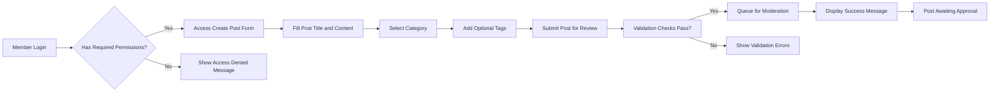
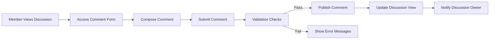
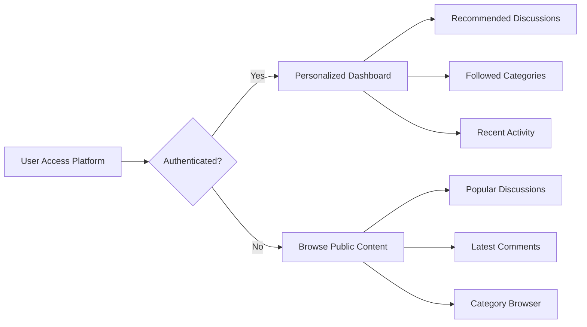
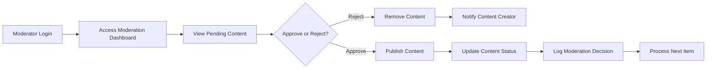

# Economic/Political Discussion Board Requirements Analysis

## 1. Service Overview

### Service Vision
THE Economic/Political Discussion Board SHALL provide a dedicated platform for meaningful discourse on economic policies and political issues, enabling informed citizens to engage in structured debates and discussions.

### Core Objectives
THE Economic/Political Discussion Board SHALL:
- Facilitate organized discussions on economic and political topics
- Enable content categorization by economic sectors and political domains
- Support user registration and profile management
- Implement a comment system for threaded discussions
- Provide moderation tools to maintain discourse quality
- Ensure accessibility for users with different technical backgrounds

### Target Audience
THE Economic/Political Discussion Board SHALL serve:
- Politically engaged citizens seeking informed discussion
- Economics students and professionals sharing insights
- Policy researchers requiring debate platforms
- Community members interested in public discourse
- Educators facilitating political and economic discussions

### Key Features
THE Economic/Political Discussion Board SHALL offer these primary features:
- Topic-based discussion forums
- User registration and authentication system
- Content creation and management tools
- Comment and reply functionality
- Multi-level user roles with appropriate permissions
- Content moderation workflow
- Search and categorization capabilities

## 2. Business Model

### Market Justification
WHEN citizens seek platforms for political and economic discourse, THE Economic/Political Discussion Board SHALL provide a structured environment that encourages respectful, informed debate without the sensationalism found on general social media platforms.

### Revenue Strategy
THE Economic/Political Discussion Board SHALL initially operate with the following revenue models:
- Freemium subscription tiers for enhanced features
- Targeted advertising within discussion categories
- Partnership revenue with educational institutions
- Premium membership for ad-free experience and extended profile options

### Growth Plan
THE Economic/Political Discussion Board SHALL achieve growth through:
- Community building with political and economic influencers
- Content partnerships with research institutions
- Referral programs encouraging user invitations
- Mobile application expansion for accessibility
- Integration with educational curriculum resources

### Success Metrics
THE Economic/Political Discussion Board SHALL measure success by:
- Monthly Active Users (MAU) target of 10,000 within first year
- Average session duration of 15+ minutes
- User retention rate of 60% monthly
- Content moderation efficiency with 95% response within 24 hours
- Community engagement score based on comments per discussion ratio

## 3. User Roles and Authentication

### Role Definitions

#### Guest User
THE Guest user role SHALL encompass all unauthenticated visitors who can:
- Browse public discussions and comments
- Search content by categories and keywords
- View user profiles and discussion statistics
- NOT create posts, comments, or manage content

#### Member User
THE Member user role SHALL include authenticated users who can:
- Create and submit new discussion posts
- Comment on existing discussions
- Edit and delete their own posts and comments within 24 hours
- Manage their profile information and preferences
- Report inappropriate content for moderation review
- Receive notifications for replies to their content

#### Moderator User
THE Moderator user role SHALL consist of trusted community members who can:
- Review and approve member-created content
- Edit or remove inappropriate posts and comments
- Suspend user accounts for policy violations
- Access moderation dashboard with content reports
- Create and manage discussion categories
- Communicate with administrators regarding platform policies

#### Administrator User
THE Administrator user role SHALL comprise system operators who can:
- Manage all user accounts including role assignment
- Configure system-wide settings and policies
- Access complete analytics and usage reports
- Create and modify core discussion categories
- Implement and update content guidelines
- Monitor platform performance and technical issues

### Authentication Flow Requirements
WHEN a user attempts to register, THE system SHALL require:
- Valid email address verification
- Password meeting security requirements (8+ characters with mixed case and numbers)
- Agreement to community guidelines
- Captcha verification to prevent automated registrations

WHEN a user submits login credentials, THE system SHALL:
- Validate credentials against stored user data
- Generate JWT token with 30-minute access expiration
- Create refresh token with 30-day expiration
- Set tokens in httpOnly cookies for security
- Redirect user to dashboard upon successful authentication

WHEN a user requests password reset, THE system SHALL:
- Send verification email with reset link
- Provide 24-hour window for password change
- Invalidate previous sessions upon password update

### Permission Matrix
| Action | Guest | Member | Moderator | Administrator |
|--------|-------|--------|-----------|---------------|
| View public discussions | ✅ | ✅ | ✅ | ✅ |
| Create discussion posts | ❌ | ✅ | ✅ | ✅ |
| Comment on discussions | ❌ | ✅ | ✅ | ✅ |
| Edit own content | ❌ | ✅ | ✅ | ✅ |
| Delete own content | ❌ | ✅ | ✅ | ✅ |
| Report inappropriate content | ❌ | ✅ | ✅ | ✅ |
| Approve/reject posts | ❌ | ❌ | ✅ | ✅ |
| Edit/delete any content | ❌ | ❌ | ✅ | ✅ |
| Suspend user accounts | ❌ | ❌ | ✅ | ✅ |
| Manage user roles | ❌ | ❌ | ❌ | ✅ |
| Configure system settings | ❌ | ❌ | ❌ | ✅ |
| Access complete analytics | ❌ | ❌ | ❌ | ✅ |

### Access Control Requirements
WHEN a guest attempts to create content, THE system SHALL redirect to login page.

WHEN a member attempts to access administrative features, THE system SHALL deny access with appropriate error message.

WHEN a moderator performs content management actions, THE system SHALL log all activities for audit purposes.

WHERE user authentication fails, THE system SHALL return HTTP 401 with error code AUTH_INVALID_CREDENTIALS.

## 4. Functional Requirements

### User Registration and Profile Management

THE system SHALL allow guest users to register accounts with email and password.

WHEN a user submits registration information, THE system SHALL validate:
- Email format conforms to RFC 5322 standard
- Password contains minimum 8 characters
- Password includes both uppercase and lowercase letters
- Password contains at least one numeric digit

THE system SHALL send email verification within 5 minutes of registration submission.

WHEN email verification link is clicked, THE system SHALL activate user account immediately.

THE system SHALL enable members to update their profile information including:
- Display name (3-30 characters)
- Bio description (maximum 500 characters)
- Notification preferences
- Discussion category interests

### Discussion Creation and Management

THE system SHALL allow members to create new discussion posts with:
- Title (10-200 characters)
- Content body (minimum 50 characters, maximum 10,000 characters)
- Category selection from predefined economic/political categories
- Optional tags (maximum 5 tags per post)

WHEN a member submits a new discussion post, THE system SHALL:
- Validate content meets minimum length requirements
- Check for prohibited content patterns
- Queue post for moderation approval
- Store draft version accessible only to creator

THE system SHALL organize discussions into these primary categories:
- Economic Policy
- Fiscal Policy
- Monetary Policy
- International Trade
- Healthcare Policy
- Education Policy
- Environmental Policy
- Social Issues
- Foreign Affairs
- Election Analysis

THE system SHALL support these additional content management features for members:
- Edit own posts within 24 hours of creation
- Delete own posts at any time
- Flag posts for policy violations
- Save favorite discussions for later reference

### Comment System

THE system SHALL enable members to comment on approved discussions with:
- Content body (minimum 1 character, maximum 2,000 characters)
- Reply functionality to existing comments
- Nested comment threading (maximum 5 levels deep)

WHEN a member submits a comment, THE system SHALL:
- Validate content length requirements
- Check for prohibited content patterns
- Immediately publish approved members' comments
- Queue first-time posters' comments for moderation

THE system SHALL provide comment sorting options:
- Chronological (newest first)
- Most replies
- Most upvoted
- Chronological by discussion thread

THE system SHALL enable members to manage their comments:
- Edit comments within 1 hour of posting
- Delete comments at any time
- Flag inappropriate comments from other users

### Content Organization

THE system SHALL implement search functionality that:
- Filters results across all discussions and comments
- Supports keyword searching in titles and content
- Allows category-based filtering
- Provides tag-based filtering
- Returns results instantly for common queries

THE system SHALL organize content through:
- Primary categories reflecting economic and political domains
- User-generated tags (maximum 10 characters per tag)
- Date-based sorting with newest content first
- Popularity metrics based on views and engagement

### Moderation Capabilities

THE system SHALL provide moderators with content review dashboard showing:
- Pending posts requiring approval
- Reported content from community members
- User violation history
- Statistical overview of community activity

WHEN content is flagged by users, THE system SHALL:
- Queue flagged content for moderator review
- Notify moderators within 1 hour of flagging
- Allow moderators 24 hours to make decision
- Automatically suspend content if multiple flags received

THE system SHALL enable administrators to:
- Review all moderation decisions
- Override moderator actions when necessary
- Define content policy guidelines
- Monitor platform health metrics

## 5. User Interaction Scenarios

### Member Posting Workflow

### Commenting Process

### Content Discovery

### Moderation Activities

## 6. Business Rules and Validation

### Content Guidelines

WHEN members create discussion posts, THE system SHALL validate that content:
- Contains minimum 50 characters in body
- Does not include explicit profanity or hate speech
- Remains relevant to economic or political topics
- Avoids personal attacks on other community members

THE system SHALL reject posts containing:
- Explicit sexual content or violence
- Direct personal information about non-public figures
- Copyrighted material without permission
- Commercial advertising or spam

### User Behavior Standards

THE system SHALL monitor user behavior including:
- Posting frequency to detect spam patterns
- Comment engagement to identify quality contributors
- Flagging history to identify problematic users
- Content approval ratio to measure community fit

WHEN users violate community guidelines, THE system SHALL:
- Issue first warning for minor infractions
- Suspend accounts after repeated violations
- Permanently ban users for severe policy breaches
- Allow appeal process for suspended accounts

### Economic Discussion Framework

THE system SHALL categorize economic discussions into these domains:
- Macroeconomics (inflation, GDP, unemployment)
- Microeconomics (markets, consumer behavior, business)
- Fiscal Policy (taxation, government spending)
- Monetary Policy (interest rates, central banking)
- International Economics (trade, globalization, currency)
- Labor Economics (employment, wages, working conditions)
- Development Economics (growth, poverty, inequality)
- Environmental Economics (sustainability, carbon pricing)

WHERE discussions fall outside economic/political scope, THE system SHALL require moderator review before publication.

### Political Discourse Protocols

THE system SHALL facilitate respectful political discourse by:
- Requiring evidence-based arguments in policy discussions
- Prohibiting personal attacks on political figures
- Encouraging civil disagreement through comment guidelines
- Supporting multi-perspective discussions through threading

WHEN political discussions include controversial topics, THE system SHALL:
- Require additional moderation scrutiny
- Provide fact-checking resources where available
- Encourage balanced perspective sharing
- Maintain neutrality in platform administration

## 7. Non-functional Requirements

### Performance Expectations

THE system SHALL load main discussion pages within 2 seconds under normal conditions.

WHEN users submit posts or comments, THE system SHALL process submissions and display confirmation within 3 seconds.

THE system SHALL support 1,000 concurrent users with response times under 5 seconds.

WHEN search queries are executed, THE system SHALL return results within 1 second for common terms.

### Security Measures

THE system SHALL encrypt all user passwords using bcrypt with salt.

WHEN transmitting authentication data, THE system SHALL use HTTPS exclusively.

THE system SHALL implement rate limiting to prevent brute force attacks:
- Maximum 5 login attempts per 15 minutes per IP
- Maximum 10 posts per hour per user
- Maximum 50 comments per hour per user

THE system SHALL log security events including:
- Failed login attempts
- Suspicious posting patterns
- Administrative actions
- Moderation decisions

### Compliance Standards

THE system SHALL comply with GDPR for European users by:
- Providing data export functionality
- Supporting account deletion requests
- Requiring explicit consent for data processing
- Implementing privacy-by-design principles

THE system SHALL maintain content archives for:
- Deleted posts (30 days)
- Suspended accounts (90 days)
- Moderation decisions (1 year)

### Scalability Considerations

THE system SHALL be designed to accommodate:
- User growth from 1,000 to 100,000 members
- Discussion volume from 100 to 10,000 monthly posts
- Comment threads expanding to thousands per post
- Category expansion from 10 to 100 topic areas

THE system SHALL support horizontal scaling through:
- Database partitioning by category
- Content caching for popular discussions
- Load balancing across multiple servers
- CDN integration for static assets