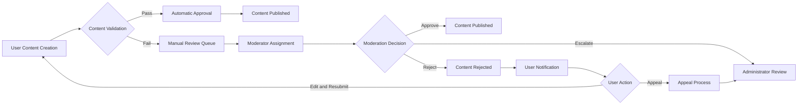
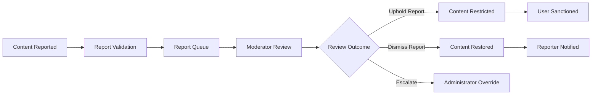

# Moderation System Requirements for ecoPolDiscussion Platform

## Moderation Workflow

### Overview
The moderation system provides tools for managing content quality and user behavior on the economic/political discussion board. It includes automated and manual processes for reviewing posts and comments, handling user reports, and maintaining community standards.

### Workflow Description
Users create content which flows through the moderation system based on platform settings and user privileges. Content visibility and status depend on moderation decisions and user roles.

### Content Lifecycle States
- **Draft**: Content being composed by user but not yet submitted
- **Pending Review**: Content submitted but not yet reviewed by moderators
- **Published**: Content approved and visible to appropriate audience
- **Flagged**: Content reported by users awaiting moderator review
- **Rejected**: Content that did not meet community standards
- **Archived**: Content removed from public view but retained for records
- **Deleted**: Content permanently removed from system

## Content Approval

### Automatic Approval Rules
WHEN a user with "member" role creates a post in a public discussion, THE system SHALL automatically approve the content for publication within 5 seconds.

WHEN a user with "member" role creates a comment on an already published post, THE system SHALL automatically approve the comment for publication within 3 seconds.

WHEN a user with "moderator" or "administrator" role creates any content, THE system SHALL automatically approve the content for publication within 2 seconds.

### Manual Review Requirements
WHERE the platform settings require all new posts to be manually reviewed, THE system SHALL place content in "pending review" state and notify moderators within 10 seconds of submission.

WHERE content contains keywords from the predefined filter list, THE system SHALL automatically flag the content and place it in "pending review" state regardless of user role.

WHEN content is flagged by the automatic system, THE system SHALL notify all online moderators with permission to review content within 15 seconds.

### Approval Process
THE system SHALL allow moderators to approve posts and comments with a single action.

THE system SHALL require moderators to provide a reason when rejecting content during the approval process.

WHEN a moderator approves pending content, THE system SHALL make that content visible to all appropriate users within 5 seconds.

WHEN a moderator rejects content, THE system SHALL notify the content creator of the rejection and reason within 10 seconds.

THE system SHALL allow administrators to override any moderation decision with proper justification.

### Content Visibility Rules
WHILE content is in "pending review" state, THE system SHALL only display it to the content creator and users with moderation privileges.

WHILE content is in "rejected" state, THE system SHALL only display it to the content creator and users with administrative privileges.

WHILE content is in "flagged" state, THE system SHALL maintain its current visibility but highlight it for moderator attention.

THE system SHALL allow users with "member" role or higher to view approved content in economic and political discussion categories.

## User Management

### User Status Management
THE system SHALL allow moderators to temporarily suspend user posting privileges for violations of community standards.

THE system SHALL require moderators to select from predefined suspension durations when suspending user accounts: 1 day, 3 days, 7 days, 30 days, or permanent.

WHEN a moderator suspends a user account, THE system SHALL notify the user via email (if verified) of the suspension reason and duration within 1 minute.

THE system SHALL automatically restore user posting privileges after the suspension duration has elapsed.

THE system SHALL allow administrators to permanently ban users from the platform.

WHEN an administrator bans a user, THE system SHALL immediately terminate all active sessions for that user.

### User Role Management
THE system SHALL allow administrators to change user roles between "member", "moderator", and "administrator".

WHEN an administrator changes a user's role, THE system SHALL update all permissions immediately and notify the user of the change.

THE system SHALL prevent administrators from changing their own role to "guest" or removing their administrative privileges without another administrator present.

### User Content Review
THE system SHALL allow moderators to review all content created by a specific user across all discussion categories.

THE system SHALL provide filtering options for reviewing user content by date range, content type (posts/comments), and moderation status.

THE system SHALL display a user's moderation history including all content decisions with timestamps.

## Reporting System

### Report Submission
THE system SHALL allow authenticated users to report posts and comments that violate community standards.

THE system SHALL require users submitting reports to select from predefined violation categories: spam, harassment, misinformation, hate speech, or other.

THE system SHALL limit guests to reporting only public content that clearly violates community standards.

WHEN a user submits a report, THE system SHALL acknowledge receipt with a confirmation message within 3 seconds.

### Report Management
THE system SHALL create a queue for all submitted reports accessible only to moderators.

THE system SHALL automatically prioritize reports based on severity and user reputation of the reporter.

THE system SHALL allow moderators to view the reported content, reporter information, and reason for report.

WHEN a moderator resolves a report, THE system SHALL record the resolution action, moderator who resolved it, and timestamp.

THE system SHALL notify the reporter of report resolution status when possible.

### Violation Tracking
THE system SHALL track the number of content violations per user and automatically escalate penalties based on recurrence.

WHEN a user accumulates 3 rejected content items within 30 days, THE system SHALL automatically suspend the user for 1 day.

WHEN a user accumulates 5 rejected content items within 60 days, THE system SHALL automatically suspend the user for 7 days.

WHEN a user accumulates 10 rejected content items within 90 days, THE system SHALL automatically suspend the user for 30 days.

IF a moderator determines that a user is deliberately attempting to violate community standards, THE system SHALL allow immediate escalation to permanent ban with administrator approval required.

## Role-Based Access Controls

### Guest User Permissions
THE system SHALL NOT allow guests to access the moderation dashboard or any administrative functions.

THE system SHALL allow guests to view public content that has been approved.

THE system SHALL restrict guests from submitting reports on content, but allow anonymous flagging through automatic systems.

### Member User Permissions
THE system SHALL allow members to submit reports on content that violates community standards.

THE system SHALL NOT allow members to access the moderation queue or resolve reports.

THE system SHALL allow members to view moderation status of their own content.

THE system SHALL allow members to appeal moderation decisions through a designated process.

### Moderator Permissions
THE system SHALL allow moderators to access the moderation dashboard and review queues.

THE system SHALL allow moderators to approve, reject, or flag content for administrator review.

THE system SHALL allow moderators to suspend users temporarily based on content violations.

THE system SHALL allow moderators to resolve user reports within their permission scope.

THE system SHALL NOT allow moderators to permanently ban users or change user roles.

THE system SHALL NOT allow moderators to access administrative settings or user management beyond suspensions.

### Administrator Permissions
THE system SHALL allow administrators full access to all moderation functions.

THE system SHALL allow administrators to permanently ban users and override any moderation decisions.

THE system SHALL allow administrators to change user roles at any level.

THE system SHALL allow administrators to access and modify all platform settings.

THE system SHALL allow administrators to view all reports and user violations.

THE system SHALL allow administrators to export audit logs for compliance purposes.

## Business Rules and Validation

### Content Review Workflow
WHEN a post or comment receives 3 or more flags from different users, THE system SHALL automatically place that content in the moderator review queue with high priority.

THE system SHALL prevent users from repeatedly flagging the same content.

WHERE content has been rejected more than twice by different moderators, THE system SHALL automatically escalate it for administrator review.

### Decision Consistency
THE system SHALL require at least one moderator to review content before it can be published when manual review is enabled.

THE system SHALL allow multiple moderators to review the same content but only apply the first decision that is executed.

WHEN a moderator is reviewing content, THE system SHALL lock that content for review to prevent multiple simultaneous moderations.

### Automated Moderation
THE system SHALL automatically flag content containing predefined prohibited words or phrases.

THE system SHALL apply automatic flags based on content patterns that match known spam or harassment indicators.

WHERE automated systems flag content, THE system SHALL still allow manual review by moderators before applying restrictions.

### User Notification Rules
WHEN a user's content is rejected, THE system SHALL send a notification explaining the reason using predefined categories.

WHEN a user is suspended, THE system SHALL send an email notification (if available) explaining the duration and reason for suspension.

THE system SHALL provide users with an appeals process when their content is rejected or their account is suspended.

THE system SHALL NOT notify content creators of individual user reports to protect reporter anonymity.

## Error Handling and Edge Cases

### Content Management Errors
IF a moderator attempts to approve content that has been deleted by the user, THE system SHALL display an error message indicating content is no longer available.

IF a user attempts to edit content that is currently under moderation review, THE system SHALL prevent editing and display a message that content is pending review.

IF a moderator tries to access content from a deleted account, THE system SHALL still allow access to maintain content integrity.

### System Performance
WHEN processing content moderation actions, THE system SHALL complete all operations within 5 seconds under normal load.

WHEN sending user notifications for moderation actions, THE system SHALL queue messages for delivery within 1 minute but not guarantee immediate delivery.

### Concurrent Access
IF multiple moderators attempt to access the same content for review simultaneously, THE system SHALL allow the first moderator to proceed and place others in a holding pattern with notification.

### Data Integrity
THE system SHALL maintain a permanent log of all moderation actions including user ID, content ID, action taken, timestamp, and moderator who performed the action.

IF a moderation decision needs to be reversed, THE system SHALL require an audit trail entry explaining the reason for reversal.

## Implementation Considerations

### Scalability Requirements
THE system SHALL support at least 10 concurrent moderators reviewing content during peak usage periods.

THE system SHALL process and queue user reports within 2 seconds regardless of volume.

THE system SHALL maintain moderation performance with up to 1 million content items in any combined status state.

### Audit and Compliance
THE system SHALL retain all moderation logs for a minimum of 2 years to comply with content regulation requirements.

THE system SHALL allow administrators to export moderation logs for compliance auditing.

THE system SHALL maintain anonymized statistics on moderation actions for community health analysis.

### Moderation Dashboard Features
THE system SHALL provide moderators with a dashboard showing:
- Pending content requiring review
- Recent reports from users
- User violation statistics
- Category-specific moderation queues
- Quick action buttons for common moderation tasks

WHEN a moderator accesses the dashboard, THE system SHALL display content prioritized by:
- Automatic flag severity
- Report count from different users
- Content age (older pending content gets higher priority)
- Category activity levels

### Appeal Process
THE system SHALL allow users to appeal moderation decisions through a dedicated form.

WHEN a user submits an appeal, THE system SHALL:
- Store the appeal with original content and moderation decision
- Assign the appeal to an administrator for review
- Notify the user that their appeal is being processed
- Provide a timeline of 3-5 business days for appeal resolution

THE system SHALL maintain separate logs for appeal submissions and resolutions.

### Category-Specific Moderation
THE system SHALL allow administrators to configure different moderation rules for economic and political categories.

WHERE political discussions become heated during election periods, THE system SHALL automatically apply additional review requirements.

WHEN economic discussions reference market-sensitive information, THE system SHALL flag them for expedited review.

### Performance Monitoring
THE system SHALL track moderation performance metrics including:
- Average time to moderate content
- Moderator agreement rates on similar content
- User appeal success rates
- Report resolution times

THE system SHALL generate weekly reports for administrators on moderation team performance.

> *Developer Note: This document defines business requirements only. All technical implementations (architecture, APIs, database design, etc.) are at the discretion of the development team.*