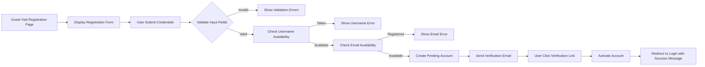
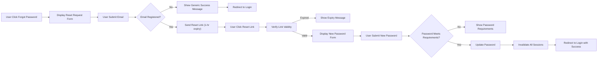
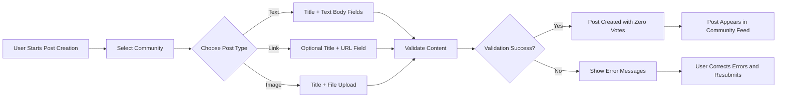
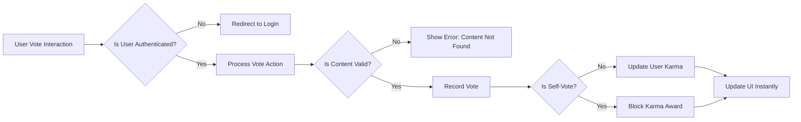
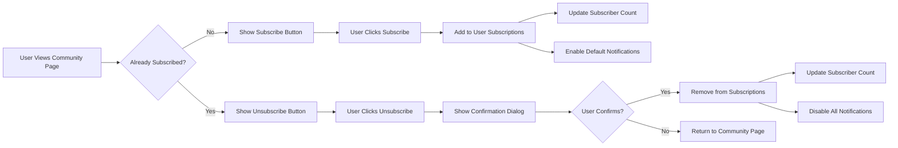

# Reddit-like Community Platform Requirements Analysis

## Service Overview

THE redditClone service SHALL provide users with a platform for community-driven content sharing and discussion similar to Reddit.

WHEN users access the platform, THE system SHALL present a familiar interface with communities (subreddits), user-generated posts, and threaded discussions.

WHERE users seek information, share content, or engage in discussions, THE redditClone service SHALL facilitate these activities through a structured community organization system.

THE system SHALL enable registered users to create and participate in topic-specific communities, fostering engagement around shared interests.

WHILE maintaining content quality and community standards, THE system SHALL allow for user-driven moderation through upvotes, downvotes, and reporting mechanisms.

### Business Justification

#### Why This Service Exists

THE redditClone service SHALL address the need for decentralized discussion platforms where users can share and discover content on specific topics organized in communities.

WHEN users desire focused discussions without platform restrictions, THE service SHALL provide independent community spaces for any legitimate topic area.

THE platform SHALL differentiate itself from existing social media by organizing content primarily through user-submitted posts and community-driven quality control.

WHERE users want to participate in knowledge-sharing communities, THE redditClone service SHALL provide an accessible platform with familiar Reddit-style interactions.

#### Market Opportunity

THE service SHALL target users who value community-based content curation and threaded discussions over traditional social media feeds.

WHEN existing platforms implement restrictive content policies, THE redditClone service SHALL offer alternative community spaces for discourse.

THE system SHALL attract community moderators seeking tools to manage their own discussion spaces independently.

WHERE users engage with Reddit but seek alternatives, THE platform SHALL offer a similar experience with potentially different moderation philosophies.

#### Community Growth Strategy

THE platform SHALL encourage organic growth through user-created communities and content sharing.

WHEN users find value in specific communities, THE system SHALL facilitate easy sharing of those communities to attract new members.

THE service SHALL implement a karma system to incentivize quality contributions and community participation.

WHERE users demonstrate expertise in certain topics, THE platform SHALL highlight their contributions to establish credibility within communities.

### Core Value Proposition

#### Community-Centric Organization

THE redditClone service SHALL organize all content around user-created communities (subreddits), with each community focused on a specific topic or interest.

WHEN users want to engage with content about a particular subject, THE system SHALL allow them to subscribe to relevant communities for a curated experience.

THE platform SHALL differentiate content by community, ensuring users can easily navigate to topics of interest.

Where users create new communities, THE system SHALL provide standard templates and tools for community setup.

#### Content Democratization

THE system SHALL allow all registered users to create posts containing text, links, or images within appropriate communities.

WHEN users submit content, THE platform SHALL enable community voting (upvotes/downvotes) to determine content visibility and quality.

While maintaining content standards, THE service SHALL minimize editorial oversight to allow community-driven content curation.

THE platform SHALL support nested commenting to enable detailed discussions and responses to specific points.

#### User Recognition System

THE redditClone service SHALL track user contributions through a karma system that reflects community approval of posts and comments.

WHEN users receive upvotes on their contributions, THE system SHALL increment their karma score to recognize valuable participation.

THE platform SHALL display user karma on public profiles to establish reputation within the community.

Where users consistently contribute quality content, THE system SHALL make their high karma status visible to enhance credibility.

#### Flexible Content Discovery

THE system SHALL enable sorting of posts by multiple criteria including hot, new, top, and controversial rankings.

WHEN users browse communities, THE platform SHALL provide algorithmic sorting that highlights engaging content based on community interaction.

THE service SHALL allow users to customize their experience through community subscriptions that create personalized content feeds.

WHERE users seek trending discussions, THE platform SHALL calculate "hot" post rankings based on recent engagement levels.

### Success Metrics

#### User Engagement Metrics

THE platform SHALL measure daily active users (DAU) as the primary indicator of service health.

WHEN users access the service, THE system SHALL track posts created, comments submitted, and votes cast to calculate engagement levels.

THE service SHALL define highly engaged users as those who create posts, comment, and vote regularly across multiple communities.

WHERE communities maintain active discussions, THE platform SHALL measure comment thread depth and response rates.

#### Community Growth Metrics

THE system SHALL track total number of communities created as a measure of platform adoption across diverse interests.

WHEN users subscribe to communities, THE platform SHALL monitor subscription growth rates to identify popular topics.

THE service SHALL measure average posts per community per day to determine community vitality.

Where communities attract new members, THE system SHALL track subscriber growth trends for each community.

#### Content Quality Metrics

THE platform SHALL evaluate content quality through karma distributions and voting patterns.

WHEN users flag inappropriate content, THE system SHALL track report resolution times and community satisfaction with moderation.

THE service SHALL measure user retention by tracking how often contributors return to engage with their content.

While posts age, THE system SHALL monitor how voting patterns change to inform "top" content algorithms.

#### Platform Health Metrics

THE redditClone service SHALL monitor average session duration to assess user engagement depth.

WHEN users browse content, THE platform SHALL track page load satisfaction through user interaction timing.

THE system SHALL measure bounce rates and return visits as indicators of content relevance and platform usability.

Where technical issues occur, THE service SHALL track user abandonment rates during critical workflows like registration or posting.

## User Roles

THE Reddit-like community platform SHALL support four distinct user roles, each with clearly defined capabilities and permissions to ensure proper access control and user experience.

### Guest Users
Guest users represent unauthenticated visitors to the platform who have limited access to system features.

THE guest role SHALL allow users to:
- Browse public communities and their content
- View posts and comments without interacting
- Search for communities by name or description
- Register for a new account
- Access the login interface

WHEN a guest attempts to perform restricted actions, THE system SHALL redirect them to the login page with an appropriate error message.

### Member Users
Member users are authenticated participants who form the core community of the platform.

THE member role SHALL allow users to:
- Create text, link, and image posts in communities they have access to
- Upvote and downvote posts and comments
- Create comments on posts
- Reply to comments with nested replies
- Subscribe and unsubscribe from communities
- View and edit their own user profile
- Report inappropriate content
- Access all public communities and their content

WHEN a member attempts to access a restricted community, THE system SHALL verify their subscription status or show an appropriate access denied message.

### Moderator Users
Moderators are trusted community members with additional management capabilities for specific communities.

THE moderator role SHALL inherit all member permissions and additionally allow users to:
- Remove posts and comments from communities they moderate
- Ban and unban users from communities they moderate
- Edit community settings and descriptions
- Review reported content within communities they moderate
- Approve or reject posts in communities with moderation requirements

WHEN a moderator performs a moderation action, THE system SHALL log the action with timestamp and user identifier for audit purposes.

### Admin Users
Administrators have system-wide management capabilities and oversight responsibilities.

THE admin role SHALL inherit all member permissions and additionally allow users to:
- Manage all communities regardless of membership
- Access and review all reported content
- Ban and unban users from the entire system
- Remove any post or comment across all communities
- Configure system settings and policies
- Access administrative dashboards and reports

WHEN an admin performs a system-level action, THE system SHALL log the action with timestamp, user identifier, and affected entities for audit purposes.

## Authentication Requirements

### User Registration Flow

WHEN a guest attempts to register, THE system SHALL collect the following information:
- Email address (required, unique)
- Username (required, unique, 3-20 characters, alphanumeric with underscores allowed)
- Password (required, minimum 8 characters with at least one uppercase, lowercase, and number)

WHEN a guest submits registration information, THE system SHALL validate inputs and provide appropriate error messages for:
- Duplicate email address
- Duplicate username
- Password not meeting complexity requirements
- Malformed email address

THE system SHALL send a verification email to new registrants containing a one-time verification link.

WHEN a user clicks the verification link within 24 hours, THE system SHALL activate their account and redirect them to the login page.

IF a user does not verify their email within 24 hours, THE system SHALL require them to request a new verification email through the login process.

### Login Process

WHEN a guest attempts to login with valid credentials, THE system SHALL validate the email/password combination and create an authenticated session.

WHEN a guest attempts to login with invalid credentials, THE system SHALL display an appropriate error message and increment failed login attempt counter.

IF failed login attempts exceed 5 within a 15-minute window, THE system SHALL temporarily lock the account for 30 minutes.

THE system SHALL provide a "forgot password" function that sends a password reset link to the user's verified email address.

WHEN a user successfully logs in, THE system SHALL redirect them to their personalized community feed or the homepage.

### Password Management

WHEN a user requests a password reset, THE system SHALL send a one-time password reset link valid for 2 hours.

THE system SHALL enforce password complexity requirements during reset:
- Minimum 8 characters
- At least one uppercase letter
- At least one lowercase letter
- At least one number

WHEN a user successfully changes their password, THE system SHALL invalidate all existing sessions except the current one.

THE system SHALL NOT allow reusing the previous 5 passwords when changing passwords.

### Session Handling

THE system SHALL maintain user sessions using JWT tokens.

WHEN a user logs in, logs out, or registers, THE system SHALL create or destroy sessions appropriately.

THE system SHALL automatically log out users after 30 days of inactivity.

THE system SHALL provide a "logout from all devices" option in user security settings.

## Permission Matrix

THE system SHALL implement role-based access control using the following permission matrix:

| Action | Guest | Member | Moderator | Admin |
|--------|-------|--------|-----------|-------|
| Browse public communities | ✅ | ✅ | ✅ | ✅ |
| Create posts | ❌ | ✅ | ✅ | ✅ |
| Comment on posts | ❌ | ✅ | ✅ | ✅ |
| Vote on content | ❌ | ✅ | ✅ | ✅ |
| Subscribe to communities | ❌ | ✅ | ✅ | ✅ |
| Edit own profile | ❌ | ✅ | ✅ | ✅ |
| Report content | ❌ | ✅ | ✅ | ✅ |
| Remove own posts/comments | ❌ | ✅ | ✅ | ✅ |
| Moderate community content | ❌ | ❌ | ✅ | ✅ |
| Ban community users | ❌ | ❌ | ✅ | ✅ |
| Edit community settings | ❌ | ❌ | ✅ | ✅ |
| Review community reports | ❌ | ❌ | ✅ | ✅ |
| Remove any post/comment | ❌ | ❌ | ❌ | ✅ |
| Ban/unban any user | ❌ | ❌ | ❌ | ✅ |
| Access system reports | ❌ | ❌ | ❌ | ✅ |
| Manage all communities | ❌ | ❌ | ❌ | ✅ |

WHEN a user attempts an action not permitted by their role, THE system SHALL deny access and display an appropriate permission error message.

## JWT Specifications

THE system SHALL implement authentication using JSON Web Tokens (JWT).

### Token Structure

THE access token SHALL have a payload containing:
- User identifier (unique)
- Role identifier (matching defined roles)
- Permissions array (based on role)
- Issued at timestamp
- Expiration timestamp

THE refresh token SHALL contain:
- User identifier (unique)
- Issued at timestamp
- Expiration timestamp

### Expiration Policies

THE access token SHALL expire after 30 minutes of issuance.

THE refresh token SHALL expire after 30 days of issuance.

WHEN a user's access token expires, THE system SHALL use the refresh token to automatically generate a new access token without requiring re-authentication.

### Storage Recommendations

THE system SHALL store JWT tokens in httpOnly cookies for enhanced security.

THE system SHALL set cookie security flags appropriately (Secure, SameSite) based on deployment environment.

WHEN a user logs out, THE system SHALL destroy both access and refresh tokens in client storage.

## User Registration and Login

### User Registration Flow

#### Registration Overview
Users must be able to create accounts on the platform to access features such as posting, commenting, voting, and subscribing to communities. Registration shall be straightforward but secure.

#### Registration Process Requirements

WHEN a guest accesses the registration page, THE system SHALL display a form requesting username, email address, and password.

WHEN a guest submits registration information, THE system SHALL validate all input fields according to the following rules:
- Username SHALL contain 3-20 characters including letters, numbers, underscores, and hyphens only
- Email SHALL be in valid email format (user@domain.extension)
- Password SHALL be at least 8 characters long and include at least one uppercase letter, one lowercase letter, and one number

IF submitted username already exists in the system, THEN THE system SHALL display error message "Username already taken. Please choose another."

IF submitted email is already registered, THEN THE system SHALL display error message "Email address already registered. Please use a different email or try logging in."

WHEN registration data passes validation, THE system SHALL create a new user account in "pending" state and send a verification email.

WHEN a user clicks the verification link in email, THE system SHALL activate their account and redirect to login page with success message.

#### Guest Access Restrictions

WHILE in unauthenticated state, THE system SHALL allow guests to browse public communities and posts.

WHEN a guest attempts to create a post, THE system SHALL redirect to registration/login page with message "You need to be logged in to create posts."

WHEN a guest attempts to vote on content, THE system SHALL redirect to registration/login page with message "You need to be logged in to vote."

WHEN a guest attempts to comment on posts, THE system SHALL redirect to registration/login page with message "You need to be logged in to comment."

### Login Process

#### Authentication Mechanics

WHEN a user accesses the login page, THE system SHALL display a form requesting email and password.

WHEN valid credentials are submitted, THE system SHALL authenticate the user and create a session.

IF email is not registered in the system, THEN THE system SHALL display error message "No account found with this email address."

IF password does not match the stored hash for the email, THEN THE system SHALL display error message "Incorrect password. Please try again."

WHEN authentication succeeds, THE system SHALL redirect the user to their home feed.

#### Session Creation Requirements

THE system SHALL create a new session with JWT token upon successful authentication.

Each session SHALL include user identifier, role information, and permissions in the token payload.

THE system SHALL set session expiration to 30 days for "Remember Me" selections and 24 hours otherwise.

#### Account Status Validation

IF a user attempts to log in to an account that has not been verified, THEN THE system SHALL display message "Please verify your email address before logging in."

IF a user attempts to log in to an account that has been banned, THEN THE system SHALL display message "This account has been suspended. Please contact support for assistance."

### Password Management

#### Password Reset Process

WHEN a user selects "Forgot Password" on login page, THE system SHALL display a form requesting email address.

WHEN a valid registered email is submitted, THE system SHALL send a password reset link to that address with 1-hour expiration.

IF the requested email is not registered, THEN THE system SHALL still display success message to prevent email discovery attacks.

WHEN a user clicks a valid password reset link, THE system SHALL display a form to enter new password with validation requirements.

WHEN new password is submitted successfully, THE system SHALL update the user's password and invalidate all existing sessions.

#### Password Change Requirements

WHEN an authenticated user accesses account settings, THE system SHALL provide option to change password.

IF a user requests password change, THEN THE system SHALL require current password verification before allowing update.

WHEN a user provides current password and valid new password, THE system SHALL update their password and maintain session.

IF current password verification fails, THEN THE system SHALL display error message "Current password is incorrect."

#### Password Security Rules

THE system SHALL enforce the following password requirements:
- Minimum 8 characters in length
- At least one uppercase letter (A-Z)
- At least one lowercase letter (a-z)
- At least one numerical digit (0-9)
- Optional special characters (!@#$%^&* etc.)

THE system SHALL NOT impose requirements such as:
- Mandatory special characters
- Password expiration dates
- Password history restrictions

### Session Handling

#### Session Management Requirements

WHEN a user successfully authenticates, THE system SHALL create a new session with JWT token stored client-side.

WHEN a user accesses any protected resource, THE system SHALL validate their session token before granting access.

IF a session token has expired, THEN THE system SHALL redirect to login page with message "Please log in again."

WHEN a user selects "Logout", THE system SHALL invalidate the current session and delete all session cookies.

#### Cross-Device Session Handling

THE system SHALL allow users to maintain multiple concurrent sessions (e.g., desktop and mobile).

WHEN a user changes password, THE system SHALL invalidate all sessions except the one used for password change.

WHERE a user requests to "Logout from all devices", THE system SHALL invalidate all sessions for that user.

#### Session Security

THE system SHALL use httpOnly and secure flags for all session cookies where cookies are utilized.

THE system SHALL set JWT tokens to expire after 24 hours for standard sessions or 30 days with "Remember Me".

IF a user account is banned or suspended, THE system SHALL immediately invalidate all active sessions.

IF a session is inactive for more than 30 days, THEN THE system SHALL automatically invalidate that session.

#### Account Recovery Limitations

THE system SHALL limit password reset requests to 5 per hour per email address to prevent abuse.

THE system SHALL limit account registration attempts to 10 per IP address per day to prevent spam.

## Community Management

### Community Creation

#### Core Community Creation Functions

WHEN a member navigates to the "Create Community" page, THE system SHALL display a form requesting community name, description, and type.

WHEN a member submits valid community creation information, THE system SHALL create a new community with the member automatically assigned as the first moderator.

THE system SHALL validate that community names contain only alphanumeric characters, hyphens, and underscores.

THE system SHALL restrict community names to between 3 and 21 characters in length.

WHEN a user attempts to create a community with an already-existing name, THE system SHALL reject the request and display an error message indicating the name is taken.

WHEN a member successfully creates a community, THE system SHALL redirect them to the new community's main page.

WHEN a guest attempts to create a community, THE system SHALL redirect them to the login page with a notice that community creation requires authentication.

#### Community Properties

THE system SHALL store the following properties for each community:
- Unique identifier (UUID format)
- Name (unique across the platform)
- Description (up to 500 characters)
- Creation timestamp
- Community type (public, private, or restricted)
- Subscriber count
- Rules text (up to 10000 characters)
- Sidebar content (up to 10000 characters)
- Banner image (URL reference)
- Icon image (URL reference)

### Community Settings

#### Community Configuration Options

WHERE a community exists, THE system SHALL allow moderators to configure the following settings:
- Community description (text up to 500 characters)
- Community rules (text up to 10000 characters)
- Sidebar content (text up to 10000 characters)
- Community type (public, private, or restricted)
- Banner image upload
- Icon image upload

WHERE a community moderator updates settings, THE system SHALL save the changes immediately and reflect them on the community page within 2 seconds.

THE system SHALL validate that any uploaded images are in JPEG, PNG, or GIF format and do not exceed 5MB in size.

IF a community moderator attempts to upload an image exceeding 5MB, THEN THE system SHALL reject the upload and display an error message.

IF a community moderator attempts to save settings with invalid data formats, THEN THE system SHALL reject the changes and highlight the problematic fields.

#### Community Types

THE system SHALL support three community types with distinct access rules:
- Public: Anyone can view, join, and participate
- Private: Users must be approved by moderators to join and participate
- Restricted: Anyone can view, but only approved members can participate in posting or commenting

WHEN a community is set to private, THE system SHALL require users to request membership before they can view content.

WHEN a community is set to restricted, THE system SHALL allow guests to view posts but require membership to post or comment.

### Moderation Tools

#### Moderator Permissions

WHERE a user is a community moderator, THE system SHALL grant them these permissions:
- Approve or reject membership requests (for private/restricted communities)
- Remove any post or comment from their community
- Ban or unban users from the community
- Edit community settings including description, rules, type, and images
- Appoint other moderators from community members
- Create and manage community flair for users and posts

WHERE a user is not a moderator, THE system SHALL deny access to moderation tools and display appropriate error messages.

WHEN a moderator removes a post or comment, THE system SHALL log the action with the moderator's identifier and timestamp.

WHEN a moderator bans a user, THE system SHALL immediately prevent that user from posting or commenting in the community.

WHEN a moderator unbans a user, THE system SHALL restore their ability to post and comment within 5 seconds.

#### Administrative Override

WHERE a user is an admin, THE system SHALL grant them full moderation capabilities across ALL communities regardless of community-specific permissions.

WHEN an admin performs moderation actions, THE system SHALL log these actions with appropriate administrator identification.

### Community Discovery

#### Community Listing

THE system SHALL display communities in lists organized by categories including "most popular", "newest", and "trending".

THE system SHALL define popular communities as those with the highest subscriber count.

THE system SHALL define trending communities as those with the highest recent activity (posts and comments in last 24 hours).

WHEN a user browses community listings, THE system SHALL present 20 communities per page.

THE system SHALL allow users to search for communities by name or description keywords.

WHEN a user searches for communities, THE system SHALL return results sorted by relevance within 3 seconds.

#### Community Rules Display

THE system SHALL prominently display community rules on the community's main page.

THE system SHALL limit community rules text to 10000 characters maximum.

WHEN community rules are updated, THE system SHALL display the changes immediately to all users viewing the community.

### Business Rules and Validation

#### Community Naming Rules

THE system SHALL enforce that community names:
- Begin with an alphabetic character
- Contain only alphanumeric characters, hyphens, and underscores
- Range between 3 and 21 characters in length
- Are unique across the entire platform

WHEN a user attempts to create a community with invalid naming characters, THE system SHALL reject the request and display an error message listing valid character types.

WHEN a user attempts to create a community with a name shorter than 3 characters or longer than 21 characters, THE system SHALL reject the request and specify the valid length range.

#### Content Validation

THE system SHALL validate that community descriptions are not longer than 500 characters.

THE system SHALL validate that sidebar content is not longer than 10000 characters.

THE system SHALL validate that community rules text is not longer than 10000 characters.

### Error Handling Scenarios

#### Creation Failures

IF a user submits a community creation request with a name that already exists, THEN THE system SHALL display an error message stating "A community with this name already exists. Please choose another name."

IF a user submits a community creation request with invalid characters in the name, THEN THE system SHALL display an error message stating "Community names can only contain letters, numbers, hyphens, and underscores."

IF a user submits a community creation request with a name outside the valid length range, THEN THE system SHALL display an error message stating "Community names must be between 3 and 21 characters long."

IF a guest attempts to access community creation tools, THEN THE system SHALL redirect them to the login page with a message stating "You must be logged in to create a community."

#### Settings Validation Errors

IF a moderator attempts to save a community description exceeding 500 characters, THEN THE system SHALL reject the changes and highlight the description field with an error message.

IF a moderator attempts to save community rules exceeding 10000 characters, THEN THE system SHALL reject the changes and display an error message indicating the character limit.

IF a moderator attempts to save sidebar content exceeding 10000 characters, THEN THE system SHALL reject the changes and display an error message indicating the character limit.

#### Image Upload Errors

IF a user attempts to upload an image in an unsupported format, THEN THE system SHALL reject the upload and display an error message listing accepted formats (JPEG, PNG, GIF).

IF a user attempts to upload an image exceeding 5MB in size, THEN THE system SHALL reject the upload and display an error message stating "Image files must be under 5MB in size."

IF a user attempts to upload an image that fails server-side validation, THEN THE system SHALL reject the upload and display a generic error message about upload problems.

#### Permission Errors

IF a non-moderator attempts to access moderation tools, THEN THE system SHALL deny access with an error message stating "You must be a community moderator to access these tools."

IF a moderator attempts to ban themselves from their own community, THEN THE system SHALL prevent the action and display an error message.

IF a moderator attempts to appoint another moderator who is not a community member, THEN THE system SHALL reject the request and display an error message.

## Content Posting System

### Post Types Overview

THE redditClone platform SHALL support three distinct types of posts that users can submit to communities: text posts, link posts, and image posts.

#### Text Posts
Text posts SHALL allow users to submit written content with a title and body text. The body text SHALL support plain text formatting only (no HTML or markdown).

#### Link Posts
Link posts SHALL require a URL and MAY include an optional title. The system SHALL validate that the URL follows a proper web address format (http:// or https:// protocol).

#### Image Posts
Image posts SHALL accept image uploads and SHALL require a title. Images SHALL be validated for format (JPEG, PNG, GIF) and size limitations.

### Content Validation Requirements

WHEN a user submits any type of post, THE system SHALL validate all required fields before allowing publication.

#### Universal Post Validation
ALL posts SHALL require:
- A community selection from existing communities
- A title with minimum 1 character and maximum 300 characters
- Proper user authentication (guests SHALL NOT be allowed to post)

#### Text Post Validation
WHEN a user creates a text post, THE system SHALL:
- Validate that the title contains 1-300 characters
- Validate that the body text contains 1-40,000 characters
- Prevent submission if either field is empty or exceeds limits

#### Link Post Validation
WHEN a user creates a link post, THE system SHALL:
- Validate that the URL is properly formatted with http:// or https:// protocol
- Validate that the URL does not exceed 2,000 characters
- Allow optional title (1-300 characters) 
- Prevent submission if URL is empty or malformed

#### Image Post Validation
WHEN a user creates an image post, THE system SHALL:
- Validate that the uploaded file is in JPEG, PNG, or GIF format
- Validate that the image file size does NOT exceed 10MB
- Validate that the title contains 1-300 characters
- Prevent submission if title is empty or image fails format/size validation

### Post Creation Flow

#### General Post Creation Process
WHEN a member creates a post, THE system SHALL follow this sequence:

1. User navigates to "Create Post" interface
2. User selects target community from subscribed communities
3. User selects post type (text, link, or image)
4. User fills required fields for selected post type
5. System validates all inputs
6. IF validation passes, THEN post is created with default values:
   - Initial upvotes/downvotes set to zero
   - Created timestamp set to current time
   - User karma unchanged until first vote
   - Post status set to "published"
7. IF validation fails, THEN appropriate error messages SHALL be displayed

#### Community Selection
THE system SHALL display a dropdown list of communities the user has subscribed to. Users SHALL be able to search through this list if they have subscribed to many communities.

#### Content Input
THE system SHALL provide appropriate input fields based on post type:
- Text posts: Title field + large text area for body content
- Link posts: Title field (optional) + URL input field
- Image posts: Title field + file upload component

### Post Editing Capabilities

#### Editing Permissions
THE system SHALL allow members to edit their own posts within 24 hours of creation. After 24 hours, posts SHALL become locked for editing.

#### Editable Fields by Post Type
WHEN a user edits their post, THE system SHALL allow modification of:

##### Text Posts
- Title (1-300 characters)
- Body text (1-40,000 characters)

##### Link Posts
- Title only (1-300 characters)
- URL SHALL NOT be editable after post creation

##### Image Posts
- Title only (1-300 characters)
- Image SHALL NOT be editable after post creation

#### Edit Validation
THE system SHALL re-validate all editable fields when a user submits changes to a post, following the same validation rules as post creation.

#### Edit History
THE system SHALL maintain a record that a post has been edited but SHALL NOT show detailed edit history to users. Edited posts SHALL display a simple "Edited" indicator.

### Business Rules and Constraints

#### Rate Limiting
THE system SHALL limit users to posting no more than 10 posts per hour to prevent spam behavior.

#### Content Moderation
WHERE a community has moderation enabled, THE system SHALL place new posts in a "pending review" state until approved by a moderator.

#### Duplicate Prevention
THE system SHALL prevent users from submitting identical content (same URL or same text body) to the same community within 24 hours.

#### Flair and Tags
THE system SHALL support optional post flairs/tags that communities can define. Users SHALL be able to select from community-defined flairs during post creation.

#### NSFW Content
THE system SHALL allow communities to be marked as NSFW. Posts in NSFW communities SHALL be tagged accordingly and hidden by default from non-subscribers.

### Error Handling Scenarios

#### Validation Errors
IF a user submits a post with invalid content, THEN the system SHALL:
- Display specific error messages for each failed validation
- Preserve user input so they can correct errors without re-entering everything
- Highlight the problematic fields visually

#### Authentication Errors
IF an unauthenticated user attempts to create a post, THEN the system SHALL redirect them to the login page with a message indicating authentication is required.

#### Community Access Errors
IF a user attempts to post in a community they are not subscribed to, THEN the system SHALL display an error message: "You must subscribe to this community before posting."

#### Upload Errors
IF a user attempts to upload an image that exceeds size limits or has unsupported format, THEN the system SHALL display message: "Image must be in JPEG, PNG, or GIF format and under 10MB."

#### Rate Limit Errors
IF a user exceeds posting rate limits, THEN the system SHALL display message: "You have reached the hourly posting limit. Please wait before creating more posts."

#### Edit Timeout Errors
IF a user attempts to edit a post more than 24 hours after creation, THEN the system SHALL display message: "Posts can only be edited within 24 hours of creation."

## Voting System

### Core Voting Functions
The voting system enables users to express their approval or disapproval of posts and comments through upvotes and downvotes, which directly affect content visibility and user reputation scores.

### Post Voting Behavior
WHEN a member clicks the upvote button on a post, THE system SHALL increase the post's vote score by 1
WHEN a member clicks the downvote button on a post, THE system SHALL decrease the post's vote score by 1
WHEN a member clicks an already selected vote button on a post, THE system SHALL remove that vote and reset the button to neutral state
WHEN a member changes a previous vote on a post, THE system SHALL update the post's vote score accordingly (from +1 to -1 or vice versa)

### Comment Voting Behavior
WHEN a member clicks the upvote button on a comment, THE system SHALL increase the comment's vote score by 1
WHEN a member clicks the downvote button on a comment, THE system SHALL decrease the comment's vote score by 1
WHEN a member clicks an already selected vote button on a comment, THE system SHALL remove that vote and reset the button to neutral state
WHEN a member changes a previous vote on a comment, THE system SHALL update the comment's vote score accordingly (from +1 to -1 or vice versa)

### User Interface States
THE system SHALL display three distinct visual states for voting buttons:
- Neutral state (default appearance)
- Upvoted state (visually distinct to show user has upvoted)
- Downvoted state (visually distinct to show user has downvoted)

### Vote Visibility
THE system SHALL display the current vote score for each post and comment publicly
THE system SHALL NOT display which specific users have voted on content
THE system SHALL show the user their own voting choices on content they have interacted with

### Vote Recording
WHEN a member votes on a post or comment, THE system SHALL record:
- The voter's user ID
- The content ID (post or comment)
- The vote type (upvote or downvote)
- The timestamp of the vote action
- The previous vote state (if any)

### Vote Data Association
THE system SHALL associate each vote with exactly one piece of content (either a post or comment)
THE system SHALL associate each vote with exactly one user
THE system SHALL track both the current vote score and individual user voting actions

### Vote Modification Tracking
WHEN a member changes their vote on content, THE system SHALL update their previous vote record rather than creating a new one
WHEN a member removes their vote on content, THE system SHALL mark the vote record as nullified with a timestamp

### Vote Consistency
THE system SHALL prevent users from casting multiple votes on the same content
THE system SHALL maintain atomic operations for vote changes to prevent race conditions
THE system SHALL ensure vote counts accurately reflect the difference between upvotes and downvotes

### Post Karma Calculation
WHEN a member's post receives an upvote, THE system SHALL increase that member's post karma score by 1
WHEN a member's post receives a downvote, THE system SHALL decrease that member's post karma score by 1
WHEN a member's post has a vote removed, THE system SHALL adjust the member's post karma score accordingly

### Comment Karma Calculation
WHEN a member's comment receives an upvote, THE system SHALL increase that member's comment karma score by 1
WHEN a member's comment receives a downvote, THE system SHALL decrease that member's comment karma score by 1
WHEN a member's comment has a vote removed, THE system SHALL adjust the member's comment karma score accordingly

### Total Karma Calculation
THE system SHALL calculate a member's total karma as the sum of their post karma and comment karma scores
THE system SHALL update total karma in real-time as individual post and comment votes are modified

### Karma Visibility
THE system SHALL display a member's total karma score on their public profile
THE system SHALL display a member's post karma score on their public profile
THE system SHALL display a member's comment karma score on their public profile
THE system SHALL update karma scores instantly in the user interface when votes occur

### Self-Voting Restriction
THE system SHALL NOT award karma points to users who vote on their own posts or comments
THE system SHALL prevent users from voting on their own content

### Authentication Requirements
WHEN a guest attempts to vote on a post, THE system SHALL redirect them to the login page
WHEN a guest attempts to vote on a comment, THE system SHALL redirect them to the login page

### Rate Limiting
THE system SHALL limit individual members to 100 voting actions per hour to prevent abuse
WHEN a member exceeds the hourly voting limit, THE system SHALL prevent further votes and display an appropriate error message

### Vote Reversal Restrictions
THE system SHALL allow members to change or remove their votes at any time while the content exists
THE system SHALL NOT allow vote changes on deleted or removed content

### Moderator and Admin Voting
WHERE a moderator role is applied, THE system SHALL allow voting on all community content following the same rules as members
WHERE an admin role is applied, THE system SHALL allow voting on all community content following the same rules as members
THE system SHALL NOT give moderators or admins special voting privileges beyond standard users

### Community Restrictions
WHEN a community is set to "private" mode, THE system SHALL continue allowing voting for subscribed members
WHEN content is removed by moderators, THE system SHALL disable voting on that content
WHEN content is deleted by the author, THE system SHALL disable voting on that content

### Invalid Content Handling
WHEN a user attempts to vote on non-existent content, THE system SHALL return an error message "Content not found"
WHEN a user attempts to vote on content in a non-existent community, THE system SHALL return an error message "Community not found"

### Concurrent Vote Handling
WHEN multiple vote actions occur simultaneously on the same content, THE system SHALL process them sequentially to ensure data integrity

### System Failure Handling
IF a vote action fails to record due to system issues, THEN THE system SHALL display an error message "Unable to process vote. Please try again."
IF a vote action fails due to network issues, THEN THE system SHALL display an error message "Network connection failed. Please check your connection and try again."

### Vote Processing
THE system SHALL process individual vote actions and update displayed scores within 1 second
THE system SHALL update karma scores in user profiles within 1 second of vote actions

### Vote History Retrieval
THE system SHALL retrieve a user's voting history for their profile display within 3 seconds
THE system SHALL calculate content vote scores for sorting algorithms within 100 milliseconds

## Nested Commenting System

### Comment Creation

#### Core Commenting Functionality
THE commenting system SHALL allow authenticated members to create comments on posts in communities

WHEN a member submits a comment, THE system SHALL validate that:
- The comment contains text content between 1 and 10,000 characters
- The comment is associated with a valid post
- The member has permission to comment in the community where the post exists
- The comment adheres to community rules and content guidelines

WHEN a guest attempts to create a comment, THE system SHALL redirect them to the login page with a message indicating authentication is required

THE system SHALL record the following information for each comment:
- Unique comment identifier
- Content text
- Author identifier
- Parent post identifier
- Creation timestamp
- Last modification timestamp
- Vote score (initially 0)
- Comment status (active, deleted, removed by moderator)

#### Comment Input Validation
THE commenting system SHALL validate all comment submissions according to these rules:

WHEN a user creates a comment, THE system SHALL:
- Verify the comment text length is between 1 and 10,000 characters
- Confirm the parent post exists and is not deleted
- Check that the user is not banned from the community
- Ensure the user has not been restricted from commenting

IF a comment exceeds 10,000 characters, THEN THE system SHALL reject the submission and display an error message stating "Comment too long. Maximum 10,000 characters allowed."

IF a comment contains no text, THEN THE system SHALL reject the submission and display an error message stating "Comment cannot be empty."

WHEN a member submits a comment successfully, THE system SHALL:
- Add the comment to the post's comment thread
- Update the post's comment count
- Award +1 karma point to the commenter
- Notify subscribed users according to their notification preferences

### Nested Replies

#### Reply Structure
THE system SHALL support nested replies up to 10 levels deep to enable discussion threads

WHEN a member replies to an existing comment, THE system SHALL:
- Create the reply as a child comment of the target comment
- Preserve the chronological order of comments within each nesting level
- Update the parent comment's reply count
- Maintain the community and post association of the reply

WHERE comments exceed 10 levels of nesting, THE system SHALL prevent further nesting and require users to reply to a higher-level comment

#### Comment Threading Behavior
THE system SHALL organize comments in a hierarchical structure with these characteristics:

WHILE displaying a post with comments, THE system SHALL:
- Show first-level comments directly under the post
- Indent replies to visually indicate nesting level
- Collapse reply threads beyond 3 levels by default
- Provide expand/collapse controls for nested threads

WHEN a user navigates to a deeply nested comment, THE system SHALL:
- Display the comment context including parent comments
- Highlight the target comment for easy identification
- Show the full nesting path to the root comment

WHEN a parent comment is deleted, THE system SHALL:
- Preserve child comments which become orphaned but remain visible
- Display a "[deleted]" placeholder for the parent comment
- Continue to show indentation for child comments

#### Reply Limitations and Restrictions
THE system SHALL enforce these restrictions on comment replies:

WHERE a user has been banned from a community, THE system SHALL prevent them from creating replies to any comments in that community

IF a comment is removed by a moderator, THEN THE system SHALL hide all nested replies to that comment

WHEN a post is deleted, THE system SHALL remove all associated comments and nested replies from public view

### Comment Management

#### Comment Editing
THE system SHALL allow members to edit their own comments within 30 minutes of creation

WHEN a member edits a comment, THE system SHALL:
- Preserve the original creation timestamp
- Update the last modification timestamp
- Maintain the comment's position in the thread
- Keep all existing votes intact
- Award no additional karma for edits

IF more than 30 minutes have passed since comment creation, THEN THE system SHALL prevent the member from editing their comment

WHEN a moderator edits a comment for rule violations, THE system SHALL:
- Update the comment content with moderator-provided text
- Add a "Moderator Edit" flag to the comment
- Preserve all timestamps but add edit explanation

#### Comment Deletion
THE system SHALL allow members to delete their own comments if no replies exist

WHEN a member deletes their comment, THE system SHALL:
- Mark the comment as deleted but preserve it in the database
- Replace comment content with "[deleted]" placeholder
- Reduce the member's karma by 1 point
- Update the post's comment count
- Remove the comment from user profile history

IF a comment has replies, THEN THE system SHALL prevent the member from deleting it

WHEN a moderator removes a comment for rule violations, THE system SHALL:
- Mark the comment with "removed by moderator" status
- Hide the comment from regular users
- Allow moderators and admins to view removed comments
- Preserve the comment for audit purposes

WHEN an admin deletes a comment, THE system SHALL completely remove it from the database including all nested replies

#### Comment Moderation Actions
THE system SHALL provide these moderation capabilities:

Moderators SHALL be able to:
- Remove comments that violate community rules
- Ban users from commenting in their communities
- Distinguish official moderator comments
- Lock comment threads to prevent further replies

WHEN a moderator removes a comment, THE system SHALL:
- Send a notification to the comment author explaining the removal
- Log the moderation action with timestamp and reason
- Award no karma penalty to the moderator for removing comments

Admins SHALL be able to:
- Delete comments completely from the system
- View all removed comments across all communities
- Override moderator decisions when necessary

### Comment Display

#### Comment List Organization
THE system SHALL display comments in threads with these ordering options:

WHEN showing comments on a post, THE system SHALL provide sorting by:
- Best (algorithmically determined quality comments)
- Top (highest voted comments)
- New (chronologically newest first)
- Controversial (high vote variance)

WHEN sorting by "Best", THE system SHALL use an algorithm that prioritizes:
- Comments with high vote scores
- Comments with recent activity
- Comments with good engagement ratios
- Comments flagged by moderators as high-quality

WHEN sorting by "Top", THE system SHALL order comments by net vote score (upvotes minus downvotes) in descending order

WHEN sorting by "New", THE system SHALL order comments by creation timestamp with newest first

WHEN sorting by "Controversial", THE system SHALL use an algorithm that prioritizes:
- Comments with high absolute vote counts
- Comments with similar upvote and downvote counts
- Comments with high engagement but mixed sentiment

#### Pagination and Loading
THE system SHALL paginate comment lists with 50 comments per page for optimal performance

WHEN a post has more than 50 comments, THE system SHALL:
- Display the first 50 comments on initial load
- Provide pagination controls for additional comments
- Show total comment count including nested replies

WHEN loading nested comments, THE system SHALL:
- Load the first 3 levels of nesting immediately
- Provide "Load more replies" buttons for deeper nesting
- Expand all comments in a thread when requested

#### Comment Voting Integration
THE system SHALL integrate voting functionality with comments:

WHEN a user votes on a comment, THE system SHALL:
- Update the comment's vote score in real-time
- Award +1 karma to the comment author for upvotes
- Award no karma penalty for downvotes
- Prevent users from voting on their own comments

WHEN a user's vote changes the net score by more than 10 points, THE system SHALL notify the comment author

THE system SHALL calculate comment scores using this formula:
- Comment Score = Upvotes - Downvotes
- This score SHALL be used for sorting and karma calculations

#### Performance Requirements
THE system SHALL display comment threads with these performance characteristics:

WHEN loading a post with comments, THE system SHALL:
- Render the initial comment view within 2 seconds
- Load nested comments within 1 second of expansion
- Update vote counts immediately without page refresh

WHEN a user submits a comment, THE system SHALL:
- Display the new comment within 1 second
- Update all relevant counters and profiles instantly
- Show any validation errors within 500 milliseconds

#### Error Handling Scenarios
THE system SHALL handle comment-related errors gracefully with user-appropriate messages:

IF a user attempts to comment on a deleted post, THEN THE system SHALL display "This post has been deleted and can no longer receive comments."

IF a user attempts to reply to a removed comment, THEN THE system SHALL display "You cannot reply to a comment that has been removed."

IF the system experiences a technical error during comment submission, THEN THE system SHALL display "Unable to post your comment. Please try again later." and preserve the comment text in the input field.

IF a user exceeds rate limits for commenting, THEN THE system SHALL display "You are posting comments too quickly. Please wait a moment before posting again."

WHEN a user navigates to a non-existent comment URL, THE system SHALL redirect them to the associated post with a message indicating the comment is not available.

#### Mobile Responsiveness
THE commenting system SHALL adapt to mobile viewing with these characteristics:

WHILE displaying on mobile devices, THE system SHALL:
- Stack comment indentation vertically instead of horizontal indentation
- Provide touch-friendly expand/collapse controls
- Optimize comment input forms for mobile typing
- Collapse long comment threads by default with expand options

#### User Experience Guidelines
THE commenting system SHALL provide these user experience features:

WHERE users hover over or focus on a comment, THE system SHALL:
- Highlight the comment and its direct replies
- Show action buttons (reply, edit, delete, report)
- Display the comment author's username and karma

WHEN a user clicks the "reply" button on a comment, THE system SHALL:
- Open a comment input form directly below that comment
- Prefill the reply with the author's username for mention tracking
- Focus the cursor in the reply text area

THE system SHALL indicate comment nesting through:
- Visual indentation (20px per level on desktop)
- Color-coded left borders that darken with nesting level
- Collapsible sections for better readability

Note: This document outlines the business requirements for the commenting system functionality. All implementation decisions, including but not limited to database design, API architecture, and technical implementation details, are at the discretion of the backend development team.

## Content Sorting Mechanisms

### Sorting Algorithms Overview

THE system SHALL implement four primary post sorting algorithms:
- Hot: Posts sorted by popularity and recent activity
- New: Posts sorted by creation time, newest first
- Top: Posts sorted by total upvotes, with time-based filters
- Controversial: Posts with high engagement but divided opinions

Each community (subreddit) SHALL have a default sorting mechanism set to "Hot".
Users SHALL be able to override the default sorting for individual browsing sessions.

### Hot Posts Calculation Requirements

WHEN displaying posts sorted by "Hot", THE system SHALL calculate a hotness score using the following algorithm:
- Score = Log10(Max(|upvotes - downvotes|, 1)) + Sign × TimeFactor
- Where Sign = 1 if (upvotes > downvotes), 0 if (upvotes = downvotes), -1 if (upvotes < downvotes)
- TimeFactor = (Post creation time - Epoch reference time) / 45000
- Epoch reference time SHALL be set to January 1, 2025 00:00:00 UTC

THE system SHALL order posts by this hotness score in descending order.
Posts created within the last 24 hours SHALL receive a 10% boost to their hotness score.
Posts with deleted or banned status SHALL be excluded from hot sorting.

WHEN a post receives a new vote, THE system SHALL recalculate its hotness score immediately.
THE system SHALL update hot post rankings every 5 minutes for optimal performance.

### Top Posts Period Specifications

THE system SHALL provide multiple time period filters for top posts:
- All time: All posts since platform inception
- Year: Posts from the past 365 days
- Month: Posts from the past 30 days
- Week: Posts from the past 7 days
- Day: Posts from the past 24 hours

THE system SHALL calculate top post scores using the formula:
- Score = upvotes - downvotes

Posts SHALL be ordered by this score in descending order within each time period.

WHEN a user accesses "Top" sorting without specifying a time period, THE system SHALL default to "All time" sorting.
THE system SHALL exclude posts with deleted or banned status from top sorting results.

IF a time period contains fewer than 10 posts, THEN THE system SHALL display all available posts without pagination for that period.

### Controversial Posts Algorithm

THE system SHALL identify controversial posts using the following criteria:
- Posts with at least 5 upvotes AND 5 downvotes
- Posts with a vote ratio between 0.25 and 0.75 (where ratio = upvotes / (upvotes + downvotes))

THE system SHALL calculate controversy scores using the formula:
- Score = Max(upvotes, downvotes) / |upvotes - downvotes|

Posts SHALL be ordered by this controversy score in descending order.

WHEN a post receives new votes that change its controversy status, THE system SHALL update its position in controversial sorting within 1 minute.

Posts with deleted or banned status SHALL be excluded from controversial sorting.

### New Posts Sorting

THE system SHALL order new posts by creation time in descending order (newest first).

WHEN a user accesses a community with "New" sorting, THE system SHALL display all new posts in chronological order.
Each page of new posts SHALL contain exactly 25 posts.

Posts with deleted or banned status SHALL be excluded from new sorting results.

### User Interface Sorting Options

THE system SHALL provide a dropdown menu on all community pages with the following sorting options:
- Hot (default)
- New
- Top (with submenu for time periods)
- Controversial

WHERE a user has set a preferred sorting method in their profile settings, THE system SHALL use that preference as default for all community browsing.

WHEN a user changes sorting options, THE system SHALL preserve that setting for their current browsing session.

### Performance Requirements

THE system SHALL load sorted post listings within 2 seconds for communities with fewer than 10,000 posts.

THE system SHALL implement pagination for sorted post listings with 25 posts per page.

WHEN retrieving sorted posts from the database, THE system SHALL utilize indexed queries for optimal performance.

THE system SHALL cache hot post rankings for 5 minutes to reduce computational overhead.

### Error Handling

IF a sorting algorithm calculation fails due to data inconsistencies, THEN THE system SHALL log the error and default to sorting by creation time (New).

IF a user attempts to access a non-existent sorting method, THEN THE system SHALL return HTTP 400 with error code SORT_INVALID_METHOD.

IF database queries for sorted posts exceed timeout limits, THEN THE system SHALL return an empty result set with error code SORT_QUERY_TIMEOUT.

WHEN a community has no posts available for sorting, THE system SHALL display an appropriate message informing the user that no content is available.

## Subscription System

### Subscription Mechanics

This section defines how users interact with the subscription system to follow communities.

WHEN a guest user attempts to subscribe to a community, THE system SHALL redirect them to the login page with a message indicating subscription requires authentication.

WHEN an authenticated member browses a community page, THE system SHALL display a "Subscribe" button if they are not currently subscribed to that community.

WHEN an authenticated member clicks the "Subscribe" button, THE system SHALL add that community to their subscriptions and change the button to "Unsubscribe".

WHEN an authenticated member clicks the "Unsubscribe" button, THE system SHALL display a confirmation dialog asking if they want to unsubscribe from the community.

WHEN an authenticated member confirms unsubscribing from a community, THE system SHALL remove that community from their subscriptions and change the button to "Subscribe".

WHEN a moderator or admin subscribes to a community they moderate, THE system SHALL maintain their moderator status separately from their subscription status.

THE system SHALL allow members to subscribe to any public community without approval.

THE system SHALL allow members to subscribe to private communities only after their membership request is approved by a moderator.

IF a private community changes to public status, THEN all pending subscription requests for that community SHALL be automatically approved.

IF a public community changes to private status, THEN existing subscriptions SHALL remain valid but new subscriptions SHALL require approval.

### Subscription Tracking

This section defines how the system maintains and tracks subscription relationships.

THE system SHALL maintain a record of each user's community subscriptions including the subscription timestamp.

THE system SHALL track the total number of subscribers for each community and display this count on the community page.

THE system SHALL update subscriber counts in real-time when users subscribe or unsubscribe from communities.

WHEN a user views their profile, THE system SHALL display a list of communities they are subscribed to with subscription dates.

WHILE a user is subscribed to a community, THE system SHALL include posts from that community in their personalized feed.

IF a subscribed community is deleted or banned, THEN THE system SHALL automatically unsubscribe all members from that community.

IF a user account is suspended or deleted, THEN THE system SHALL automatically unsubscribe that user from all communities.

THE system SHALL limit users to a maximum of 10,000 community subscriptions to prevent performance issues.

### Community Feed

This section defines how subscribed content is aggregated and displayed to users.

THE system SHALL create a personalized feed for each authenticated user containing posts from all communities they are subscribed to.

WHEN a user accesses their feed, THE system SHALL display posts sorted by "new" as the default sorting method.

WHERE a user has no community subscriptions, THE system SHALL display a recommendation of popular communities to subscribe to.

THE system SHALL ensure posts from subscribed communities appear in users' feeds within 30 seconds of posting.

WHEN a user unsubscribes from a community, THE system SHALL remove posts from that community from their feed within 1 minute.

THE system SHALL display a maximum of 25 posts per page in the user's feed.

IF a user attempts to access their feed and has network connectivity issues, THEN THE system SHALL display a cached version of their recent feed content if available.

IF a subscribed community has no posts, THEN THE system SHALL not display any content from that community in the user's feed.

### Notification Settings

This section defines how the subscription system interacts with notification preferences.

WHEN a user subscribes to a community, THE system SHALL enable "new post" notifications for that community by default.

THE system SHALL allow users to customize notification preferences for each subscribed community, including:
- New post notifications (enabled by default)
- Hot post notifications (disabled by default)
- Community announcement notifications (enabled by default)

WHEN a user unsubscribes from a community, THE system SHALL automatically disable all notifications for that community.

THE system SHALL deliver notifications for subscribed community content within 1 minute of creation during peak hours.

THE system SHALL deliver notifications for subscribed community content within 5 minutes of creation during non-peak hours.

WHERE a user has disabled all notifications in their device settings, THE system SHALL queue notifications for 24 hours and attempt redelivery when notifications are re-enabled.

IF a notification fails to deliver to a user, THEN THE system SHALL retry delivery up to 3 times with exponential backoff.

THE system SHALL allow users to configure notification frequency preferences including:
- Real-time delivery
- Digest delivery (hourly summaries)
- Daily digest only
- Notifications disabled

WHEN a moderator posts in a community, THE system SHALL prioritize those notifications for all subscribers to that community.

THE system SHALL store notification preferences per user per community combination.

THE system SHALL provide users with a centralized notification settings page where they can manage preferences for all subscribed communities.

IF a user changes their global notification settings, THEN THE system SHALL apply those changes to all community-specific notification preferences.

## User Profile System

### Profile Information

THE user profile system SHALL display the following information for each member:
- Username (unique identifier selected during registration)
- Account creation date
- Karma score (derived from upvotes received on posts and comments)
- Community subscriptions count
- Brief user bio text (optional, up to 200 characters)
- Post count (total posts created by the user)
- Comment count (total comments created by the user)

THE profile system SHALL allow users to view their own profile with additional information:
- Email address (private, visible only to the profile owner)
- Account status (active, suspended, etc.)
- Last login timestamp
- Connected social accounts (if any)

THE user profile system SHALL display moderator badge for users who moderate at least one community.

THE user profile system SHALL display admin badge for users with administrative privileges.

WHEN a guest accesses a user profile, THE system SHALL show only public information and exclude private details.

WHEN a member accesses another member's profile, THE system SHALL show only public information and exclude private details.

WHEN a user accesses their own profile, THE system SHALL display both public and private information.

THE profile system SHALL display user's karma score prominently at the top of their profile.

THE profile system SHALL show subscription count as a numerical value.

THE profile system SHALL limit bio text to 200 characters maximum.

IF a user's bio text exceeds 200 characters, THEN THE system SHALL truncate the text and show error message "Bio must be 200 characters or less".

THE profile system SHALL calculate and display total post count in real-time.

THE profile system SHALL calculate and display total comment count in real-time.

### Activity Display

THE activity display system SHALL organize user content into filterable tabs:
- "Overview" tab showing recent posts and comments
- "Posts" tab showing user's post history
- "Comments" tab showing user's comment history

THE activity display system SHALL show at most 10 items per page in the overview tab.

THE activity display system SHALL load additional content through pagination when users navigate to next pages.

WHEN a user accesses a profile, THE system SHALL display the overview tab by default.

WHEN a user selects the posts tab, THE system SHALL show only posts created by that user.

WHEN a user selects the comments tab, THE system SHALL show only comments created by that user.

THE activity display system SHALL show relative timestamps (e.g., "2 hours ago", "3 days ago") for all activity items.

THE activity display system SHALL display community names as links to the respective community pages.

THE activity display system SHALL indicate deleted posts or comments with "[deleted]" text when displayed in activity feeds.

THE activity display system SHALL indicate removed posts or comments by moderators with "[removed]" text when displayed in activity feeds.

WHILE loading profile activity, THE system SHALL display a loading indicator.

IF profile activity fails to load, THEN THE system SHALL display error message "Unable to load user activity. Please try again later."

THE activity display system SHALL sort items in descending chronological order (newest first) by default.

WHERE a user has no activity, THE system SHALL display message "This user has no activity yet" in the respective tab.

### Post History

THE post history system SHALL display all posts created by a user in the posts tab.

THE post history system SHALL organize posts by the following criteria:
- Creation date (newest first by default)
- Community where posted
- Post type (text, link, image)

THE post history system SHALL show at most 20 posts per page.

THE post history system SHALL display the following information for each post:
- Post title
- Post type indicator (text/link/image)
- Community name where posted
- Creation timestamp
- Upvote count
- Downvote count
- Comment count
- Preview text for text posts (first 100 characters)
- Preview image for image posts (thumbnail)
- Domain name for link posts

WHEN viewing their own post history, THE system SHALL show draft posts and scheduled posts.

WHEN viewing another user's post history, THE system SHALL exclude draft posts and scheduled posts.

THE post history system SHALL indicate NSFW posts with appropriate badge.

THE post history system SHALL indicate spoiler posts with appropriate badge.

THE post history system SHALL indicate locked posts with appropriate badge.

THE post history system SHALL indicate pinned posts with appropriate badge.

IF a post's community has been deleted, THEN THE system SHALL display "[community deleted]" instead of the community name.

IF a post has been deleted by its author, THEN THE system SHALL show "[deleted by author]" message.

IF a post has been removed by a moderator, THEN THE system SHALL show "[removed by moderator]" message.

THE post history system SHALL enable sorting by:
- New (creation date, newest first)
- Top (highest karma first)
- Controversial (controversy score)

### Comment History

THE comment history system SHALL display all comments created by a user in the comments tab.

THE comment history system SHALL organize comments by:
- Creation date (newest first by default)
- Thread context (post title that comment belongs to)
- Community context (community of the post)

THE comment history system SHALL show at most 20 comments per page.

THE comment history system SHALL display the following information for each comment:
- Post title (that the comment belongs to)
- Community name where the post exists
- Creation timestamp
- Upvote count
- Downvote count
- Comment text preview (first 100 characters)
- Reply count to the comment

THE comment history system SHALL enable sorting by:
- New (creation date, newest first)
- Top (highest karma first)
- Controversial (controversy score)

THE comment history system SHALL include comments on posts in communities the viewing user doesn't have access to, but SHALL hide post and community information, displaying only "[restricted]" text.

IF a comment's parent post has been deleted, THEN THE system SHALL display "[parent post deleted]" instead of the post title.

IF a comment has been deleted by its author, THEN THE system SHALL show "[deleted by author]" message.

IF a comment has been removed by a moderator, THEN THE system SHALL show "[removed by moderator]" message.

IF a comment's text exceeds 100 characters, THEN THE system SHALL truncate for preview and show "..." indicator.

THE comment history system SHALL display nested context for replies with indentation visual cues.

THE comment history system SHALL limit displayed nesting depth to 5 levels for performance reasons.

WHEN viewing their own comment history, THE system SHALL include deleted comments with appropriate indicators.

WHEN viewing another user's comment history, THE system SHALL exclude comments deleted by the author or removed by moderators from display.

### Privacy and Visibility Controls

THE profile visibility system SHALL allow users to set their profile as:
- Public (visible to all users including guests)
- Private (visible only to the user themselves)

THE profile visibility system SHALL default to Public for all new user accounts.

WHEN a user sets their profile to private, THE system SHALL restrict access to their profile information for all users except the account owner.

WHEN a guest attempts to access a private profile, THE system SHALL deny access and redirect to login page with message "This user's profile is private. You need to login to view profiles."

WHEN a member attempts to access a private profile that is not their own, THE system SHALL deny access and display message "This user's profile is private."

THE bio text SHALL be visible only when the profile visibility is set to Public.

THE post history SHALL be visible only when the profile visibility is set to Public.

THE comment history SHALL be visible only when the profile visibility is set to Public.

THE subscription information SHALL be visible only when the profile visibility is set to Public.

THE karma score SHALL be visible even when profile visibility is set to Private.

### Performance Requirements

WHEN a user accesses any profile page, THE system SHALL load and display the page within 2 seconds under normal conditions.

WHEN filtering or sorting profile content, THE system SHALL update the view within 1 second.

THE profile system SHALL cache user activity data to meet performance requirements.

THE profile system SHALL implement pagination for all history listings to maintain performance with large data sets.

### Error Handling

IF a requested user profile does not exist, THEN THE system SHALL return HTTP 404 with message "User profile not found."

IF a user account has been suspended, THEN THE profile system SHALL display message "This user account has been suspended" instead of normal profile information.

IF the profile system experiences a temporary failure, THEN THE system SHALL display message "Profiles are temporarily unavailable. Please try again later."

IF a user attempts to sort by an invalid criterion, THEN THE system SHALL default to sorting by creation date (newest first) and log the error.

## Content Reporting System

### Reporting Mechanism

WHEN a member encounters inappropriate content, THE system SHALL provide a reporting mechanism with these categories:
- Spam or misleading content
- Harassment or bullying
- Hate speech or discrimination
- Violence or threats
- Personal information sharing
- Sexual content
- Illegal activities
- Other (custom reason field)

WHEN a user submits a content report, THE system SHALL:
- Store the report with metadata (timestamp, reporter ID, content ID, reason)
- Add the report to a moderation queue
- Prevent duplicate reports from the same user for the same content

THE system SHALL implement a moderation workflow with these steps:
1. Report submission creates a moderation ticket
2. Moderators can view and filter tickets by community
3. Moderators can mark tickets as reviewed
4. Moderators can take actions (remove content, warn user, ban user)
5. Reporters receive status updates on their submissions

WHEN a moderator removes reported content, THE system SHALL:
- Archive the removed content
- Display a notice that content was removed for violating community guidelines
- Update the reporter's ticket with resolution status

WHEN an admin bans a user, THE system SHALL:
- Immediately terminate all user sessions
- Prevent further login attempts
- Display a notice that the account has been suspended
- Log the ban reason and administrator responsible

### Report Categories

THE system SHALL categorize content reports into these predefined categories:
- Spam or misleading content
- Harassment or bullying
- Hate speech or discrimination
- Violence or threats
- Personal information sharing
- Sexual content
- Illegal activities
- Other (custom reason field)

WHEN a user selects a report category, THE system SHALL:
- Display appropriate category-specific instructions
- Provide examples of what constitutes this category
- Store the selected category in the report metadata

WHEN a user selects "Other" category, THE system SHALL:
- Provide a text area for custom reason explanation
- Store the custom text as part of the report information
- Treat it as a valid report for moderation purposes

### Moderation Workflow

THE system SHALL implement a structured moderation workflow with these stages:

#### Report Submission Stage
WHEN a user encounters inappropriate content, THE system SHALL:
- Provide a clear report button visible on all posts and comments
- Display a modal with category selection options
- Allow users to add descriptive explanation in text form
- Confirm report submission and provide tracking reference

#### Report Review Stage
THE system SHALL allocate reports in these priority orders:
- Reports against new users are prioritized for faster response
- Reports with multiple submissions receive higher priority
- Reports in flagged communities receive immediate attention

WHEN a moderator accesses the moderation dashboard, THE system SHALL:
- Display reports organized by priority and community
- Show all report metadata including timestamp, reporter, content
- Allow filtering by category, date, community, and status

#### Resolution Stage
WHEN a moderator completes report review, THE system SHALL:
- Record resolution actions taken with timestamps
- Update original reporter about action outcomes
- Maintain report history for audit and review purposes

WHERE a report requires admin-level action, THE system SHALL:
- Escalate automatically to admin moderation queue
- Preserve all original report metadata
- Track escalation timeline for response metrics

#### Notification System
THE system SHALL provide status updates to reporters through:
- Real-time notifications for urgent resolution types
- Daily digest of resolved reports for low-priority issues
- Ability to view current report status on the reporting page

WHEN a reported content is resolved, THE system SHALL:
- Notify the original reporter about resolution status
- Provide brief explanation of moderator actions taken
- Allow reporters to provide feedback on moderation response

### Admin Actions

THE admin role SHALL have these system-wide moderation capabilities:
- Complete content deletion from the system
- Permanent user account suspension
- Community-wide banning and unbanning
- Moderator role assignment and revocation
- System configuration for report handling policies
- Access to all historical moderation data

WHEN an admin performs a system-level action, THE system SHALL:
- Log action with complete metadata including justification
- Alert affected users about action taken and reason
- Archive all related content appropriately
- Update metrics and dashboard information

WHERE admin actions affect community-wide settings, THE system SHALL:
- Notify all community members about policy changes
- Maintain detailed logs for transparency requirements
- Provide rollback mechanisms for system stability

### Business Rules and Validation

THE system SHALL enforce these core business rules for reporting:

#### User Account Rules
- Users must verify email before posting content
- Usernames must be unique across the platform
- Deleted user accounts SHALL retain content for historical purposes

#### Content Rules
- Posts SHALL be associated with exactly one community
- Posts cannot be moved between communities after creation
- Comments must be associated with exactly one post
- Links in posts SHALL be validated as accessible URLs

#### Karma Rules
- Users SHALL receive +1 karma for each upvote on their content
- Users SHALL receive -1 karma for each downvote on their content
- Users SHALL receive 0 karma for self-votes (system prevents self-voting)
- Deleted content SHALL not affect karma scores

#### Community Rules
- Community names SHALL be unique and URL-safe
- Community creators SHALL automatically become moderators
- Only moderators can modify community settings
- Each community SHALL have at least one moderator

#### Moderation Rules
- Users SHALL only report content once per item
- Moderators SHALL only moderate communities they belong to
- Admins SHALL have access to all moderation actions
- Removal actions SHALL provide reasons visible to content creators

### Error Handling Requirements

IF a user attempts to access restricted functionality without authentication, THEN THE system SHALL redirect to the login page.

IF a user submits invalid registration information, THEN THE system SHALL display appropriate error messages:
- "Username must be between 3 and 20 characters"
- "Email address is invalid"
- "Password must be at least 8 characters"

IF a user attempts to post invalid content, THEN THE system SHALL display appropriate error messages:
- "Title is required and must be between 1-300 characters"
- "URL is invalid for link posts"
- "Image exceeds 10MB size limit"
- "Image format not supported"

IF a user tries to subscribe to more than 10,000 communities, THEN THE system SHALL display error: "Maximum subscription limit reached"

IF a user attempts to access a non-existent community, THEN THE system SHALL display error: "Community not found"

IF a user attempts to create a community with an existing name, THEN THE system SHALL display error: "Community name already taken"

IF a user attempts to vote on content multiple times, THEN THE system SHALL reject additional votes and maintain the existing vote.

### Performance Requirements

WHEN a user loads the homepage, THE system SHALL display content within 2 seconds.

WHEN a user submits a post, THE system SHALL process and display the post within 1 second.

WHEN a user votes on content, THE system SHALL update vote counts immediately.

WHEN a user submits a comment, THE system SHALL display the comment within 500 milliseconds.

WHEN searching for communities, THE system SHALL return results within 1 second.

THE system SHALL support up to 10,000 concurrent users.

THE system SHALL maintain 99.5% uptime.

WHEN retrieving user profile information, THE system SHALL respond within 1.5 seconds.

THE system SHALL cache hot posts for 5 minutes to improve performance during high traffic.