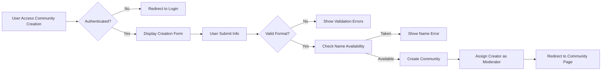

# Community Management Requirements

## Community Creation

### Core Community Creation Functions

WHEN a member navigates to the "Create Community" page, THE system SHALL display a form requesting community name, description, and type.

WHEN a member submits valid community creation information, THE system SHALL create a new community with the member automatically assigned as the first moderator.

THE system SHALL validate that community names contain only alphanumeric characters, hyphens, and underscores.

THE system SHALL restrict community names to between 3 and 21 characters in length.

WHEN a user attempts to create a community with an already-existing name, THE system SHALL reject the request and display an error message indicating the name is taken.

WHEN a member successfully creates a community, THE system SHALL redirect them to the new community's main page.

WHEN a guest attempts to create a community, THE system SHALL redirect them to the login page with a notice that community creation requires authentication.

### Community Properties

THE system SHALL store the following properties for each community:
- Unique identifier (UUID format)
- Name (unique across the platform)
- Description (up to 500 characters)
- Creation timestamp
- Community type (public, private, or restricted)
- Subscriber count
- Rules text (up to 10000 characters)
- Sidebar content (up to 10000 characters)
- Banner image (URL reference)
- Icon image (URL reference)

## Community Settings

### Community Configuration Options

WHERE a community exists, THE system SHALL allow moderators to configure the following settings:
- Community description (text up to 500 characters)
- Community rules (text up to 10000 characters)
- Sidebar content (text up to 10000 characters)
- Community type (public, private, or restricted)
- Banner image upload
- Icon image upload

WHERE a community moderator updates settings, THE system SHALL save the changes immediately and reflect them on the community page within 2 seconds.

THE system SHALL validate that any uploaded images are in JPEG, PNG, or GIF format and do not exceed 5MB in size.

IF a community moderator attempts to upload an image exceeding 5MB, THEN THE system SHALL reject the upload and display an error message.

IF a community moderator attempts to save settings with invalid data formats, THEN THE system SHALL reject the changes and highlight the problematic fields.

### Community Types

THE system SHALL support three community types with distinct access rules:
- Public: Anyone can view, join, and participate
- Private: Users must be approved by moderators to join and participate
- Restricted: Anyone can view, but only approved members can participate in posting or commenting

WHEN a community is set to private, THE system SHALL require users to request membership before they can view content.

WHEN a community is set to restricted, THE system SHALL allow guests to view posts but require membership to post or comment.

## Moderation Tools

### Moderator Permissions

WHERE a user is a community moderator, THE system SHALL grant them these permissions:
- Approve or reject membership requests (for private/restricted communities)
- Remove any post or comment from their community
- Ban or unban users from the community
- Edit community settings including description, rules, type, and images
- Appoint other moderators from community members
- Create and manage community flair for users and posts

WHERE a user is not a moderator, THE system SHALL deny access to moderation tools and display appropriate error messages.

WHEN a moderator removes a post or comment, THE system SHALL log the action with the moderator's identifier and timestamp.

WHEN a moderator bans a user, THE system SHALL immediately prevent that user from posting or commenting in the community.

WHEN a moderator unbans a user, THE system SHALL restore their ability to post and comment within 5 seconds.

### Administrative Override

WHERE a user is an admin, THE system SHALL grant them full moderation capabilities across ALL communities regardless of community-specific permissions.

WHEN an admin performs moderation actions, THE system SHALL log these actions with appropriate administrator identification.

## Community Discovery

### Community Listing

THE system SHALL display communities in lists organized by categories including "most popular", "newest", and "trending".

THE system SHALL define popular communities as those with the highest subscriber count.

THE system SHALL define trending communities as those with the highest recent activity (posts and comments in last 24 hours).

WHEN a user browses community listings, THE system SHALL present 20 communities per page.

THE system SHALL allow users to search for communities by name or description keywords.

WHEN a user searches for communities, THE system SHALL return results sorted by relevance within 3 seconds.

### Community Rules Display

THE system SHALL prominently display community rules on the community's main page.

THE system SHALL limit community rules text to 10000 characters maximum.

WHEN community rules are updated, THE system SHALL display the changes immediately to all users viewing the community.

## Business Rules and Validation

### Community Naming Rules

THE system SHALL enforce that community names:
- Begin with an alphabetic character
- Contain only alphanumeric characters, hyphens, and underscores
- Range between 3 and 21 characters in length
- Are unique across the entire platform

WHEN a user attempts to create a community with invalid naming characters, THE system SHALL reject the request and display an error message stating "Community names can only contain letters, numbers, hyphens, and underscores."

WHEN a user attempts to create a community with a name shorter than 3 characters or longer than 21 characters, THE system SHALL reject the request and specify the valid length range.

### Content Validation

THE system SHALL validate that community descriptions are not longer than 500 characters.

THE system SHALL validate that sidebar content is not longer than 10000 characters.

THE system SHALL validate that community rules text is not longer than 10000 characters.

## Error Handling Scenarios

### Creation Failures

IF a user submits a community creation request with a name that already exists, THEN THE system SHALL display an error message stating "A community with this name already exists. Please choose another name."

IF a user submits a community creation request with invalid characters in the name, THEN THE system SHALL display an error message stating "Community names can only contain letters, numbers, hyphens, and underscores."

IF a user submits a community creation request with a name outside the valid length range, THEN THE system SHALL display an error message stating "Community names must be between 3 and 21 characters long."

IF a guest attempts to access community creation tools, THEN THE system SHALL redirect them to the login page with a message stating "You must be logged in to create a community."

### Settings Validation Errors

IF a moderator attempts to save a community description exceeding 500 characters, THEN THE system SHALL reject the changes and highlight the description field with an error message.

IF a moderator attempts to save community rules exceeding 10000 characters, THEN THE system SHALL reject the changes and display an error message indicating the character limit.

IF a moderator attempts to save sidebar content exceeding 10000 characters, THEN THE system SHALL reject the changes and display an error message indicating the character limit.

### Image Upload Errors

IF a user attempts to upload an image in an unsupported format, THEN THE system SHALL reject the upload and display an error message listing accepted formats (JPEG, PNG, GIF).

IF a user attempts to upload an image exceeding 5MB in size, THEN THE system SHALL reject the upload and display an error message stating "Image files must be under 5MB in size."

IF a user attempts to upload an image that fails server-side validation, THEN THE system SHALL reject the upload and display a generic error message about upload problems.

### Permission Errors

IF a non-moderator attempts to access moderation tools, THEN THE system SHALL deny access with an error message stating "You must be a community moderator to access these tools."

IF a moderator attempts to ban themselves from their own community, THEN THE system SHALL prevent the action and display an error message.

IF a moderator attempts to appoint another moderator who is not a community member, THEN THE system SHALL reject the request and display an error message.