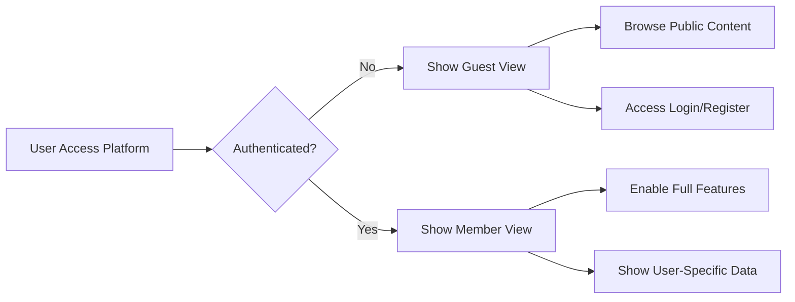
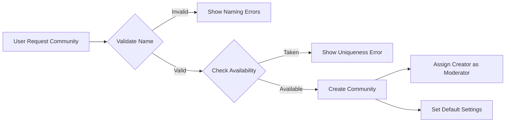
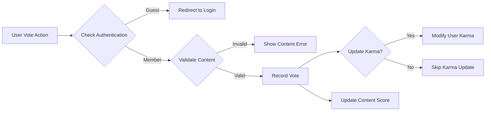
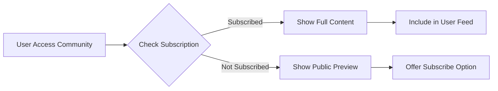

# Reddit-like Community Platform Requirements Analysis Report

## Executive Summary

THE Reddit-like community platform SHALL provide users with a decentralized forum experience where they can create accounts, join topic-specific communities, share content in multiple formats, and engage with others through voting and nested commenting systems. This platform SHALL replicate core Reddit functionality while allowing for customization of community rules and content moderation approaches.

## Service Overview

### Core Features

THE system SHALL implement these primary functions:
1. User account registration and authentication with email verification
2. Community creation with customizable settings and moderation tools
3. Multi-format content posting (text, links, images) with validation
4. Voting mechanism (upvote/downvote) for posts and comments affecting user karma
5. Nested reply system for comments up to 10 levels deep
6. Content ranking algorithms (hot, new, top, controversial)
7. Community subscription system for personalized content feeds
8. User profiles displaying activity history and karma scores
9. Content reporting system with moderation workflow for inappropriate material

### Business Value

WHEN users seek specific communities for their interests, THE platform SHALL provide organized content discovery through topic-based grouping.

WHILE maintaining content quality, THE system SHALL enable community-driven moderation through voting and reporting mechanisms.

THE platform SHALL foster engagement through a karma system that recognizes valuable contributions.

WHERE users want to track discussions on topics they care about, THE subscription system SHALL create personalized feeds.

## User Roles and Authentication System

### Guest User Capabilities

Guests SHALL have limited access to platform features:
- Browse public communities and their content
- View posts and comments without interaction capability
- Access registration and login interfaces
- Search for communities by name or description

WHEN a guest attempts restricted actions like posting or voting, THE system SHALL redirect them to the login page with an explanatory message.

### Member User Capabilities

Members SHALL have full participation rights:
- Create text, link, and image posts in accessible communities
- Comment on posts with nested replies
- Upvote or downvote posts and comments
- Subscribe to and unsubscribe from communities
- Customize profile information and privacy settings
- Report inappropriate content with categorized reasons

WHEN a member performs an action, THE system SHALL update related metrics (karma scores, vote counts, subscription lists) in real-time.

### Moderator Capabilities

Moderators SHALL have enhanced community management functions:
- Remove posts and comments that violate community rules
- Ban or unban users from their moderated communities
- Configure community settings, descriptions, and rules
- Review and resolve reported content in their communities
- Distinguish official moderator communications

WHEN a moderator performs a moderation action, THE system SHALL log the action with timestamp, user identifier, and affected content for audit purposes.

### Admin Capabilities

Admins SHALL have system-wide control privileges:
- Review and resolve all content reports regardless of community
- Ban or suspend user accounts platform-wide
- Delete any post or comment across all communities
- Access administrative dashboards and system metrics
- Configure global platform settings and policies

### Authentication Workflows

When a user registers, THE system SHALL:
- Verify email address availability and format
- Check username uniqueness and character constraints
- Validate password complexity requirements
- Send verification email with time-limited token
- Create account in pending status until email confirmation

When a user logs in successfully, THE system SHALL:
- Validate email/password combination
- Generate JWT access token with user permissions
- Create refresh token for session persistence
- Set authentication status in user session
- Redirect to personalized home feed

## Functional Requirements

### User Registration and Login System

WHEN a guest submits registration information, THE system SHALL validate:
- Email format compliance with RFC 5322 standards
- Username length between 3-20 characters
- Username composition of alphanumeric characters, underscores, and hyphens only
- Password minimum length of 8 characters
- Password inclusion of uppercase, lowercase, and numeric characters

IF submitted credentials fail validation, THEN THE system SHALL display specific error messages for each failed criterion.

WHEN a user clicks the email verification link within 24 hours, THE system SHALL activate the account and redirect to login interface.

IF verification link expires or is invalid, THEN THE system SHALL display error and offer to resend verification email.

### Community Management System

WHEN a member requests to create a community, THE system SHALL validate:
- Community name contains 3-21 characters
- Community name uses only alphanumeric characters, underscores, and hyphens
- Community name is unique across the platform
- Description contains fewer than 500 characters

WHEN a community is created successfully, THE system SHALL:
- Generate unique community identifier (UUID)
- Assign requesting user as initial moderator
- Initialize community settings with default values
- Create empty post listings for the community

### Content Posting System

THE system SHALL support three post types with specific requirements:

1. Text Posts:
   - Maximum title length: 300 characters
   - Maximum body length: 40,000 characters
   - Plain text formatting only (no HTML/markdown)

2. Link Posts:
   - URL validation for http/https protocols
   - Optional title field (max 300 characters)
   - URL length maximum: 2,000 characters

3. Image Posts:
   - File format restrictions: JPEG, PNG, GIF only
   - File size maximum: 10MB
   - Required title field (max 300 characters)

WHEN a member submits any post type, THE system SHALL validate all inputs against these criteria before allowing publication.

### Voting System

WHEN a member votes on content, THE system SHALL:
- Verify user authentication status
- Validate content identifier exists and is accessible
- Prevent self-voting on user's own content
- Record vote with timestamp and content association
- Update content score immediately in UI

IF content receives an upvote, THEN author's karma SHALL increase by 1 point.
IF content receives a downvote, THEN author's karma SHALL decrease by 1 point.

### Commenting System

WHEN a member posts a comment, THE system SHALL:
- Verify parent post exists and is not deleted
- Validate comment text length between 1-10,000 characters
- Confirm user has commenting privileges in the community
- Create nested structure preserving parent-child relationships

THE system SHALL support up to 10 levels of comment nesting.
THE system SHALL display comments with visual indentation cues.
THE system SHALL maintain chronological ordering within nesting levels.

WHEN a user edits a comment within 15 minutes of posting, THE system SHALL update the content while preserving creation timestamp.
IF a comment has existing replies, THE system SHALL prevent deletion but allow editing to indicate "[deleted]".

### Content Sorting System

THE system SHALL offer configurable sorting algorithms:
- Hot: Combines vote scores with time decay factors
- New: Chronological ordering (newest first)
- Top: Vote-based ranking with time filters
- Controversial: Balanced upvote/downvote ratio prioritization

WHEN calculating hot scores, THE system SHALL use:
- Score = log10(Max(|upvotes - downvotes|, 1)) + Sign × TimeFactor
- Sign = 1 if upvotes > downvotes, 0 if equal, -1 if downvotes > upvotes
- TimeFactor = Hours since epoch reference / Scaling factor

WHEN applying top sorting, THE system SHALL support time filters:
- Today (past 24 hours)
- Week (past 7 days)
- Month (past 30 days)
- Year (past 365 days)
- All time (no time limit)

### Subscription System

WHEN a member subscribes to a community, THE system SHALL:
- Add community to user's subscription list
- Include community posts in personalized feed
- Initialize notification preferences for the community

THE system SHALL limit users to 10,000 community subscriptions to prevent performance issues.

### User Profile System

THE system SHALL display user profiles with:
- Username and registration date
- Total karma score aggregating post and comment votes
- Recent post and comment history
- Community subscription list

WHEN a member accesses their own profile, THE system SHALL show additional controls:
- Account settings modification
- Privacy preference configuration
- Content management tools

### Content Reporting System

THE system SHALL offer these reporting categories:
- Spam or misleading content
- Harassment or bullying
- Hate speech or discrimination
- Violence or threats
- Personal information sharing
- Sexual content
- Illegal activities
- Other (with text explanation)

WHEN a user submits a report, THE system SHALL:
- Prevent duplicate reports for same content
- Add report to community-specific moderation queue
- Generate ticket with reporter identification (if not anonymous)
- Notify appropriate moderators based on community

## Business Rules and Constraints

THE system SHALL enforce these business constraints:

1. Account Management:
   - Users must validate email within 24 hours of registration
   - Deleted accounts retain content but anonymize user information
   - Password changes invalidate all existing sessions

2. Content Rules:
   - Posts associated with exactly one community at creation
   - Post titles required for all post types (1-300 characters)
   - Links must begin with http:// or https:// protocols
   - Images restricted to JPEG, PNG, and GIF formats

3. Voting Limitations:
   - Users cannot vote on their own content
   - One vote per content item per user
   - Vote changes update immediately without page refresh

4. Comment Restrictions:
   - Maximum nesting depth of 10 levels
   - Text limit of 10,000 characters per comment
   - Deletion only allowed for comments without replies

5. Community Policies:
   - Unique names required across the platform
   - Names must be URL-safe (alphanumeric, underscore, hyphen)
   - Public communities visible to guests
   - Private communities require moderator approval

## Error Handling and Edge Cases

THE system SHALL handle these error scenarios:

IF database connection fails, THEN user actions SHALL result in friendly error messages with retry options.

IF content violates size or format limits, THEN THE system SHALL specify exact error reasons without data loss.

IF authentication tokens expire, THEN THE system SHALL provide seamless renewal when refresh tokens exist.

IF users attempt unauthorized actions, THEN THE system SHALL display permission errors without exposing system internals.

IF content is deleted during user interaction, THEN THE system SHALL gracefully handle broken references.

## Performance Requirements

THE system SHALL operate with these performance benchmarks:

WHEN loading homepage views, THE system SHALL deliver content within 2 seconds under normal conditions.

WHEN submitting votes, THE system SHALL complete the interaction within 500 milliseconds.

WHEN creating or editing content, THE system SHALL update UI immediately after server confirmation.

WHEN processing search queries, THE system SHALL return results within 1 second.

THE system SHALL support concurrent usage by 10,000 active users without degradation.

## Success Metrics and KPIs

THE system SHALL track these key performance indicators:

1. User Engagement:
   - Daily Active Users (DAU) growth
   - Average session duration
   - Posts and comments per active user
   - Returning user retention rate

2. Community Health:
   - Number of active communities
   - Subscriber growth rates per community
   - Moderator response times for reports
   - User-generated content volume

3. System Performance:
   - API response time measurements
   - Database query efficiency metrics
   - Cache hit ratios for sorted content
   - Error rates and resolution tracking

4. Content Quality Indicators:
   - High-vote content ratio
   - Moderation action effectiveness
   - Spam and policy violation detection rates
   - User satisfaction with content discovery

> *Developer Note: This document defines **business requirements only**. Implementation decisions including architecture, APIs, database design, and technology stack are at the development team's discretion.*