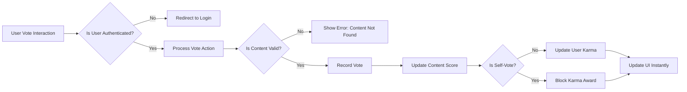

# Voting System Requirements for Reddit-like Community Platform

## Voting Mechanics

### Core Voting Functions
The voting system enables users to express their approval or disapproval of posts and comments through upvotes and downvotes, which directly affect content visibility and user reputation scores.

### Post Voting Behavior
WHEN a member clicks the upvote button on a post, THE system SHALL increase the post's vote score by 1
WHEN a member clicks the downvote button on a post, THE system SHALL decrease the post's vote score by 1
WHEN a member clicks an already selected vote button on a post, THE system SHALL remove that vote and reset the button to neutral state
WHEN a member changes a previous vote on a post, THE system SHALL update the post's vote score accordingly (from +1 to -1 or vice versa)

### Comment Voting Behavior
WHEN a member clicks the upvote button on a comment, THE system SHALL increase the comment's vote score by 1
WHEN a member clicks the downvote button on a comment, THE system SHALL decrease the comment's vote score by 1
WHEN a member clicks an already selected vote button on a comment, THE system SHALL remove that vote and reset the button to neutral state
WHEN a member changes a previous vote on a comment, THE system SHALL update the comment's vote score accordingly (from +1 to -1 or vice versa)

### User Interface States
THE system SHALL display three distinct visual states for voting buttons:
- Neutral state (default appearance)
- Upvoted state (visually distinct to show user has upvoted)
- Downvoted state (visually distinct to show user has downvoted)

### Vote Visibility
THE system SHALL display the current vote score for each post and comment publicly
THE system SHALL NOT display which specific users have voted on content
THE system SHALL show the user their own voting choices on content they have interacted with

## Vote Tracking

### Vote Recording
WHEN a member votes on a post or comment, THE system SHALL record:
- The voter's user ID
- The content ID (post or comment)
- The vote type (upvote or downvote)
- The timestamp of the vote action
- The previous vote state (if any)

### Vote Data Association
THE system SHALL associate each vote with exactly one piece of content (either a post or comment)
THE system SHALL associate each vote with exactly one user
THE system SHALL track both the current vote score and individual user voting actions

### Vote Modification Tracking
WHEN a member changes their vote on content, THE system SHALL update their previous vote record rather than creating a new one
WHEN a member removes their vote on content, THE system SHALL mark the vote record as nullified with a timestamp

### Vote Consistency
THE system SHALL prevent users from casting multiple votes on the same content
THE system SHALL maintain atomic operations for vote changes to prevent race conditions
THE system SHALL ensure vote counts accurately reflect the difference between upvotes and downvotes

## Karma Calculation

### Post Karma Calculation
WHEN a member's post receives an upvote, THE system SHALL increase that member's post karma score by 1
WHEN a member's post receives a downvote, THE system SHALL decrease that member's post karma score by 1
WHEN a member's post has a vote removed, THE system SHALL adjust the member's post karma score accordingly

### Comment Karma Calculation
WHEN a member's comment receives an upvote, THE system SHALL increase that member's comment karma score by 1
WHEN a member's comment receives a downvote, THE system SHALL decrease that member's comment karma score by 1
WHEN a member's comment has a vote removed, THE system SHALL adjust the member's comment karma score accordingly

### Total Karma Calculation
THE system SHALL calculate a member's total karma as the sum of their post karma and comment karma scores
THE system SHALL update total karma in real-time as individual post and comment votes are modified

### Karma Visibility
THE system SHALL display a member's total karma score on their public profile
THE system SHALL display a member's post karma score on their public profile
THE system SHALL display a member's comment karma score on their public profile
THE system SHALL update karma scores instantly in the user interface when votes occur

### Self-Voting Restriction
THE system SHALL NOT award karma points to users who vote on their own posts or comments
THE system SHALL prevent users from voting on their own content

## Vote Restrictions

### Authentication Requirements
WHEN a guest attempts to vote on a post, THE system SHALL redirect them to the login page
WHEN a guest attempts to vote on a comment, THE system SHALL redirect them to the login page

### Rate Limiting
THE system SHALL limit individual members to 100 voting actions per hour to prevent abuse
WHEN a member exceeds the hourly voting limit, THE system SHALL prevent further votes and display an appropriate error message

### Vote Reversal Restrictions
THE system SHALL allow members to change or remove their votes at any time while the content exists
THE system SHALL NOT allow vote changes on deleted or removed content

### Moderator and Admin Voting
WHERE a moderator role is applied, THE system SHALL allow voting on all community content following the same rules as members
WHERE an admin role is applied, THE system SHALL allow voting on all community content following the same rules as members
THE system SHALL NOT give moderators or admins special voting privileges beyond standard users

### Community Restrictions
WHEN a community is set to "private" mode, THE system SHALL continue allowing voting for subscribed members
WHEN content is removed by moderators, THE system SHALL disable voting on that content
WHEN content is deleted by the author, THE system SHALL disable voting on that content

## Error Handling and Edge Cases

### Invalid Content Handling
WHEN a user attempts to vote on non-existent content, THE system SHALL return an error message "Content not found"
WHEN a user attempts to vote on content in a non-existent community, THE system SHALL return an error message "Community not found"

### Concurrent Vote Handling
WHEN multiple vote actions occur simultaneously on the same content, THE system SHALL process them sequentially to ensure data integrity

### System Failure Handling
IF a vote action fails to record due to system issues, THEN THE system SHALL display an error message "Unable to process vote. Please try again."
IF a vote action fails due to network issues, THEN THE system SHALL display an error message "Network connection failed. Please check your connection and try again."

## Performance Requirements

### Vote Processing
THE system SHALL process individual vote actions and update displayed scores within 1 second
THE system SHALL update karma scores in user profiles within 1 second of vote actions

### Vote History Retrieval
THE system SHALL retrieve a user's voting history for their profile display within 3 seconds
THE system SHALL calculate content vote scores for sorting algorithms within 100 milliseconds

