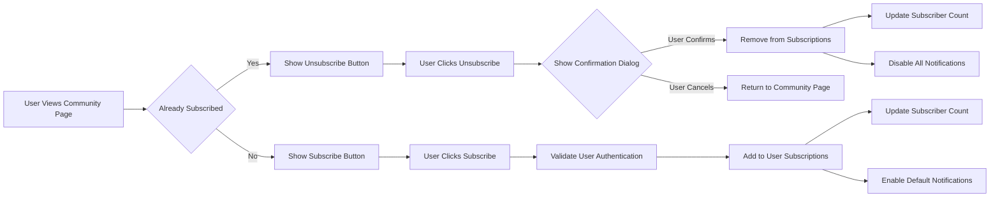

# Subscription System Requirements

## Subscription Mechanics

### Guest Access Limitations
WHEN a guest user attempts to subscribe to a community, THE system SHALL redirect them to the login page with a message indicating subscription requires authentication.

WHEN a guest user attempts to access subscription management features, THE system SHALL redirect them to the login page.

### Member Subscription Process
WHEN an authenticated member browses a community page, THE system SHALL display a "Subscribe" button if they are not currently subscribed to that community.

WHEN an authenticated member clicks the "Subscribe" button, THE system SHALL add that community to their subscriptions and change the button to "Unsubscribe".

WHEN an authenticated member clicks the "Unsubscribe" button, THE system SHALL display a confirmation dialog asking if they want to unsubscribe from the community.

WHEN an authenticated member confirms unsubscribing from a community through the confirmation dialog, THE system SHALL remove that community from their subscriptions and change the button to "Subscribe" on future visits.

### Moderator and Admin Subscription Overrides
WHERE a user has moderator or admin privileges for a community, THE system SHALL maintain these permissions separately from subscription status.

WHEN a moderator or admin subscribes to a community they moderate, THE system SHALL indicate their special role status.

WHEN an admin accesses subscription management for any community, THE system SHALL allow overriding normal subscription rules.

### Community Type Restrictions
THE system SHALL allow members to subscribe to any public community without approval.

THE system SHALL allow members to subscribe to restricted communities following the same rules as public communities.

THE system SHALL allow members to request subscription to private communities, which requires moderator approval.

WHEN a member requests to subscribe to a private community, THE system SHALL place the request in a pending state until approved by a moderator.

IF a private community moderator approves a subscription request, THEN THE system SHALL activate the subscription immediately.

IF a private community moderator rejects a subscription request, THEN THE system SHALL notify the user of the rejection.

### Community Status Changes
IF a private community changes to public status, THEN THE system SHALL automatically approve all pending subscription requests for that community.

IF a public community changes to private status, THEN THE system SHALL preserve existing subscriptions but require new subscriptions to go through approval process.

IF a subscribed community is deleted or banned, THEN THE system SHALL automatically unsubscribe all members from that community.

## Subscription Tracking

### Subscription Data Model
THE system SHALL maintain a record of each user's community subscriptions including:
- User identifier
- Community identifier
- Subscription timestamp
- Subscription status (active, pending, rejected)

THE system SHALL track the total number of subscribers for each community and display this count on the community page.

THE system SHALL update subscriber counts in real-time when users subscribe or unsubscribe from communities.

### User Profile Integration
WHEN a user views their profile, THE system SHALL display a list of communities they are subscribed to with subscription dates.

WHEN a user views another user's public profile, THE system SHALL display their subscribed communities if privacy settings allow.

WHEN a user accesses their account settings, THE system SHALL provide access to subscription management interface.

### Subscription State Management
THE system SHALL maintain the following subscription states:
- Active: User has access to community content
- Pending: User has requested access to private community awaiting approval
- Rejected: User's subscription request was denied by moderator
- Inactive: User has unsubscribed or was removed by system

WHILE a user is subscribed to a community in active state, THE system SHALL include posts from that community in their personalized feed.

IF a user account is suspended or deleted, THEN THE system SHALL automatically unsubscribe that user from all communities.

### Subscription Limits
THE system SHALL limit users to a maximum of 10,000 community subscriptions to prevent performance issues.

WHEN a user attempts to exceed subscription limits, THE system SHALL display error message "Maximum subscription limit of 10,000 communities reached".

## Community Feed

### Feed Composition
THE system SHALL create a personalized feed for each authenticated user containing posts from all communities they are subscribed to in active state.

WHEN a user accesses their feed, THE system SHALL display posts sorted by "new" as the default sorting method.

WHERE a user has no community subscriptions, THE system SHALL display a recommendation of popular communities to subscribe to.

### Feed Content Delivery
THE system SHALL ensure posts from subscribed communities appear in users' feeds within 30 seconds of posting.

WHEN a user unsubscribes from a community, THE system SHALL remove posts from that community from their feed within 1 minute.

THE system SHALL display a maximum of 25 posts per page in the user's feed.

IF a user attempts to access their feed and has network connectivity issues, THEN THE system SHALL display a cached version of their recent feed content if available.

IF a subscribed community has no posts, THEN THE system SHALL not display any content from that community in the user's feed.

### Data Consistency
WHEN a user's subscription status changes, THE system SHALL update their feed content within 1 minute.

THE system SHALL maintain consistency between subscription records and feed content delivery.

## Notification Settings

### Default Notification Behavior
WHEN a user subscribes to a community, THE system SHALL enable "new post" notifications for that community by default.

THE system SHALL allow users to customize notification preferences for each subscribed community, including:
- New post notifications (enabled by default)
- Hot post notifications (disabled by default)
- Community announcement notifications (enabled by default)
- Comment notifications (disabled by default)

### Unsubscribe Notification Effects
WHEN a user unsubscribes from a community, THE system SHALL automatically disable all notifications for that community.

### Notification Delivery
THE system SHALL deliver notifications for subscribed community content within 1 minute of creation during peak hours (08:00-22:00 local time).

THE system SHALL deliver notifications for subscribed community content within 5 minutes of creation during non-peak hours.

WHERE a user has disabled all notifications in their device settings, THE system SHALL queue notifications for 24 hours and attempt redelivery when notifications are re-enabled.

IF a notification fails to deliver to a user, THEN THE system SHALL retry delivery up to 3 times with exponential backoff.

### Notification Frequency Management
THE system SHALL allow users to configure notification frequency preferences including:
- Real-time delivery
- Digest delivery (hourly summaries)
- Daily digest only
- Notifications disabled

WHEN a moderator posts in a community, THE system SHALL prioritize those notifications for all subscribers to that community.

### Notification Preference Storage
THE system SHALL store notification preferences per user per community combination.

THE system SHALL provide users with a centralized notification settings page where they can manage preferences for all subscribed communities.

IF a user changes their global notification settings, THEN THE system SHALL apply those changes to all community-specific notification preferences.

## Performance Requirements

### Response Time Standards
WHEN a user subscribes or unsubscribes from a community, THE system SHALL process the request and update UI within 2 seconds.

WHEN a user accesses their subscription management page, THE system SHALL load the page within 3 seconds.

WHEN retrieving feed content based on subscriptions, THE system SHALL respond within 2 seconds for standard load.

### Scalability Requirements
THE system SHALL support 1 million concurrent users with active subscriptions.

THE system SHALL maintain subscription data consistency across distributed systems.

## Error Handling Scenarios

### Subscription Process Errors
IF a user attempts to subscribe to a non-existent community, THEN THE system SHALL display error message "Community not found".

IF the system experiences a database error during subscription processing, THEN THE system SHALL display error message "Unable to process subscription request. Please try again later." and preserve user intent.

IF a user attempts to subscribe while rate-limited, THEN THE system SHALL display error message "Too many subscription requests. Please wait before trying again.".

### Notification Errors
IF notification delivery consistently fails for a user, THEN THE system SHALL mark their notification preferences as potentially invalid and prompt for verification.

IF a user's notification settings cannot be retrieved, THEN THE system SHALL default to standard notification delivery and log the error.

### System Integration Errors
IF subscription data becomes inconsistent with community access permissions, THEN THE system SHALL reconcile the data during next user session and log discrepancy.

## Business Rules and Constraints

### Data Privacy
WHERE user subscription information is private, THE system SHALL not display it to other users.

THE system SHALL encrypt subscription data in transit and at rest.

### Account Lifecycle
WHEN a user account is deleted, THE system SHALL remove all subscription associations but preserve community analytics data in aggregate form.

WHEN a user account is suspended, THE system SHALL temporarily disable all subscription-based features.

### Cross-Platform Consistency
THE system SHALL maintain consistent subscription states across all user devices and platforms.

## Implementation Guidelines

### User Interface Requirements
THE system SHALL provide visual indicators for subscription status on community pages.

THE system SHALL allow bulk subscription management operations.

### Data Synchronization
THE system SHALL synchronize subscription data across all platform services within 5 minutes.

### Audit Requirements
THE system SHALL log all subscription-related actions for audit purposes including:
- Subscription creation
- Subscription removal
- Subscription approval
- Subscription rejection

