# E-commerce Shopping Mall Requirements Analysis Report

## Project Overview

This document outlines the complete business requirements for an e-commerce shopping mall platform. The system will provide a comprehensive online marketplace where customers can browse products, make purchases, track orders, and leave reviews, while sellers can manage their product inventory and orders, and administrators can oversee the entire platform operations.

## Business Model

### Why This Service Exists
The e-commerce shopping mall platform addresses the growing need for businesses to establish online presence and for consumers to access products from multiple sellers in a single location. This platform bridges the gap between individual sellers who need a marketplace to showcase their products and customers who prefer the convenience of centralized shopping.

### Revenue Strategy
The platform will generate revenue through:
1. Transaction fees on completed sales (percentage-based commission from each seller)
2. Premium seller account subscriptions for enhanced features
3. Featured product placement fees
4. Advertising revenue from brand partnerships

### Growth Plan
User acquisition will focus on:
1. Onboarding local sellers to populate the marketplace with unique products
2. Attracting customers through competitive pricing and product variety
3. Building trust through transparent reviews and secure transactions
4. Expanding through social media marketing and referral programs

### Success Metrics
1. Monthly active users (MAU): 50,000+ target
2. Daily transactions: 5,000+ target
3. Seller retention rate: 85%+ annually
4. Customer satisfaction rating: 4.5+ stars
5. Gross merchandise value (GMV): $2M+ monthly

## User Roles and Authentication Requirements

### Core Authentication Functions
- Users can register with email and password
- Users can log in to access personalized features
- Users can securely log out to end their session
- System maintains authenticated user sessions
- Users can verify their email address for account activation
- Users can reset forgotten passwords through email recovery
- Users can change their account password
- Users can manage multiple delivery addresses

### User Role Structure

#### Customer Role
Customers are registered users who can:
- Browse all products in the catalog
- Search and filter products by various criteria
- Add products to shopping cart and wishlist
- Place orders and process payments
- Track order status and shipment progress
- Leave product reviews and ratings
- Manage personal addresses and preferences
- View order history and request cancellations/refunds

#### Seller Role
Sellers are users who can:
- Manage their own product listings
- Create and edit product variants (SKUs) with different attributes
- Set inventory levels for each SKU
- Handle orders related to their products
- View sales analytics and performance reports
- Communicate with customers about their products
- Manage their seller profile and store information

#### Admin Role
Administrators are users who can:
- Manage all user accounts (customers and sellers)
- Create, edit, and remove any product listing
- Moderate product reviews and user content
- View and manage all orders in the system
- Generate system-wide reports and analytics
- Configure platform settings and policies
- Handle disputes and refund requests
- Monitor system performance and health

### Authentication Requirements

#### Registration Process
WHEN a guest submits registration information, THE system SHALL validate email format, password complexity, and store user details in the customer database.
IF email format is invalid OR password doesn't meet complexity requirements, THEN THE system SHALL display appropriate error messages without specifying which validation failed.

#### Login Requirements
WHEN a user submits login credentials, THE system SHALL authenticate the user within 2 seconds and generate appropriate session tokens.
IF authentication fails after 3 consecutive attempts, THE system SHALL temporarily lock the account for 15 minutes and notify the user by email.

#### Session Management
THE system SHALL maintain user sessions for a maximum of 30 days of inactivity before requiring re-authentication.
WHEN a user logs out from one device, THE system SHALL invalidate that specific session while maintaining others.

#### Password Recovery
WHEN a user requests password recovery, THE system SHALL send a reset link to the registered email within 30 seconds.
WHEN a user clicks the password reset link, THE system SHALL provide a secure page to create a new password.

#### Address Management
WHEN a customer adds or updates an address, THE system SHALL validate postal codes, phone numbers, and required fields.
THE customer SHALL be able to save up to 5 delivery addresses in their profile.

### Permission Matrix

| Action | Customer | Seller | Admin |
|--------|----------|--------|-------|
| Browse products | ✅ | ✅ | ✅ |
| Search products | ✅ | ✅ | ✅ |
| View product details | ✅ | ✅ | ✅ |
| Add to cart/wishlist | ✅ | ❌ | ❌ |
| Place orders | ✅ | ❌ | ❌ |
| Track shipments | ✅ | ❌ | ❌ |
| Leave reviews | ✅ | ❌ | ❌ |
| Manage own products | ❌ | ✅ | ❌ |
| Set inventory levels | ❌ | ✅ | ❌ |
| Process own orders | ❌ | ✅ | ❌ |
| View sales reports | ❌ | ✅ | ❌ |
| Manage all products | ❌ | ❌ | ✅ |
| Manage all orders | ❌ | ❌ | ✅ |
| Manage all users | ❌ | ❌ | ✅ |
| Generate system reports | ❌ | ❌ | ✅ |
| Configure platform | ❌ | ❌ | ✅ |

## Functional Requirements

### Product Catalog and Search Requirements

#### Category Management
THE system SHALL organize products into hierarchical categories (e.g., Electronics > Mobile Phones > Smartphones).
WHEN a customer navigates to a category page, THE system SHALL display all products in that category and their subcategories.

#### Product Display Requirements
WHEN a customer views a product detail page, THE system SHALL display product name, description, price, images, and available variants.
THE product information SHALL include manufacturer details, specifications, and warranty information when provided by the seller.

#### Search Functionality
WHEN a customer enters search terms, THE system SHALL return relevant products within 1 second.
THE search function SHALL support filtering by price range, brand, category, and customer ratings.
WHERE search returns more than 20 products, THE system SHALL paginate results with 20 items per page.

### Product Variants (SKU) Requirements

#### SKU System Design
THE system SHALL assign unique SKU identifiers to each product variant combination.
WHEN a seller creates a product with multiple variants, THE system SHALL generate individual SKUs for each unique combination.

#### Variant Attributes
THE product variants SHALL support attributes including color, size, material, and custom options defined by the seller.
WHEN a customer selects different variant options, THE system SHALL update displayed price, availability, and images accordingly.

#### Inventory Tracking
WHEN a seller updates inventory for a SKU, THE system SHALL reflect this change in real-time on product pages.
IF inventory for a specific SKU reaches zero, THE system SHALL mark that variant as "out of stock" and prevent purchase.

### Shopping Cart and Wishlist Requirements

#### Cart Management
WHEN a customer adds a product to the cart, THE system SHALL track the selected variant, quantity, and price at the time of addition.
WHEN a customer removes an item from the cart, THE system SHALL update the cart total immediately.
THE system SHALL preserve cart contents for 30 days of user inactivity before clearing.

#### Wishlist Functionality
WHEN a customer adds a product to their wishlist, THE system SHALL store the product with its current variant selection.
THE customer SHALL be able to move items from wishlist to cart with one click.

### Order Placement and Payment Processing

#### Checkout Process
WHEN a customer initiates checkout, THE system SHALL validate all items in the cart for current availability.
IF any item in the cart becomes unavailable since addition, THEN THE system SHALL remove it from the cart and notify the customer.

#### Payment Integration
THE system SHALL support credit/debit card payments, digital wallets, and bank transfers.
WHEN a customer submits payment information, THE system SHALL process the transaction within 5 seconds.
IF payment processing fails, THE system SHALL provide clear error messaging and allow retry.

### Order Management Requirements

#### Order Lifecycle
WHEN a customer successfully completes checkout, THE system SHALL create a new order with status "pending".
WHEN payment is confirmed, THE system SHALL update order status to "processing".
WHEN seller ships the order, THE system SHALL update order status to "shipped" and provide tracking information.
WHEN order is delivered, THE system SHALL update order status to "completed".

#### Order Status Tracking
THE customer SHALL be able to view current status of all their orders from their account dashboard.
WHEN order status changes, THE system SHALL send notification email to the customer within 5 minutes.

#### Cancellation and Refund Process
WHEN a customer requests order cancellation within 1 hour of placement, THE system SHALL process full refund immediately.
IF order status is "processing" or "shipped", THE system SHALL require seller approval for cancellation.
THE customer SHALL be able to submit refund requests with reason descriptions for up to 30 days after delivery.

### Reviews and Ratings Requirements

#### Review Submission
WHEN a customer purchases a product, THE system SHALL allow them to submit one review per order.
THE review SHALL include text content (maximum 1000 characters) and a 1-5 star rating.
THE customer SHALL be able to upload up to 3 photos with their review.

#### Moderation Requirements
WHERE a review contains profanity or inappropriate content, THE system SHALL flag it for admin review before publishing.
WHEN admin approves a flagged review, THE system SHALL make it visible to all users within 1 hour.

### Admin Dashboard Requirements

#### Dashboard Overview
THE admin dashboard SHALL display system health metrics, recent orders, and flagged content requiring attention.
WHEN admin logs into dashboard, THE system SHALL load overview information within 3 seconds.

#### Order Management Capabilities
THE admin SHALL be able to view, filter, and search all orders within the system.
WHEN admin updates order status, THE system SHALL send immediate notification to the customer.
THE admin SHALL be able to approve or reject refund requests within 24 hours.

#### Product Management Capabilities
THE admin SHALL be able to search all product listings by name, category, or seller.
WHEN admin removes a product, THE system SHALL immediately hide it from customer view and notify the seller.

## Business Requirements in Natural Language

### User Registration and Management
The platform must provide a straightforward user registration process that validates email addresses and sets password requirements. Customers need to manage multiple delivery addresses for their convenience, while sellers require profiles with business information and a way to showcase their store.

### Product Catalog System
Products must be organized into meaningful categories with robust search capabilities to help customers find what they need quickly. Each product should display comprehensive information including images, descriptions, specifications, and warranty details where applicable.

### Product Variants Management
Sellers need to effectively manage products with multiple options such as different colors, sizes, or materials. Each variant combination must have a unique identifier and independent inventory tracking to ensure accurate stock availability.

### Shopping Experience
Customers must be able to save products for later purchase in a wishlist and easily add items to their cart. The cart system should preserve selections for reasonable periods and provide clear pricing information.

### Order Processing and Payment
The system must provide a seamless checkout experience with secure payment processing and immediate order confirmation. Payment options should be diverse to accommodate different customer preferences.

### Order Tracking and Management
Customers need detailed information about their order status from placement to delivery. Sellers require tools to manage their specific orders, update status, and handle customer communication. Admins need oversight of all orders and the ability to resolve disputes.

### Review and Rating System
Customers should be able to share their purchase experiences through text reviews and star ratings. The system must protect against inappropriate content while enabling sellers to respond professionally to customer feedback.

### Administrative Oversight
Admins require a comprehensive dashboard to manage users, products, orders, and flagged content. The system should provide reporting capabilities to track performance and identify issues.

## User Scenarios and Use Cases

### Scenario 1: New Customer Registration
1. A new customer visits the platform homepage
2. They click "Register" and fill out the registration form with email and password
3. The system validates their information and creates a customer account
4. It sends a verification email with activation instructions
5. After email verification, the customer can log in and access the platform

### Scenario 2: Product Search and Purchase
1. Customer logs in to their account
2. Customer searches for "wireless headphones" using the search bar
3. System returns relevant products with filtering options
4. Customer filters by price range and selects a product
5. Customer reviews product details and selects preferred variant (color and size)
6. Customer adds item to cart and continues browsing
7. Customer proceeds to checkout, confirms shipping address
8. Customer selects payment method and completes transaction
9. System confirms order and sends receipt email

### Scenario 3: Seller Inventory Management
1. Seller logs into their dashboard
2. Seller navigates to product management section
3. Seller selects a product to update inventory levels
4. Seller specifies stock quantity for each SKU variant
5. System saves updated inventory levels
6. System immediately updates product availability on customer-facing pages

### Scenario 4: Order Tracking
1. Customer logs into their account
2. Customer views order history to find a recent purchase
3. Customer selects the order to view detailed status information
4. System displays current status (e.g., "shipped") and tracking number
5. Customer receives automatic email updates when order status changes

### Scenario 5: Product Review Submission
1. Customer receives notification that their order was delivered
2. Customer visits the product page from their order history
3. Customer clicks "Leave Review" and rates product 4 stars
4. Customer adds text description of their experience
5. Customer uploads a photo of the product in use
6. System submits review for moderation and eventual public display

```mermaid
graph LR
  A["Customer Visit Homepage"] --> B{"Logged In?"}
  B -->|"No"| C["Show Registration/Login Options"]
  C --> D["Customer Registers or Logs In"]
  D --> E["Customer Browses/Categories/Search"]
  E --> F["Customer Views Product Details"]
  F --> G["Customer Selects Variants"]
  G --> H["Customer Adds to Cart"]
  H --> I["Customer Proceeds to Checkout"]
  I --> J["Customer Enters Shipping Info"]
  J --> K["Customer Selects Payment Method"]
  K --> L["Customer Completes Payment"]
  L --> M["System Confirms Order"]
  M --> N["Seller Processes Order"]
  N --> O["Order Shipped"]
  O --> P["Customer Receives Product"]
  P --> Q["Customer Leaves Review"]
```

## Non-functional Requirements

### Performance Requirements
WHEN a customer searches for products, THE system SHALL return results within 1 second for 95% of queries.
THE home page SHALL load within 2 seconds for users with standard internet connections.
WHEN uploading product images, THE system SHALL process and optimize files within 5 seconds.

### Availability Requirements
THE system SHALL maintain 99.5% uptime during normal business operations.
WHERE system maintenance is scheduled, THE system SHALL provide 48-hour advance notification to users.

### Security Requirements
THE system SHALL encrypt all user passwords using industry-standard hashing algorithms.
WHEN processing payments, THE system SHALL comply with PCI DSS security standards.
THE system SHALL log all administrative actions for audit purposes.

### Scalability Requirements
THE system SHALL support 10,000 concurrent users without performance degradation.
WHEN traffic increases by 200%, THE system SHALL scale automatically to maintain response times.
THE database SHALL accommodate 1 million products with 100+ variants each.

## System Constraints

### Technical Constraints
- The platform must be compatible with modern web browsers (Chrome, Firefox, Safari, Edge)
- Mobile responsiveness is required but separate mobile app development is out of scope
- All customer data must be stored in compliance with GDPR regulations
- Integration with existing shipping carrier APIs is preferred
- Third-party payment gateway integration is mandatory

### Business Constraints
- Products requiring special licenses cannot be sold without proper verification
- International shipping capabilities depend on seller arrangements
- Customer service must be available during standard business hours (9AM-6PM, Mon-Fri)
- All content is subject to platform guidelines and may be moderated
- Return policies are between customers and sellers based on platform guidelines

### Operational Constraints
- No refunds can be processed without admin approval for orders older than 30 days
- Sellers cannot modify product information once orders have been placed
- Inventory updates may take up to 5 minutes to reflect on customer-facing pages
- System maintenance can only occur during designated windows (11PM-1AM)

## Success Criteria

### User Experience Metrics
- Average page load time under 1.5 seconds
- Customer registration completion rate above 80%
- Cart abandonment rate below 70%
- Customer satisfaction rating at least 4.5 stars
- Successful payment processing rate above 95%

### Business Performance Metrics
- Monthly active users (MAU) growth rate of 15% or higher
- Gross merchandise value (GMV) increase of 20% month-over-month
- Seller retention rate above 85% annually
- Order fulfillment time under 48 hours for 90% of orders
- Customer support response time under 2 hours during business hours

### System Reliability Metrics
- Platform uptime of 99.5% or higher
- Database backup success rate of 100%
- Payment gateway availability of 99.9%
- Email delivery success rate above 98%
- API response time under 2 seconds for 95% of requests

> *Developer Note: This document defines **business requirements only**. All technical implementations (architecture, APIs, database design, etc.) are at the discretion of the development team.*