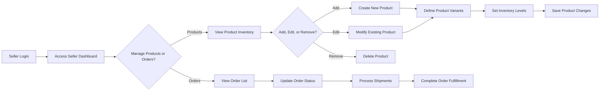
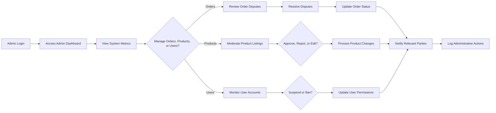

# E-commerce Shopping Mall Platform Requirements Analysis

## 1. Executive Summary

This document provides a comprehensive analysis of business requirements for an e-commerce shopping mall platform. The system will enable customers to browse products, manage shopping carts and wishlists, place orders, track shipments, and leave product reviews. Additionally, it will provide sellers with tools to manage their products and inventory, and administrators with comprehensive dashboard capabilities to oversee all platform operations.

The platform will support multiple user roles including customers, sellers, and administrators. It will feature a robust product catalog with search functionality, detailed product variants (SKU) management, secure payment processing, and real-time order tracking.

## 2. Business Model and Value Proposition

### 2.1 Why This Service Exists

THE e-commerce platform SHALL serve as a digital marketplace that connects buyers with sellers, enabling convenient online shopping experiences while providing business opportunities for vendors to showcase and sell their products to a wider audience.

### 2.2 Value Proposition

- For Customers: Easy access to diverse products with detailed information, convenient shopping experience with cart and wishlist functionality, secure payment processing, and order tracking
- For Sellers: Platform to showcase products with variant options, inventory management tools, and order processing capabilities
- For Administrators: Comprehensive oversight tools for managing products, orders, and users across the platform

### 2.3 Market Analysis

THE platform SHALL target a broad consumer base seeking online shopping convenience, competing with established marketplaces by providing superior user experience and seller tools.

### 2.4 Revenue Strategy

THE platform SHALL generate revenue through transaction fees on sales, premium seller account subscriptions, and promotional product placements.

### 2.5 Success Metrics

- Monthly active users (MAU)
- Daily active users (DAU)
- Conversion rate from browsing to purchase
- Average order value
- Customer retention rate
- Seller satisfaction metrics
- Platform uptime and performance metrics

## 3. User Roles and Authentication

### 3.1 Customer Role

THE customer role SHALL represent registered users who can browse products, manage shopping carts and wishlists, place orders, track shipments, and leave product reviews.

### 3.2 Seller Role

THE seller role SHALL represent business users who can manage their own products, handle inventory per SKU, and process customer orders.

### 3.3 Admin Role

THE admin role SHALL represent system administrators who can manage all products, orders, users, and system settings across the platform.

### 3.4 Role Permissions Matrix

| Functionality | Customer | Seller | Admin |
|---------------|----------|--------|-------|
| Browse products | ✅ | ✅ | ✅ |
| Search products | ✅ | ✅ | ✅ |
| Manage cart/wishlist | ✅ | ❌ | ❌ |
| Place orders | ✅ | ❌ | ❌ |
| Track orders | ✅ | ❌ | ✅ |
| Manage own products | ❌ | ✅ | ✅ |
| Manage all products | ❌ | ❌ | ✅ |
| Handle inventory | ❌ | ✅ | ✅ |
| Process orders | ❌ | ✅ | ✅ |
| Manage all orders | ❌ | ❌ | ✅ |
| Manage users | ❌ | ❌ | ✅ |
| Access admin dashboard | ❌ | ❌ | ✅ |

## 4. Functional Requirements

### 4.1 Customer Features

#### Registration and Authentication

WHEN a guest user accesses the platform, THE system SHALL provide registration and login functionality using email and password.

WHEN a customer registers, THE system SHALL verify the email address through a confirmation link sent to the provided email.

IF a customer forgets their password, THEN THE system SHALL provide a password reset functionality that sends a recovery link to their verified email address.

#### Address Management

WHEN a customer accesses their account settings, THE system SHALL allow them to add, edit, and remove shipping and billing addresses.

THE system SHALL validate address information to ensure completeness and proper formatting before saving.

#### Product Catalog and Search

WHEN a customer browses the platform, THE system SHALL display products organized by categories.

WHEN a customer uses the search functionality, THE system SHALL enable searching by product name, description, category, brand, and price range.

WHERE advanced search is available, THE system SHALL allow filtering by attributes such as color, size, and other variant options.

#### Product Details and Variants

WHEN a customer views a product page, THE system SHALL display all available variants (colors, sizes, options) with corresponding prices and availability status.

THE system SHALL update product information instantly when a customer selects different variants.

#### Shopping Cart

WHEN a customer adds a product to their cart, THE system SHALL display a confirmation notification and update the cart summary immediately.

WHEN a customer views their cart, THE system SHALL show all items with quantities, prices, and available variants.

THE system SHALL automatically save cart contents for authenticated users between sessions.

IF a product in the cart becomes unavailable, THEN THE system SHALL notify the customer and provide alternatives or removal options.

#### Wishlist

WHEN a customer adds a product to their wishlist, THE system SHALL save this preference indefinitely or until manually removed.

THE system SHALL allow customers to move items from wishlist to cart with a single action.

#### Order Placement

WHEN a customer initiates checkout, THE system SHALL validate all required information including shipping address, billing address, and payment method.

WHEN a customer places an order, THE system SHALL generate a unique order number and confirmation email within 5 seconds.

THE system SHALL calculate and display all costs including item prices, taxes, shipping fees, and discounts before finalizing the order.

#### Payment Processing

WHEN a customer selects a payment method, THE system SHALL securely process the transaction using industry-standard encryption.

THE system SHALL support major credit cards and popular digital payment methods.

IF a payment transaction fails, THEN THE system SHALL display a clear error message and allow retry with different payment information.

#### Order Tracking and History

WHEN a customer accesses their account, THE system SHALL display their complete order history with dates and status information.

WHEN a customer views an order detail page, THE system SHALL show real-time tracking information including shipping status updates.

WHERE an order is eligible for cancellation, THE system SHALL allow customers to submit cancellation requests which are processed within 24 hours.

#### Product Reviews and Ratings

WHEN a customer purchases a product, THE system SHALL allow them to submit a review and rating after delivery confirmation.

THE system SHALL validate that reviews contain between 10-1000 characters and ratings are whole numbers between 1-5.

IF a customer attempts to submit multiple reviews for the same product, THEN THE system SHALL prevent duplicate submissions.

### 4.2 Seller Features

#### Product Management

WHEN a seller accesses their dashboard, THE system SHALL allow them to add new products with detailed descriptions, images, categories, and pricing information.

WHEN a seller edits a product, THE system SHALL update information instantly across all relevant pages within 10 seconds.

THE system SHALL allow sellers to organize products into custom categories for their storefront.

#### SKU and Variant Management

WHEN a seller creates a product, THE system SHALL support defining multiple variants with attributes like color, size, and material.

THE system SHALL enable sellers to set unique prices, images, and inventory levels for each product variant.

IF inventory for a specific SKU reaches zero, THEN THE system SHALL automatically update the availability status to "out of stock".

#### Inventory Management

WHEN a seller accesses inventory controls, THE system SHALL display current stock levels for all product variants.

WHEN inventory is updated by a seller, THE system SHALL reflect changes instantly on product display pages.

THE system SHALL send low stock alerts when inventory for any SKU falls below seller-defined thresholds.

#### Order Processing

WHEN a customer places an order for a seller's product, THE system SHALL notify the seller within 1 minute.

WHEN a seller views pending orders, THE system SHALL display customer information, ordered items, and shipping addresses.

THE system SHALL allow sellers to update order status from "processing" to "shipped" when fulfillment is complete.

### 4.3 Admin Features

#### Dashboard Overview

WHEN an admin logs into their account, THE system SHALL display a comprehensive dashboard with key metrics including total sales, order volume, user registrations, and product counts.

THE admin dashboard SHALL provide quick access to all management sections including orders, products, users, and system settings.

#### Order Management

WHEN an admin accesses the order management section, THE system SHALL display all orders across the platform with filtering capabilities by date, status, customer, and seller.

THE system SHALL allow admins to view detailed order information including customer data, payment details, and shipping status.

IF an order dispute arises, THEN THE system SHALL provide admins with tools to investigate and resolve issues including payment refunds if necessary.

#### Product Management

WHEN an admin accesses the product management section, THE system SHALL display all products on the platform organized by category and seller.

THE system SHALL allow admins to approve, reject, or modify any product information for quality control and policy compliance.

IF a product violates platform policies, THEN THE system SHALL enable admins to remove it immediately with notification to the seller.

#### User Management

WHEN an admin accesses the user management section, THE system SHALL display all registered users, sellers, and admins with account status information.

THE system SHALL allow admins to suspend or permanently ban user accounts that violate terms of service.

IF suspicious activity is detected, THEN THE system SHALL alert admins with detailed activity logs for investigation.

#### Reporting Features

WHEN an admin accesses reporting tools, THE system SHALL generate sales reports, user activity metrics, and inventory analytics on demand.

THE system SHALL allow admins to export reports in standard formats including CSV, PDF, and JSON.

WHERE custom reporting is needed, THE system SHALL provide date range and category filtering capabilities.

## 5. System Workflows

### 5.1 Customer Purchase Journey

```mermaid
graph LR
  A["Browse Products"] --> B{"Search or Filter?"}
  B -->|"Search"| C["Use Search Function"]
  B -->|"Browse"| D["Navigate Categories"]
  C --> E["View Product Results"]
  D --> E
  E --> F["Select Product"]
  F --> G["View Product Details"]
  G --> H["Choose Variants"]
  H --> I{"Add to Cart or Wishlist?"}
  I -->|"Cart"| J["Add to Shopping Cart"]
  I -->|"Wishlist"| K["Save to Wishlist"]
  J --> L["Proceed to Checkout"]
  K --> M["Move to Cart Later"]
  L --> N["Enter Shipping Info"]
  N --> O["Select Payment Method"]
  O --> P["Confirm Order"]
  P --> Q["Receive Order Confirmation"]
  Q --> R["Order Processing"]
  R --> S["Shipping and Delivery"]
  S --> T["Leave Product Review"]
```

### 5.2 Seller Product Management Flow

### 5.3 Admin Management Workflow

## 6. Business Rules and Constraints

### 6.1 Authentication Rules

- Passwords SHALL contain at least 8 characters with a mix of letters, numbers, and special characters
- Email addresses SHALL follow standard format validation before account creation
- Accounts SHALL require email verification before becoming fully active
- User sessions SHALL remain active for 30 days before requiring re-authentication

### 6.2 Product Management Rules

- Product names SHALL be between 5-100 characters in length
- Product descriptions SHALL support up to 5000 characters
- Each product SHALL support up to 50 variant options
- Product images SHALL be in standard formats (JPEG, PNG) with maximum size of 5MB

### 6.3 Order Processing Rules

- Orders SHALL be automatically cancelled if payment is not completed within 30 minutes
- Sellers SHALL have 24 hours to acknowledge orders before system escalation
- Shipping status SHALL be updated at least every 24 hours during transit
- Refund requests SHALL be processed within 5 business days of approval

### 6.4 Review and Rating Rules

- Customers SHALL only be able to review products they have purchased
- Reviews SHALL be subject to moderation before public display
- Duplicate reviews from the same customer SHALL not be permitted
- Ratings SHALL be whole numbers between 1 and 5 inclusive

## 7. Performance Requirements

### 7.1 Response Time Requirements

- Product search results SHALL appear within 2 seconds of query submission
- Page loads for product listings SHALL complete within 3 seconds
- Cart updates SHALL reflect immediately with visual confirmation
- Order confirmations SHALL be generated and sent within 5 seconds

### 7.2 Capacity Requirements

- THE system SHALL support up to 10,000 concurrent users
- Product catalog SHALL scale to accommodate 100,000+ unique products
- Search functionality SHALL handle 1,000+ queries per second
- Order processing SHALL support 1,000+ transactions per hour

### 7.3 Availability Requirements

- THE platform SHALL maintain 99.9% uptime during business hours
- Maintenance windows SHALL be scheduled during low-traffic periods
- THE system SHALL automatically retry failed operations up to 3 times

## 8. Error Handling and Recovery

### 8.1 Authentication Errors

IF a customer enters invalid login credentials, THEN THE system SHALL display a clear error message and suggest password recovery.

IF registration information is incomplete, THEN THE system SHALL highlight missing fields and prevent form submission.

### 8.2 Payment Processing Errors

IF a payment transaction is declined, THEN THE system SHALL inform the customer and provide alternative payment options.

IF payment processing times out, THEN THE system SHALL notify the customer and preserve cart contents for retry.

### 8.3 Inventory Errors

IF a customer attempts to add more items to cart than available inventory, THEN THE system SHALL limit quantity to available stock.

IF inventory information is inconsistent across systems, THEN THE system SHALL prioritize accurate stock levels and notify relevant parties.

### 8.4 Order Processing Errors

IF an order cannot be fulfilled due to inventory issues, THEN THE system SHALL automatically cancel the order and process refunds.

IF shipping information cannot be tracked, THEN THE system SHALL display a notification to the customer and manually follow up.

## 9. Future Considerations

### 9.1 Platform Expansion

THE system SHALL be designed to accommodate additional payment methods including cryptocurrency and buy-now-pay-later services.

THE platform SHALL support multi-language and multi-currency functionality for international expansion.

### 9.2 Enhanced Features

THE system SHALL be extensible to support product recommendations based on browsing and purchase history.

THE platform SHALL accommodate integration with social media and influencer marketing tools.

### 9.3 Technical Evolution

THE system SHALL follow a microservices architecture to support modular growth.

THE platform SHALL implement real-time notifications for order status updates.

> *Developer Note: This document defines **business requirements only**. All technical implementations (architecture, APIs, database design, etc.) are at the discretion of the development team.*