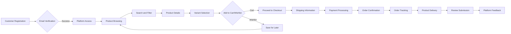
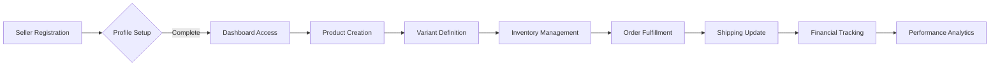
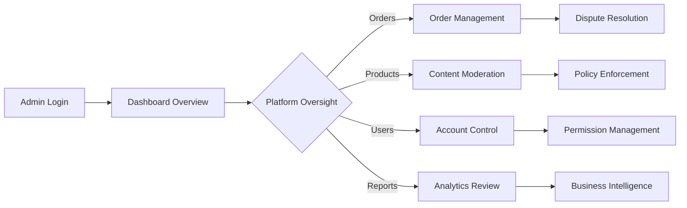

# E-commerce Shopping Mall Platform - Requirements Analysis

## 1. Service Overview and Business Model

### Platform Purpose and Market Justification
The e-commerce platform serves as a digital marketplace connecting buyers with sellers to facilitate convenient online shopping experiences. This platform addresses market demand for diverse product access with reliable vendor management capabilities.

WHEN consumers seek convenient online shopping experiences, THE ecommerce platform SHALL connect them with diverse product sellers to fulfill their purchasing needs across multiple categories.

WHEN users access the platform homepage, THE system SHALL display featured products, category navigation, and user account options.

THE platform SHALL organizes products into hierarchical categories to facilitate browsing (e.g., Electronics > Smartphones > Android Phones).

### Revenue Strategy
THE platform SHALL generate revenue through:
- Transaction fees from seller sales (typically 5-15% of sale price)
- Premium seller account subscriptions with enhanced features
- Advertising revenue from featured product placements
- Monthly subscription tiers for sellers based on inventory capacity

### Growth Plan
THE platform SHALL acquire users through:
1. Social media marketing targeting online shoppers
2. Search engine optimization for product categories
3. Partnership programs with popular brands and sellers
4. Referral incentives for existing users
5. Seasonal promotional campaigns

THE platform SHALL retain users by providing:
1. Personalized product recommendations based on browsing history
2. Competitive pricing and frequent promotions
3. Reliable order tracking and responsive customer support
4. Community features including reviews and wishlists

### Success Metrics
THE platform SHALL measures success through these key performance indicators:
- Monthly active users (MAU) with target of 50,000+ within first year
- Daily transactions with target of 5,000+ within first year
- Seller retention rate maintained above 85% annually
- Customer satisfaction rating preserved at 4.5+ stars
- Gross merchandise value (GMV) achieving $2M+ monthly

## 2. User Roles and Authentication System

### Customer Role Definition
WHEN users register as customers, THE system SHALL provides capabilities to:
- Browse and search the complete product catalog
- View detailed product information including variants
- Add products to shopping cart with quantity selection
- Save products to wishlist for later consideration
- Place orders and process secure payments
- Track real-time order status and shipment information
- Submit product reviews and ratings after purchase
- Manage personal profile and multiple shipping addresses

### Seller Role Definition
WHEN users register as sellers, THE system SHALL provides capabilities to:
- Register and create detailed seller profiles with business information
- List products with comprehensive descriptions and multiple images
- Define product variants with SKU-level inventory tracking
- Set variant-specific pricing and promotional discounts
- View and fulfill orders placed for their products
- Update shipment status with tracking information
- Access sales analytics and performance reports
- Respond professionally to customer reviews

### Admin Role Definition
WHEN users access as administrators, THE system SHALL provides capabilities to:
- Manage all user accounts including customers and sellers
- Moderate all product listings and enforce platform policies
- Oversee order processing and handle customer disputes
- Process refund requests with financial verification
- Configure system-wide settings and promotional campaigns
- Generate business reports with custom date ranges
- Moderate user-generated content and reviews

### Authentication Workflows

#### Registration Process
WHEN a guest user accesses the registration page, THE system SHALL present email and password fields with role selection options.

WHEN a user submits registration information, THE system SHALL validate:
- Email format using standard email validation patterns
- Password complexity with minimum 8 characters including mixed case and numbers
- Role selection with appropriate account creation path
- Duplicate email verification against existing accounts

IF email format is invalid OR password doesn't meet complexity requirements, THEN THE system SHALL displays specific validation errors without revealing which criteria failed.

THE system SHALL sends verification email with activation link within 1 minute of registration submission.

WHEN a user clicks the verification link, THE system SHALL activates their account if the link is valid and not expired.

#### Login Requirements
WHEN a user submits login credentials through email and password, THE system SHALL authenticate their identity within 2 seconds.

WHEN authentication succeeds, THE system SHALL generates JWT tokens with appropriate role permissions and redirects to role-specific dashboard.

IF authentication fails after 3 consecutive attempts, THEN THE system SHALL temporarily locks the account for 15 minutes and notifies the user by email.

#### Session Management
THE user session SHALL remain active for 30 days of inactivity with refresh token implementation.

THE system SHALL maintains separate sessions for different devices and browsers without interference.

WHEN a user logs out actively, THE system SHALL invalidates current session tokens immediately while preserving other device sessions.

WHEN suspicious activity is detected through multiple geographic logins, THE system SHALL automatically terminates sessions and requires re-authentication.

#### Password Recovery
WHEN a user requests password reset through forgotten password link, THE system SHALL sends verification email with reset instructions to their registered address.

WHEN a user clicks password reset link, THE system SHALL allows them to set a new password if the link is valid and not expired after 24 hours.

WHEN password change succeeds, THE system SHALL sends confirmation email and automatically logs out all other sessions.

### Permission Matrix Definition

#### Role Access Permissions
| Functionality | Customer | Seller | Admin |
|---------------|----------|--------|-------|
| Browse products | ✅ | ✅ | ✅ |
| Search products | ✅ | ✅ | ✅ |
| View product details | ✅ | ✅ | ✅ |
| Add to cart/wishlist | ✅ | ❌ | ❌ |
| Place orders | ✅ | ❌ | ❌ |
| Track shipments | ✅ | ❌ | ✅ |
| Leave reviews | ✅ | ❌ | ❌ |
| Manage own products | ❌ | ✅ | ✅ |
| Set inventory levels | ❌ | ✅ | ✅ |
| Process orders | ❌ | ✅ | ✅ |
| Manage all products | ❌ | ❌ | ✅ |
| Moderate content | ❌ | ❌ | ✅ |
| Manage user accounts | ❌ | ❌ | ✅ |
| Generate system reports | ❌ | ❌ | ✅ |

## 3. Core Functional Modules

### Product Catalog and Search System

#### Product Information Structure
THE system SHALL stores product information including:
- Product name with maximum 100 characters
- Product description with maximum 2000 characters
- Product images with up to 10 high-quality photos
- Base price in USD with cent precision
- Category association with 3-level hierarchy
- Brand information with manufacturer details
- Availability status with real-time inventory reflection
- Average rating and total review count

WHEN displaying product information, THE system SHALL presents at minimum all required fields to customers.

THE system SHALL supports optional product information fields including:
- Product specifications as key-value pairs with custom attributes
- Warranty information with duration and terms
- Product dimensions and weight for shipping calculation
- Related products suggestions based on category and purchase history

#### Category Management
THE system SHALL organizes products into a hierarchical category structure with:
- Primary categories (e.g., Electronics, Clothing, Home & Garden)
- Secondary categories (subcategories like Smartphones under Electronics)
- Tertiary categories (specific classifications like Android Phones)
- Support for up to 5 category levels maximum

WHEN customers navigate product categories, THE system SHALL display sub-categories in prominent navigation bars.

THE system SHALL allow administrators to create, modify, and delete categories through dashboard management.

#### Product Search and Discovery
WHEN a customer enters search terms through the search bar, THE system SHALL returns relevant products within 2 seconds.

THE system SHALL supports these search criteria:
- Text-based product name and description search with keyword matching
- Category filtering with hierarchical selection
- Price range filtering with predefined brackets ($0-$50, $50-$100, etc.)
- Brand filtering with manufacturer options
- Rating filtering with star-based thresholds (4+ stars, 3+ stars)
- Availability filtering to show only in-stock items
- Sorting options (price low-high, price high-low, popularity, newest)

THE system SHALL provides search suggestions as users type, displaying up to 10 relevant product names or categories.

IF a search query returns no matches, THEN THE system SHALL displays alternative suggestions:
- Similar product names with partial matching
- Related categories with broader classification
- Popular products in same primary category
- Trending items from verified sellers

### Product Variants and SKU Management

#### SKU System Design
THE system SHALL assign a unique SKU identifier to each product variant combination following format PRD-XXXXXX-YY:
- XXXXXX represents base product identifier with numeric sequence
- YY represents variant sequence number (01, 02, 03, etc.)
- Identifiers SHALL be generated automatically upon product creation

WHEN sellers create products with variants, THE system SHALL automatically generates unique SKUs for all combinations.

THE inventory tracking system SHALL maintains stock levels for each unique SKU rather than parent product.

#### Variant Attributes Structure
THE system SHALL supports these common product variant attributes with visual selectors:
- Color variants with color swatch display for immediate recognition
- Size variants with standard classifications (Small, Medium, Large, etc.)
- Material/Finish options with descriptive labels
- Configuration options (storage capacity, model variants)
- Custom attributes defined by sellers with text-based values

THE system SHALL allows sellers to define up to 5 variant attributes per product with unique combinations.

WHEN customers select product variants, THE system SHALL immediately updates:
- Displayed price with real-time variant-specific pricing
- Inventory count with SKU-level stock availability
- Product images if variant-specific photos exist
- Available quantity limits for purchase

#### Inventory Management Requirements
WHEN sellers update SKU inventory, THE system SHALL verifies quantities are non-negative integers.

THE system SHALL tracks inventory at the SKU level with real-time visibility to customers.

WHEN customers add items to cart, THE system SHALL locks that inventory for 15 minutes to prevent overselling.

THE inventory system SHALL sends automatic notifications to sellers when stock drops below configurable thresholds.

IF inventory for selected variant reaches zero, THEN THE system SHALL immediately:
- Updates product page to show "Out of Stock" status
- Disables "Add to Cart" button for that specific variant
- Notifies customers with alternative suggestions

### Shopping Experience Workflows

#### Cart Management System
WHEN customers add products to cart, THE system SHALL validates:
- Product availability for currently selected variant
- Inventory limits against requested quantity
- Session persistence for registered users
- Guest cart functionality for unregistered visitors

THE shopping cart system SHALL preserves items for registered users across sessions with automatic persistence.

THE system SHALL allows customers to modify cart contents including:
- Adjusting quantities of items with inventory validation
- Removing individual items with cart recalculation
- Saving items for later with wishlist transfer capability
- Applying discount codes with eligibility verification

WHEN cart contents change, THE system SHALL immediately updates total values and tax calculations.

#### Wishlist Functionality
THE system SHALL allows customers to save products to wishlist with unlimited item capacity.

WHEN customers add items to wishlist, THE system SHALL tracks these preferences for future reference.

THE system SHALL enables customers to move wishlist items to cart with single action transfer.

WHEN wishlist items experience price changes or stock status updates, THE system SHALL sends automated notifications.

#### Checkout Process
WHEN customers initiate checkout, THE system SHALL validates all cart requirements:
- Current inventory availability for all items
- Customer shipping and billing information completeness
- Shipping address format and postal validation
- Payment method selection with secure processing options

THE checkout system SHALL collects information including:
- Default or selected shipping address from customer profile
- Billing information matching payment method requirements
- Preferred shipping method with delivery timeframe
- Applied discount codes with eligibility verification

WHEN payment processing completes successfully, THE system SHALL generates:
- Unique order ID with format ORD-YYYYMMDD-NNNN
- Order confirmation email within 30 seconds
- Inventory decrement for purchased SKUs
- Seller notification with order details

#### Order Validation Policies
THE minimum order value SHALL be $5.00 before shipping charges are applied.

WHEN processing orders, THE system SHALL verifies:
- Product availability for all cart items against current stock
- Customer information completeness including addresses
- Payment information validation with secure token storage
- Pricing accuracy with correct tax and shipping calculations

WHEN order validation fails, THE system SHALL provides specific error messages:
- Inventory unavailability with alternative suggestions
- Incomplete address information with field-specific details
- Payment method errors without exposing sensitive data
- System-level failures with graceful retry mechanisms

### Order Processing Lifecycle

#### Order Status Transitions
THE system SHALL manages order through defined states with strict validation:
- "Pending" - Initial confirmation awaiting payment processing
- "Confirmed" - Payment received with order active for fulfillment
- "Processing" - Seller acknowledgment with preparation beginning
- "Shipped" - Package dispatched with tracking information
- "Delivered" - Customer receipt confirmation received
- "Completed" - Final status with no pending actions
- "Cancelled" - User or system initiated order cancellation
- "Refund Requested" - Customer initiated return process
- "Refunded" - Financial compensation processed

WHEN order status changes, THE system SHALL automatically:
- Notifies relevant parties (customer, seller) via email
- Updates real-time status tracking for all participants
- Adjusts inventory levels when appropriate
- Generates activity logs for administrative tracking

#### Tracking System Implementation
WHEN customers access order tracking, THE system SHALL displays:
- Real-time status updates with timestamp precision
- Expected delivery dates based on shipping method
- Carrier information with branded tracking links
- Geographic location of package during transit

THE tracking system SHALL integrates with major carriers including FedEx, UPS, and USPS.

WHEN tracking information updates from carriers, THE system SHALL refreshes within 1 hour of changes.

#### Order History Features
THE system SHALL maintains complete order history for customers with:
- Chronological organization showing newest orders first
- Comprehensive search functionality by date and status
- Order summary showing items, total value, and status
- Detailed view with product images and descriptions

WHEN customers access order history, THE system SHALL loads page within 3 seconds:
- Order ID with transaction timestamp
- Product list with variant specifications
- Status history with progression tracking
- Total spend with payment breakdown

#### Cancellation and Refund Workflows
WHEN customers request order cancellation, THE system SHALL evaluates eligibility:
- Within 1 hour of placement for automatic processing
- Before shipment confirmation for seller consultation
- After shipping with carrier return coordination

THE refund processing system SHALL supports these methods:
- Original payment method with automated return
- Platform credit for future purchases
- Gift card issuance with unique codes

WHEN refunds process successfully, THE system SHALL automatically:
- Restores inventory for returned products
- Sends completion notification to customer within 1 minute
- Updates seller financial reporting
- Provides tracking for physical returns

## 4. Payment Processing Workflows

### Payment Method Integration
THE system SHALL supports multiple payment methods with standard integration:
- Credit and debit cards including Visa, Mastercard, American Express
- Digital wallets like PayPal, Apple Pay, Google Pay
- Bank transfers with verification mechanisms
- Buy-now-pay-later services with third-party partnerships

WHEN users select payment method, THE system SHALL validates required information formats.

### Transaction Security Protocols
THE system SHALL encrypts all payment information using TLS 1.3 protocols in transit.

WHEN processing payments, THE system SHALL not store sensitive financial data:
- Uses tokenization for temporary transaction references
- Integrates with PCI DSS compliant payment processors
- Implements fraud detection through pattern analysis

THE authentication system SHALL protects sensitive account information:
- Passwords with bcrypt hashing and 12 salt rounds
- Session tokens with JWT implementation and refresh capability
- Rate limiting to prevent brute force access attempts

### Payment Validation Process
WHEN customers submit payment information, THE system SHALL validates:
- Card format using Luhn algorithm verification
- Expiration dates with future date requirements
- CVV codes with 3-4 digit validation
- Billing address matching card registration

IF payment validation fails, THEN THE system SHALL displays:
- Generic error messages without exposing card details
- Retry capability with preserved cart contents
- Alternative payment method suggestions

### Order Confirmation System
WHEN payments successfully process, THE system SHALL completes transactions:
- Generates unique order numbers with timestamp reference
- Sends confirmation emails to customers within 30 seconds
- Updates inventory counts in real-time synchronization
- Notifies sellers with new order alerts and details

THE confirmation system SHALL maintains transaction integrity through:
- Atomic operations preventing partial order creation
- Rollback procedures during system failures
- Logging for all completed financial transactions

## 5. Review and Rating System

### Review Submission Workflows
WHEN customers access product pages after purchase, THE system SHALL displays:
- "Write Review" button for eligible products with purchase verification
- Rating selector with 1-5 star options
- Title and description text fields with character limits
- Photo upload capability with image formatting

THE review system SHALL validates submission criteria:
- Purchased products only with transaction verification
- Character limits with minimum 20 and maximum 500 characters
- Star ratings with 1-5 whole number constraint
- Image uploads with acceptable format verification

WHEN reviews submit successfully, THE system SHALL processes:
- Automatic content moderation with profanity filtering
- Queue management with administrator review capability
- Unique identifiers for tracking and editing permissions
- Timestamped publication with user attribution

### Rating Calculation and Management
THE system SHALL calculates product ratings as weighted averages:
- All approved customer ratings with equal weighting
- Display precision rounded to single decimal point
- Real-time updates with new submission processing

THE rating display system SHALL shows multiple information points:
- Average star value with visual representation
- Total review count with contributor attribution
- Distribution analysis with per-star quantity
- Recent review trends with chronological tracking

#### Review Content Validation
THE system SHALL implements automated content filtering for:
- Profanity detection with dictionary matching
- Spam identification with repeated pattern analysis
- Inappropriate content with policy guideline matching
- Duplicate submissions with similarity detection

WHEN content filtering flags submissions, THE system SHALL routes:
- Pending review status for administrator moderation
- Notification through dashboard alerts and email updates
- Temporary hiding until validation completes
- Logging for repeated policy violations

### Moderation System Workflows
THE administrative panel SHALL provides tools for:
- Complete review queue with filtering capabilities
- Approval mechanisms with one-click processing
- Rejection procedures with reason categorization
- Editing functions for administrator adjustment

WHEN administrators moderate content, THE system SHALL tracks:
- Action timestamps with responsible personnel identification
- Reason codes for rejection with customer notification
- Approval statistics with performance metrics
- Recurring issues with seller pattern analysis

### Display and Organization Features
WHEN product pages load, THE system SHALL organizes reviews by:
- Most helpful votes with community-driven ranking
- Highest rated with preference for positive feedback
- Most recent with chronological display option
- Verified purchases with indicator visibility

THE product detail display SHALL shows concise review information:
- Top 3 customer reviews with high helpfulness scores
- Visual star representation with partial fills
- Review title with summary information
- Customer name with anonymous option preservation

## 6. Administrative Functions

### Dashboard Overview and Metrics
WHEN administrators access the dashboard, THE system SHALL loads performance metrics:
- Daily order volume with visualization charts
- Revenue tracking with historical comparison
- User registration trends with geographic distribution
- Product listing statistics with category breakdown

THE dashboard interface SHALL refreshes data every 5 minutes:
- Real-time order status monitoring
- Financial summaries with currency presentation
- Seller performance with ranking algorithms
- Platform health indicators with error rate tracking

### User Management Systems
THE administrative panel SHALL provides tools for:
- Complete user database with search functionality
- Account status modification with temporary suspension
- Password reset capability with security notifications
- Role assignment and permission changes for access control

WHEN user issues arise, THE system SHALL logs:
- Support ticket creation with automatic categorization
- Resolution tracking with assigned personnel
- Customer satisfaction with follow-up surveys
- Pattern analysis for recurring problems

#### Product Management and Oversight
THE administrator SHALL reviews all new product listings:
- Content policy compliance with image and description standards
- Category placement accuracy with hierarchical validation
- Pricing verification with competitive market alignment
- Inventory setup with variant tracking validation

WHEN products violate policies, THE system SHALL implements:
- Immediate hiding from customer visibility
- Seller notification with violation explanation
- Appeal process with documentation requirements
- Repeated violation tracking with account escalation

### Reporting and Analytics
THE system SHALL generates standard business reports:
- Daily sales summary with product breakdown
- Monthly revenue analysis meeting accounting standards
- Inventory tracking with low stock alerts
- User engagement metrics with retention calculations

WHEN custom reports request, THE system SHALL filter:
- Specific date ranges with calendar integration
- Category or seller based selections
- Performance metrics with comparative analysis
- Export formats including CSV, PDF, and JSON

#### System Configuration Controls
THE administrative panel SHALL manages configurations:
- Platform settings with real-time implementation
- Category structure with hierarchical organization
- Pricing rules with commission calculations
- Notification templates with automated messaging

## 7. Business Rules and Constraints

### Product Management Rules
THE system SHALL enforces product information constraints:
- Product names between 5-100 characters without special codes
- Descriptions maximum 2000 characters with plain text
- Images with JPEG, PNG, GIF formats and 5MB maximum
- Category requirements with minimum one selection

WHEN sellers update content, THE system SHALL validates compliance against predetermined rules.

THE inventory management system SHALL prevents negative stock values with validation enforcement.

### Order Processing Standards
THE minimum transaction value SHALL is $5.00 before shipping fees:
- Cart validation preventing sub-minimum orders
- Automatic notification for insufficient values
- Alternative product suggestions for value increases

THE maximum order quantities SHALL is limited to 99 units per product:
- Cart validation with real-time availability
- Customer notification for maximum quantity rules
- Exception handling for special seller arrangements

WHEN shipping addresses process, THE system SHALL validates:
- Complete information including street, city, state, zip
- Country restrictions following business model
- Format compliance with geographic standards
- Delivery capability through carrier partnerships

### Financial Constraint Policies
THE refund processing system SHALL only operates within 30 days of delivery:
- Automated eligibility checking with date comparison
- Customer notifications for time window expiration
- Exception handling for damaged merchandise reporting
- Administrator override capability for special cases

THE subscription management system SHALL enforces tier limits:
- Product count restrictions matching payment tiers
- Automatic upgrade prompts for exceeded limits
- Grace periods with suspension prevention
- Renewal tracking with cancellation prevention

### User Content Policies
THE review system SHALL monitors content submission:
- Duplicate prevention with similarity checking
- Profanity filtering with standard dictionary
- Formatting requirements with 20 character minimum
- Purchase verification with transaction matching

THE communication system SHALL filters user messages:
- Spam detection with repeated pattern analysis
- Inappropriate content with policy matching
- Privacy protection for personal information
- Security implementation for harmful links

## 8. Error Handling and Recovery Procedures

### Authentication Error Management
IF login credentials fail validation, THEN THE system SHALL displays:
- Generic error message without exposed field information
- Account lock warning with attempt counting
- Password recovery link with automated process
- Error logging with security monitoring

WHEN registration information is incomplete, THE system SHALL requires:
- Valid email format with standard validation
- Complex password with minimum requirements
- Agreement acceptance with terms confirmation
- Verification completion with email confirmation

### Payment Processing Failures
IF payment processing fails, THEN THE system SHALL preserves:
- Complete cart contents with session saving
- Customer progress with interrupted transaction
- Retry opportunities with alternative methods
- Error specific messaging without data exposure

WHEN payment gateways are unavailable, THE system SHALL implements:
- Automatic failover with alternative processor selection
- Customer notifications with expected restoration
- Transaction queuing for delayed processing
- Administrative alerts for system health monitoring

### Inventory Error Resolution
IF inventory counts are insufficient during checkout, THEN THE system SHALL processes:
- Real-time notifications for cart modifications
- Alternative product suggestions with similar features
- Waiting list implementation for restock notifications
- Seller alerts with low stock warnings

WHEN inventory systems mismatch, THE system SHALL reconciles through:
- Automatic synchronization with database updates
- Seller notification with discrepancy explanation
- Customer holding with temporary reservation
- Audit logging with system monitoring

### Order Management Errors
IF order fulfillment is delayed, THEN THE system SHALL communicates:
- Customer notification with revised timeline
- Seller coordination with fulfillment requirements
- Carrier integration with tracking requirements
- Administrator escalation with pattern monitoring

WHEN order modification conflicts arise, THE system SHALL resolves through:
- Status checking with eligibility requirements
- Customer confirmation with permission requirements
- Seller coordination with availability checking
- Historical logging with activity monitoring

## 9. Performance Requirements and Standards

### Response Time Metrics
WHEN users browse typical category pages, THE system SHALL loads within 2 seconds:
- Product listing with image rendering
- Filter application with real-time adjustment
- Pagination processing with navigation controls
- Interaction response with user feedback

WHEN customers search standard queries, THE system SHALL returns results within 1 second:
- Keyword matching with text analysis
- Category filtering with option application
- Sorting procedures with order organization
- Error handling for complex query processing

THE checkout process system SHALL verifies transactions within 5 seconds:
- Payment validation with security checking
- Inventory verification with stock confirmation
- Order creation with data storage
- Confirmation messaging with customer notification

### Scalability Requirements
THE platform SHALL accommodates concurrent access by:
- Minimum 10,000 simultaneous user browsing
- 1000 concurrent checkout operations
- Database scaling with traffic peaks
- Geographic distribution with global access

WHEN promotional events increase traffic, THE system SHALL automatically:
- Resource scaling with cloud infrastructure
- Database optimization with read caching
- Queue management with processing priority
- Error prevention with overload protection

### Data Reliability Standards
THE system SHALL maintains uptime reliability:
- 99.5% availability excluding scheduled maintenance
- 100% transaction completion for successful payments
- Data backup with daily frequency and point-in-time recovery
- Disaster recovery with geographic redundancy

### Mobile Responsiveness
THE platform SHALL provides mobile compatibility:
- Responsive design with device scaling
- Touch interface with gesture implementation
- Speed optimization with image compression
- Feature preservation with cross-platform consistency

## 10. System Integration and Future Enhancements

### Third-Party Integrations
THE e-commerce platform SHALL connects with established services:
- Shipping carrier APIs with real-time tracking
- Payment processors with transaction security
- Email services with delivery monitoring
- Analytics platforms with behavior tracking

WHEN integrations update, THE system SHALL implements version compatibility:
- API standardization with communication protocols
- Error handling for service disruptions
- Fallback procedures for critical dependencies
- Performance monitoring with service quality

### Enhancement Opportunities
THE platform design SHALL accommodates future features:
- Artificial intelligence with recommendation engines
- Multi-language support with translation services
- Augmented reality with product visualization
- Social features with community integration

WHERE user demands expand, THE system SHALL scales through:
- Modular architecture with microservices implementation
- API standardization for external developer access
- Data analytics with business intelligence upgrades
- Customer experience with interface personalization

