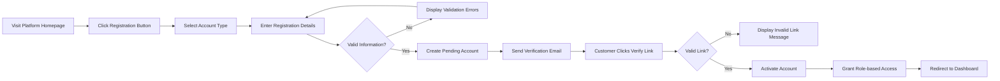
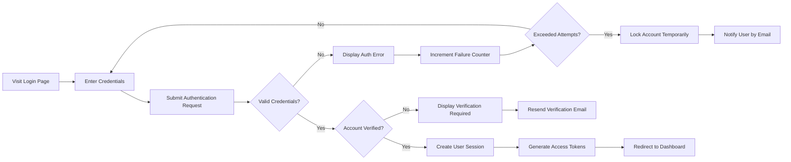

# E-commerce Platform Authentication and User Management Requirements

## 1. Service Overview

### Business Model Justification
THE e-commerce shopping mall platform SHALL serve as a digital marketplace connecting buyers with sellers to facilitate online retail transactions. This service enables convenient online shopping experiences while providing business opportunities for vendors to showcase and sell their products to a wider audience.

### Revenue Strategy
THE platform SHALL generate revenue through:
- Transaction fees on seller sales (typically 5-15% of sale price)
- Premium seller account subscriptions with enhanced features
- Advertising revenue from featured product placements
- Shipping fee partnerships with logistics providers

### Growth Plan
THE platform SHALL acquire users through:
1. Social media marketing targeting online shoppers
2. Search engine optimization for product categories
3. Partnership programs with popular brands and sellers
4. Referral incentives for existing users
5. Seasonal promotional campaigns

THE platform SHALL retain users by providing:
1. Personalized product recommendations
2. Competitive pricing and frequent promotions
3. Reliable order tracking and customer support
4. Community features like reviews and wishlists

### Success Metrics
THE platform SHALL measure success through:
- Monthly active users (MAU) target of 50,000+ within first year
- Daily transactions target of 5,000+ within first year
- Average order value target of $75+
- Customer retention rate target above 70%
- Gross merchandise value (GMV) target of $2M+ monthly
- Seller satisfaction rating target above 4.5/5.0 stars

## 2. User Role Definitions

### Customer Role
THE customer role SHALL represent registered users who can:
- Browse and search the complete product catalog
- View detailed product information including variants
- Add products to shopping cart and wishlist
- Place orders and process payments
- Track order status and shipping information
- Submit product reviews and ratings
- Manage personal information and shipping addresses

WHEN a user registers as a customer, THE system SHALL assign the "customer" role and provide access to customer-specific features only.

### Seller Role
THE seller role SHALL represent vendors who can:
- Register and create seller profiles
- List products with detailed information and images
- Define product variants with SKU-level inventory
- Manage pricing and stock levels per variant
- View and fulfill orders placed for their products
- Update order status and shipping information
- Access sales analytics and performance reports

WHEN a user registers as a seller, THE system SHALL assign the "seller" role and provide access to seller dashboard features.

### Admin Role
THE admin role SHALL represent system administrators who can:
- Manage all user accounts (customers and sellers)
- Oversee all product listings and categories
- Monitor and intervene in order processing
- Handle customer service issues and disputes
- Configure platform settings and policies
- Generate business reports and analytics
- Moderate product reviews and seller content

WHEN a user is granted admin privileges, THE system SHALL assign the "admin" role and provide access to administrative dashboard.

## 3. Role Hierarchy and Permissions Matrix

| Action | Customer | Seller | Admin |
|--------|----------|--------|-------|
| Browse products | ✅ | ✅ | ✅ |
| Search products | ✅ | ✅ | ✅ |
| View product details | ✅ | ✅ | ✅ |
| Add to cart/wishlist | ✅ | ❌ | ❌ |
| Place orders | ✅ | ❌ | ❌ |
| Track shipments | ✅ | ❌ | ❌ |
| Leave reviews | ✅ | ❌ | ❌ |
| Manage own products | ❌ | ✅ | ✅ |
| Set inventory levels | ❌ | ✅ | ✅ |
| Process own orders | ❌ | ✅ | ✅ |
| View sales reports | ❌ | ✅ | ✅ |
| Manage all products | ❌ | ❌ | ✅ |
| Manage all orders | ❌ | ❌ | ✅ |
| Manage all users | ❌ | ❌ | ✅ |
| Generate system reports | ❌ | ❌ | ✅ |
| Configure platform | ❌ | ❌ | ✅ |

## 4. Authentication System Requirements

### Registration Process
WHEN a guest user accesses the platform registration page, THE system SHALL present registration options for customer and seller accounts.

WHEN a user submits customer registration information, THE system SHALL validate:
- Email format matches standard email pattern
- Password is at least 8 characters with mixed case letters and numbers
- Email is not already registered in the system
- All required fields are completed

IF registration validation fails, THEN THE system SHALL display specific error messages for each failed validation criterion.

WHEN a user successfully completes registration, THE system SHALL create an account with pending verification status and send confirmation email within 1 minute.

### Login Requirements
WHEN a user submits valid email and password credentials, THE system SHALL authenticate the user and create an active session within 2 seconds.

WHEN a user submits invalid login credentials, THE system SHALL display generic authentication failure message without revealing if email exists in system.

IF a user enters invalid credentials 5 consecutive times, THEN THE system SHALL temporarily lock the account for 30 minutes and notify the user by email.

WHEN a user with an active session accesses protected features, THE system SHALL verify authentication status and allow access without re-authentication.

### Session Management
THE system SHALL maintain user sessions using JWT tokens with 30-minute expiration for access tokens.

THE system SHALL support refresh tokens with 30-day expiration to maintain persistent sessions.

WHEN a user accesses the platform with a valid refresh token, THE system SHALL automatically generate new access tokens without requiring re-authentication.

WHEN a user logs out, THE system SHALL invalidate current session tokens immediately and redirect to homepage.

WHEN session tokens expire during user activity, THE system SHALL automatically attempt refresh token renewal before prompting for re-authentication.

### Password Recovery
WHEN a user requests password reset through the login page, THE system SHALL verify the email exists in the database and send password reset link to that address within 30 seconds.

WHEN a user clicks password reset link, THE system SHALL validate the link expiration (24-hour validity) and present password change form if valid.

WHEN a user submits new password through reset form, THE system SHALL validate password complexity requirements and update account credentials.

IF password reset link is expired or invalid, THEN THE system SHALL display error message and provide option to request new reset link.

### Email Verification
WHEN a user registers, THE system SHALL send verification email with unique activation link within 1 minute.

WHEN a user clicks verification link, THE system SHALL activate account if link is valid and not expired (7-day validity).

IF email verification link is expired, THEN THE system SHALL display error message with option to request new verification email.

WHEN account is successfully verified, THE system SHALL grant full platform access based on assigned user role.

## 5. Address Management System

### Address Storage
THE system SHALL allow customers to store up to 10 shipping addresses in their profile.

WHEN a customer adds a new address, THE system SHALL validate:
- Street address is provided
- City is provided
- State/region is provided
- Postal code format matches country requirements
- Country selection is valid

IF address validation fails, THEN THE system SHALL highlight specific fields with validation errors and prevent saving.

### Default Address Selection
THE system SHALL allow customers to mark one address as default for shipping.

WHEN a customer places an order without specifying shipping address, THE system SHALL use their default address automatically.

WHEN a customer updates their default address, THE system SHALL apply the change to future orders immediately.

### Address Security
WHEN customer addresses are displayed, THE system SHALL only show them to authenticated owners or authorized administrators.

THE system SHALL encrypt address information at rest using industry-standard encryption protocols.

## 6. Account Management Features

### Profile Information
THE system SHALL store customer profile information including:
- Full name
- Phone number
- Date of birth (optional)
- Preferred language
- Notification preferences

WHEN a customer updates profile information, THE system SHALL validate data formats and save changes immediately.

### Account Security
THE system SHALL require password confirmation for sensitive account changes including:
- Email address modification
- Password change
- Payment method updates
- Account deletion requests

WHEN suspicious account activity is detected, THE system SHALL temporarily suspend access and require additional verification.

### Account Status Management
THE system SHALL maintain account statuses including:
- "active" - fully functional account
- "pending_verification" - registered but email not verified
- "suspended" - temporarily restricted access
- "deactivated" - voluntarily disabled by user
- "banned" - permanently restricted access

WHEN an administrator changes account status, THE system SHALL log the action with timestamp, admin ID, and reason.

WHEN an account status changes, THE system SHALL notify the account owner by email within 5 minutes.

## 7. Role-based Access Control

### Authentication Verification
WHEN users access role-specific features, THE system SHALL verify their assigned role has appropriate permissions before granting access.

IF a user attempts to access unauthorized features, THEN THE system SHALL redirect them to appropriate role-based dashboard.

### Feature Permissions
THE system SHALL prevent customers from accessing seller dashboard functions.

THE system SHALL prevent sellers from accessing administrative functions without explicit admin role assignment.

THE system SHALL prevent unauthorized role escalation attempts through form manipulation or parameter injection.

### Data Visibility
WHEN customers access order history, THE system SHALL only display orders associated with their account.

WHEN sellers access order management, THE system SHALL only display orders for their own products.

WHEN administrators access order information, THE system SHALL allow viewing of any order in the system.

## 8. Performance and Security Standards

### Authentication Response Times
WHEN users submit login credentials, THE system SHALL respond within 2 seconds under normal load conditions.

WHEN users register new accounts, THE system SHALL complete registration process within 3 seconds.

WHEN users request password reset, THE system SHALL send reset email within 30 seconds.

### Concurrent Session Handling
THE system SHALL support up to 5 concurrent sessions per user account.

WHEN users exceed maximum concurrent sessions, THE system SHALL terminate the oldest session automatically.

### Session Security
WHEN user sessions are managed, THE system SHALL regenerate session IDs after login to prevent session fixation attacks.

THE system SHALL implement rate limiting to prevent brute force attacks on authentication endpoints (maximum 10 attempts per minute).

THE system SHALL log authentication attempts for security monitoring.

### Data Protection
THE system SHALL encrypt all passwords using bcrypt hashing with salt rounds set to 12.

WHEN personal information is transmitted, THE system SHALL use HTTPS encryption with TLS 1.3.

THE system SHALL sanitize all user inputs to prevent injection attacks.

## 9. Error Handling and Recovery

### Registration Errors
IF email format is invalid during registration, THEN THE system SHALL display "Please enter a valid email address" message.

IF password requirements are not met, THEN THE system SHALL display specific password complexity requirements.

IF email is already registered, THEN THE system SHALL display "An account with this email already exists" message with login option.

### Login Errors
IF credentials are invalid during login, THEN THE system SHALL display "Invalid email or password" message.

IF account is locked due to failed attempts, THEN THE system SHALL display "Account temporarily locked. Please try again later or reset password" message.

IF account is not verified, THEN THE system SHALL display "Please verify your email address" message with resend option.

### Session Errors
IF session tokens are invalid or expired, THEN THE system SHALL redirect users to login page with appropriate messaging.

IF refresh token renewal fails, THEN THE system SHALL require full re-authentication.

### Recovery Process Errors
IF password reset request uses non-existent email, THEN THE system SHALL display generic "If account exists, reset instructions sent" message for privacy protection.

IF password reset link is invalid or expired, THEN THE system SHALL display "Invalid or expired reset link" with request new link option.

IF new password doesn't meet complexity requirements, THEN THE system SHALL display specific validation errors without exposing old password.

## 10. User Journey Workflows

### New Customer Registration Process

### Login Authentication Flow

### Password Reset Workflow

```mermaid
graph LR
  AD["Visit Password Reset Page"] --> AE["Enter Email Address"]
  AE --> AF["Submit Reset Request"]
  AF --> AG{"Email Exists?"}
  AG -->|"Yes"| AH["Generate Reset Token"]
  AH --> AI["Send Reset Email"]
  AI --> AJ["Customer Clicks Reset Link"]
  AJ --> AK{"Valid Token?"}
  AK -->|"No"| AL["Display Invalid Link"]
  AL --> AM["Offer New Reset Request"]
  AK -->|"Yes"| AN["Display Password Form"]
  AN --> AO["Enter New Password"]
  AO --> AP["Confirm New Password"]
  AP --> AQ{"Passwords Match?"}
  AQ -->|"No"| AR["Display Mismatch Error"]
  AR --> AO
  AQ -->|"Yes"| AS["Update Password"]
  AS --> AT["Invalidate Reset Token"]
  AT --> AU["Notify User of Change"]
  AU --> AV["Redirect to Login"]
```
