# E-commerce Shopping Mall Platform Requirements Analysis

## 1. Service Overview

### Business Model

#### Why This Service Exists
THE e-commerce platform SHALL provide a digital marketplace where customers can purchase products from multiple sellers, enabling convenient online shopping with diverse product selections and competitive pricing.

#### Revenue Strategy
THE platform SHALL generate revenue through:
- Transaction fees from sellers (percentage of each sale)
- Premium seller account subscriptions
- Featured product placement fees
- Advertising revenue from brand partnerships

#### Growth Plan
THE platform SHALL acquire users through:
- Search engine optimization for product listings
- Social media marketing campaigns
- Referral programs for both customers and sellers
- Strategic partnerships with major brands

#### Success Metrics
THE platform SHALL track these key performance indicators:
- Monthly active users (MAU)
- Gross merchandise value (GMV)
- Conversion rate from browsing to purchase
- Average order value
- Customer retention rate
- Seller satisfaction score

## 2. User Roles and Authentication

### Authentication Requirements

#### Registration Process
WHEN a guest completes the registration form, THE system SHALL create a new customer account with email verification requirement.

WHEN a user submits registration information, THE system SHALL validate:
- Email format matches standard email pattern
- Password is at least 8 characters
- Password contains at least one uppercase letter, lowercase letter, and number
- Email is not already registered in the system

#### Login Requirements
WHEN a user submits valid credentials, THE system SHALL authenticate and create a session for the user.

WHEN a user submits invalid credentials, THE system SHALL display an appropriate error message without revealing if the email exists in the system.

#### Session Management
THE system SHALL maintain user sessions using JWT tokens with 30-minute expiration for access tokens and 30-day expiration for refresh tokens.

#### Password Recovery
WHEN a user requests password reset, THE system SHALL send a password reset link to their registered email address.

WHEN a user clicks password reset link, THE system SHALL allow them to set a new password if the link is valid and not expired.

#### Email Verification
WHEN a user registers, THE system SHALL send a verification email within 1 minute.

WHEN a user clicks verification link, THE system SHALL activate their account if the link is valid.

### User Role Structure

#### Customer Role
THE customer role SHALL have permissions to:
- Browse product catalog
- Search and filter products
- View product details and variants
- Add products to shopping cart and wishlist
- Place orders and make payments
- Track order status
- Submit product reviews and ratings
- Manage shipping addresses
- View order history and request cancellations/refunds

WHEN a customer attempts to access administrative functions, THE system SHALL deny access and redirect to appropriate customer pages.

#### Seller Role
THE seller role SHALL have permissions to:
- Manage their own products and variants
- Set inventory levels per SKU
- Update product pricing
- View and process their orders
- Update order status
- Manage their store profile

WHEN a seller attempts to modify another seller's products, THE system SHALL deny access with appropriate error message.

#### Admin Role
THE admin role SHALL have permissions to:
- Manage all products in the catalog
- View and manage all orders
- Handle user accounts and resolve issues
- Moderate product reviews
- Access system analytics and reports
- Configure platform settings

WHEN an admin accesses the dashboard, THE system SHALL display summary information including total orders, revenue, and user statistics.

### Role Hierarchy and Permissions

| Action | Customer | Seller | Admin |
|--------|----------|--------|-------|
| Browse products | ✅ | ✅ | ✅ |
| Purchase products | ✅ | ✅ | ✅ |
| Manage own products | ❌ | ✅ | ✅ |
| Set inventory levels | ❌ | ✅ | ✅ |
| Process orders | ❌ | ✅ | ✅ |
| Manage all products | ❌ | ❌ | ✅ |
| Manage user accounts | ❌ | ❌ | ✅ |
| Access analytics dashboard | ❌ | ❌ | ✅ |
| Moderate reviews | ❌ | ❌ | ✅ |

## 3. Product Management System

### Product Information Structure
THE system SHALL store the following product information:
- Product name (maximum 100 characters)
- Product description (maximum 2000 characters)
- Base price in USD
- Product images (up to 10 images per product)
- Product category
- Product weight and dimensions
- Product specifications as key-value pairs

WHEN a seller adds a new product, THE system SHALL require all mandatory fields to be completed before allowing publication.

WHEN a customer views a product page, THE system SHALL display all product information in a clear, organized format.

### SKU System Design
THE system SHALL manage products through SKU (Stock Keeping Unit) identifiers for each unique product variant combination.

WHEN a product has multiple variants, THE system SHALL create a unique SKU for each possible variant combination.

THE system SHALL allow product variants with these attributes:
- Color options (up to 20 different colors)
- Size options (up to 30 different sizes)
- Material options (up to 15 different materials)
- Style options (up to 10 different styles)

WHEN a seller defines variants for a product, THE system SHALL automatically generate SKUs for all possible attribute combinations.

WHEN a customer selects different variant options, THE system SHALL display the corresponding SKU information including price and availability.

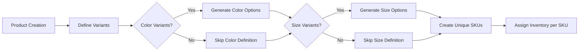

### Variant Attributes
THE system SHALL support these variant attribute types:
- Color variants: Red, Blue, Green, Black, White, etc.
- Size variants: Small, Medium, Large, XL, XXL, etc.
- Numeric sizing: Shoe sizes (US 6, US 7, etc.), waist measurements (32, 34, 36, etc.)
- Custom attributes: Pattern, finish, model year, etc.

WHEN a seller configures product variants, THE system SHALL validate that attributes are selected from system-defined options or newly created valid options.

WHEN a customer filters products by variant attributes, THE system SHALL return matching products within 2 seconds of search initiation.

### Inventory Tracking
THE system SHALL track inventory at the SKU level with real-time updates.

WHEN a customer adds an item to cart, THE system SHALL reserve inventory for 15 minutes during checkout process.

WHEN an order is placed successfully, THE system SHALL decrement the SKU inventory count by the ordered quantity.

WHEN inventory drops below 5 units, THE system SHALL automatically send low-stock notification to the seller.

WHEN a seller updates inventory levels, THE system SHALL reflect these changes immediately in product availability displays.

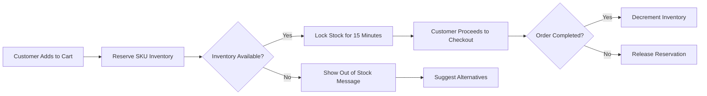

### Pricing by Variant
THE system SHALL support different pricing for each product variant SKU.

WHEN a seller sets different prices for variants, THE system SHALL display variant-specific pricing to customers.

WHEN a product variant price is updated, THE system SHALL apply changes immediately to all new transactions.

THE system SHALL calculate final price based on:
- Base variant price
- Any applicable discounts or promotions
- Shipping costs based on weight and destination
- Tax calculations based on customer location

WHEN a customer views a product, THE system SHALL display the base price of the default variant and indicate when other variants have different prices.

### Category Management
THE system SHALL organize products into hierarchical categories with:
- Primary categories (maximum 20)
- Secondary categories (subcategories of primary)
- Tertiary categories (subcategories of secondary, if needed)

WHEN a customer navigates to a category page, THE system SHALL display all products in that category and its subcategories.

WHEN a seller assigns products to categories, THE system SHALL validate that category selections are from the system-defined category tree.

### Search Functionality
WHEN a customer enters search terms, THE system SHALL return relevant products within 1 second.

THE system SHALL support search by:
- Product name
- Product description
- SKU identifiers
- Category names
- Brand names
- Product specifications
- Seller store names

WHEN a customer searches with multiple terms, THE system SHALL match all terms with decreasing relevance scores.

WHEN search returns no results, THE system SHALL suggest alternative search terms based on partial matches.

### Product Display Requirements
THE system SHALL display products on catalog pages with:
- Primary product image
- Product name
- Price (or "From $X" if variants have different prices)
- Average rating (rounded to nearest 0.5 stars)
- Number of reviews
- Seller information
- Available variants summary

WHEN a customer views product details, THE system SHALL display:
- All product images in gallery format
- Complete product description
- All available variants with selection interface
- Inventory status for selected variant ("In Stock", "Low Stock", "Out of Stock")
- Customer reviews and ratings with filtering capabilities
- Related products suggestions based on category and attributes

WHILE products are displayed in lists, THE system SHALL load 20 products per page with pagination controls.

WHEN a product is "Out of Stock", THE system SHALL hide the "Add to Cart" button and display appropriate messaging.

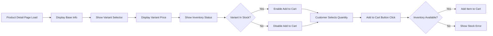

## 4. Shopping Experience Features

### Cart Management
WHEN a customer adds a product to cart, THE system SHALL validate inventory availability and reserve the item.

THE system SHALL allow customers to:
- View current cart contents with images and variant information
- Modify quantities of items within inventory limits
- Remove items from cart at any time
- Save cart for later access with account login
- Apply discount codes during checkout process

WHEN a customer modifies cart quantities, THE system SHALL validate available inventory and update cart totals immediately.

WHEN a customer applies a discount code, THE system SHALL validate the code and apply appropriate discounts to eligible cart items.

WHEN a customer proceeds to checkout, THE system SHALL validate that all items are still available in requested quantities.

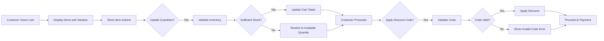

### Wishlist Functionality
THE system SHALL allow customers to:
- Add products to wishlist with selected variants
- View wishlist contents sorted by added date
- Move items from wishlist to cart with variant preservation
- Remove items from wishlist at any time
- Share wishlist with others through social media or email

WHEN a wishlist item becomes unavailable, THE system SHALL mark it as "Out of Stock" in the wishlist display.

WHEN a customer adds an item to wishlist that is already in cart, THE system SHALL allow both actions without conflict.

### Checkout Process
WHEN a customer initiates checkout, THE system SHALL:
- Validate all cart items are available
- Display shipping address options with default selection
- Calculate shipping costs based on weight and destination
- Present final order total with tax breakdown

THE system SHALL require customers to:
- Select or add shipping address with validation
- Choose shipping method from available options
- Confirm order details including variants and quantities before payment

WHEN a customer completes checkout without errors, THE system SHALL generate an order confirmation and send email notification.

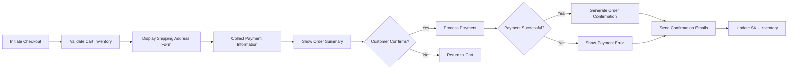

### Order Validation
WHEN an order is created, THE system SHALL validate:
- Product availability for all items in real-time
- Customer shipping address is valid and complete
- Payment information is complete and formatted correctly
- All required fields are filled according to business rules

WHEN order validation fails, THE system SHALL display specific error messages for each failed validation point.

## 5. Order Processing Workflow

### Order Lifecycle
THE system SHALL manage orders through these states:
1. "Pending" - Order placed but payment not confirmed
2. "Confirmed" - Payment received and order validated
3. "Processing" - Seller has acknowledged and is preparing order
4. "Shipped" - Order dispatched to customer with tracking
5. "Delivered" - Order received by customer confirmation
6. "Cancelled" - Order cancelled by customer or system
7. "Returned" - Order returned by customer with refund

WHEN an order transitions to "Confirmed" state, THE system SHALL send confirmation to both customer and seller.

WHEN an order transitions to "Shipped" state, THE system SHALL generate shipping notification with tracking information.

WHEN an order transitions to "Delivered" state, THE system SHALL trigger review request email to customer.

### Status Tracking
WHEN a customer views order details, THE system SHALL display current order status and estimated delivery date.

WHEN a seller updates order status, THE system SHALL automatically notify the customer of status changes with timestamp.

THE system SHALL provide real-time tracking updates including:
- Current location of shipment with status description
- Expected delivery timeline based on carrier data
- Carrier information with contact options
- Tracking number with external link capability

WHEN tracking information is updated by carrier, THE system SHALL refresh order status within 1 hour automatically.

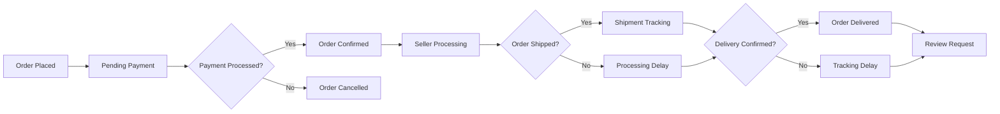

### Order History
THE system SHALL maintain complete order history for all customers indefinitely.

WHEN a customer accesses order history, THE system SHALL display:
- All past orders sorted by date (newest first)
- Order status for each transaction with color coding
- Order total and items purchased with variant details
- Links to reorder identical or similar items
- Option to download order receipts as PDF

WHEN a customer clicks order details, THE system SHALL show:
- Complete order breakdown with pricing
- Individual item prices and quantities with variants
- Applied discounts with calculation details
- Shipping and tax information with receipt
- Tracking information when available (with live updates)
- Review status for eligible delivered items

### Cancellation and Refund Process
WHEN a customer requests order cancellation within 1 hour of placement, THE system SHALL process cancellation automatically and refund payment.

WHEN a customer requests order cancellation after 1 hour, THE system SHALL route request to seller for approval.

WHEN a seller approves cancellation request, THE system SHALL process refund according to original payment method.

WHEN a customer requests refund for delivered orders, THE system SHALL validate return eligibility based on return policy.

THE system SHALL support these refund methods:
- Original payment method refund with transaction ID
- Store credit for future purchases with expiration
- Gift card issuance with unique code generation

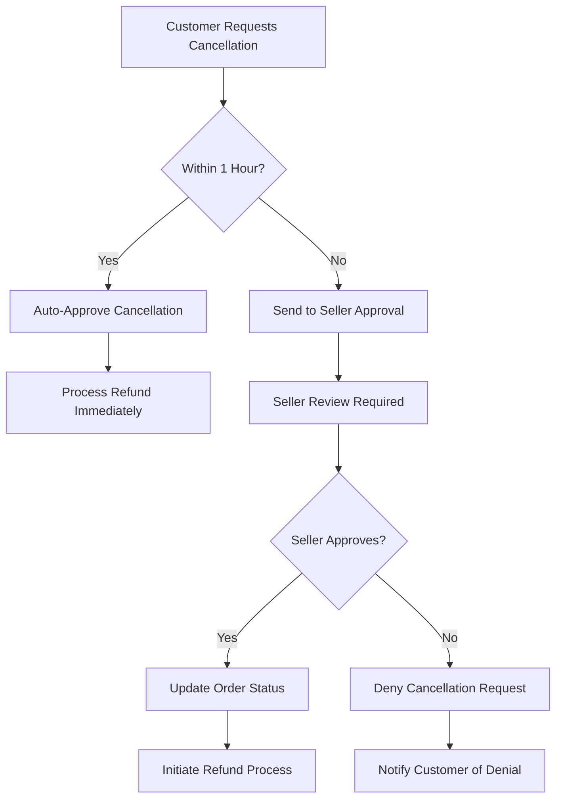

## 6. Payment Processing

### Payment Methods
THE system SHALL support these payment methods:
- Credit and debit cards (Visa, Mastercard, American Express)
- PayPal with instant account linking
- Apple Pay with device authentication
- Google Pay with account integration
- Bank transfers with verification delays

WHEN a customer selects a payment method, THE system SHALL display appropriate payment form fields.

### Transaction Security
THE system SHALL encrypt all payment information using industry-standard SSL/TLS protocols.

WHEN payment information is transmitted, THE system SHALL not store complete card details but use tokenization for secure processing.

THE system SHALL comply with PCI DSS security standards for handling payment information.

### Payment Validation
WHEN a customer submits payment information, THE system SHALL validate:
- Card number format using Luhn algorithm verification
- Expiration date is not in the past with month precision
- CVV code format (3-4 digits based on card type)
- Billing address matches card registration database

WHEN payment validation fails, THE system SHALL display specific error message without revealing card details to prevent fraud.

### Order Confirmation
WHEN payment is successfully processed, THE system SHALL:
- Generate unique order ID in format ORD-YYYYMMDD-NNNN
- Send order confirmation email with receipt details
- Update inventory levels for all purchased SKUs
- Notify seller of new order with item breakdown
- Store transaction details for accounting records

WHEN payment processing fails, THE system SHALL preserve cart contents and display failure reason to customer.

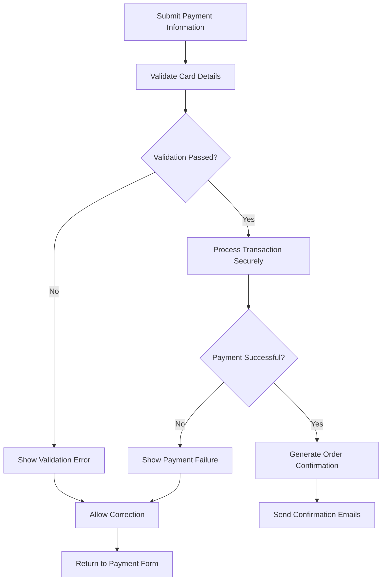

## 7. Review and Rating System

### Review Submission
WHEN a customer completes an order, THE system SHALL allow them to submit product reviews within 30 days of delivery confirmation.

THE system SHALL require reviews to include:
- Star rating (1-5 stars) with visual selector
- Review title (maximum 100 characters) as summary
- Review text (maximum 1000 characters) with validation
- Verification of purchase (automatically applied)
- Optional photo uploads (maximum 5 images)

WHEN a customer submits a review, THE system SHALL validate content length and rating values.

WHEN a review is submitted successfully, THE system SHALL make it available for display after moderation review.

### Rating System
THE system SHALL calculate product ratings as weighted averages of all customer ratings with decimal precision.

WHEN a customer views a product, THE system SHALL display:
- Average rating (rounded to nearest 0.5) with star visualization
- Total number of reviews with date range filters
- Distribution of star ratings with percentage breakdown
- Seller rating (based on all products) with quality score

THE system SHALL support these rating values:
- 5 stars - Excellent product quality and experience
- 4 stars - Good product with minor issues
- 3 stars - Average product meeting basic expectations
- 2 stars - Poor product with significant issues
- 1 star - Very Poor product not meeting expectations

### Review Moderation
WHEN reviews are submitted, THE system SHALL queue them for moderation before public display with timestamp.

THE system SHALL filter out reviews containing:
- Profanity or offensive language with dictionary check
- Personal information like addresses or phone numbers
- Spam or promotional content with pattern recognition
- False or misleading information about product features

WHEN reviews are approved, THE system SHALL make them public and calculate updated product ratings immediately.

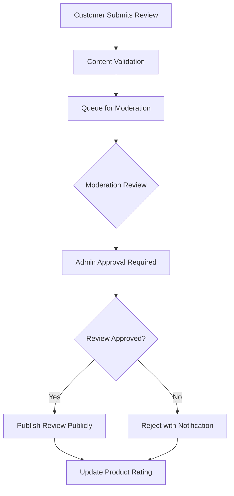

### Review Display
WHEN product details are shown, THE system SHALL display reviews in chronological order with most recent first.

WHEN reviews exceed 10 per page, THE system SHALL paginate with 10 reviews per page with navigation controls.

THE system SHALL allow customers to:
- Sort reviews by date, rating, or helpfulness with dropdown selector
- Mark reviews as helpful with user-based weighting algorithm
- Report inappropriate reviews to moderation queue with reason
- View verified purchase indicators for trust building

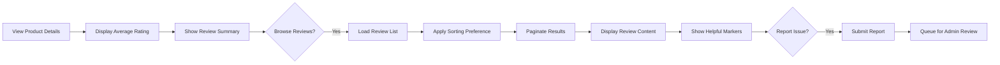

## 8. Administrative Dashboard

### Dashboard Overview
WHEN an administrator logs in, THE system SHALL display dashboard with:
- Order statistics (pending, shipped, delivered) with charts
- Revenue summaries (daily, weekly, monthly) with growth indicators
- User registration trends with source attribution
- Popular products and categories with performance metrics

THE dashboard SHALL refresh data every 5 minutes automatically with latest transaction information.

### Order Management
THE admin dashboard SHALL allow administrators to:
- View all orders across all states with filtering options
- Search orders by customer, seller, or order ID with autocomplete
- Update order status manually when needed for exceptions
- Process cancellation and refund requests with approval workflow
- View order details including customer and product information

WHEN an administrator updates order status manually, THE system SHALL log the change with timestamp and admin ID for audit.

### Product Management
THE admin dashboard SHALL allow administrators to:
- View all products in catalog with status indicators
- Search products by name, category, or seller with advanced filters
- Modify product information when needed for compliance
- Remove inappropriate products with archived backup
- Manage product categories with hierarchical controls

WHEN an administrator deletes a product, THE system SHALL require confirmation and archive the product information for recovery.

### User Management
THE admin dashboard SHALL allow administrators to:
- View all registered users with role indicators
- Search users by email, name, or registration date with sorting
- Modify user account information when legal requirements apply
- Suspend or deactivate user accounts for policy violations
- Resolve user disputes and issues with communication tools

WHEN an administrator modifies user account, THE system SHALL log the action with timestamp and admin ID for compliance.

### Reporting Features
THE system SHALL generate these reports automatically:
- Daily sales report with transaction breakdown
- Monthly revenue summary with category analysis
- Inventory status report with low stock alerts
- User engagement metrics with retention statistics
- Product performance analysis with review correlation

WHEN an administrator requests custom report, THE system SHALL generate report within 10 seconds based on specified parameters.

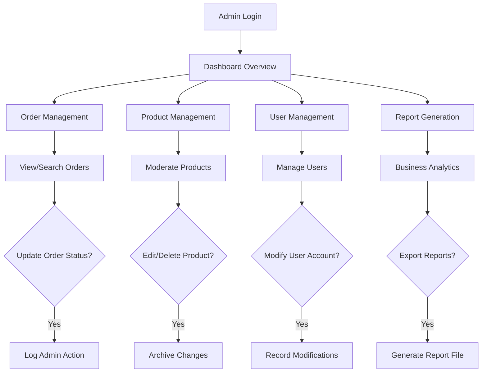

## 9. Technical Constraints

### Performance Requirements
WHEN a customer browses product catalog, THE system SHALL load pages within 2 seconds under normal conditions with 1000 concurrent users.

WHEN a customer searches for products, THE system SHALL return results within 1 second for queries with up to 1000 matching products.

THE system SHALL support 1000 concurrent users browsing products without performance degradation through optimized caching.

WHEN order status is updated by seller, THE system SHALL propagate changes to customer interface within 1 minute through real-time sync.

### Security Requirements
THE system SHALL encrypt all user passwords using bcrypt with salt rounds set to 12 for industry compliance.

WHEN user sessions are managed, THE system SHALL regenerate session IDs after login to prevent session fixation attacks.

THE system SHALL implement rate limiting to prevent brute force attacks on authentication endpoints with 5 attempts per hour.

WHEN system errors occur, THE system SHALL log detailed information but display generic error messages to users for security.

### Data Validation
THE system SHALL validate all user inputs on both client and server sides with consistent rule enforcement.

WHEN invalid data is submitted, THE system SHALL return HTTP 400 with specific validation error messages for debugging.

THE system SHALL sanitize all text inputs to prevent XSS attacks with HTML entity encoding and content filtering.

WHEN user uploads images, THE system SHALL validate file types (JPEG, PNG, GIF) and maximum size (5MB) with format checking.

### Error Handling
WHEN database connection fails, THE system SHALL queue transactions for retry and display service temporary unavailable message.

WHEN payment processing times out, THE system SHALL preserve cart contents and suggest retry or alternative payment methods.

WHEN inventory is insufficient during checkout, THE system SHALL immediately notify customer and suggest alternatives.

IF system downtime occurs, THEN THE system SHALL display maintenance message and automatically retry critical operations.

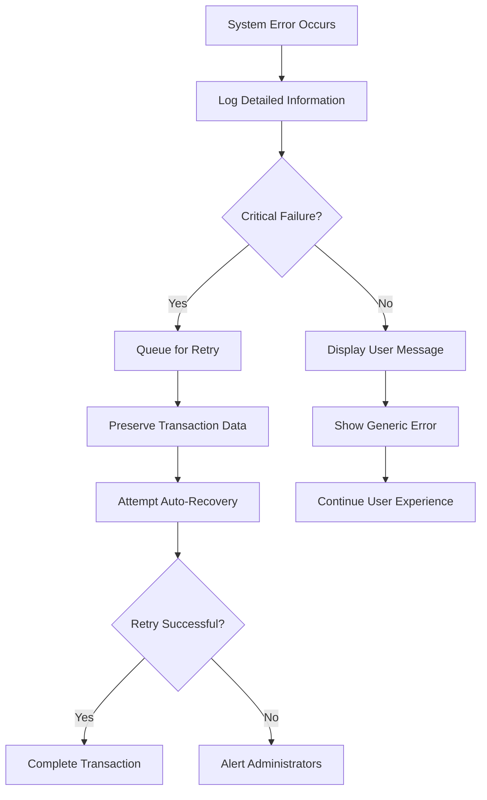

## 10. Success Metrics

### User Engagement Metrics
THE system SHALL track these user engagement statistics:
- Daily active users (DAU) with login frequency
- Monthly active users (MAU) with retention analysis
- Average session duration with page interaction
- Pages per session with navigation patterns
- Cart abandonment rate with exit tracking

### Business Performance Metrics
THE system SHALL monitor these revenue indicators:
- Gross merchandise value (GMV) with seasonal trends
- Monthly recurring revenue (MRR) from seller subscriptions
- Average order value (AOV) with category breakdown
- Conversion rate from cart to purchase with funnel analysis
- Seller retention rate with churn prediction

### System Health Metrics
THE system SHALL measure technical performance through:
- API response times with percentile tracking
- Database query performance with index optimization
- Error rates by type with root cause analysis
- System uptime percentage with SLA compliance
- Peak concurrent user handling with load testing

### Quality Assurance
WHEN new features are deployed, THE system SHALL maintain 99.5% uptime SLA through blue-green deployment strategy.

THE system SHALL support rollback procedures for problematic deployments within 5 minutes through container orchestration.

WHEN user reports issues, THE system SHALL create detailed logs for troubleshooting with session replay capability.