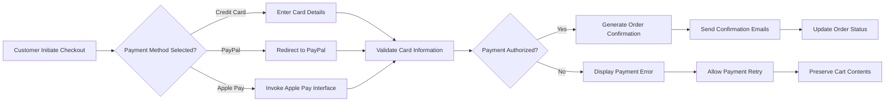
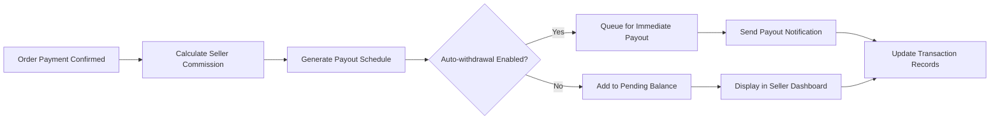
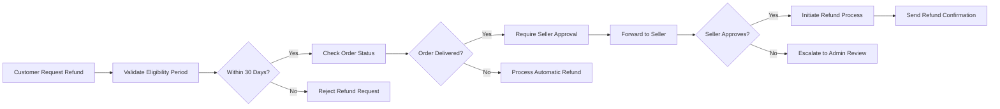

# E-commerce Shopping Mall Platform - Payment Processing Module

## 1. Service Overview

### 1.1 Platform Purpose
THE ecommerce shopping mall platform SHALL serve as a comprehensive digital marketplace enabling customers to browse, purchase, and track products from multiple sellers, while providing sellers robust tools to manage inventory and orders, and offering administrators complete oversight of platform operations.

### 1.2 Business Model Justification
WHEN consumers increasingly prefer online shopping for convenience, THE platform SHALL connect them with diverse sellers to fulfill purchasing needs. WHEN small businesses seek cost-effective sales channels, THE platform SHALL provide accessible marketplace tools with reasonable commission structures.

### 1.3 Revenue Generation Strategy
THE platform SHALL generate revenue through:
- Transaction commissions (2.9% + $0.30 per sale)
- Premium seller subscriptions ($29/month for enhanced features)
- Featured product placement fees ($99/month per product)
- Withdrawal processing fees (1% for bank transfers under $1000)

## 2. User Role Specifications

### 2.1 Customer Role
Users with "customer" role SHALL perform these payment-related actions:
- Process orders using supported payment methods
- Receive order confirmations and payment receipts
- Request refunds for eligible purchases
- View transaction history in account dashboard

### 2.2 Seller Role
Users with "seller" role SHALL perform these payment-related actions:
- Receive payment notifications for completed sales
- Configure preferred withdrawal methods
- View sales revenue and transaction reports
- Process refunds for their products when requested

### 2.3 Admin Role
Users with "admin" role SHALL perform these payment-related actions:
- Monitor all platform transactions
- Handle disputed payments and chargebacks
- Process manual refunds when needed
- Configure payment gateway integrations

## 3. Payment Processing Requirements

### 3.1 Supported Payment Methods
THE system SHALL integrate with these payment providers:
- Major credit/debit cards (Visa, Mastercard, American Express)
- Digital wallets (PayPal, Apple Pay, Google Pay)
- Bank transfers (ACH for US, SEPA for EU)
- Buy-now-pay-later services (Affirm, Klarna)

WHEN customers select a payment method, THE system SHALL validate availability based on customer location and display only supported options.

### 3.2 Transaction Security Standards
THE system SHALL encrypt all payment data transmission using TLS 1.3 protocol.
THE system SHALL tokenize sensitive payment information to prevent data exposure.
THE system SHALL comply with PCI DSS Level 1 standards for payment card processing.

WHEN payment information is stored, THE system SHALL encrypt data at rest using AES-256 encryption.
WHERE payment processing occurs, THE system SHALL ensure no plaintext card data touches platform servers.

### 3.3 Payment Validation Process
WHEN customers submit payment information, THE system SHALL validate within 3 seconds:
- Card number format using Luhn algorithm
- Expiration date not in past
- CVV code length (3-4 digits)
- Billing address format completeness

IF validation fails, THEN THE system SHALL provide specific error messages without exposing sensitive data details.

WHEN card verification is required, THE system SHALL perform zero-dollar authorization to validate card without charging.

### 3.4 Order Confirmation Workflow
WHEN payment is successfully processed, THE system SHALL:
- Generate unique payment transaction ID in format PAY-YYYYMMDD-XXXX
- Send immediate confirmation email with receipt to customer
- Display order confirmation page with estimated delivery dates
- Notify relevant seller of new order with payment confirmation

THE system SHALL complete order confirmation process within 5 seconds of payment authorization.

WHERE payment confirmation fails to reach customer, THE system SHALL automatically retry email delivery up to 3 times.

## 4. Business Process Flows

### 4.1 Customer Payment Journey

### 4.2 Seller Payment Notification Flow

### 4.3 Refund Processing Sequence

## 5. Business Rules and Constraints

### 5.1 Payment Processing Rules
THE system SHALL prevent duplicate transaction processing by implementing idempotency keys.
THE system SHALL display clear pricing breakdown before final payment submission.
THE system SHALL maintain transaction logs for audit purposes with timestamps and user identifiers.

### 5.2 Refund Eligibility Guidelines
WHEN customers request refunds, THE system SHALL validate:
- Order completion within last 30 days
- Product return eligibility based on category
- Order status not already in refund process
- Customer account in good standing

### 5.3 Seller Payout Regulations
THE system SHALL process seller payouts on weekly schedule (every Friday).
THE system SHALL require minimum $50 balance before initiating withdrawals.
THE system SHALL support payout methods including PayPal, bank transfer, and platform credit.

### 5.4 Tax and Compliance Standards
THE system SHALL calculate sales tax based on customer delivery address.
THE system SHALL generate 1099-K forms for sellers exceeding $20,000 in sales volume.
THE system SHALL maintain compliance with international payment regulations.

## 6. Performance Benchmarks

### 6.1 Response Time Standards
WHEN customers submit payments, THE system SHALL process transactions within 5 seconds.
WHEN sellers access payout information, THE system SHALL load data within 3 seconds.
WHEN admins monitor transactions, THE system SHALL refresh dashboards every 30 seconds.

### 6.2 System Capacity Limits
THE platform SHALL support 10,000 concurrent payment transactions during peak periods.
THE system SHALL automatically queue payments exceeding gateway rate limits.
THE platform SHALL maintain 99.9% uptime for payment processing functions.

## 7. Error Handling Protocol

### 7.1 Payment Authentication Failures
IF payment gateway denies transaction due to insufficient funds, THEN THE system SHALL notify customer with "Insufficient funds" message.
IF payment gateway times out during authorization, THEN THE system SHALL retry transaction up to 2 times before failing.

### 7.2 Technical Error Scenarios
WHERE database connectivity fails during payment processing, THE system SHALL preserve transaction data in queue for retry.
IF card validation encounters malformed data, THE system SHALL guide customer to correct input format.

### 7.3 User Experience Errors
WHEN customers enter invalid card security codes, THE system SHALL provide format guidance without revealing actual code.
IF payment method becomes unavailable during checkout, THE system SHALL suggest alternative methods with real-time status.

## 8. Success Metrics Framework

### 8.1 Payment Success Indicators
THE system SHALL measure payment success rate target of 98%+ for all transactions.
THE platform SHALL track average payment processing time under 4 seconds.
THE system SHALL monitor failed transaction recovery rate above 85%.

### 8.2 User Satisfaction Benchmarks
THE customer payment satisfaction rating SHALL maintain 4.5+ stars.
THE seller payout satisfaction SHALL maintain 4.3+ stars.
THE admin transaction oversight SHALL maintain 99.9% accuracy rating.