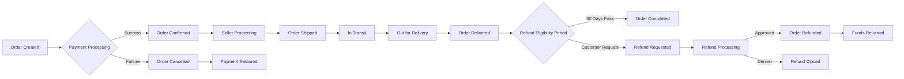
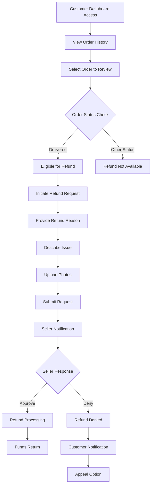

# E-commerce Platform Order Management System Requirements

## Document Purpose

This document specifies the business requirements for the order management system of an e-commerce shopping mall platform. It focuses on order lifecycle management, status tracking, order history functionality, and cancellation/refund processes. Backend developers will implement these requirements to create a comprehensive order handling system.

## Platform Business Model

The e-commerce platform operates as a multi-vendor marketplace where customers can browse products, manage shopping carts, place orders, and track shipments. Sellers manage their own products, handle inventory per SKU, and process customer orders. Administrators oversee the entire platform, ensuring proper operation and resolving disputes.

## User Role Definitions

### Customer Role

Registered users who can:
- Browse products and search the catalog
- Manage shopping cart and wishlist
- Place orders and process payments
- Track shipment status and delivery information
- Leave product reviews and ratings after purchase
- Manage account information and multiple shipping addresses
- View order history with detailed purchase information
- Initiate order cancellation or refund requests when eligible

### Seller Role

Users who can:
- Create and manage their product listings with detailed variants
- Configure product variants (SKUs) with different attributes
- Track inventory levels separately for each SKU
- View and process orders for their own products
- Update order status and shipping information
- Access sales analytics and performance metrics
- Respond to customer initiated cancellation/refund requests

### Administrator Role

System administrators who can:
- Manage all products in the complete catalog
- Process and oversee all orders across the platform
- Moderate user-generated content and reviews
- Handle user accounts and permissions issues
- Configure system settings and business rules
- Generate detailed reports on platform performance
- Manually intervene in order status transitions when needed
- Process escalated cancellation and refund requests

## Order Lifecycle Management

### Order Creation and Initialization

WHEN a customer successfully completes the checkout process, THE system SHALL create a new order with a unique order ID formatted as "ORD-YYYYMMDD-NNNN" where NNNN represents a sequential order number for that day.

WHEN an order is created, THE system SHALL capture and permanently store these required information elements:
- Customer ID referencing the purchasing user account
- Complete shipping and billing address information
- Selected products with their specific SKUs, quantities ordered, and prices at purchase time
- All applied discounts or promotional codes with their calculated values
- Order subtotal, detailed tax amount, shipping cost, and final total amount
- Timestamp of order creation with ISO 8601 date-time format
- Selected payment method with payment gateway details
- Associated payment transaction ID from processing system

WHEN an order is initiated but not completed (cart abandonment), THE system SHALL maintain the cart contents in temporary storage for 30 days to allow customers to resume checkout.

### Payment Processing Integration

WHEN payment processing is successfully completed through integrated payment gateways, THE system SHALL update the order status to "confirmed" and send an automated confirmation email to the customer within 30 seconds.

WHEN payment processing fails at any stage, THE system SHALL maintain the order in "pending_payment" status, preserve cart contents, and display appropriate error messages to the customer including specific decline reasons when available.

WHEN payment verification is pending for alternative payment methods (bank transfers, checks), THE system SHALL set the order status to "payment_pending_verification" and notify both customer and seller through email within 1 minute.

### Seller Fulfillment Process

WHEN an order status is updated to "confirmed" by successful payment processing, THE system SHALL automatically:
1. Notify the seller of the new order through dashboard alert and email
2. Reduce the corresponding SKU inventory counts immediately
3. Set the initial seller order status to "processing"
4. Generate shipping labels if integrated with logistics providers

WHEN a seller marks an order as "shipped" through their dashboard, THE system SHALL:
1. Update the overall order status to "shipped"
2. Provide detailed tracking information to the customer via automated email
3. Send shipping notification to the customer's registered email address
4. Update expected delivery date calculations for customer display

WHEN an order is marked as "delivered" either automatically through carrier integration or manually by seller confirmation, THE system SHALL:
1. Update the order status to "delivered"
2. Send delivery confirmation notification to the customer
3. Trigger automated review request email to customer within 1 hour
4. Begin refund eligibility countdown timer (30 days from delivery)

### Order Finalization

WHEN an order status reaches "delivered" and 30 days have elapsed without any cancellation or refund request, THE system SHALL automatically mark the order as "completed" and finalize all financial transactions.

## Order Status Tracking System

### Complete Order Status Definitions

THE system SHALL maintain and display these precise order statuses throughout the complete order lifecycle:

WHERE order status is "pending_payment", THE order has been created but payment has not yet been confirmed or is in process.
WHERE order status is "confirmed", THE payment has been successfully received and order has been validated.
WHERE order status is "processing", THE seller has acknowledged the order and is preparing shipment.
WHERE order status is "shipped", THE seller has dispatched the item with tracking information available.
WHERE order status is "in_transit", THE package is currently en route through shipping carrier network.
WHERE order status is "out_for_delivery", THE package has arrived at local delivery facility for final delivery.
WHERE order status is "delivered", THE package has been successfully delivered to customer's specified address.
WHERE order status is "completed", THE order has been finalized with no pending actions or eligibility periods remaining.
WHERE order status is "cancelled", THE order has been voided either by customer, seller, or system before shipment.
WHERE order status is "refund_requested", THE customer has initiated the refund process for a delivered order.
WHERE order status is "refund_processing", THE refund is being handled by seller or administrator with financial institution.
WHERE order status is "refunded", THE refund has been successfully processed and funds returned to original payment method.

### Real-time Status Update Features

WHEN a customer accesses their order tracking page through account dashboard, THE system SHALL display the current status and any available tracking information within 2 seconds.

WHEN a seller updates an order status through their dashboard interface, THE system SHALL:
1. Validate the status transition against business rules
2. Notify the customer via email within 1 minute of the change
3. Update all relevant metrics and reporting data
4. Adjust inventory counts when appropriate (cancellations restore stock)

WHEN an order status reaches "shipped" or later with carrier integration enabled, THE system SHALL provide a direct tracking link that shows real-time shipment information when customers access it.

### Status Transition Business Rules

THE system SHALL restrict order statuses to these exact valid transitions based on business logic:

IF order status is currently "pending_payment", THEN ONLY valid transitions are to "confirmed" status on successful payment or "cancelled" status on abandonment or failure.

IF order status is currently "confirmed", THEN ONLY valid transitions are to "processing" status when seller acknowledges or "cancelled" status when system rules apply.

IF order status is currently "processing", THEN ONLY valid transitions are to "shipped" status when fulfillment is complete or "cancelled" status when eligible.

IF order status is currently "shipped", THEN ONLY valid transitions are to "in_transit", "out_for_delivery", or "delivered" statuses as carrier updates occur.

IF order status is currently "in_transit", THEN ONLY valid transitions are to "out_for_delivery" or "delivered" statuses as package progresses.

IF order status is currently "out_for_delivery", THEN ONLY valid transition is to "delivered" status upon successful delivery confirmation.

IF order status is currently "delivered", THEN ONLY valid transitions are to "completed" status after 30 days or "refund_requested" status when customer initiates refund.

IF order status is currently "refund_requested", THEN ONLY valid transitions are to "refund_processing" status when evaluation begins or back to "delivered" status if request is withdrawn or invalid.

IF order status is currently "refund_processing", THEN ONLY valid transition is to "refunded" status on successful completion or to "cancelled" status when refund is denied per business rules.

### Transition Enforcement Mechanism

IF any order status transition attempt violates these established business rules, THEN THE system SHALL:
1. Deny the transition with appropriate error message
2. Log the attempt with timestamp and attempting user ID
3. Alert system administrators for possible manual review
4. Maintain current valid status without change

## Comprehensive Order History Functionality

### Order Listing and Search Features

THE system SHALL display a customer's complete order history sorted by most recent orders first, showing at least 20 orders per page with efficient pagination.

WHEN a customer accesses their order history page through account dashboard, THE system SHALL load the page within 3 seconds, displaying these essential order information elements:
- Complete Order ID with formatted reference number
- Exact order date and timestamp
- Brief list of purchased product names (showing first 5 with "and X more" notation if exceeding display limit)
- Final total order amount in USD with currency symbol
- Current overall order status with color coding for visual recognition
- Estimated delivery date when order is in shipping pipeline

WHEN a customer searches their order history using available filters, THE system SHALL support filtering results based on these precise criteria:
- Date range selection (last 30 days, last 3 months, last 12 months, or custom range)
- Order status matching any of the defined status values
- Product name or SKU partial text matching
- Order amount range with minimum and maximum value specification
- Seller name for orders from specific vendors

### Detailed Order Information View

WHEN a customer views detailed order information by clicking any order in their history, THE system SHALL display these comprehensive elements:
- Complete order ID with exact timestamp of creation
- Customer shipping address with option to update preferences
- Selected shipping method with detailed cost breakdown
- Complete list of all purchased products with their specific SKUs, ordered quantities, and individual current prices
- All applied discounts or promotional codes with their calculated monetary value
- Order subtotal, detailed tax breakdown by jurisdiction, shipping handling cost, and total final amount
- Complete payment method information including last four digits for card payments
- Timeline of all status changes with timestamps for transparency
- Current status with detailed explanation of status meaning
- Tracking number with direct link to carrier tracking interface when available
- Visual option to initiate eligible cancellation processes
- Review submission interface for delivered orders
- Request refund option for delivered orders within 30-day eligibility period

## Cancellation and Refund Process System

### Order Cancellation Eligibility Rules

THE system SHALL automatically allow order cancellations following these specific time-based and status-based eligibility criteria:

WHERE order status is "pending_payment", THE system SHALL always allow automatic cancellation by customer with immediate inventory restoration.

WHERE order status is "confirmed", THE system SHALL allow cancellations ONLY within 2 hours of confirmation timestamp before seller processing begins.

WHERE order status is "processing", THE system SHALL allow cancellations ONLY if seller has not yet marked order as "shipped" with fulfillment confirmation.

WHERE order status is "shipped" or any later shipping progression status, THE system SHALL NOT allow cancellations but must direct customers to refund request process instead.

### Cancellation Processing Workflow

WHEN a customer initiates an eligible order cancellation through their dashboard, THE system SHALL immediately:
1. Validate current order status against cancellation eligibility rules
2. Set order status to "cancelled" with timestamp recording
3. Automatically restore all corresponding SKU inventory counts
4. Initiate payment refund process to original payment method if applicable
5. Send confirmation email to customer within 1 minute
6. Notify seller of cancellation through system alert and email

WHEN cancellation is successfully processed, THE system SHALL:
1. Update all reporting and analytics with cancellation metrics
2. Adjust seller performance indicators appropriately
3. Reopen inventory for other customers to purchase
4. Provide clear reason codes for cancellation in UI
5. Archive cancellation details for audit trail purposes

### Customer Refund Request Process

WHEN a customer submits a refund request for an eligible delivered order, THE system SHALL:
1. Set order status to "refund_requested" with timestamp
2. Require the customer to provide specific reason for refund from predefined options including defective item, wrong item, not as described, changed mind, or other
3. Require the customer to describe the issue with at least 100 characters of detailed explanation
4. Allow customers to optionally upload photos (maximum 5 JPEG/PNG files, 5MB each) demonstrating the issue
5. Automatically notify the seller and appropriate administrator of the refund request
6. Send confirmation email to customer within 30 seconds

WHEN a seller or administrator receives a refund request notification, THE system SHALL provide these review elements:
- Complete order details including customer information
- Customer's specific reason for refund selection with detailed description
- Any uploaded product photos for visual reference
- Timeline for required response (72 business hours)
- Interface for approving or denying the request with explanation

### Refund Approval Processing

WHEN a refund request is approved by either seller (for standard items) or administrator (for escalated issues), THE system SHALL:
1. Set order status to "refunded" with processing timestamp
2. Initiate payment refund process through original payment gateway
3. Return funds to the original payment method with traceable transaction ID
4. Send approval notification email to customer within 1 minute
5. Update customer refund eligibility timer to prevent duplicate requests
6. Log administrative actions for audit purposes

WHEN a refund request is denied by seller or administrator, THE system SHALL:
1. Return order status to "delivered" state without refund progression
2. Provide clear, specific reason for denial that addresses customer concern
3. Send detailed denial explanation to customer via email within 1 minute
4. Preserve customer's right to appeal through administrator escalation
5. Log the denial reason with timestamp and approver ID for records

### Refund Timeframe Standardization

THE system SHALL specify and enforce these standardized timeframes for different refund scenarios:

WHERE automatic cancellation applies (pending_payment status), THE system SHALL provide instant refunds with immediate credit notification to customer.

WHERE credit card refunds are processed, THE system SHALL complete the process within 5-10 business days from approval date.

WHERE digital wallet refunds (PayPal, Apple Pay, Google Pay) apply, THE system SHALL complete processing within 3-5 business days.

WHERE bank transfer refunds are required, THE system SHALL complete processing within 10-15 business days due to banking system constraints.

THE system SHALL send automated refund status updates to customers through their preferred notification channels (email primarily).

## Performance and System Reliability Requirements

### Order Processing Time Standards

WHEN an order is submitted through the complete checkout process, THE system SHALL process and confirm the order within 10 seconds during standard operation conditions.

WHEN any order status update occurs, WHETHER initiated by customer, seller, or automatic system triggers, THE system SHALL propagate all status changes to relevant parties within 60 seconds maximum.

WHEN a customer loads their order history dashboard page, THE system SHALL display the requested results page within 3 seconds for accounts with normal order volume.

### System Response Reliability

THE system SHALL maintain 99.5% uptime reliability for all order management functions during standard business hours.

THE platform SHALL support processing and managing at least 1,000 concurrent orders per hour during peak traffic periods without degradation.

WHERE database connectivity issues occur, THE system SHALL queue critical order updates for retry processing with appropriate customer notifications.

## Error Handling and Exception Scenarios

### Order Not Found Errors

IF a customer attempts to access an order ID that does not exist in the system database, THEN THE system SHALL:
1. Display a user-friendly "Order not found or access unauthorized" message
2. Provide navigation options to return to order history listing
3. Log the access attempt for security review
4. Prevent information disclosure about other orders

### Invalid Status Transition Errors

IF a seller attempts to update an order to an invalid subsequent status, THEN THE system SHALL:
1. Display specific error message indicating "Invalid status transition from [current] to [requested]"
2. List all valid transition options from current order status
3. Prevent order status corruption in database records
4. Log the error attempt with user ID for administrative review

### Refund Processing Failures

IF a refund cannot be automatically processed due to payment system limitations or connectivity issues, THEN THE system SHALL:
1. Set order status to "refund_error" with descriptive error code
2. Immediately notify system administrators through high-priority alert system
3. Provide retry mechanisms with manual intervention options
4. Maintain queue for automatic retry every 4 hours up to 3 attempts
5. Document technical issues for payment processor communication

### Order History Access Issues

IF order history pages cannot be loaded due to temporary system issues or database performance constraints, THEN THE system SHALL:
1. Display clear error message explaining the temporary nature of issue
2. Offer retry option with automatic refresh in 30 seconds
3. Maintain availability of critical order tracking functionality even when browsing history is impaired
4. Log technical issues for system performance team review

## Future Enhancement Opportunities

While not currently required for minimum viable product, future versions of this order management system may strategically incorporate these advanced functionalities:

### Automated Order Status Integration

THE system SHALL eventually integrate with major shipping carriers including UPS, FedEx, USPS, and DHL to provide real-time automatic order status transitions based on actual tracking updates rather than manual seller inputs.

### Enhanced Customer Communication

WHEN advanced notification systems are implemented, THE platform SHALL support order status updates through:
- SMS text message notifications to customer phones
- Mobile push notifications through platform applications
- Social media direct message integration where permitted
- Voice call notifications for critical delivery updates

### Advanced Analytical Features

THE system SHALL accommodate advanced analytics capabilities for order patterns and forecasting including:
- Machine learning-based delivery time predictions
- Predictive inventory requirement planning for sellers
- Customer behavior pattern recognition and adaptation
- Seasonal and regional ordering trend analysis

### Comprehensive Dispute Resolution

WHERE expanded customer service tools are developed, THE platform SHALL support:
- Mediated dispute resolution interfaces
- Integrated photo and evidence review systems
- Third-party arbitration integrations
- Smart contract-based automated resolution for simple disputes

> *Developer Note: This document defines comprehensive business requirements ONLY for order management functionality. All technical implementations including architecture decisions, API specifications, database design patterns, microservice structures, and coding methodologies are at the complete discretion of the development team based on their technical expertise and system optimization strategies.*