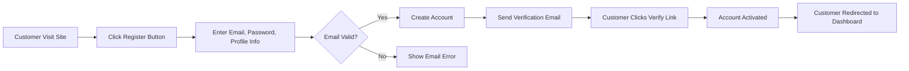
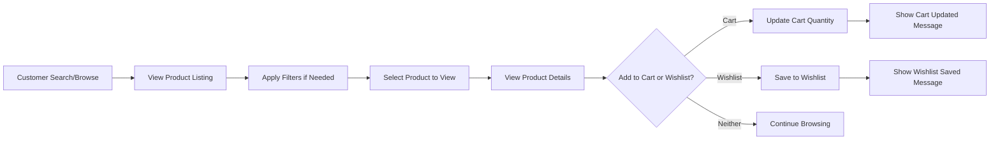
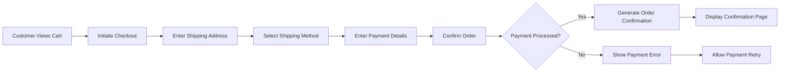
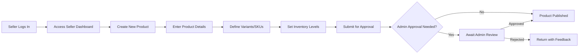
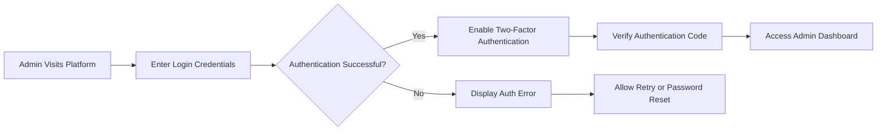

# E-commerce Shopping Mall Platform - Admin Dashboard Requirements

## 1. Service Overview

### Platform Purpose
THE e-commerce shopping mall platform SHALL provide a comprehensive online marketplace where customers can browse products, manage shopping carts, place orders, and track shipments while sellers can manage inventory and products.

### Core Value Proposition
This platform enables seamless e-commerce transactions between multiple sellers and customers, with robust administration capabilities for oversight and management of the entire marketplace ecosystem.

## 2. User Roles and Authentication System

### Customer Role
Users with the "customer" role SHALL be registered members who can browse products, manage shopping carts and wishlists, place orders, track shipments, and leave product reviews.

### Seller Role
Users with the "seller" role SHALL be registered members who can manage their own products, handle inventory per SKU, process orders, and respond to customer reviews.

### Admin Role
Users with the "admin" role SHALL be system administrators who can manage all products, orders, user accounts, and system settings including featured placements and promotional content.

### Authentication Requirements
WHEN users access protected features, THE system SHALL require authentication through email and password credentials with JWT token management.

THE system SHALL maintain user sessions for 30 days with refresh token capability for continuous access without repeated login.

## 3. Functional Requirements

### Registration and Login Process
WHEN new users register, THE system SHALL collect email address, password, and basic profile information to create customer or seller accounts.

WHEN users attempt to access restricted features, THE system SHALL verify authentication status and redirect to login if unauthenticated.

### Product Catalog System
THE system SHALL organize products into hierarchical categories to facilitate browsing.

WHEN users search for products, THE system SHALL match keywords against product names, descriptions, and categories to return relevant results within 2 seconds.

THE system SHALL support filtering by price range, brand, category, rating, and other product attributes.

### Product Variant Management
THE system SHALL track inventory separately for each product variant (SKU) based on color, size, and option combinations.

WHEN sellers update inventory quantities, THE system SHALL reflect real-time stock levels to prevent overselling.

### Shopping Cart Functionality
THE system SHALL allow customers to add products and variants to a shopping cart for later purchase.

WHEN customers add items to cart, THE system SHALL verify product availability and reserve stock for 15 minutes.

THE system SHALL allow cart persistence across sessions so customers retain items after login/logout.

### Wishlist Management
THE system SHALL allow customers to save products to a wishlist for future consideration.

WHEN customers add items to wishlist, THE system SHALL track these preferences without affecting inventory.

THE system SHALL enable customers to move wishlist items to cart with one action.

## 4. Admin Dashboard Requirements

### Dashboard Overview
THE admin dashboard SHALL provide an overview of platform metrics including daily orders, revenue, and user activity.

WHEN an administrator logs in, THE system SHALL display dashboard with real-time data within 3 seconds.

THE admin dashboard SHALL refresh data every 5 minutes automatically.

### Order Management Capabilities
THE admin dashboard SHALL allow administrators to:
- View all orders across all states
- Search orders by customer, seller, or order ID
- Update order status when needed
- Process cancellation and refund requests
- View order details including customer and product information
- Access order communication history between customers and sellers

WHEN an administrator updates order status manually, THE system SHALL log the change with timestamp and admin ID.

WHEN an administrator modifies order details, THE system SHALL require confirmation before applying changes.

### Product Management and Moderation
THE admin dashboard SHALL allow administrators to:
- View all products in catalog
- Search products by name, category, or seller
- Modify product information when needed
- Remove inappropriate products
- Manage product categories
- Approve or reject new product listings
- Flag products for policy violations

WHEN an administrator approves a product, THE system SHALL make it immediately visible to customers.

WHEN an administrator rejects a product, THE system SHALL notify the seller with reason.

WHEN an administrator deletes a product, THE system SHALL require confirmation and archive the product information.

### User Management Functions
THE admin dashboard SHALL allow administrators to:
- View all registered users
- Search users by email, name, or registration date
- Modify user account information when needed
- Suspend or deactivate user accounts
- Resolve user disputes and issues
- Upgrade or downgrade seller account types
- Access user activity logs
- Communicate with users through internal messaging

WHEN an administrator modifies user account, THE system SHALL log the action with timestamp and admin ID.

WHEN an administrator suspends a user account, THE system SHALL immediately prevent all account access.

### Reporting and Analytics Features
THE system SHALL generate these reports automatically:
- Daily sales report
- Monthly revenue summary
- Inventory status report
- User engagement metrics
- Product performance analysis
- Seller performance ranking
- Customer satisfaction metrics

WHEN an administrator requests custom report, THE system SHALL generate report within 10 seconds based on specified parameters.

THE admin dashboard SHALL display visual charts for key metrics including:
- Revenue trends over time
- Order volume by category
- User registration growth
- Product rating distributions

### System Configuration Capabilities
THE admin dashboard SHALL allow administrators to:
- Configure platform-wide settings
- Manage featured product placements
- Define promotional campaigns
- Set system maintenance schedules
- Configure email notification templates
- Manage payment gateway settings
- Define category hierarchies
- Set business rules and policies

WHEN an administrator changes platform settings, THE system SHALL apply changes immediately without requiring restart.

WHEN an administrator schedules maintenance, THE system SHALL display maintenance warning to users 24 hours in advance.

## 5. Non-functional Requirements

### Performance Standards
WHEN users browse product listings, THE system SHALL display pages of 20 items within 1 second.

THE system SHALL process order placements within 3 seconds under normal load conditions.

WHEN searching products, THE system SHALL return results within 2 seconds for queries with fewer than 1000 matches.

WHEN an administrator accesses the dashboard, THE system SHALL load all components within 5 seconds.

### Availability Targets
THE system SHALL maintain 99.9% uptime excluding scheduled maintenance.

THE platform SHALL support 5000 concurrent users with response times under 3 seconds.

THE admin dashboard SHALL remain accessible even during peak customer usage periods.

### Security Requirements
THE system SHALL protect customer payment and personal information with encryption at rest and in transit.

WHEN login attempts fail 5 times consecutively, THE system SHALL temporarily lock accounts for 30 minutes.

THE admin dashboard SHALL require two-factor authentication for all administrator access.

THE system SHALL log all administrative actions with user ID, timestamp, and action details for audit purposes.

## 6. User Scenarios and Workflows

### New Customer Registration Scenario

### Product Browsing Scenario

### Checkout Process Scenario

### Seller Product Management Scenario

### Admin Dashboard Access Scenario

## 7. Business Rules and Constraints

### Pricing and Inventory Rules
THE system SHALL prevent customers from adding products to cart when inventory is insufficient.

WHEN inventory drops below 10 units for any SKU, THE system SHALL send low stock alerts to respective sellers.

THE system SHALL apply promotional discounts automatically at checkout when eligibility criteria are met.

### User Account Rules
THE system SHALL require email verification before allowing customers to place orders.

WHEN customers update addresses, THE system SHALL validate postal addresses through third-party verification services.

THE system SHALL prevent duplicate accounts using the same email address.

THE system SHALL automatically deactivate accounts with no activity for 12 months.

### Order Management Constraints
WHEN sellers ship orders, THE system SHALL require tracking numbers for shipping status updates.

THE system SHALL automatically cancel orders after 24 hours if payment is not completed.

THE system SHALL prevent order modifications after shipment status is marked as "shipped."

THE admin dashboard SHALL retain order history for a minimum of 7 years for compliance purposes.

### Content Moderation Policies
THE system SHALL automatically flag reviews containing profanity for admin review.

WHEN a product violates platform policies, THE system SHALL allow admins to remove it immediately with notification to the seller.

THE system SHALL track and log all content moderation actions with timestamps and reasons.

## 8. Error Handling Requirements

### Authentication Errors
IF login credentials are invalid, THEN THE system SHALL display specific error messages without revealing which field was incorrect.

IF registration email is already in use, THEN THE system SHALL notify the user and provide password recovery option.

IF two-factor authentication fails, THEN THE system SHALL allow 3 retry attempts before temporarily locking the account.

### Cart and Wishlist Errors
IF customers attempt to add more items than available inventory, THEN THE system SHALL notify them of maximum quantity allowed.

WHEN wishlist functionality fails, THE system SHALL log errors and display user-friendly failure messages.

IF a product is removed while in a customer's cart, THEN THE system SHALL notify the customer and remove the item.

### Payment Processing Errors
IF payment information is declined, THEN THE system SHALL provide specific reasons without exposing sensitive data.

WHEN payment gateways are temporarily unavailable, THE system SHALL offer alternative payment methods.

IF payment processing takes longer than 30 seconds, THEN THE system SHALL notify the customer and continue processing in background.

### Order Management Errors
IF order creation fails due to system errors, THEN THE system SHALL notify customer and automatically retry for 10 minutes.

WHEN tracking information cannot be retrieved, THEN THE system SHALL display estimated delivery windows from shipping method.

IF an administrator attempts an unauthorized action, THEN THE system SHALL log the attempt and deny access.

### Admin Dashboard Errors
IF dashboard components fail to load, THEN THE system SHALL display error messages and allow retry.

WHEN report generation fails, THE system SHALL notify the admin and log technical details for troubleshooting.

IF system configuration changes conflict with existing settings, THEN THE system SHALL prevent changes and display conflict details.

## 9. Success Criteria Verification

### Platform Performance Benchmarks
THE system SHALL process 95% of page loads within 2 seconds during peak usage times.

THE platform SHALL handle 10000 concurrent users during promotional events without degradation.

THE admin dashboard SHALL load all components within 5 seconds for 99% of access attempts.

### User Experience Metrics
THE customer satisfaction rating SHALL remain above 4.2/5.0 during regular operation.

WHEN customers complete purchases, THE system SHALL maintain 98% success rate with minimal retries.

THE admin dashboard SHALL maintain 99% uptime during business hours.

### Business Outcome Targets
THE monthly order volume SHALL increase 15% month-over-month during the first year.

THE platform SHALL achieve profitability with 1000 active sellers and 50000 registered customers.

THE admin dashboard SHALL reduce manual intervention requirements by 80% compared to previous systems.

THE system SHALL process refund requests within 24 hours for 95% of cases.