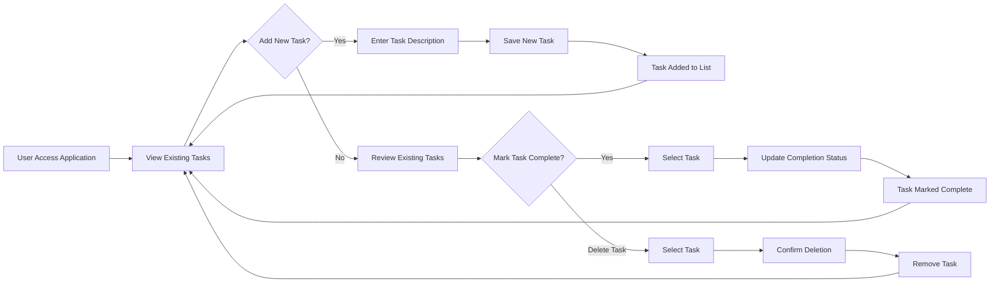

# Todo List Application Requirements Analysis

## 1. Service Overview

### Business Vision and Justification
THE Todo list service SHALL provide individuals with a simple digital tool to organize and track personal tasks. This service exists to address the fundamental human need for task organization and productivity management in an increasingly busy world.

The market need for such services is substantial, as personal productivity tools represent a significant segment of software applications with millions of daily users globally. The Todo list fills a basic but essential gap in personal organization by offering a minimalist approach to task management without unnecessary complexity.

### Problem Statement
Individuals struggle with remembering and organizing daily tasks effectively, leading to:
- Missed deadlines and forgotten commitments
- Decreased personal productivity
- Mental fatigue from trying to remember everything
- Lack of simple, focused tools for basic task tracking

This Todo list service SHALL solve these problems by providing a straightforward digital solution for recording, tracking, and managing tasks.

### Value Proposition
The Todo list application SHALL offer:
- Simple task creation without barriers or complex setup
- Clear visibility of pending and completed tasks
- Easy task deletion for items no longer needed
- Streamlined interface focused solely on task management essentials
- No unnecessary features that complicate the user experience

### Business Model
While this implementation SHALL focus on minimal functionality without monetization features, the underlying business model could evolve to include:
- Freemium tier with basic functionality (as specified)
- Premium features like categorization, due dates, and reminders
- Subscription-based revenue for advanced features
- One-time purchase model for premium functionality

## 2. User Roles Analysis

### User Role Definition
THE system SHALL recognize a single user role with the following capabilities:
- **user**: A standard user who can create, complete, and delete todo items

### Authentication Requirements
WHEN considering the minimal approach requested, THE system SHALL operate without authentication barriers for basic functionality. However, for any future extension, the authentication foundation SHALL support:

WHEN a user accesses the Todo list application, THE system SHALL provide immediate access to task management functionality.

WHEN a user returns to the application, THE system SHALL preserve their task data if persistence is implemented.

### Role Permissions and Capabilities
THE user role SHALL have comprehensive permissions for all core Todo list functionality including:
- Creating new tasks with descriptive text
- Marking existing tasks as completed
- Deleting tasks no longer needed
- Viewing all tasks with their current status
- Modifying task completion status

### Permission Matrix
| Action | user |
|--------|------|
| Create new tasks | ✅ |
| View tasks | ✅ |
| Mark tasks as completed | ✅ |
| Unmark completed tasks | ✅ |
| Delete tasks | ✅ |
| Access task history | ✅ |

## 3. Functional Requirements

### Core Features Specification
THE Todo list application SHALL provide only the essential features needed for basic task management:

THE system SHALL allow users to create new task items with descriptive text.

THE system SHALL allow users to mark task items as completed.

THE system SHALL allow users to delete task items.

THE system SHALL display all tasks to the user with their current completion status.

### Task Management Requirements
WHEN a user creates a new task, THE system SHALL store that task with the following information:
- Task descriptive text (provided by user)
- Completion status (default: incomplete)
- Unique task identifier

WHEN a user views their Todo list, THE system SHALL display all tasks with:
- Task descriptive text
- Visual indication of completion status

WHEN a user marks a task as completed, THE system SHALL update the task's completion status.

WHEN a user deletes a task, THE system SHALL permanently remove that task from storage.

WHERE tasks exist in the system, THE system SHALL maintain all task data for the user.

### User Workflows and Processes

### Business Rules
THE system SHALL treat all users equally with the same task management permissions.

THE system SHALL consider a task complete when the user marks it as completed.

THE system SHALL remove tasks permanently when a user deletes them.

THE task description SHALL support text input of reasonable length for describing tasks.

THE task identifier SHALL be unique for each task within the system.

### Error Handling Scenarios
IF a user attempts to create a task without providing description text, THEN THE system SHALL prevent task creation and prompt for valid input.

IF a user attempts to access a task that no longer exists, THEN THE system SHALL display an appropriate message indicating the task was not found.

IF the system encounters a storage error when saving a task, THEN THE system SHALL notify the user that the operation failed.

IF the system encounters a retrieval error when loading tasks, THEN THE system SHALL display an error message to the user.

## 4. Developer Implementation Guidance

> *Developer Note: This document defines **business requirements only**. All technical implementations (architecture, APIs, database design, etc.) are at the discretion of the development team.*