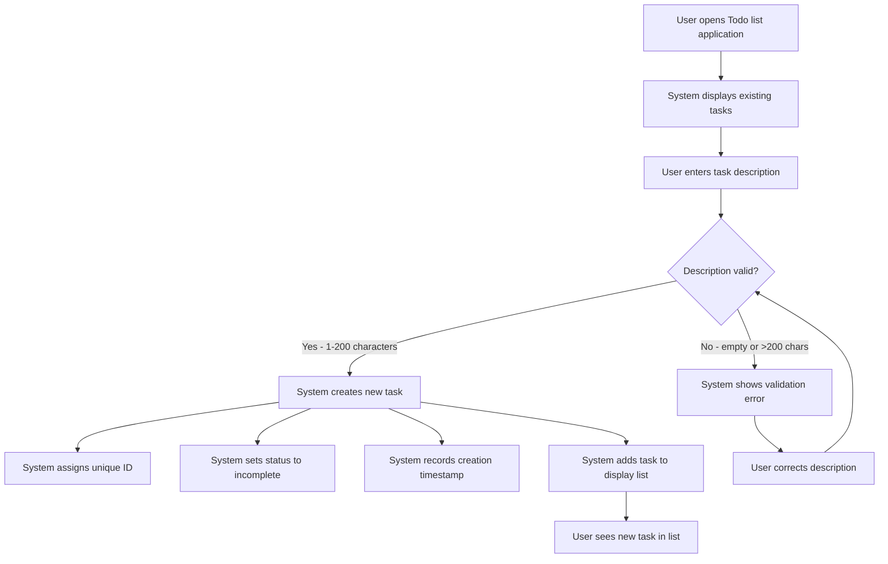
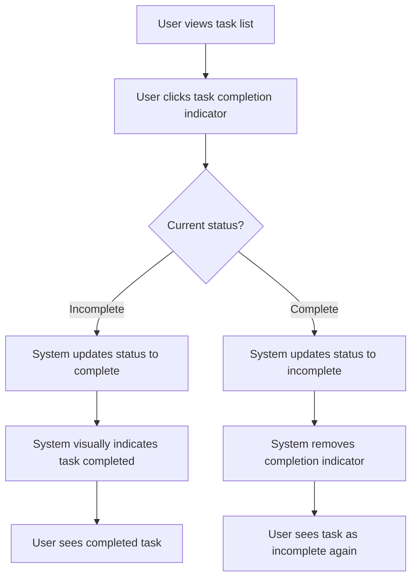
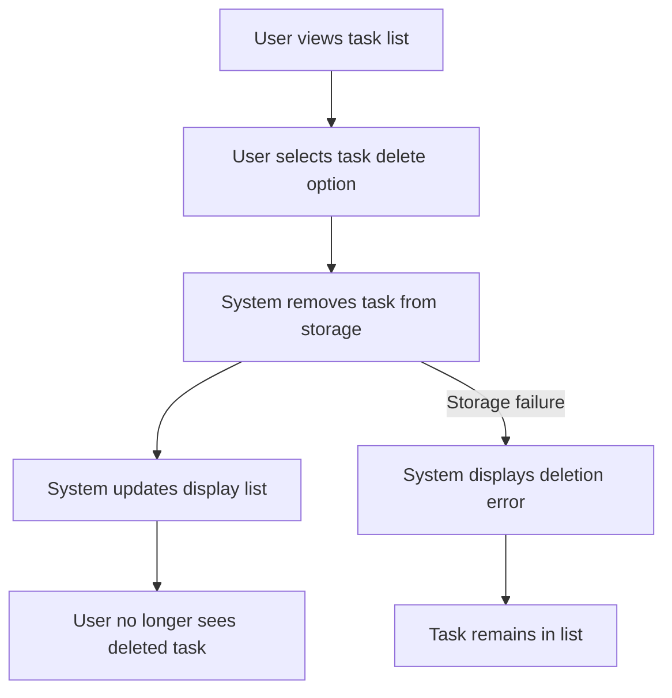

# Todo List Application - Functional Requirements

## Core Features

THE Todo list application SHALL provide users with the ability to create new tasks with descriptive text.

THE Todo list application SHALL provide users with the ability to mark existing tasks as completed.

THE Todo list application SHALL provide users with the ability to delete tasks they no longer need.

THE Todo list application SHALL display all tasks to the user in a single organized list.

THE Todo list application SHALL maintain task descriptions with a maximum length of 200 characters.

THE Todo list application SHALL track completion status for each task as either complete or incomplete.

## Task Management

WHEN a user opens the Todo list application, THE system SHALL display all existing tasks with their current completion status.

WHEN a user enters a task description and saves it, THE system SHALL create a new task with:
- A unique task identifier
- The provided task description text (1-200 characters)
- Completion status set to "incomplete" by default
- A creation timestamp

WHEN a user clicks on a task's completion indicator, THE system SHALL update that task's status from incomplete to complete.

WHEN a user clicks again on a completed task's completion indicator, THE system SHALL revert that task's status from complete to incomplete.

WHEN a user selects the delete option for a task, THE system SHALL permanently remove that task from storage and the display list.

WHEN a user attempts to create a task with no description text, THE system SHALL reject the creation request and display an error message.

WHEN a user attempts to create a task with more than 200 characters, THE system SHALL reject the creation request and notify the user of the character limit.

## User Workflows

### Task Creation Workflow

### Task Completion Workflow

### Task Deletion Workflow

## Business Rules

THE system SHALL assign a unique identifier to each task upon creation that remains constant throughout the task's existence in the system.

THE system SHALL limit each task description to exactly 200 characters maximum including spaces and special characters.

THE system SHALL accept task descriptions containing any combination of letters, numbers, spaces, and special characters within the 200 character limit.

THE system SHALL maintain exactly two completion status values: "complete" and "incomplete".

THE system SHALL set the default status of all newly created tasks to "incomplete".

THE system SHALL organize tasks in the display with incomplete tasks appearing before completed tasks.

THE system SHALL sort tasks within each status group by creation timestamp with newest tasks appearing later in their group.

THE system SHALL preserve all task data between browser sessions using local storage mechanisms.

THE system SHALL not require user authentication or registration for basic functionality.

THE system SHALL operate as a single-user application where all tasks belong to the current browser user.

## Error Handling

IF a user attempts to create a task with an empty description, THEN THE system SHALL reject the submission and display an error message: "Task description cannot be empty".

IF a user attempts to create a task with more than 200 characters, THEN THE system SHALL reject the submission and display an error message: "Task description exceeds 200 character limit".

IF the system encounters a storage failure when creating a task, THEN THE system SHALL display an error message: "Unable to save task. Please try again." while preserving the user's input in the entry field.

IF a user attempts to delete a task that no longer exists, THEN THE system SHALL gracefully handle the request without error and refresh the task list to show current valid tasks.

IF the system encounters a storage failure when deleting a task, THEN THE system SHALL display an error message: "Unable to delete task. Please try again." and maintain the task in the display list.

IF the system encounters data corruption when loading tasks, THEN THE system SHALL attempt to recover valid tasks and display an error message: "Some tasks could not be loaded due to data corruption." while preserving recovered tasks.

IF a user performs any task operation during network connectivity issues, THEN THE system SHALL queue the operation locally and synchronize when connectivity is restored.

> *Developer Note: This document defines business requirements only. All technical implementations (architecture, APIs, database design, etc.) are at the discretion of the development team.*