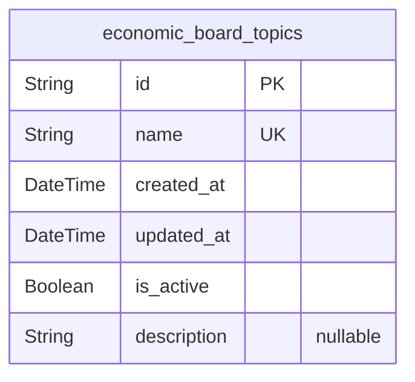
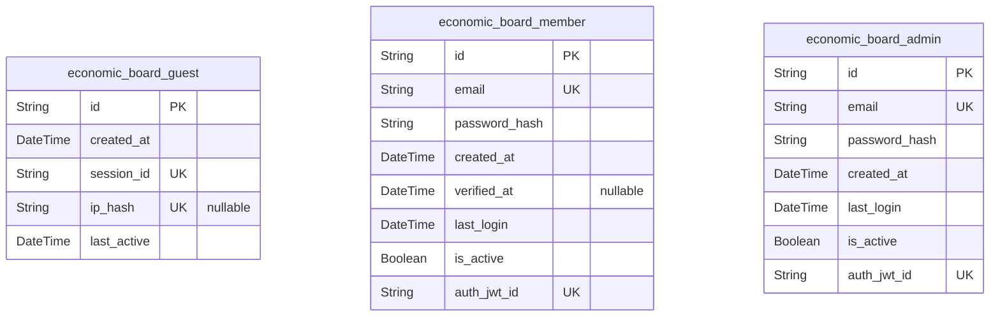
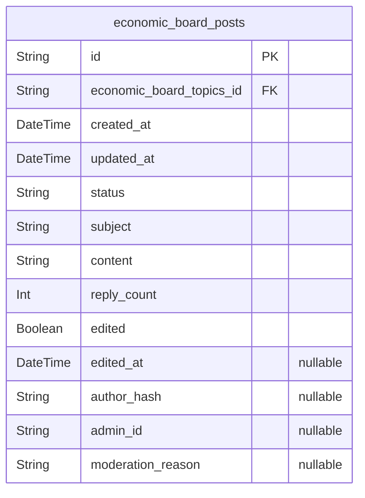
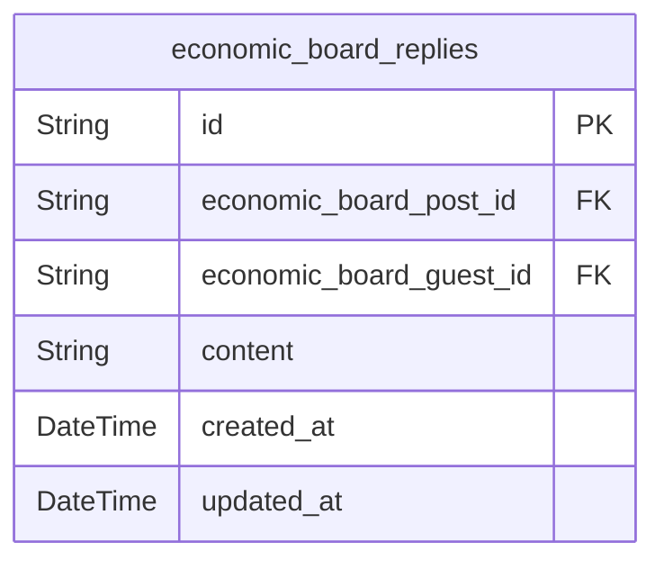

# Prisma Markdown

> Generated by [`prisma-markdown`](https://github.com/samchon/prisma-markdown)

- [Systematic](#systematic)
- [Actors](#actors)
- [Posts](#posts)
- [Replies](#replies)

## Systematic

### `economic_board_topics`

System-defined topic categories for the economic/political discussion
board. These are fixed, immutable categories that govern content
organization and filtering across the platform. All posts must reference
exactly one of these predefined topics.

Properties as follows:

- `id`: Primary Key.
- `name`
  > The exact name of the topic category. Must be one of the seven predefined
  > system values: "Inflation", "Tax Policy", "Elections", "Global Trade",
  > "Monetary Policy", "Labor Markets", "Fiscal Policy".
- `created_at`
  > Timestamp when this topic category was initially registered in the
  > system. Immutable after creation.
- `updated_at`
  > Timestamp of the last modification to this topic's metadata. Always equal
  > to created_at since topic names are immutable after creation.
- `is_active`
  > Indicates whether this topic is currently available for new post
  > creation. Topics may be deactivated if unused for 90+ days but historical
  > posts retain their original topic reference.
- `description`
  > Optional human-readable description explaining the scope and purpose of
  > this topic category.

## Actors

### `economic_board_guest`

Represents an anonymous visitor to the economic discussion board. This
model tracks guest interactions for moderation and system behavior
without requiring authentication.

Properties as follows:

- `id`: Primary Key.
- `created_at`: Timestamp when the guest first accessed the system or interacted with it.
- `session_id`
  > Unique session identifier generated by the system to persist guest state
  > across interactions.
- `ip_hash`
  > Cryptographic hash of the guest's IP address for moderation and abuse
  > detection. No personal identifying information is stored.
- `last_active`: The last timestamp when the guest performed any action on the system.

### `economic_board_member`

Represents an authenticated user who can create posts and replies. Each
member has a persistent identity tracked across sessions via secure JWT
authentication.

Properties as follows:

- `id`: Primary Key.
- `email`
  > Unique email address used for account registration and verification. Must
  > be validated before full privileges are granted.
- `password_hash`: Hashed password for authentication. Never stores plain text passwords.
- `created_at`: Timestamp when the member account was registered.
- `verified_at`: Timestamp when email verification was completed. Null until verified.
- `last_login`: The most recent successful login timestamp.
- `is_active`
  > Flag indicating whether the member account is active. If false, account
  > is suspended and cannot post or log in.
- `auth_jwt_id`: UUID of the current active JWT token for session management.

### `economic_board_admin`

Represents a privileged user with moderation permissions to approve,
reject, or delete posts. Admin accounts are pre-configured by the system
owner and cannot be registered by users.

Properties as follows:

- `id`: Primary Key.
- `email`
  > Email address of the admin. Must match a pre-approved list defined in
  > system configuration.
- `password_hash`
  > Hashed password for admin authentication. Never stores plain text
  > passwords.
- `created_at`: Timestamp when the admin account was provisioned by the system owner.
- `last_login`: The most recent successful admin login timestamp.
- `is_active`
  > Flag indicating whether the admin account is active. If false, login and
  > moderation access are denied.
- `auth_jwt_id`: UUID of the current active JWT token for admin session management.

## Posts

### `economic_board_posts`

Core economic and political discussion posts, each associated with a
topic and subject to moderation lifecycle.

Properties as follows:

- `id`: Primary Key.
- `economic_board_topics_id`: Topic that this post belongs to. [economic_board_topics.id](#economic_board_topics).
- `created_at`: Timestamp when the post was submitted.
- `updated_at`: Timestamp when the post was last edited.
- `status`
  > Moderation status of the post: 'pending', 'published', 'rejected', or
  > 'deleted'.
- `subject`: Brief title or subject line of the post (max 120 characters).
- `content`: Full text content of the post (max 5,000 characters).
- `reply_count`: Number of direct replies to this post.
- `edited`: Whether this post has been edited after initial submission.
- `edited_at`: Timestamp of last edit. Null if never edited.
- `author_hash`
  > System-generated anonymous identifier derived from IP and timestamp for
  > guest posts.
- `admin_id`: ID of admin who last modified status (approve/reject/delete).
- `moderation_reason`
  > Reason provided by admin for rejection or deletion. Null if not
  > rejected/deleted.

## Replies

### `economic_board_replies`

Replies to economic/political forum posts. Each reply is automatically
published without moderation, forms a threaded relationship with a parent
post, and has constrained content length for concise responses. Archived
for read-performance optimization without user authentication.

Properties as follows:

- `id`: Primary Key.
- `economic_board_post_id`
  > Reference to the parent economic board post that this reply answers.
  > [economic_board_posts.id](#economic_board_posts).
- `economic_board_guest_id`
  > Reference to the anonymous guest who submitted this reply. {@link
  > economic_board_guest.id}.
- `content`
  > The text content of the reply. Must be between 5 and 1,000 characters as
  > per business rules.
- `created_at`: Timestamp when the reply was submitted in ISO 8601 format (UTC).
- `updated_at`: Timestamp when the reply was last modified. Initially set to created_at.
